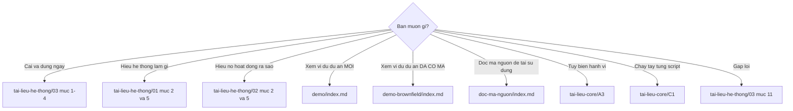

# Tài liệu BMAD-METHOD v6 (tiếng Việt)

> Bộ tài liệu tự biên soạn về **BMAD-METHOD v6.10.0** — đặc tả, thiết kế, vận hành, và demo chạy thực tế.
>
> **Đây không phải bản fork của BMAD-METHOD.** Repo này chỉ chứa tài liệu; mã nguồn BMAD gốc nằm tại [bmad-code-org/BMAD-METHOD](https://github.com/bmad-code-org/BMAD-METHOD) (giấy phép MIT).

---

## Bộ tài liệu

### 📘 [`tai-lieu-he-thong/`](./tai-lieu-he-thong/README.md) — Tài liệu hệ thống

| File | Trả lời câu hỏi |
| --- | --- |
| [README.md](./tai-lieu-he-thong/README.md) | Mục lục + tra cứu nhanh theo chủ đề |
| [01-dac-ta-he-thong.md](./tai-lieu-he-thong/01-dac-ta-he-thong.md) | Hệ thống làm **cái gì**? — 9 nhóm FR, 6 nhóm NFR, giao diện, dữ liệu, quy tắc nghiệp vụ |
| [02-thiet-ke-he-thong.md](./tai-lieu-he-thong/02-thiet-ke-he-thong.md) | Hệ thống làm **như thế nào**? — kiến trúc 4 tầng, render engine, 9 ADR, ma trận truy vết |
| [03-van-hanh-he-thong.md](./tai-lieu-he-thong/03-van-hanh-he-thong.md) | **Dùng và duy trì** ra sao? — cài đặt, cấu hình, tùy biến, khắc phục sự cố |

### 📗 [`tai-lieu-core/`](./tai-lieu-core/index.md) — Module CORE chi tiết

Dành cho việc **đọc hiểu và vận hành thủ công** module `core`.

| Nhóm | File |
| --- | --- |
| **Cơ chế nền tảng** | [A1 Tổng quan](./tai-lieu-core/A1-tong-quan-module-core.md) · [A2 Giải phẫu skill](./tai-lieu-core/A2-giai-phau-mot-skill.md) · [A3 Cấu hình & tùy biến](./tai-lieu-core/A3-cau-hinh-va-tuy-bien.md) · [A4 Script dùng chung](./tai-lieu-core/A4-script-dung-chung.md) · [A5 Giao thức kích hoạt](./tai-lieu-core/A5-giao-thuc-kich-hoat.md) |
| **Từng skill** | [B1 bmad-help](./tai-lieu-core/B1-bmad-help.md) · [B2 advanced-elicitation](./tai-lieu-core/B2-bmad-advanced-elicitation.md) · [B3 review](./tai-lieu-core/B3-bmad-review.md) · [B4 customize](./tai-lieu-core/B4-bmad-customize.md) · [B5 brainstorming](./tai-lieu-core/B5-bmad-brainstorming.md) · [B6 deep-recon](./tai-lieu-core/B6-bmad-deep-recon.md) · [B7 forge-idea](./tai-lieu-core/B7-bmad-forge-idea.md) · [B8 party-mode](./tai-lieu-core/B8-bmad-party-mode.md) · [B9 v6-shims](./tai-lieu-core/B9-v6-shims.md) |
| **Thực hành** | [C1 Sổ tay vận hành thủ công](./tai-lieu-core/C1-so-tay-van-hanh-thu-cong.md) |

### 📙 [`demo/`](./demo/index.md) — Kịch bản chạy greenfield

Ví dụ cụ thể tuần tự: **gọi lệnh gì → đọc/ghi file nào → kết quả ra sao**.

Dự án demo: hệ thống quản lý kho vật tư xây dựng, làm mới từ đầu.

| Bước | File |
| --- | --- |
| 00 | [Bối cảnh](./demo/00-boi-canh.md) |
| 01 | [Cài đặt](./demo/01-cai-dat.md) |
| 02 | [Định hướng bằng bmad-help](./demo/02-dinh-huong.md) |
| 03 | [Pha 1 — Phân tích](./demo/03-pha1-phan-tich.md) |
| 04 | [Pha 2 — Lập kế hoạch](./demo/04-pha2-lap-ke-hoach.md) |
| 05 | [Pha 3 — Giải pháp](./demo/05-pha3-giai-phap.md) |
| 06 | [Pha 4 — Thực thi](./demo/06-pha4-thuc-thi.md) |
| 07 | [Review & Retrospective](./demo/07-review-va-retro.md) |
| 08 | [Bản đồ luồng dữ liệu](./demo/08-ban-do-luong-du-lieu.md) |

### 📕 [`demo-brownfield/`](./demo-brownfield/index.md) — Kịch bản chạy brownfield

Áp BMAD vào **dự án đã có mã nguồn**: 47.000 dòng, 3 năm tuổi, không tài liệu.

Dự án demo: API đơn hàng Node/Express, thêm chức năng hủy đơn hoàn tiền một phần.

| Bước | File |
| --- | --- |
| 00 | [Bối cảnh](./demo-brownfield/00-boi-canh.md) |
| 01 | [Cài đặt & định hướng](./demo-brownfield/01-cai-dat-va-dinh-huong.md) |
| 02 | [Thiết lập ngữ cảnh repo](./demo-brownfield/02-project-context.md) |
| 03 | [Phê chuẩn kiến trúc](./demo-brownfield/03-phe-chuan-kien-truc.md) |
| 04 | [Chốt phạm vi thay đổi](./demo-brownfield/04-chot-pham-vi.md) |
| 05 | [Thực thi](./demo-brownfield/05-thuc-thi.md) |
| 06 | [Ghi nhận sai sót & bảo trì](./demo-brownfield/06-ghi-nhan-va-bao-tri.md) |
| 07 | [So sánh hai đường](./demo-brownfield/07-so-sanh-hai-duong.md) |

### 📓 [`doc-ma-nguon/`](./doc-ma-nguon/index.md) — Hướng dẫn đọc mã nguồn tool

Đọc hiểu mã nguồn BMAD-METHOD để **tái sử dụng mẫu hình ở dự án khác**.

| # | File | Nội dung |
| --- | --- | --- |
| — | [Mục lục](./doc-ma-nguon/index.md) | Bản đồ mã nguồn, 7 kỹ thuật đáng mượn |
| 01 | [Bản đồ và đường đọc](./doc-ma-nguon/01-ban-do-va-duong-doc.md) | 6 đường đọc theo mục tiêu; file nào trả lời câu hỏi nào |
| 02 | [Tầng phân phối](./doc-ma-nguon/02-tang-phan-phoi.md) | Installer Node.js ~13k dòng |
| 03 | [Tầng runtime Python](./doc-ma-nguon/03-tang-runtime-python.md) | 5 script, thuật toán hợp nhất và kết xuất |
| 04 | [Tầng nội dung](./doc-ma-nguon/04-tang-noi-dung.md) | Nội dung là mã: logic nghiệp vụ trong văn xuôi |
| 05 | [Tầng chất lượng](./doc-ma-nguon/05-tang-chat-luong.md) | Validator, cổng chất lượng, CI/CD |
| 06 | [**Bảy mẫu hình tái sử dụng**](./doc-ma-nguon/06-mau-hinh-tai-su-dung.md) | ★ Mã thật + bản port + đánh đổi |
| 07 | [Áp dụng vào dự án của bạn](./doc-ma-nguon/07-ap-dung-vao-du-an-cua-ban.md) | 3 kịch bản kèm mã khởi đầu |

---

## Bắt đầu từ đâu

| Vai trò của bạn | Đọc theo thứ tự |
| --- | --- |
| **Người dùng mới, dự án mới** | `demo/` toàn bộ → `tai-lieu-he-thong/03` §1–4 |
| **Người nhận dự án kế thừa** | `demo-brownfield/` toàn bộ → `tai-lieu-core/A3` |
| **Trưởng nhóm / kiến trúc sư** | `tai-lieu-he-thong/01` → `02` §2, §12 → `03` §8 |
| **Người tùy biến hệ thống** | `tai-lieu-he-thong/03` §5 → `tai-lieu-core/A3` |
| **Người muốn hiểu sâu cơ chế** | `tai-lieu-core/` A1→A5 rồi B1→B9 → C1 |
| **Người muốn tái sử dụng mã nguồn** | `doc-ma-nguon/` 01 → 06 → 07 |

---

## Số liệu

| Hạng mục | Giá trị |
| --- | --- |
| Phiên bản BMAD được mô tả | 6.10.0 |
| Số file tài liệu | 47 |
| Sơ đồ Mermaid | 140+ |
| Module chính thức được mô tả | 7 (2 đóng gói + 5 ngoài) |
| Skill module `core` | 8 + 6 shim |
| Skill module `bmm` | 17 mục menu + 13 shim |
| Nền tảng AI hỗ trợ | ~50 |

---

## Nguồn

Toàn bộ tài liệu được biên soạn bằng cách **đọc trực tiếp mã nguồn** BMAD-METHOD v6.10.0:

| Đọc gì | Để mô tả |
| --- | --- |
| `src/core-skills/**`, `src/bmm-skills/**` | Skill, agent, workflow, template |
| `src/scripts/**` | Thời gian chạy tất định |
| `tools/installer/**` | Trình cài đặt và tích hợp IDE |
| `tools/skill-validator.md`, `tools/validate-*.js` | Chuẩn chất lượng |
| `bmad-modules.yaml`, `*/module.yaml`, `*/module-help.csv` | Đăng ký module và catalog |
| `docs/**` | Tài liệu chính thức để đối chiếu |
| `.github/workflows/**`, `package.json` | CI/CD và cổng chất lượng |

---

## Giấy phép

Tài liệu trong repo này mô tả BMAD-METHOD, một dự án **MIT** của BMad Code, LLC.
**BMad** và **BMAD-METHOD** là nhãn hiệu của BMad Code, LLC.

Liên kết chính thức: [Kho mã](https://github.com/bmad-code-org/BMAD-METHOD) · [Tài liệu](https://docs.bmad-method.org) · [Discord](https://discord.gg/gk8jAdXWmj)
