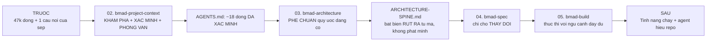

# 00 — Bối cảnh: dự án bạn vừa nhận

> [← Mục lục](./index.md) · Tiếp: [01 — Cài đặt & định hướng](./01-cai-dat-va-dinh-huong.md)

---

## 1. Câu chuyện

Bạn vừa vào công ty. Ngày thứ hai, sếp giao:

> *"Hệ thống đơn hàng cần thêm chức năng hủy đơn có hoàn tiền một phần. Khách đặt 10 món, giao 7, hủy 3 — phải hoàn đúng tiền 3 món đó cộng phí ship tương ứng. Làm được không?"*

Bạn mở repo `donhang-api`. Không có README hữu ích. Không có tài liệu kiến trúc. Người viết ban đầu nghỉ 8 tháng trước.

**Đây là tình huống mà brownfield workflow của BMad tồn tại để giải.**

---

## 2. Repo bạn nhận được

```
D:/du-an/donhang-api/
├── .git/                          # 1.847 commit, 3 năm
├── .github/workflows/ci.yml
├── package.json
├── README.md                      # 12 dòng, viết năm 2023, đã sai
├── .env.example
├── docs/
│   ├── api.md                     # OpenAPI cũ, thiếu 14 endpoint
│   └── setup-2023.md              # hướng dẫn cài đặt lỗi thời
├── src/
│   ├── index.js
│   ├── routes/                    # 23 file
│   ├── models/                    # 18 model Sequelize
│   ├── services/                  # 14 service
│   ├── jobs/                      # 6 cron job
│   ├── utils/
│   └── legacy/                    # 9 file, không ai dám đụng
├── migrations/                    # 84 migration
├── scripts/
│   └── seed.js
└── test/                          # 31 file test, phủ 23%
```

### Số liệu

```bash
$ cloc src/ --quiet
Language      files    blank   comment     code
JavaScript      118     4.812     2.103   47.229

$ git log --oneline | wc -l
1847

$ git log -1 --format=%cd
Mon Apr 14 16:22:08 2026 +0700

$ npx jest --coverage --silent 2>&1 | tail -3
All files          |   23.14 |    18.02 |   26.71 |   23.09
```

### `README.md` hiện có

```markdown
# donhang-api

API đơn hàng.

## Cài đặt

npm install
npm start

## Test

npm test
```

12 dòng. `npm start` **không chạy** — nó cần biến môi trường và một MySQL đang chạy. `npm test` chạy nhưng 4 test fail vì thiếu Redis.

---

## 3. Ba loại "sự thật" trong một dự án brownfield

```mermaid
graph TB
  A[Su that trong du an brownfield] --> B["1. MA NGUON NOI RA<br/>agent doc truc tiep, chinh xac hon ban sao"]
  A --> C["2. CONFIG NOI RA<br/>package.json, CI, Makefile"]
  A --> D["3. KHONG AI NOI — CHI NGUOI BIET"]

  B --> B1[Cau truc thu muc]
  B --> B2[Ten ham, chu ky]
  B --> B3[Quan he model]

  C --> C1[Lenh test, build, lint]
  C --> C2[Buoc CI]

  D --> D1["Vi sao legacy/ bi dong bang"]
  D --> D2["npm test can Redis chay truoc"]
  D --> D3["agent LUON quen buoc X"]
  D --> D4["thuat ngu 'don' co 2 nghia trong ma"]
  D --> D5["webhook thanh toan replay 6h/lan o staging"]

  B -.KHONG viet vao AGENTS.md.-> X1[Agent tu doc duoc]
  C -.KHONG viet vao AGENTS.md.-> X2[Doc tu nguon su that]
  D ==>|CHI CAI NAY| Y[AGENTS.md]
```

> **Đây là điểm dễ hiểu sai nhất.** Người mới dùng BMad thường mong nó "sinh tài liệu cho dự án cũ". Nó **cố tình không làm vậy** — vì bản sao sẽ lỗi thời, và **bị tính phí ở mọi phiên**.

---

## 4. Năm sự thật loại 3 trong `donhang-api`

Đây là những gì **không scan nào tìm ra** — bạn phải hỏi người, hoặc phát hiện qua sai lầm:

| # | Sự thật | Vì sao scan không tìm ra |
| --- | --- | --- |
| 1 | `src/legacy/` bị đóng băng — đang được thay dần bởi `src/services/` | Mã trông vẫn bình thường; không có comment nào nói |
| 2 | `npm test` cần `docker compose up -d` trước, nếu không 4 test fail khó hiểu | CI có bước đó nhưng `package.json` không nói |
| 3 | Từ "đơn" trong mã có **hai** nghĩa: `Order` (đơn khách đặt) và `PurchaseOrder` (đơn nhập hàng) — hai model khác nhau | Cả hai đều tên tiếng Việt là "đơn" trong biến và comment |
| 4 | Webhook thanh toán **replay 6 giờ/lần** ở staging — handler phải idempotent | Hành vi runtime của nhà cung cấp, không có trong repo |
| 5 | Agent AI liên tục thêm cú pháp `jest` vào file dùng `vitest` (dự án đang migrate dở) | Cả hai đều có trong `package.json` |

Sự thật #5 là loại **chỉ có bằng chứng quan sát mới admit được** — không phải suy đoán từ việc thấy hai thư viện test.

---

## 5. Điều gì sẽ xảy ra



**Ước lượng thời gian:**

| Bước | Thời gian người | Ghi chú |
| --- | --- | --- |
| Cài đặt | 4 phút | |
| `bmad-project-context` | **60–90 phút** | Phần lớn là phỏng vấn — đây là nơi giá trị nằm |
| `bmad-architecture` (ratify) | 45 phút | Nhiều hơn greenfield vì phải đọc mã |
| `bmad-spec` | 25 phút | |
| `bmad-build` | 40 phút | |

> **`bmad-project-context` là bước đắt nhất và đáng giá nhất.** Mọi bước sau đều tự nạp khối `AGENTS.md` qua `persistent_facts`, nên công sức bỏ ra ở đây được thu hồi ở **mọi phiên sau**.

---

## 6. Thư mục sau khi chạy xong

```
D:/du-an/donhang-api/
├── .claude/skills/                 ← 39 skill
├── _bmad/                          ← runtime BMad
│   ├── config.toml
│   ├── config.user.toml
│   ├── _config/
│   ├── core/  bmm/  scripts/  custom/  render/
├── _bmad-output/
│   ├── planning-artifacts/
│   │   └── ARCHITECTURE-SPINE.md   ← RÚT RA từ mã, không phát minh
│   ├── specs/
│   │   └── spec-huy-don-hoan-tien-mot-phan/
│   │       ├── SPEC.md
│   │       └── .memlog.md
│   └── implementation-artifacts/
│       └── spec-huy-don-hoan-tien-mot-phan.md
├── AGENTS.md                       ← ★ TẠO PHẨM QUAN TRỌNG NHẤT
├── src/
│   ├── services/
│   │   └── cancellation.js         ← MỚI
│   └── routes/
│       └── orders.js               ← SỬA
├── test/
│   └── cancellation.test.js        ← MỚI
└── README.md                       ← không đụng tới
```

---

## 7. Ba câu hỏi trước khi bắt đầu

### "Tôi có phải làm PRD cho cả hệ thống không?"

**Không.** PRD dành cho **phần thay đổi**, không phải cho toàn bộ dự án đã tồn tại.

Với thay đổi có phạm vi rõ như "hủy đơn hoàn tiền một phần", **`bmad-spec`** phù hợp hơn `bmad-prd`:

| | `bmad-prd` | `bmad-spec` |
| --- | --- | --- |
| Dành cho | Sản phẩm hoặc sáng kiến lớn | **Bất kỳ đầu vào mang ý định nào** |
| Đầu ra | `prd.md` + addendum + memlog | `SPEC.md` kernel 5 trường + companion |
| Bắt buộc trong luồng BMM | Có | Không |
| Phù hợp brownfield | Khi thêm cả một module lớn | **Khi thêm một tính năng vào hệ thống có sẵn** |

### "Có phải chạy `bmad-architecture` không? Kiến trúc đã có rồi mà."

**Có, nhưng vai trò khác.** Ở brownfield nó **phê chuẩn** thay vì thiết kế:

> *read enough of the real code to **ratify the conventions already there rather than invent new ones** — and **don't re-tell the user what the scan already shows**.*

Kết quả là một spine ghi lại **bất biến thật sự đang chi phối mã**, để story mới không phá chúng. Không phải một tài liệu kiến trúc mơ ước.

### "`docs/` của tôi đã lỗi thời rồi, có nên xóa không?"

Theo `docs/how-to/established-projects.md`:

> *a bloated `docs/` folder is **a source to verify against code, not something to add to**.*

Nghĩa là: `bmad-project-context` **đọc** `docs/` như một nguồn để **đối chiếu với mã**, phát hiện chỗ nào đã sai, và **không** nhân bản nội dung của nó vào `AGENTS.md`.

Nếu một dòng trong `docs/api.md` mâu thuẫn với mã theo cách làm agent hành xử sai, skill sẽ **đề xuất sửa file đó** — vì:

> *Two live contradictory instructions is **a defect**.*

---

**Tiếp:** [01 — Cài đặt & định hướng](./01-cai-dat-va-dinh-huong.md) · [← Mục lục](./index.md)
