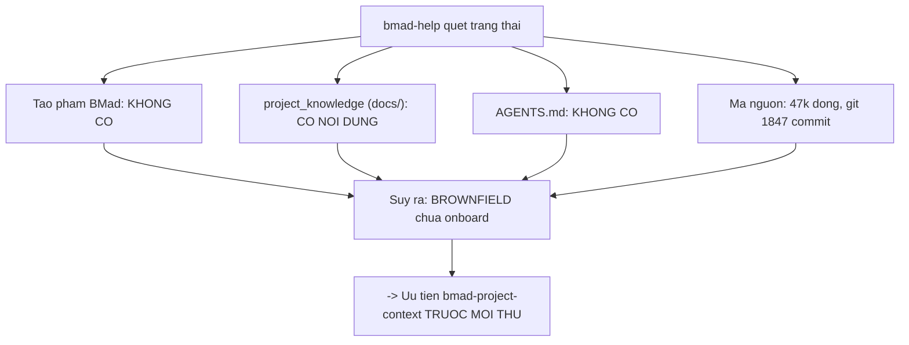

# 01 — Cài đặt và định hướng

> [← Mục lục](./index.md) · Trước: [00 — Bối cảnh](./00-boi-canh.md) · Tiếp: [02 — Project context](./02-project-context.md)

---

## 1. Cài đặt

Giống greenfield về cơ chế — xem [demo greenfield 01](../demo/01-cai-dat.md) để biết chi tiết từng bước. Ở đây chỉ nêu **khác biệt**.

```bash
$ cd D:/du-an/donhang-api
$ npx bmad-method install
```

### ⚠️ Khác biệt 1 — thư mục `docs/` đã tồn tại

```
◆  Where should long-term project knowledge be stored?
│  (docs, research, references)
│  docs
└
```

🛑 **HALT**

Dự án đã có `docs/` với nội dung lỗi thời. Hai lựa chọn:

| Chọn | Hệ quả |
| --- | --- |
| `docs` (mặc định) | `project_knowledge` trỏ vào thư mục có sẵn. Các skill sẽ đọc nó làm ngữ cảnh nền — kể cả phần đã sai |
| `docs/ai-context` | Tách bạch: tài liệu cũ giữ nguyên, tri thức mới cho AI vào thư mục riêng |

**Khuyến nghị:** giữ `docs` **nếu** bạn định để `bmad-project-context` đối chiếu và sửa nó. Chọn thư mục riêng nếu `docs/` quá lớn và bạn chưa muốn động vào.

Demo này chọn `docs`.

### ⚠️ Khác biệt 2 — `.gitignore` đã có

Installer **không** sửa `.gitignore` của bạn. Bạn tự thêm:

```gitignore
# BMad — nội dung tái tạo được
_bmad/core/
_bmad/bmm/
_bmad/scripts/
_bmad/_config/
_bmad/render/
_bmad/config.user.toml
_bmad/custom/*.user.toml
.claude/skills/bmad-*
```

### ⚠️ Khác biệt 3 — kiểm tra xung đột với cấu hình AI có sẵn

```bash
$ ls -la | grep -E "^\.|AGENTS|CLAUDE"
drwxr-xr-x  .github/
-rw-r--r--  .env.example
-rw-r--r--  .gitignore
```

Không có `AGENTS.md`, không có `CLAUDE.md`, không có `.cursorrules`. **Sạch.**

Nếu **có**, `bmad-project-context` sẽ đọc chúng ở bước 1 và báo cáo chúng đo được thế nào — nó **cải thiện** chứ không đè.

---

## 2. Kết quả cài đặt

```
◇  Configuring IDE integrations ─────────────────────────
│  ✓ claude-code — 39 skills installed to .claude/skills

└  Installation complete!

┌─ Installation Summary ──────────────────────────────────┐
│  Version:      6.10.0                                   │
│  Directory:    D:/du-an/donhang-api                     │
│  Modules:      core, bmm                                │
│  Skills:       39                                       │
│  Agents:       5                                        │
│  IDE:          claude-code                              │
│  Output:       _bmad-output                             │
└─────────────────────────────────────────────────────────┘
```

📄 **`_bmad/config.toml`**

```toml
[core]
project_name = "donhang-api"
document_output_language = "Vietnamese"
output_folder = "D:/du-an/donhang-api/_bmad-output"

[modules.bmm]
planning_artifacts = "D:/du-an/donhang-api/_bmad-output/planning-artifacts"
implementation_artifacts = "D:/du-an/donhang-api/_bmad-output/implementation-artifacts"
project_knowledge = "D:/du-an/donhang-api/docs"

[agents.bmad-agent-analyst]
# ... 5 agent như greenfield
```

---

## 3. Định hướng bằng `bmad-help`

**Cửa sổ ngữ cảnh mới:**

```
> bmad-help tôi vừa nhận một API Node/Express 47k dòng, không tài liệu,
  cần thêm chức năng hủy đơn hoàn tiền một phần. Bắt đầu từ đâu?
```

### 3.1 Điều gì xảy ra bên trong

```bash
uv run D:/du-an/donhang-api/_bmad/scripts/resolve_config.py \
  --project-root D:/du-an/donhang-api
```

```json
{
  "core": {
    "project_name": "donhang-api",
    "document_output_language": "Vietnamese",
    "output_folder": "D:/du-an/donhang-api/_bmad-output",
    "user_name": "Thảo",
    "communication_language": "Vietnamese"
  },
  "modules": {
    "bmm": {
      "planning_artifacts": "D:/du-an/donhang-api/_bmad-output/planning-artifacts",
      "implementation_artifacts": "D:/du-an/donhang-api/_bmad-output/implementation-artifacts",
      "project_knowledge": "D:/du-an/donhang-api/docs",
      "user_skill_level": "intermediate"
    }
  },
  "agents": { "...": "..." }
}
```

Rồi quét:

```bash
$ ls _bmad-output/planning-artifacts/        # không tồn tại
$ ls _bmad-output/implementation-artifacts/  # không tồn tại
$ ls docs/                                   # api.md  setup-2023.md   ← CÓ NỘI DUNG
$ ls AGENTS.md                               # không tồn tại
```



> `bmad-help` đọc `docs/` làm **ngữ cảnh nền**, nhưng có ràng buộc cứng: *"Never fabricate project-specific details."* Nó sẽ không suy đoán kiến trúc từ hai file tài liệu lỗi thời.

### 3.2 Đầu ra

```
📋 Chào Thảo!

Đây là một dự án **brownfield chưa được onboard** — có mã nguồn thật
(47k dòng, 1.847 commit) nhưng chưa có tạo phẩm BMad nào và chưa có
AGENTS.md.

Với brownfield, thứ tự khác hẳn greenfield. Đừng bắt đầu bằng PRD.

───────────────────────────────────────────────────────────────
BƯỚC ĐẦU TIÊN — làm trước mọi thứ khác
───────────────────────────────────────────────────────────────

  [PC] Project Context — `bmad-project-context`
       Đây là on-ramp cho brownfield. Nó đọc cái bạn đã có, báo cáo
       nó đo được thế nào, hỏi bạn muốn áp quy tắc gì, rồi khám phá
       và XÁC MINH phần còn lại — chạy mọi lệnh trước khi ghi nó xuống.

       Kết quả: một khối nhỏ đã xác minh trong AGENTS.md, không phải
       một đống tài liệu sinh tự động.

       → AGENTS.md (khối bmad:context)

       ⚠️ Tôi thấy docs/ của bạn có api.md và setup-2023.md. Skill này
       sẽ đọc chúng như NGUỒN ĐỂ ĐỐI CHIẾU VỚI MÃ, không phải thứ để
       nhân bản vào AGENTS.md. Nếu có chỗ mâu thuẫn với mã, nó sẽ đề
       xuất sửa file đó.

───────────────────────────────────────────────────────────────
SAU ĐÓ — cho việc bạn được giao
───────────────────────────────────────────────────────────────

  [CA] Architecture — `bmad-architecture`
       Ở brownfield vai trò là PHÊ CHUẨN, không phải thiết kế. Nó đọc
       đủ mã thật để chuẩn hóa các quy ước ĐANG CÓ thành bất biến, để
       thay đổi mới không phá chúng.
       → _bmad-output/planning-artifacts/ARCHITECTURE-SPINE.md

  [SPC] Spec — `bmad-spec [path]`
       Chốt "CÁI GÌ" trước "NHƯ THẾ NÀO" cho riêng phần thay đổi. Với
       một tính năng có phạm vi rõ như của bạn, cái này phù hợp hơn PRD.
       → _bmad-output/specs/spec-{slug}/SPEC.md

  [BD] Build — `bmad-build`
       Thực thi.
       → _bmad-output/implementation-artifacts/

───────────────────────────────────────────────────────────────
CÓ THỂ BỎ QUA
───────────────────────────────────────────────────────────────

  [PRD] `bmad-prd` — PRD dành cho sản phẩm hoặc sáng kiến lớn. Việc
        của bạn là một tính năng trong hệ thống đã có. bmad-spec gọn
        hơn và đủ.

  Pha 1 (brainstorming, forge-idea, deep-recon) — yêu cầu của bạn đã
  rõ ("hủy đơn hoàn tiền một phần"), không cần mở rộng không gian vấn đề.

───────────────────────────────────────────────────────────────

💡 Chạy mỗi workflow trong một cửa sổ ngữ cảnh mới.

Đường tôi khuyên:

  bmad-project-context  →  bmad-architecture  →  bmad-spec  →  bmad-build

Lưu ý: bmad-project-context là bước tốn thời gian nhất (60–90 phút, phần
lớn là phỏng vấn). Nhưng khối AGENTS.md nó tạo ra được TỰ ĐỘNG nạp bởi
mọi skill sau qua persistent_facts, nên công sức đó thu hồi ở mọi phiên.

Chạy `bmad-project-context` luôn nhé?
```

🛑 **HALT**

---

## 4. Vì sao `bmad-help` biết đây là brownfield

Nó **không** có cờ "brownfield" nào. Nó suy ra từ bằng chứng:

| Bằng chứng | Suy ra |
| --- | --- |
| `_bmad-output/` rỗng | Chưa dùng BMad bao giờ |
| `docs/` có nội dung | Dự án đã có lịch sử |
| Không có `AGENTS.md` | Chưa onboard cho AI |
| Câu hỏi nhắc "47k dòng, không tài liệu" | Người dùng nói rõ |

Cộng với `module-help.csv`:

```csv
BMad Method,bmad-project-context,Project Context,PC,"Set up or refresh a repo's agent instructions so AI agents work well in it: verified commands, policy, conventions that differ from defaults, and known pitfalls. Setup, refresh, record, and audit — replaces document-project and generate-project-context.",,,anytime,,,false,repo root,AGENTS.md managed block
```

Cột `description` mang ngữ cảnh định tuyến — `bmad-help` đọc nó như **gợi ý điều hướng**, không chỉ text hiển thị.

---

## 5. Tự kiểm tra bằng tay

```bash
$ R="$(pwd)"

# Mục nào là cổng bắt buộc?
$ awk -F',' 'NR>1 && $11=="true" { printf "[%s] %s\n", $4, $2 }' _bmad/_config/bmad-help.csv
[PRD] bmad-prd
[CA] bmad-architecture
[CE] bmad-create-epics-and-stories
[SP] bmad-sprint-planning
[BD] bmad-build

# bmad-project-context có phải cổng bắt buộc không?
$ grep "bmad-project-context" _bmad/_config/bmad-help.csv | cut -d',' -f11
false
```

> **`bmad-project-context` KHÔNG bắt buộc** trong catalog. Nhưng với brownfield nó là **khuyến nghị mạnh nhất**, vì mọi skill sau đều mặc định nạp `file:{project-root}/**/project-context.md` qua `persistent_facts` — và khối `AGENTS.md` đóng vai trò tương đương.

---

## 6. Tóm tắt bước này

| Loại | Chi tiết |
| --- | --- |
| Lệnh | `npx bmad-method install`, `bmad-help <câu hỏi>` |
| Script chạy | `resolve_config.py` ×1 |
| 👁️ Đọc | `bmad-help.csv`, `config.toml`, `config.user.toml`, quét `docs/`, `_bmad-output/`, `AGENTS.md` |
| 📄 Ghi | `_bmad/**` (cài đặt), `.claude/skills/**` |
| 🛑 Điểm dừng | 12 (cài đặt) + 1 (help) |
| ⚠️ Cạm bẫy brownfield | 3 (thư mục `docs/` sẵn có, `.gitignore`, xung đột cấu hình AI) |
| Thời gian | ~5 phút |

---

**Tiếp:** [02 — Thiết lập ngữ cảnh repo](./02-project-context.md) · [← Mục lục](./index.md)
