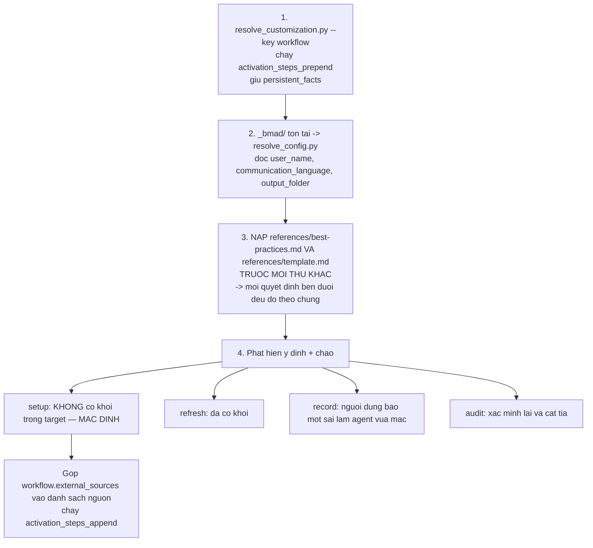
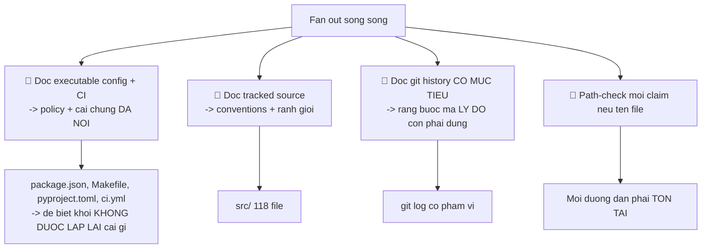
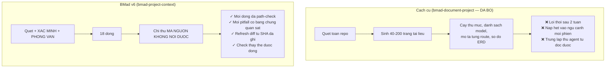

# 02 — Thiết lập ngữ cảnh repo (`bmad-project-context`)

> [← Mục lục](./index.md) · Trước: [01 — Cài đặt](./01-cai-dat-va-dinh-huong.md) · Tiếp: [03 — Phê chuẩn kiến trúc](./03-phe-chuan-kien-truc.md)

**Đây là bước quan trọng nhất của brownfield.** Nó tốn 60–90 phút, và mọi bước sau đều hưởng lợi.

---

## 1. Lệnh

**Cửa sổ ngữ cảnh mới:**

```
> bmad-project-context
```

> Skill này **bắt buộc gọi bằng tên** (`Must be invoked by name` trong description) — nó sẽ không tự kích hoạt.

---

## 2. Kích hoạt



**Lệnh thật:**

```bash
uv run D:/du-an/donhang-api/_bmad/scripts/resolve_customization.py \
  --skill D:/du-an/donhang-api/.claude/skills/bmad-project-context --key workflow
```

```json
{
  "workflow": {
    "activation_steps_prepend": [],
    "activation_steps_append": [],
    "persistent_facts": [],
    "external_sources": [],
    "on_complete": ""
  }
}
```

```bash
uv run D:/du-an/donhang-api/_bmad/scripts/resolve_config.py \
  --project-root D:/du-an/donhang-api
```

```
👁️ .claude/skills/bmad-project-context/references/best-practices.md
👁️ .claude/skills/bmad-project-context/references/template.md
```

```
📊 Chào Thảo!

Không tìm thấy khối `<!-- bmad:context -->` nào trong AGENTS.md — nên
đây là **setup**.

Trước khi làm gì, mình cần nói rõ cái này sẽ KHÔNG làm: nó không sinh
tài liệu về repo của bạn. Phép thử mình dùng cho mọi dòng là:

  "Agent có tự đọc repo và suy ra được điều này không?
   Nếu CÓ → để nó ra ngoài."

Vì một bản sao sẽ lỗi thời, và nó bị tính phí ở MỌI phiên.

Cái mình viết xuống là thứ **mã nguồn không nói được**.

Bắt đầu bước 1: đánh giá cái bạn đã có.
```

---

## 3. Bước 1 — Đánh giá và báo cáo

> **Không ghi gì cho tới bước 5.**

```
👁️ AGENTS.md              (không tồn tại)
👁️ CLAUDE.md              (không tồn tại)
👁️ .cursorrules           (không tồn tại)
👁️ README.md              (12 dòng)
👁️ docs/api.md            (OpenAPI, 340 dòng)
👁️ docs/setup-2023.md     (86 dòng)
👁️ package.json
👁️ .github/workflows/ci.yml
```

```
📊 **Đánh giá**

| Cái đã có | Đo theo best-practices |
| --- | --- |
| `AGENTS.md` | Không có — đây là setup từ đầu |
| `README.md` (12 dòng) | `npm start` **sai** — thiếu biến môi trường và MySQL. `npm test` **chưa đủ** — 4 test fail vì thiếu Redis |
| `docs/api.md` (340 dòng) | Đặc tả OpenAPI. **Không thuộc khối** — agent đọc `src/routes/` chính xác hơn. Nhưng nó thiếu 14 endpoint so với mã → đây là **mâu thuẫn cần xử lý** |
| `docs/setup-2023.md` (86 dòng) | Hướng dẫn cài đặt lỗi thời (nhắc Node 16, dự án đang chạy Node 20). **Mâu thuẫn sống** |
| `package.json` | Có `test`, `start`, `lint`, `migrate`. Khối **không được lặp lại** những lệnh này |
| `.github/workflows/ci.yml` | Chạy `docker compose up -d` trước test, và có bước `npm run typecheck` mà `npm test` không phủ |

**Hai mâu thuẫn sống cần xử lý:**
1. `README.md` nói `npm start` chạy được — không đúng
2. `docs/setup-2023.md` nói Node 16 — dự án đang Node 20

Cả hai làm agent hành xử sai. Mình sẽ đề xuất sửa chúng ở bước 5.

**Đơn vị tách rời:** mình không thấy workspace manifest hay thư mục con
nào có build manifest riêng. Nên run này chỉ bao repo gốc.
```

> **Chú ý logic ở đây:** skill **không hỏi** "dự án có monorepo không?". Nó chỉ hỏi **khi có bằng chứng**:
>
> > *If the target contains separable units — a workspace manifest listing members, or directories carrying their own build manifest — name them and ask... **Absent that evidence, do not ask.***

---

## 4. Bước 2 — Hỏi bạn mang gì tới

```
📊 Bước 2: **những gì bạn mang tới** — đây là nửa mà không scan nào
với tới được.

Quy tắc phải theo bất kể repo làm gì:
  • Quản trị: quy tắc nhánh, ai duyệt, cái gì không được push
  • Bảo mật và tuân thủ
  • Chuẩn code, style guide
  • Vùng đóng băng — thư mục nào không được đụng

Và tài liệu bên ngoài: sổ tay nội bộ, wiki, tài liệu kiến trúc,
knowledgebase MCP. Cho mình đường dẫn, mình chưa đọc ngay.
```

🛑 **HALT**

```
> - Không push thẳng main, PR + 1 approval
> - src/legacy/ bị đóng băng, đang thay dần bởi src/services/. Không sửa,
>   chỉ xóa khi service tương ứng đã thay xong
> - Không commit file .env
> - Có wiki nội bộ ở https://wiki.congty.vn/donhang nhưng cũng lỗi thời
```

```
📊 Ghi nhận. Bốn mục:
  • Quy tắc nhánh (policy)
  • src/legacy/ đóng băng (policy) — mình sẽ path-check nó ở bước 3
  • .env (policy)
  • Wiki — mình sẽ không đọc vì bạn nói nó lỗi thời. Nếu có phần nào
    bạn tin là còn đúng, chỉ mình phần đó.
```

> **Đây là điểm mấu chốt của brownfield.** Trích SKILL.md:
>
> > *Greenfield: this is the whole content. **Brownfield: it is the half no scan reaches.***

---

## 5. Bước 3 — Khám phá và xác minh

🤖🤖🤖🤖 **Fan out subagent song song**, mỗi cái theo nhu cầu của một mục:



### 5.1 Kết quả subagent 1 — config và CI

```
🤖 package.json scripts:
     start:     node src/index.js
     test:      vitest run
     lint:      eslint src
     migrate:   sequelize-cli db:migrate
     typecheck: tsc --noEmit --allowJs

   .github/workflows/ci.yml:
     - docker compose up -d          ← TRƯỚC test
     - npm run migrate
     - npm test
     - npm run lint
     - npm run typecheck             ← npm test KHÔNG phủ cái này

   Phát hiện: package.json có CẢ jest lẫn vitest trong devDependencies.
   Script `test` dùng vitest. 3 file test cũ vẫn import từ '@jest/globals'.
```

### 5.2 Kết quả subagent 2 — quy ước từ mã

```
🤖 Quy ước quan sát được (đếm trên 118 file):

   • Truy cập DB: 112/118 file đi qua src/models/ (Sequelize).
     6 file còn lại dùng raw query — cả 6 đều trong src/legacy/.

   • Tiền tệ: 41 chỗ dùng số nguyên đơn vị VNĐ (không có phần thập phân).
     0 chỗ dùng float. Không có comment nào giải thích.

   • Xử lý lỗi: 89/94 route dùng middleware `asyncHandler` từ
     src/utils/asyncHandler.js. 5 route không dùng — cả 5 trong legacy.

   • Đặt tên: model dùng PascalCase số ít (Order, OrderItem).
     Bảng DB dùng snake_case số nhiều (orders, order_items).

   • ⚠️ HAI khái niệm "đơn":
       src/models/Order.js         — đơn khách đặt
       src/models/PurchaseOrder.js — đơn nhập hàng từ NCC
     Biến trong 23 file gọi cả hai là `don` hoặc `donHang`.
```

### 5.3 Kết quả subagent 3 — lịch sử có mục tiêu

```
🤖 git log có phạm vi:

   $ git log --oneline --all -- src/legacy/ | head -5
   (không có commit nào trong 8 tháng qua — khớp với "đóng băng")

   $ git log --grep="idempot" --oneline
   a3f9c21 fix: make payment webhook handler idempotent
   7b2e845 fix: duplicate refund on webhook replay

   $ git log --grep="jest\|vitest" --oneline | head -3
   c81f0a4 chore: migrate test runner to vitest
   2d5b193 fix: revert jest syntax in orders.test.js
   9e4a778 fix: revert jest syntax in payment.test.js
```

> **Hai commit `revert jest syntax` là bằng chứng quan sát được** — đúng loại mà `best-practices.md` cho phép admit:
>
> > *the same mistake **fixed repeatedly in history***

### 5.4 Path-check

```
🤖 Path-check:
   src/legacy/               ✓ tồn tại, 9 file
   src/services/             ✓ tồn tại, 14 file
   src/utils/asyncHandler.js ✓ tồn tại
   src/models/Order.js       ✓ tồn tại
   src/models/PurchaseOrder.js ✓ tồn tại
   .env                      ✗ không tracked (đúng — đã trong .gitignore)
```

---

## 6. Bước 4 — Phỏng vấn các khoảng trống

**Chỉ hỏi thứ không scan nào với tới.**

```
📊 Bốn câu, không quá tám. Mình đã cắt hết những gì scan trả lời được.

1. Ba lần trong lịch sử có commit "revert jest syntax". Bạn nhớ có phải
   agent AI làm không, hay người?

2. Có hai model Order và PurchaseOrder, và 23 file gọi cả hai là "đơn"
   trong tên biến. Điều này có gây nhầm thật không, hay chỉ trông rối?

3. Có commit "fix: duplicate refund on webhook replay". Webhook thanh
   toán replay trong hoàn cảnh nào?

4. Đơn vị tiền là số nguyên VNĐ ở 41 chỗ, không có comment giải thích.
   Đây là quy ước có chủ ý hay tình cờ?
```

🛑 **HALT**

> **Chú ý những gì skill KHÔNG hỏi:**
>
> | Không hỏi | Vì sao |
> | --- | --- |
> | "Lệnh test là gì?" | `package.json` đã nói |
> | "Cấu trúc thư mục thế nào?" | Agent tự đọc |
> | "Dùng ORM nào?" | Scan đã thấy Sequelize |
> | "src/legacy/ có tồn tại không?" | Đã path-check |
>
> > *Never ask what a scan could answer. **Asking the user to confirm a path-checked claim, or one a config file already states, is a defect.***

**Bạn trả lời:**

```
> 1. Cả ba đều là AI. Nó thấy jest trong package.json rồi tự động dùng
>    cú pháp jest. Tôi phải sửa mỗi lần.
>
> 2. Nhầm thật. Tháng trước một dev mới sửa nhầm PurchaseOrder khi được
>    giao sửa Order. Mất nửa ngày.
>
> 3. Staging thôi. Cổng thanh toán gửi lại webhook 6 tiếng/lần nếu chưa
>    nhận được 200. Production không bị vì có ack đúng.
>
> 4. Có chủ ý. VNĐ không có xu, và float từng gây lệch 1 đồng khi tính
>    chiết khấu. Nhưng không ai viết xuống.
```

```
📊 Bốn câu trả lời, bốn dòng ứng viên. Còn một batch nữa:

5. Ngoài jest/vitest, agent AI còn hay làm sai gì trong repo này?

6. `npm test` fail 4 test khi chưa chạy `docker compose up -d`. Lỗi có
   dễ hiểu không, hay khó đoán?

7. Có endpoint hay module nào mà đụng vào là nguy hiểm ngoài legacy/?
```

🛑 **HALT**

```
> 5. Hay quên chạy migrate sau khi sửa model. Rồi test fail với lỗi
>    "column does not exist" mà không hiểu vì sao.
>
> 6. Rất khó đoán. Nó fail với "ECONNREFUSED 127.0.0.1:6379" — không
>    nói gì về docker compose.
>
> 7. src/jobs/reconcile.js — cron chạy 2h sáng đối soát với ngân hàng.
>    Sửa sai là lệch sổ. Nhưng nó không đóng băng, chỉ cần cẩn thận.
```

```
📊 Batch này ra ba dòng nữa. Batch tiếp theo mình đoán sẽ không ra gì
mới, nên chuyển sang viết.
```

> Quy tắc: *"Batches of **at most eight**; fewer is better. **A batch yielding nothing new means write.**"*

---

## 7. Bước 5 — Hiện khối, rồi mới ghi

### 7.1 Đề xuất check thay vì prose

```
📊 Trước khi soạn, với mỗi ứng viên mình hỏi: có hook, lint rule, hay
CI check nào ép được nó tốt hơn văn xuôi không?

| Ứng viên | Có check ép được không? | Đề xuất |
| --- | --- | --- |
| Cú pháp jest trong file vitest | **CÓ** | Thêm eslint rule `no-restricted-imports` cấm `@jest/globals`. Nếu bạn từ chối, dòng prose là fallback |
| Quên migrate sau khi sửa model | **CÓ, một phần** | Thêm bước CI so sánh model với migration. Phức tạp — dòng prose trước, check sau |
| `docker compose up -d` trước test | **CÓ** | Thêm `pretest` script vào package.json. Nhưng nó làm CI chạy 2 lần → dòng prose tốt hơn |
| src/legacy/ đóng băng | Không (policy) | Dòng prose |
| Order vs PurchaseOrder | Không (khái niệm) | Dòng prose |
| Tiền là số nguyên VNĐ | Một phần (lint số float) | Dòng prose — lint không bắt được ngữ nghĩa |
| Webhook replay | Không (runtime) | Dòng prose |
| reconcile.js nguy hiểm | Không | Dòng prose |

Bạn muốn mình đề xuất eslint rule cho jest không? Nó sẽ **xóa được một
dòng** khỏi khối.
```

🛑 **HALT**

```
> có, thêm eslint rule
```

```
📊 Tốt. Vậy dòng jest **không vào khối** — check thay thế nó.

> A check that lands deletes its line.

Mình sẽ đề xuất diff cho eslint.config.js cùng lúc.
```

### 7.2 Hiện khối đầy đủ

```
📊 Đây là khối hoàn chỉnh. Đọc kỹ trước khi mình ghi.
```

````markdown
<!-- bmad:context -->
<!-- Verified 2026-08-11 against 4c8e21a. Managed by bmad-project-context; edits inside this block are replaced on refresh. Keep anything you want preserved outside the markers. -->

## donhang-api

API đơn hàng cho các cửa hàng Acme. Node/Express, Sequelize, MySQL. Kiến trúc và spine ở `_bmad-output/planning-artifacts/`, spec thay đổi ở `_bmad-output/specs/`.

## Policy

- Không push thẳng `main`; chỉ PR, một approval.
- Không sửa `src/legacy/` — đóng băng, đang thay dần bởi `src/services/`. Việc mới vào `src/services/`; xóa file legacy chỉ khi service tương ứng đã thay xong.
- Không commit `.env` — dùng `.env.example` làm mẫu.

## Where things are

- Xử lý webhook thanh toán: `src/routes/webhooks.js`, logic ở `src/services/payment.js`
- Đối soát ngân hàng: `src/jobs/reconcile.js` — cron 2h sáng, sửa sai gây lệch sổ. Đọc kỹ trước khi đổi.

## Running and verifying

- Chạy `docker compose up -d` trước `npm test`; thiếu nó 4 test fail với `ECONNREFUSED 127.0.0.1:6379`, không nhắc gì tới docker.
- Chạy `npm run migrate` sau khi sửa bất kỳ file nào trong `src/models/`; bỏ qua thì test fail với `column does not exist`.
- CI cũng chạy `npm run typecheck`, mà `npm test` không phủ.

## Conventions that differ from defaults

- Tiền là số nguyên VNĐ, không bao giờ float — float từng gây lệch 1 đồng khi tính chiết khấu.
- Mọi truy cập DB đi qua `src/models/`; không gọi client Sequelize trực tiếp. Sáu chỗ dùng raw query đều nằm trong `src/legacy/` và không phải mẫu để theo.
- Mọi route dùng `asyncHandler` từ `src/utils/asyncHandler.js`; năm route không dùng đều trong `src/legacy/`.

## Known pitfalls

- `Order` là đơn khách đặt, `PurchaseOrder` là đơn nhập hàng từ NCC — 23 file gọi cả hai là `don`/`donHang` trong tên biến. Xác nhận model nào trước khi sửa; một dev đã sửa nhầm và mất nửa ngày.
- Webhook thanh toán replay 6 giờ/lần ở staging khi chưa nhận 200 — handler phải idempotent.

<!-- /bmad:context -->
````

```
📊 **18 dòng nội dung.** Kèm hai đề xuất sửa file khác:
```

**Đề xuất 1 — `eslint.config.js`:**

```diff
 export default [
   js.configs.recommended,
+  {
+    files: ['test/**/*.js'],
+    rules: {
+      'no-restricted-imports': ['error', {
+        paths: [{ name: '@jest/globals',
+                  message: 'Dự án dùng vitest. Import từ "vitest".' }],
+      }],
+    },
+  },
 ];
```

**Đề xuất 2 — sửa mâu thuẫn sống:**

```
📊 Hai file đang nói sai theo cách làm agent hành xử sai:

**README.md dòng 7-10:**
```diff
 ## Cài đặt
 
-npm install
-npm start
+npm install
+cp .env.example .env    # điền DB_HOST, DB_USER, DB_PASS, REDIS_URL
+docker compose up -d
+npm run migrate
+npm start
```

**docs/setup-2023.md:**
Nói Node 16, dự án đang chạy Node 20 (`.nvmrc` = 20.18.1).
Đề xuất: đổi tên thành `docs/archive/setup-2023.md` và thêm dòng đầu
"⚠️ Lỗi thời — xem README.md".

> Two live contradictory instructions is a defect.

Duyệt cả ba (khối + eslint + hai file sửa)?
```

🛑 **HALT**

```
> duyệt
```

### 7.3 Ghi

```bash
# AGENTS.md chưa tồn tại → tạo mới với khối
# Nếu đã tồn tại: splice GIỮA hai marker, mọi thứ ngoài marker
# giữ NGUYÊN TỪNG BYTE
```

📄 **`AGENTS.md`** — tạo mới, chỉ chứa khối (không có nội dung ngoài marker).

✏️ **`eslint.config.js`** — thêm rule.
✏️ **`README.md`** — sửa mục Cài đặt.
✏️ **`docs/setup-2023.md`** → **`docs/archive/setup-2023.md`** + banner cảnh báo.

```
📊 Đã ghi. **Không commit** — đó là việc của bạn.
```

> Quy tắc: *"**Never commit.**"*

---

## 8. Bước 6 — Đóng

```
📊 **Cái gì vào, cái gì bị loại và vì sao**

Vào khối (18 dòng):
  3 policy, 2 pointer, 3 lệnh có caveat, 3 quy ước khác mặc định,
  2 pitfall có bằng chứng quan sát, 3 câu orientation, 2 dòng provenance

Bị loại — và vì sao:

| Bị loại | Lý do |
| --- | --- |
| Cây thư mục src/ | Agent đọc trực tiếp chính xác hơn |
| Danh sách 18 model | Như trên |
| `npm test`, `npm run lint`, `npm run migrate` (bản thân lệnh) | `package.json` đã nói. **Caveat** mới vào, không phải lệnh |
| Nội dung `docs/api.md` | Agent đọc `src/routes/` chính xác hơn OpenAPI lỗi thời |
| "Dự án dùng Express" | Agent thấy trong 2 giây |
| Dòng jest/vitest | **Eslint rule thay nó** — check landed, line deleted |
| "Code phải sạch, dễ đọc" | Platitude — đã là mặc định |
| 41 chỗ dùng số nguyên VNĐ (con số) | Bare fact. Chỉ **chỉ dẫn** mới vào: "Tiền là số nguyên VNĐ, không bao giờ float" |

**Vì sao nó nhỏ:** mỗi dòng bị tính phí ở **mọi** phiên, và khả năng
tuân thủ chỉ dẫn giảm khi tập nạp vào lớn lên. 18 dòng bằng chứng nghĩa
là 18 dòng — không hơn.

**Vì sao dòng pitfall ở lại:** một quy tắc đang hoạt động **xóa chính
bằng chứng của nó**. Nó chỉ đi khi thứ nó canh biến mất, hoặc bạn cho
nó nghỉ.

**Cách nó nạp:** Claude Code, Cursor, Copilot và phần lớn công cụ tự
đọc `AGENTS.md` ở gốc repo. Các file cấu hình khác (`CLAUDE.md`,
`.cursorrules`) có thể **trỏ tới** nó thay vì nhân bản.

**Bảo trì:**
  • Chạy lại `bmad-project-context` (refresh) sau thay đổi lớn
  • Chạy `record` **ngay lúc** agent làm sai gì đó — không đợi review
  • Ưu tiên một check hơn một dòng mới

**Quy tắc lặp lại ở nhiều dự án của bạn, hoặc thuộc cá nhân chứ không
phải của nhóm** → nên vào cấu hình agent toàn cục của bạn, không phải
file này.

Khối này **nên được commit** — chia sẻ với nhóm, nhất quán giữa máy,
version cùng mã mà nó ràng buộc.
```

---

## 9. So sánh: BMad v6 vs cách làm cũ



| | Cách cũ | BMad v6 |
| --- | --- | --- |
| Kích thước đầu ra | 40–200 trang | **18 dòng** |
| Nguồn | Suy từ scan | Scan **+ xác minh + phỏng vấn** |
| Pitfall | Suy đoán từ "trông nguy hiểm" | **Chỉ bằng chứng quan sát** |
| Bảo trì | Sinh lại toàn bộ | `refresh` diff từ SHA, `audit` cắt tỉa |
| Khi có check tự động | Vẫn giữ dòng | **Xóa dòng** |
| Chi phí mỗi phiên | Rất cao | Thấp |

---

## 10. Tóm tắt bước này

| Loại | Chi tiết |
| --- | --- |
| Lệnh | `bmad-project-context` |
| Script chạy | `resolve_customization.py`, `resolve_config.py` |
| 👁️ Đọc | `best-practices.md`, `template.md`, `AGENTS.md`, `README.md`, `docs/**`, `package.json`, `ci.yml`, `src/**` (qua subagent), git log |
| 📄 Ghi | `AGENTS.md` (khối `bmad:context`) |
| ✏️ Sửa | `eslint.config.js`, `README.md`, `docs/setup-2023.md` → `docs/archive/` |
| 🤖 Subagent | 4 (config/CI, source, history, path-check) |
| 🛑 Điểm dừng | 5 (mang gì tới, 2 batch phỏng vấn, đề xuất check, duyệt khối) |
| Kết quả | **18 dòng** đã xác minh |
| Thời gian | ~75 phút |

**Trạng thái sau bước này:**

```
D:/du-an/donhang-api/
├── AGENTS.md                    📄 MỚI — 18 dòng, mọi skill sau tự nạp
├── eslint.config.js             ✏️ thêm rule chặn jest
├── README.md                    ✏️ sửa mục Cài đặt
└── docs/
    ├── api.md                   (giữ nguyên)
    └── archive/
        └── setup-2023.md        ✏️ chuyển + banner cảnh báo
```

---

**Tiếp:** [03 — Phê chuẩn kiến trúc](./03-phe-chuan-kien-truc.md) · [← Mục lục](./index.md)
