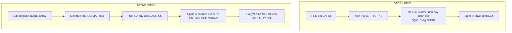

# 03 — Phê chuẩn kiến trúc (`bmad-architecture` brownfield)

> [← Mục lục](./index.md) · Trước: [02 — Project context](./02-project-context.md) · Tiếp: [04 — Chốt phạm vi](./04-chot-pham-vi.md)

---

## 1. Vai trò khác hẳn greenfield



Trích `bmad-architecture/SKILL.md`:

> *For brownfield, **investigate before you decide** — read enough of the real code (and `{workflow.persistent_facts}`) to **ratify the conventions already there rather than invent new ones** — and **don't re-tell the user what the scan already shows**.*

Và:

> *an existing codebase to derive a spine **from** (**ratify the conventions the code already shows — don't re-document them**)*

---

## 2. Lệnh

**Cửa sổ ngữ cảnh mới:**

```
> bmad-architecture
```

---

## 3. Kích hoạt — `AGENTS.md` được nạp tự động

```bash
uv run D:/du-an/donhang-api/_bmad/scripts/resolve_customization.py \
  --skill D:/du-an/donhang-api/.claude/skills/bmad-architecture --key workflow
```

```json
{
  "workflow": {
    "activation_steps_prepend": [],
    "activation_steps_append": [],
    "persistent_facts": ["file:{project-root}/**/project-context.md"],
    "external_sources": [],
    "...": "..."
  }
}
```

```
👁️ Glob D:/du-an/donhang-api/**/project-context.md → (không có file)
👁️ AGENTS.md → CÓ khối bmad:context
```

> Trích SKILL.md dòng 53:
>
> > *Hold `{workflow.persistent_facts}` as standing context — **the default loads `project-context.md`, load-bearing for brownfield***

Ở BMad v6.10, `bmad-project-context` ghi vào **`AGENTS.md`** chứ không phải `project-context.md`. Công cụ AI (Claude Code, Cursor…) tự đọc `AGENTS.md` ở gốc repo, nên khối vẫn vào ngữ cảnh — chỉ qua đường khác.

⚠️ **Cạm bẫy:** nếu bạn muốn `persistent_facts` bắt được nó một cách tường minh, thêm override:

```toml
# _bmad/custom/bmad-architecture.toml
[workflow]
persistent_facts = ["file:{project-root}/AGENTS.md"]
```

Mảng **nối thêm**, nên cả hai mục đều có hiệu lực.

---

## 4. Đọc đầu vào — skill tự nhận dạng loại việc

```
🏗️ Chào Thảo. Winston đây.

Mình đã nạp khối AGENTS.md — 18 dòng, đã xác minh. Nên mình biết:
  • src/legacy/ đóng băng
  • Tiền là số nguyên VNĐ, float từng gây lệch
  • Mọi DB access qua src/models/
  • Mọi route dùng asyncHandler
  • Order ≠ PurchaseOrder
  • Webhook replay 6h ở staging

Mình **sẽ không hỏi lại** những cái này, và cũng không kể lại cho bạn
nghe cái scan đã cho thấy.

Đầu vào của mình là một **codebase đang chạy** cộng một thay đổi sắp
tới. Vậy việc của mình là **phê chuẩn** — rút ra bất biến mà mã đã thể
hiện, để thay đổi mới không phá chúng.

Một câu trước khi đọc mã: thay đổi bạn sắp làm là "hủy đơn hoàn tiền
một phần". Nó chạm vào đâu theo hiểu biết của bạn?
```

🛑 **HALT**

```
> Order, OrderItem, và service thanh toán. Có thể cả reconcile job.
```

> **Chú ý:** skill hỏi **một** câu — về thứ nó không tự biết (phạm vi ảnh hưởng theo trực giác người trong cuộc). Nó **không** hỏi "dự án dùng framework gì", "cấu trúc thế nào" — đó là thứ scan trả lời.

---

## 5. Quét mã có mục tiêu

🤖🤖🤖 **Ba subagent song song**, phạm vi hẹp theo câu trả lời:

```
🤖 A: src/models/Order.js, OrderItem.js, và mọi association
🤖 B: src/services/payment.js + mọi chỗ gọi nó
🤖 C: src/jobs/reconcile.js — nó đọc gì, ghi gì
```

### 5.1 Kết quả A — mô hình dữ liệu

```
🤖 Order:
     id, ma_don, khach_hang_id, trang_thai, tong_tien,
     phi_ship, created_at, updated_at
     trang_thai ∈ {cho_xac_nhan, da_xac_nhan, dang_giao, hoan_thanh, da_huy}
     hasMany OrderItem

   OrderItem:
     id, order_id, san_pham_id, so_luong, don_gia, thanh_tien
     thanh_tien = so_luong * don_gia (tính ở application, không phải DB)

   ⚠️ KHÔNG có bảng nào ghi lịch sử đổi trạng thái.
      Đổi trạng thái là UPDATE trực tiếp lên Order.trang_thai.

   ⚠️ KHÔNG có khái niệm "hoàn tiền" ở tầng model.
      Bảng Payment có type ∈ {thanh_toan, hoan_tien} nhưng chỉ 2 bản
      ghi hoan_tien trong toàn DB — cả hai tạo tay bằng SQL.
```

### 5.2 Kết quả B — thanh toán

```
🤖 src/services/payment.js:
     createPayment(orderId, amount)   — gọi cổng, ghi Payment
     handleWebhook(payload)           — idempotent qua Payment.gateway_ref
     refund(paymentId, amount)        — CÓ TỒN TẠI nhưng KHÔNG endpoint
                                        nào gọi nó. 0 test.

   Idempotency: handleWebhook check Payment.gateway_ref đã tồn tại chưa
   trước khi ghi. Đây là cách quy tắc "webhook replay" được thực thi.
```

### 5.3 Kết quả C — đối soát

```
🤖 src/jobs/reconcile.js:
     Chạy 2h sáng. Đọc Payment WHERE created_at >= hôm qua.
     So tổng với file sao kê ngân hàng.
     Ghi ReconcileLog với chênh lệch.

   ⚠️ Nó giả định MỌI Payment đều là type='thanh_toan'.
      Dòng 47: `const tong = payments.reduce((s, p) => s + p.amount, 0)`
      Không lọc theo type. Nếu có bản ghi hoan_tien, tổng sẽ SAI.
```

> **Đây chính là loại phát hiện mà brownfield architecture tồn tại để tìm.** Tính năng hoàn tiền sẽ **âm thầm phá** job đối soát — và không test nào bắt được vì `refund()` chưa từng được gọi.

---

## 6. Trình bày phát hiện

```
🏗️ Ba phát hiện. Cái thứ ba là cái quan trọng.

**1. Không có lịch sử trạng thái.**
Đổi trạng thái là UPDATE trực tiếp lên `Order.trang_thai`. Với hủy đơn
một phần, bạn sẽ cần biết "hủy lúc nào, ai hủy, hủy món nào" — hiện
không có chỗ nào ghi.

Đây là một **quyết định kiến trúc mới** cần đưa ra, không phải quy ước
để phê chuẩn.

**2. `refund()` tồn tại nhưng chết.**
`src/services/payment.js:refund()` có sẵn, chưa endpoint nào gọi, 0 test.
Nó gọi đúng API cổng thanh toán. Nên nó là **điểm tái sử dụng**, không
phải thứ phải viết mới — nhưng phải test trước khi tin.

**3. ⚠️ Job đối soát sẽ vỡ.**
`src/jobs/reconcile.js:47` cộng **mọi** Payment không lọc `type`. Hiện
tại DB chỉ có 2 bản ghi `hoan_tien` (tạo tay) nên chưa lộ. Ngay khi
tính năng hoàn tiền chạy, tổng đối soát sẽ sai — và nó chạy 2h sáng,
không ai thấy cho tới khi kế toán báo lệch.

AGENTS.md đã cảnh báo "sửa sai gây lệch sổ". Đây đúng là ca đó.

Ba cái này phải vào spine. Bắt đầu từ cái nào?
```

🛑 **HALT**

---

## 7. Vòng quyết định

Winston trình bày **đánh đổi**, không phán quyết:

```
🏗️ **Quyết định 1: ghi lịch sử hủy thế nào**

Ba lựa chọn, mỗi cái ràng buộc khác nhau:

| | A. Thêm cột vào Order | B. Bảng OrderStatusLog | C. Bảng OrderCancellation |
| --- | --- | --- | --- |
| Migration | 3 cột mới | 1 bảng mới | 1 bảng mới |
| Trả lời được "hủy món nào" | ✗ | ✗ | ✓ |
| Trả lời được "lịch sử đầy đủ" | ✗ | ✓ | ✗ |
| Phá quy ước hiện có | Không | Không | Không |
| Công sức | Thấp | Trung bình | Trung bình |

Bối cảnh: yêu cầu là **hủy một phần** — "10 món, giao 7, hủy 3". Nên
bạn **bắt buộc** phải biết hủy món nào. A không trả lời được.

Giữa B và C: B tổng quát hơn nhưng phải thiết kế schema chịu được mọi
loại chuyển trạng thái. C hẹp hơn nhưng khớp đúng bài toán.

Mình nghiêng về **C** — vì repo này chưa có mẫu hình event log nào, và
thêm một cái tổng quát chỉ để phục vụ một ca là over-engineering. Nếu
sau này cần lịch sử đầy đủ, C không cản B.

Đánh đổi bạn nhận: nếu 6 tháng nữa cần audit trail cho mọi chuyển trạng
thái, bạn sẽ phải làm B và migrate C vào nó.

Bạn thấy sao?
```

🛑 **HALT**

```
> C. Không cần audit trail đầy đủ, chỉ cần biết hủy gì hoàn bao nhiêu.
```

*...tiếp tục qua 4 quyết định nữa...*

---

## 8. Lint spine

```bash
uv run .../bmad-architecture/scripts/lint_spine.py \
  _bmad-output/planning-artifacts/ARCHITECTURE-SPINE.md
```

```json
{
  "ok": true,
  "invariants": 8,
  "decisions": 5,
  "warnings": []
}
```

---

## 9. Tạo phẩm

📄 **`_bmad-output/planning-artifacts/ARCHITECTURE-SPINE.md`**

```markdown
---
title: donhang-api — Architecture Spine
created: 2026-08-11
status: approved
kind: brownfield-ratification
verified_against: 4c8e21a
sources:
  - AGENTS.md (khối bmad:context)
  - src/ (quét có mục tiêu, xem §Phạm vi quét)
---

# Architecture Spine — donhang-api

> **Loại: phê chuẩn brownfield.** Phần "Bất biến đã có" **rút ra từ mã
> đang chạy**, không phải thiết kế mới. Phần "Quyết định mới" chỉ áp
> cho thay đổi hủy đơn hoàn tiền một phần.
>
> Nếu một story cần vi phạm bất biến ở đây, đó là tín hiệu dừng lại và
> bàn lại — không phải làm ngoại lệ.

## Phạm vi quét

Spine này **không** mô tả toàn bộ 47k dòng. Nó quét có mục tiêu:
`src/models/Order.js`, `OrderItem.js`, `src/services/payment.js`,
`src/jobs/reconcile.js`, và mọi chỗ gọi chúng. Phần còn lại của repo
chưa được phê chuẩn — chạy lại skill này khi thay đổi chạm vùng khác.

---

## Phần A — Bất biến ĐÃ CÓ (phê chuẩn)

Năm bất biến sau **đã chi phối mã**. Chúng được ghi lại để thay đổi mới
không phá, không phải để mô tả lại repo.

**INV-A1 — Mọi truy cập DB đi qua `src/models/`**
Bằng chứng: 112/118 file. Sáu ngoại lệ đều trong `src/legacy/` và
không phải mẫu để theo.

**INV-A2 — Tiền là số nguyên VNĐ, không bao giờ float**
Bằng chứng: 41/41 chỗ. Lý do (từ phỏng vấn): float từng gây lệch 1 đồng
khi tính chiết khấu.

**INV-A3 — Mọi route dùng `asyncHandler`**
Bằng chứng: 89/94 route. Năm ngoại lệ trong `src/legacy/`.

**INV-A4 — Idempotency của webhook thực thi qua `Payment.gateway_ref`**
Bằng chứng: `src/services/payment.js:handleWebhook` check tồn tại trước
khi ghi. Lý do: cổng thanh toán replay 6h/lần ở staging.

**INV-A5 — `src/legacy/` đóng băng**
Chính sách người dùng, path-checked. Việc mới vào `src/services/`.

---

## Phần B — Quyết định MỚI (chỉ cho thay đổi này)

**AD-01 — Hủy một phần ghi vào bảng `OrderCancellation` riêng**

| | |
| --- | --- |
| **Binds** | Mọi hành động hủy tạo một bản ghi `OrderCancellation` + n bản ghi `OrderCancellationItem` |
| **Prevents** | UPDATE trực tiếp `Order.trang_thai` thành `da_huy` khi hủy một phần |
| **Rule** | `Order.trang_thai` chỉ thành `da_huy` khi **mọi** OrderItem đã bị hủy. Hủy một phần giữ trạng thái cũ |

Đã cân nhắc và loại: thêm cột vào `Order` (không trả lời được "hủy món
nào"); bảng `OrderStatusLog` tổng quát (over-engineering — repo chưa có
mẫu hình event log nào).

**AD-02 — Tái sử dụng `payment.refund()`, không viết mới**

| | |
| --- | --- |
| **Binds** | Hoàn tiền đi qua `src/services/payment.js:refund()` |
| **Prevents** | Gọi API cổng thanh toán trực tiếp từ service mới |
| **Rule** | Trước khi tin `refund()`, viết test cho nó — hiện 0 test và chưa từng được gọi trong production |

**AD-03 — ⚠️ `reconcile.js` PHẢI lọc theo `Payment.type` trước khi tính năng chạy**

| | |
| --- | --- |
| **Binds** | `src/jobs/reconcile.js:47` phải lọc `type='thanh_toan'`, hoặc cộng đại số có dấu |
| **Prevents** | Deploy tính năng hoàn tiền khi `reconcile.js` chưa sửa |
| **Rule** | Đây là **điều kiện chặn deploy**, không phải việc dọn dẹp sau. Job chạy 2h sáng và lỗi im lặng |

Bằng chứng: dòng 47 hiện là
`const tong = payments.reduce((s, p) => s + p.amount, 0)` — không lọc
`type`. Hiện chưa lộ vì DB chỉ có 2 bản ghi `hoan_tien` tạo tay.

**AD-04 — Số tiền hoàn tính ở tầng domain, không ở route**

| | |
| --- | --- |
| **Binds** | Logic tính tiền hoàn nằm trong `src/services/cancellation.js` |
| **Prevents** | Tính tiền trong route handler |
| **Rule** | Hàm tính phải thuần: nhận Order + danh sách item hủy, trả số tiền. Không I/O |

Lý do: phí ship hoàn theo tỷ lệ là logic có biên (làm tròn, hủy hết vs
hủy một phần) — cần test được không cần DB.

**AD-05 — Hoàn phí ship theo tỷ lệ giá trị, làm tròn xuống**

| | |
| --- | --- |
| **Binds** | `phi_ship_hoan = floor(phi_ship × giá_trị_hủy / tổng_giá_trị)` |
| **Prevents** | Làm tròn lên hoặc làm tròn ngân hàng |
| **Rule** | Làm tròn **xuống** — chênh lệch nghiêng về phía công ty, nhất quán với INV-A2 (số nguyên VNĐ) |

---

## Deferred — chưa quyết

- **Hủy sau khi đã giao xong**: yêu cầu hiện chỉ nói "giao 7 hủy 3", tức
  hủy trước khi giao hết. Ca "đã giao hết rồi mới đòi trả" là bài toán
  **trả hàng**, không phải hủy đơn. Không quyết ở đây.
- **Hoàn tiền một phần nhiều lần trên cùng đơn**: schema `OrderCancellation`
  cho phép (nhiều bản ghi/đơn), nhưng quy tắc nghiệp vụ chưa xác định.
  Mở câu hỏi.

## Open questions

1. Khi hủy một phần, `Order.tong_tien` có cập nhật không, hay giữ nguyên
   và tiền thật tính từ `tong_tien − tổng_hoàn`? → cần người quyết
2. Có cần thông báo cho khách khi hoàn tiền không? → ngoài phạm vi kỹ
   thuật, hỏi PM

## Ánh xạ: bất biến → nơi thực thi

| Bất biến | Thực thi ở đâu |
| --- | --- |
| INV-A1 | Quy ước; không có check tự động |
| INV-A2 | Quy ước; đề xuất lint rule chặn float trong tính tiền |
| INV-A3 | Quy ước |
| INV-A4 | `payment.js:handleWebhook` |
| INV-A5 | AGENTS.md policy |
| AD-01 | Migration + `cancellation.js` |
| AD-02 | `cancellation.js` import `payment.refund` |
| AD-03 | **Sửa `reconcile.js` + test** |
| AD-04 | `cancellation.js` là hàm thuần |
| AD-05 | Test biên trong `cancellation.test.js` |
```

---

## 10. Điều spine này **không** chứa

| Không có | Vì sao |
| --- | --- |
| Cây thư mục `src/` | Agent đọc trực tiếp |
| Danh sách 18 model | Như trên |
| Mô tả 23 route | Như trên |
| Sơ đồ ERD toàn hệ thống | Không phục vụ thay đổi này |
| "Dự án dùng Express + Sequelize" | Scan thấy trong 2 giây |
| Lịch sử vì sao chọn MySQL | Git giữ; không đổi hành vi agent |

> *don't re-tell the user what the scan already shows*

---

## 11. Tóm tắt bước này

| Loại | Chi tiết |
| --- | --- |
| Lệnh | `bmad-architecture` |
| Script chạy | `resolve_customization.py`, `resolve_config.py`, `lint_spine.py` |
| 👁️ Đọc | `AGENTS.md` (qua persistent_facts), `src/models/Order.js`, `OrderItem.js`, `src/services/payment.js`, `src/jobs/reconcile.js` + callers |
| 📄 Ghi | `ARCHITECTURE-SPINE.md` |
| 🤖 Subagent | 3 (quét có mục tiêu) |
| 🛑 Điểm dừng | 6 (1 phạm vi + 5 quyết định) |
| ⚠️ Phát hiện quan trọng | `reconcile.js` sẽ vỡ im lặng — thành AD-03 chặn deploy |
| Thời gian | ~45 phút |

---

**Tiếp:** [04 — Chốt phạm vi thay đổi](./04-chot-pham-vi.md) · [← Mục lục](./index.md)
