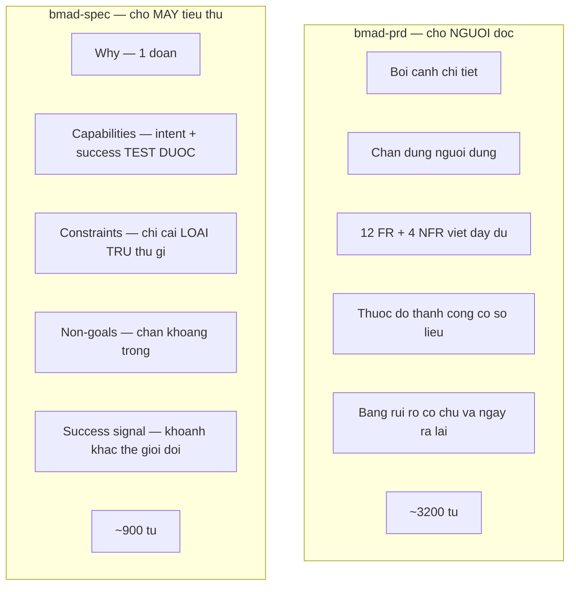

# 04 — Chốt phạm vi thay đổi (`bmad-spec`)

> [← Mục lục](./index.md) · Trước: [03 — Phê chuẩn kiến trúc](./03-phe-chuan-kien-truc.md) · Tiếp: [05 — Thực thi](./05-thuc-thi.md)

---

## 1. Vì sao `bmad-spec` chứ không phải `bmad-prd`

| | `bmad-prd` | `bmad-spec` |
| --- | --- | --- |
| Đầu vào | Coached discovery từ đầu | **Bất kỳ đầu vào mang ý định nào** — brief, PRD, transcript, brain dump, thư mục thiết kế |
| Đầu ra | `prd.md` + addendum + memlog | **`SPEC.md`** kernel 5 trường + companion |
| Kích thước | Nhiều trang | Súc tích, không rườm rà |
| Người tiêu thụ | **Người** đọc và tranh luận | **Máy** — skill hạ nguồn đọc trực tiếp |
| Bắt buộc trong BMM | Có | Không |
| Phù hợp nhất | Sản phẩm / sáng kiến lớn | **Một thay đổi có phạm vi rõ** |

Từ `module-help.csv`:

> *Use to distill any intent input into a **succinct, no-fluff SPEC.md contract** + companions that downstream work derives from. **Locks the WHAT before the HOW.***

Và:

> *It is the **only writer of `SPEC.md`**; other skills invoke it headless when they need to express or update intent.*

Với `donhang-api`, việc được giao là **một tính năng trong hệ thống đã có** — `bmad-spec` khớp hơn.

---

## 2. Lệnh

**Cửa sổ ngữ cảnh mới:**

```
> bmad-spec thêm chức năng hủy đơn hàng có hoàn tiền một phần
```

---

## 3. Kích hoạt và nạp đầu vào

```bash
uv run .../resolve_customization.py --skill .../bmad-spec --key workflow
uv run .../resolve_config.py --project-root D:/du-an/donhang-api
```

```
👁️ AGENTS.md                                              (18 dòng, qua persistent_facts)
👁️ _bmad-output/planning-artifacts/ARCHITECTURE-SPINE.md  (8 bất biến, 5 AD, 2 deferred, 2 open question)
```

```
📊 Chào Thảo.

Mình có hai đầu vào:
  • AGENTS.md — quy ước và pitfall của repo
  • ARCHITECTURE-SPINE.md — 5 bất biến đã phê chuẩn + 5 quyết định mới

Spine đã trả lời phần lớn "NHƯ THẾ NÀO". Việc của mình là chốt **CÁI GÌ**
— và spine để lại **hai câu hỏi mở** mà mình cần bạn quyết:

  1. Khi hủy một phần, `Order.tong_tien` cập nhật hay giữ nguyên?
  2. Có cần thông báo cho khách khi hoàn tiền không?

Câu 2 mình sẽ đưa vào Non-goals nếu bạn nói ngoài phạm vi.

Bắt đầu từ câu 1.
```

🛑 **HALT**

> Chú ý: skill **kế thừa im lặng** những gì spine đã chốt. Trích `bmad-architecture/SKILL.md`:
>
> > *Inherit what's already settled — whether by the input (a spec, prd) or the standing `{workflow.persistent_facts}` — **silently; don't re-decide or re-ask it**.*
>
> Nó chỉ hỏi những gì **chưa** được chốt.

```
> 1. Giữ nguyên tong_tien. Tiền thật = tong_tien trừ tổng đã hoàn.
>    Kế toán muốn thấy giá trị đơn gốc.
> 2. Ngoài phạm vi lần này. Sẽ làm sau.
```

---

## 4. Làm rõ ràng buộc nghiệp vụ

```
📊 Ghi nhận. Còn ba chỗ mình chưa chắc:

3. Hủy được ở những trạng thái nào? Spine không nói. Từ mã, trạng thái
   có: cho_xac_nhan, da_xac_nhan, dang_giao, hoan_thanh, da_huy.
   Hủy được ở tất cả trừ da_huy? Hay chỉ trước dang_giao?

4. Ai được hủy? Khách tự hủy được không, hay chỉ nhân viên?

5. Có giới hạn thời gian không? Ví dụ không hủy được sau 30 ngày?
```

🛑 **HALT**

```
> 3. Chỉ cho_xac_nhan, da_xac_nhan, dang_giao. Đã hoan_thanh thì là
>    trả hàng, quy trình khác.
> 4. Chỉ nhân viên. Khách gọi điện, nhân viên thao tác.
> 5. Không giới hạn. Nhưng chỉ hủy được món CHƯA giao.
```

```
📊 Câu 5 mở ra một thứ spine chưa chạm: hệ thống có biết món nào đã
giao chưa?
```

🤖 **Subagent quét có mục tiêu:**

```
🤖 OrderItem không có cột nào ghi trạng thái giao hàng.
   Không có bảng Delivery/Shipment.
   src/services/shipping.js gọi API bên thứ ba, lưu mã vận đơn vào
   Order.ma_van_don — nhưng ở cấp ĐƠN, không phải cấp MÓN.

   ⚠️ Hệ thống KHÔNG biết món nào đã giao.
```

```
📊 ⚠️ Đây là khoảng trống chặn.

Yêu cầu là "giao 7, hủy 3" — nhưng hệ thống không biết món nào trong 10
đã giao. Ba đường:

| | A. Nhân viên tự chọn món hủy | B. Thêm trạng thái cấp món | C. Lấy từ API vận chuyển |
| --- | --- | --- | --- |
| Công sức | Thấp | Trung bình | Cao |
| Chính xác | Phụ thuộc người | Cao | Cao nếu API hỗ trợ |
| Phá quy ước hiện có | Không | Không | Không |
| Rủi ro | Hủy nhầm món đã giao | Phải đồng bộ với thực tế | API có thể không có dữ liệu cấp món |

Với phạm vi lần này, mình đề xuất **A** — nhân viên chọn món, hệ thống
không tự suy. Nó khớp câu trả lời 4 của bạn (chỉ nhân viên thao tác),
và nó không mở một dự án con về theo dõi giao hàng cấp món.

Đánh đổi: hệ thống **không ngăn được** nhân viên hủy nhầm món đã giao.
Đó là rủi ro quy trình, không phải rủi ro kỹ thuật.

Chấp nhận A không?
```

🛑 **HALT**

```
> A. Ghi rõ vào assumption luôn.
```

---

## 5. Soạn SPEC

```bash
uv run .../recon_kit.py slug ... # (không dùng — đây là bmad-spec)
```

Skill ràng buộc workspace:

```
{doc_workspace} = _bmad-output/specs/spec-huy-don-hoan-tien-mot-phan/
```

```bash
uv run .../memlog.py init \
  --workspace "D:/du-an/donhang-api/_bmad-output/specs/spec-huy-don-hoan-tien-mot-phan" \
  --field topic="Hủy đơn hàng có hoàn tiền một phần" \
  --field kind="spec"
```

📄 **`_bmad-output/specs/spec-huy-don-hoan-tien-mot-phan/SPEC.md`**

```markdown
---
id: SPEC-huy-don-hoan-tien-mot-phan
companions: []
sources:
  - _bmad-output/planning-artifacts/ARCHITECTURE-SPINE.md
  - AGENTS.md
---

> **Canonical contract.** This SPEC and the files in `companions:` are the complete, preservation-validated contract for what to build, test, and validate. Source documents listed in frontmatter are for traceability — consult them only if you need narrative rationale or prose color this contract intentionally omits.

# Hủy đơn hàng có hoàn tiền một phần

## Why

**Một pain cần giải.** Khách gọi điện hủy một phần đơn — đặt 10 món, đã
nhận 7, muốn hủy 3 món chưa giao. Hiện tại nhân viên không có cách nào
thao tác: hệ thống chỉ hủy được **cả đơn**, và hoàn tiền phải làm tay
bằng SQL (2 bản ghi `Payment.type='hoan_tien'` trong toàn DB đều tạo
kiểu đó).

Hệ quả: nhân viên hoặc từ chối yêu cầu khách, hoặc hủy cả đơn rồi tạo
đơn mới cho 7 món — làm hỏng số liệu và mất lịch sử. Ai bị ảnh hưởng:
nhân viên chăm sóc khách hàng (thao tác), kế toán (số liệu lệch), khách
(không được phục vụ).

Bây giờ nó thành vấn đề vì lượng đơn nhiều món tăng, và cách chữa cháy
"hủy rồi tạo lại" đã gây hai lần lệch sổ trong quý.

## Capabilities

- **CAP-1 — Hủy món cụ thể trong đơn**
  - **intent:** Nhân viên chọn một hoặc nhiều món trong đơn để hủy, hệ thống ghi nhận và giữ nguyên phần còn lại.
  - **success:** Cho một đơn 10 món, hủy 3 món → đơn còn 7 món hoạt động, tồn tại bản ghi hủy nêu đúng 3 món đó, `Order.trang_thai` **không** đổi thành `da_huy`.

- **CAP-2 — Tính và thực hiện hoàn tiền tương ứng**
  - **intent:** Hệ thống tính số tiền hoàn cho các món bị hủy cộng phần phí ship tương ứng, và thực hiện hoàn qua cổng thanh toán.
  - **success:** Cho đơn tổng 1.000.000đ hàng + 50.000đ ship, hủy các món trị giá 300.000đ → hoàn 300.000 + floor(50.000 × 300.000/1.000.000) = 315.000đ, và tồn tại bản ghi `Payment.type='hoan_tien'` số tiền 315.000.

- **CAP-3 — Hủy toàn bộ chuyển đơn sang trạng thái đã hủy**
  - **intent:** Khi mọi món trong đơn đều bị hủy, đơn chuyển sang `da_huy`.
  - **success:** Hủy lần lượt tới món cuối cùng → `Order.trang_thai = 'da_huy'` ngay sau lần hủy cuối, không cần thao tác riêng.

- **CAP-4 — Đối soát ngân hàng vẫn đúng khi có hoàn tiền**
  - **intent:** Job đối soát 2h sáng tính đúng tổng khi trong kỳ có giao dịch hoàn tiền.
  - **success:** Cho một kỳ có 3 thanh toán tổng 500.000 và 1 hoàn tiền 100.000 → `ReconcileLog` ghi tổng 400.000, không phải 600.000.

## Constraints

- Chỉ hủy được khi `Order.trang_thai` ∈ {`cho_xac_nhan`, `da_xac_nhan`, `dang_giao`}. Trạng thái `hoan_thanh` là quy trình trả hàng, ngoài phạm vi.
- Chỉ nhân viên thao tác. Không có endpoint cho khách tự hủy.
- Tiền là số nguyên VNĐ; phí ship hoàn làm tròn **xuống** (AD-05).
- Hoàn tiền đi qua `src/services/payment.js:refund()` đã tồn tại, không viết mới (AD-02).
- `Order.tong_tien` **giữ nguyên** giá trị gốc. Số tiền thật = `tong_tien` − tổng đã hoàn.
- **`src/jobs/reconcile.js` phải sửa TRƯỚC khi tính năng lên production** (AD-03). Job hiện cộng mọi `Payment` không lọc `type`; có hoàn tiền là tổng sai, và lỗi im lặng lúc 2h sáng.
- Không sửa `src/legacy/` (INV-A5).
- Mọi truy cập DB qua `src/models/` (INV-A1); mọi route dùng `asyncHandler` (INV-A3).

## Non-goals

- **Thông báo cho khách khi hoàn tiền** — sẽ làm ở đợt sau.
- **Khách tự hủy đơn** — chỉ nhân viên, theo quy trình hiện hành.
- **Trả hàng sau khi đã giao xong** (`trang_thai = hoan_thanh`) — quy trình khác, không phải hủy đơn.
- **Theo dõi trạng thái giao hàng ở cấp món** — hệ thống không biết món nào đã giao; nhân viên chọn thủ công (xem Assumptions).
- **Audit trail đầy đủ cho mọi chuyển trạng thái** — chỉ ghi sự kiện hủy, không ghi mọi chuyển trạng thái khác (AD-01 loại `OrderStatusLog`).
- **Hủy một phần nhiều lần trên cùng đơn** — schema cho phép nhưng quy tắc nghiệp vụ chưa xác định; không thiết kế cho ca này.

## Success signal

Nhân viên chăm sóc khách hàng nhận cuộc gọi "tôi muốn hủy 3 món chưa
giao", thao tác xong trong một màn hình, và khách nhận được tiền hoàn
đúng số — không ai phải mở SQL, không ai phải tạo đơn mới, và sáng hôm
sau kế toán không thấy dòng lệch nào trong `ReconcileLog`.

## Assumptions

- **Nhân viên tự chọn món để hủy; hệ thống không suy ra món nào đã giao.**
  Lý do: `OrderItem` không có trạng thái giao hàng, không có bảng
  Delivery, và `Order.ma_van_don` ở cấp đơn chứ không cấp món. Hệ thống
  **không ngăn được** việc hủy nhầm món đã giao — đó là rủi ro quy
  trình, được chấp nhận cho phạm vi này.
- Cổng thanh toán hỗ trợ hoàn tiền một phần. `payment.refund()` đã gọi
  đúng API nhưng **chưa từng chạy production và có 0 test** — phải kiểm
  chứng trước khi tin (AD-02).

## Open Questions

- Nếu `refund()` thất bại ở cổng thanh toán, bản ghi `OrderCancellation`
  đã tạo xử lý thế nào — rollback, hay giữ và đánh dấu `pending_refund`?
```

---

## 6. Validate — bảo toàn nguồn

`bmad-spec` chạy bước validate: **mọi khẳng định load-bearing từ nguồn phải được bảo toàn**.

```
📊 Kiểm tra bảo toàn nguồn...

Từ ARCHITECTURE-SPINE.md:
  ✓ AD-01 (OrderCancellation riêng)        → CAP-1 success + Non-goal 5
  ✓ AD-02 (tái dùng refund)                → Constraint 4 + Assumption 2
  ✓ AD-03 (reconcile.js chặn deploy)       → Constraint 6 + CAP-4
  ✓ AD-04 (tính ở domain)                  → ngầm trong CAP-2; KHÔNG nêu rõ
  ✓ AD-05 (làm tròn xuống)                 → Constraint 3 + CAP-2 success
  ✓ INV-A1, INV-A3, INV-A5                 → Constraint 7, 8
  ✓ Deferred "hủy sau khi giao xong"       → Non-goal 3
  ✓ Deferred "hủy nhiều lần"               → Non-goal 6
  ✓ Open question "tong_tien"              → GIẢI QUYẾT → Constraint 5
  ✓ Open question "thông báo khách"        → GIẢI QUYẾT → Non-goal 1

⚠️ AD-04 (tính tiền ở tầng domain, hàm thuần, không I/O) là quyết định
   HOW, không phải WHAT. SPEC lock WHAT.

   Nó đã nằm trong ARCHITECTURE-SPINE.md và bmad-build sẽ đọc spine.
   Mình KHÔNG nhân bản nó vào SPEC — nhân bản là nguồn drift.

   Đúng ý bạn chứ?
```

🛑 **HALT**

```
> đúng
```

```bash
uv run .../memlog.py append --workspace "..." --type decision \
  --text "AD-04 không nhân bản vào SPEC — nó là HOW, đã ở spine, bmad-build đọc spine"

uv run .../memlog.py set --workspace "..." --key status --value complete
```

---

## 7. Tạo phẩm

```
_bmad-output/specs/spec-huy-don-hoan-tien-mot-phan/
├── SPEC.md          📄 hợp đồng chuẩn
└── .memlog.md       📄 nhật ký ra quyết định
```

📄 **`.memlog.md`**

```markdown
---
topic: Hủy đơn hàng có hoàn tiền một phần
kind: spec
status: complete
updated: 2026-08-11T16:40
---

- (event) nạp AGENTS.md + ARCHITECTURE-SPINE.md làm đầu vào
- (decision) Order.tong_tien giữ nguyên; tiền thật = tong_tien − tổng hoàn (kế toán muốn thấy giá trị gốc)
- (decision) thông báo khách → Non-goal, làm đợt sau
- (decision) hủy được ở cho_xac_nhan, da_xac_nhan, dang_giao; hoan_thanh là trả hàng
- (decision) chỉ nhân viên thao tác, không có endpoint cho khách
- (gap) hệ thống KHÔNG biết món nào đã giao — OrderItem không có trạng thái, ma_van_don ở cấp đơn
- (decision) nhân viên tự chọn món hủy (phương án A); không mở dự án con theo dõi giao hàng cấp món
- (assumption) hệ thống không ngăn được hủy nhầm món đã giao — rủi ro quy trình, chấp nhận
- (decision) AD-04 không nhân bản vào SPEC — nó là HOW, đã ở spine, nhân bản gây drift
- (event) SPEC.md hoàn tất, 4 CAP, 8 constraint, 6 non-goal, 2 assumption, 1 open question
```

---

## 8. Vì sao SPEC ngắn hơn PRD



Ràng buộc của template SPEC:

| Mục | Quy tắc |
| --- | --- |
| `Constraints` | *"A non-negotiable that bends design. **If it doesn't rule anything out, it doesn't belong.**"* |
| `Non-goals` | *"**At least one.** Stops downstream from filling the vacuum."* |
| `Success signal` | *"**World-change moment, not dashboard.** Concrete enough to write a test or run a demonstration against."* |
| `Assumptions` | *"**Omit this section entirely if empty.**"* |

---

## 9. Tóm tắt bước này

| Loại | Chi tiết |
| --- | --- |
| Lệnh | `bmad-spec <mô tả ý định>` |
| Script chạy | `resolve_customization.py`, `resolve_config.py`, `memlog.py` ×11 |
| 👁️ Đọc | `AGENTS.md`, `ARCHITECTURE-SPINE.md`, quét có mục tiêu `src/models/OrderItem.js`, `src/services/shipping.js` |
| 📄 Ghi | `SPEC.md`, `.memlog.md` |
| 🤖 Subagent | 1 (quét trạng thái giao hàng cấp món) |
| 🛑 Điểm dừng | 4 (2 open question, 3 câu nghiệp vụ, chọn phương án A, xác nhận không nhân bản AD-04) |
| ⚠️ Phát hiện chặn | Hệ thống không biết món nào đã giao → thành Assumption + Non-goal |
| Thời gian | ~25 phút |

**Trạng thái sau bước này:**

```
D:/du-an/donhang-api/
├── AGENTS.md
├── _bmad-output/
│   ├── planning-artifacts/
│   │   └── ARCHITECTURE-SPINE.md
│   └── specs/
│       └── spec-huy-don-hoan-tien-mot-phan/
│           ├── SPEC.md          📄 MỚI
│           └── .memlog.md       📄 MỚI
└── src/ ... (chưa đụng)
```

---

**Tiếp:** [05 — Thực thi](./05-thuc-thi.md) · [← Mục lục](./index.md)
