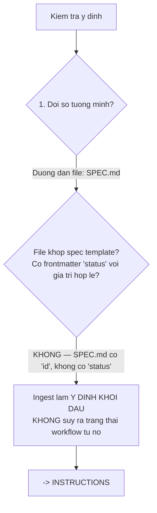
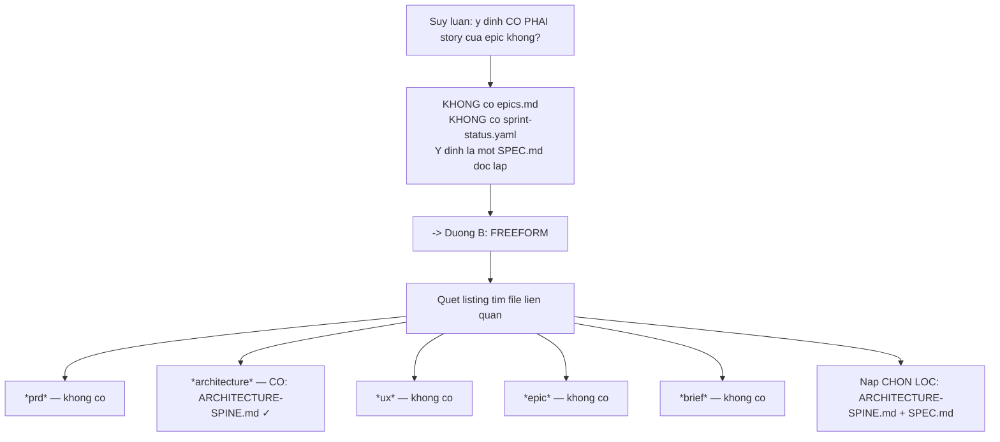

# 05 — Thực thi (`bmad-build` trên mã kế thừa)

> [← Mục lục](./index.md) · Trước: [04 — Chốt phạm vi](./04-chot-pham-vi.md) · Tiếp: [06 — Ghi nhận & bảo trì](./06-ghi-nhan-va-bao-tri.md)

Cơ chế giống [demo greenfield 06](../demo/06-pha4-thuc-thi.md). Đây chỉ nêu **khác biệt brownfield**.

---

## 1. Lệnh

**Cửa sổ ngữ cảnh mới:**

```
> bmad-build _bmad-output/specs/spec-huy-don-hoan-tien-mot-phan/SPEC.md
```

---

## 2. Bước 01 — định tuyến khác greenfield

### 2.1 Intent check — đường số 1



Trích `step-01-clarify-and-route.md`:

> *Anything else (**intent files**, external docs, plans, descriptions) → **ingest it as starting intent** and proceed to INSTRUCTIONS. **Do not attempt to infer a workflow state from it.***

`SPEC.md` của `bmad-spec` là **intent file**, không phải spec thực thi của `bmad-build`. Hai thứ khác nhau:

| | `SPEC.md` (bmad-spec) | `spec-*.md` (bmad-build) |
| --- | --- | --- |
| Frontmatter | `id`, `companions`, `sources` | `title`, `type`, `status`, `review_loop_iteration` |
| Nội dung | Why / Capabilities / Constraints / Non-goals | Intent / Boundaries / I/O Matrix / Code Map / Tasks |
| Người tiêu thụ | Nhiều skill hạ nguồn | Chỉ subagent thực thi |
| Vòng đời | Ổn định | draft → ready-for-dev → in-progress → in-review → done |

### 2.2 Nạp ngữ cảnh — nhánh **freeform**, không phải epic story

```
👁️ ls _bmad-output/planning-artifacts/
   ARCHITECTURE-SPINE.md

👁️ ls _bmad-output/implementation-artifacts/
   (không tồn tại)
```



> ⚠️ **Không có `epic-N-context.md`** — cơ chế cache đó chỉ chạy ở nhánh epic story. Ở brownfield freeform, ngữ cảnh đến từ `AGENTS.md` + `ARCHITECTURE-SPINE.md` + `SPEC.md`.

### 2.3 `persistent_facts` nạp `AGENTS.md`

Workflow đã kết xuất chứa:

```markdown
### Step 2: Load Persistent Facts

Treat every entry below as foundational context you carry for the rest of the workflow run...

- file:D:/du-an/donhang-api/**/project-context.md
```

```bash
$ ls D:/du-an/donhang-api/**/project-context.md
(không có file)
```

⚠️ **Cạm bẫy brownfield.** Glob không bắt được `AGENTS.md`. Hai cách xử lý:

**Cách 1 — override (khuyến nghị):**

```toml
# _bmad/custom/bmad-build.toml
[workflow]
persistent_facts = ["file:{project-root}/AGENTS.md"]
```

Mảng **nối thêm**, nên cả glob cũ lẫn `AGENTS.md` đều có hiệu lực.

Kiểm chứng:

```bash
$ uv run _bmad/scripts/resolve_customization.py \
    -s "$(pwd)/.claude/skills/bmad-build" -p "$(pwd)" -k workflow.persistent_facts
```

```json
{
  "workflow.persistent_facts": [
    "file:{project-root}/**/project-context.md",
    "file:{project-root}/AGENTS.md"
  ]
}
```

> ⚠️ Đổi `persistent_facts` **đổi `generation_hash`** ⇒ snapshot được kết xuất lại. Đó là hành vi đúng.

**Cách 2 — dựa vào công cụ AI:** Claude Code, Cursor, Copilot tự đọc `AGENTS.md` ở gốc repo. Khối vẫn vào ngữ cảnh, chỉ không qua đường `persistent_facts`.

Demo này dùng **cách 1** để tường minh.

### 2.4 Kiểm tra VCS — nghiêm ngặt hơn greenfield

```bash
$ git status --porcelain
 M src/routes/orders.js       ← ⚠️ CÓ THAY ĐỔI CHƯA COMMIT

$ git branch --show-current
main                          ← ⚠️ ĐANG Ở MAIN
```

```
💻 ⚠️ Hai vấn đề trước khi bắt đầu:

1. `src/routes/orders.js` có thay đổi chưa commit. Nếu mình sửa file
   này, thay đổi của bạn sẽ lẫn vào diff review và mình không phân biệt
   được cái nào là của story.

2. Bạn đang ở nhánh `main`. AGENTS.md nói:
   "Không push thẳng main; chỉ PR, một approval."

Đề xuất: commit hoặc stash thay đổi hiện có, rồi tạo nhánh
`feat/huy-don-hoan-tien-mot-phan`.

Làm gì tiếp?
```

🛑 **HALT**

> Trích step-01: *"Version control sanity check. Is the working tree clean? Does the current branch make sense for this intent... **If the tree is dirty or the branch is an obvious mismatch, HALT and ask the human**."*
>
> ⚠️ Ở brownfield điều này **quan trọng hơn nhiều** so với greenfield — repo có 1.847 commit và nhiều người từng làm.

```
> stash rồi tạo nhánh
```

```bash
$ git stash push -m "wip trước khi chạy bmad-build"
$ git checkout -b feat/huy-don-hoan-tien-mot-phan
```

### 2.5 Kiểm tra đa mục tiêu

```
💻 Kiểm tra phạm vi. SPEC có 4 CAP:

  CAP-1  Hủy món cụ thể
  CAP-2  Tính và thực hiện hoàn tiền
  CAP-3  Hủy toàn bộ → trạng thái da_huy
  CAP-4  Đối soát vẫn đúng khi có hoàn tiền

CAP-1, 2, 3 là **một mục tiêu người dùng gắn kết** — "hủy đơn có hoàn
tiền" không ship được nếu thiếu bất kỳ cái nào. Chúng xuyên tầng (DB +
service + route) nhưng đó là chi tiết thực thi trong cùng một mục tiêu.

CAP-4 **khác**. Sửa `reconcile.js` lọc theo `Payment.type`:
  • review được riêng
  • test được riêng
  • merge được riêng mà không phá gì
  • **và nó phải lên TRƯỚC** (AD-03 nói đây là điều kiện chặn deploy)

Đây là **hai deliverable độc lập ship được**.

  [S] Split — làm CAP-4 trước, hoãn CAP-1/2/3
  [K] Keep — làm cả bốn trong một spec
```

🛑 **HALT**

> Quy tắc SCOPE STANDARD: *"Multi-goal means **>=2 top-level independent shippable deliverables** — each could be reviewed, tested, and merged as a separate PR without breaking the others."*
>
> CAP-4 thỏa: sửa `reconcile.js` merge được ngay, không phụ thuộc gì, và **làm cho hệ thống đúng hơn** kể cả khi tính năng hủy không bao giờ ra.

```
> S — làm CAP-4 trước
```

```
💻 Đúng thứ tự. AD-03 nói CAP-4 là điều kiện chặn deploy — làm nó
trước nghĩa là bạn không bao giờ ở trạng thái "tính năng xong nhưng
đối soát vỡ".

Ghi CAP-1/2/3 vào deferred-work.md...
```

📄 **`_bmad-output/implementation-artifacts/deferred-work.md`**

```markdown
- source_spec: none
  summary: Hủy món cụ thể trong đơn, tính hoàn tiền, và chuyển trạng thái khi hủy hết (CAP-1, CAP-2, CAP-3 của SPEC-huy-don-hoan-tien-mot-phan)
  evidence: Tách khỏi CAP-4 vì CAP-4 (sửa reconcile.js) ship độc lập được và AD-03 yêu cầu nó lên trước; làm chung một spec sẽ chặn một fix đúng-ngay-lập-tức sau một tính năng dài.
```

### 2.6 Định tuyến

```
💻 Slug: `reconcile-loc-theo-payment-type`

spec_file = _bmad-output/implementation-artifacts/spec-reconcile-loc-theo-payment-type.md

Blast radius: sửa một dòng tính tổng trong job chạy 2h sáng, ảnh hưởng
số liệu đối soát ngân hàng. **KHÔNG bằng 0.**

→ plan-code-review (step-02)
```

---

## 3. Bước 02 — điều tra codebase kế thừa

🤖 **Subagent điều tra** — phạm vi hẹp:

```
🤖 Nhiệm vụ: khảo sát src/jobs/reconcile.js và mọi thứ nó chạm.
   Trả TÓM TẮT CHƯNG CẤT, không trả nội dung file.
```

```
🤖 src/jobs/reconcile.js (118 dòng):
     - Cron 2h sáng qua node-cron, đăng ký ở src/index.js:47
     - Dòng 31: đọc Payment WHERE created_at >= startOfYesterday
     - Dòng 47: const tong = payments.reduce((s, p) => s + p.amount, 0)
                ⚠️ KHÔNG lọc type
     - Dòng 52: đọc file sao kê từ process.env.BANK_STATEMENT_PATH
     - Dòng 68: ghi ReconcileLog { ngay, tong_he_thong, tong_ngan_hang, chenh_lech }
     - Dòng 89: nếu |chenh_lech| > 1000 → gửi email cảnh báo

   Payment model:
     type ∈ {thanh_toan, hoan_tien}
     amount LUÔN DƯƠNG (kể cả hoan_tien)
     ⚠️ Không có cột dấu, không có amount âm

   Test hiện có: test/reconcile.test.js, 3 test
     - tính tổng đúng khi khớp
     - phát hiện chênh lệch
     - gửi email khi chênh > 1000
     ⚠️ CẢ BA đều chỉ tạo Payment type='thanh_toan'

   Điểm tái sử dụng: KHÔNG có helper nào tính tổng có dấu.
```

> **Phát hiện quan trọng:** `amount` **luôn dương** kể cả với `hoan_tien`. Nên "lọc theo type" không đủ — phải **cộng đại số có dấu**.

```
💻 Điều tra lộ ra một chi tiết SPEC chưa nắm:

`Payment.amount` luôn dương, kể cả bản ghi `hoan_tien`. Không có cột
dấu, không có amount âm.

Nên sửa không phải "lọc type" mà là **cộng đại số**:

```js
// SAI (chỉ lọc):
payments.filter(p => p.type === 'thanh_toan').reduce(...)
  → bỏ qua hoàn tiền, tổng vẫn sai theo hướng khác

// ĐÚNG (cộng đại số):
payments.reduce((s, p) => s + (p.type === 'hoan_tien' ? -p.amount : p.amount), 0)
```

SPEC CAP-4 success nói: "3 thanh toán tổng 500.000 và 1 hoàn tiền
100.000 → ReconcileLog ghi tổng 400.000". Cộng đại số cho ra 400.000.
Lọc-bỏ cho ra 500.000.

SPEC đúng, chỉ là mô tả trong Constraint 6 ("lọc type") không chính xác
bằng success criterion. Mình theo **success criterion**.
```

---

## 4. Spec được tạo

📄 **`_bmad-output/implementation-artifacts/spec-reconcile-loc-theo-payment-type.md`**

```markdown
---
title: 'Đối soát ngân hàng cộng đại số theo loại giao dịch'
type: 'bugfix'
created: '2026-08-11'
status: 'draft'
review_loop_iteration: 0
context:
  - '{project-root}/AGENTS.md'
  - '{project-root}/_bmad-output/planning-artifacts/architecture/architecture-donhang-api-2026-08-11/ARCHITECTURE-SPINE.md'
---

<frozen-after-approval reason="human-owned intent — do not modify unless human renegotiates">

## Intent

**Problem:** `src/jobs/reconcile.js:47` cộng **mọi** bản ghi `Payment`
không phân biệt `type`, và `Payment.amount` luôn dương kể cả với
`hoan_tien`. Hiện chưa lộ vì DB chỉ có 2 bản ghi `hoan_tien` tạo tay.
Ngay khi tính năng hủy đơn hoàn tiền chạy, tổng đối soát sẽ cao hơn
thực tế đúng bằng tổng tiền hoàn — và job chạy 2h sáng, lỗi im lặng
cho tới khi kế toán báo lệch.

**Approach:** Đổi phép cộng thành cộng đại số: `hoan_tien` trừ đi,
`thanh_toan` cộng vào. Bổ sung test cho ca có hoàn tiền — hiện cả 3
test đều chỉ tạo `thanh_toan`.

## Boundaries & Constraints

**Always:**
- Mọi truy cập DB qua `src/models/` (INV-A1)
- Tiền là số nguyên VNĐ (INV-A2)
- Kết quả `ReconcileLog.tong_he_thong` phải khớp success criterion của
  SPEC CAP-4: 3 thanh toán 500.000 + 1 hoàn tiền 100.000 → 400.000

**Ask First:**
- Thay đổi ngưỡng cảnh báo email (hiện 1000)
- Thay đổi schema `Payment` hoặc `ReconcileLog`
- Đổi lịch cron

**Never:**
- Không sửa `src/legacy/` (INV-A5)
- Không thêm cột dấu vào `Payment` — dấu suy từ `type`
- Không đổi `Payment.amount` thành số âm cho `hoan_tien` — sẽ phá mọi
  chỗ khác đọc bảng này

## I/O & Edge-Case Matrix

| Scenario | Input / State | Expected Output / Behavior | Error Handling |
|----------|--------------|---------------------------|----------------|
| Chỉ thanh toán | 3 Payment type=thanh_toan, amount 200k/200k/100k | tong_he_thong = 500.000 | N/A |
| Có hoàn tiền | 3 thanh_toan tổng 500k + 1 hoan_tien 100k | tong_he_thong = 400.000 | N/A |
| Chỉ hoàn tiền | 1 hoan_tien 100k, không có thanh_toan | tong_he_thong = −100.000 | Cho phép âm; không kẹp về 0 |
| Không có giao dịch | 0 Payment trong kỳ | tong_he_thong = 0, vẫn ghi ReconcileLog | N/A |
| Hoàn đúng bằng thu | 1 thanh_toan 100k + 1 hoan_tien 100k | tong_he_thong = 0 | N/A |
| type lạ | 1 Payment type='chuyen_khoan' (giá trị ngoài enum) | Ném lỗi, KHÔNG ghi ReconcileLog | Log lỗi + email cảnh báo; thà không ghi còn hơn ghi sai |

</frozen-after-approval>

## Code Map

- `src/jobs/reconcile.js:47` — SỬA. Dòng duy nhất cần đổi logic.
- `src/jobs/reconcile.js:68` — CHỈ ĐỌC. Nơi ghi ReconcileLog; không đổi shape.
- `src/models/Payment.js` — CHỈ ĐỌC. `type` ∈ {thanh_toan, hoan_tien}, `amount` luôn dương.
- `src/models/ReconcileLog.js` — CHỈ ĐỌC. `tong_he_thong` là INTEGER, cho phép âm.
- `test/reconcile.test.js` — SỬA. 3 test hiện có chỉ tạo thanh_toan; thêm 3 test cho ma trận.
- `AGENTS.md` — CHỈ ĐỌC. Nhắc: chạy `docker compose up -d` trước test.

## Tasks & Acceptance

**Execution:**
- [ ] `src/jobs/reconcile.js` -- đổi dòng 47 thành cộng đại số theo `type`; ném lỗi khi gặp `type` ngoài enum -- sửa gốc lỗi
- [ ] `test/reconcile.test.js` -- thêm 3 test cho ma trận: có hoàn tiền, chỉ hoàn tiền, type lạ -- chứng minh hành vi
- [ ] `test/reconcile.test.js` -- thêm test cho ca hoàn đúng bằng thu (tổng 0) -- ca biên dễ sai dấu

**Acceptance Criteria:**
- Given 3 thanh_toan tổng 500.000 và 1 hoan_tien 100.000, when job chạy, then `ReconcileLog.tong_he_thong` = 400.000
- Given chỉ 1 hoan_tien 100.000, when job chạy, then `tong_he_thong` = −100.000 (không kẹp về 0)
- Given 1 Payment có `type` ngoài enum, when job chạy, then ném lỗi và **không** ghi `ReconcileLog`
- Given `npx vitest run test/reconcile.test.js`, then 7 passed (3 cũ + 4 mới)

## Spec Change Log

## Verification

**Commands:**
- `docker compose up -d` -- expected: mysql và redis lên (bắt buộc trước test, xem AGENTS.md)
- `npx vitest run test/reconcile.test.js` -- expected: 7 passed, 0 failed
- `npm run lint` -- expected: exit 0
- `npm run typecheck` -- expected: exit 0 (CI chạy cái này, npm test không phủ)
```

> ⚠️ Chú ý `context:` **không rỗng** — khác greenfield. Ở brownfield, spec trỏ tới `AGENTS.md` và spine để subagent thực thi tự nạp.

---

## 5. Bước 03 — thực thi

```bash
$ git rev-parse HEAD
9d2f7a4c1e8b3f6a5c2e9b8d7f4a1c6e3b9d5f2a
```

```yaml
baseline_commit: 9d2f7a4c1e8b3f6a5c2e9b8d7f4a1c6e3b9d5f2a
status: 'in-progress'
```

> `sync-sprint-status.md` **bỏ qua** — tiền điều kiện không thỏa: `story_key` chưa đặt và `sprint-status.yaml` không tồn tại.

🤖 **Subagent thực thi** — nhận spec làm nguồn duy nhất, tự nạp `context:`.

✏️ **`src/jobs/reconcile.js`**

```diff
+const SIGNED = { thanh_toan: 1, hoan_tien: -1 };
+
 async function reconcile(ngay) {
   const payments = await Payment.findAll({
     where: { created_at: { [Op.gte]: startOfDay(ngay) } },
   });
 
-  const tong = payments.reduce((s, p) => s + p.amount, 0);
+  const tong = payments.reduce((s, p) => {
+    const dau = SIGNED[p.type];
+    if (dau === undefined) {
+      throw new Error(
+        `reconcile: Payment ${p.id} có type không hợp lệ "${p.type}"`,
+      );
+    }
+    return s + dau * p.amount;
+  }, 0);
```

📄 **`test/reconcile.test.js`** — thêm 4 test.

```bash
$ docker compose up -d
[+] Running 2/2
 ✔ Container donhang-mysql  Started
 ✔ Container donhang-redis  Started

$ npx vitest run test/reconcile.test.js
 ✓ test/reconcile.test.js (7)
   ✓ tính tổng đúng khi chỉ có thanh toán
   ✓ phát hiện chênh lệch
   ✓ gửi email khi chênh > 1000
   ✓ trừ đi khi có hoàn tiền
   ✓ cho phép tổng âm khi chỉ có hoàn tiền
   ✓ tổng bằng 0 khi hoàn đúng bằng thu
   ✓ ném lỗi và không ghi log khi type ngoài enum

 Test Files  1 passed (1)
      Tests  7 passed (7)

$ npm run lint      → exit 0
$ npm run typecheck → exit 0
```

**Matrix Test Audit:** 6/6 dòng ma trận có test đã chạy và pass.

---

## 6. Bước 04 — review trên mã kế thừa

🤖🤖🤖 **Ba lớp song song.**

### Findings

```json
[
  {
    "location": "src/jobs/reconcile.js:47-56",
    "trigger_condition": "Ném lỗi giữa vòng reduce khiến job dừng hoàn toàn — không ghi ReconcileLog cho kỳ đó, và cron không retry",
    "guard_snippet": "Đúng theo ma trận ('thà không ghi còn hơn ghi sai'), nhưng không có cơ chế nào cho biết kỳ đó bị bỏ. Thêm bản ghi ReconcileLog với trạng thái 'failed' và lý do, hoặc ít nhất gửi email",
    "potential_consequence": "Một type lạ làm mất hoàn toàn dữ liệu đối soát của một ngày mà không ai biết"
  },
  {
    "location": "src/jobs/reconcile.js — toàn hàm",
    "trigger_condition": "SIGNED là hằng module-level ánh xạ type → dấu. Payment model định nghĩa enum ở src/models/Payment.js. Hai nơi phải đồng bộ tay",
    "guard_snippet": "Import enum từ model, hoặc thêm test khẳng định Object.keys(SIGNED) khớp enum của Payment",
    "potential_consequence": "Thêm type thứ ba (ví dụ 'dieu_chinh') vào model mà quên SIGNED → job ném lỗi cho mọi bản ghi loại đó"
  },
  {
    "gap_shape": "untested-integration",
    "consumer": "kế toán",
    "evidence": "7 test đều gọi hàm reconcile() trực tiếp với dữ liệu dựng sẵn. Không có test nào chạy qua đường cron thật (src/index.js:47) hay đọc file sao kê thật",
    "location": "test/reconcile.test.js",
    "trigger_condition": "Đường từ cron tới hàm không có test",
    "guard_snippet": "Đây là khoảng trống CÓ SẴN, không do thay đổi này gây ra",
    "potential_consequence": "Lỗi ở tầng đăng ký cron không bị bắt"
  }
]
```

### Triage

| # | Finding | Severity | Loại | Lý do |
| --- | --- | --- | --- | --- |
| 1 | Ném lỗi làm mất dữ liệu ngày | **high** | **bad_spec** | Ma trận nói "không ghi ReconcileLog" nhưng không nói cách báo. Khoảng trống spec |
| 2 | SIGNED và enum model tách rời | medium | **patch** | Thêm một test khẳng định, không cần hỏi người |
| 3 | Đường cron không có test | low | **defer** | **Vấn đề có sẵn**, không do thay đổi này gây ra |

> ⚠️ **Finding 3 minh hoạ đúng loại `defer` mà brownfield sinh ra nhiều:**
>
> > *`defer` — **pre-existing issue not caused by this story**, surfaced incidentally by the review. Collect for later focused attention.*
>
> Ở greenfield gần như không có loại này. Ở brownfield, review liên tục chạm vào nợ kỹ thuật cũ — và triage đúng cách là **không** để nó làm phình story hiện tại.

### Loopback `bad_spec`

```
💻 Finding 1 là bad_spec → loopback.

review_loop_iteration: 0 → 1

KEEP instructions:
  KEEP: cộng đại số qua bảng SIGNED (rõ hơn if/else)
  KEEP: thông báo lỗi nêu Payment.id và giá trị type thật
  KEEP: cả 7 test hiện có

Revert mã...
```

Ma trận I/O nằm **trong** `<frozen-after-approval>` → cần người:

```
💻 Dòng "type lạ" của ma trận cần bổ sung cách báo. Nằm trong vùng
frozen nên chỉ bạn đổi được.

Đề xuất sửa dòng đó:

| type lạ | 1 Payment type='chuyen_khoan' | Ném lỗi, KHÔNG ghi tong_he_thong; ghi ReconcileLog với trang_thai='failed' và ly_do nêu Payment.id | Gửi email cảnh báo |

Nhưng ReconcileLog hiện KHÔNG có cột trang_thai hay ly_do. Hai đường:

  [A] Thêm 2 cột vào ReconcileLog (migration)
  [B] Không đổi schema — chỉ gửi email, không ghi gì

B rẻ hơn nhưng để lại lỗ: không truy vết được sau này.
A đúng hơn nhưng chạm schema — Boundaries nói "Ask First".

Chọn?
```

🛑 **HALT**

```
> A
```

→ Sinh lại mã với migration + 2 cột mới, giữ nguyên KEEP.

### Review vòng 2

```
💻 Findings: 1 (patch — test khẳng định SIGNED khớp enum)

Áp dụng patch... 

$ npx vitest run test/reconcile.test.js
 Test Files  1 passed (1)
      Tests  9 passed (9)

Review sạch. → step-05
```

---

## 7. Bước 05 — trình bày

```
💻 Xong.

  Spec: _bmad-output/implementation-artifacts/spec-reconcile-loc-theo-payment-type.md
  Vòng review: 1 loopback (bad_spec)

  File sửa:
    src/jobs/reconcile.js:47      (cộng đại số + validate type)
    src/models/ReconcileLog.js:12 (thêm trang_thai, ly_do)
    test/reconcile.test.js:1      (3 → 9 test)

  File tạo mới:
    migrations/20260811-add-reconcile-status.js

  Verification:
    docker compose up -d                        → 2 container lên
    npx vitest run test/reconcile.test.js       → 9 passed
    npm run lint                                → exit 0
    npm run typecheck                           → exit 0

  Deferred:
    1 mục — đường cron chưa có test (vấn đề có sẵn)

  Nhánh: feat/huy-don-hoan-tien-mot-phan (chưa commit — theo quy tắc)

⚠️ Nhắc: AD-03 nói đây là điều kiện chặn deploy cho tính năng hủy đơn.
Merge cái này TRƯỚC khi làm CAP-1/2/3 (đã ghi trong deferred-work.md).

Điều đáng chú ý: điều tra codebase lộ ra `Payment.amount` luôn dương —
SPEC Constraint 6 nói "lọc type" nhưng success criterion đòi cộng đại
số. Nếu làm theo constraint thay vì criterion, tổng sẽ ra 500.000 thay
vì 400.000 và test vẫn "pass" nếu ai đó viết test sai theo.
```

---

## 8. Bảng: khác biệt brownfield vs greenfield trong `bmad-build`

| Khía cạnh | Greenfield | Brownfield |
| --- | --- | --- |
| Nhánh định tuyến step-01 | Epic story (có `epics.md`) | **Freeform** |
| Cache ngữ cảnh | `epic-N-context.md` | **Không có** — dùng `AGENTS.md` + spine |
| `sync-sprint-status` | Chạy, cập nhật story + epic | **Bỏ qua** (không có `sprint-status.yaml`) |
| `context:` trong spec | Thường rỗng | **Trỏ `AGENTS.md` + spine** |
| Kiểm tra VCS | Nhẹ (repo mới) | **Nghiêm** — cây bẩn, nhánh sai đều HALT |
| Điều tra codebase | "Không có gì để tái sử dụng" | **Tìm điểm tái sử dụng + phát hiện bẫy** |
| Loại finding hay gặp | `bad_spec`, `patch` | **`defer` nhiều hơn hẳn** — nợ kỹ thuật cũ |
| Ma trận I/O | Từ yêu cầu | **Từ yêu cầu + hành vi mã hiện tại** |
| Rủi ro chính | Xây sai thứ | **Phá thứ đang chạy** |

---

## 9. Tóm tắt bước này

| Loại | Chi tiết |
| --- | --- |
| Lệnh | `bmad-build <đường-dẫn-SPEC.md>` |
| Script chạy | `render_skill.py` ×1 (kèm resolve_config + resolve_customization bên trong) |
| 👁️ Đọc | `SPEC.md`, `ARCHITECTURE-SPINE.md`, `AGENTS.md`, `src/jobs/reconcile.js`, `src/models/Payment.js`, `ReconcileLog.js`, `test/reconcile.test.js` |
| 📄 Ghi | `spec-reconcile-*.md`, `deferred-work.md`, migration mới |
| ✏️ Sửa | `src/jobs/reconcile.js`, `src/models/ReconcileLog.js`, `test/reconcile.test.js` |
| 🤖 Subagent | 5 (1 điều tra + 1 thực thi + 3 review) × 2 vòng |
| 🛑 Điểm dừng | 4 (VCS bẩn, split scope, sửa frozen, chọn A/B) |
| Loopback | 1 (`bad_spec`) |
| ⚠️ Cạm bẫy brownfield | 4 (VCS, `persistent_facts` không bắt `AGENTS.md`, `amount` luôn dương, `defer` nhiều) |
| Thời gian | ~40 phút |

---

**Tiếp:** [06 — Ghi nhận sai sót & bảo trì](./06-ghi-nhan-va-bao-tri.md) · [← Mục lục](./index.md)
