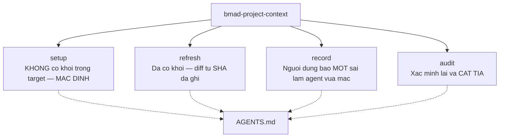
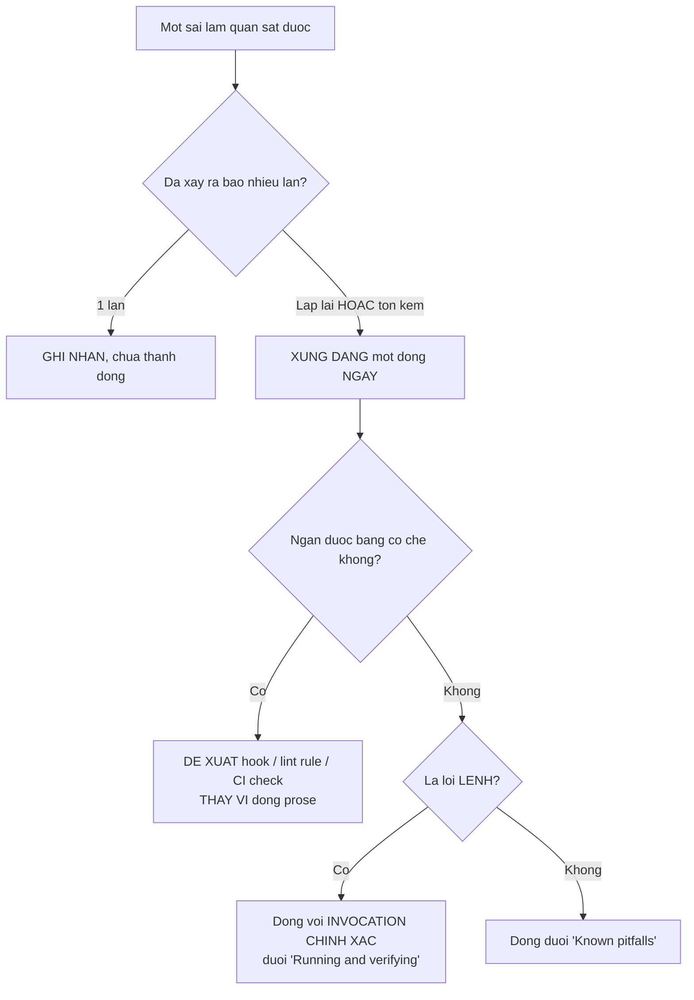
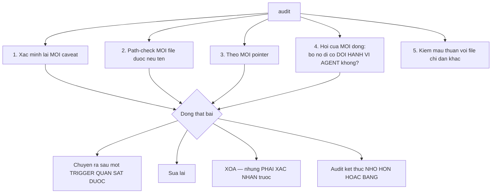
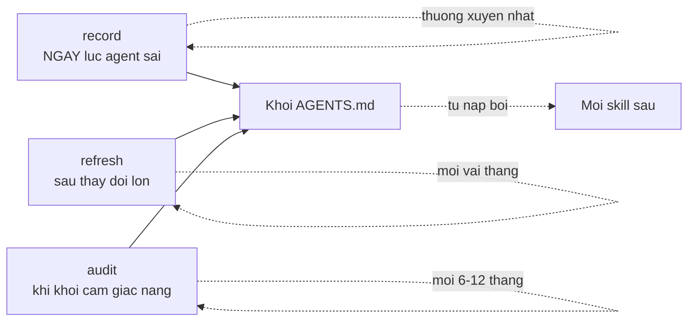

# 06 — Ghi nhận sai sót và bảo trì ngữ cảnh

> [← Mục lục](./index.md) · Trước: [05 — Thực thi](./05-thuc-thi.md) · Tiếp: [07 — So sánh hai đường](./07-so-sanh-hai-duong.md)

`bmad-project-context` có **bốn** intent. Bước 02 dùng `setup`. Ba cái còn lại là vòng đời bảo trì.

---

## 1. Bốn intent



| Intent | Khi nào | Kết quả |
| --- | --- | --- |
| `setup` | Lần đầu | Khối mới |
| `refresh` | Sau thay đổi lớn | Khối được cập nhật, **chỉ lớn thêm khi có bằng chứng mới** |
| `record` | **Ngay lúc** agent làm sai | Có thể thêm một dòng, hoặc đề xuất một check |
| `audit` | Khi khối "cảm giác cũ" | Khối **nhỏ đi hoặc bằng** |

---

# Phần A — `record`: bắt sai lầm ngay lúc nó xảy ra

## A.1 Tình huống

Tuần sau, bạn giao agent làm CAP-1 (hủy món cụ thể). Nó viết migration nhưng đặt file vào sai chỗ:

```
Agent tạo: src/migrations/20260818-add-cancellation.js
Đúng phải là: migrations/20260818-add-cancellation.js
```

Bạn sửa tay. Rồi:

```
> bmad-project-context record
```

## A.2 Nguồn duy nhất được chấp nhận

> *Capture **one observed agent mistake as it happens** — **the only admissible source** for a pitfall line.*

```
📊 Ghi nhận sai sót. Cho mình bốn thứ:

  1. Nhiệm vụ agent đang làm
  2. Sai lầm cụ thể
  3. Cách sửa
  4. Bằng chứng
```

🛑 **HALT**

```
> 1. Viết migration cho bảng OrderCancellation
> 2. Đặt file vào src/migrations/ thay vì migrations/
> 3. Tôi move file sang migrations/
> 4. sequelize-cli config trỏ vào migrations/ ở gốc, nhưng repo có
>    thư mục src/ nên agent đoán nhầm
```

## A.3 Kiểm tra khối trước

```
📊 Kiểm khối hiện tại xem có dòng nào đã phủ chưa...

👁️ AGENTS.md — 18 dòng
   Mục "Where things are": không nhắc migrations
   Mục "Running and verifying": có "npm run migrate" caveat, không nói vị trí
   Mục "Known pitfalls": 2 dòng, không liên quan

Chưa có dòng nào phủ.
```

## A.4 Quyết định: một lần hay một dòng



```
📊 Đây là **lần đầu**. Theo quy tắc, một lần là **ghi nhận**, chưa thành
dòng — vì repo sinh ra hàng trăm sự thật trông-như-bẫy và không cái nào
dự đoán được sai lầm thật.

Nhưng: cái này **ngăn được bằng cơ chế**.

`.sequelizerc` hoặc `package.json` có thể khai báo đường dẫn migration
tường minh. Nếu có, agent đọc được và không đoán nữa.

👁️ Kiểm tra...
   .sequelizerc — KHÔNG tồn tại
   package.json — script "migrate": "sequelize-cli db:migrate", không nêu path
   → sequelize-cli đang dùng mặc định `migrations/`

Đề xuất: tạo `.sequelizerc`

```js
const path = require('path');
module.exports = {
  'migrations-path': path.resolve(__dirname, 'migrations'),
  'models-path':     path.resolve(__dirname, 'src', 'models'),
  'seeders-path':    path.resolve(__dirname, 'scripts', 'seeders'),
};
```

Nó làm đường dẫn **tường minh và đọc được**, thay vì một dòng prose bảo
agent nhớ.

  [C] Tạo .sequelizerc — check thay dòng
  [L] Chỉ thêm dòng prose vào khối
  [B] Cả hai
```

🛑 **HALT**

```
> C
```

```
📊 Tốt. Không dòng nào vào khối.

> Route anything mechanically preventable to a hook, lint rule, or CI
> check. A check that lands deletes its line.

Đề xuất diff cho `.sequelizerc` ở trên. Duyệt?
```

🛑 **HALT** → 📄 **`.sequelizerc`** được tạo.

## A.5 Trường hợp ngược lại — khi nó thành dòng

Hai tuần sau, agent lại làm sai, lần này khác:

```
> bmad-project-context record

> 1. Sửa service tính tiền
> 2. Dùng parseFloat() cho giá trị tiền
> 3. Tôi đổi thành parseInt()
> 4. Lần thứ ba rồi. Lần trước là trong payment.js, lần trước nữa
>    trong order.js
```

```
📊 **Lần thứ ba** — lặp lại, xứng đáng một dòng ngay.

Khối đã có: "Tiền là số nguyên VNĐ, không bao giờ float — float từng
gây lệch 1 đồng khi tính chiết khấu."

Dòng này **đã tồn tại** nhưng agent vẫn sai. Nghĩa là dòng prose không
đủ.

Ngăn được bằng cơ chế không?
  → eslint rule cấm parseFloat/Number.parseFloat trong src/services/
    và src/domain/: CÓ

Đề xuất:

```js
{
  files: ['src/services/**/*.js', 'src/domain/**/*.js'],
  rules: {
    'no-restricted-globals': ['error', {
      name: 'parseFloat',
      message: 'Tiền là số nguyên VNĐ. Dùng parseInt hoặc Number.',
    }],
  },
}
```

Nếu check này land, dòng prose hiện có **vẫn ở lại** — nó giải thích
*vì sao*, và check chỉ chặn một cách vi phạm cụ thể. Nhưng nó sẽ bắt
được lần thứ tư.

Duyệt?
```

🛑 **HALT**

> Chú ý sự khác biệt: check **không phải lúc nào cũng xóa** dòng. Nó xóa dòng khi check **thay thế hoàn toàn** dòng đó. Ở đây dòng mang **lý do** (float từng gây lệch 1 đồng) mà check không diễn đạt được.

---

# Phần B — `refresh`: cập nhật sau thay đổi lớn

## B.1 Tình huống

Ba tháng sau. Đã làm xong CAP-1/2/3, thay 4 file legacy bằng service mới, và migrate xong sang vitest.

```
> bmad-project-context refresh
```

## B.2 Bước 1 là một **diff**, không phải đánh giá lại

```bash
# Đọc dòng provenance
$ grep "Verified" AGENTS.md
<!-- Verified 2026-08-11 against 4c8e21a. Managed by bmad-project-context... -->

# Diff xóa và đổi tên từ SHA đó
$ git log --diff-filter=DR --name-only 4c8e21a..HEAD
```

```
🤖 File bị XÓA hoặc ĐỔI TÊN từ 4c8e21a:

   D  src/legacy/orderLegacy.js
   D  src/legacy/paymentLegacy.js
   D  src/legacy/reportLegacy.js
   D  src/legacy/shipLegacy.js
   D  test/orders.jest.test.js
   D  test/payment.jest.test.js
   D  test/reconcile.jest.test.js
   R  docs/setup-2023.md → docs/archive/setup-2023.md
```

```
📊 Đối chiếu **từng dòng** của khối với diff:

| Dòng khối | Bằng chứng còn không? | Hành động |
| --- | --- | --- |
| "Không sửa src/legacy/ — đóng băng" | Còn 5/9 file | **GIỮ**, nhưng path-check lại |
| "Sáu chỗ raw query đều trong src/legacy/" | ⚠️ 4 file bị xóa — còn mấy chỗ? | **XÁC MINH LẠI** |
| "Năm route không dùng asyncHandler đều trong legacy" | ⚠️ Như trên | **XÁC MINH LẠI** |
| "Order ≠ PurchaseOrder, 23 file gọi 'don'" | Cần đếm lại | **XÁC MINH LẠI** |
| "docker compose up -d trước npm test" | package.json/CI không đổi | **GIỮ** |
| "npm run migrate sau khi sửa model" | ⚠️ `.sequelizerc` giờ khai báo path | **XÁC MINH LẠI** — caveat còn đúng không? |
| "Webhook replay 6h ở staging" | Hành vi runtime, không diff được | **HỎI NGƯỜI** |
| "Tiền là số nguyên VNĐ" | Còn | **GIỮ** |

Chạy xác minh...
```

🤖 **Subagent xác minh:**

```
🤖 Raw query trong src/legacy/: 2 chỗ (còn 5 file)
   Route không dùng asyncHandler: 2 (còn 5 file)
   File gọi 'don'/'donHang' mơ hồ: 23 → 19
   npm run migrate caveat: VẪN ĐÚNG — .sequelizerc chỉ khai báo path,
     không tự chạy migrate
```

## B.3 Phỏng vấn **thu hẹp**

```
📊 Phỏng vấn lần này ngắn hơn nhiều — mình **không hỏi lại** thứ lần
trước đã chốt.

Chỉ hai câu, về cái **đã thay đổi**:

1. Webhook staging còn replay 6h/lần không, hay cổng thanh toán đã đổi?
2. Ba tháng qua có sai lầm agent nào lặp lại mà bạn chưa `record` không?
```

🛑 **HALT**

> Trích SKILL.md: *"**Never re-ask what a prior run settled**; the interview shrinks to **what changed** about how the team works. **The block grows only on new evidence.**"*

```
> 1. Còn. Không đổi gì.
> 2. Agent hay quên rằng OrderCancellation phải tạo trong transaction
>    cùng với Payment refund. Hai lần rồi, đều phải rollback tay.
```

## B.4 Khối sau refresh

```diff
 <!-- bmad:context -->
-<!-- Verified 2026-08-11 against 4c8e21a. ... -->
+<!-- Verified 2026-11-14 against 7f3a91c. ... -->
 
 ## donhang-api
 
 API đơn hàng cho các cửa hàng Acme. Node/Express, Sequelize, MySQL. ...
 
 ## Policy
 
 - Không push thẳng `main`; chỉ PR, một approval.
 - Không sửa `src/legacy/` — đóng băng, đang thay dần bởi `src/services/`. ...
 - Không commit `.env` — dùng `.env.example` làm mẫu.
 
 ## Where things are
 
 - Xử lý webhook thanh toán: `src/routes/webhooks.js`, logic ở `src/services/payment.js`
 - Đối soát ngân hàng: `src/jobs/reconcile.js` — cron 2h sáng, sửa sai gây lệch sổ. Đọc kỹ trước khi đổi.
+- Hủy đơn và hoàn tiền: `src/services/cancellation.js`
 
 ## Running and verifying
 
 - Chạy `docker compose up -d` trước `npm test`; thiếu nó 4 test fail với `ECONNREFUSED 127.0.0.1:6379`, không nhắc gì tới docker.
 - Chạy `npm run migrate` sau khi sửa bất kỳ file nào trong `src/models/`; bỏ qua thì test fail với `column does not exist`.
 - CI cũng chạy `npm run typecheck`, mà `npm test` không phủ.
 
 ## Conventions that differ from defaults
 
 - Tiền là số nguyên VNĐ, không bao giờ float — float từng gây lệch 1 đồng khi tính chiết khấu.
-- Mọi truy cập DB đi qua `src/models/`; không gọi client Sequelize trực tiếp. Sáu chỗ dùng raw query đều nằm trong `src/legacy/` và không phải mẫu để theo.
-- Mọi route dùng `asyncHandler` từ `src/utils/asyncHandler.js`; năm route không dùng đều trong `src/legacy/`.
+- Mọi truy cập DB đi qua `src/models/`; không gọi client Sequelize trực tiếp. Hai chỗ dùng raw query còn lại đều trong `src/legacy/` và không phải mẫu để theo.
+- Mọi route dùng `asyncHandler` từ `src/utils/asyncHandler.js`; hai route không dùng đều trong `src/legacy/`.
 
 ## Known pitfalls
 
-- `Order` là đơn khách đặt, `PurchaseOrder` là đơn nhập hàng từ NCC — 23 file gọi cả hai là `don`/`donHang` trong tên biến. ...
+- `Order` là đơn khách đặt, `PurchaseOrder` là đơn nhập hàng từ NCC — 19 file gọi cả hai là `don`/`donHang` trong tên biến. ...
 - Webhook thanh toán replay 6 giờ/lần ở staging khi chưa nhận 200 — handler phải idempotent.
+- Tạo `OrderCancellation` và gọi `payment.refund()` phải nằm trong cùng một transaction; tách ra thì hoàn tiền thành công mà bản ghi hủy không có, phải rollback tay.
 
 <!-- /bmad:context -->
```

```
📊 Refresh xong.

  Cập nhật: 3 dòng (số liệu đã thay đổi)
  Thêm:     2 dòng (1 pointer, 1 pitfall có bằng chứng 2 lần)
  Xóa:      0 dòng
  Provenance: 4c8e21a → 7f3a91c

  18 dòng → 20 dòng

Khối **chỉ lớn thêm khi có bằng chứng mới**. Hai dòng thêm đều có bằng
chứng: pointer tới file thật đã tồn tại, và pitfall xảy ra hai lần.
```

---

# Phần C — `audit`: cắt tỉa

## C.1 Tình huống

Một năm sau. Khối đã 27 dòng. Cảm giác nặng.

```
> bmad-project-context audit
```

## C.2 Bốn việc audit làm



## C.3 Kết quả

```
📊 Audit 27 dòng.

**Caveat không còn đúng (3):**

| Dòng | Vấn đề |
| --- | --- |
| "npm test mất ~11 phút, iterate trên file lẻ" | Đo lại: **2 phút 40**. CI đã song song hoá. Caveat không còn đúng |
| "docker compose up -d trước npm test" | `pretest` script đã thêm 4 tháng trước — nó tự chạy. **Check đã land** |
| "src/legacy/ đóng băng, đang thay dần" | Path-check: `src/legacy/` **không còn tồn tại**. Đã thay xong |

**Path-check thất bại (1):**

| Dòng | Vấn đề |
| --- | --- |
| "Đọc docs/db-rules.md trước khi viết migration" | File **không tồn tại**. Bị xóa 7 tháng trước |

**Không đổi hành vi agent (2):**

| Dòng | Vấn đề |
| --- | --- |
| "Dự án dùng Sequelize làm ORM" | Agent thấy trong `package.json` 2 giây. Không rõ nó lọt vào lúc nào |
| "Ưu tiên code dễ đọc" | Platitude |

**Mâu thuẫn với file khác (1):**

| Dòng | Vấn đề |
| --- | --- |
| "Chạy npm run migrate sau khi sửa model" | `CLAUDE.md` (ai đó thêm) nói "chạy `npx sequelize-cli db:migrate`". Hai chỉ dẫn khác nhau cho cùng việc |

**Cần xác nhận trước khi xóa:**

Bốn dòng đầu mình đề xuất xóa. Ba dòng cuối cũng vậy. Nhưng:

⚠️ Dòng "src/legacy/ đóng băng" là **policy**. Quy tắc nói:

> A policy or pitfall line goes only when **the thing it guards is gone**,
> or the user retires it.

`src/legacy/` đã biến mất → **thứ nó canh đã đi** → xóa được.

⚠️ Hai dòng pitfall còn lại (Order/PurchaseOrder, webhook replay) **KHÔNG**
bị đề xuất xóa dù chúng "không fail gần đây". Quy tắc:

> **Nothing failing lately is not grounds.** A working rule erases its
> own evidence.

Xác nhận xóa 7 dòng?
```

🛑 **HALT**

```
> xóa 6, giữ "npm run migrate" nhưng sửa CLAUDE.md cho khớp
```

```
📊 Được. Đề xuất sửa `CLAUDE.md`:

```diff
-- Chạy `npx sequelize-cli db:migrate` sau khi đổi model
+- Xem AGENTS.md cho quy tắc chạy và xác minh.
```

> Two live contradictory instructions is a defect.

Kết quả audit: **27 dòng → 21 dòng.**

Audit **kết thúc nhỏ hơn hoặc bằng** — đó là bất biến của nó.
```

---

## 3. Bảng: bốn intent so sánh

| | `setup` | `refresh` | `record` | `audit` |
| --- | --- | --- | --- | --- |
| **Kích hoạt** | Chưa có khối | Sau thay đổi lớn | Ngay lúc agent sai | Khối cảm giác cũ |
| **Bước 1** | Đánh giá đầy đủ | **Diff từ SHA** | Kiểm khối xem đã phủ chưa | Xác minh lại **mọi** dòng |
| **Phỏng vấn** | Nhiều batch | **Thu hẹp** — chỉ cái đã đổi | Không (bạn báo cáo) | Không |
| **Khối có thể lớn lên?** | — | Chỉ khi có **bằng chứng mới** | Chỉ khi **lặp lại/tốn kém** | **Không bao giờ** |
| **Khối có thể nhỏ đi?** | — | Có (dòng mất bằng chứng) | Không | **Đó là mục đích** |
| **Thời gian** | 60–90 phút | 20–30 phút | 5–10 phút | 25–40 phút |

---

## 4. Nhịp bảo trì khuyến nghị



| Việc | Nhịp | Vì sao |
| --- | --- | --- |
| `record` | **Ngay lúc xảy ra** | *"Capture mistakes **when they happen, not at review time**"* |
| `refresh` | Sau mỗi thay đổi kiến trúc lớn | Diff từ SHA giữ khối khớp thực tế |
| `audit` | 6–12 tháng | Chống tích tụ |
| Ưu tiên check hơn dòng | Luôn | *"A check that lands deletes its line"* |

---

## 5. Tóm tắt bước này

| Intent | Script chạy | 👁️ Đọc | 📄 Ghi | 🛑 |
| --- | --- | --- | --- | --- |
| `record` | `resolve_customization.py`, `resolve_config.py` | `AGENTS.md`, `package.json`, `.sequelizerc` | `.sequelizerc` (check thay dòng) | 2 |
| `refresh` | như trên + `git log --diff-filter=DR` | `AGENTS.md`, diff từ SHA, `src/**` qua subagent | `AGENTS.md` (18→20 dòng) | 2 |
| `audit` | như trên | `AGENTS.md`, path-check mọi file, `CLAUDE.md` | `AGENTS.md` (27→21 dòng), `CLAUDE.md` | 1 |

---

**Tiếp:** [07 — So sánh hai đường](./07-so-sanh-hai-duong.md) · [← Mục lục](./index.md)
