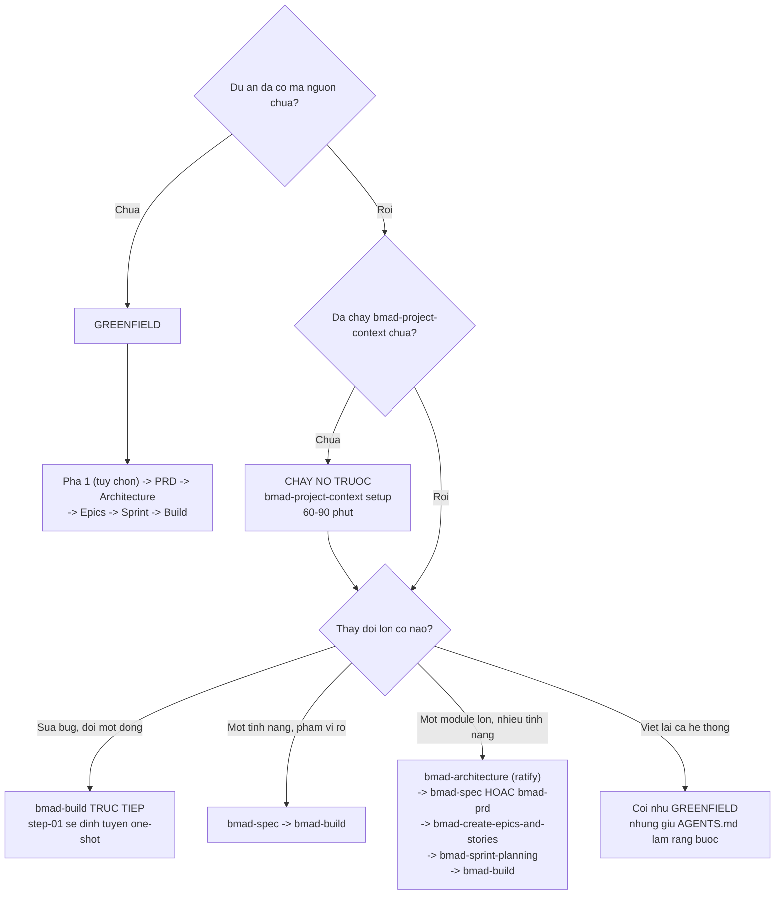
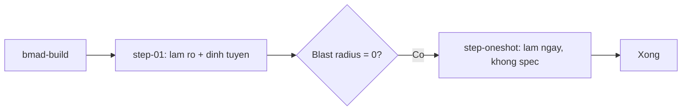
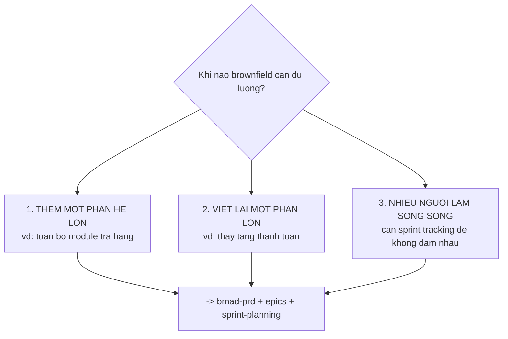

# 07 — So sánh hai đường và chọn đúng

> [← Mục lục](./index.md) · Trước: [06 — Ghi nhận & bảo trì](./06-ghi-nhan-va-bao-tri.md)

---

## 1. Bảng so sánh tổng thể

| | [Greenfield](../demo/index.md) | Brownfield (tài liệu này) |
| --- | --- | --- |
| **Dự án demo** | `quan-ly-kho` — làm mới | `donhang-api` — 47k dòng, 3 năm |
| **Điểm xuất phát** | Repo trống + một câu của sếp | Mã đang chạy + một yêu cầu tính năng |
| **Bước đầu tiên** | `bmad-help` → `bmad-brainstorming` | `bmad-help` → **`bmad-project-context`** |
| **Nguồn sự thật** | Tài liệu bạn viết ra | **Mã nguồn đang chạy** |
| **Vai kiến trúc sư** | Thiết kế mới, đề xuất starter | **Phê chuẩn (ratify)** quy ước đã có |
| **Chốt yêu cầu** | `bmad-prd` (bắt buộc) | **`bmad-spec`** (đủ, gọn hơn) |
| **Chia việc** | `bmad-create-epics-and-stories` + `bmad-sprint-planning` | **Không cần** — một thay đổi có phạm vi rõ |
| **Nhánh step-01** | Epic story | **Freeform** |
| **Cache ngữ cảnh** | `epic-N-context.md` | Không có — `AGENTS.md` + spine |
| **Sprint tracking** | `sprint-status.yaml` | Không dùng |
| **Tạo phẩm đặc thù** | 8 file trong `planning-artifacts/` | **`AGENTS.md`** (1 file, 18 dòng) |
| **Rủi ro chính** | Xây sai thứ | **Phá thứ đang chạy** |
| **Loại finding hay gặp** | `bad_spec`, `patch` | **`defer`** (nợ kỹ thuật cũ) |
| **Tổng thời gian demo** | ~5 giờ (4 story) | ~3 giờ (1 thay đổi) |

---

## 2. Cây quyết định



---

## 3. Ba mức thay đổi trên dự án brownfield

### Mức 1 — Sửa nhỏ, blast radius bằng 0

**Ví dụ:** đổi thông báo lỗi, sửa typo trong response, thêm một log.

```
> bmad-build đổi thông báo lỗi khi hủy đơn từ "Invalid" thành
  "Đơn đã ở trạng thái không hủy được"
```

**Luồng:**



Không có spec, không có review nhiều lớp. **~5 phút.**

⚠️ Nhưng: step-01 vẫn kiểm tra VCS và vẫn nạp `AGENTS.md`. Nên nếu bạn đang ở `main` hoặc cây bẩn, nó vẫn HALT.

### Mức 2 — Một tính năng, phạm vi rõ (demo này)

**Ví dụ:** hủy đơn hoàn tiền một phần.

```
bmad-project-context (nếu chưa)
  → bmad-architecture (ratify, phạm vi hẹp)
  → bmad-spec
  → bmad-build
```

**~3 giờ.**

### Mức 3 — Module lớn, nhiều tính năng liên quan

**Ví dụ:** thêm toàn bộ phân hệ quản lý trả hàng.

```
bmad-project-context
  → bmad-architecture (ratify + thiết kế phần mới)
  → bmad-prd  (vì cần tranh luận yêu cầu với nhiều bên)
  → bmad-create-epics-and-stories
  → bmad-sprint-planning
  → bmad-build × N story
  → bmad-retrospective
```

Lúc này luồng **giống greenfield**, chỉ khác là kiến trúc phải phê chuẩn cái cũ trước khi thiết kế cái mới.

---

## 4. Sáu cạm bẫy đặc thù brownfield

### 4.1 `persistent_facts` không bắt được `AGENTS.md`

| | |
| --- | --- |
| **Triệu chứng** | Skill không nhắc tới quy ước trong `AGENTS.md` |
| **Nguyên nhân** | Mặc định glob `file:{project-root}/**/project-context.md`, không phải `AGENTS.md` |
| **Xử lý** | Thêm override, hoặc dựa vào công cụ AI tự đọc `AGENTS.md` |

```toml
# _bmad/custom/bmad-build.toml
[workflow]
persistent_facts = ["file:{project-root}/AGENTS.md"]
```

Kiểm chứng:

```bash
uv run _bmad/scripts/resolve_customization.py \
  -s "$(pwd)/.claude/skills/bmad-build" -p "$(pwd)" -k workflow.persistent_facts
```

⚠️ Đổi `persistent_facts` **đổi `generation_hash`** → snapshot kết xuất lại. Đúng.

### 4.2 Cây làm việc bẩn

| | |
| --- | --- |
| **Triệu chứng** | Diff review lẫn thay đổi của bạn |
| **Nguyên nhân** | Repo nhiều người, hay có work-in-progress |
| **Xử lý** | step-01 đã HALT. Đừng bỏ qua — commit hoặc stash trước |

### 4.3 Nhánh sai

| | |
| --- | --- |
| **Triệu chứng** | Làm việc trên `main` trong khi policy cấm |
| **Nguyên nhân** | Quên tạo nhánh |
| **Xử lý** | Nếu `AGENTS.md` có policy về nhánh, step-01 sẽ đối chiếu và HALT |

### 4.4 Nhiều `defer` làm phình việc

| | |
| --- | --- |
| **Triệu chứng** | Review tìm ra 10 vấn đề, 7 cái không liên quan story |
| **Nguyên nhân** | Nợ kỹ thuật cũ lộ ra khi soi kỹ |
| **Xử lý** | Triage đúng: `defer` ghi vào `deferred-work.md`, **không** sửa trong story hiện tại |

Trích step-04: *"`defer` — pre-existing issue **not caused by this story**, surfaced incidentally by the review. **Collect for later focused attention.**"*

Và: *"When unsure between `defer` and `reject`, **prefer `reject`** — only defer findings you are **confident** are real."*

### 4.5 Tài liệu cũ mâu thuẫn với mã

| | |
| --- | --- |
| **Triệu chứng** | Agent làm theo `docs/` lỗi thời |
| **Nguyên nhân** | Tài liệu không được bảo trì |
| **Xử lý** | `bmad-project-context` phát hiện và **đề xuất sửa file đó** |

Trích SKILL.md: *"Where an instruction elsewhere contradicts the block in a way that changes behavior... propose the fix to that file. **Two live contradictory instructions is a defect.**"*

### 4.6 Mã có bẫy im lặng

| | |
| --- | --- |
| **Triệu chứng** | Tính năng mới làm vỡ thứ không liên quan trực tiếp |
| **Ví dụ trong demo** | `reconcile.js` cộng mọi Payment không lọc type |
| **Xử lý** | `bmad-architecture` quét có mục tiêu là nơi tìm ra. Ghi thành AD chặn deploy |

⚠️ Đây là **giá trị lớn nhất** của bước phê chuẩn kiến trúc ở brownfield. Không có nó, bạn phát hiện lúc 2h sáng ba tuần sau.

---

## 5. Bảng: tạo phẩm hai đường

### Greenfield

```
_bmad-output/
├── brainstorming/brainstorm-{slug}-{date}/
│   ├── .memlog.md
│   ├── brainstorm.html
│   └── brainstorm-intent.md
├── planning-artifacts/
│   ├── brief.md
│   ├── addendum.md
│   ├── prd.md
│   ├── prd.memlog.md
│   ├── ARCHITECTURE-SPINE.md
│   └── epics.md
└── implementation-artifacts/
    ├── sprint-status.yaml
    ├── epic-N-context.md
    ├── spec-*.md × N
    ├── deferred-work.md
    └── retrospective-epic-N.md
```

### Brownfield

```
AGENTS.md                          ★ tạo phẩm quan trọng nhất

_bmad-output/
├── planning-artifacts/
│   └── ARCHITECTURE-SPINE.md      (phê chuẩn, phạm vi hẹp)
├── specs/
│   └── spec-{slug}/
│       ├── SPEC.md
│       └── .memlog.md
└── implementation-artifacts/
    ├── spec-*.md
    └── deferred-work.md
```

**Brownfield sinh ít tạo phẩm hơn hẳn** — đúng theo triết lý: viết xuống thứ mã không nói được, không nhân bản thứ agent tự đọc.

---

## 6. Bảng: script chạy ở hai đường

| Script | Greenfield | Brownfield |
| --- | --- | --- |
| `resolve_config.py` | ~12 lần | ~6 lần |
| `resolve_customization.py` | ~14 lần | ~7 lần |
| `render_skill.py` | 4 (mỗi story) | 1 |
| `memlog.py` | ~49 lần | ~13 lần |
| `brain.py` | Có | Không |
| `pick_methods.py` | Có | Không |
| `word_metrics.py` | Có | Không (trừ khi review tài liệu) |
| `lint_spine.py` | 1 | 1 |
| `sprint_plan.py` | 1 (`generate`) | **Không dùng** |
| `sprint_status.py` | 1 | Không dùng |
| `git_evidence.py` | 1 | Không dùng (trừ khi có retro) |

---

## 7. Khi nào brownfield cần đủ luồng greenfield

Ba trường hợp:



Dấu hiệu nhận biết:

| Dấu hiệu | Nghĩa |
| --- | --- |
| Yêu cầu cần tranh luận với ≥ 2 bên liên quan | Cần **PRD**, không phải spec |
| Việc chia được thành ≥ 4 story độc lập | Cần **epics + sprint-planning** |
| Nhiều người làm song song | Cần **sprint-status.yaml** |
| Kéo dài > 2 tuần | Cần **retrospective** |

Ngược lại, nếu bạn là dev duy nhất làm một tính năng trong 3 ngày — luồng của demo này đủ.

---

## 8. Câu hỏi thường gặp

### "Tôi có phải chạy `bmad-project-context` không?"

Nó **không bắt buộc** (`required = false` trong catalog). Nhưng:

| Không chạy | Chạy |
| --- | --- |
| Mỗi phiên bạn phải giải thích lại quy ước | Agent tự biết |
| Agent lặp lại cùng sai lầm | Pitfall line chặn |
| `bmad-architecture` không có ràng buộc nền | Nạp qua `persistent_facts` |
| Người mới vào nhóm phải hỏi | Đọc 18 dòng |

Với dự án bạn sẽ làm việc lâu dài, **chạy nó**.

### "Nó có thay thế tài liệu kỹ thuật không?"

**Không.** Nó là **chỉ dẫn cho agent**, không phải tài liệu cho người.

| | `AGENTS.md` | `docs/` |
| --- | --- | --- |
| Độc giả | AI agent | Người |
| Nội dung | Thứ mã không nói được | Ý định, lý lẽ nghiệp vụ, quy tắc |
| Kích thước | ~20 dòng | Bao nhiêu cũng được |
| Chi phí | Mỗi phiên | Chỉ khi ai đó mở |

Theo `docs/how-to/established-projects.md`: `docs/` nên chứa *"Intent and business rationale, Business rules, Architecture"* — và `bmad-project-context` chỉ bảo trì **phần hướng-tới-agent** của nó.

### "Dự án tôi có 5 repo, làm sao?"

`bmad-project-context` xử lý theo bằng chứng:

> *If the target contains **separable units** — a workspace manifest listing members, or directories carrying their own build manifest — **name them and ask** whether this run covers the root only, all of them, or which. **Absent that evidence, do not ask.** **Sibling repositories are not children**; each is its own target, offered in turn.*

| Cấu trúc | Xử lý |
| --- | --- |
| Monorepo có workspace manifest | Skill hỏi: root only, tất cả, hay cái nào |
| Thư mục con có build manifest riêng | Như trên |
| 5 repo anh em riêng biệt | **Mỗi repo một lần chạy riêng** |

### "`ARCHITECTURE-SPINE.md` của tôi chỉ phủ một góc, có sao không?"

Không sao — đó là **thiết kế**. Spine ở brownfield có mục `## Phạm vi quét` nói rõ nó phủ gì. Chạy lại `bmad-architecture` khi thay đổi chạm vùng khác.

Trích SKILL.md: *"the slice of one a new feature touches"* — đây là một trong các đầu vào hợp lệ.

---

## 9. Kiểm tra sức khỏe bản cài brownfield

```bash
#!/usr/bin/env bash
# kiem-tra-brownfield.sh
set -u
R="$(pwd)"

echo "═══ 1. BMad đã cài? ═══"
[ -d "$R/_bmad" ] && echo "  ✓ _bmad/" || { echo "  ✗ chưa cài"; exit 1; }

echo
echo "═══ 2. AGENTS.md có khối bmad:context? ═══"
if grep -q "bmad:context" "$R/AGENTS.md" 2>/dev/null; then
  echo "  ✓ có khối"
  grep "Verified" "$R/AGENTS.md" | head -1 | sed 's/^/  /'
  echo "  Số dòng nội dung: $(sed -n '/bmad:context/,/\/bmad:context/p' "$R/AGENTS.md" | grep -c '^-')"
else
  echo "  ✗ chưa chạy bmad-project-context"
fi

echo
echo "═══ 3. persistent_facts có bắt AGENTS.md không? ═══"
for SKILL in bmad-build bmad-architecture bmad-spec; do
  if [ -d "$R/.claude/skills/$SKILL" ]; then
    FACTS=$(uv run "$R/_bmad/scripts/resolve_customization.py" \
      -s "$R/.claude/skills/$SKILL" -p "$R" -k workflow.persistent_facts 2>/dev/null)
    if echo "$FACTS" | grep -q "AGENTS.md"; then
      echo "  ✓ $SKILL"
    else
      echo "  ! $SKILL — chỉ có glob project-context.md"
    fi
  fi
done

echo
echo "═══ 4. Có spine chưa? ═══"
[ -f "$R/_bmad-output/planning-artifacts/ARCHITECTURE-SPINE.md" ] \
  && echo "  ✓ ARCHITECTURE-SPINE.md" || echo "  — chưa có (chạy bmad-architecture)"

echo
echo "═══ 5. Nợ kỹ thuật đã ghi nhận ═══"
if [ -f "$R/_bmad-output/implementation-artifacts/deferred-work.md" ]; then
  echo "  $(grep -c '^- source_spec:' "$R/_bmad-output/implementation-artifacts/deferred-work.md") mục deferred"
else
  echo "  — chưa có mục nào"
fi

echo
echo "═══ 6. Cây làm việc ═══"
DIRTY=$(git -C "$R" status --porcelain 2>/dev/null | wc -l)
BRANCH=$(git -C "$R" branch --show-current 2>/dev/null)
[ "$DIRTY" -eq 0 ] && echo "  ✓ sạch" || echo "  ! $DIRTY file chưa commit"
echo "  Nhánh: $BRANCH"
```

---

## 10. Tài liệu liên quan

| Muốn hiểu | Đọc |
| --- | --- |
| Luồng greenfield đầy đủ | [demo/](../demo/index.md) |
| Hệ thống làm cái gì | [Đặc tả hệ thống](../tai-lieu-he-thong/01-dac-ta-he-thong.md) |
| Hệ thống hoạt động thế nào | [Thiết kế hệ thống](../tai-lieu-he-thong/02-thiet-ke-he-thong.md) |
| Cài đặt, cấu hình, khắc phục sự cố | [Vận hành hệ thống](../tai-lieu-he-thong/03-van-hanh-he-thong.md) |
| Chi tiết từng skill module core | [Tài liệu core](../tai-lieu-core/index.md) |
| Cơ chế cấu hình và override | [Core A3](../tai-lieu-core/A3-cau-hinh-va-tuy-bien.md) |
| Chạy tay từng script | [Core C1](../tai-lieu-core/C1-so-tay-van-hanh-thu-cong.md) |

---

**[← Mục lục brownfield](./index.md)** · **[Mục lục greenfield](../demo/index.md)**
