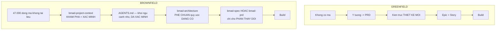
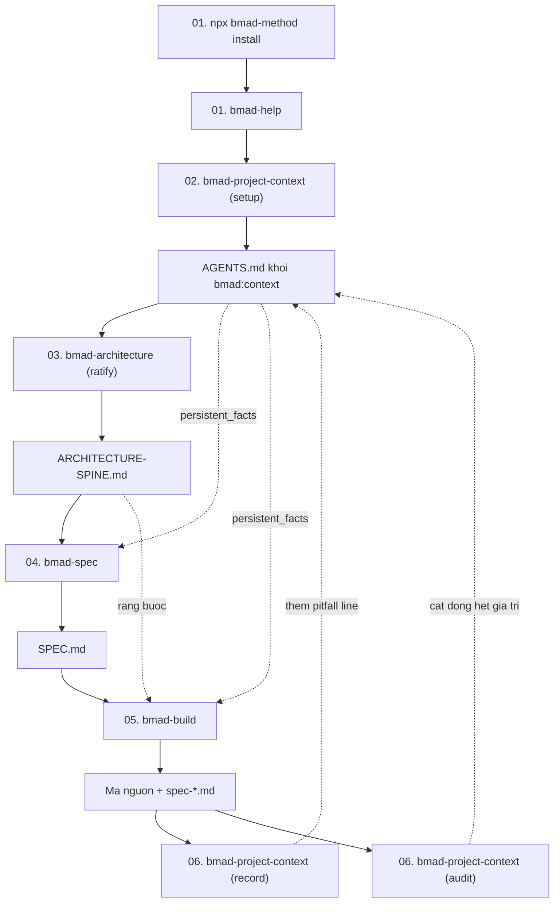

# DEMO BROWNFIELD — Áp BMAD vào dự án đã có mã nguồn

> Kịch bản tuần tự cho **dự án kế thừa**: gọi lệnh gì → đọc/ghi file nào → kết quả ra sao.
>
> Bổ sung cho [demo greenfield](../demo/index.md). Nếu bạn chưa đọc cái đó, đọc trước — demo này chỉ nêu **những gì khác biệt**.

---

## Dự án demo

| | |
| --- | --- |
| **Tên** | `donhang-api` |
| **Loại** | **Brownfield** — 3 năm tuổi, 47.000 dòng, 4 người từng làm |
| **Ngăn xếp** | Node.js + Express + Sequelize + MySQL |
| **Tình trạng** | Người viết ban đầu đã nghỉ. Không có tài liệu. Test 23% |
| **Việc được giao** | Thêm chức năng hủy đơn hàng có hoàn tiền một phần |
| **Công cụ AI** | Claude Code |

---

## Khác biệt cốt lõi so với greenfield

| Khía cạnh | Greenfield | Brownfield |
| --- | --- | --- |
| **Bước đầu tiên** | `bmad-brainstorming` / `bmad-prd` | **`bmad-project-context`** |
| **Nguồn sự thật** | Tài liệu bạn viết | **Mã nguồn đang chạy** |
| **Vai của kiến trúc sư** | Thiết kế mới | **Phê chuẩn (ratify)** cái đã có |
| **Phạm vi PRD** | Cả sản phẩm | **Chỉ phần thay đổi** |
| **Rủi ro chính** | Xây sai thứ | **Phá thứ đang chạy** |
| **Tạo phẩm đặc thù** | — | `AGENTS.md` khối `bmad:context` |

---

## Mục lục theo thứ tự chạy

| # | Bước | Tài liệu | Skill dùng | Đầu ra chính |
| --- | --- | --- | --- | --- |
| 00 | Bối cảnh | **[00-boi-canh.md](./00-boi-canh.md)** | — | Hiểu điểm xuất phát |
| 01 | Cài đặt & định hướng | **[01-cai-dat-va-dinh-huong.md](./01-cai-dat-va-dinh-huong.md)** | `install`, `bmad-help` | `_bmad/`, biết đi đâu |
| 02 | Thiết lập ngữ cảnh repo | **[02-project-context.md](./02-project-context.md)** | `bmad-project-context` | Khối `AGENTS.md` đã xác minh |
| 03 | Phê chuẩn kiến trúc | **[03-phe-chuan-kien-truc.md](./03-phe-chuan-kien-truc.md)** | `bmad-architecture` | `ARCHITECTURE-SPINE.md` |
| 04 | Chốt phạm vi thay đổi | **[04-chot-pham-vi.md](./04-chot-pham-vi.md)** | `bmad-spec` | `SPEC.md` |
| 05 | Thực thi | **[05-thuc-thi.md](./05-thuc-thi.md)** | `bmad-build` | `spec-*.md` + mã |
| 06 | Ghi nhận sai sót & bảo trì | **[06-ghi-nhan-va-bao-tri.md](./06-ghi-nhan-va-bao-tri.md)** | `bmad-project-context record/audit` | Khối `AGENTS.md` được tinh chỉnh |
| 07 | So sánh hai đường | **[07-so-sanh-hai-duong.md](./07-so-sanh-hai-duong.md)** | — | Chọn đường phù hợp |

---

## Toàn cảnh luồng

---

## Ba nguyên tắc chi phối toàn bộ demo này

### 1. Phép thử của `bmad-project-context`

> *Can an agent **derive this by reading the repository**? If yes, **leave it out** — a stored copy is a stale duplicate of something the agent reads more accurately first-hand, and **it is charged on every session**. Write down what the code cannot say.*

Đây là lý do BMad v6 **không** sinh ra hàng trăm trang tài liệu tự động cho dự án cũ. Nó sinh ra một **khối nhỏ đã xác minh**.

### 2. Kiến trúc sư phê chuẩn, không phát minh

> *For brownfield, **investigate before you decide** — read enough of the real code to **ratify the conventions already there rather than invent new ones** — and **don't re-tell the user what the scan already shows**.*

### 3. Bằng chứng quan sát được mới thành dòng pitfall

> *A repo yields **hundreds of trap-looking facts and none of them predict real mistakes**; only observed behavior does. A surprising scan finding is **a question to ask, not a line to write**.*

---

## Quy ước ký hiệu

| Ký hiệu | Nghĩa |
| --- | --- |
| `$ lệnh` | Lệnh bạn gõ trong terminal |
| `> tên-skill` | Điều bạn gõ trong công cụ AI |
| 📄 | File được **tạo mới** |
| ✏️ | File được **sửa** |
| 👁️ | File được **đọc** |
| 🛑 | Điểm dừng chờ người |
| 🤖 | Subagent được sinh ra |
| ⚠️ | Cạm bẫy đặc thù brownfield |

---

**Bắt đầu:** [00 — Bối cảnh](./00-boi-canh.md)
