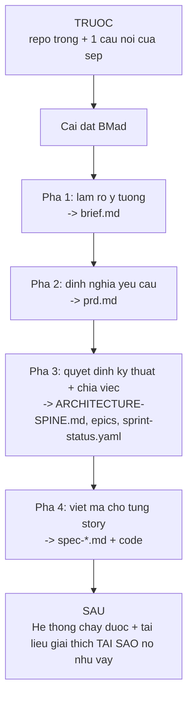

# 00 — Bối cảnh và điểm xuất phát

> [← Mục lục demo](./index.md) · Tiếp: [01 — Cài đặt](./01-cai-dat.md)

---

## 1. Câu chuyện

Bạn là lập trình viên duy nhất của một công ty phân phối vật tư xây dựng. Kho có 3 nhân viên, khoảng 2.000 mã hàng.

**Vấn đề hiện tại:**

- Kiểm kê bằng giấy, mỗi tháng một lần, mất 2 ngày
- Số liệu trên giấy và số liệu kế toán lệch nhau 5–15%
- Không ai biết tồn kho thật cho đến khi kiểm kê xong
- Đơn hàng bị hủy vì báo còn hàng nhưng thực tế hết

**Bạn được giao:** làm một hệ thống quản lý kho. Không có yêu cầu chi tiết. Sếp nói "làm sao biết còn bao nhiêu hàng là được".

Đây là tình huống điển hình mà BMAD-METHOD được thiết kế cho: **ý tưởng mơ hồ, cần làm rõ trước khi viết dòng mã đầu tiên**.

---

## 2. Điểm xuất phát trên đĩa

```
D:/du-an/quan-ly-kho/
├── .git/
├── .gitignore
├── package.json
├── README.md
└── src/
    └── index.ts        # chỉ có console.log("hello")
```

Nội dung `package.json`:

```json
{
  "name": "quan-ly-kho",
  "version": "0.1.0",
  "private": true,
  "type": "module",
  "scripts": {
    "dev": "tsx watch src/index.ts",
    "build": "tsc",
    "test": "vitest run",
    "lint": "eslint src"
  },
  "devDependencies": {
    "typescript": "^5.7.0",
    "tsx": "^4.19.0",
    "vitest": "^2.1.0",
    "eslint": "^9.17.0"
  }
}
```

Tức là: **repo trống, có git, có TypeScript, chưa có gì cả.**

---

## 3. Môi trường

```bash
$ node --version
v20.18.1

$ npm --version
10.8.2

$ python --version
Python 3.12.7

$ uv --version
uv 0.5.11

$ git --version
git version 2.47.1
```

Đủ điều kiện: Node ≥ 20.12, Python ≥ 3.11, có `uv`, có git.

Công cụ AI: **Claude Code** (`claude` trong terminal).

---

## 4. Điều gì sẽ xảy ra



**Điều BMad thêm vào mà "vibe coding" không có:**

| | Không có BMad | Có BMad |
| --- | --- | --- |
| Yêu cầu | Trong đầu bạn, thay đổi mỗi ngày | `prd.md` — hiển ngôn, có thể tranh luận |
| Quyết định kỹ thuật | Ngầm định, mỗi file một kiểu | `ARCHITECTURE-SPINE.md` — bất biến chung |
| Ngữ cảnh cho AI | Giải thích lại mỗi cuộc trò chuyện | Tự nạp từ tạo phẩm |
| Phạm vi một lần làm | Trôi dạt | Spec 900–1600 token, một mục tiêu |
| Chất lượng | Đọc lướt rồi merge | 5 lens review, kiểm tra khoảng trống test |
| Bài học | Quên | `retrospective.md` + action items |

---

## 5. Thư mục sau khi chạy xong toàn bộ demo

```
D:/du-an/quan-ly-kho/
├── .claude/
│   └── skills/                          ← 49 thư mục skill (bản sao)
│       ├── bmad-help/
│       ├── bmad-build/
│       └── ...
├── _bmad/                               ← runtime BMad
│   ├── config.toml
│   ├── config.user.toml
│   ├── _config/
│   │   ├── manifest.yaml
│   │   ├── skill-manifest.csv
│   │   ├── files-manifest.csv
│   │   └── bmad-help.csv
│   ├── core/
│   ├── bmm/
│   │   └── config.yaml
│   ├── scripts/
│   ├── custom/
│   │   └── .gitignore
│   └── render/
│       └── .gitignore
├── _bmad-output/                        ← tạo phẩm của bạn
│   ├── brainstorming/
│   │   └── brainstorm-quan-ly-kho-2026-08-11/
│   │       ├── .memlog.md
│   │       ├── brainstorm.html
│   │       └── brainstorm-intent.md
│   ├── planning-artifacts/
│   │   ├── brief.md
│   │   ├── prd.md
│   │   ├── .memlog.md
│   │   ├── ARCHITECTURE-SPINE.md
│   │   └── epics.md
│   └── implementation-artifacts/
│       ├── sprint-status.yaml
│       ├── epic-1-context.md
│       ├── spec-1-1-mo-hinh-du-lieu-ton-kho.md
│       ├── spec-1-2-api-nhap-xuat-kho.md
│       └── retrospective-epic-1.md
├── docs/                                ← project_knowledge
├── src/                                 ← mã nguồn thật
│   ├── index.ts
│   ├── db/
│   ├── domain/
│   ├── api/
│   └── __tests__/
├── AGENTS.md                            ← ngữ cảnh dự án cho AI
├── package.json
└── README.md
```

---

## 6. Ba câu hỏi trước khi bắt đầu

### "Tôi có phải đi hết 4 pha không?"

**Không.** Thay đổi nhỏ đi thẳng vào `bmad-build`. Demo này đi đủ 4 pha vì dự án là **greenfield lớn, yêu cầu mơ hồ** — đúng tình huống cần chiều sâu.

Chỉ **4 mục** là bắt buộc (`required = true` trong catalog):

| Mã | Skill | Pha |
| --- | --- | --- |
| `PRD` | `bmad-prd` | 2 |
| `CA` | `bmad-architecture` | 3 |
| `CE` | `bmad-create-epics-and-stories` | 3 |
| `SP` | `bmad-sprint-planning` | 3 |
| `BD` | `bmad-build` | 4 |

Pha 1 **hoàn toàn tùy chọn**.

### "Mỗi bước tốn bao lâu?"

| Bước | Thời gian người | Ghi chú |
| --- | --- | --- |
| Cài đặt | 3–5 phút | Chủ yếu là trả lời prompt |
| Brainstorm | 30–90 phút | Tùy bạn muốn đào sâu bao nhiêu |
| Product brief | 20–40 phút | |
| PRD | 45–90 phút | Nhiều điểm dừng hỏi |
| Architecture | 30–60 phút | |
| Epics & stories | 20–40 phút | |
| Sprint planning | 10–20 phút | Chủ yếu là cổng readiness |
| Build một story | 15–45 phút | Tùy độ phức tạp |

### "Tôi có phải chạy tất cả trong một phiên không?"

**Không — và không nên.** Khuyến nghị chính thức:

> *Recommend running each skill in a **fresh context window**.*

Mỗi skill mở một cuộc trò chuyện mới. Ngữ cảnh được mang sang qua **file trên đĩa**, không qua lịch sử chat.

---

**Tiếp:** [01 — Cài đặt](./01-cai-dat.md) · [← Mục lục demo](./index.md)
