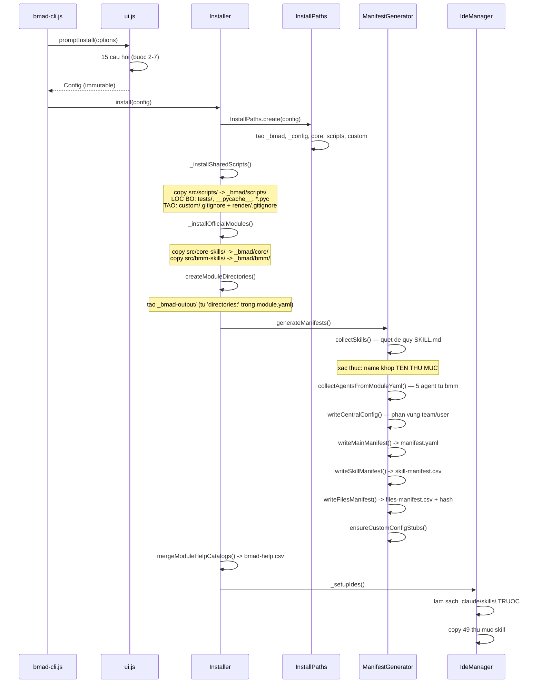

# 01 — Cài đặt

> [← Mục lục demo](./index.md) · Trước: [00 — Bối cảnh](./00-boi-canh.md) · Tiếp: [02 — Định hướng](./02-dinh-huong.md)

---

## Lệnh

```bash
$ cd D:/du-an/quan-ly-kho
$ npx bmad-method install
```

---

## Luồng tương tác

### Bước 1 — Kiểm tra tiền điều kiện (tự động)

```
Checking for updates...
✓ You are on the latest version (6.10.0)
✓ Node.js v20.18.1
✓ uv 0.5.11 found
```

Bên trong, installer chạy:

| Kiểm tra | Mã nguồn |
| --- | --- |
| Phiên bản npm mới | `bmad-cli.js:checkForUpdate()` — bất đồng bộ, timeout 5s, thất bại im lặng |
| Node Windows chạy trong WSL | `core/wsl-node-check.js` |
| `uv` có sẵn | `core/uv-check.js` |

### Bước 2 — Thư mục cài đặt

```
┌  BMad Method Installer v6.10.0
│
◆  Where should BMad be installed?
│  D:/du-an/quan-ly-kho
└
```

🛑 **HALT** — Enter để nhận mặc định (thư mục hiện tại).

### Bước 3 — Chọn module

```
◆  Select modules to install:
│  ◼ core        BMad Core Module — Shared utilities across modules  (bắt buộc)
│  ◼ bmm         BMad Method — Agile Ai Driven Development
│  ◻ bmb         BMad Builder — Skill, workflow, and agent builder
│  ◻ cis         BMad Creative Intelligence Suite — Creative thinking partners
│  ◻ tea         BMad Test Architect — Enterprise testing BMM add-on
│  ◻ bmad-loop   BMad Loop — Builds, verifies, and retros a whole epic unattended
│  ◻ gds         BMad Game Dev Studio — Ideate, design, and build games
└
```

🛑 **HALT** — chọn `core` + `bmm` (mặc định), Enter.

> `core` **không thể bỏ chọn** — `Config.build()` tự thêm nó vào đầu danh sách:
> ```js
> if (userInput.installCore && !modules.includes('core')) modules.unshift('core');
> ```

### Bước 4 — Kênh phiên bản

```
◆  Ready to install (all stable)?
│  ● Yes — latest released tag for every external module
│  ○ No — review each module's channel
└
```

🛑 **HALT** — chọn **Yes**.

> Không chọn module ngoài nào nên bước này không tốn lượt API GitHub nào.

### Bước 5 — Chọn công cụ AI

```
◆  Which AI tools should BMad integrate with?
│  ◼ claude-code       Claude Code           → .claude/skills
│  ◻ codex             Codex                 → .agents/skills
│  ◻ cursor            Cursor                → .agents/skills
│  ◻ github-copilot    GitHub Copilot        → .agents/skills
│  ◻ ... (41 lựa chọn khác)
└
```

🛑 **HALT** — chọn `claude-code`.

> Bốn công cụ hiện trên đầu là những cái có `preferred: true` trong `tools/installer/ide/platform-codes.yaml`.

### Bước 6 — Cấu hình module `core`

```
BMad Core Configuration
Configure the core settings for your BMad installation.
These settings will be used across all installed bmad skills, workflows, and agents.

◆  What should agents call you? (Use your name or a team name)
│  Thảo
└
◆  What is your project called?
│  quan-ly-kho
└
◆  What language should agents use when chatting with you?
│  Vietnamese
└
◆  Preferred document output language?
│  Vietnamese
└
◆  Where should output files be saved?
│  _bmad-output
└
```

🛑 **HALT ×5** — mỗi câu một lần dừng.

Đối chiếu với `src/core-skills/module.yaml`:

| Câu hỏi | Khóa | `scope` | `result` |
| --- | --- | --- | --- |
| What should agents call you? | `user_name` | **user** | `{value}` |
| What is your project called? | `project_name` | team | `{value}` |
| What language should agents use when chatting? | `communication_language` | **user** | `{value}` |
| Preferred document output language? | `document_output_language` | team | `{value}` |
| Where should output files be saved? | `output_folder` | team | **`{project-root}/{value}`** |

> Chú ý `output_folder` có `result: "{project-root}/{value}"` — bạn nhập `_bmad-output`, hệ thống lưu `D:/du-an/quan-ly-kho/_bmad-output`.

### Bước 7 — Cấu hình module `bmm`

```
◆  What is your development experience level?
│  This affects how agents explain concepts in chat.
│  ○ Beginner — Explain things clearly
│  ● Intermediate — Balance detail with speed
│  ○ Expert — Be direct and technical
└
◆  Where should planning artifacts be stored?
│  (Brainstorming, Briefs, PRDs, UX Designs, Architecture, Epics)
│  _bmad-output/planning-artifacts
└
◆  Where should implementation artifacts be stored?
│  (Sprint status, stories, reviews, retrospectives, Build output)
│  _bmad-output/implementation-artifacts
└
◆  Where should long-term project knowledge be stored?
│  (docs, research, references)
│  docs
└
```

🛑 **HALT ×4**.

### Bước 8 — Thực thi (tự động)

```
◇  Installing shared scripts ────────────────────────────
│  ✓ Shared scripts installed

◇  Installing 2 module(s) ───────────────────────────────
│  Installing BMad Core Module...
│  Installing BMad Method...
│  ✓ 2 module(s) installed

◇  Creating module directories ──────────────────────────
│  Setting up core...
│  Setting up bmm...
│  ✓ Module directories created

Created directories:
  _bmad-output

◇  Generating configurations ────────────────────────────
│  Generating manifests...
│  Generating help catalog...
│  ✓ Configurations generated

◇  Configuring IDE integrations ─────────────────────────
│  ✓ claude-code — 49 skills installed to .claude/skills

└  Installation complete!

┌─ Installation Summary ──────────────────────────────────┐
│  Version:      6.10.0                                   │
│  Directory:    D:/du-an/quan-ly-kho                     │
│  Modules:      core, bmm                                │
│  Skills:       49                                       │
│  Agents:       5                                        │
│  IDE:          claude-code                              │
│  Output:       _bmad-output                             │
└─────────────────────────────────────────────────────────┘

Next: open your project in Claude Code and run `bmad-help`
```

---

## Điều gì đã xảy ra bên trong



---

## File được tạo ra

### 📄 `_bmad/config.toml` (installer sinh, scope nhóm)

```toml
# ─────────────────────────────────────────────────────────────────
# Installer-managed. Regenerated on every install — treat as read-only.
#
# Direct edits to this file will be overwritten on the next install.
# To change an install answer durably, re-run the installer (your prior
# answers are remembered as defaults). To pin a value regardless of
# install answers, or to add custom agents / override descriptors, use:
#   _bmad/custom/config.toml       (team, committed)
#   _bmad/custom/config.user.toml  (personal, gitignored)
# Those files are never touched by the installer.
# ─────────────────────────────────────────────────────────────────

[core]
project_name = "quan-ly-kho"
document_output_language = "Vietnamese"
output_folder = "D:/du-an/quan-ly-kho/_bmad-output"

[modules.bmm]
planning_artifacts = "D:/du-an/quan-ly-kho/_bmad-output/planning-artifacts"
implementation_artifacts = "D:/du-an/quan-ly-kho/_bmad-output/implementation-artifacts"
project_knowledge = "D:/du-an/quan-ly-kho/docs"

[agents.bmad-agent-analyst]
module = "bmm"
team = "software-development"
name = "Mary"
title = "Business Analyst"
icon = "📊"
description = "Channels Porter's strategic rigor and Minto's Pyramid Principle, grounds every finding in verifiable evidence, represents every stakeholder voice. Speaks like a treasure hunter narrating the find: thrilled by every clue, precise once the pattern emerges."

[agents.bmad-agent-pm]
module = "bmm"
team = "software-development"
name = "John"
title = "Product Manager"
icon = "📋"
description = "Drives Jobs-to-be-Done over template filling, user value first, technical feasibility is a constraint not the driver. Speaks like a detective interrogating a cold case: short questions, sharper follow-ups, every 'why?' tightening the net."

[agents.bmad-agent-ux-designer]
module = "bmm"
team = "software-development"
name = "Sally"
title = "UX Designer"
icon = "🎨"
description = "Balances empathy with edge-case rigor, starts simple and evolves through feedback, every decision serves a genuine user need. Speaks like a filmmaker pitching the scene before the code exists, painting user stories that make you feel the problem."

[agents.bmad-agent-architect]
module = "bmm"
team = "software-development"
name = "Winston"
title = "System Architect"
icon = "🏗️"
description = "Favors boring technology for stability, developer productivity as architecture, ties every decision to business value. Speaks like a seasoned engineer at the whiteboard: measured, always laying out trade-offs rather than verdicts."

[agents.bmad-agent-dev]
module = "bmm"
team = "software-development"
name = "Amelia"
title = "Senior Software Engineer"
icon = "💻"
description = "Test-first discipline (red, green, refactor), 100% pass before review, no fluff all precision. Speaks like a terminal prompt: exact file paths, AC IDs, and commit-message brevity — every statement citable."
```

### 📄 `_bmad/config.user.toml` (installer sinh, scope cá nhân)

```toml
# ─────────────────────────────────────────────────────────────────
# Installer-managed. Regenerated on every install — treat as read-only.
# Holds install answers scoped to YOU personally.
# ...
# ─────────────────────────────────────────────────────────────────

[core]
user_name = "Thảo"
communication_language = "Vietnamese"

[modules.bmm]
user_skill_level = "intermediate"
```

> **Vì sao tách hai file?** Vì `user_name`, `communication_language`, `user_skill_level` có `scope: user` trong `module.yaml`. Xem [Tài liệu core A3](../tai-lieu-core/A3-cau-hinh-va-tuy-bien.md#53-ba-quy-tắc-phân-vùng-teamuser).

### 📄 `_bmad/_config/manifest.yaml`

```yaml
installation:
  version: 6.10.0
  date: 2026-08-11T09:14:22.481Z
  directory: D:/du-an/quan-ly-kho
  ides:
    - claude-code

modules:
  - name: core
    version: 6.10.0
    source: bundled
  - name: bmm
    version: 6.10.0
    source: bundled
```

> `core` và `bmm` là `source: bundled` — **không có `sha`**, vì chúng đi kèm binary installer chứ không clone từ git.

### 📄 `_bmad/_config/skill-manifest.csv` (39 dòng + header)

```csv
canonicalId,name,description,module,path
"bmad-advanced-elicitation","bmad-advanced-elicitation","Push the LLM to reconsider, refine, and improve its recent output. Use when user asks for deeper critique...","core","core/bmad-advanced-elicitation"
"bmad-brainstorming","bmad-brainstorming","Facilitate a brainstorming session using diverse creative techniques...","core","core/bmad-brainstorming"
"bmad-customize","bmad-customize","Authors and updates customization overrides for installed BMad skills...","core","core/bmad-customize"
"bmad-deep-recon","bmad-deep-recon","Decision-grade research, three ways...","core","core/bmad-deep-recon"
"bmad-forge-idea","bmad-forge-idea","Pressure-test an idea through persona-driven interrogation...","core","core/bmad-forge-idea"
"bmad-help","bmad-help","Analyzes current state and user query to answer BMad questions...","core","core/bmad-help"
"bmad-party-mode","bmad-party-mode","Orchestrates lively group discussions between installed BMAD agents...","core","core/bmad-party-mode"
"bmad-review","bmad-review","Multi-lens review over any diff, doc, spec, or artifact...","core","core/bmad-review"
"bmad-editorial-review","bmad-editorial-review","Deprecated — forwards to bmad-review.","core","core/v6-shims/bmad-editorial-review"
...
"bmad-agent-analyst","bmad-agent-analyst","Business analyst for research and requirements...","bmm","bmm/agents/bmad-agent-analyst"
"bmad-agent-dev","bmad-agent-dev","Senior software engineer for story execution...","bmm","bmm/agents/bmad-agent-dev"
"bmad-build","bmad-build","Implements any user intent, requirement, story, bug fix...","bmm","bmm/ship/bmad-build"
"bmad-prd","bmad-prd","Facilitated PRD workflow...","bmm","bmm/plan/bmad-prd"
...
```

### 📄 `_bmad/_config/bmad-help.csv` (gộp từ 2 module)

```csv
module,skill,display-name,menu-code,description,action,args,phase,preceded-by,followed-by,required,output-location,outputs
Core,_meta,,,,,,,,,false,https://docs.bmad-method.org/llms.txt,
Core,bmad-brainstorming,Brainstorming,BSP,Use early in ideation or when stuck generating ideas.,,,anytime,,,false,{output_folder}/brainstorming,brainstorming session
Core,bmad-party-mode,Party Mode,PM,...,,,anytime,,,false,,
Core,bmad-help,BMad Help,BH,,,,anytime,,,false,,
Core,bmad-customize,BMad Customize,BC,...,,,anytime,,,false,{project-root}/_bmad/custom,TOML override files
Core,bmad-advanced-elicitation,Advanced Elicitation,AE,...,,,anytime,,,false,,
Core,bmad-review,Review,RV,...,,[path],anytime,,,false,,findings JSON array + markdown report
Core,bmad-forge-idea,Forge Idea,FI,...,,,anytime,,,false,{output_folder}/forge,refined-idea brief (optional)
Core,bmad-deep-recon,Deep Recon,RS,...,,[type],anytime,,,false,{planning_artifacts}/research,research report/summary + optional html briefing
BMad Method,_meta,,,,,,,,,false,https://docs.bmad-method.org/llms.txt,
BMad Method,bmad-project-context,Project Context,PC,...,,,anytime,,,false,repo root,AGENTS.md managed block
BMad Method,bmad-build,Build,BD,Official Phase 4 implementation loop...,,,ship,bmad-sprint-planning,bmad-code-review,true,implementation_artifacts,spec and project implementation
BMad Method,bmad-prd,Create Edit and Review PRD,PRD,...,,,2-planning,bmad-product-brief,,true,planning_artifacts,prd
BMad Method,bmad-architecture,Architecture,CA,...,,,plan,,,true,planning_artifacts,architecture
BMad Method,bmad-create-epics-and-stories,Create Epics and Stories,CE,,,,plan,bmad-architecture,,true,planning_artifacts,epics and stories
BMad Method,bmad-sprint-planning,Sprint Planning,SP,...,,,plan,,,true,implementation_artifacts,sprint status
...
```

### 📄 `_bmad/custom/.gitignore`

```gitignore
*.user.toml
```

### 📄 `_bmad/render/.gitignore`

```gitignore
*
!.gitignore
```

### 📄 `_bmad/bmm/config.yaml`

Lưu lại câu trả lời để lần cài sau nhớ làm mặc định:

```yaml
user_skill_level: intermediate
planning_artifacts: D:/du-an/quan-ly-kho/_bmad-output/planning-artifacts
implementation_artifacts: D:/du-an/quan-ly-kho/_bmad-output/implementation-artifacts
project_knowledge: D:/du-an/quan-ly-kho/docs
```

---

## Kiểm chứng sau cài đặt

```bash
$ R="$(pwd)"

$ ls -1 _bmad/
_config
bmm
config.toml
config.user.toml
core
custom
render
scripts

$ ls -1 _bmad/scripts/
config_utils.py
memlog.py
render_skill.py
resolve_config.py
resolve_customization.py
```

> Chú ý: **không có** `_bmad/scripts/tests/` — installer đã lọc bỏ.

```bash
$ ls -1 .claude/skills/ | wc -l
49

$ echo "Skill core: $(grep -c ',\"core\",' _bmad/_config/skill-manifest.csv)"
Skill core: 14

$ echo "Skill bmm: $(grep -c ',\"bmm\",' _bmad/_config/skill-manifest.csv)"
Skill bmm: 35
```

### Kiểm tra cấu hình hợp nhất

```bash
$ uv run _bmad/scripts/resolve_config.py --project-root "$R"
```

```json
{
  "core": {
    "project_name": "quan-ly-kho",
    "document_output_language": "Vietnamese",
    "output_folder": "D:/du-an/quan-ly-kho/_bmad-output",
    "user_name": "Thảo",
    "communication_language": "Vietnamese"
  },
  "modules": {
    "bmm": {
      "planning_artifacts": "D:/du-an/quan-ly-kho/_bmad-output/planning-artifacts",
      "implementation_artifacts": "D:/du-an/quan-ly-kho/_bmad-output/implementation-artifacts",
      "project_knowledge": "D:/du-an/quan-ly-kho/docs",
      "user_skill_level": "intermediate"
    }
  },
  "agents": {
    "bmad-agent-analyst": { "module": "bmm", "team": "software-development", "name": "Mary", "title": "Business Analyst", "icon": "📊", "description": "..." },
    "bmad-agent-pm": { "module": "bmm", "team": "software-development", "name": "John", "title": "Product Manager", "icon": "📋", "description": "..." },
    "bmad-agent-ux-designer": { "module": "bmm", "team": "software-development", "name": "Sally", "title": "UX Designer", "icon": "🎨", "description": "..." },
    "bmad-agent-architect": { "module": "bmm", "team": "software-development", "name": "Winston", "title": "System Architect", "icon": "🏗️", "description": "..." },
    "bmad-agent-dev": { "module": "bmm", "team": "software-development", "name": "Amelia", "title": "Senior Software Engineer", "icon": "💻", "description": "..." }
  }
}
```

> **Đây là JSON hợp nhất từ 4 lớp.** Hiện tại chỉ có 2 lớp đầu (installer sinh); hai lớp `custom/` chưa có file nên bị bỏ qua.

### Kiểm tra tùy biến một skill

```bash
$ uv run _bmad/scripts/resolve_customization.py \
    --skill "$R/.claude/skills/bmad-review" --project-root "$R" --key workflow.lenses
```

```json
{
  "workflow.lenses": [
    { "code": "adversarial", "name": "Adversarial", "applies_to": "any", "when": "always", "instruction": "Load `references/lens-adversarial.md` from the skill root and follow it." },
    { "code": "edge-case-hunter", "name": "Edge-Case Hunter", "applies_to": "any", "when": "Content with behavior to trace...", "instruction": "Load `references/lens-edge-case-hunter.md` from the skill root and follow it." },
    { "code": "verification-gap", "name": "Verification Gap", "applies_to": "code", "when": "Reviewed inside a repo where tests can be searched and read.", "instruction": "Load `references/lens-verification-gap.md` from the skill root and follow it." },
    { "code": "structure", "name": "Editorial Structure", "applies_to": "docs", "when": "Documents whose shape is the author's to change.", "instruction": "Load `references/lens-structure.md` from the skill root and follow it." },
    { "code": "prose", "name": "Editorial Prose", "applies_to": "docs", "after": "structure", "when": "Documents being copy-edited.", "instruction": "Load `references/lens-prose.md` from the skill root and follow it." }
  ]
}
```

---

## Cập nhật `.gitignore` của dự án

Thêm vào `.gitignore`:

```gitignore
# BMad — nội dung tái tạo được
_bmad/core/
_bmad/bmm/
_bmad/scripts/
_bmad/_config/
_bmad/render/
_bmad/config.user.toml

# Skill IDE (tái tạo bằng lệnh cài)
.claude/skills/bmad-*
```

**Nên commit:**

| File | Vì sao |
| --- | --- |
| `_bmad/config.toml` | Ghi lại câu trả lời cài đặt cấp nhóm |
| `_bmad/custom/*.toml` | Tùy biến của nhóm |
| `_bmad/_config/manifest.yaml` | Ghi lại phiên bản chính xác để tái lập |
| `_bmad-output/**` | Tạo phẩm là tài sản dự án |

---

## Tóm tắt bước này

| Loại | Số lượng |
| --- | --- |
| 🛑 Điểm dừng chờ người | **12** (1 thư mục + 1 module + 1 kênh + 1 IDE + 5 core + 4 bmm) |
| 📄 File tạo mới | ~450 (bao gồm mọi file skill) |
| 📄 File cấu hình chính | 7 (`config.toml`, `config.user.toml`, 4 file trong `_config/`, `bmm/config.yaml`) |
| Thư mục tạo | `_bmad/`, `.claude/skills/`, `_bmad-output/` |
| Skill đăng ký | 49 |
| Agent đăng ký | 5 |
| Thời gian | ~3 phút |

---

**Tiếp:** [02 — Định hướng](./02-dinh-huong.md) · [← Mục lục demo](./index.md)
