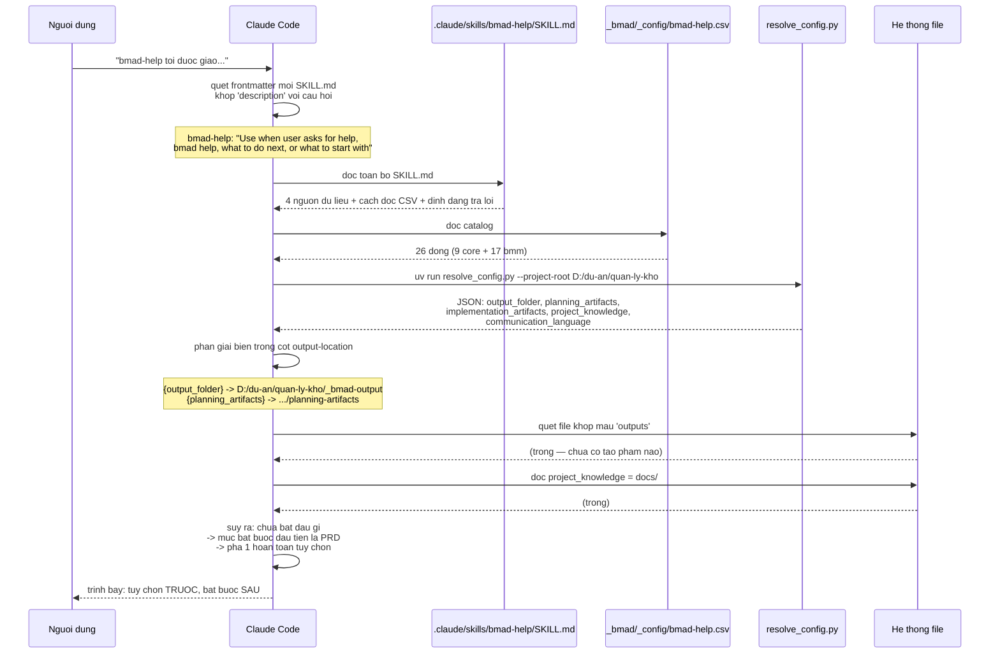

# 02 — Định hướng bằng `bmad-help`

> [← Mục lục demo](./index.md) · Trước: [01 — Cài đặt](./01-cai-dat.md) · Tiếp: [03 — Pha 1](./03-pha1-phan-tich.md)

---

## Lệnh

Mở Claude Code trong thư mục dự án:

```bash
$ cd D:/du-an/quan-ly-kho
$ claude
```

Rồi gõ:

```
> bmad-help tôi được giao làm hệ thống quản lý kho, chưa có yêu cầu gì rõ, bắt đầu từ đâu?
```

---

## Điều gì xảy ra bên trong



---

## Lệnh thực tế mà skill chạy

```bash
uv run D:/du-an/quan-ly-kho/_bmad/scripts/resolve_config.py \
  --project-root D:/du-an/quan-ly-kho
```

**Đầu ra:**

```json
{
  "core": {
    "project_name": "quan-ly-kho",
    "document_output_language": "Vietnamese",
    "output_folder": "D:/du-an/quan-ly-kho/_bmad-output",
    "user_name": "Thảo",
    "communication_language": "Vietnamese"
  },
  "modules": {
    "bmm": {
      "planning_artifacts": "D:/du-an/quan-ly-kho/_bmad-output/planning-artifacts",
      "implementation_artifacts": "D:/du-an/quan-ly-kho/_bmad-output/implementation-artifacts",
      "project_knowledge": "D:/du-an/quan-ly-kho/docs",
      "user_skill_level": "intermediate"
    }
  },
  "agents": { "...": "..." }
}
```

Sau đó quét:

```bash
ls D:/du-an/quan-ly-kho/_bmad-output/planning-artifacts/       # (không tồn tại)
ls D:/du-an/quan-ly-kho/_bmad-output/implementation-artifacts/ # (không tồn tại)
ls D:/du-an/quan-ly-kho/_bmad-output/brainstorming/            # (không tồn tại)
ls D:/du-an/quan-ly-kho/docs/                                  # (rỗng)
```

> Nhớ: `module.yaml` chỉ tạo `{output_folder}` lúc cài. Ba thư mục con được tạo **lười** bởi skill nào ghi vào đó trước.

---

## Đầu ra

```
📋 Chào Thảo!

Bạn đang ở **điểm bắt đầu** — chưa có tạo phẩm nào trong _bmad-output/.
Với một yêu cầu mơ hồ như "làm sao biết còn bao nhiêu hàng", tôi khuyên
dành thời gian ở Pha 1 trước khi viết PRD.

───────────────────────────────────────────────────────────────
TÙY CHỌN — Pha 1: Phân tích (không bắt buộc, nhưng đáng làm)
───────────────────────────────────────────────────────────────

  [BSP] Brainstorming — `bmad-brainstorming`
        Phiên ý tưởng có điều phối. Dùng khi bạn muốn khám phá không
        gian vấn đề trước khi khóa lại phạm vi. Sinh ra brainstorm.html
        và brainstorm-intent.md — cái sau thả thẳng được vào brief.
        → _bmad-output/brainstorming/

  [FI]  Forge Idea — `bmad-forge-idea`
        Thử lửa một ý tưởng đến khi nó cứng, đúng, hoặc chết rẻ.
        Dùng khi bạn ĐÃ có một hướng và muốn nó bị chất vấn.
        → _bmad-output/forge/

  [RS]  Deep Recon — `bmad-deep-recon [type]`
        Nghiên cứu cấp quyết định. Ví dụ: `bmad-deep-recon competitive`
        để xem các phần mềm quản lý kho hiện có làm gì.
        → _bmad-output/planning-artifacts/research/

  [CB]  Create Brief — `bmad-product-brief`
        Chốt tầm nhìn sản phẩm. Tốt khi ý tưởng đã rõ.
        → _bmad-output/planning-artifacts/briefs/brief-quan-ly-kho-2026-08-11/brief.md

  [WB]  PRFAQ Challenge — `bmad-prfaq`
        Working Backwards — thử lửa concept từ góc khách hàng trước.
        Thay thế cho product brief, gắt hơn.
        → _bmad-output/planning-artifacts/

───────────────────────────────────────────────────────────────
BẮT BUỘC — bước kế tiếp thật sự
───────────────────────────────────────────────────────────────

  [PRD] Create Edit and Review PRD — `bmad-prd`
        Đây là cổng bắt buộc đầu tiên. Không có PRD thì
        bmad-architecture không có gì để dựa vào.
        Có 3 ý định trong một skill: Create / Update / Validate.
        → _bmad-output/planning-artifacts/prds/prd-quan-ly-kho-2026-08-11/prd.md

───────────────────────────────────────────────────────────────

💡 Chạy mỗi workflow trong một cửa sổ ngữ cảnh mới.

Với tình huống của bạn (yêu cầu mơ hồ, người dùng thật ngay bên cạnh),
tôi đề xuất đường này:

  bmad-brainstorming  →  bmad-product-brief  →  bmad-prd

Brainstorm để mở rộng không gian, brief để chốt tầm nhìn, PRD để
biến tầm nhìn thành yêu cầu kiểm chứng được.

Tôi chạy `bmad-brainstorming` luôn cho bạn nhé?
```

🛑 **HALT** — chờ bạn trả lời.

---

## Đọc hiểu đầu ra

### Vì sao mục tùy chọn hiện trước?

Trích `bmad-help/SKILL.md`:

> *Show **optional items first, then the next required item**. Make it clear which is which.*

Lý do: mục bắt buộc thì bạn chắc chắn sẽ thấy dù ở đâu; mục tùy chọn dễ bị bỏ qua nếu đặt sau.

### Vì sao chỉ có `[PRD]` là bắt buộc?

`bmad-help` đọc cột `required` trong catalog:

```bash
$ awk -F',' 'NR>1 && $11=="true" { printf "[%s] %s\n", $4, $2 }' _bmad/_config/bmad-help.csv
[PRD] bmad-prd
[CA] bmad-architecture
[CE] bmad-create-epics-and-stories
[SP] bmad-sprint-planning
[BD] bmad-build
```

Có 5 mục bắt buộc, nhưng chúng có `preceded-by`:

| Skill | `preceded-by` |
| --- | --- |
| `bmad-prd` | `bmad-product-brief` |
| `bmad-architecture` | *(không)* |
| `bmad-create-epics-and-stories` | `bmad-architecture` |
| `bmad-sprint-planning` | *(không)* |
| `bmad-build` | `bmad-sprint-planning` |

`bmad-help` chỉ hiện **mục bắt buộc kế tiếp**, không đổ cả 5 — đúng theo kết quả mong muốn số 5:

> *Feel oriented, not overwhelmed — surface only what's relevant to their current position; **don't dump the entire catalog**.*

### Vì sao đề nghị chạy luôn?

Kết quả mong muốn số 4:

> *Get offered a quick start — when a **single skill is the clear next step**, offer to run it for the user **right now** rather than just listing it.*

---

## Thử một câu hỏi khác

```
> bmad-help sự khác nhau giữa bmad-spec và bmad-prd là gì?
```

Câu này **không khớp trạng thái quy trình** — nó là câu hỏi kiến thức. Skill chuyển sang nguồn `_meta`:

```bash
# Tìm dòng _meta trong catalog
$ grep "_meta" _bmad/_config/bmad-help.csv
Core,_meta,,,,,,,,,false,https://docs.bmad-method.org/llms.txt,
BMad Method,_meta,,,,,,,,,false,https://docs.bmad-method.org/llms.txt,
```

Skill fetch `https://docs.bmad-method.org/llms.txt` và trả lời **có căn cứ**, không bịa.

Đầu ra:

```
📋 Hai skill này khác nhau ở "cái gì" chúng khóa lại:

**bmad-prd** — tài liệu yêu cầu sản phẩm
  • Facilitated discovery: nó phỏng vấn bạn để moi ra yêu cầu
  • Đầu ra: prd.md + addendum.md + .memlog.md
  • Ba ý định: Create (mới) / Update (điều chỉnh theo tín hiệu thay đổi) /
    Validate (soi theo checklist, xuất báo cáo HTML)
  • BẮT BUỘC trong luồng BMM
  • Dành cho: một sản phẩm hoặc một sáng kiến lớn

**bmad-spec** — hợp đồng máy đọc được
  • Chưng cất BẤT KỲ đầu vào mang ý định nào (brief, PRD, bản ghi họp,
    brain dump, thư mục thiết kế) thành SPEC.md súc tích
  • Kernel 5 trường: Why / Capabilities / Constraints / Non-goals / Success signal
  • Là NGƯỜI VIẾT DUY NHẤT của SPEC.md — skill khác gọi nó headless khi
    cần biểu đạt hoặc cập nhật ý định
  • KHÔNG bắt buộc
  • Dành cho: bất cứ thứ gì mang ý định — phần mềm, game design, nghiên
    cứu, biên tập, chính sách, kinh doanh
  • Có thể tách spec thành stories.yaml có thứ tự cho dispatch tự động

Quan hệ: PRD là tài liệu cho NGƯỜI đọc và tranh luận.
SPEC là hợp đồng cho MÁY tiêu thụ. Bạn có thể dùng cả hai
(PRD → spec) hoặc chỉ một.

Với dự án của bạn, PRD là đường đúng — bạn cần tranh luận yêu cầu
với sếp và nhân viên kho, không phải dispatch tự động.
```

---

## Tự làm việc của `bmad-help` bằng tay

Nếu muốn hiểu cơ chế, chạy tay:

```bash
$ R="$(pwd)"

# Bước 1: đọc catalog
$ column -s, -t < _bmad/_config/bmad-help.csv | less -S

# Bước 2: phân giải cấu hình
$ uv run _bmad/scripts/resolve_config.py -p "$R" -k core -k modules

# Bước 3: quét tạo phẩm
$ find _bmad-output -type f 2>/dev/null
(không có gì)

# Bước 4: mục bắt buộc nào chưa có tạo phẩm?
$ awk -F',' 'NR>1 && $11=="true" { printf "%-32s -> %s (%s)\n", $2, $12, $13 }' \
    _bmad/_config/bmad-help.csv
bmad-prd                         -> planning_artifacts (prd)
bmad-architecture                -> planning_artifacts (architecture)
bmad-create-epics-and-stories    -> planning_artifacts (epics and stories)
bmad-sprint-planning             -> implementation_artifacts (sprint status)
bmad-build                       -> implementation_artifacts (spec and project implementation)

# Bước 5: cái nào là ĐẦU TIÊN theo preceded-by?
$ awk -F',' 'NR>1 && $11=="true" { printf "%-32s preceded-by: %s\n", $2, ($9=="" ? "(không)" : $9) }' \
    _bmad/_config/bmad-help.csv
bmad-prd                         preceded-by: bmad-product-brief
bmad-architecture                preceded-by: (không)
bmad-create-epics-and-stories    preceded-by: bmad-architecture
bmad-sprint-planning             preceded-by: (không)
bmad-build                       preceded-by: bmad-sprint-planning
```

> `preceded-by` là **gợi ý mềm**, không phải cổng. `bmad-prd` gợi ý chạy sau `bmad-product-brief`, nhưng bạn được phép chạy PRD trực tiếp.

---

## Tóm tắt bước này

| Loại | Chi tiết |
| --- | --- |
| Lệnh gọi | `bmad-help <câu hỏi>` |
| Script chạy | `resolve_config.py` (1 lần) |
| 👁️ File đọc | `bmad-help.csv`, `config.toml`, `config.user.toml` |
| 📄 File ghi | **Không có** — skill này không sinh tạo phẩm |
| 🛑 Điểm dừng | 1 (chờ bạn chọn có chạy skill được đề xuất không) |
| Thời gian | ~20 giây |

---

**Tiếp:** [03 — Pha 1: Phân tích](./03-pha1-phan-tich.md) · [← Mục lục demo](./index.md)
