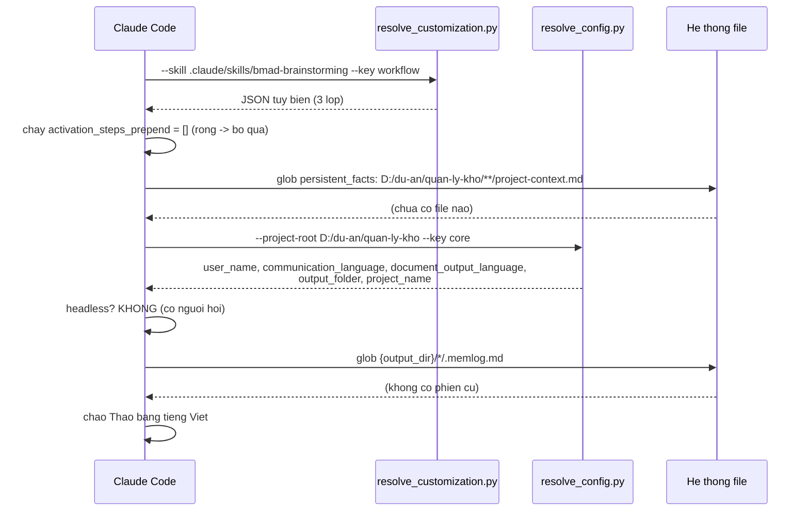
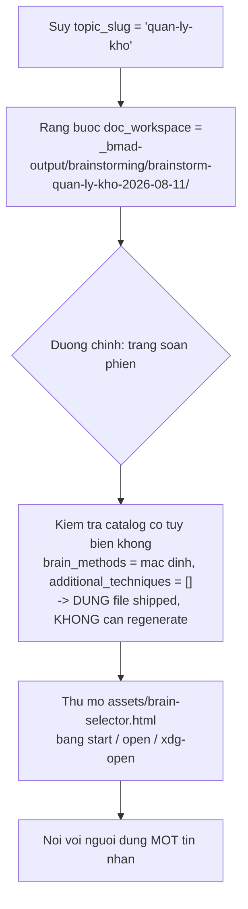

# 03 — Pha 1: Phân tích

> [← Mục lục demo](./index.md) · Trước: [02 — Định hướng](./02-dinh-huong.md) · Tiếp: [04 — Pha 2](./04-pha2-lap-ke-hoach.md)

**Pha này hoàn toàn tùy chọn** — không có mục nào `required = true`. Nhưng với yêu cầu mơ hồ như dự án demo, nó là nơi tiết kiệm nhiều nhất.

---

# Phần A — `bmad-brainstorming`

## A.1 Lệnh

**Cửa sổ ngữ cảnh mới:**

```
> bmad-brainstorming
```

## A.2 Kích hoạt (tự động)



**Lệnh thật:**

```bash
uv run D:/du-an/quan-ly-kho/_bmad/scripts/resolve_customization.py \
  --skill D:/du-an/quan-ly-kho/.claude/skills/bmad-brainstorming \
  --key workflow
```

```json
{
  "workflow": {
    "activation_steps_prepend": [],
    "activation_steps_append": [],
    "persistent_facts": ["file:{project-root}/**/project-context.md"],
    "brain_methods": "{skill-root}/assets/brain-methods.csv",
    "favorite_techniques": [],
    "additional_techniques": [],
    "output_dir": "{output_folder}/brainstorming",
    "output_folder_name": "brainstorm-{topic_slug}-{date}",
    "on_complete": "",
    "external_handoffs": []
  }
}
```

```bash
uv run D:/du-an/quan-ly-kho/_bmad/scripts/resolve_config.py \
  --project-root D:/du-an/quan-ly-kho --key core
```

```json
{
  "core": {
    "project_name": "quan-ly-kho",
    "document_output_language": "Vietnamese",
    "output_folder": "D:/du-an/quan-ly-kho/_bmad-output",
    "user_name": "Thảo",
    "communication_language": "Vietnamese"
  }
}
```

## A.3 Lời chào

```
Chào Thảo! 🧠

Mình là huấn luyện viên brainstorm. Nhắc bạn: `bmad-party-mode` và
`bmad-advanced-elicitation` luôn sẵn sàng bất cứ lúc nào trong phiên.

Không tìm thấy phiên brainstorm nào đang dở, nên ta bắt đầu mới nhé.

Ta brainstorm cái gì, và mục tiêu hoặc lý do đằng sau nó là gì?
(Nếu bạn có tài liệu, link, hay yêu cầu đặc biệt gì thì gửi luôn.)
```

🛑 **HALT** — một câu hỏi ghép duy nhất.

> Chú ý: skill hỏi **cả hai** trong một tin nhắn. Trích SKILL.md: *"Open with one compound question what are we brainstorming, and what's the goal or why behind it."*
>
> Cái **why** định hình việc chọn kỹ thuật và tổng hợp — *"kids' iPhone apps to build with your own kids"* và *"to win market share"* dẫn tới hai hướng khác nhau.

**Bạn trả lời:**

```
> Hệ thống quản lý kho cho công ty phân phối vật tư xây dựng.
> 3 nhân viên kho, ~2000 mã hàng. Hiện kiểm kê bằng giấy mỗi tháng,
> mất 2 ngày, số liệu lệch 5-15% so với kế toán.
>
> Mục tiêu: biết tồn kho thật ở mọi thời điểm, để không bao giờ
> hủy đơn vì báo còn hàng mà thực tế hết.
```

## A.4 Chọn lập trường và kỹ thuật



```
Bây giờ chọn cách chạy phiên. Mình có một trang soạn phiên — nó gộp
cả việc chọn lập trường lẫn chọn kỹ thuật vào một chỗ.

Trang sẽ mở trong trình duyệt — soạn phiên của bạn, bấm **Copy prompt**,
rồi dán kết quả về đây.

Nếu nó không mở, bạn tự mở file này:
D:/du-an/quan-ly-kho/.claude/skills/bmad-brainstorming/assets/brain-selector.html

Hoặc nói "làm trong chat" nếu bạn muốn chọn ngay tại đây.
```

🛑 **HALT**

> Skill **không được** nói "trang đã mở" — nó không thấy trình duyệt của bạn. Trích SKILL.md: *"You can't see their browser, so **never claim it opened**."*

**Bạn mở trang, chọn, và dán về:**

```
Facilitation mode: Creative Partner

Techniques:
1. [Structured] SCAMPER — Substitute, Combine, Adapt, Modify, Put to
   other uses, Eliminate, Reverse. Systematically transform an existing
   thing along seven axes.
2. [Perspective] Six Thinking Hats — Cycle through six deliberate modes
   of thinking: facts, feelings, caution, benefits, creativity, process.
3. [Provocation] Reverse Brainstorming — Ask how to CAUSE the problem,
   then invert each answer into a solution.
4. invent 1 new technique in the spirit of Constraints
```

## A.5 Tạo memlog

```bash
uv run D:/du-an/quan-ly-kho/_bmad/scripts/memlog.py init \
  --workspace "D:/du-an/quan-ly-kho/_bmad-output/brainstorming/brainstorm-quan-ly-kho-2026-08-11" \
  --field topic="Hệ thống quản lý kho vật tư xây dựng" \
  --field goal="Biết tồn kho thật mọi thời điểm, không hủy đơn vì sai số liệu" \
  --field mode="partner"
```

**Đầu ra:**

```json
{"ok": true, "memlog": "D:/du-an/quan-ly-kho/_bmad-output/brainstorming/brainstorm-quan-ly-kho-2026-08-11/.memlog.md", "entries": 0}
```

📄 **File tạo mới:**

```markdown
---
topic: Hệ thống quản lý kho vật tư xây dựng
goal: Biết tồn kho thật mọi thời điểm, không hủy đơn vì sai số liệu
mode: partner
updated: 2026-08-11T10:22
---


```

Rồi skill **nạp khung của lập trường**:

```
👁️ .claude/skills/bmad-brainstorming/references/mode-partner.md
```

```
Trạng thái phiên đã ở trên đĩa:
_bmad-output/brainstorming/brainstorm-quan-ly-kho-2026-08-11/.memlog.md
Nếu bị ngắt, ta resume được từ đó.

Chế độ **Creative Partner**: mình vừa điều phối vừa chơi cùng. Bạn giữ
quyền kiểm soát — bạn có thể từ chối bất kỳ ý tưởng nào mình đưa, bảo
mình giúp nhiều hơn hoặc ít hơn, và bảo mình cách brainstorm (kỹ thuật
nào, giọng nào, hướng nào).

Bắt đầu với **SCAMPER**. Trục đầu tiên: **Substitute** — thay thế.

Thay cái gì trong quy trình kiểm kê hiện tại? Bắt đầu từ thứ hiển nhiên
nhất: thay tờ giấy bằng cái gì?
```

## A.6 Vòng sinh ý tưởng

**Ví dụ vài lượt:**

```
> Thay giấy bằng điện thoại quét mã vạch
```

```bash
uv run .../memlog.py append \
  --workspace ".../brainstorm-quan-ly-kho-2026-08-11" \
  --type idea --by user \
  --text "thay giấy bằng điện thoại quét mã vạch"
```

```
🧠 Ghi rồi. Yes-and: nếu đã có điện thoại trong tay, thì thay luôn cả
**thời điểm** kiểm kê — thay vì một lần/tháng, thành **liên tục**: mỗi
lần nhập/xuất là một lần cập nhật.

Nhưng vậy thì "kiểm kê" biến thành cái gì? Bạn nghĩ nó còn cần thiết không?
```

```bash
uv run .../memlog.py append --workspace "..." \
  --type idea --by coach \
  --text "thay thời điểm kiểm kê: từ 1 lần/tháng thành cập nhật liên tục mỗi giao dịch"
```

```
> Vẫn cần, nhưng để đối soát thôi. Mà nếu quét liên tục thì mã vạch
> phải có sẵn trên hàng — vật tư xây dựng như xi măng, sắt thì không có
```

```bash
uv run .../memlog.py append --workspace "..." \
  --type insight --by user \
  --text "vật tư rời (xi măng, sắt) không có mã vạch sẵn — cần cách định danh khác"
```

```
🧠 Đó là một nút thắt thật. Ghi lại rồi.

Đẩy tiếp SCAMPER trục **Adapt**: ngành nào khác đã giải bài toán
"đếm thứ không đếm được từng cái"? Xăng dầu, hóa chất, nông sản...
Họ làm sao?
```

*...phiên tiếp tục qua SCAMPER (7 trục), Six Thinking Hats (6 mũ), Reverse Brainstorming, và một kỹ thuật tự phát minh...*

## A.7 Memlog sau ~90 ý tưởng

📄 **`.memlog.md` (trích)**

```markdown
---
topic: Hệ thống quản lý kho vật tư xây dựng
goal: Biết tồn kho thật mọi thời điểm, không hủy đơn vì sai số liệu
mode: partner
updated: 2026-08-11T11:47
---

- (technique) started SCAMPER
- (idea by user) thay giấy bằng điện thoại quét mã vạch
- (idea by coach) thay thời điểm kiểm kê: từ 1 lần/tháng thành cập nhật liên tục mỗi giao dịch
- (insight by user) vật tư rời (xi măng, sắt) không có mã vạch sẵn — cần cách định danh khác
- (idea by user) in tem mã vạch tại kho khi nhập hàng, dán lên pallet chứ không lên từng bao
- (idea by coach) đơn vị tồn kho là PALLET/LÔ chứ không phải từng cái — giảm 90% số lần quét
- (idea by user) sắt thép tính theo cây, xi măng theo bao, cát theo m3 — mỗi loại một đơn vị
- (question by user) làm sao xử lý hàng bị hụt do rơi vãi, ẩm mốc?
- (idea by coach) trường "hao hụt cho phép" theo % mỗi loại hàng
- (technique) started Six Thinking Hats
- (idea by user) [mũ trắng] số liệu cần: mã hàng, số lượng, vị trí, ngày nhập, lô
- (insight by user) [mũ đỏ] nhân viên kho SỢ bị đổ lỗi khi số liệu lệch — nếu hệ thống chỉ để bắt lỗi họ, họ sẽ không dùng
- (decision by user) hệ thống phải làm việc của họ NHẸ ĐI, không phải giám sát họ
- (idea by coach) [mũ vàng] nếu quét lúc nhập/xuất thì cuối tháng KHÔNG cần kiểm kê 2 ngày nữa
- (idea by user) [mũ đen] mất mạng thì sao? kho ở khu công nghiệp, 4G chập chờn
- (decision by user) BẮT BUỘC offline-first, đồng bộ khi có mạng
- (technique) started Reverse Brainstorming
- (idea by user) [đảo] làm sao để số liệu SAI nhiều nhất? → cho phép sửa số lượng tự do không log
- (idea by user) [đảo→giải] mọi thay đổi tồn kho phải là một GIAO DỊCH có log, không sửa trực tiếp
- (decision by user) sổ cái append-only cho tồn kho, không UPDATE trực tiếp số lượng
- (technique) started Ràng buộc Ngân sách Thời gian (kỹ thuật tự phát minh)
- (idea by user) nếu chỉ có 2 tuần thì làm gì? → chỉ nhập/xuất + xem tồn, bỏ báo cáo
- (direction by user) MVP = nhập kho, xuất kho, xem tồn hiện tại. Báo cáo để sau
```

## A.8 Hội tụ

```
> ok mình nghĩ đủ rồi, giờ chọn cái nào làm trước
```

```
👁️ .claude/skills/bmad-brainstorming/references/converge.md
```

```
🧠 Được. Chuyển sang giai đoạn **hội tụ** — đây là pha ngược lại với
sinh ý tưởng, và ta giữ hai cái tách bạch.

Trước hết, phản chiếu lại sân chơi. Từ memlog, đây là các ứng viên
còn sống (mình cố ý lấy cả cái lạ và cái bị chôn vùi từ sớm):

  1. Quét mã vạch tại điểm nhập/xuất
  2. Đơn vị tồn kho = pallet/lô, không phải từng cái
  3. In tem tại kho khi nhập hàng
  4. Offline-first + đồng bộ khi có mạng
  5. Sổ cái append-only cho tồn kho
  6. Trường hao hụt cho phép theo % mỗi loại
  7. Đơn vị tính riêng theo loại hàng (cây/bao/m3)
  8. Kiểm kê chuyển vai thành ĐỐI SOÁT, không phải đếm lại
  9. Cảnh báo khi tồn thấp hơn ngưỡng
  10. Ảnh chụp lô hàng khi nhập
  ... (thêm 14 ứng viên nữa)

Mình chọn **MoSCoW** cho lần này — vì mục tiêu của bạn là định phạm vi
một bản build, không phải xếp hạng ý tưởng trừu tượng.

Bắt đầu: cái nào là **Must** cho phiên bản đầu?
```

🛑 **HALT**

*...vài lượt hội tụ...*

```bash
uv run .../memlog.py append --workspace "..." --type decision --by user \
  --text "MoSCoW — Must: sổ cái append-only, nhập/xuất có log, xem tồn hiện tại, offline-first"

uv run .../memlog.py append --workspace "..." --type decision --by user \
  --text "MoSCoW — Should: quét mã vạch, đơn vị pallet/lô, đơn vị tính theo loại hàng"

uv run .../memlog.py append --workspace "..." --type decision --by user \
  --text "MoSCoW — Could: in tem tại kho, cảnh báo tồn thấp, ảnh chụp lô"

uv run .../memlog.py append --workspace "..." --type decision --by user \
  --text "MoSCoW — Won't this time: báo cáo phân tích, dự báo nhu cầu, tích hợp kế toán"
```

## A.9 Wrap-up

```
👁️ .claude/skills/bmad-brainstorming/references/finalize.md
```

**Nước 1 — đưa bạn tấm gương:**

```
🧠 Trước khi tổng hợp, mình đưa bạn tấm gương.

Đây là một mẫu sống động những ý tưởng CỦA BẠN — mình cố ý lấy cả cái
lạ và cái bị chôn vùi từ sớm:

  • "vật tư rời không có mã vạch sẵn" (lượt 4)
  • "nhân viên kho SỢ bị đổ lỗi khi số liệu lệch" (mũ đỏ)
  • "mất mạng thì sao? kho ở khu công nghiệp, 4G chập chờn"
  • "làm sao để số liệu SAI nhiều nhất? → cho phép sửa tự do không log"
  • "nếu chỉ có 2 tuần thì làm gì?"

Bạn thấy gì bây giờ? Có kết luận nào, cộng hưởng nào, chủ đề nào nổi lên
mà lúc đang sinh ý tưởng bạn chưa thấy?
```

🛑 **HALT**

**Nước 2 — thêm liên kết bạn sẽ bỏ lỡ:**

```
🧠 Mình thêm vài liên kết không hiển nhiên:

1. **"Sợ bị đổ lỗi" và "sổ cái append-only" là MỘT đòn bẩy, không phải hai.**
   Bạn đến với append-only từ góc chống-sai-số. Nhưng nó cũng giải bài
   toán tâm lý: nếu mọi thay đổi là một giao dịch có tên người và thời
   gian, thì lệch số không còn là "ai đó gian" mà là "giao dịch nào sai".
   Nhân viên kho được BẢO VỆ bởi log, không bị nó bắt.

2. **"Đơn vị = pallet/lô" và "hao hụt cho phép" cùng chống lại một thứ:
   ảo tưởng chính xác tuyệt đối.**
   Xi măng sẽ hụt. Cát sẽ bay. Hệ thống nào giả vờ đếm chính xác từng
   kilogram sẽ bị nhân viên bỏ qua. Hệ thống nào thừa nhận sai số và
   quản lý nó thì được dùng.

3. **Wildcard thật sự là "kiểm kê chuyển vai thành ĐỐI SOÁT".**
   Nó nghe như một chi tiết nhỏ, nhưng nó là thứ biện minh cho toàn bộ
   dự án với sếp: không phải "phần mềm quản lý kho" mà là "bỏ được
   2 ngày kiểm kê mỗi tháng".
```

```bash
uv run .../memlog.py append --workspace "..." --type insight \
  --text "3 liên kết: append-only bảo vệ nhân viên chứ không bắt lỗi; đơn vị lô + hao hụt cùng chống ảo tưởng chính xác; đối soát thay kiểm kê là lý lẽ bán cho sếp"

uv run .../memlog.py set --workspace "..." --key status --value complete
```

## A.10 Tạo phẩm

```
🧠 Phiên đã đóng. Giờ đến tạo phẩm — mỗi cái là một lần sinh tốn token
mới, nên bạn chọn cái nào cần:

  1. **brainstorm.html** (khuyến nghị) — vật kỷ niệm tự chứa của phiên,
     mỗi kỹ thuật một cách thể hiện riêng, phần tổng hợp là cao trào
  2. **brainstorm-intent.md** — bản chưng cất cực gọn, thả thẳng được
     vào bmad-product-brief hoặc bmad-prd làm input sạch
  3. Thứ khác — pitch deck, one-pager, danh sách việc... bạn muốn gì?
```

🛑 **HALT**

```
> cả 1 và 2
```

🤖 **Skill spawn hai subagent song song:**

```
🤖 Subagent 1: sinh brainstorm.html
   Đầu vào duy nhất: .../brainstorm-quan-ly-kho-2026-08-11/.memlog.md
   Đầu ra: .../brainstorm.html
   Ràng buộc: "return ONLY the written file path"

🤖 Subagent 2: sinh brainstorm-intent.md
   Đầu vào duy nhất: .../brainstorm-quan-ly-kho-2026-08-11/.memlog.md
   Đầu ra: .../brainstorm-intent.md
   Ngôn ngữ: Vietnamese
   Ràng buộc: "return ONLY the written file path"
```

> **Vì sao subagent?** Trích `finalize.md`: *"By now the main context is full of the whole session — but **the memlog holds everything**, so the subagent doesn't need that context... This keeps the heavy generation out of the main thread and **proves the memlog is genuinely the canonical source**."*

📄 **`brainstorm-intent.md`**

```markdown
# Ý định: Hệ thống quản lý kho vật tư xây dựng

## Vấn đề
Kiểm kê giấy 1 lần/tháng, mất 2 ngày, lệch 5–15% so với kế toán.
Đơn hàng bị hủy vì báo còn hàng nhưng thực tế hết.

## Insight quyết định hướng đi
- Nhân viên kho sợ bị đổ lỗi khi số liệu lệch. Hệ thống phải làm việc
  của họ NHẸ ĐI, không phải giám sát họ.
- Vật tư rời không đếm chính xác được. Hệ thống nào giả vờ chính xác
  tuyệt đối sẽ bị bỏ qua.
- Kho ở khu công nghiệp, 4G chập chờn. Offline-first là ràng buộc cứng.
- Giá trị bán được cho sếp: bỏ 2 ngày kiểm kê mỗi tháng, không phải
  "có phần mềm quản lý kho".

## Phạm vi (MoSCoW)

**Must**
- Sổ cái append-only: mọi thay đổi tồn kho là một giao dịch có log,
  không UPDATE trực tiếp số lượng
- Nhập kho / xuất kho có ghi log (người, thời gian, lý do)
- Xem tồn hiện tại
- Offline-first, đồng bộ khi có mạng

**Should**
- Quét mã vạch tại điểm nhập/xuất
- Đơn vị tồn kho = pallet/lô, không phải từng cái
- Đơn vị tính riêng theo loại hàng (cây / bao / m³)

**Could**
- In tem mã vạch tại kho khi nhập
- Cảnh báo khi tồn thấp hơn ngưỡng
- Ảnh chụp lô hàng khi nhập

**Won't (lần này)**
- Báo cáo phân tích
- Dự báo nhu cầu
- Tích hợp phần mềm kế toán

## Ràng buộc đã chốt
- Hao hụt cho phép theo % mỗi loại hàng — hệ thống thừa nhận sai số
  thay vì giả vờ chính xác
- Kiểm kê chuyển vai từ "đếm lại toàn bộ" thành "đối soát"

## Đã loại bỏ và vì sao
- Đếm từng đơn vị nhỏ nhất: không khả thi với vật tư rời, và làm nhân
  viên bỏ dùng hệ thống
- Cho phép sửa số lượng trực tiếp: đó chính là nguồn gốc sai số hiện tại
```

📄 **`brainstorm.html`** — trang tự chứa, CSS inline, mỗi kỹ thuật một cách thể hiện, phần tổng hợp là cao trào.

## A.11 Kết thúc

```
🧠 Xong. Đường dẫn:

  _bmad-output/brainstorming/brainstorm-quan-ly-kho-2026-08-11/
  ├── .memlog.md              (bản ghi phiên — nguồn của mọi thứ trên)
  ├── brainstorm.html         (mở nó lên xem)
  └── brainstorm-intent.md    (thả vào bước sau)

Bạn có muốn mình lưu kỹ thuật tự phát minh "Ràng buộc Ngân sách Thời
gian" vào thư viện cá nhân không? Nó dùng lại được cho phiên sau.

Về bước tiếp theo — để mình gọi `bmad-help`...

📋 Bạn giờ đã có brainstorm-intent.md. Hai đường:

  [CB] `bmad-product-brief` — chốt tầm nhìn sản phẩm. Nó source-extract
       được từ brainstorm-intent.md, nên bạn không phải kể lại.

  [PRD] `bmad-prd` — đi thẳng vào PRD. Được, nhưng brief giúp bạn tách
       "tại sao" khỏi "cái gì" trước.

Với dự án của bạn — cần thuyết phục sếp trước khi viết yêu cầu chi tiết —
mình khuyên đi qua brief.
```

---

# Phần B — `bmad-product-brief`

## B.1 Lệnh

**Cửa sổ ngữ cảnh mới:**

```
> bmad-product-brief
```

## B.2 Nạp ngữ cảnh tự động

Skill quét `{planning_artifacts}` và `{output_folder}`, tìm thấy `brainstorm-intent.md`:

```
👁️ _bmad-output/brainstorming/brainstorm-quan-ly-kho-2026-08-11/brainstorm-intent.md
```

```
📊 Chào Thảo!

Mình thấy `brainstorm-intent.md` từ phiên brainstorm hôm nay. Mình đã
đọc nó — nên ta không phải bắt đầu từ số 0.

Từ đó mình rút ra:
  • Vấn đề: kiểm kê giấy, lệch 5-15%, hủy đơn vì sai số liệu
  • Người dùng: 3 nhân viên kho + bạn (dev) + sếp (người duyệt)
  • Ràng buộc cứng: offline-first, thừa nhận hao hụt, không giám sát nhân viên
  • Giá trị bán được: bỏ 2 ngày kiểm kê/tháng

Đúng chưa? Có gì cần sửa trước khi mình đào sâu không?
```

🛑 **HALT**

*...phiên tiếp tục qua các mục của brief template...*

## B.3 Tạo phẩm

📄 **`_bmad-output/planning-artifacts/brief.md`**

```markdown
---
title: Hệ thống Quản lý Kho — Product Brief
created: 2026-08-11
status: draft
sources:
  - _bmad-output/brainstorming/brainstorm-quan-ly-kho-2026-08-11/brainstorm-intent.md
---

# Product Brief — Hệ thống Quản lý Kho

## 1. Vấn đề

Công ty phân phối vật tư xây dựng, 3 nhân viên kho, ~2.000 mã hàng.

Kiểm kê thủ công bằng giấy, 1 lần/tháng, mất 2 người-ngày. Số liệu
trên giấy lệch 5–15% so với sổ kế toán. Hệ quả trực tiếp: đơn hàng bị
hủy vì hệ thống báo còn hàng nhưng kho thực tế đã hết.

**Chi phí hiện tại:**
- 6 người-ngày/tháng cho kiểm kê (3 người × 2 ngày)
- Ước tính 4–6 đơn hủy/tháng vì sai số liệu
- Không có cách biết tồn kho giữa hai kỳ kiểm kê

## 2. Người dùng và điều họ cần

| Vai | Nhu cầu chính | Điều họ SỢ |
| --- | --- | --- |
| Nhân viên kho | Ghi nhận nhập/xuất nhanh, không phải quay lại bàn | Bị đổ lỗi khi số liệu lệch |
| Nhân viên bán hàng | Biết còn hàng thật trước khi nhận đơn | Hứa với khách rồi phải xin lỗi |
| Kế toán | Số liệu khớp giữa kho và sổ sách | Phải đối chiếu tay mỗi tháng |
| Chủ doanh nghiệp | Bỏ được 2 ngày kiểm kê/tháng | Đầu tư phần mềm rồi không ai dùng |

**Insight then chốt từ brainstorm:** nhân viên kho sợ hệ thống trở thành
công cụ giám sát. Nếu nó làm việc của họ nặng thêm, họ sẽ không dùng, và
dự án chết. Hệ thống phải **giảm việc** của họ ngay từ tuần đầu.

## 3. Đề xuất giải pháp

Một sổ cái tồn kho **append-only**: mọi thay đổi số lượng là một **giao
dịch** có ghi nhận người thực hiện, thời gian, và lý do. Tồn kho hiện tại
là **kết quả tính từ sổ cái**, không phải một con số được sửa trực tiếp.

Nhân viên kho ghi nhận nhập/xuất tại chỗ trên điện thoại. Ứng dụng chạy
**offline-first** — kho ở khu công nghiệp, 4G chập chờn — và đồng bộ khi
có mạng.

Kiểm kê hằng tháng chuyển vai từ "đếm lại toàn bộ" thành "**đối soát**":
so tồn tính được với tồn đếm được, và ghi nhận chênh lệch như một giao
dịch điều chỉnh có lý do.

## 4. Nguyên tắc thiết kế

| # | Nguyên tắc | Vì sao |
| --- | --- | --- |
| 1 | **Không UPDATE trực tiếp số lượng** | Sửa tự do là nguồn gốc sai số hiện tại |
| 2 | **Log bảo vệ nhân viên, không bắt lỗi họ** | Lệch số thành "giao dịch nào sai", không phải "ai gian" |
| 3 | **Thừa nhận hao hụt** | Vật tư rời sẽ hụt; giả vờ chính xác tuyệt đối làm hệ thống bị bỏ |
| 4 | **Offline-first là ràng buộc cứng** | Không có mạng ổn định tại kho |
| 5 | **Đơn vị tồn kho là lô/pallet** | Giảm 90% số lần quét so với từng cái |

## 5. Phạm vi phiên bản đầu

**Có:**
- Sổ cái giao dịch append-only
- Nhập kho, xuất kho (có người, thời gian, lý do)
- Xem tồn hiện tại theo mã hàng
- Hoạt động offline, đồng bộ khi có mạng

**Không (lần này):**
- Báo cáo phân tích, dự báo nhu cầu
- Tích hợp phần mềm kế toán
- Quét mã vạch (đợi phiên bản 2 — cần thiết bị)

## 6. Thước đo thành công

| Chỉ số | Hiện tại | Mục tiêu sau 3 tháng |
| --- | --- | --- |
| Thời gian kiểm kê/tháng | 6 người-ngày | ≤ 1 người-ngày |
| Lệch tồn kho vs kế toán | 5–15% | ≤ 2% |
| Đơn hủy do sai số liệu | 4–6/tháng | 0–1/tháng |
| Tỷ lệ giao dịch ghi trong ngày | 0% | ≥ 95% |

**Chỉ số dẫn đường quan trọng nhất:** tỷ lệ giao dịch được ghi trong
ngày. Nếu nhân viên kho không dùng, mọi chỉ số khác vô nghĩa.

## 7. Rủi ro

| Rủi ro | Mức | Giảm thiểu |
| --- | --- | --- |
| Nhân viên kho không dùng | **Cao** | Thử nghiệm với 1 người trong 2 tuần trước khi mở rộng; đo thời gian thao tác |
| Đồng bộ offline gây xung đột dữ liệu | Trung bình | Sổ cái append-only làm xung đột thành hợp nhất, không phải ghi đè |
| Phạm vi phình | Trung bình | MoSCoW đã chốt; mọi đề nghị thêm vào "Could" hoặc "Won't" |
```

📄 **`_bmad-output/planning-artifacts/addendum.md`** — chi tiết bổ trợ (khảo sát thời gian thao tác hiện tại, danh sách 2.000 mã hàng theo nhóm, ghi chú phỏng vấn nhân viên kho).

---

## Tóm tắt Pha 1

| | `bmad-brainstorming` | `bmad-product-brief` |
| --- | --- | --- |
| Script chạy | `resolve_customization.py`, `resolve_config.py`, `brain.py`, `memlog.py` ×~30 | `resolve_customization.py`, `resolve_config.py` |
| 👁️ Đọc | `brain-methods.csv`, `references/mode-partner.md`, `converge.md`, `finalize.md` | `brainstorm-intent.md` |
| 📄 Ghi | `.memlog.md`, `brainstorm.html`, `brainstorm-intent.md` | `brief.md`, `addendum.md` |
| 🤖 Subagent | 2 (sinh tạo phẩm) | 0–1 |
| 🛑 Điểm dừng | ~8 | ~10 |
| Thời gian | ~85 phút | ~35 phút |

**Trạng thái sau Pha 1:**

```
_bmad-output/
├── brainstorming/
│   └── brainstorm-quan-ly-kho-2026-08-11/
│       ├── .memlog.md
│       ├── brainstorm.html
│       └── brainstorm-intent.md
└── planning-artifacts/
    ├── brief.md
    └── addendum.md
```

---

**Tiếp:** [04 — Pha 2: Lập kế hoạch](./04-pha2-lap-ke-hoach.md) · [← Mục lục demo](./index.md)
