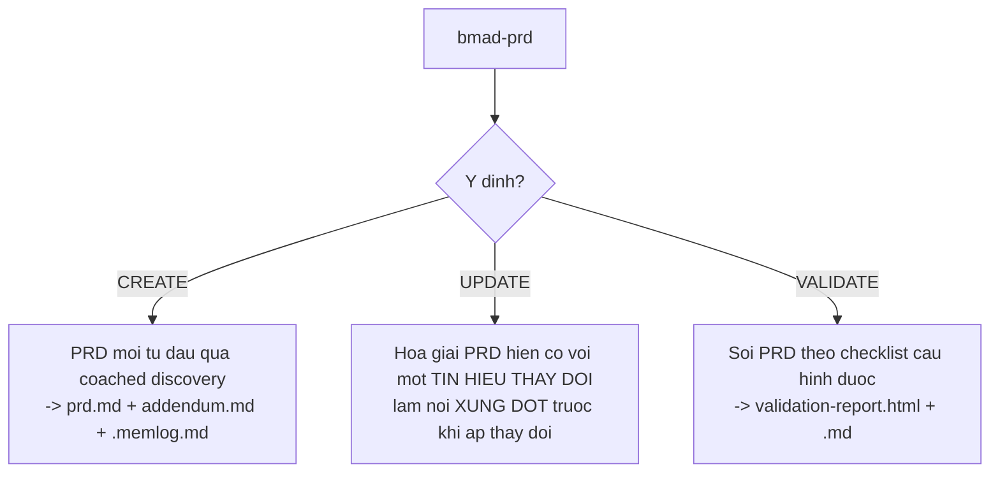
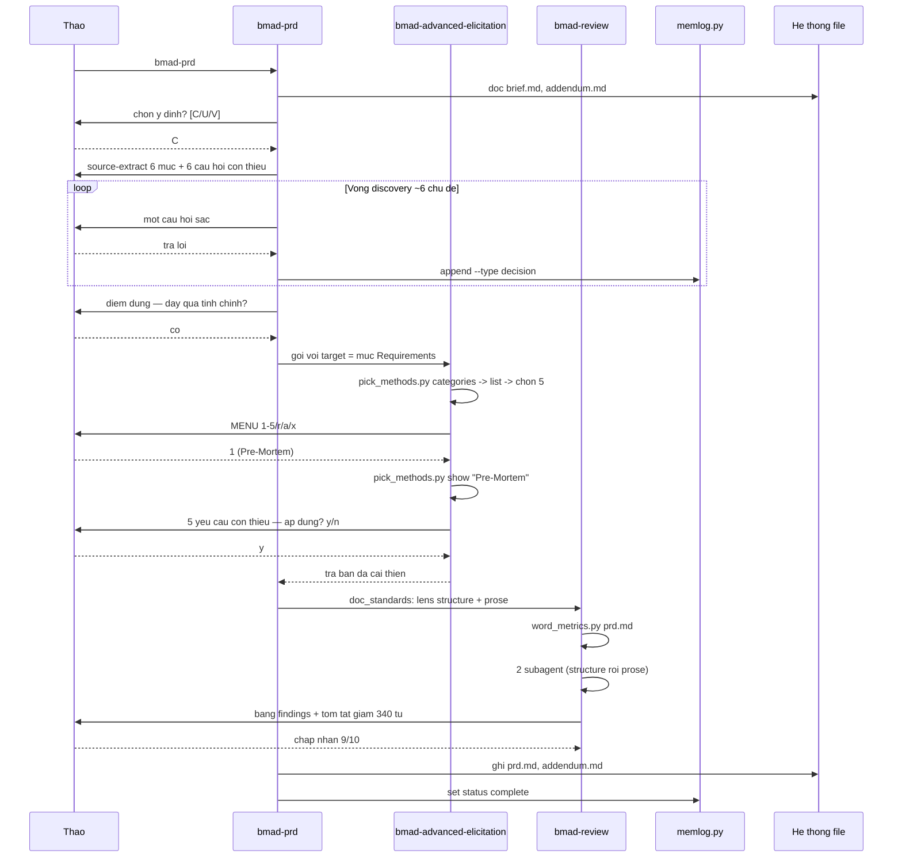

# 04 — Pha 2: Lập kế hoạch (`bmad-prd`)

> [← Mục lục demo](./index.md) · Trước: [03 — Pha 1](./03-pha1-phan-tich.md) · Tiếp: [05 — Pha 3](./05-pha3-giai-phap.md)

**Đây là cổng bắt buộc đầu tiên** (`required = true`).

---

## 1. Lệnh

**Cửa sổ ngữ cảnh mới:**

```
> bmad-prd
```

---

## 2. Ba ý định trong một skill



Skill hỏi nếu bạn không nêu rõ. Ở đây ta chọn **Create**.

---

## 3. Kích hoạt

```bash
uv run D:/du-an/quan-ly-kho/_bmad/scripts/resolve_customization.py \
  --skill D:/du-an/quan-ly-kho/.claude/skills/bmad-prd --key workflow

uv run D:/du-an/quan-ly-kho/_bmad/scripts/resolve_config.py \
  --project-root D:/du-an/quan-ly-kho
```

Rồi skill quét `{planning_artifacts}`:

```
👁️ _bmad-output/planning-artifacts/briefs/brief-quan-ly-kho-2026-08-11/brief.md          (tìm thấy)
👁️ _bmad-output/planning-artifacts/addendum.md       (tìm thấy)
```

```
📋 Chào Thảo!

Mình là John, Product Manager. Mình thấy `brief.md` — nên phần lớn
"tại sao" đã có. Việc của ta bây giờ là biến nó thành yêu cầu **kiểm
chứng được**.

Bạn muốn:
  [C] **Create** — PRD mới, mình source-extract từ brief rồi đào sâu
  [U] **Update** — bạn đã có PRD và muốn hoà giải nó với thay đổi nào đó
  [V] **Validate** — soi PRD hiện có theo checklist, xuất báo cáo HTML
```

🛑 **HALT**

```
> C
```

---

## 4. Source extraction từ brief

```
📋 Mình rút từ `brief.md` những thứ dùng lại được:

  ✓ Vấn đề và chi phí hiện tại       → §Background
  ✓ 4 vai người dùng                 → §Users
  ✓ 5 nguyên tắc thiết kế            → §Constraints
  ✓ Phạm vi MoSCoW                   → §Scope
  ✓ 4 thước đo thành công            → §Success Metrics
  ✓ 3 rủi ro                         → §Risks

Những thứ brief **chưa** trả lời, và PRD cần:

  ? Một "giao dịch" chính xác là gì? Có mấy loại?
  ? Tồn kho được tính thế nào từ sổ cái?
  ? "Offline-first" nghĩa là gì cụ thể — offline bao lâu? xung đột xử lý sao?
  ? Ai được phép làm gì? Có phân quyền không?
  ? Một mã hàng có những thuộc tính gì?
  ? Điều gì xảy ra khi đối soát phát hiện lệch?

Ta đi từng cái. Bắt đầu: **một "giao dịch" là gì trong hệ thống này?**
Kể mình nghe một lần nhập hàng thật diễn ra thế nào, từ lúc xe tới cổng.
```

🛑 **HALT**

> Chú ý phong cách của John: *"Speaks like a detective interrogating a cold case: short questions, sharper follow-ups, every 'why?' tightening the net."*

---

## 5. Vòng discovery

```
> Xe tới, nhân viên xuống đếm, đối chiếu với phiếu giao hàng của nhà
> cung cấp, ký nhận, rồi ghi vào sổ giấy. Xong mang phiếu về cho kế toán.
```

```
📋 Ba việc riêng biệt đang bị gộp thành một:

  1. **Đếm và đối chiếu** với phiếu NCC — có thể lệch
  2. **Ký nhận** — cam kết pháp lý với NCC
  3. **Ghi vào sổ** — cập nhật tồn kho

Câu hỏi: nếu đếm được 98 bao nhưng phiếu ghi 100, hiện tại nhân viên ghi
số nào vào sổ?
```

🛑 **HALT**

```
> Ghi 100 theo phiếu, rồi báo miệng cho kế toán là thiếu 2
```

```
📋 Đó là một trong những nguồn lệch 5-15%.

Vậy hệ thống cần **hai** con số riêng, không phải một:
  • Số lượng **theo chứng từ** (phiếu NCC)
  • Số lượng **thực nhận** (đếm được)

Và chênh lệch là một sự kiện có tên, không phải một tin nhắn miệng.

Đồng ý không? Nếu đồng ý, mình ghi đây là ràng buộc FR-01.
```

🛑 **HALT**

```bash
uv run .../memlog.py append --workspace ".../planning-artifacts" \
  --type decision \
  --text "giao dịch nhập tách 2 số: theo chứng từ và thực nhận; chênh lệch là sự kiện có tên"
```

*...vòng discovery tiếp tục qua ~6 chủ đề còn lại...*

---

## 6. Điểm dừng gọi `bmad-advanced-elicitation`

Sau khi soạn xong mục §Requirements, skill dừng:

```
📋 Mục Requirements đã có bản nháp đầu. Trước khi đi tiếp, bạn có muốn
đẩy nó qua một vòng tinh chỉnh không?

`bmad-advanced-elicitation` sẽ đưa menu phương pháp — pre-mortem, red
team, first principles... — và áp lên chính mục vừa viết.
```

🛑 **HALT**

```
> có
```

**Skill gọi `bmad-advanced-elicitation` với target là mục Requirements:**

```bash
uv run .../resolve_customization.py \
  --skill .../bmad-advanced-elicitation --key workflow

uv run .../bmad-advanced-elicitation/scripts/pick_methods.py \
  --file .../bmad-advanced-elicitation/assets/methods.csv categories
```

**Đầu ra:**

```
analytical      (12)
collaboration   (8)
creative        (11)
domain-specific (6)
risk            (9)
structural      (7)
```

Skill chọn 2 nhóm phù hợp (`risk` — vì đây là yêu cầu sắp được xây; `analytical` — vì cần kiểm tra tính đầy đủ):

```bash
uv run .../pick_methods.py --file .../methods.csv list --category risk --category analytical
```

Rồi tự chọn 5 phương pháp tấn công từ các góc khác nhau:

```
**Advanced Elicitation Options**
Choose a number (1-5), [r] to Reshuffle, [a] List All, or [x] to Proceed:

1. Pre-Mortem — Giả định dự án đã thất bại 6 tháng sau; lần ngược nguyên nhân
2. Red Team — Tấn công yêu cầu như một đối thủ muốn nó hỏng
3. First Principles — Bóc mọi giả định xuống nguyên lý cơ bản rồi dựng lại
4. Stakeholder Round Table — Mỗi bên liên quan phản ứng với yêu cầu
5. Constraint Removal — Bỏ một ràng buộc và xem yêu cầu nào sụp đổ
r. Reshuffle the list with 5 new options
a. List all methods with descriptions
x. Proceed / No Further Actions
```

🛑 **HALT**

```
> 1
```

```bash
uv run .../pick_methods.py --file .../methods.csv show "Pre-Mortem"
```

```
🔍 **Pre-Mortem** trên mục Requirements

Giả định: 6 tháng sau, hệ thống đã triển khai và **thất bại**. Nhân viên
kho quay lại dùng giấy. Đây là những gì đã xảy ra:

1. **Yêu cầu offline-first quá mơ hồ.** "Đồng bộ khi có mạng" không nói
   rõ điều gì xảy ra khi hai người cùng sửa một lô hàng khi offline. Khi
   xung đột xảy ra lần đầu, không ai biết cái nào đúng, và niềm tin sụp.

2. **Không có yêu cầu nào về TỐC ĐỘ THAO TÁC.** PRD nói "ghi nhận nhập
   xuất" nhưng không nói phải mất bao lâu. Thực tế mất 90 giây/lô, gấp
   3 lần ghi giấy. Nhân viên bỏ.

3. **"Lý do" của giao dịch là trường tự do.** Sau 3 tháng có 400 giá trị
   khác nhau, không thống kê được gì, và không ai buồn điền đúng.

4. **Không có yêu cầu về việc SỬA SAI.** Nhân viên gõ nhầm 1000 thay vì
   100. Sổ cái append-only nên không sửa được. Không có yêu cầu nào nói
   phải làm gì.

5. **Không ai định nghĩa "tồn kho hiện tại" khi có giao dịch chưa đồng bộ.**
   Điện thoại A hiện 50, server hiện 80. Nhân viên bán hàng tin cái nào?

Đề xuất bổ sung 5 yêu cầu:
  FR-12: Chính sách giải quyết xung đột khi đồng bộ
  NFR-03: Thao tác ghi nhận một lô ≤ 20 giây
  FR-13: Lý do giao dịch là danh sách chọn có sẵn + trường ghi chú tự do
  FR-14: Giao dịch điều chỉnh (correction) — không xóa, mà bù trừ
  FR-15: Định nghĩa "tồn kho khả dụng" phân biệt đã-đồng-bộ và chưa

Áp dụng không? (y/n/khác)
```

🛑 **HALT**

```
> y
```

*Sau đó menu hiện lại; bạn chọn `x` để tiếp tục.*

> Đây là ví dụ điển hình về giá trị của `bmad-advanced-elicitation`: 5 yêu cầu này **không xuất hiện** trong vòng discovery bình thường, vì chúng chỉ lộ ra khi bạn giả định thất bại.

---

## 7. Finalize — gọi `bmad-review`

Sau khi PRD hoàn chỉnh, `customize.toml` của `bmad-prd` có `doc_standards` gọi `bmad-review`:

```
📋 PRD đã đủ. Bước cuối: chạy lens biên tập lên nó.

Đang gọi `bmad-review` với lens structure và prose...
```

```bash
uv run .../resolve_customization.py --skill .../bmad-review --key workflow
uv run .../bmad-review/scripts/word_metrics.py _bmad-output/planning-artifacts/prds/prd-quan-ly-kho-2026-08-11/prd.md
```

**Đầu ra `word_metrics.py`:**

```json
{
  "total_words": 3184,
  "sections": [
    {"heading": "1. Background", "words": 412},
    {"heading": "2. Users and Jobs", "words": 386},
    {"heading": "3. Functional Requirements", "words": 1240},
    {"heading": "4. Non-Functional Requirements", "words": 428},
    {"heading": "5. Constraints", "words": 194},
    {"heading": "6. Scope", "words": 208},
    {"heading": "7. Success Metrics", "words": 172},
    {"heading": "8. Risks", "words": 144}
  ]
}
```

`bmad-review` chạy 2 lens (`structure` rồi `prose`):

```
📋 Kế hoạch review: nội dung là **docs**, chạy lens `structure` rồi
`prose` (prose chạy trên nền findings của structure).
```

🤖 **Subagent 1: lens structure**

Nạp `references/editorial-common.md` + `references/structure-models.md` + `references/lens-structure.md`.

Chọn model **Strategic/Context (Pyramid)** — vì PRD thuộc nhóm *"PRDs, research reports, proposals, decision records"*.

**Kết quả:**

```
Tài liệu này tồn tại để giúp **bạn (dev) và sếp** thống nhất về **cái gì
sẽ được xây và làm sao biết nó thành công**.

Model cấu trúc: **Strategic/Context (Pyramid)**

| Pass | Original Text | Revised Text | Changes |
|------|---------------|--------------|---------|
| structure | §1 Background — toàn mục (412 từ) | CONDENSE xuống ~150 từ | Pyramid yêu cầu kết luận/khuyến nghị mở đầu. Hiện tại 412 từ bối cảnh đứng trước khi người đọc biết đề xuất là gì (tiết kiệm ~260 từ) |
| structure | §7 Success Metrics (172 từ) | MOVE lên ngay sau tóm tắt mở đầu | Thước đo là thứ sếp cần thấy sớm nhất; hiện nó bị chôn ở mục 7 |
| structure | §5 Constraints (194 từ) | MERGE vào §3 Functional Requirements | 5 ràng buộc đều là điều kiện của yêu cầu chức năng; tách ra bắt người đọc nhảy qua lại |
| structure | §3 FR-04 và FR-09 | MERGE | Cả hai đều mô tả cùng một hành vi ghi log, viết hai lần với từ khác nhau (tiết kiệm ~80 từ) |
| structure | §2 Users and Jobs — bảng "Điều họ SỢ" | PRESERVE | Trông như trang trí nhưng nó chứa insight quyết định hướng thiết kế; cắt nó là mất lý do của FR-06 |
| structure | §8 Risks (144 từ) | QUESTION | Rủi ro không có chủ và không có ngày rà lại — nó là danh sách hay là cam kết? |
```

🤖 **Subagent 2: lens prose** *(nhận findings của structure)*

```
| Pass | Original Text | Revised Text | Changes |
|------|---------------|--------------|---------|
| prose | "Hệ thống sẽ cần phải đảm bảo rằng mọi giao dịch đều được ghi nhận lại" | "Hệ thống ghi nhận mọi giao dịch" | Bỏ rào đón ("sẽ cần phải", "đảm bảo rằng"); chủ động thay bị động |
| prose | "Việc này có thể sẽ gây ra một số vấn đề nhất định" | "Điều này gây ra hai vấn đề: <liệt kê>" | Mơ hồ ("có thể sẽ", "một số", "nhất định") — PRD phải nói rõ vấn đề gì |
| prose | §3, §4, §6: "tồn kho" / "hàng tồn" / "số lượng tồn" | Thống nhất "tồn kho" | Ba từ cho cùng một khái niệm trong một tài liệu |
| prose | "nó" ở §3 FR-07 dòng 2 | "sổ cái giao dịch" | Đại từ không rõ tiền ngữ — "nó" có thể là hệ thống, sổ cái, hoặc giao dịch |
```

```
📊 Tổng kết:
  • 10 khuyến nghị
  • Ước lượng giảm nếu chấp nhận hết: ~340 từ (10,7% của 3.184)
  • Đánh đổi: không có — mục PRESERVE đã bảo vệ phần chứa insight

Chấp nhận từng dòng hay tất cả?
```

🛑 **HALT**

---

## 8. Tạo phẩm

### 📄 `_bmad-output/planning-artifacts/prds/prd-quan-ly-kho-2026-08-11/prd.md`

```markdown
---
title: Hệ thống Quản lý Kho — PRD
created: 2026-08-11
status: approved
version: 1.0
sources:
  - _bmad-output/planning-artifacts/briefs/brief-quan-ly-kho-2026-08-11/brief.md
  - _bmad-output/brainstorming/brainstorm-quan-ly-kho-2026-08-11/brainstorm-intent.md
---

# PRD — Hệ thống Quản lý Kho

## Tóm tắt

Thay sổ kho giấy bằng một **sổ cái giao dịch append-only** chạy được
offline. Mọi thay đổi tồn kho là một giao dịch có người, thời gian, và
lý do; tồn kho hiện tại là kết quả tính từ sổ cái, không phải một con
số được sửa trực tiếp.

**Thành công nghĩa là:** sau 3 tháng, kiểm kê tốn ≤ 1 người-ngày (từ 6),
lệch tồn kho ≤ 2% (từ 5–15%), và ≥ 95% giao dịch được ghi trong ngày.

**Rủi ro lớn nhất:** nhân viên kho không dùng. Giảm thiểu bằng thử
nghiệm 1 người trong 2 tuần, đo thời gian thao tác thật, và NFR-03
(≤ 20 giây/lô) là điều kiện chấp nhận cứng.

## 1. Bối cảnh

Công ty phân phối vật tư xây dựng, 3 nhân viên kho, ~2.000 mã hàng.
Kiểm kê giấy 1 lần/tháng tốn 6 người-ngày, số liệu lệch 5–15% so với
kế toán, dẫn tới 4–6 đơn hủy/tháng.

Nguồn lệch chính đã xác định trong discovery: nhân viên ghi **số theo
chứng từ** thay vì **số thực nhận**, và báo chênh lệch bằng miệng.

## 2. Người dùng

| Vai | Việc cần làm | Điều họ sợ |
| --- | --- | --- |
| Nhân viên kho | Ghi nhập/xuất tại chỗ, không quay lại bàn | Bị đổ lỗi khi số liệu lệch |
| Nhân viên bán hàng | Biết tồn thật trước khi nhận đơn | Hứa với khách rồi phải xin lỗi |
| Kế toán | Số khớp giữa kho và sổ | Đối chiếu tay mỗi tháng |
| Chủ doanh nghiệp | Bỏ 2 ngày kiểm kê/tháng | Mua phần mềm rồi không ai dùng |

> **Bảng "điều họ sợ" là load-bearing.** FR-06 (correction transaction)
> và nguyên tắc "log bảo vệ chứ không bắt lỗi" tồn tại vì cột này.

## 3. Yêu cầu chức năng

### Sổ cái và giao dịch

**FR-01 — Giao dịch nhập tách hai con số**
Mỗi giao dịch nhập ghi cả `so_luong_chung_tu` và `so_luong_thuc_nhan`.
Khi hai số khác nhau, hệ thống tạo một bản ghi chênh lệch có lý do bắt
buộc. Không cho phép ghi chỉ một số.

**FR-02 — Sổ cái append-only**
Tồn kho không được lưu như một trường có thể UPDATE. Mọi thay đổi là một
dòng mới trong bảng giao dịch. Tồn hiện tại = tổng đại số các giao dịch
của mã hàng đó.

**FR-03 — Bốn loại giao dịch**
| Loại | Dấu | Trường bắt buộc |
| --- | --- | --- |
| `NHAP` | + | ncc, so_luong_chung_tu, so_luong_thuc_nhan, so_phieu |
| `XUAT` | − | so_luong, ly_do, don_hang (nếu có) |
| `DIEU_CHINH` | ± | so_luong, ly_do, giao_dich_goc (nếu là sửa sai) |
| `DOI_SOAT` | ± | so_luong_dem_duoc, chenh_lech, nguoi_dem |

**FR-04 — Mọi giao dịch có định danh người và thời gian**
`nguoi_thuc_hien` (bắt buộc), `thoi_diem_ghi` (thời điểm thiết bị tạo),
`thoi_diem_dong_bo` (thời điểm server nhận).

**FR-05 — Lý do là danh sách chọn + ghi chú tự do**
Mỗi loại giao dịch có tập lý do định sẵn. Trường ghi chú tự do là tùy
chọn và không thay thế lý do.

**FR-06 — Giao dịch điều chỉnh, không xóa**
Sai sót được sửa bằng một giao dịch `DIEU_CHINH` bù trừ, tham chiếu
`giao_dich_goc`. Không có thao tác xóa. Không có thao tác sửa.

### Offline và đồng bộ

**FR-07 — Ghi nhận offline không giới hạn thời gian**
Ứng dụng ghi giao dịch vào kho cục bộ khi không có mạng. Không có giới
hạn số lượng hay thời gian offline.

**FR-08 — Đồng bộ là hợp nhất, không phải ghi đè**
Vì sổ cái là append-only, đồng bộ chỉ nối thêm giao dịch. Hai thiết bị
cùng ghi cho một mã hàng khi offline không tạo xung đột — cả hai giao
dịch đều hợp lệ và cùng được tính.

**FR-09 — Xung đột thật chỉ xảy ra với `DIEU_CHINH` cùng `giao_dich_goc`**
Khi hai thiết bị cùng điều chỉnh một giao dịch gốc, hệ thống giữ cả hai,
đánh dấu `can_review = true`, và hiện cho người dùng quyết định.

**FR-10 — Tồn kho khả dụng phân biệt trạng thái đồng bộ**
Màn hình tồn kho hiện hai số: `tồn đã đồng bộ` và `tồn gồm cả chưa đồng
bộ của thiết bị này`, có nhãn rõ ràng.

### Đối soát

**FR-11 — Đối soát tạo giao dịch, không ghi đè**
Kiểm kê định kỳ nhập `so_luong_dem_duoc`; hệ thống tính chênh lệch với
tồn sổ và tạo giao dịch `DOI_SOAT` có lý do bắt buộc.

**FR-12 — Hao hụt cho phép theo nhóm hàng**
Mỗi nhóm hàng có `hao_hut_cho_phep_pct`. Chênh lệch trong ngưỡng được
đánh dấu `trong_nguong = true` và không cần lý do chi tiết.

## 4. Yêu cầu phi chức năng

**NFR-01 — Offline-first là ràng buộc kiến trúc**
Ứng dụng phải hoạt động đầy đủ chức năng ghi nhận khi không có mạng.
Mạng là tùy chọn, không phải điều kiện.

**NFR-02 — Đồng bộ tự động, không cần thao tác**
Khi có mạng, đồng bộ chạy nền. Người dùng không bấm nút "đồng bộ".

**NFR-03 — Thao tác ghi nhận một lô ≤ 20 giây**
Từ lúc mở ứng dụng đến lúc giao dịch được lưu cục bộ. Đây là **điều
kiện chấp nhận cứng** — nếu vượt, tính năng không được coi là xong.

**NFR-04 — Không mất dữ liệu khi ứng dụng bị tắt đột ngột**
Giao dịch được ghi cục bộ trước khi hiện xác nhận cho người dùng.

## 5. Phạm vi

**Trong phạm vi (v1):** FR-01 đến FR-12, NFR-01 đến NFR-04

**Ngoài phạm vi (v1):**
| Bị loại | Vì sao |
| --- | --- |
| Quét mã vạch | Cần thiết bị và quy trình dán tem — dự án riêng |
| Báo cáo phân tích | Chưa có dữ liệu để phân tích |
| Dự báo nhu cầu | Cần ≥ 6 tháng dữ liệu |
| Tích hợp kế toán | Chờ v1 chứng minh số liệu đáng tin |
| Phân quyền chi tiết | 3 người dùng — mọi người làm được mọi thứ, log là đủ |

## 6. Thước đo thành công

| Chỉ số | Hiện tại | Mục tiêu 3 tháng | Cách đo |
| --- | --- | --- | --- |
| **Tỷ lệ giao dịch ghi trong ngày** | 0% | ≥ 95% | `thoi_diem_ghi` cùng ngày với ngày giao dịch |
| Thời gian kiểm kê/tháng | 6 người-ngày | ≤ 1 | Bấm giờ kỳ đối soát |
| Lệch tồn kho vs kế toán | 5–15% | ≤ 2% | So tồn sổ với sổ kế toán mỗi tháng |
| Đơn hủy do sai số liệu | 4–6/tháng | 0–1 | Đếm thủ công |

> Chỉ số đầu là **chỉ số dẫn đường**. Nếu nó thấp, ba chỉ số còn lại vô nghĩa.

## 7. Rủi ro

| Rủi ro | Mức | Chủ | Rà lại |
| --- | --- | --- | --- |
| Nhân viên kho không dùng | Cao | Thảo | Sau tuần 2 của thử nghiệm |
| NFR-03 (≤20s) không đạt được | Trung bình | Thảo | Sau story đầu tiên có UI |
| Phạm vi phình sang báo cáo | Trung bình | Thảo | Mỗi lần sprint planning |
```

### 📄 `_bmad-output/planning-artifacts/addendum.md`

Chi tiết bổ trợ: danh sách 2.000 mã hàng theo 12 nhóm, bảng lý do giao dịch định sẵn, ghi chú phỏng vấn 3 nhân viên kho, khảo sát thời gian thao tác hiện tại.

### 📄 `_bmad-output/planning-artifacts/prds/prd-quan-ly-kho-2026-08-11/.memlog.md`

```markdown
---
topic: PRD Hệ thống Quản lý Kho
goal: Biến brief thành yêu cầu kiểm chứng được
status: complete
updated: 2026-08-11T14:52
---

- (event) source-extract từ brief.md: 6 mục dùng lại được
- (decision) giao dịch nhập tách 2 số: theo chứng từ và thực nhận; chênh lệch là sự kiện có tên
- (question) offline bao lâu là tối đa? → không giới hạn
- (decision) sổ cái append-only làm xung đột đồng bộ thành hợp nhất, không phải ghi đè
- (insight) xung đột THẬT chỉ xảy ra khi hai thiết bị cùng DIEU_CHINH một giao dịch gốc
- (decision) lý do = danh sách chọn + ghi chú tự do, không phải trường tự do thuần
- (event) chạy bmad-advanced-elicitation với Pre-Mortem trên mục Requirements
- (insight) pre-mortem lộ 5 yêu cầu thiếu: xung đột đồng bộ, tốc độ thao tác, lý do chuẩn hoá, sửa sai, định nghĩa tồn khả dụng
- (decision) NFR-03 ≤20 giây/lô là ĐIỀU KIỆN CHẤP NHẬN CỨNG, không phải mong muốn
- (decision) bỏ phân quyền chi tiết khỏi v1 — 3 người dùng, log là đủ
- (event) chạy bmad-review lens structure + prose: 10 khuyến nghị, giảm 340 từ
- (decision) chấp nhận 9/10 khuyến nghị; giữ §8 Risks có chủ và ngày rà lại thay vì cắt
- (event) PRD v1.0 approved
```

---

## 9. Sơ đồ luồng bước này



---

## 10. Tóm tắt bước này

| Loại | Chi tiết |
| --- | --- |
| Script chạy | `resolve_customization.py` ×3, `resolve_config.py` ×1, `memlog.py` ×13, `pick_methods.py` ×3, `word_metrics.py` ×1 |
| 👁️ File đọc | `brief.md`, `addendum.md`, `methods.csv`, `editorial-common.md`, `structure-models.md`, `lens-structure.md`, `lens-prose.md` |
| 📄 File ghi | `prd.md`, `addendum.md` (cập nhật), `.memlog.md` |
| Skill khác được gọi | `bmad-advanced-elicitation`, `bmad-review` |
| 🤖 Subagent | 2 (hai lens review) |
| 🛑 Điểm dừng | ~14 |
| Thời gian | ~75 phút |

**Trạng thái sau Pha 2:**

```
_bmad-output/
├── brainstorming/brainstorm-quan-ly-kho-2026-08-11/
│   ├── .memlog.md
│   ├── brainstorm.html
│   └── brainstorm-intent.md
└── planning-artifacts/
    ├── brief.md
    ├── addendum.md
    ├── prd.md              ← MỚI, cổng bắt buộc #1 đã qua
    └── .memlog.md       ← MỚI
```

---

**Tiếp:** [05 — Pha 3: Giải pháp](./05-pha3-giai-phap.md) · [← Mục lục demo](./index.md)
