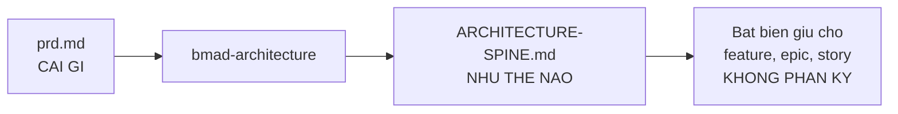
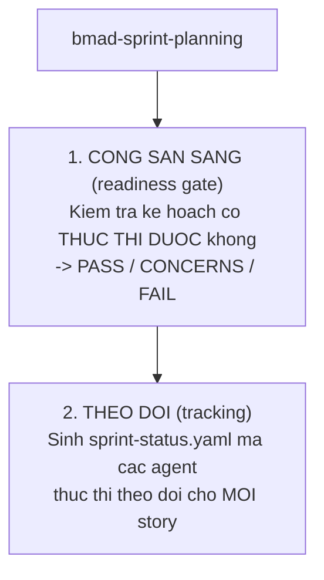

# 05 — Pha 3: Giải pháp

> [← Mục lục demo](./index.md) · Trước: [04 — Pha 2](./04-pha2-lap-ke-hoach.md) · Tiếp: [06 — Pha 4](./06-pha4-thuc-thi.md)

**Ba cổng bắt buộc liên tiếp:** `bmad-architecture` → `bmad-create-epics-and-stories` → `bmad-sprint-planning`.

---

# Phần A — `bmad-architecture`

## A.1 Lệnh

**Cửa sổ ngữ cảnh mới:**

```
> bmad-architecture
```

## A.2 Vai trò

Từ `module-help.csv`:

> *Offer once requirements exist (a PRD or spec; plus UX if present) and the user is ready to move from **what** to **how**. Also offer any time **independently-built parts risk diverging**. Produces the **architecture spine**: the **invariants that keep features, epics, and stories consistent**.*



## A.3 Kích hoạt và nạp ngữ cảnh

```bash
uv run .../resolve_customization.py --skill .../bmad-architecture --key workflow
uv run .../resolve_config.py --project-root D:/du-an/quan-ly-kho
```

```
👁️ _bmad-output/planning-artifacts/prds/prd-quan-ly-kho-2026-08-11/prd.md          (nguồn chính)
👁️ _bmad-output/planning-artifacts/briefs/brief-quan-ly-kho-2026-08-11/brief.md         (bối cảnh)
👁️ package.json                                     (ngăn xếp hiện có)
👁️ src/                                             (rỗng — greenfield)
```

```
🏗️ Chào Thảo. Winston đây.

Đọc xong PRD rồi. Trước khi bàn công nghệ, mình muốn chốt cái đã ràng
buộc kiến trúc nhiều nhất — và nó không phải lựa chọn của mình:

  NFR-01: offline-first là ràng buộc KIẾN TRÚC, không phải tính năng
  FR-02:  sổ cái append-only, tồn kho là kết quả tính
  FR-08:  đồng bộ là hợp nhất, không phải ghi đè

Ba cái này cùng chỉ về **một** quyết định gốc: **nguồn sự thật là chuỗi
sự kiện, không phải trạng thái hiện tại**. Mọi thứ khác bám theo.

Đúng cách bạn hiểu chứ? Nếu đúng, mình đi tiếp và trình bày các đánh đổi.
```

🛑 **HALT**

## A.4 Vòng quyết định

Winston trình bày **đánh đổi**, không phải phán quyết — đúng persona:

> *"Speaks like a seasoned engineer at the whiteboard: measured, always laying out **trade-offs rather than verdicts**."*

```
🏗️ **Quyết định 1: Lưu trữ cục bộ trên thiết bị**

Ba lựa chọn thực tế cho một web app offline-first:

| | IndexedDB thuần | Dexie.js | SQLite qua wa-sqlite |
| --- | --- | --- | --- |
| Kích thước bundle | 0 KB | ~25 KB | ~500 KB (WASM) |
| Truy vấn tổng hợp (SUM theo mã hàng) | Phải tự viết | Phải tự viết | SQL thuần |
| Đường cong học | Cao (API thô) | Thấp | Trung bình |
| Rủi ro | API dài dòng, dễ sai | Thêm một dependency | WASM có thể lỗi trên máy cũ |

Bối cảnh của bạn: tồn kho = SUM các giao dịch theo mã hàng. Với 2.000 mã
và ~50 giao dịch/ngày, sau 1 năm là ~18.000 dòng. Không lớn.

Mình nghiêng về **Dexie.js**: đủ nhỏ, truy vấn theo index đủ nhanh ở quy
mô này, và bạn là dev duy nhất nên đường cong học quan trọng.

Đánh đổi bạn nhận: nếu sau này cần truy vấn phức tạp (báo cáo chéo nhiều
chiều), bạn sẽ phải tự viết logic tổng hợp thay vì SQL. PRD đã loại báo
cáo khỏi v1, nên rủi ro này lùi xa.

Bạn thấy sao?
```

🛑 **HALT**

*...tiếp tục qua ~7 quyết định kiến trúc...*

## A.5 Lint spine

Trước khi kết thúc, skill chạy:

```bash
uv run .../bmad-architecture/scripts/lint_spine.py \
  _bmad-output/planning-artifacts/architecture/architecture-quan-ly-kho-2026-08-11/ARCHITECTURE-SPINE.md
```

**Đầu ra:**

```json
{
  "ok": true,
  "invariants": 9,
  "decisions": 7,
  "warnings": []
}
```

## A.6 Tạo phẩm

### 📄 `_bmad-output/planning-artifacts/architecture/architecture-quan-ly-kho-2026-08-11/ARCHITECTURE-SPINE.md`

```markdown
---
title: Hệ thống Quản lý Kho — Architecture Spine
created: 2026-08-11
status: approved
sources:
  - _bmad-output/planning-artifacts/prds/prd-quan-ly-kho-2026-08-11/prd.md
---

# Architecture Spine — Hệ thống Quản lý Kho

> **Spine là gì:** tập bất biến mà mọi feature, epic, và story phải tuân
> theo. Khi hai phần được xây độc lập, spine là thứ giữ chúng không phân kỳ.
> Nếu một story cần vi phạm một bất biến ở đây, đó là tín hiệu dừng lại
> và bàn lại kiến trúc — không phải làm ngoại lệ.

## Quyết định gốc

**Nguồn sự thật là chuỗi sự kiện, không phải trạng thái hiện tại.**

Ba yêu cầu của PRD (NFR-01 offline-first, FR-02 append-only, FR-08 đồng bộ
là hợp nhất) đều là hệ quả của quyết định này. Đảo ngược nó thì cả ba sụp.

## Chín bất biến

**INV-01 — Không có UPDATE nào trên bảng giao dịch**
Chỉ INSERT. Không UPDATE, không DELETE. Sửa sai bằng giao dịch bù trừ.

**INV-02 — Tồn kho không được lưu**
`ton_kho(ma_hang)` là hàm thuần tính từ chuỗi giao dịch. Không có cột
`so_luong_ton` ở bất kỳ đâu. Cache được phép, nhưng phải tái tính được
100% từ sổ cái và phải có test chứng minh điều đó.

**INV-03 — Mỗi giao dịch có ID sinh trên thiết bị**
UUIDv7 sinh tại client. Không dùng auto-increment của server — thiết bị
offline phải sinh được ID hợp lệ không cần hỏi server.

**INV-04 — Ghi cục bộ trước, đồng bộ sau, luôn luôn**
Không có đường ghi nào đi thẳng lên server. Kể cả khi online. Điều này
loại bỏ hoàn toàn lớp "hai đường ghi khác nhau" mà offline-first hay chết vì nó.

**INV-05 — Đồng bộ là idempotent**
Gửi lại cùng một giao dịch (cùng UUID) không tạo bản ghi thứ hai. Server
dùng UUID làm khóa chính.

**INV-06 — Thời gian có hai trường, không một**
`thoi_diem_ghi` (đồng hồ thiết bị, có thể lệch) và `thoi_diem_dong_bo`
(đồng hồ server, tin cậy). Thứ tự nghiệp vụ dùng cái đầu; thứ tự kỹ thuật
dùng cái sau.

**INV-07 — Logic nghiệp vụ không biết về mạng**
Tầng domain (`src/domain/`) không import gì từ `src/sync/` hay `src/api/`.
Nó nhận giao dịch, trả kết quả. Có thể test hoàn toàn không cần mạng và
không cần DB.

**INV-08 — Không có trạng thái "đang lưu"**
Người dùng bấm lưu → giao dịch đã ở trong IndexedDB → hiện xác nhận.
Không có spinner chờ mạng. Đây là cách NFR-03 (≤20 giây) đạt được.

**INV-09 — Schema giao dịch chỉ mở rộng, không phá vỡ**
Thêm trường tùy chọn được. Đổi ý nghĩa trường cũ, đổi kiểu, xóa trường:
không. Thiết bị offline lâu ngày phải đồng bộ được với server mới.

## Bảy quyết định công nghệ

| # | Quyết định | Lý do | Đánh đổi chấp nhận |
| --- | --- | --- | --- |
| D-01 | **Dexie.js** cho lưu trữ cục bộ | Đủ nhỏ (~25 KB), index đủ nhanh ở quy mô 18k dòng/năm, đường cong học thấp cho dev đơn | Truy vấn phức tạp phải tự viết logic; PRD đã loại báo cáo khỏi v1 |
| D-02 | **PostgreSQL** cho server | Đã quen, transaction mạnh, `ON CONFLICT DO NOTHING` cho INV-05 | Nặng hơn SQLite cho quy mô này; chấp nhận vì sẽ lớn |
| D-03 | **React + TypeScript** | Đã có trong package.json, hệ sinh thái PWA tốt | — |
| D-04 | **PWA, không native** | Một codebase, cài qua trình duyệt, không qua store | Không truy cập được camera tốt như native — chỉ ảnh hưởng v2 (quét mã) |
| D-05 | **Đồng bộ đẩy-kéo đơn giản**, không CRDT | Sổ cái append-only đã làm hợp nhất trở nên tầm thường; CRDT là over-engineering | Xung đột `DIEU_CHINH` cùng gốc phải xử lý tay (FR-09) |
| D-06 | **Vitest** cho test | Đã có trong package.json | — |
| D-07 | **Không có ORM ở client** | Dexie API đủ; thêm lớp trừu tượng nữa là chi phí không có lợi | Câu truy vấn Dexie xuất hiện trong repository layer |

## Cấu trúc thư mục bắt buộc

```
src/
├── domain/           # LOGIC THUẦN — không import db, không import network
│   ├── transaction.ts        # kiểu giao dịch + validate
│   ├── inventory.ts          # tính tồn kho từ chuỗi giao dịch
│   └── reconciliation.ts     # logic đối soát
├── db/               # Dexie — chỉ đọc/ghi, không logic nghiệp vụ
│   ├── schema.ts
│   └── repository.ts
├── sync/             # đẩy/kéo với server
│   └── syncEngine.ts
├── api/              # server (Node)
│   ├── routes/
│   └── db/
├── ui/               # React
│   └── screens/
└── __tests__/
```

> **INV-07 được kiểm bằng lint:** một quy tắc ESLint cấm `src/domain/**`
> import từ `src/db/**`, `src/sync/**`, `src/api/**`.

## Mô hình dữ liệu

```typescript
// src/domain/transaction.ts

export type TransactionType = 'NHAP' | 'XUAT' | 'DIEU_CHINH' | 'DOI_SOAT';

export interface Transaction {
  id: string;                    // UUIDv7, sinh tại client (INV-03)
  type: TransactionType;
  ma_hang: string;
  so_luong: number;              // dấu theo loại: NHAP +, XUAT −, còn lại ±
  ly_do: string;                 // từ danh sách định sẵn
  ghi_chu?: string;              // tự do, tùy chọn
  nguoi_thuc_hien: string;
  thoi_diem_ghi: string;         // ISO, đồng hồ thiết bị (INV-06)
  thoi_diem_dong_bo?: string;    // ISO, đồng hồ server (INV-06)

  // riêng NHAP (FR-01)
  so_luong_chung_tu?: number;
  so_luong_thuc_nhan?: number;
  so_phieu?: string;
  ncc?: string;

  // riêng DIEU_CHINH (FR-06)
  giao_dich_goc?: string;        // UUID của giao dịch được sửa

  // riêng DOI_SOAT (FR-11)
  so_luong_dem_duoc?: number;
  chenh_lech?: number;
  trong_nguong?: boolean;
  nguoi_dem?: string;

  can_review?: boolean;          // FR-09
}
```

## Ánh xạ yêu cầu → bất biến

| Yêu cầu PRD | Bất biến thực thi nó |
| --- | --- |
| FR-02 sổ cái append-only | INV-01, INV-02 |
| FR-06 điều chỉnh không xóa | INV-01 |
| FR-07 offline không giới hạn | INV-03, INV-04 |
| FR-08 đồng bộ là hợp nhất | INV-05 |
| FR-09 xung đột DIEU_CHINH | D-05 + `can_review` |
| FR-10 tồn khả dụng theo trạng thái đồng bộ | INV-06 |
| NFR-01 offline-first | INV-04, INV-07 |
| NFR-03 ≤20 giây | INV-08 |
| NFR-04 không mất dữ liệu | INV-04, INV-08 |
```

---

# Phần B — `bmad-create-epics-and-stories`

## B.1 Lệnh

```
> bmad-create-epics-and-stories
```

## B.2 Kiến trúc file-bước

Skill này dùng 4 bước:


## B.3 Bước 1 — kiểm tra tiền điều kiện

```
👁️ _bmad-output/planning-artifacts/prds/prd-quan-ly-kho-2026-08-11/prd.md               ✓
👁️ _bmad-output/planning-artifacts/architecture/architecture-quan-ly-kho-2026-08-11/ARCHITECTURE-SPINE.md ✓
👁️ _bmad-output/planning-artifacts/DESIGN.md            ✗ (không có — UX chưa chạy)
```

```
📊 Tiền điều kiện:
  ✓ PRD (v1.0, approved)
  ✓ Architecture Spine (9 bất biến, 7 quyết định)
  — UX Design: không có

Không có UX là chấp nhận được — PRD của bạn không mô tả màn hình chi
tiết, và spine đã chốt cấu trúc `src/ui/screens/`. Story sẽ mô tả hành
vi, không mô tả pixel.

Tiếp tục?
```

🛑 **HALT**

## B.4 Bước 2 — thiết kế epic

```
📊 Từ 12 FR + 4 NFR, mình đề xuất 3 epic theo **thứ tự phụ thuộc**, không
phải theo giá trị người dùng — vì đây là greenfield và tầng dưới phải có
trước:

**Epic 1 — Sổ cái giao dịch (nền móng)**
  Phủ: FR-02, FR-03, FR-04, FR-05, FR-06, INV-01, INV-02, INV-03, INV-07
  Vì sao đầu tiên: mọi thứ khác đọc từ sổ cái. Không có nó thì không có gì.
  Kết thúc khi: ghi được 4 loại giao dịch và tính được tồn kho, có test.

**Epic 2 — Ghi nhận offline (giá trị đầu tiên tới tay người dùng)**
  Phủ: FR-01, FR-07, FR-10, NFR-01, NFR-03, NFR-04, INV-04, INV-08
  Vì sao thứ hai: đây là lúc nhân viên kho lần đầu chạm hệ thống.
  Kết thúc khi: một người ghi được nhập/xuất offline trong ≤20 giây.

**Epic 3 — Đồng bộ và đối soát**
  Phủ: FR-08, FR-09, FR-11, FR-12, NFR-02, INV-05, INV-06, INV-09
  Vì sao cuối: cần epic 1+2 chạy được trước khi đồng bộ có ý nghĩa.
  Kết thúc khi: hai thiết bị đồng bộ được và kỳ đối soát chạy được.

Đồng ý cách chia này không? Đặc biệt: bạn có muốn đảo epic 2 và 3 để có
đồng bộ sớm hơn không?
```

🛑 **HALT**

```
> giữ nguyên. Epic 2 quan trọng hơn vì phải chứng minh nhân viên dùng được
```

## B.5 Bước 3 — tạo story

```
📊 Epic 1 — Sổ cái giao dịch. Bốn story:

  1-1  Mô hình dữ liệu tồn kho
  1-2  Ghi giao dịch vào kho cục bộ
  1-3  Tính tồn kho từ chuỗi giao dịch
  1-4  Giao dịch điều chỉnh

Mỗi story là **một mục tiêu người dùng duy nhất** và đủ nhỏ để một spec
900–1600 token bao được.

Đi qua từng cái nhé?
```

*...vòng tạo story...*

## B.6 Tạo phẩm

### 📄 `_bmad-output/planning-artifacts/epics.md` (trích)

```markdown
---
title: Hệ thống Quản lý Kho — Epics và Stories
created: 2026-08-11
status: approved
sources:
  - _bmad-output/planning-artifacts/prds/prd-quan-ly-kho-2026-08-11/prd.md
  - _bmad-output/planning-artifacts/architecture/architecture-quan-ly-kho-2026-08-11/ARCHITECTURE-SPINE.md
---

# Epics và Stories

## Epic 1 — Sổ cái giao dịch

**Mục tiêu:** Có một sổ cái append-only ghi được 4 loại giao dịch và tính
được tồn kho từ đó.

**Phủ:** FR-02, FR-03, FR-04, FR-05, FR-06
**Bất biến ràng buộc:** INV-01, INV-02, INV-03, INV-07
**Kết thúc khi:** ghi được 4 loại giao dịch, tính được tồn kho, test phủ
mọi loại giao dịch và mọi biên.

---

### Story 1-1 — Mô hình dữ liệu tồn kho

**Là** lập trình viên
**Tôi cần** kiểu dữ liệu giao dịch và hàm validate
**Để** mọi tầng khác có một hợp đồng chung không mơ hồ

**Phạm vi:**
- `src/domain/transaction.ts` — kiểu `Transaction`, `TransactionType`
- Hàm `validateTransaction(t): ValidationResult`
- Danh sách lý do định sẵn theo từng loại giao dịch

**Ràng buộc từ spine:**
- INV-03: `id` là UUIDv7 sinh tại client
- INV-06: hai trường thời gian riêng biệt
- INV-07: file này KHÔNG import gì từ `src/db/`, `src/sync/`, `src/api/`

**Acceptance Criteria:**
- Given một giao dịch NHAP thiếu `so_luong_thuc_nhan`, when validate, then trả lỗi `MISSING_ACTUAL_QTY`
- Given một giao dịch NHAP có `so_luong_chung_tu` ≠ `so_luong_thuc_nhan`, when validate, then hợp lệ và `chenh_lech` được tính
- Given một giao dịch DIEU_CHINH thiếu `giao_dich_goc`, when validate, then trả lỗi `MISSING_SOURCE_TX`
- Given một giao dịch XUAT có `so_luong` dương, when validate, then trả lỗi `WRONG_SIGN`
- Given `ly_do` không thuộc danh sách của loại giao dịch đó, when validate, then trả lỗi `INVALID_REASON`
- Given file `transaction.ts`, when chạy ESLint, then không có import nào từ `src/db`, `src/sync`, `src/api`

---

### Story 1-2 — Ghi giao dịch vào kho cục bộ

**Là** lập trình viên
**Tôi cần** một repository ghi giao dịch vào IndexedDB qua Dexie
**Để** giao dịch tồn tại trên thiết bị trước khi nghĩ tới mạng

**Phạm vi:**
- `src/db/schema.ts` — schema Dexie, index trên `ma_hang` và `thoi_diem_ghi`
- `src/db/repository.ts` — `appendTransaction(t)`, `getTransactionsByItem(ma_hang)`

**Ràng buộc từ spine:**
- INV-01: chỉ có `add`, không có `update`, không có `delete`
- INV-04: hàm này là đường ghi DUY NHẤT
- INV-05: `add` với UUID đã tồn tại không tạo bản ghi thứ hai

**Acceptance Criteria:**
- Given một giao dịch hợp lệ, when `appendTransaction`, then nó có trong IndexedDB
- Given cùng một giao dịch (cùng `id`) gọi hai lần, when `appendTransaction`, then chỉ có một bản ghi
- Given repository, when kiểm tra API công khai, then không có hàm nào tên `update`, `delete`, `remove`, hay `clear`
- Given 5.000 giao dịch của 200 mã hàng, when `getTransactionsByItem`, then trả về trong < 50ms

---

### Story 1-3 — Tính tồn kho từ chuỗi giao dịch
...

### Story 1-4 — Giao dịch điều chỉnh
...

## Epic 2 — Ghi nhận offline
...

## Epic 3 — Đồng bộ và đối soát
...
```

---

# Phần C — `bmad-sprint-planning`

## C.1 Lệnh

```
> bmad-sprint-planning
```

## C.2 Hai việc trong một skill



## C.3 Cổng sẵn sàng

```
👁️ references/readiness-gate.md
```

```
📊 Chạy cổng sẵn sàng trên 12 story của 3 epic...

**PASS** — 9 story
**CONCERNS** — 2 story
**FAIL** — 1 story

───────────────────────────────────────────────────────────────
FAIL
───────────────────────────────────────────────────────────────

**Story 3-2 — Đồng bộ hai chiều**

  Thiếu: không có acceptance criteria nào định nghĩa "đồng bộ thành công"
  một cách kiểm chứng được. AC hiện tại nói "dữ liệu được đồng bộ" —
  không đo được.

  Cần: AC dạng Given/When/Then với số liệu cụ thể. Ví dụ:
    "Given thiết bị A có 10 giao dịch chưa đồng bộ và thiết bị B có 5,
     when cả hai đồng bộ, then server có đúng 15 giao dịch và cả hai
     thiết bị đọc được cả 15."

───────────────────────────────────────────────────────────────
CONCERNS
───────────────────────────────────────────────────────────────

**Story 2-3 — Màn hình ghi nhập kho**
  NFR-03 nói ≤20 giây nhưng story không có AC nào đo thời gian.
  Đề xuất thêm: "Given một người dùng đã đăng nhập, when ghi một lô hàng
  đầy đủ trường, then thời gian từ mở màn hình đến xác nhận ≤ 20 giây
  (đo bằng 5 lần thử với người thật)."

**Story 1-3 — Tính tồn kho từ chuỗi giao dịch**
  INV-02 yêu cầu cache phải tái tính được 100% và "phải có test chứng
  minh điều đó" — story không có AC cho việc này.
  Đề xuất thêm: "Given 1.000 giao dịch ngẫu nhiên, when xóa cache và
  tính lại, then kết quả khớp 100% với giá trị trước khi xóa."

───────────────────────────────────────────────────────────────

Sửa story 3-2 trước khi tiếp tục? Hai CONCERNS có thể để lại nhưng mình
khuyên sửa luôn — chúng là nơi NFR-03 và INV-02 bị mất dấu.
```

🛑 **HALT**

```
> sửa cả ba
```

*...sau khi sửa, chạy lại cổng: **PASS** 12/12...*

## C.4 Sinh file theo dõi

```
👁️ references/generate-tracking.md
```

```bash
uv run .../bmad-sprint-planning/scripts/sprint_plan.py generate \
  --epic-file "D:/du-an/quan-ly-kho/_bmad-output/planning-artifacts/epics.md" \
  --status-file "D:/du-an/quan-ly-kho/_bmad-output/implementation-artifacts/sprint-status.yaml" \
  --stories-dir "D:/du-an/quan-ly-kho/_bmad-output/implementation-artifacts" \
  --project "quan-ly-kho" \
  --date "08-11-2026" \
  --tracking-system "file-system" \
  --story-location "_bmad-output/implementation-artifacts"
```

**Đầu ra:**

```json
{
  "ok": true,
  "status_file": "D:/du-an/quan-ly-kho/_bmad-output/implementation-artifacts/sprint-status.yaml",
  "epics": 3,
  "stories": 12,
  "created": true
}
```

## C.5 Tạo phẩm

### 📄 `_bmad-output/implementation-artifacts/sprint-status.yaml`

```yaml
# Sprint Status
# generated: 08-11-2026
# project: quan-ly-kho
# project_key: QLK
# tracking_system: file-system
# story_location: _bmad-output/implementation-artifacts

# STATUS DEFINITIONS:
# ==================
# Epic Status:
#   - backlog: Epic not yet started
#   - in-progress: Epic actively being worked on
#   - done: All stories in epic completed
#
# Story Status:
#   - backlog: Story only exists in epic file
#   - ready-for-dev: Story file created, ready for development
#   - in-progress: Developer actively working on implementation
#   - review: Implementation complete, ready for review
#   - done: Story completed
#
# Retrospective Status:
#   - optional: Can be completed but not required
#   - done: Retrospective has been completed
#
# Action Item Status:
#   - open: Committed during a retrospective, not yet addressed
#   - in-progress: Actively being worked on
#   - done: Completed
#
# WORKFLOW NOTES:
# ===============
# - Epic transitions to 'in-progress' automatically when its first story starts (via build's sprint sync)
# - Stories can be worked in parallel if team capacity allows
# - Developer typically creates the next story after the previous one is 'done' to incorporate learnings
# - Dev moves story to 'review', then runs code-review (fresh context, different LLM recommended)
# - Retrospective appends its action items to action_items; the status view surfaces open ones

generated: 08-11-2026 15:40
last_updated: 08-11-2026 15:40
project: quan-ly-kho
project_key: QLK
tracking_system: file-system
story_location: "_bmad-output/implementation-artifacts"

development_status:
  epic-1: backlog
  1-1-mo-hinh-du-lieu-ton-kho: backlog
  1-2-ghi-giao-dich-vao-kho-cuc-bo: backlog
  1-3-tinh-ton-kho-tu-chuoi-giao-dich: backlog
  1-4-giao-dich-dieu-chinh: backlog
  epic-1-retrospective: optional

  epic-2: backlog
  2-1-man-hinh-ghi-nhap-kho: backlog
  2-2-man-hinh-ghi-xuat-kho: backlog
  2-3-man-hinh-xem-ton-kho: backlog
  2-4-hoat-dong-hoan-toan-offline: backlog
  epic-2-retrospective: optional

  epic-3: backlog
  3-1-day-giao-dich-len-server: backlog
  3-2-dong-bo-hai-chieu: backlog
  3-3-xu-ly-xung-dot-dieu-chinh: backlog
  3-4-ky-doi-soat: backlog
  epic-3-retrospective: optional
```

---

## Tóm tắt Pha 3

| | `bmad-architecture` | `bmad-create-epics-and-stories` | `bmad-sprint-planning` |
| --- | --- | --- | --- |
| Script | `resolve_customization.py`, `resolve_config.py`, `lint_spine.py` | như trên | như trên + `sprint_plan.py generate` |
| 👁️ Đọc | `prd.md`, `brief.md`, `package.json`, `src/` | `prd.md`, `ARCHITECTURE-SPINE.md` | `epics.md` |
| 📄 Ghi | `ARCHITECTURE-SPINE.md` | `epics.md` | `sprint-status.yaml` |
| 🛑 Điểm dừng | ~9 | ~7 | ~3 |
| Thời gian | ~50 phút | ~35 phút | ~15 phút |

**Trạng thái sau Pha 3:**

```
_bmad-output/
├── brainstorming/brainstorm-quan-ly-kho-2026-08-11/
│   ├── .memlog.md
│   ├── brainstorm.html
│   └── brainstorm-intent.md
├── planning-artifacts/
│   ├── brief.md
│   ├── addendum.md
│   ├── prd.md
│   ├── .memlog.md
│   ├── ARCHITECTURE-SPINE.md      ← MỚI, cổng bắt buộc #2
│   └── epics.md                   ← MỚI, cổng bắt buộc #3
└── implementation-artifacts/
    └── sprint-status.yaml         ← MỚI, cổng bắt buộc #4
```

**Bốn cổng bắt buộc đã qua.** Giờ đến việc viết mã.

---

**Tiếp:** [06 — Pha 4: Thực thi](./06-pha4-thuc-thi.md) · [← Mục lục demo](./index.md)
