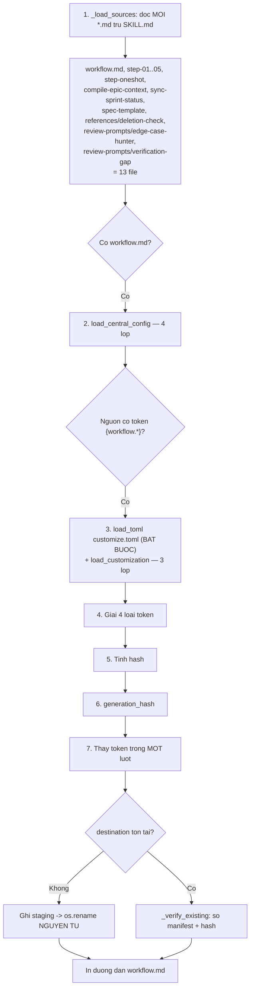
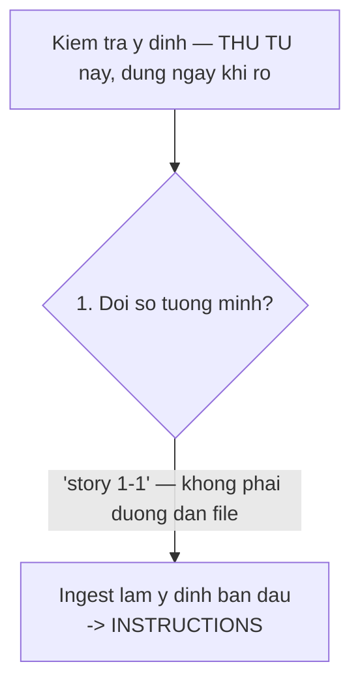
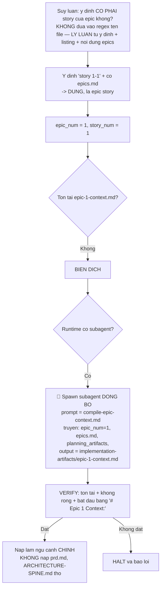
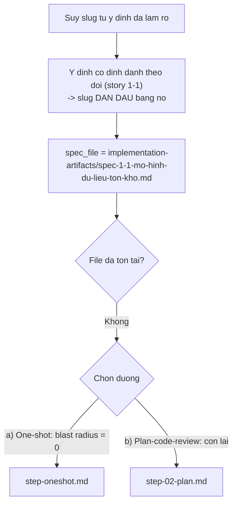
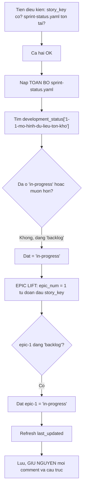
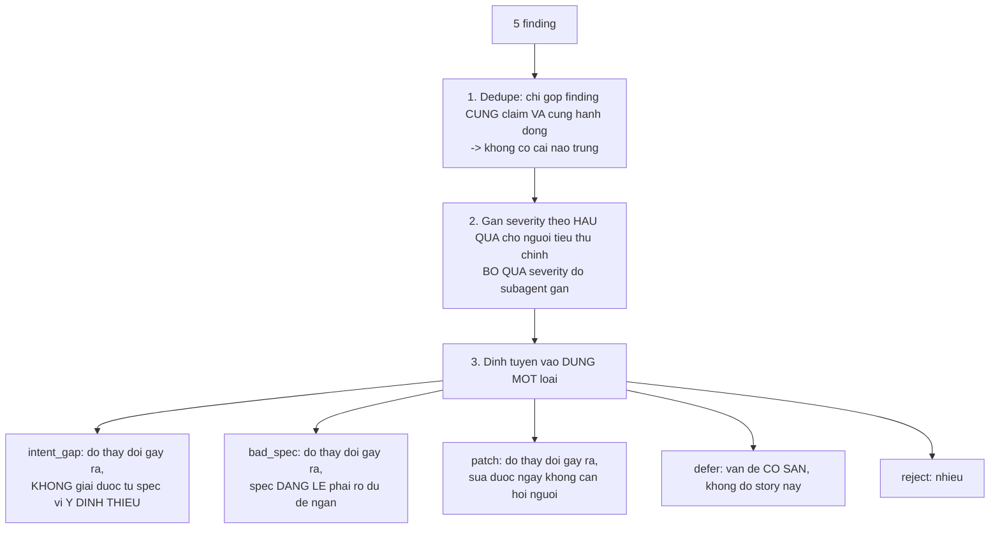
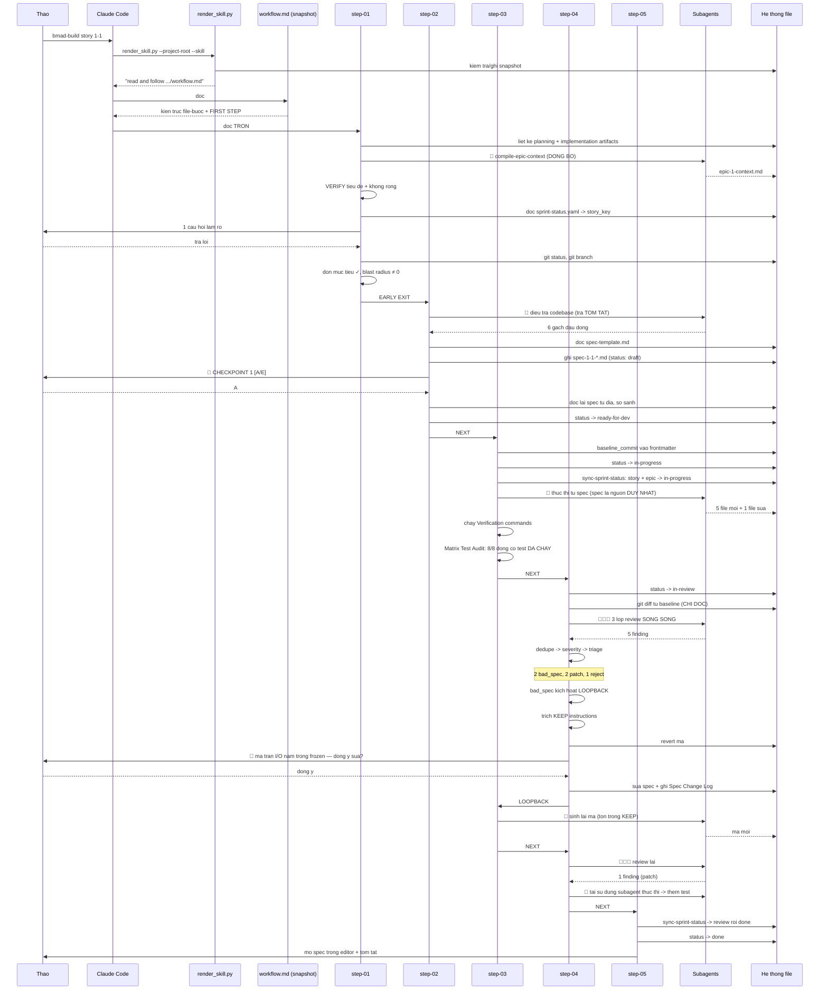
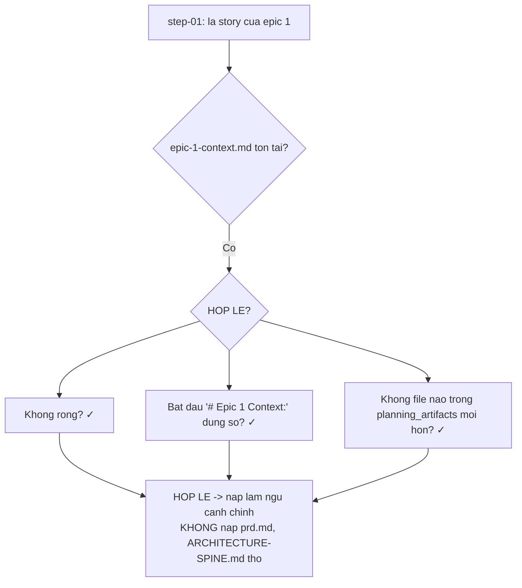

# 06 — Pha 4: Thực thi (`bmad-build`)

> [← Mục lục demo](./index.md) · Trước: [05 — Pha 3](./05-pha3-giai-phap.md) · Tiếp: [07 — Review & Retro](./07-review-va-retro.md)

Đây là bước chi tiết nhất của demo — nó cho thấy **kiến trúc file-bước** hoạt động thế nào.

---

## 1. Lệnh

**Cửa sổ ngữ cảnh mới:**

```
> bmad-build story 1-1
```

---

## 2. `SKILL.md` chỉ có 10 dòng

```bash
$ cat .claude/skills/bmad-build/SKILL.md
```

```markdown
---
name: bmad-build
description: 'Implements any user intent, requirement, story, bug fix or change request by producing clean working code artifacts that follow the project''s existing architecture, patterns and conventions. Use when the user wants to build, fix, tweak, refactor, add or modify any code, component or feature.'
---

Run the following command exactly once without changing the current working directory. Replace `{project-root}` with the absolute path to the project root and `{skill-root}` with the absolute path to this skill's directory:

```bash
uv run --no-cache "{project-root}/_bmad/scripts/render_skill.py" --project-root "{project-root}" --skill "{skill-root}"
```

- On success, read and follow the one absolute `workflow.md` instruction printed to stdout.
- On failure (including `uv` being unavailable), report the command output and HALT. Do not run any workflow source directly.
```

> Đây là **khuôn mẫu C** — skill workflow kết xuất. Toàn bộ logic nằm ở `workflow.md` và các file bước, và chúng **phải được kết xuất** trước khi dùng.

---

## 3. Kết xuất

```bash
uv run --no-cache "D:/du-an/quan-ly-kho/_bmad/scripts/render_skill.py" \
  --project-root "D:/du-an/quan-ly-kho" \
  --skill "D:/du-an/quan-ly-kho/.claude/skills/bmad-build"
```

### 3.1 Bên trong `render_skill.py`



### 3.2 Token được thay thế

| Token trong nguồn | Giá trị thay vào |
| --- | --- |
| `{{.communication_language}}` | `Vietnamese` |
| `{{.document_output_language}}` | `Vietnamese` |
| `{{.planning_artifacts}}` | `D:/du-an/quan-ly-kho/_bmad-output/planning-artifacts` |
| `{{.implementation_artifacts}}` | `D:/du-an/quan-ly-kho/_bmad-output/implementation-artifacts` |
| `{workflow.activation_steps_prepend}` | `_None._` (mảng rỗng) |
| `{workflow.persistent_facts}` | `- file:D:/du-an/quan-ly-kho/**/project-context.md` |
| `{workflow.activation_steps_append}` | `_None._` |
| `{workflow.implementation_handoff}` | *(văn bản handoff mặc định)* |
| `{workflow.review_layers}` | *(3 khối `#### Tên (id)` + instruction)* |
| `[[bmad-snapshot:step-01-clarify-and-route.md]]` | `D:/du-an/quan-ly-kho/_bmad/render/bmad-build/quan-ly-kho-3f2a91b7c4d8/8e1a5c9d2f7b3a604e51/step-01-clarify-and-route.md` |

### 3.3 Đầu ra

```
read and follow D:/du-an/quan-ly-kho/_bmad/render/bmad-build/quan-ly-kho-3f2a91b7c4d8/8e1a5c9d2f7b3a604e51/workflow.md
```

### 3.4 Snapshot trên đĩa

```
_bmad/render/bmad-build/quan-ly-kho-3f2a91b7c4d8/8e1a5c9d2f7b3a604e51/
├── manifest.json
├── workflow.md
├── step-01-clarify-and-route.md
├── step-02-plan.md
├── step-03-implement.md
├── step-04-review.md
├── step-05-present.md
├── step-oneshot.md
├── compile-epic-context.md
├── sync-sprint-status.md
├── spec-template.md
├── references/
│   └── deletion-check.md
└── review-prompts/
    ├── edge-case-hunter.md
    └── verification-gap.md
```

📄 **`manifest.json`**

```json
{
  "schema_version": 1,
  "skill": "bmad-build",
  "project_root": "D:/du-an/quan-ly-kho",
  "project_slug": "quan-ly-kho",
  "root_hash": "3f2a91b7c4d8",
  "generation_hash": "8e1a5c9d2f7b3a604e51",
  "inputs": {
    "project_root": "D:/du-an/quan-ly-kho",
    "renderer_sha256": "c4f1e8a2...",
    "resolved_values": {
      "config.core.communication_language": "Vietnamese",
      "config.core.document_output_language": "Vietnamese",
      "config.modules.bmm.planning_artifacts": "D:/du-an/quan-ly-kho/_bmad-output/planning-artifacts",
      "config.modules.bmm.implementation_artifacts": "D:/du-an/quan-ly-kho/_bmad-output/implementation-artifacts",
      "customization.workflow.activation_steps_prepend": [],
      "customization.workflow.persistent_facts": ["file:{project-root}/**/project-context.md"],
      "customization.workflow.review_layers": [ "..." ]
    },
    "source_sha256": {
      "workflow.md": "a1b2c3...",
      "step-01-clarify-and-route.md": "d4e5f6...",
      "...": "..."
    }
  },
  "outputs": {
    "workflow.md": "9f8e7d...",
    "step-01-clarify-and-route.md": "6c5b4a...",
    "...": "..."
  }
}
```

> **Chạy lần thứ hai không đổi gì** ⇒ cùng `generation_hash` ⇒ `_verify_existing` xác nhận khớp ⇒ tái dùng, **không ghi lại file nào**.

---

## 4. Kích hoạt workflow

Claude Code đọc `workflow.md` đã kết xuất:

```markdown
### Step 1: Execute Prepend Steps

Execute each of these steps in order before proceeding (`_None._` means skip):

_None._

### Step 2: Load Persistent Facts

Treat every entry below as foundational context you carry for the rest of the workflow run...

- file:D:/du-an/quan-ly-kho/**/project-context.md

### Step 3: Execute Append Steps

_None._
```

```bash
# Glob persistent_facts
$ ls D:/du-an/quan-ly-kho/**/project-context.md
(không có file nào)
```

Rồi đọc phần **WORKFLOW ARCHITECTURE**:

```
Kiến trúc file-bước:
  • Micro-file: mỗi bước tự chứa
  • Just-In-Time: CHỈ nạp bước hiện tại
  • Sequential: hoàn tất theo thứ tự, KHÔNG nhảy cóc
  • State Tracking: trạng thái ở frontmatter spec
  • Append-Only: tạo phẩm dựng dần

Quy tắc TUYỆT ĐỐI:
  • NEVER nạp nhiều file bước cùng lúc
  • ALWAYS đọc TRỌN file bước trước khi hành động
  • NEVER bỏ bước hay "tối ưu" trình tự
  • ALWAYS dừng ở checkpoint và chờ người
```

Và **FIRST STEP**:

```
Read fully and follow: D:/.../8e1a5c9d2f7b3a604e51/step-01-clarify-and-route.md
```

---

## 5. Bước 01 — Làm rõ và định tuyến

### 5.1 Intent check



Lời gọi là `bmad-build story 1-1` — không phải đường dẫn file, nên coi là **ý định khởi đầu** và đi tới INSTRUCTIONS.

### 5.2 Nạp ngữ cảnh — nhánh Epic story

```
👁️ ls _bmad-output/planning-artifacts/
   brief.md  addendum.md  prd.md  .memlog.md  ARCHITECTURE-SPINE.md  epics.md

👁️ ls _bmad-output/implementation-artifacts/
   sprint-status.yaml
```



🤖 **Subagent biên dịch ngữ cảnh epic:**

📄 **`_bmad-output/implementation-artifacts/epic-1-context.md`**

```markdown
# Epic 1 Context: Sổ cái giao dịch

> Bản chưng cất từ prd.md, ARCHITECTURE-SPINE.md, epics.md — chỉ phần
> liên quan tới Epic 1. Sinh tự động; đừng sửa tay.

## Mục tiêu epic
Có một sổ cái append-only ghi được 4 loại giao dịch và tính được tồn kho.

## Yêu cầu PRD được phủ

**FR-02** Sổ cái append-only — tồn kho không lưu như trường UPDATE được;
mọi thay đổi là dòng mới; tồn hiện tại = tổng đại số giao dịch.

**FR-03** Bốn loại giao dịch:
| Loại | Dấu | Trường bắt buộc |
| NHAP | + | ncc, so_luong_chung_tu, so_luong_thuc_nhan, so_phieu |
| XUAT | − | so_luong, ly_do, don_hang (nếu có) |
| DIEU_CHINH | ± | so_luong, ly_do, giao_dich_goc (nếu sửa sai) |
| DOI_SOAT | ± | so_luong_dem_duoc, chenh_lech, nguoi_dem |

**FR-04** Mọi giao dịch có `nguoi_thuc_hien`, `thoi_diem_ghi`, `thoi_diem_dong_bo`.

**FR-05** `ly_do` là danh sách chọn theo loại + `ghi_chu` tự do tùy chọn.

**FR-06** Sửa sai bằng `DIEU_CHINH` bù trừ tham chiếu `giao_dich_goc`.
Không xóa, không sửa.

## Bất biến kiến trúc ràng buộc epic này

**INV-01** Không có UPDATE nào trên bảng giao dịch. Chỉ INSERT.

**INV-02** Tồn kho KHÔNG được lưu. `ton_kho(ma_hang)` là hàm thuần.
Cache được phép nhưng phải tái tính 100% và phải có test chứng minh.

**INV-03** `id` là UUIDv7 sinh tại client. Không auto-increment server.

**INV-07** `src/domain/**` KHÔNG import từ `src/db/**`, `src/sync/**`,
`src/api/**`. Kiểm bằng lint.

## Quyết định công nghệ liên quan

**D-01** Dexie.js cho lưu trữ cục bộ (~25 KB, index đủ nhanh ở 18k dòng/năm)
**D-06** Vitest cho test
**D-07** Không có ORM ở client

## Cấu trúc thư mục bắt buộc

```
src/
├── domain/          # LOGIC THUẦN
│   ├── transaction.ts
│   ├── inventory.ts
│   └── reconciliation.ts
├── db/              # Dexie
│   ├── schema.ts
│   └── repository.ts
└── __tests__/
```

## Kiểu dữ liệu chuẩn

```typescript
export type TransactionType = 'NHAP' | 'XUAT' | 'DIEU_CHINH' | 'DOI_SOAT';

export interface Transaction {
  id: string;
  type: TransactionType;
  ma_hang: string;
  so_luong: number;
  ly_do: string;
  ghi_chu?: string;
  nguoi_thuc_hien: string;
  thoi_diem_ghi: string;
  thoi_diem_dong_bo?: string;
  so_luong_chung_tu?: number;
  so_luong_thuc_nhan?: number;
  so_phieu?: string;
  ncc?: string;
  giao_dich_goc?: string;
  so_luong_dem_duoc?: number;
  chenh_lech?: number;
  trong_nguong?: boolean;
  nguoi_dem?: string;
  can_review?: boolean;
}
```

## Bốn story của epic

| ID | Tên | Trạng thái |
| --- | --- | --- |
| 1-1 | Mô hình dữ liệu tồn kho | backlog |
| 1-2 | Ghi giao dịch vào kho cục bộ | backlog |
| 1-3 | Tính tồn kho từ chuỗi giao dịch | backlog |
| 1-4 | Giao dịch điều chỉnh | backlog |
```

> **Vì sao cache này quan trọng:** 4 story của epic 1 đều cần cùng bộ ngữ cảnh. Nạp lại `prd.md` (3.184 từ) + `ARCHITECTURE-SPINE.md` + `epics.md` cho mỗi story là lãng phí khủng khiếp. Cache này ~800 từ.
>
> **Điều kiện hợp lệ của cache:** tồn tại + không rỗng + bắt đầu bằng `# Epic 1 Context:` + **không file nào trong `planning_artifacts` mới hơn**.

### 5.3 Tính liên tục story trước

```bash
# Quét spec cùng epic, status=done, story_num thấp hơn
$ ls _bmad-output/implementation-artifacts/spec-1-*.md
(không có — đây là story đầu tiên)
```

### 5.4 Story-key resolution

```bash
$ grep -n "^  1-1" _bmad-output/implementation-artifacts/sprint-status.yaml
  1-1-mo-hinh-du-lieu-ton-kho: backlog
```

```
story_key = "1-1-mo-hinh-du-lieu-ton-kho"
```

> Khớp bằng **so sánh số học hai đoạn đầu**, nên `1-1` không bao giờ va chạm với `1-10`.

### 5.5 Làm rõ ý định

```
💻 Story 1-1 — Mô hình dữ liệu tồn kho.

Từ epic context, mình hiểu phạm vi là:
  • `src/domain/transaction.ts` — kiểu Transaction + TransactionType
  • Hàm `validateTransaction(t): ValidationResult`
  • Danh sách lý do định sẵn theo loại giao dịch

Ràng buộc cứng: INV-03 (UUIDv7 client), INV-06 (hai trường thời gian),
INV-07 (không import db/sync/api).

Một câu hỏi trước khi lập kế hoạch:

  1. Danh sách lý do định sẵn — mình lấy từ addendum.md hay bạn muốn
     định nghĩa lại ở đây?
```

🛑 **HALT**

```
> lấy từ addendum.md
```

### 5.6 Kiểm tra VCS

```bash
$ git status --porcelain
(rỗng — cây làm việc sạch)

$ git branch --show-current
main
```

```
💻 Cây làm việc sạch. Nhánh `main`.

Với một dự án greenfield chưa có commit code nào, `main` là hợp lý.
Tiếp tục.
```

### 5.7 Kiểm tra đa mục tiêu

```
💻 Story 1-1 là MỘT mục tiêu người dùng: một hợp đồng kiểu dữ liệu
chung. `transaction.ts` và `validateTransaction` không ship độc lập
được — validate không có ý nghĩa nếu không có kiểu.

Đơn mục tiêu. Không cần tách.
```

### 5.8 Định tuyến



```
💻 Định tuyến: **plan-code-review**.

Lý do: file này là hợp đồng mà 11 story còn lại đều dựa vào. Sai ở đây
lan ra toàn bộ epic. Blast radius KHÔNG bằng 0.

→ step-02-plan.md
```

> Quy tắc: *"When uncertain whether blast radius is truly zero, choose this path."*

---

## 6. Bước 02 — Lập kế hoạch

### 6.1 Điều tra codebase

🤖 **Subagent điều tra** *(để tránh phình ngữ cảnh)*

```
🤖 Nhiệm vụ: khảo sát src/ và package.json, trả về TÓM TẮT CHƯNG CẤT.
   Không trả nội dung file.
```

**Kết quả trả về:**

```
- src/ chỉ có index.ts với console.log — greenfield thật
- package.json: typescript 5.7, vitest 2.1, eslint 9.17, tsx 4.19
- Chưa có Dexie, chưa có uuid — cần cài
- tsconfig.json chưa tồn tại
- Chưa có eslint.config.js — cần tạo để thực thi INV-07
- Không có mã nào để tái sử dụng
```

### 6.2 Điền spec template

```
👁️ D:/.../8e1a5c9d2f7b3a604e51/spec-template.md
```

### 6.3 Tự soi theo chuẩn Ready for Development

| Tiêu chí | Đạt? |
| --- | --- |
| **Actionable** — mỗi task có đường dẫn file và hành động cụ thể | ✓ |
| **Logical** — task theo thứ tự phụ thuộc | ✓ |
| **Testable** — mọi AC dạng Given/When/Then | ✓ |
| **Complete** — không placeholder, không TBD | ✓ |
| **Sufficient** — không khoảng trống yêu cầu/chấp nhận/phụ thuộc/thực thi | ✓ |
| **Coherent** — không mơ hồ, không mâu thuẫn nội tại | ✓ |

### 6.4 Đếm token

```
💻 Spec: ~1.180 token. Trong khoảng 900–1600. Không cần tách.
```

### 6.5 CHECKPOINT 1

```
💻 Spec đã sẵn sàng.

  📄 _bmad-output/implementation-artifacts/spec-1-1-mo-hinh-du-lieu-ton-kho.md

  Loại: feature
  Token: ~1.180 (trong khoảng tối ưu)
  Task: 5
  AC: 8
  Verification: 3 lệnh CLI

───────────────────────────────────────────────────────────────

Trước khi duyệt, bạn có thể mở file spec trong editor hoặc hỏi mình và
bảo mình sửa gì. Bạn cũng có thể dùng skill `bmad-advanced-elicitation`,
`bmad-party-mode`, hoặc `bmad-code-review` — lý tưởng là ở phiên khác để
tránh phình ngữ cảnh.

───────────────────────────────────────────────────────────────

[A] Approve  |  [E] Edit
```

🛑 **HALT**

### 6.6 📄 Spec được tạo

```markdown
---
title: 'Mô hình dữ liệu tồn kho'
type: 'feature'
created: '2026-08-11'
status: 'draft'
review_loop_iteration: 0
context: []
---

<frozen-after-approval reason="human-owned intent — do not modify unless human renegotiates">

## Intent

**Problem:** Chưa có hợp đồng kiểu dữ liệu chung cho giao dịch tồn kho.
11 story còn lại của 3 epic đều đọc/ghi giao dịch, và nếu mỗi tầng tự
định nghĩa hình dạng dữ liệu thì chúng sẽ phân kỳ.

**Approach:** Một file logic thuần `src/domain/transaction.ts` chứa kiểu
`Transaction`, enum `TransactionType`, hàm `validateTransaction`, và bảng
lý do định sẵn theo loại. Không phụ thuộc DB, không phụ thuộc mạng.

## Boundaries & Constraints

**Always:**
- `src/domain/transaction.ts` không import gì từ `src/db/`, `src/sync/`,
  `src/api/` (INV-07)
- `id` là UUIDv7 sinh tại client (INV-03)
- Hai trường thời gian riêng biệt: `thoi_diem_ghi` và `thoi_diem_dong_bo` (INV-06)
- Dấu của `so_luong` theo loại: NHAP dương, XUAT âm, DIEU_CHINH và
  DOI_SOAT có thể cả hai

**Ask First:**
- Thêm bất kỳ loại giao dịch thứ 5 nào
- Thay đổi hình dạng trường đã định nghĩa trong ARCHITECTURE-SPINE.md
- Thêm bất kỳ dependency runtime nào ngoài `uuid`

**Never:**
- Không tạo hàm `updateTransaction`, `deleteTransaction`, hay bất kỳ tên
  nào hàm ý sửa/xóa (INV-01)
- Không thêm trường `so_luong_ton` hay bất kỳ dạng tồn kho được lưu nào (INV-02)
- Không import Dexie, không import fetch, không import bất cứ thứ gì
  chạm I/O

## I/O & Edge-Case Matrix

| Scenario | Input / State | Expected Output / Behavior | Error Handling |
|----------|--------------|---------------------------|----------------|
| NHAP hợp lệ | type=NHAP, so_luong_chung_tu=100, so_luong_thuc_nhan=98, ncc, so_phieu, ly_do hợp lệ | `{valid: true, chenh_lech: -2}` | N/A |
| NHAP thiếu số thực nhận | type=NHAP, so_luong_chung_tu=100, so_luong_thuc_nhan=undefined | `{valid: false, errors: ['MISSING_ACTUAL_QTY']}` | Trả lỗi, không ném |
| XUAT sai dấu | type=XUAT, so_luong=+50 | `{valid: false, errors: ['WRONG_SIGN']}` | Trả lỗi, không ném |
| DIEU_CHINH thiếu gốc | type=DIEU_CHINH, giao_dich_goc=undefined | `{valid: false, errors: ['MISSING_SOURCE_TX']}` | Trả lỗi, không ném |
| Lý do không hợp lệ | type=XUAT, ly_do='abc xyz' | `{valid: false, errors: ['INVALID_REASON']}` | Trả lỗi, không ném |
| Nhiều lỗi cùng lúc | type=XUAT, so_luong=+50, ly_do='abc' | `{valid: false, errors: ['WRONG_SIGN','INVALID_REASON']}` | Gom mọi lỗi, không dừng ở lỗi đầu |
| ma_hang rỗng | ma_hang='' | `{valid: false, errors: ['MISSING_ITEM_CODE']}` | Trả lỗi, không ném |
| so_luong = 0 | type=NHAP, so_luong_thuc_nhan=0 | `{valid: true}` | Hợp lệ — nhận 0 là kết quả thật khi hàng hỏng toàn bộ |

</frozen-after-approval>

## Code Map

- `src/domain/transaction.ts` — TẠO MỚI. Chứa toàn bộ nội dung story này.
- `src/domain/reasons.ts` — TẠO MỚI. Bảng lý do định sẵn, tách riêng để
  story 2-x import mà không kéo theo logic validate.
- `src/__tests__/transaction.test.ts` — TẠO MỚI. Test cho 8 dòng ma trận.
- `eslint.config.js` — TẠO MỚI. Quy tắc cấm `src/domain/**` import từ
  `src/db/**`, `src/sync/**`, `src/api/**` (thực thi INV-07).
- `tsconfig.json` — TẠO MỚI. `strict: true`, target ES2022.
- `package.json` — SỬA. Thêm `uuid` (runtime), `eslint-plugin-import` (dev).
- `_bmad-output/planning-artifacts/addendum.md` — CHỈ ĐỌC. Nguồn của
  bảng lý do định sẵn (§4.2).
- `_bmad-output/planning-artifacts/architecture/architecture-quan-ly-kho-2026-08-11/ARCHITECTURE-SPINE.md` — CHỈ ĐỌC.
  Nguồn của kiểu `Transaction` (§Mô hình dữ liệu).

## Tasks & Acceptance

**Execution:**
- [ ] `tsconfig.json` -- tạo với `strict: true`, target ES2022, moduleResolution bundler -- nền cho mọi file TS
- [ ] `package.json` -- thêm `uuid@^11`, `eslint-plugin-import@^2` -- UUIDv7 và quy tắc import
- [ ] `src/domain/reasons.ts` -- bảng `REASONS: Record<TransactionType, string[]>` từ addendum §4.2 -- tách để tầng UI import không kéo logic validate
- [ ] `src/domain/transaction.ts` -- kiểu `Transaction`, `TransactionType`, `ValidationResult`, hàm `validateTransaction` -- hợp đồng chung
- [ ] `eslint.config.js` -- quy tắc `no-restricted-imports` cấm domain import db/sync/api -- thực thi INV-07 tự động
- [ ] `src/__tests__/transaction.test.ts` -- test cho cả 8 dòng I/O matrix -- chứng minh hành vi

**Acceptance Criteria:**
- Given `src/domain/transaction.ts`, when chạy `npx tsc --noEmit`, then không có lỗi kiểu
- Given `src/domain/transaction.ts` có thêm dòng `import Dexie from 'dexie'`, when chạy `npx eslint src`, then báo lỗi `no-restricted-imports`
- Given toàn bộ 8 dòng I/O matrix, when chạy `npx vitest run`, then 8/8 pass
- Given API công khai của module, when kiểm tra tên export, then không có tên nào chứa `update`, `delete`, `remove`, `modify`

## Spec Change Log

## Verification

**Commands:**
- `npx tsc --noEmit` -- expected: exit 0, không output
- `npx eslint src` -- expected: exit 0, không warning
- `npx vitest run` -- expected: 8 passed, 0 failed
```

```
> A
```

Skill đọc lại spec từ đĩa, so sánh (không đổi), rồi:

```bash
# Đặt status
sed -i "s/^status: 'draft'/status: 'ready-for-dev'/" spec-1-1-mo-hinh-du-lieu-ton-kho.md
```

```
💻 Spec đã duyệt. Mọi thứ trong <frozen-after-approval> giờ bị khóa —
chỉ con người mới đổi được.

→ step-03-implement.md
```

---

## 7. Bước 03 — Thực thi

### 7.1 Baseline

```bash
$ git rev-parse HEAD
7a3f9c2e8b1d4f6a5c9e2b8d7f4a1c6e3b9d5f2a
```

```yaml
# thêm vào frontmatter spec
baseline_commit: 7a3f9c2e8b1d4f6a5c9e2b8d7f4a1c6e3b9d5f2a
status: 'in-progress'
```

### 7.2 Đồng bộ sprint status

```
👁️ D:/.../8e1a5c9d2f7b3a604e51/sync-sprint-status.md
```



✏️ **`sprint-status.yaml`**

```diff
-last_updated: 08-11-2026 15:40
+last_updated: 08-11-2026 16:12

 development_status:
-  epic-1: backlog
-  1-1-mo-hinh-du-lieu-ton-kho: backlog
+  epic-1: in-progress
+  1-1-mo-hinh-du-lieu-ton-kho: in-progress
```

### 7.3 Handoff cho subagent

```
{workflow.implementation_handoff}
```

🤖 **Subagent thực thi:**

```
🤖 Nhiệm vụ: thực thi spec tại
   _bmad-output/implementation-artifacts/spec-1-1-mo-hinh-du-lieu-ton-kho.md

   Spec là NGUỒN SỰ THẬT DUY NHẤT của bạn. Đọc nó đầy đủ, kể cả Code Map.
   Nếu spec có `context:` không rỗng, tự nạp các file đó.
```

> Chú ý điều **không** được đưa vào dispatch:
>
> > *Do not add goal restatements, file lists, ownership boundaries, investigation detail, acceptance criteria, or CLAUDE.md/house-style rules to the dispatch — **the spec is the subagent's sole source of truth**, and that material already lives in it.*

### 7.4 Mã được viết

📄 **`tsconfig.json`**

```json
{
  "compilerOptions": {
    "target": "ES2022",
    "module": "ESNext",
    "moduleResolution": "bundler",
    "strict": true,
    "noUncheckedIndexedAccess": true,
    "esModuleInterop": true,
    "skipLibCheck": true,
    "noEmit": true
  },
  "include": ["src"]
}
```

📄 **`src/domain/reasons.ts`**

```typescript
import type { TransactionType } from './transaction.js';

/** Lý do định sẵn theo từng loại giao dịch. Nguồn: addendum.md §4.2 */
export const REASONS: Record<TransactionType, readonly string[]> = {
  NHAP: ['mua_hang', 'tra_hang_tu_khach', 'chuyen_kho_den', 'kiem_ke_thua'],
  XUAT: ['ban_hang', 'tra_hang_ncc', 'chuyen_kho_di', 'hong_vo', 'kiem_ke_thieu'],
  DIEU_CHINH: ['sua_sai_nhap_lieu', 'sua_sai_dem', 'huy_giao_dich'],
  DOI_SOAT: ['kiem_ke_dinh_ky', 'kiem_ke_dot_xuat'],
} as const;

export function isValidReason(type: TransactionType, reason: string): boolean {
  return REASONS[type].includes(reason);
}
```

📄 **`src/domain/transaction.ts`**

```typescript
// LOGIC THUẦN — không import db, không import network (INV-07)
import { isValidReason } from './reasons.js';

export type TransactionType = 'NHAP' | 'XUAT' | 'DIEU_CHINH' | 'DOI_SOAT';

export interface Transaction {
  id: string;                    // UUIDv7 sinh tại client (INV-03)
  type: TransactionType;
  ma_hang: string;
  so_luong: number;
  ly_do: string;
  ghi_chu?: string;
  nguoi_thuc_hien: string;
  thoi_diem_ghi: string;         // đồng hồ thiết bị (INV-06)
  thoi_diem_dong_bo?: string;    // đồng hồ server (INV-06)

  so_luong_chung_tu?: number;    // FR-01
  so_luong_thuc_nhan?: number;
  so_phieu?: string;
  ncc?: string;

  giao_dich_goc?: string;        // FR-06

  so_luong_dem_duoc?: number;    // FR-11
  chenh_lech?: number;
  trong_nguong?: boolean;
  nguoi_dem?: string;

  can_review?: boolean;          // FR-09
}

export type ValidationError =
  | 'MISSING_ITEM_CODE'
  | 'MISSING_ACTUAL_QTY'
  | 'MISSING_SOURCE_TX'
  | 'WRONG_SIGN'
  | 'INVALID_REASON';

export interface ValidationResult {
  valid: boolean;
  errors: ValidationError[];
  chenh_lech?: number;
}

/** Kiểm tra một giao dịch. Gom MỌI lỗi, không dừng ở lỗi đầu. */
export function validateTransaction(t: Transaction): ValidationResult {
  const errors: ValidationError[] = [];

  if (!t.ma_hang) errors.push('MISSING_ITEM_CODE');
  if (!isValidReason(t.type, t.ly_do)) errors.push('INVALID_REASON');

  if (t.type === 'NHAP') {
    if (t.so_luong_thuc_nhan === undefined) errors.push('MISSING_ACTUAL_QTY');
    if (t.so_luong < 0) errors.push('WRONG_SIGN');
  }

  if (t.type === 'XUAT' && t.so_luong > 0) errors.push('WRONG_SIGN');

  if (t.type === 'DIEU_CHINH' && !t.giao_dich_goc) errors.push('MISSING_SOURCE_TX');

  const result: ValidationResult = { valid: errors.length === 0, errors };

  if (
    result.valid &&
    t.type === 'NHAP' &&
    t.so_luong_chung_tu !== undefined &&
    t.so_luong_thuc_nhan !== undefined
  ) {
    result.chenh_lech = t.so_luong_thuc_nhan - t.so_luong_chung_tu;
  }

  return result;
}
```

📄 **`eslint.config.js`**

```javascript
import js from '@eslint/js';
import importPlugin from 'eslint-plugin-import';

export default [
  js.configs.recommended,
  {
    files: ['src/domain/**/*.ts'],
    plugins: { import: importPlugin },
    rules: {
      // INV-07: domain là logic thuần
      'no-restricted-imports': ['error', {
        patterns: [
          { group: ['**/db/**', '**/sync/**', '**/api/**', 'dexie', 'node:fs', 'node:http'],
            message: 'INV-07: src/domain phải là logic thuần — không I/O, không DB, không mạng.' },
        ],
      }],
    },
  },
];
```

📄 **`src/__tests__/transaction.test.ts`** — 8 test, một cho mỗi dòng I/O matrix.

### 7.5 Kiểm tra task và AC

```bash
$ npx tsc --noEmit
(không output — exit 0) ✓

$ npx eslint src
(không output — exit 0) ✓

$ npx vitest run
 ✓ src/__tests__/transaction.test.ts (8)
   ✓ NHAP hợp lệ trả chenh_lech
   ✓ NHAP thiếu số thực nhận → MISSING_ACTUAL_QTY
   ✓ XUAT sai dấu → WRONG_SIGN
   ✓ DIEU_CHINH thiếu gốc → MISSING_SOURCE_TX
   ✓ Lý do không hợp lệ → INVALID_REASON
   ✓ Nhiều lỗi cùng lúc gom hết
   ✓ ma_hang rỗng → MISSING_ITEM_CODE
   ✓ so_luong = 0 vẫn hợp lệ

 Test Files  1 passed (1)
      Tests  8 passed (8)
```

### 7.6 Matrix test audit

```
💻 Kiểm toán ma trận: 8/8 dòng I/O matrix có test phủ, cả 8 test đã CHẠY
và PASS trong output verification.

Không có test nào bị skip, disable, hay filter out.
```

> Quy tắc: *"A covering test that exists but did not run — unregistered, filtered out, skipped, or disabled — **counts as missing**."*

Đánh dấu task:

```diff
-- [ ] `tsconfig.json` -- tạo với...
+- [x] `tsconfig.json` -- tạo với...
```

---

## 8. Bước 04 — Review

```yaml
status: 'in-review'
```

### 8.1 Dựng diff

```bash
$ git diff 7a3f9c2e8b1d4f6a5c9e2b8d7f4a1c6e3b9d5f2a --stat
$ git status --porcelain    # bao gồm cả file chưa track
```

> **Không `git add` gì cả** — đây là kiểm tra chỉ-đọc.

### 8.2 Ba lớp review chạy song song

🤖🤖🤖 **Ba subagent được spawn cùng lúc:**

| Lớp | Prompt | Vai trò |
| --- | --- | --- |
| `edge-case-hunter` | `review-prompts/edge-case-hunter.md` | Duyệt mọi nhánh và biên |
| `verification-gap` | `review-prompts/verification-gap.md` | Tìm hành vi đổi mà test không bắt |
| `deletion-check` | `references/deletion-check.md` | Kiểm tra mã bị xóa có chủ ý không |

> *"spawn every reviewer **before** reading or reacting to any of their output; begin collection and triage only once **all** are launched."*

### 8.3 Findings thô

```json
[
  {
    "location": "src/domain/transaction.ts:52-56",
    "trigger_condition": "NHAP với so_luong âm nhưng so_luong_thuc_nhan có giá trị: WRONG_SIGN được thêm, nhưng chenh_lech vẫn không tính vì result.valid = false",
    "guard_snippet": "Đúng hành vi — nhưng ma trận không có dòng nào cho ca này, nên không rõ là chủ ý hay tình cờ",
    "potential_consequence": "Story sau sửa logic có thể vô tình đổi hành vi mà không test nào bắt"
  },
  {
    "location": "src/domain/transaction.ts:44",
    "trigger_condition": "validateTransaction không kiểm tra format của `id`. Một giao dịch với id='' hoặc id='abc' đi qua validate",
    "guard_snippet": "Thêm kiểm tra `id` là UUID hợp lệ, hoặc ghi rõ trong spec rằng validate không chịu trách nhiệm về id",
    "potential_consequence": "INV-03 (UUIDv7 client) không được thực thi ở đâu cả — story 1-2 sẽ giả định nó đã được đảm bảo"
  },
  {
    "location": "src/domain/transaction.ts:38",
    "trigger_condition": "`thoi_diem_ghi` là string không được validate. Chuỗi rỗng hoặc 'hôm qua' đi qua",
    "guard_snippet": "Kiểm tra ISO 8601 hợp lệ",
    "potential_consequence": "Giao dịch không sắp xếp được theo thời gian ở story 1-3"
  },
  {
    "location": "src/domain/reasons.ts:15",
    "trigger_condition": "isValidReason không xử lý type không hợp lệ — REASONS[type] trả undefined rồi .includes ném TypeError",
    "guard_snippet": "REASONS[type]?.includes(reason) ?? false",
    "potential_consequence": "Crash runtime khi dữ liệu từ server có type lạ (INV-09 cho phép schema mở rộng)"
  },
  {
    "gap_shape": "untested-branch",
    "location": "src/domain/transaction.ts:58-64",
    "consumer": "story 1-3 (tính tồn kho)",
    "evidence": "Nhánh tính chenh_lech chỉ chạy khi valid=true VÀ type=NHAP VÀ cả hai số có giá trị. Test chỉ phủ ca happy path — không có test cho ca so_luong_chung_tu có mà so_luong_thuc_nhan không (đã bị MISSING_ACTUAL_QTY chặn) hay ngược lại",
    "trigger_condition": "so_luong_thuc_nhan có nhưng so_luong_chung_tu không",
    "guard_snippet": "Thêm test: NHAP không có so_luong_chung_tu → valid=true nhưng chenh_lech undefined",
    "potential_consequence": "Story 1-3 giả định chenh_lech luôn có với NHAP và gặp undefined"
  }
]
```

### 8.4 Phân loại (triage)



**Kết quả phân loại:**

| # | Finding | Severity | Loại | Lý do |
| --- | --- | --- | --- | --- |
| 1 | NHAP âm + chenh_lech | low | **reject** | Hành vi đúng, chỉ là ma trận không liệt kê. Không phải lỗi |
| 2 | `id` không được validate | **high** | **bad_spec** | Spec đáng lẽ phải nói rõ ai chịu trách nhiệm INV-03. Đây là khoảng trống spec, không phải lỗi mã |
| 3 | `thoi_diem_ghi` không validate | medium | **bad_spec** | Cùng lý do — spec không nói validate có kiểm ISO không |
| 4 | `isValidReason` crash với type lạ | **high** | **patch** | Sửa được ngay, một dòng, không cần hỏi người |
| 5 | Nhánh chenh_lech chưa test | medium | **patch** | Thêm một test, không cần hỏi người |

> Quy tắc: *"When in doubt between `bad_spec` and `patch`, **prefer `bad_spec`** — a spec-level fix is more likely to produce coherent code."*

### 8.5 Xử lý theo thứ tự thác đổ

```
💻 Có 2 finding `bad_spec` → kích hoạt loopback. Finding `patch` là moot
vì mã sẽ được sinh lại.

review_loop_iteration: 0 → 1

Trước khi revert, trích KEEP instructions (thứ đã làm tốt và phải sống
sót qua lần sinh lại):

  KEEP: cấu trúc gom-mọi-lỗi trong validateTransaction (không dừng ở
        lỗi đầu) — đúng theo dòng "Nhiều lỗi cùng lúc" của ma trận
  KEEP: tách reasons.ts khỏi transaction.ts
  KEEP: quy tắc eslint no-restricted-imports — thực thi INV-07 tự động
  KEEP: cả 8 test hiện có

Revert mã...
```

```bash
$ git checkout -- .
$ git clean -fd src/ eslint.config.js tsconfig.json
```

✏️ **Spec được sửa (phần NGOÀI `<frozen-after-approval>`):**

```markdown
## Spec Change Log

### Iteration 1 — 2026-08-11

**Finding kích hoạt:** `validateTransaction` không kiểm tra format `id`
và `thoi_diem_ghi`. Cả hai là load-bearing cho INV-03 và story 1-3, nhưng
spec không nói ai chịu trách nhiệm kiểm chúng.

**Đã sửa:** Thêm 2 dòng vào I/O Matrix (id không hợp lệ, thoi_diem_ghi
không hợp lệ) và thêm 2 lỗi mới vào `ValidationError`. Thêm 1 task và
2 AC.

**Trạng thái xấu đã tránh:** Story 1-2 và 1-3 giả định `id` là UUID hợp
lệ và `thoi_diem_ghi` sắp xếp được, rồi gặp dữ liệu rác không có tầng
nào chặn.

**KEEP instructions:**
- Cấu trúc gom-mọi-lỗi (không dừng ở lỗi đầu)
- Tách `reasons.ts` khỏi `transaction.ts`
- Quy tắc eslint `no-restricted-imports`
- Cả 8 test hiện có
```

> **Ma trận I/O nằm TRONG `<frozen-after-approval>`** — nên việc thêm 2 dòng vào đó cần con người. Skill hỏi:

```
💻 Hai finding này cần thêm dòng vào I/O Matrix, nằm trong vùng
<frozen-after-approval>. Chỉ bạn mới đổi được.

Đề xuất thêm:

| id không hợp lệ | id='' hoặc id='abc' | {valid: false, errors: ['INVALID_ID']} | Trả lỗi, không ném |
| thoi_diem_ghi không hợp lệ | thoi_diem_ghi='hôm qua' | {valid: false, errors: ['INVALID_TIMESTAMP']} | Trả lỗi, không ném |

Đồng ý không?
```

🛑 **HALT**

```
> đồng ý
```

→ Quay lại **step-03-implement.md**, sinh lại mã với spec đã sửa.

### 8.6 Vòng thứ hai

Mã được sinh lại, giờ có thêm:

```typescript
export type ValidationError =
  | 'MISSING_ITEM_CODE'
  | 'MISSING_ACTUAL_QTY'
  | 'MISSING_SOURCE_TX'
  | 'WRONG_SIGN'
  | 'INVALID_REASON'
  | 'INVALID_ID'          // ← MỚI
  | 'INVALID_TIMESTAMP';  // ← MỚI

const UUID_RE = /^[0-9a-f]{8}-[0-9a-f]{4}-7[0-9a-f]{3}-[89ab][0-9a-f]{3}-[0-9a-f]{12}$/i;

export function validateTransaction(t: Transaction): ValidationResult {
  const errors: ValidationError[] = [];

  if (!UUID_RE.test(t.id)) errors.push('INVALID_ID');
  if (Number.isNaN(Date.parse(t.thoi_diem_ghi))) errors.push('INVALID_TIMESTAMP');
  if (!t.ma_hang) errors.push('MISSING_ITEM_CODE');
  // ... phần còn lại giữ nguyên (KEEP)
}
```

Và `reasons.ts` được sửa an toàn (KEEP + patch từ vòng trước được áp lại):

```typescript
export function isValidReason(type: TransactionType, reason: string): boolean {
  return REASONS[type]?.includes(reason) ?? false;   // ← an toàn với type lạ
}
```

Review vòng 2:

```
💻 Ba lớp review chạy lại...

Findings: 1
  • `deletion-check`: không có mã nào bị xóa ngoài ý muốn ✓
  • `edge-case-hunter`: 0 finding mới
  • `verification-gap`: 1 finding — nhánh `chenh_lech` với so_luong_chung_tu
    undefined vẫn chưa có test

Phân loại: **patch** (thêm một test, không cần hỏi người)

Áp dụng patch...
```

🤖 Subagent thực thi được **tái sử dụng** (ngữ cảnh còn nguyên) để thêm test.

```bash
$ npx vitest run
 Test Files  1 passed (1)
      Tests  11 passed (11)
```

```
💻 Review sạch. → step-05-present.md
```

---

## 9. Bước 05 — Trình bày

### 9.1 Đồng bộ sprint status

```
👁️ sync-sprint-status.md  với target_status = "review" rồi "done"
```

✏️ **`sprint-status.yaml`**

```diff
-last_updated: 08-11-2026 16:12
+last_updated: 08-11-2026 17:04

 development_status:
   epic-1: in-progress
-  1-1-mo-hinh-du-lieu-ton-kho: in-progress
+  1-1-mo-hinh-du-lieu-ton-kho: done
```

### 9.2 Đặt status spec

```yaml
status: 'done'
review_loop_iteration: 1
```

### 9.3 Mở spec cho người duyệt

```bash
# {workflow.open_spec} mặc định — root TRƯỚC, spec SAU
$ code -r "D:/du-an/quan-ly-kho" "D:/du-an/quan-ly-kho/_bmad-output/implementation-artifacts/spec-1-1-mo-hinh-du-lieu-ton-kho.md"
```

> Root trước để link tương đối trong spec phân giải đúng workspace.

### 9.4 Tóm tắt

```
💻 Story 1-1 xong.

  Spec:  _bmad-output/implementation-artifacts/spec-1-1-mo-hinh-du-lieu-ton-kho.md
  Vòng review: 1 loopback (bad_spec)

  File tạo mới:
    src/domain/transaction.ts:1
    src/domain/reasons.ts:1
    src/__tests__/transaction.test.ts:1
    eslint.config.js:1
    tsconfig.json:1

  File sửa:
    package.json:12          (thêm uuid, eslint-plugin-import)

  Verification:
    npx tsc --noEmit    → exit 0
    npx eslint src      → exit 0
    npx vitest run      → 11 passed

  Sprint: 1-1 → done, epic-1 → in-progress

Điều đáng chú ý: vòng review đầu phát hiện spec thiếu — không phải mã
sai. INV-03 (UUIDv7) được viết trong ARCHITECTURE-SPINE nhưng không tầng
nào thực thi nó. Giờ `validateTransaction` là nơi thực thi, và ma trận
I/O ghi lại điều đó cho story sau.

Story tiếp theo: 1-2 (Ghi giao dịch vào kho cục bộ) — nó sẽ import kiểu
từ file vừa tạo.
```

---

## 10. Luồng đầy đủ của một story



---

## 11. Lặp cho story còn lại

```
> bmad-build story 1-2
```

Lần này **khác** ở hai chỗ:

### 11.1 Cache epic context được tái dùng



**Tiết kiệm:** ~4.000 từ mỗi story × 3 story còn lại của epic 1.

### 11.2 Nạp tính liên tục từ story trước

```bash
# Quét spec cùng epic, status=done, story_num thấp hơn
$ grep -l "status: 'done'" _bmad-output/implementation-artifacts/spec-1-*.md
spec-1-1-mo-hinh-du-lieu-ton-kho.md
```

```
💻 Nạp spec-1-1 (done, story_num 1 < 2) làm ngữ cảnh liên tục.

Trích:
  • Code Map: 5 file đã tạo, vai trò từng file
  • Design Notes: (trống — không có)
  • Spec Change Log: 1 mục — INV-03 giờ được thực thi ở validateTransaction
  • Task list: 6 task đã hoàn thành

Điều này nghĩa là story 1-2 KHÔNG cần:
  • Định nghĩa lại kiểu Transaction — import từ domain/transaction.ts
  • Kiểm tra lại UUID — validateTransaction đã làm
  • Tạo lại eslint config — đã có
```

### 11.3 Snapshot kết xuất được tái dùng

```bash
$ uv run --no-cache .../render_skill.py --project-root ... --skill .../bmad-build
read and follow D:/.../8e1a5c9d2f7b3a604e51/workflow.md
```

**Cùng `generation_hash`** vì không có gì đổi ⇒ `_verify_existing` xác nhận ⇒ **không ghi lại file nào**.

---

## 12. Tóm tắt Pha 4 (một story)

| Loại | Chi tiết |
| --- | --- |
| Script chạy | `render_skill.py` ×1, `resolve_config.py` (bên trong render), `resolve_customization.py` (bên trong render) |
| 👁️ File đọc | `workflow.md`, 5 file bước, `spec-template.md`, `sync-sprint-status.md`, `epics.md`, `sprint-status.yaml`, `epic-1-context.md`, `addendum.md`, `ARCHITECTURE-SPINE.md` |
| 📄 File ghi | `epic-1-context.md`, `spec-1-1-*.md`, 5 file mã nguồn, `sprint-status.yaml` (3 lần) |
| 🤖 Subagent | 6 (1 compile-context + 1 điều tra + 1 thực thi + 3 review) × 2 vòng |
| 🛑 Điểm dừng | 3 (làm rõ ý định, CHECKPOINT 1, sửa frozen block) |
| Loopback | 1 (`bad_spec`) |
| Thời gian | ~35 phút |

**Trạng thái sau story 1-1:**

```
D:/du-an/quan-ly-kho/
├── _bmad-output/
│   ├── planning-artifacts/          (không đổi)
│   └── implementation-artifacts/
│       ├── sprint-status.yaml       ✏️ 1-1 → done, epic-1 → in-progress
│       ├── epic-1-context.md        📄 MỚI (cache, dùng cho 3 story còn lại)
│       └── spec-1-1-mo-hinh-du-lieu-ton-kho.md  📄 MỚI
├── src/
│   ├── domain/
│   │   ├── transaction.ts           📄 MỚI
│   │   └── reasons.ts               📄 MỚI
│   └── __tests__/
│       └── transaction.test.ts      📄 MỚI
├── eslint.config.js                 📄 MỚI
├── tsconfig.json                    📄 MỚI
└── package.json                     ✏️ thêm 2 dependency
```

---

**Tiếp:** [07 — Review & Retro](./07-review-va-retro.md) · [← Mục lục demo](./index.md)
