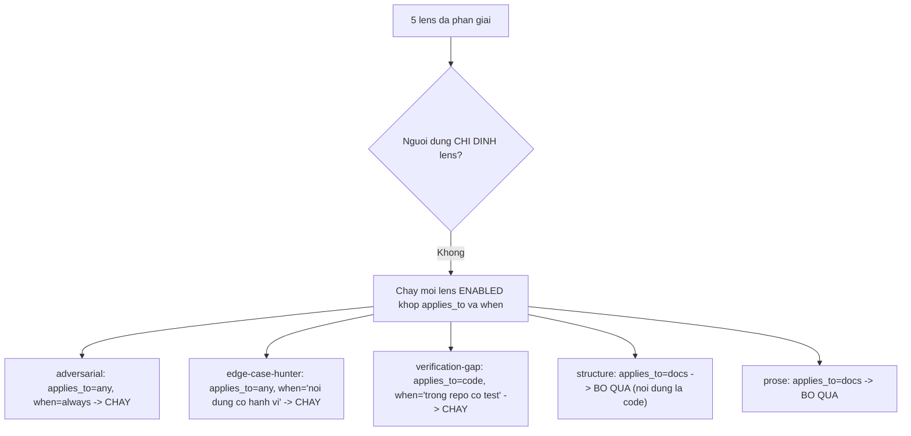
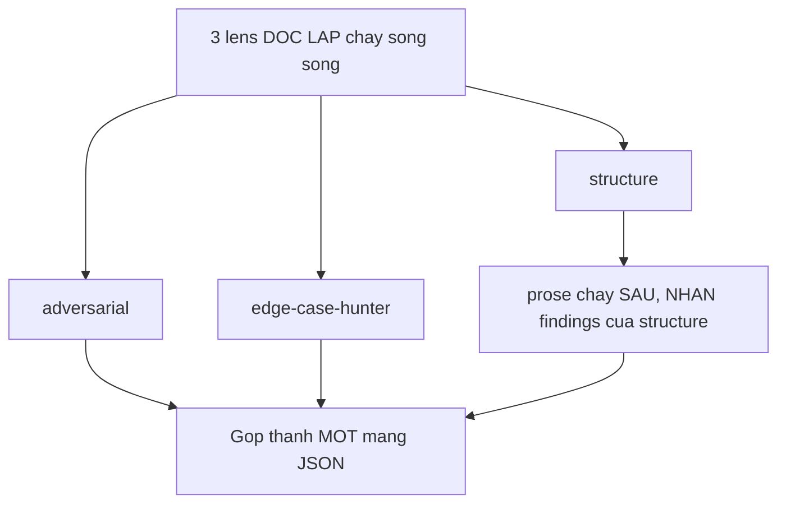
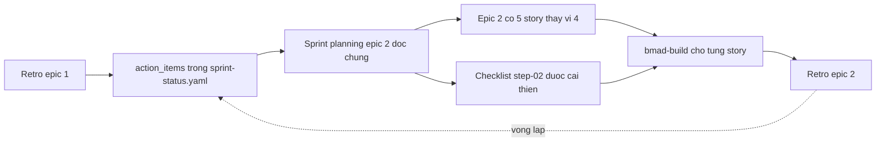

# 07 — Review và Retrospective

> [← Mục lục demo](./index.md) · Trước: [06 — Pha 4](./06-pha4-thuc-thi.md) · Tiếp: [08 — Bản đồ luồng dữ liệu](./08-ban-do-luong-du-lieu.md)

---

# Phần A — `bmad-review` độc lập

## A.1 Khi nào dùng

`bmad-build` đã có **review built-in** ở bước 04 (3 lớp). `bmad-review` gọi độc lập là **lớp bổ sung**, dùng khi:

| Tình huống | Vì sao |
| --- | --- |
| Bạn muốn LLM khác soi lại | Khuyến nghị chính thức: *"fresh context, different LLM recommended"* |
| Review một tài liệu (PRD, spec, epic) | Build không review tài liệu |
| Review một diff không đi qua build | Thay đổi thủ công, hotfix |
| Muốn một lens cụ thể | Ví dụ chỉ `verification-gap` |

## A.2 Ví dụ 1 — Review một diff

**Cửa sổ ngữ cảnh mới:**

```
> bmad-review
```

```bash
uv run .../resolve_customization.py --skill .../bmad-review --key workflow
```

```
🔍 Nội dung để review là gì? (diff, branch, file, spec, tài liệu...)
```

🛑 **HALT**

```
> thay đổi chưa commit
```

```bash
$ git status --porcelain
$ git diff
```

```
🔍 Kế hoạch: nội dung là **code** (diff). Chạy 3 lens:
   `adversarial`, `edge-case-hunter`, `verification-gap`.
   Không lens nào có `after`, nên cả ba chạy song song.
```

### Chọn lens — cơ chế



🤖🤖🤖 **Ba subagent song song**, mỗi cái nhận:

- `instruction` của lens với `{skill-root}` đã phân giải tuyệt đối
- Diff
- Chỉ thị review thường trực từ `review_guidance`
- Ràng buộc: *"Return ONLY your findings — no other output."*

### Đầu ra

````
🔍 Review — 3 lens, 14 finding

```json
[
  {
    "lens": "adversarial",
    "location": "src/db/repository.ts:23-31",
    "trigger_condition": "appendTransaction không kiểm tra kết quả trả về của Dexie .add() — nếu quota IndexedDB đầy, .add() ném QuotaExceededError nhưng không có catch nào",
    "guard_snippet": "try/catch quanh .add(), map QuotaExceededError sang lỗi nghiệp vụ có thể hiển thị cho người dùng",
    "potential_consequence": "Nhân viên kho bấm lưu, thấy spinner, rồi app crash. Giao dịch mất. Đây chính là kịch bản NFR-04 muốn tránh"
  },
  {
    "lens": "adversarial",
    "location": "src/db/schema.ts:12",
    "trigger_condition": "Index chỉ có trên `ma_hang`. Story 1-3 sẽ cần sắp xếp theo `thoi_diem_ghi`, và story 3-x cần lọc theo `thoi_diem_dong_bo IS NULL`",
    "guard_snippet": "Thêm compound index [ma_hang+thoi_diem_ghi] và index trên thoi_diem_dong_bo ngay bây giờ — đổi schema Dexie sau cần version bump và migration",
    "potential_consequence": "Story 1-3 và 3-1 phải bump schema version, viết migration, và test migration — công việc lẽ ra tránh được"
  },
  {
    "lens": "adversarial",
    "location": "src/db/repository.ts — toàn file",
    "trigger_condition": "Không có hàm nào đọc giao dịch chưa đồng bộ. FR-10 yêu cầu màn hình tồn kho phân biệt đã/chưa đồng bộ",
    "guard_snippet": "Thêm getUnsyncedTransactions() vào cùng story, hoặc ghi rõ nó thuộc story 3-1",
    "potential_consequence": "FR-10 không có tầng nào chịu trách nhiệm — dễ rơi giữa hai story"
  },
  {
    "lens": "edge-case-hunter",
    "location": "src/db/repository.ts:23",
    "trigger_condition": "Hai lần gọi appendTransaction đồng thời với cùng id (người dùng bấm nút hai lần nhanh)",
    "guard_snippet": "Dexie .add() với primary key trùng ném ConstraintError — cần catch và coi là thành công (idempotent theo INV-05)",
    "potential_consequence": "Người dùng thấy lỗi khi thực tế giao dịch đã lưu thành công"
  },
  {
    "lens": "edge-case-hunter",
    "location": "src/db/repository.ts:38",
    "trigger_condition": "getTransactionsByItem với ma_hang không tồn tại",
    "guard_snippet": "Trả mảng rỗng, không ném — hiện tại chưa rõ hành vi",
    "potential_consequence": "Story 1-3 tính tồn kho cho mã hàng chưa có giao dịch nào sẽ crash thay vì trả 0"
  },
  {
    "lens": "verification-gap",
    "gap_shape": "untested-error-path",
    "consumer": "nhân viên kho",
    "evidence": "repository.test.ts có 4 test, tất cả đều happy path. Không có test nào cho QuotaExceededError, ConstraintError, hay ma_hang không tồn tại",
    "location": "src/__tests__/repository.test.ts",
    "trigger_condition": "Mọi đường lỗi của repository đều không có test",
    "guard_snippet": "Thêm 3 test dùng fake-indexeddb với quota giả lập và insert trùng key",
    "potential_consequence": "Đường lỗi thay đổi mà không test nào bắt — và đây là đường mà NFR-04 (không mất dữ liệu) sống hay chết"
  },
  ...
]
```

## Báo cáo

### Adversarial (10 finding)
...

### Edge-Case Hunter (3 finding)
...

### Verification Gap (1 finding)
...

### Chồng lấn giữa lens

`adversarial` và `edge-case-hunter` cùng chỉ vào `repository.ts:23`
(appendTransaction). Đây là **tín hiệu**, không phải trùng lặp — hai
phương pháp độc lập cùng dừng lại ở một chỗ.
````

> Quy tắc: *"Keep every lens's findings — **overlap between lenses is signal, not duplication**; note it in the markdown report rather than deduping."*

## A.3 Ví dụ 2 — Review một tài liệu

```
> bmad-review _bmad-output/planning-artifacts/epics.md
```

```
🔍 Kế hoạch: nội dung là **docs**. Chạy `adversarial`, `edge-case-hunter`,
   `structure`, rồi `prose` (prose chạy TRÊN NỀN findings của structure).
```



`word_metrics.py` chạy trước cho lens biên tập:

```bash
$ uv run .../bmad-review/scripts/word_metrics.py _bmad-output/planning-artifacts/epics.md
```

```json
{
  "total_words": 2847,
  "sections": [
    {"heading": "Epic 1 — Sổ cái giao dịch", "words": 1104},
    {"heading": "Epic 2 — Ghi nhận offline", "words": 892},
    {"heading": "Epic 3 — Đồng bộ và đối soát", "words": 851}
  ]
}
```

## A.4 Ví dụ 3 — Chỉ định một lens

```
> bmad-review lenses=verification-gap
```

```
🔍 Bạn chỉ định lens `verification-gap`. Chạy ĐÚNG lens đó —
   `applies_to` và `when` KHÔNG lọc khi lens được yêu cầu tường minh.
```

> Quy tắc: *"If the user or caller named lenses, run **exactly those only** — `applies_to` and `when` **do not filter** an explicit request."*

---

# Phần B — `bmad-retrospective`

## B.1 Khi nào chạy

Sau khi **mọi story của một epic** đạt `done`.

```bash
$ grep -A5 "epic-1" _bmad-output/implementation-artifacts/sprint-status.yaml
```

```yaml
  epic-1: in-progress
  1-1-mo-hinh-du-lieu-ton-kho: done
  1-2-ghi-giao-dich-vao-kho-cuc-bo: done
  1-3-tinh-ton-kho-tu-chuoi-giao-dich: done
  1-4-giao-dich-dieu-chinh: done
  epic-1-retrospective: optional
```

## B.2 Lệnh

**Cửa sổ ngữ cảnh mới:**

```
> bmad-retrospective
```

## B.3 Thu thập bằng chứng

```
👁️ references/evidence-gathering.md
```

```bash
uv run .../bmad-retrospective/scripts/sprint_status.py \
  --status-file _bmad-output/implementation-artifacts/sprint-status.yaml \
  --epic 1
```

**Đầu ra:**

```json
{
  "epic": "epic-1",
  "epic_status": "in-progress",
  "stories": [
    {"key": "1-1-mo-hinh-du-lieu-ton-kho", "status": "done"},
    {"key": "1-2-ghi-giao-dich-vao-kho-cuc-bo", "status": "done"},
    {"key": "1-3-tinh-ton-kho-tu-chuoi-giao-dich", "status": "done"},
    {"key": "1-4-giao-dich-dieu-chinh", "status": "done"}
  ],
  "all_done": true,
  "retrospective_status": "optional"
}
```

```bash
uv run .../bmad-retrospective/scripts/git_evidence.py \
  --since 7a3f9c2e8b1d4f6a5c9e2b8d7f4a1c6e3b9d5f2a
```

**Đầu ra:**

```json
{
  "commits": 14,
  "files_changed": 19,
  "insertions": 1247,
  "deletions": 183,
  "by_area": {
    "src/domain": {"files": 4, "insertions": 412},
    "src/db": {"files": 3, "insertions": 298},
    "src/__tests__": {"files": 4, "insertions": 421},
    "config": {"files": 3, "insertions": 116}
  },
  "test_to_source_ratio": 0.59
}
```

> **Đây là điểm mấu chốt:** retro dựa trên **bằng chứng từ git và sprint status**, không dựa vào trí nhớ.

Skill cũng đọc mọi spec của epic:

```
👁️ spec-1-1-mo-hinh-du-lieu-ton-kho.md   → Spec Change Log: 1 mục
👁️ spec-1-2-ghi-giao-dich-vao-kho-cuc-bo.md → Spec Change Log: 2 mục
👁️ spec-1-3-tinh-ton-kho-tu-chuoi-giao-dich.md → Spec Change Log: 0 mục
👁️ spec-1-4-giao-dich-dieu-chinh.md      → Spec Change Log: 1 mục
👁️ deferred-work.md                       → 3 mục
```

## B.4 Thảo luận đội

```
👁️ references/team-discussion.md
```

Skill phân giải roster agent và mời góc nhìn:

```bash
uv run .../resolve_config.py --project-root D:/du-an/quan-ly-kho --key agents
```

```
📊 Retrospective Epic 1 — Sổ cái giao dịch

**Bằng chứng:**
  • 4/4 story done
  • 14 commit, 19 file, +1247/−183 dòng
  • Tỷ lệ test/source: 0.59
  • 4 mục Spec Change Log (4 lần loopback bad_spec)
  • 3 mục deferred-work

Mình mời vài góc nhìn vào phòng.

💻 **Amelia (Senior Software Engineer):**
Tỷ lệ test/source 0.59 là lành mạnh cho tầng domain. Nhưng nhìn phân bố:
`src/db` có 298 dòng nguồn và test cho nó nằm chung file với domain. Ba
finding `verification-gap` trong epic này đều chỉ vào đường lỗi của
repository. Đó là mẫu hình, không phải trùng hợp.

🏗️ **Winston (System Architect):**
Bốn lần loopback `bad_spec` — cả bốn đều là **spec thiếu ràng buộc mà
spine đã nêu**. INV-03 ở story 1-1, INV-05 ở story 1-2, INV-02 ở story
1-3. Spine đúng, nhưng nó không tự động chảy vào spec. Đó là khoảng
trống trong bước lập kế hoạch, không phải khoảng trống trong kiến trúc.

📋 **John (Product Manager):**
Ba mục deferred-work. Đọc kỹ thì hai trong ba là cùng một thứ: FR-10
(tồn khả dụng phân biệt trạng thái đồng bộ) không có tầng nào nhận. Nó
rơi giữa epic 1 và epic 3.
```

## B.5 Verdict chấp nhận

```
👁️ references/acceptance-verdict.md
```

```
📊 **Verdict: ACCEPTED WITH FOLLOW-UP**

Đối chiếu Epic 1 với tiêu chí kết thúc đã ghi trong epics.md:

  ✓ Ghi được 4 loại giao dịch          — có, 4/4 loại có test
  ✓ Tính được tồn kho                  — có, story 1-3
  ✓ Test phủ mọi loại giao dịch        — có
  ⚠ Test phủ mọi biên                  — MỘT PHẦN: biên của domain phủ
                                          đủ, biên của db (quota, constraint)
                                          không phủ

Yêu cầu PRD được phủ: FR-02 ✓, FR-03 ✓, FR-04 ✓, FR-05 ✓, FR-06 ✓
Bất biến được thực thi: INV-01 ✓, INV-02 ✓, INV-03 ✓, INV-07 ✓ (bằng lint)

**Follow-up bắt buộc trước khi epic 2 bắt đầu:**
Đường lỗi của `src/db/repository.ts` không có test. Đây là tầng mà
NFR-04 (không mất dữ liệu) sống hay chết.
```

## B.6 Tạo phẩm

### 📄 `_bmad-output/implementation-artifacts/retrospective-epic-1.md`

```markdown
---
epic: 1
epic_name: Sổ cái giao dịch
date: 2026-08-14
verdict: ACCEPTED_WITH_FOLLOWUP
---

# Retrospective — Epic 1: Sổ cái giao dịch

## Bằng chứng

| Chỉ số | Giá trị | Nguồn |
| --- | --- | --- |
| Story hoàn thành | 4/4 | `sprint_status.py` |
| Commit | 14 | `git_evidence.py` |
| File thay đổi | 19 | `git_evidence.py` |
| Dòng thêm/xóa | +1247 / −183 | `git_evidence.py` |
| Tỷ lệ test/source | 0.59 | `git_evidence.py` |
| Loopback `bad_spec` | 4 | Spec Change Log của 4 spec |
| Mục deferred | 3 | `deferred-work.md` |

## Verdict

**ACCEPTED WITH FOLLOW-UP**

Mọi yêu cầu PRD của epic (FR-02 đến FR-06) đã được phủ và kiểm chứng.
Bốn bất biến kiến trúc (INV-01, INV-02, INV-03, INV-07) được thực thi,
trong đó INV-07 được thực thi tự động bằng lint.

Một tiêu chí kết thúc chưa đạt hoàn toàn: "test phủ mọi biên". Biên của
tầng domain phủ đủ; biên của tầng db (quota đầy, insert trùng key, mã
hàng không tồn tại) không có test nào.

## Điều đã làm tốt

**1. Bất biến được thực thi tự động, không dựa vào kỷ luật.**
INV-07 (`src/domain` không import I/O) được ép bằng quy tắc ESLint từ
story 1-1. Không lần nào bị vi phạm trong 4 story. So sánh: các bất
biến chỉ nằm trong tài liệu (INV-05 idempotent) bị bỏ sót và phải
loopback mới bắt được.

→ *Bất biến nào ép được bằng công cụ thì ép ngay ở story đầu tiên.*

**2. Cache epic context tiết kiệm đáng kể.**
`epic-1-context.md` (~800 từ) thay cho việc nạp lại `prd.md` (3.184 từ)
+ `ARCHITECTURE-SPINE.md` + `epics.md` ở mỗi story. Ba story sau tiết
kiệm ~12.000 từ ngữ cảnh.

**3. Vòng review bắt được lỗi SPEC, không chỉ lỗi mã.**
Cả 4 loopback đều là `bad_spec`, không phải `patch`. Nghĩa là review
đang làm đúng việc: tìm gốc rễ chứ không vá triệu chứng.

## Điều cần sửa

**1. Ràng buộc từ spine không tự chảy vào spec.**

Bốn lần loopback, cả bốn đều vì spec thiếu một ràng buộc mà
`ARCHITECTURE-SPINE.md` đã ghi rõ:

| Story | Bất biến bị bỏ sót | Phát hiện ở |
| --- | --- | --- |
| 1-1 | INV-03 (UUIDv7 client) | Review vòng 1 |
| 1-2 | INV-05 (đồng bộ idempotent) | Review vòng 1 |
| 1-3 | INV-02 (cache phải tái tính được) | Review vòng 1 |
| 1-4 | INV-01 (không có UPDATE) | Review vòng 1 |

Spine đúng. Vấn đề là bước lập kế hoạch (step-02) không có checklist đối
chiếu spec với spine.

**2. Test tập trung ở domain, bỏ trống db.**

Ba finding `verification-gap` của epic đều chỉ vào đường lỗi của
`repository.ts`. Tầng này là nơi NFR-04 (không mất dữ liệu) được thực
thi, và nó không có test cho: quota đầy, insert trùng key, mã hàng
không tồn tại.

**3. FR-10 rơi giữa hai epic.**

FR-10 (tồn khả dụng phân biệt đã/chưa đồng bộ) không được gán cho epic
nào. Epic 1 làm sổ cái, epic 3 làm đồng bộ — nhưng màn hình hiển thị
phân biệt thuộc epic 2. Hai trong ba mục deferred-work là biểu hiện của
khoảng trống này.

## Action items

| # | Hành động | Chủ | Trạng thái |
| --- | --- | --- | --- |
| 1 | Thêm mục "Đối chiếu Spine" vào checklist tự-soi của step-02, liệt kê bất biến nào áp dụng cho story | Thảo | open |
| 2 | Viết 3 test đường lỗi cho `repository.ts` (quota, constraint, mã không tồn tại) dùng `fake-indexeddb` | Thảo | open |
| 3 | Gán FR-10 vào epic 2 và tạo story `2-5-hien-thi-trang-thai-dong-bo`; cập nhật `epics.md` và `sprint-status.yaml` | Thảo | open |
| 4 | Đưa 2 mục deferred-work liên quan FR-10 vào story mới ở action item 3, xóa khỏi `deferred-work.md` | Thảo | open |

## Khuyến nghị cho Epic 2

Action item 1 và 2 nên xong **trước** khi bắt đầu story 2-1. Action item
3 và 4 làm cùng lúc với sprint planning của epic 2.
```

### ✏️ `sprint-status.yaml` được cập nhật

```diff
-last_updated: 08-14-2026 09:12
+last_updated: 08-14-2026 10:47

 development_status:
-  epic-1: in-progress
+  epic-1: done
   1-1-mo-hinh-du-lieu-ton-kho: done
   1-2-ghi-giao-dich-vao-kho-cuc-bo: done
   1-3-tinh-ton-kho-tu-chuoi-giao-dich: done
   1-4-giao-dich-dieu-chinh: done
-  epic-1-retrospective: optional
+  epic-1-retrospective: done
+
+action_items:
+  - epic: 1
+    action: "Thêm mục Đối chiếu Spine vào checklist tự-soi của step-02"
+    owner: "Thảo"
+    status: open
+  - epic: 1
+    action: "Viết 3 test đường lỗi cho repository.ts (quota, constraint, mã không tồn tại)"
+    owner: "Thảo"
+    status: open
+  - epic: 1
+    action: "Gán FR-10 vào epic 2, tạo story 2-5-hien-thi-trang-thai-dong-bo"
+    owner: "Thảo"
+    status: open
+  - epic: 1
+    action: "Đưa 2 mục deferred-work liên quan FR-10 vào story 2-5, xóa khỏi deferred-work.md"
+    owner: "Thảo"
+    status: open
```

## B.7 Action item quay lại vòng lặp

Ở **sprint planning của epic 2**, `bmad-sprint-planning` đọc `action_items`:

```
📊 Có 4 action item còn `open` từ retro epic 1.

Hai cái là điều kiện tiên quyết cho epic 2:
  #1 Checklist Đối chiếu Spine → ảnh hưởng mọi story của epic 2
  #2 Test đường lỗi repository → ảnh hưởng story 2-4 (offline)

Hai cái thay đổi phạm vi epic 2:
  #3 Tạo story 2-5 mới cho FR-10
  #4 Gộp deferred-work vào story 2-5

Xử lý cả bốn trước khi sinh sprint status cho epic 2?
```

🛑 **HALT**



Đây là cách bài học **thực sự** quay lại vòng lặp, không chỉ nằm trong một file không ai đọc.

---

## Tóm tắt

| | `bmad-review` (độc lập) | `bmad-retrospective` |
| --- | --- | --- |
| Script | `resolve_customization.py`, `word_metrics.py` | `resolve_customization.py`, `resolve_config.py`, `sprint_status.py`, `git_evidence.py` |
| 👁️ Đọc | diff hoặc file nội dung, 7 file `references/` | `sprint-status.yaml`, 4 spec, `deferred-work.md`, `epics.md`, git log |
| 📄 Ghi | findings (chat hoặc `report_path`) | `retrospective-epic-1.md`, ✏️ `sprint-status.yaml` |
| 🤖 Subagent | 3–5 (một cho mỗi lens) | 0–3 (góc nhìn agent) |
| 🛑 Điểm dừng | 1–2 | ~4 |
| Thời gian | ~10 phút | ~25 phút |

---

**Tiếp:** [08 — Bản đồ luồng dữ liệu](./08-ban-do-luong-du-lieu.md) · [← Mục lục demo](./index.md)
