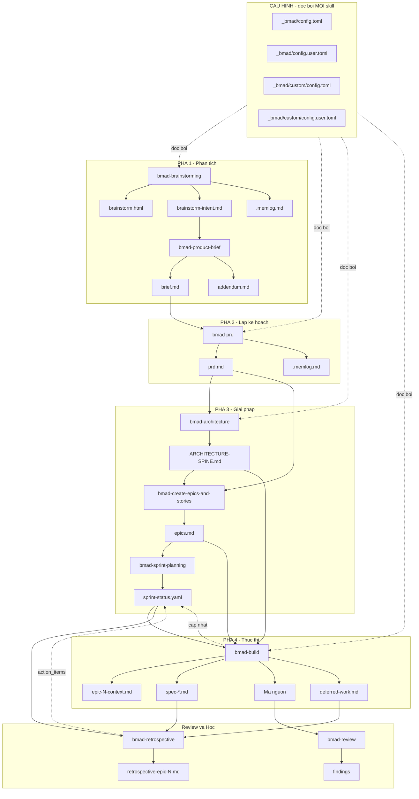
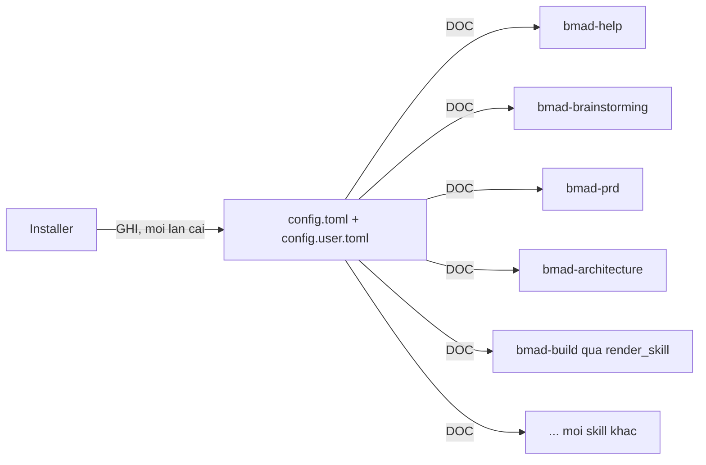
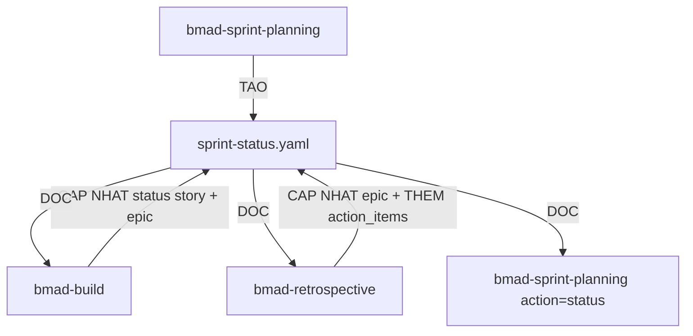
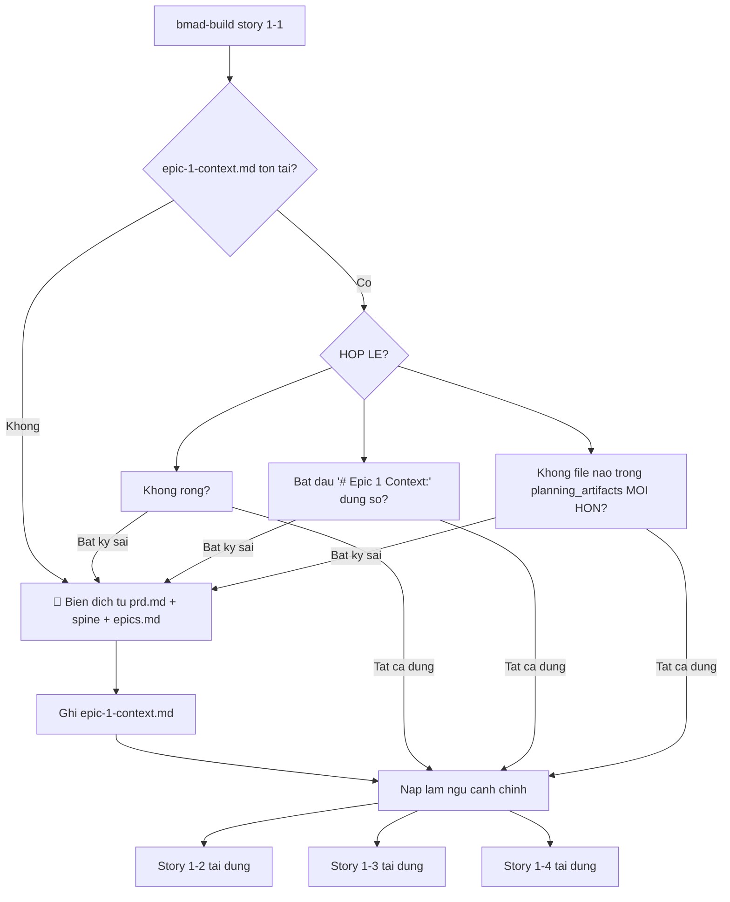
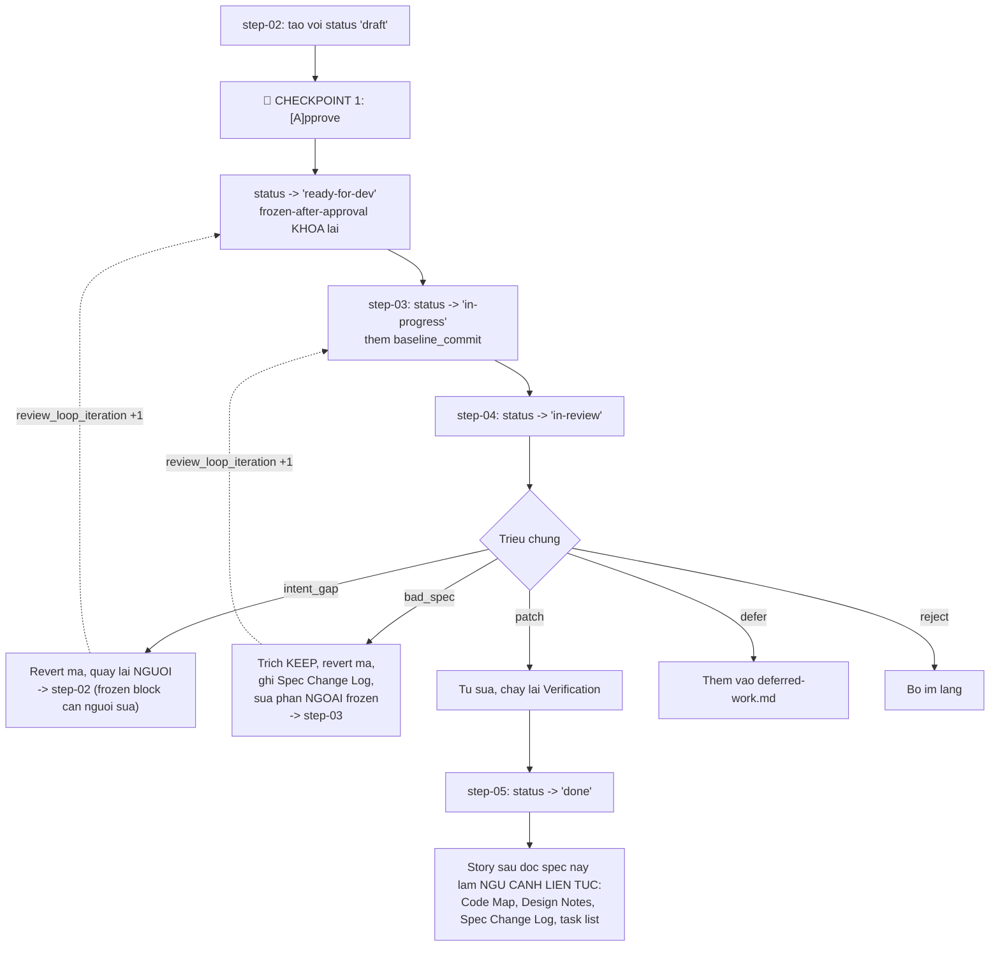
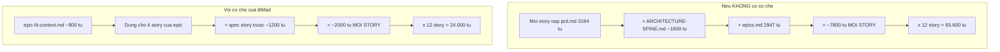
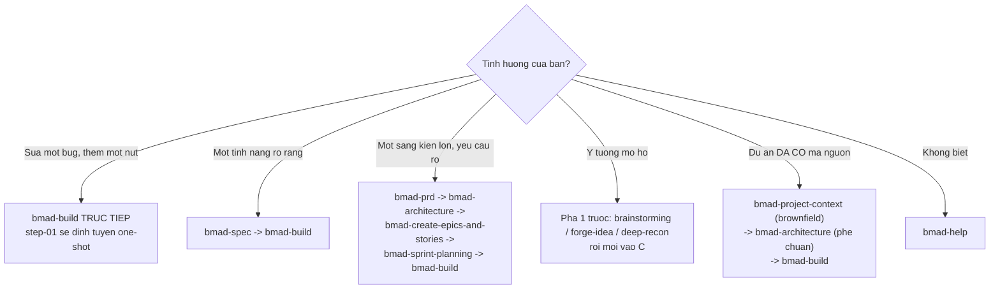

# 08 — Bản đồ luồng dữ liệu

> [← Mục lục demo](./index.md) · Trước: [07 — Review & Retro](./07-review-va-retro.md)
>
> Tổng kết: **ai đọc gì, ai ghi gì, lệnh nào chạy khi nào.**

---

## 1. Bản đồ tổng thể



---

## 2. Bảng: mỗi skill đọc gì, ghi gì

| Skill | 👁️ Đọc | 📄 Ghi | Script chạy |
| --- | --- | --- | --- |
| `bmad-help` | `bmad-help.csv`, cấu hình, quét tạo phẩm, `project_knowledge` | *(không)* | `resolve_config` |
| `bmad-brainstorming` | `brain-methods.csv`, `references/mode-*.md`, `converge.md`, `finalize.md` | `.memlog.md`, `brainstorm.html`, `brainstorm-intent.md` | `resolve_customization`, `resolve_config`, `brain.py`, `memlog.py` |
| `bmad-product-brief` | `brainstorm-intent.md`, `brief-template.md` | `brief.md`, `addendum.md` | `resolve_customization`, `resolve_config` |
| `bmad-prd` | `brief.md`, `addendum.md`, `prd-template.md` | `prd.md`, `addendum.md`, `.memlog.md` | `resolve_customization`, `resolve_config`, `memlog.py` |
| `bmad-advanced-elicitation` | `methods.csv`, roster agent | *(sửa nội dung tại chỗ)* | `resolve_customization`, `pick_methods.py`, `resolve_config --key agents` |
| `bmad-review` | nội dung, 7 file `references/`, `style_guide` | findings (chat hoặc `report_path`) | `resolve_customization`, `word_metrics.py` |
| `bmad-architecture` | `prd.md`, `brief.md`, `package.json`, `src/`, `spine-template.md` | `ARCHITECTURE-SPINE.md` | `resolve_customization`, `resolve_config`, `lint_spine.py` |
| `bmad-create-epics-and-stories` | `prd.md`, `ARCHITECTURE-SPINE.md`, 4 file `steps/`, `epics-template.md` | `epics.md` | `resolve_customization`, `resolve_config` |
| `bmad-sprint-planning` | `epics.md`, `references/readiness-gate.md`, `generate-tracking.md` | `sprint-status.yaml` | `resolve_customization`, `resolve_config`, `sprint_plan.py generate` |
| `bmad-build` | `workflow.md` + 5 bước (snapshot), `epics.md`, `sprint-status.yaml`, `epic-N-context.md`, `ARCHITECTURE-SPINE.md`, `spec-template.md` | `epic-N-context.md`, `spec-*.md`, mã nguồn, ✏️ `sprint-status.yaml`, `deferred-work.md` | `render_skill.py` |
| `bmad-retrospective` | `sprint-status.yaml`, mọi `spec-*.md` của epic, `deferred-work.md`, `epics.md`, git log | `retrospective-epic-N.md`, ✏️ `sprint-status.yaml` | `resolve_customization`, `resolve_config`, `sprint_status.py`, `git_evidence.py` |

---

## 3. Bốn tệp trung tâm và ai chạm vào chúng

### 3.1 `_bmad/config.toml` + `config.user.toml`



**Ai ghi:** chỉ installer. **Ai đọc:** mọi skill.

### 3.2 `sprint-status.yaml`



**Ba skill ghi vào nó.** Đây là **trạng thái chung** của dự án.

Quy tắc cập nhật của `bmad-build` (`sync-sprint-status.md`):

| Bước | Nội dung |
| --- | --- |
| Tiền điều kiện | Bỏ qua nếu `story_key` chưa đặt HOẶC file không tồn tại |
| Tìm khóa | Khớp `{epic_num}-{story_num}` bằng **so sánh số học** — `1-1` không va chạm `1-10` |
| **Idempotency** | Nếu đã ở `target_status` **hoặc trạng thái muộn hơn** ⇒ không ghi. **Không bao giờ lùi trạng thái** |
| Epic lift | Chỉ khi `target_status = in-progress`: nếu `epic-N` đang `backlog` ⇒ đặt `in-progress` |
| Bảo toàn | Lưu file **giữ NGUYÊN mọi comment và cấu trúc**, kể cả STATUS DEFINITIONS và WORKFLOW NOTES |

### 3.3 `epic-N-context.md`



**Cache invalidation dựa trên mtime** — nếu bạn sửa `prd.md` giữa chừng, cache tự động bị vô hiệu và biên dịch lại.

### 3.4 `spec-*.md`



**Frontmatter `status` là bộ định tuyến của `bmad-build`:**

| `status` | Gọi `bmad-build` với file này ⇒ |
| --- | --- |
| `draft` | EARLY EXIT → step-02 (tiếp tục lập kế hoạch) |
| `ready-for-dev` | EARLY EXIT → step-03 (thực thi) |
| `in-progress` | EARLY EXIT → step-03 (tiếp tục thực thi) |
| `in-review` | EARLY EXIT → step-04 (tiếp tục review) |
| `done` | Nạp làm ngữ cảnh, **không** resume |

> Nghĩa là: bạn có thể ngắt bất cứ lúc nào, mở phiên mới, gọi `bmad-build <spec-file>`, và nó tiếp tục **đúng chỗ**.

---

## 4. Bảng: mọi lệnh script trong demo

### 4.1 Script dùng chung

| Lệnh | Chạy bởi | Số lần trong demo |
| --- | --- | --- |
| `resolve_config.py --project-root <R>` | mọi skill | ~12 |
| `resolve_config.py --project-root <R> --key core` | brainstorming, forge-idea | ~4 |
| `resolve_config.py --project-root <R> --key agents` | advanced-elicitation, retrospective | ~2 |
| `resolve_customization.py --skill <S> --key workflow` | mọi skill có `customize.toml` | ~14 |
| `render_skill.py --project-root <R> --skill <S>` | bmad-build | 4 (một lần mỗi story) |
| `memlog.py init --workspace <W> --field ...` | brainstorming, prd | 2 |
| `memlog.py append --workspace <W> --type ... --text ...` | brainstorming, prd | ~45 |
| `memlog.py set --workspace <W> --key status --value complete` | brainstorming, prd | 2 |

### 4.2 Script riêng của skill

| Lệnh | Skill | Vai trò |
| --- | --- | --- |
| `brain.py --file <csv> categories` | brainstorming | Bản đồ nhóm kỹ thuật |
| `brain.py --file <csv> list --category X` | brainstorming | Chỉ mục nhóm |
| `brain.py --file <csv> html --out <path>` | brainstorming | Sinh trang soạn phiên |
| `pick_methods.py --file <csv> categories` | advanced-elicitation | Bản đồ nhóm phương pháp |
| `pick_methods.py --file <csv> list --category X --category Y` | advanced-elicitation | Chỉ mục |
| `pick_methods.py --file <csv> show "<tên>"` | advanced-elicitation | Chi tiết phương pháp |
| `word_metrics.py <file.md>` | review | Đếm từ tổng + theo mục |
| `lint_spine.py <spine.md>` | architecture | Lint spine |
| `sprint_plan.py generate --epic-file ... --status-file ...` | sprint-planning | Sinh tracking |
| `sprint_plan.py status --status-file ... --stale-days N` | sprint-planning | Xem trạng thái |
| `sprint_plan.py validate --status-file ...` | sprint-planning | Kiểm tra file |
| `sprint_status.py --status-file ... --epic N` | retrospective | Trạng thái epic |
| `git_evidence.py --since <commit>` | retrospective | Bằng chứng từ git |

---

## 5. Điểm dừng bắt buộc — toàn bộ demo

| Bước | Số 🛑 | Nội dung điển hình |
| --- | --- | --- |
| Cài đặt | 12 | Thư mục, module, kênh, IDE, 9 câu cấu hình |
| `bmad-help` | 1 | Có chạy skill được đề xuất không |
| `bmad-brainstorming` | ~8 | Chủ đề+mục tiêu, lập trường+kỹ thuật, chuyển sang hội tụ, chọn tạo phẩm |
| `bmad-product-brief` | ~10 | Xác nhận ngữ cảnh, từng mục của brief |
| `bmad-prd` | ~14 | Chọn ý định, ~6 chủ đề discovery, elicitation menu, chấp nhận findings |
| `bmad-architecture` | ~9 | Xác nhận quyết định gốc, ~7 đánh đổi công nghệ |
| `bmad-create-epics-and-stories` | ~7 | Xác nhận tiền điều kiện, cách chia epic, từng story |
| `bmad-sprint-planning` | ~3 | Sửa FAIL/CONCERNS, xác nhận sinh tracking |
| `bmad-build` (mỗi story) | 3 | Làm rõ ý định, CHECKPOINT 1, sửa frozen block |
| `bmad-review` | 1–2 | Nội dung để review, chấp nhận findings |
| `bmad-retrospective` | ~4 | Xác nhận bằng chứng, verdict, action items |

**Tổng cho demo đầy đủ (4 story của epic 1): ~85 điểm dừng.**

Đây **không phải** phí tổn — đó là **nơi bạn giữ quyền quyết định**.

---

## 6. Ngân sách ngữ cảnh — cơ chế tiết kiệm



**Bốn cơ chế:**

| Cơ chế | Tiết kiệm |
| --- | --- |
| **Cache epic context** | Thay 7.800 từ bằng 800 từ, dùng lại cho mọi story trong epic |
| **Nạp bước just-in-time** | Chỉ nạp file bước hiện tại, không nạp cả 5 |
| **Subagent với ngữ cảnh cô lập** | Điều tra codebase, biên dịch context, review — mỗi cái ngữ cảnh riêng, chỉ trả tóm tắt |
| **Catalog phục vụ qua script** | `methods.csv` và `brain-methods.csv` không bao giờ vào ngữ cảnh nguyên khối |
| **Spec 900–1600 token** | Giới hạn kích thước đơn vị công việc |

---

## 7. Bảng: tạo phẩm cuối cùng

```
D:/du-an/quan-ly-kho/
│
├── _bmad-output/
│   ├── brainstorming/
│   │   └── brainstorm-quan-ly-kho-2026-08-11/
│   │       ├── .memlog.md                          # 47 mục, chỉ-nối-thêm
│   │       ├── brainstorm.html                     # vật kỷ niệm
│   │       └── brainstorm-intent.md                # input cho brief
│   │
│   ├── planning-artifacts/
│   │   ├── brief.md                                # tầm nhìn + lý do
│   │   ├── addendum.md                             # chi tiết bổ trợ
│   │   ├── prd.md                                  # 12 FR + 4 NFR
│   │   ├── .memlog.md                           # nhật ký ra quyết định
│   │   ├── ARCHITECTURE-SPINE.md                   # 9 bất biến + 7 quyết định
│   │   └── epics.md                                # 3 epic, 12 story
│   │
│   └── implementation-artifacts/
│       ├── sprint-status.yaml                      # trạng thái + action items
│       ├── epic-1-context.md                       # cache ngữ cảnh
│       ├── spec-1-1-mo-hinh-du-lieu-ton-kho.md
│       ├── spec-1-2-ghi-giao-dich-vao-kho-cuc-bo.md
│       ├── spec-1-3-tinh-ton-kho-tu-chuoi-giao-dich.md
│       ├── spec-1-4-giao-dich-dieu-chinh.md
│       ├── deferred-work.md                        # việc hoãn có bằng chứng
│       └── retrospective-epic-1.md                 # bài học + action items
│
├── src/
│   ├── domain/                                     # logic thuần (INV-07)
│   │   ├── transaction.ts
│   │   ├── reasons.ts
│   │   ├── inventory.ts
│   │   └── correction.ts
│   ├── db/
│   │   ├── schema.ts
│   │   └── repository.ts
│   └── __tests__/
│       ├── transaction.test.ts
│       ├── reasons.test.ts
│       ├── inventory.test.ts
│       ├── correction.test.ts
│       └── repository.test.ts
│
├── eslint.config.js                                # thực thi INV-07
├── tsconfig.json
└── package.json
```

---

## 8. Ba điều rút ra từ demo

### 8.1 Tài liệu không phải phí tổn — nó là ngữ cảnh

Mỗi tạo phẩm được **đọc bởi bước sau**:

| Tạo phẩm | Ai đọc nó |
| --- | --- |
| `brainstorm-intent.md` | `bmad-product-brief` |
| `brief.md` | `bmad-prd` |
| `prd.md` | `bmad-architecture`, `bmad-create-epics-and-stories`, cache epic |
| `ARCHITECTURE-SPINE.md` | `bmad-create-epics-and-stories`, cache epic, mọi spec |
| `epics.md` | `bmad-sprint-planning`, `bmad-build` |
| `sprint-status.yaml` | `bmad-build`, `bmad-retrospective` |
| `spec-*.md` | story sau của cùng epic, `bmad-retrospective` |
| `retrospective-*.md` | sprint planning của epic sau |

Không có tài liệu nào viết ra rồi bỏ đó.

### 8.2 Điểm dừng là nơi giá trị được tạo ra

Bốn ví dụ từ demo:

| Điểm dừng | Điều nó ngăn được |
| --- | --- |
| PRD hỏi "nếu đếm 98 nhưng phiếu ghi 100 thì ghi số nào?" | Xây một hệ thống tái tạo đúng nguồn gốc sai số hiện tại |
| Pre-mortem lộ 5 yêu cầu thiếu | Ship rồi mới phát hiện không có chính sách xung đột đồng bộ |
| Cổng readiness FAIL story 3-2 | Thực thi một story mà AC không đo được |
| Review loopback `bad_spec` ×4 | Bốn lần mã đúng-với-spec nhưng sai-với-kiến-trúc |

### 8.3 Tất định hóa là thứ làm nó đáng tin

| Việc | Ai làm | Vì sao |
| --- | --- | --- |
| Hợp nhất 4 lớp TOML | `config_utils.py` | LLM không đáng tin với merge có quy tắc |
| Tính `generation_hash` | `render_skill.py` | Phải chính xác tuyệt đối |
| Cập nhật `sprint-status.yaml` | `sync-sprint-status.md` + so sánh số học | `1-1` không được va chạm `1-10` |
| Đếm từ | `word_metrics.py` | Nền tảng cho mọi ước lượng "saves ~150 words" |
| Bằng chứng git | `git_evidence.py` | Retro dựa trên số liệu, không trí nhớ |
| Ghi memlog | `memlog.py` | Nguyên tử, không mất khi crash |
| **Phán đoán** | **LLM** | Script không mã hóa được |

---

## 9. Bạn có thể bắt đầu ở đâu

Demo này đi **đủ 4 pha** vì dự án là greenfield với yêu cầu mơ hồ. Bạn không phải làm vậy.



> Demo cho trường hợp **E (brownfield)** nằm ở [`demo-brownfield/`](../demo-brownfield/index.md).

---

## 10. Tài liệu liên quan

| Muốn hiểu | Đọc |
| --- | --- |
| Hệ thống làm cái gì | [Đặc tả hệ thống](../tai-lieu-he-thong/01-dac-ta-he-thong.md) |
| Hệ thống hoạt động thế nào | [Thiết kế hệ thống](../tai-lieu-he-thong/02-thiet-ke-he-thong.md) |
| Cài đặt, cấu hình, khắc phục sự cố | [Vận hành hệ thống](../tai-lieu-he-thong/03-van-hanh-he-thong.md) |
| Chi tiết từng skill của module core | [Tài liệu core](../tai-lieu-core/index.md) |
| Chạy tay từng script | [Sổ tay vận hành thủ công](../tai-lieu-core/C1-so-tay-van-hanh-thu-cong.md) |

---

**[← Mục lục demo](./index.md)**
