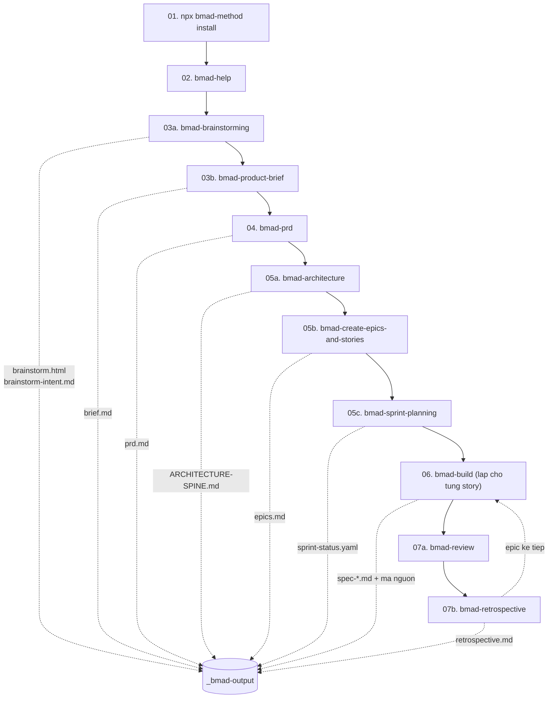
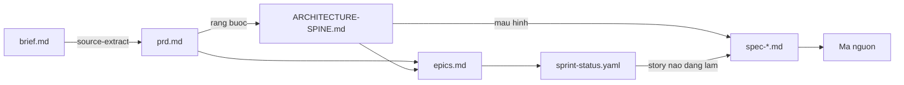

# DEMO — Kịch bản chạy BMAD-METHOD từ đầu đến cuối

> Một ví dụ **cụ thể, tuần tự**: gọi lệnh gì → đọc/ghi file nào → kết quả ra sao.
>
> Mọi nội dung file trong demo này là **minh hoạ dạng mẫu** — được viết theo đúng lược đồ và template thật của BMAD v6.10.0, để bạn hình dung hình dạng dữ liệu ở từng bước.

---

## Dự án demo

| | |
| --- | --- |
| **Tên** | `quan-ly-kho` |
| **Loại** | Greenfield (làm mới từ đầu) |
| **Ngăn xếp** | Node.js + TypeScript + React + PostgreSQL |
| **Bài toán** | Nhân viên kho đang kiểm kê bằng giấy, số liệu lệch, không ai biết tồn kho thật |
| **Công cụ AI** | Claude Code |
| **Ngôn ngữ** | Tiếng Việt (hội thoại + tài liệu) |

> Demo cho **dự án đã có mã nguồn** (brownfield) nằm ở [`demo-brownfield/`](../demo-brownfield/index.md).

---

## Mục lục theo thứ tự chạy

| # | Bước | Tài liệu | Skill dùng | Đầu ra chính |
| --- | --- | --- | --- | --- |
| 00 | Bối cảnh | **[00-boi-canh.md](./00-boi-canh.md)** | — | Hiểu điểm xuất phát |
| 01 | Cài đặt | **[01-cai-dat.md](./01-cai-dat.md)** | `npx bmad-method install` | `_bmad/`, `.claude/skills/` |
| 02 | Định hướng | **[02-dinh-huong.md](./02-dinh-huong.md)** | `bmad-help` | Biết bước kế tiếp |
| 03 | Pha 1 — Phân tích | **[03-pha1-phan-tich.md](./03-pha1-phan-tich.md)** | `bmad-brainstorming`, `bmad-product-brief` | `brainstorm.html`, `brief.md` |
| 04 | Pha 2 — Lập kế hoạch | **[04-pha2-lap-ke-hoach.md](./04-pha2-lap-ke-hoach.md)** | `bmad-prd` | `prd.md` |
| 05 | Pha 3 — Giải pháp | **[05-pha3-giai-phap.md](./05-pha3-giai-phap.md)** | `bmad-architecture`, `bmad-create-epics-and-stories`, `bmad-sprint-planning` | `ARCHITECTURE-SPINE.md`, epics, `sprint-status.yaml` |
| 06 | Pha 4 — Thực thi | **[06-pha4-thuc-thi.md](./06-pha4-thuc-thi.md)** | `bmad-build` | `spec-*.md` + mã nguồn |
| 07 | Review & Retro | **[07-review-va-retro.md](./07-review-va-retro.md)** | `bmad-review`, `bmad-retrospective` | Findings, retro |
| 08 | Bản đồ luồng dữ liệu | **[08-ban-do-luong-du-lieu.md](./08-ban-do-luong-du-lieu.md)** | — | Tổng kết ai đọc gì, ghi gì |

---

## Toàn cảnh luồng chạy



---

## Ba thứ cần nhớ khi đọc demo

### 1. Mọi skill đều chạy cùng ba lệnh khởi động

```bash
# 1. Phân giải tùy biến (3 lớp TOML)
uv run {project-root}/_bmad/scripts/resolve_customization.py --skill {skill-root} --key workflow

# 2. Phân giải cấu hình (4 lớp TOML)
uv run {project-root}/_bmad/scripts/resolve_config.py --project-root {project-root}

# 3. (một số skill) Ghi nhật ký phiên
uv run {project-root}/_bmad/scripts/memlog.py init|append|set --workspace <dir> ...
```

Demo sẽ **hiện đầu ra thật** của các lệnh này ở mỗi bước.

### 2. Tài liệu trước là ngữ cảnh cho bước sau



### 3. Điểm dừng bắt buộc là nơi bạn quyết định

Demo đánh dấu mọi chỗ workflow **HALT và chờ người**:

> 🛑 **HALT** — hệ thống dừng ở đây, chờ bạn trả lời

---

## Quy ước ký hiệu trong demo

| Ký hiệu | Nghĩa |
| --- | --- |
| `$ lệnh` | Lệnh bạn gõ trong terminal |
| `> tên-skill` | Điều bạn gõ trong công cụ AI |
| 📄 | File được **tạo mới** |
| ✏️ | File được **sửa** |
| 👁️ | File được **đọc** |
| 🛑 | Điểm dừng chờ người |
| 🤖 | Subagent được sinh ra |

---

**Bắt đầu:** [00 — Bối cảnh](./00-boi-canh.md)
