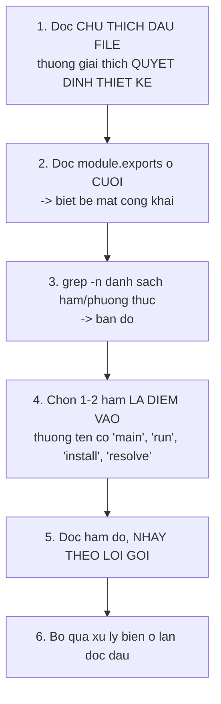

# 01 — Bản đồ và đường đọc

> [← Mục lục](./index.md) · Tiếp: [02 — Tầng phân phối](./02-tang-phan-phoi.md)

---

## 1. Cây thư mục có chú giải

```
BMAD-METHOD/
│
├── tools/                              ← TẦNG PHÂN PHỐI + CHẤT LƯỢNG
│   ├── installer/
│   │   ├── bmad-cli.js          3392B  ⭐ ĐIỂM VÀO — đọc đầu tiên
│   │   ├── commands/
│   │   │   ├── install.js       6435B  ⭐ khai báo cờ CLI
│   │   │   ├── status.js        2023B
│   │   │   └── uninstall.js     6259B
│   │   ├── ui.js               85866B  ⚠️ 2167 dòng — luồng prompt, đọc CÓ MỤC TIÊU
│   │   ├── prompts.js          25624B  ♻️ bọc @clack, mẫu lazy-load
│   │   ├── core/
│   │   │   ├── config.js        2219B  ⭐ đối tượng Config bất biến
│   │   │   ├── install-paths.js 3713B  ⭐ mọi đường dẫn tập trung một chỗ
│   │   │   ├── installer.js    70025B  ⚠️ 1767 dòng — điều phối, đọc theo phương thức
│   │   │   ├── manifest-generator.js 33601B  ⭐ sinh manifest, phân vùng config
│   │   │   ├── manifest.js     15629B
│   │   │   ├── existing-install.js 3445B
│   │   │   ├── legacy-warnings.js 4956B
│   │   │   ├── uv-check.js      7165B
│   │   │   └── wsl-node-check.js 3103B
│   │   ├── modules/
│   │   │   ├── channel-resolver.js   8419B  ♻️ THUẦN — dễ đọc, dễ mượn
│   │   │   ├── version-resolver.js   9002B
│   │   │   ├── channel-plan.js       6844B
│   │   │   ├── external-manager.js  28227B
│   │   │   ├── custom-module-manager.js 36083B
│   │   │   ├── plugin-resolver.js   13847B
│   │   │   ├── official-modules.js  86696B  ⚠️ file lớn nhất repo
│   │   │   ├── git-env.js            1765B
│   │   │   └── module-help-schema.js  650B
│   │   ├── ide/
│   │   │   ├── platform-codes.yaml   8188B  ⭐ ~50 nền tảng, CHỈ DỮ LIỆU
│   │   │   ├── platform-codes.js     2502B
│   │   │   ├── manager.js           11009B
│   │   │   ├── _config-driven.js    37849B  ♻️ MỘT class cho MỌI nền tảng
│   │   │   └── shared/
│   │   │       ├── path-utils.js     8042B
│   │   │       ├── installed-skills.js 1867B
│   │   │       └── skill-manifest.js 2314B
│   │   ├── fs-native.js          2989B  ♻️ NGẮN — đọc ngay, mẫu hay
│   │   ├── file-ops.js           5587B
│   │   ├── project-root.js       8612B
│   │   ├── set-overrides.js     14194B  ⚠️ quyết định thiết kế gây tranh cãi
│   │   ├── list-options.js       8273B
│   │   ├── yaml-format.js        7673B
│   │   ├── message-loader.js     1956B
│   │   ├── cli-utils.js          3711B
│   │   └── install-messages.yaml 1846B
│   │
│   ├── validate-skills.js       24279B  ♻️ registry rule-based
│   ├── validate-file-refs.js    18315B
│   ├── validate-doc-links.js    12876B
│   ├── validate-sidebar-order.js 13575B
│   ├── skill-validator.md       23443B  ⭐ 26 quy tắc — ĐẶC TẢ, không phải mã
│   ├── build-docs.mjs           16402B
│   ├── fix-doc-links.js          9302B
│   ├── format-workflow-md.js     7255B
│   ├── bundle-web-bundles.js     3920B
│   └── migrate-custom-module-paths.js 3659B
│
├── src/                                ← TẦNG RUNTIME + NỘI DUNG
│   ├── scripts/                        ← RUNTIME (Python)
│   │   ├── config_utils.py       119   ⭐⭐ ĐỌC ĐẦU TIÊN trong Python
│   │   ├── resolve_config.py      74
│   │   ├── resolve_customization.py 99
│   │   ├── render_skill.py       401   ⭐⭐ file quan trọng nhất repo
│   │   ├── memlog.py             224   ♻️ ghi nguyên tử, chỉ-nối-thêm
│   │   └── tests/                      ← KHÔNG cài vào dự án người dùng
│   │
│   ├── core-skills/                    ← NỘI DUNG module core
│   │   ├── module.yaml                 ⭐ hợp đồng cài đặt
│   │   ├── module-help.csv             ⭐ catalog 13 cột
│   │   ├── bmad-*/                     8 skill
│   │   └── v6-shims/                   6 forwarder
│   │
│   └── bmm-skills/                     ← NỘI DUNG module bmm
│       ├── module.yaml                 + roster agent
│       ├── module-help.csv
│       ├── agents/                     5 persona
│       ├── plan/                       skill pha 1–3
│       ├── ship/                       skill pha 4
│       └── v6-shims/                   13 forwarder
│
├── test/                               ← test cấp hệ thống (Node)
├── docs/                               ← nguồn tài liệu (5 ngôn ngữ)
├── website/                            ← Astro + Starlight
├── web-bundles/                        ← gói cho Gemini Gems / Custom GPTs
├── bmad-modules.yaml                   ⭐ REGISTRY module chính thức
├── .claude-plugin/marketplace.json
└── package.json                        ⭐ scripts = cổng chất lượng
```

---

## 2. Sáu đường đọc

### Đường A — Hiểu tổng thể (4–6 giờ)

```mermaid
graph LR
  A1["package.json<br/>scripts + deps"] --> A2["bmad-modules.yaml<br/>registry"]
  A2 --> A3["src/core-skills/module.yaml<br/>hop dong cai dat"]
  A3 --> A4["tools/installer/bmad-cli.js<br/>diem vao"]
  A4 --> A5["tools/installer/commands/install.js<br/>co CLI"]
  A5 --> A6["tools/installer/core/config.js<br/>doi tuong Config"]
  A6 --> A7["tools/installer/core/install-paths.js<br/>duong dan"]
  A7 --> A8["src/scripts/config_utils.py<br/>thuat toan hop nhat"]
  A8 --> A9["src/scripts/render_skill.py<br/>bo may ket xuat"]
```



| Bước | File | Đọc gì | Thời gian |
| --- | --- | --- | --- |
| 1 | `package.json` | `scripts` (cổng chất lượng), `dependencies` (9 gói runtime) | 10 phút |
| 2 | `bmad-modules.yaml` | Chú thích ở đầu file — nó giải thích mọi trường | 15 phút |
| 3 | `src/core-skills/module.yaml` | Cách một module khai báo câu hỏi cài đặt | 15 phút |
| 4 | `tools/installer/bmad-cli.js` | 87 dòng, đọc hết | 20 phút |
| 5 | `commands/install.js` | Bảng cờ CLI + `action()` | 30 phút |
| 6 | `core/config.js` | 78 dòng — đối tượng bất biến | 15 phút |
| 7 | `core/install-paths.js` | ⭐ Mọi đường dẫn tập trung | 30 phút |
| 8 | `src/scripts/config_utils.py` | ⭐⭐ 119 dòng, đọc **từng dòng** | 45 phút |
| 9 | `src/scripts/render_skill.py` | ⭐⭐ 401 dòng, đọc **từng dòng** | 90 phút |

### Đường B — Xây CLI installer tương tự (8–12 giờ)

```
Đường A
  → tools/installer/prompts.js          (bọc thư viện prompt)
  → tools/installer/fs-native.js        (thay fs-extra)
  → tools/installer/core/installer.js   (điều phối — đọc theo phương thức)
  → tools/installer/core/manifest-generator.js
  → tools/installer/modules/channel-resolver.js
  → tools/installer/ide/_config-driven.js
```

### Đường C — Cơ chế cấu hình nhiều lớp (2–3 giờ)

```
src/scripts/config_utils.py           ⭐⭐ toàn bộ
  → src/scripts/resolve_config.py      (CLI 4 lớp)
  → src/scripts/resolve_customization.py (CLI 3 lớp)
  → tools/installer/core/manifest-generator.js:428-620  (writeCentralConfig)
  → src/core-skills/bmad-review/customize.toml  (ví dụ thực)
```

### Đường D — Cache có kiểm chứng (2–3 giờ)

```
src/scripts/render_skill.py            ⭐⭐ toàn bộ, đọc theo thứ tự:
  1. _load_sources()          (dòng 95-113)
  2. _resolve_replacements()  (dòng 191-231)
  3. _render_sources()        (dòng 233-268)
  4. _verify_existing()       (dòng 270-291)
  5. _publish()               (dòng 293-317)
  6. render()                 (dòng 320-380)  ← ghép lại
```

### Đường E — Hỗ trợ N nền tảng (2 giờ)

```
tools/installer/ide/platform-codes.yaml   ⭐ đọc HẾT — chỉ là dữ liệu
  → tools/installer/ide/platform-codes.js  (loader)
  → tools/installer/ide/manager.js         (điều phối)
  → tools/installer/ide/_config-driven.js  (MỘT class cho MỌI nền tảng)
```

### Đường F — Viết validator (2–3 giờ)

```
tools/skill-validator.md               ⭐ ĐẶC TẢ 26 quy tắc (không phải mã)
  → tools/validate-skills.js           (13 quy tắc tất định)
  → tools/validate-file-refs.js        (kiểm tra tham chiếu)
  → test/test-validate-skills.js       (test của validator)
```

---

## 3. Bốn file phải đọc từng dòng

| File | Dòng | Vì sao |
| --- | --- | --- |
| `src/scripts/config_utils.py` | 119 | Toàn bộ ngữ nghĩa cấu hình của hệ thống nằm ở đây. Đọc thiếu một hàm là hiểu sai cơ chế override |
| `src/scripts/render_skill.py` | 401 | Bộ máy kết xuất — nơi tính tất định được đảm bảo. Mỗi hàm là một quyết định thiết kế |
| `tools/installer/core/install-paths.js` | 138 | Mọi đường dẫn của hệ thống. Đọc nó là biết bố cục `_bmad/` |
| `tools/installer/fs-native.js` | 113 | Ngắn, và chú thích đầu file giải thích một quyết định kiến trúc quan trọng |

---

## 4. Ba file KHÔNG nên đọc tuần tự

| File | Dòng | Đọc thế nào |
| --- | --- | --- |
| `ui.js` | 2.167 | ⚠️ Đọc **có mục tiêu**: tìm `promptInstall()` (dòng 199) làm điểm vào, rồi nhảy theo lời gọi |
| `installer.js` | 1.767 | ⚠️ Đọc **theo phương thức**: `grep -n "^\s*async [a-z_]*(" ` rồi chọn cái cần |
| `official-modules.js` | 2.257 | ⚠️ Chỉ đọc khi thực sự cần. Phần lớn là xử lý biên của từng module |

Lệnh lập bản đồ nhanh:

```bash
# Danh sách phương thức của một file lớn
grep -n "^\s*\(async \)\?[a-zA-Z_]\+\s*(" tools/installer/core/installer.js | grep -v "//" | head -60

# Đọc một phương thức cụ thể
sed -n '219,380p' tools/installer/core/installer.js
```

---

## 5. Bảng: file nào trả lời câu hỏi nào

| Câu hỏi | File |
| --- | --- |
| Cờ CLI nào tồn tại? | `commands/install.js:11-60` |
| `_bmad/` có cấu trúc gì? | `core/install-paths.js:20-46` |
| Cấu hình hợp nhất thế nào? | `src/scripts/config_utils.py:78-119` |
| `config.toml` được sinh ra sao? | `core/manifest-generator.js:428-620` |
| Skill được phát hiện thế nào? | `core/manifest-generator.js:110-195` |
| Module ngoài tải thế nào? | `modules/external-manager.js:211-511` |
| Kênh `stable` phân giải ra sao? | `modules/channel-resolver.js:104-182` |
| Nâng cấp phân loại patch/minor/major ở đâu? | `modules/channel-resolver.js:201-218` |
| Skill copy vào IDE thế nào? | `ide/_config-driven.js:189-470` |
| IDE nào được hỗ trợ? | `ide/platform-codes.yaml` (toàn bộ) |
| Token workflow thay thế thế nào? | `src/scripts/render_skill.py:191-268` |
| Snapshot định danh bằng gì? | `src/scripts/render_skill.py:340-360` |
| File người dùng được bảo toàn ra sao? | `core/installer.js:519-668` |
| Quy tắc validator ở đâu? | `tools/skill-validator.md` (đặc tả) + `tools/validate-skills.js` (mã) |
| `--set` hoạt động thế nào? | `tools/installer/set-overrides.js` |

---

## 6. Lệnh chuẩn bị trước khi đọc

```bash
# Clone và cài (không cần cài BMad vào dự án nào)
git clone https://github.com/bmad-code-org/BMAD-METHOD.git
cd BMAD-METHOD
npm ci

# Chạy thử installer vào thư mục tạm để thấy nó làm gì
node tools/installer/bmad-cli.js install --directory /tmp/thu-bmad

# Xem kết quả
find /tmp/thu-bmad/_bmad -maxdepth 2 -type d
cat /tmp/thu-bmad/_bmad/config.toml

# Chạy validator để thấy đầu ra
node tools/validate-skills.js --json src/core-skills/bmad-review

# Chạy script Python trực tiếp
uv run src/scripts/resolve_config.py --project-root /tmp/thu-bmad
```

> ⭐ **Chạy thử trước khi đọc.** Thấy đầu ra rồi đọc mã sinh ra nó dễ hơn nhiều so với đọc mã rồi tưởng tượng đầu ra.

---

## 7. Cách đọc một file lớn hiệu quả



Ví dụ với `channel-resolver.js`:

```bash
# 1. Chú thích đầu file
sed -n '1,20p' tools/installer/modules/channel-resolver.js

# 2. Bề mặt công khai
sed -n '/^module.exports/,/^};/p' tools/installer/modules/channel-resolver.js

# 3. Bản đồ hàm
grep -n "^function \|^async function " tools/installer/modules/channel-resolver.js

# 4. Điểm vào: resolveChannel (dòng 144)
sed -n '144,182p' tools/installer/modules/channel-resolver.js
```

---

**Tiếp:** [02 — Tầng phân phối](./02-tang-phan-phoi.md) · [← Mục lục](./index.md)
