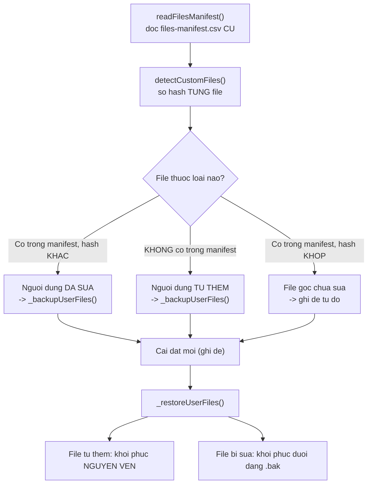

# 02 — Tầng phân phối (Installer Node.js)

> [← Mục lục](./index.md) · Trước: [01](./01-ban-do-va-duong-doc.md) · Tiếp: [03 — Runtime Python](./03-tang-runtime-python.md)

~13.000 dòng CommonJS. Đây là phần lớn nhất của mã nguồn, nhưng **không phải phần quan trọng nhất** — nó chỉ là bộ phân phối.

---

## 1. Điểm vào — `bmad-cli.js` (87 dòng)

📖 `tools/installer/bmad-cli.js`

### 1.1 Cấu trúc

```javascript
#!/usr/bin/env node

const { program } = require('commander');
// ...

// 1. Nâng giới hạn listener của stdin
if (process.stdin?.setMaxListeners) {
  const currentLimit = process.stdin.getMaxListeners();
  process.stdin.setMaxListeners(Math.max(currentLimit, 50));
}

// 2. Kiểm tra cập nhật — BẤT ĐỒNG BỘ, không chặn
checkForUpdate().catch(() => {});

// 3. Xử lý riêng stdin trên Windows
if (process.stdin.isTTY) { /* ... */ }

// 4. NẠP ĐỘNG mọi command từ thư mục commands/
const commandFiles = fs.readdirSync(commandsPath).filter((f) => f.endsWith('.js'));
for (const file of commandFiles) {
  const command = require(path.join(commandsPath, file));
  commands[command.command] = command;
}

// 5. Đăng ký với commander
for (const [name, cmd] of Object.entries(commands)) {
  const command = program.command(name).description(cmd.description);
  for (const option of cmd.options || []) command.option(...option);
  command.action(cmd.action);
}

program.parse(process.argv);
```

### 1.2 Bốn chi tiết đáng học

#### ♻️ a) Nạp command động

```javascript
const commandFiles = fs.readdirSync(commandsPath).filter((file) => file.endsWith('.js'));
```

Thêm một command = thêm một file vào `commands/`. Không sửa `bmad-cli.js`.

**Hợp đồng** mà mỗi file command phải thỏa:

```javascript
module.exports = {
  command: 'install',        // tên lệnh
  description: '...',        // mô tả
  options: [                 // mảng đối số truyền thẳng vào commander .option()
    ['-d, --debug', 'Enable debug output'],
    ['--set <spec>', 'mô tả', (value, prev) => [...(prev || []), value], []],
  ],
  action: async (options) => { /* ... */ },
};
```

#### ♻️ b) Kiểm tra cập nhật không chặn

```javascript
checkForUpdate().catch(() => {
  // Silently ignore errors - version check is best-effort
});
```

Ba đặc tính:

| Đặc tính | Cách làm |
| --- | --- |
| Không chặn | Gọi không `await` |
| Có timeout | `execSync(..., { timeout: 5000 })` |
| Thất bại im lặng | `.catch(() => {})` |

Và định tuyến dist-tag đúng bằng semver, không so chuỗi:

```javascript
// Prereleases (e.g. 6.5.1-next.0) live on the `next` dist-tag; stable
// releases live on `latest`. semver.prerelease() returns null for stable,
// so this correctly routes pre-1.0-next/rc/etc. without string matching.
const tag = semver.prerelease(packageJson.version) ? 'next' : 'latest';
```

#### ⚠️ c) Xử lý riêng cho Windows

```javascript
if (process.platform === 'win32') {
  process.stdin.on('error', () => {
    // Ignore stdin errors - they can occur when the terminal is closing
  });
}
```

#### ⚠️ d) Nâng giới hạn listener

```javascript
// The installer flow uses many sequential @clack/prompts, each adding keypress
// listeners to stdin. Raise the limit to avoid spurious EventEmitter warnings.
```

Chú thích giải thích **vì sao** — nếu không có nó, dòng mã trông tùy tiện.

---

## 2. Đối tượng cấu hình — `core/config.js` (78 dòng)

📖 `tools/installer/core/config.js`

### 2.1 Bất biến hóa

```javascript
class Config {
  constructor({ directory, modules, ides, /* ... */ }) {
    this.directory = directory;
    this.modules = Object.freeze([...modules]);   // ⭐ sao chép + đóng băng
    this.ides = Object.freeze([...ides]);
    // ...
    // channelOptions carry a Map + Set; don't deep-freeze.
    this.channelOptions = channelOptions || null;
    Object.freeze(this);                          // ⭐ đóng băng chính đối tượng
  }
}
```

⭐ **Ba tầng bảo vệ:**

1. `[...modules]` — sao chép, không giữ tham chiếu tới mảng của caller
2. `Object.freeze([...])` — mảng không sửa được
3. `Object.freeze(this)` — không thêm/xóa thuộc tính

⚠️ Chú thích nêu rõ ngoại lệ: `channelOptions` chứa `Map` và `Set` nên **không** deep-freeze — vì `Object.freeze` không ngăn được `map.set()`.

### 2.2 Factory tách khỏi constructor

```javascript
static build(userInput) {
  const modules = [...(userInput.modules || [])];
  if (userInput.installCore && !modules.includes('core')) {
    modules.unshift('core');           // ⭐ quy tắc nghiệp vụ nằm ở đây
  }
  return new Config({ /* ... */ });
}
```

♻️ **Mẫu:** constructor chỉ gán và đóng băng; `static build()` chứa logic chuẩn hóa đầu vào. Test được riêng.

---

## 3. Quản lý đường dẫn — `core/install-paths.js` (138 dòng)

📖 `tools/installer/core/install-paths.js`

⭐ **File này là bản đồ `_bmad/`.** Đọc nó là biết bố cục.

### 3.1 Factory bất đồng bộ

```javascript
class InstallPaths {
  static async create(config) {
    const srcDir = getProjectRoot();
    await assertReadableDir(srcDir, 'BMAD source root');

    const pkgPath = path.join(srcDir, 'package.json');
    await assertReadableFile(pkgPath, 'package.json');
    const version = require(pkgPath).version;

    const projectRoot = path.resolve(config.directory);
    await ensureWritableDir(projectRoot, 'project root');

    const bmadDir = path.join(projectRoot, BMAD_FOLDER_NAME);
    const isUpdate = await fs.pathExists(bmadDir);

    const configDir  = path.join(bmadDir, '_config');
    const coreDir    = path.join(bmadDir, 'core');
    const scriptsDir = path.join(bmadDir, 'scripts');
    const customDir  = path.join(bmadDir, 'custom');

    for (const [dir, label] of [
      [bmadDir,    'bmad directory'],
      [configDir,  'config directory'],
      [coreDir,    'core module directory'],
      [scriptsDir, 'shared scripts directory'],
      [customDir,  'customizations directory'],
    ]) {
      await ensureWritableDir(dir, label);   // ⭐ tạo + kiểm quyền ghi
    }

    return new InstallPaths({ /* ... */ });
  }

  constructor(props) {
    Object.assign(this, props);
    Object.freeze(this);
  }
```

♻️ **Constructor không async được** → dùng `static async create()`.

### 3.2 Đường dẫn dẫn xuất là phương thức, không phải thuộc tính

```javascript
  manifestFile()      { return path.join(this.configDir, 'manifest.yaml'); }
  centralConfig()     { return path.join(this.bmadDir, 'config.toml'); }
  centralUserConfig() { return path.join(this.bmadDir, 'config.user.toml'); }
  filesManifest()     { return path.join(this.configDir, 'files-manifest.csv'); }
  helpCatalog()       { return path.join(this.configDir, 'bmad-help.csv'); }
  moduleDir(name)     { return path.join(this.bmadDir, name); }
  moduleConfig(name)  { return path.join(this.bmadDir, name, 'config.yaml'); }
}
```

⭐ **Toàn bộ bố cục `_bmad/` được suy ra từ 7 phương thức này.** Không có đường dẫn hardcode nào rải rác trong `installer.js`.

### 3.3 Thông báo lỗi có ngữ cảnh

```javascript
async function ensureWritableDir(dirPath, label) {
  // ...
  try {
    await fs.ensureDir(dirPath);
  } catch (error) {
    if (error.code === 'EACCES') {
      throw new Error(`${label}: permission denied creating directory: ${dirPath}`);
    }
    if (error.code === 'ENOSPC') {
      throw new Error(`${label}: no space left on device: ${dirPath}`);
    }
    throw new Error(`${label}: cannot create directory: ${dirPath} (${error.message})`);
  }
  // ...
}
```

♻️ **Mẫu:** map mã lỗi hệ thống → thông báo người đọc được, kèm `label` mô tả **vai trò** của thư mục.

So sánh:

| Không có mẫu này | Có mẫu này |
| --- | --- |
| `EACCES: permission denied, mkdir '/x/y/z'` | `config directory: permission denied creating directory: /x/y/z` |

---

## 4. Bọc thư viện prompt — `prompts.js` (791 dòng)

📖 `tools/installer/prompts.js`

### 4.1 ♻️ Lazy-load ESM từ CommonJS

```javascript
let _clack = null;

async function getClack() {
  if (!_clack) {
    _clack = await import('@clack/prompts');   // ⭐ dynamic import
  }
  return _clack;
}
```

Ba lợi ích:

| Lợi ích | Giải thích |
| --- | --- |
| CommonJS gọi được ESM | `require()` không nạp được ESM, `await import()` thì được |
| Khởi động nhanh | Thư viện chỉ nạp khi thực sự cần |
| Cache một lần | Biến module-level giữ kết quả |

### 4.2 ⚠️ Vì sao bọc thay vì dùng trực tiếp

Chú thích đầu file:

```javascript
/**
 * @clack/prompts wrapper for BMAD CLI
 *
 * This module provides a unified interface for CLI prompts using @clack/prompts.
 * It replaces Inquirer.js to fix Windows arrow key navigation issues (libuv #852).
 */
```

⭐ **Lớp bọc là điểm thay thế.** Họ đã đổi từ Inquirer sang clack; nếu mai đổi tiếp, chỉ sửa file này chứ không sửa 2.167 dòng `ui.js`.

### 4.3 Chuẩn hóa hình dạng lựa chọn

```javascript
value: choice.value === undefined ? choice.name : choice.value,
label: choice.name || choice.label || String(choice.value),
hint:  choice.hint  || choice.description,
```

♻️ Chấp nhận **nhiều hình dạng đầu vào** rồi chuẩn hóa về một. Caller không phải nhớ đúng tên trường.

### 4.4 Hủy được xử lý tập trung

```javascript
async function handleCancel(value, message = 'Operation cancelled') {
  const clack = await getClack();
  if (clack.isCancel(value)) {
    clack.cancel(message);
    process.exit(0);        // ⭐ thoát 0 — hủy có chủ ý KHÔNG phải lỗi
  }
}
```

⭐ Mọi prompt đều gọi nó, nên **không nơi nào trong `ui.js` phải kiểm tra hủy**. Chú thích trong `commands/uninstall.js` nói rõ: *"select() handles cancellation internally (exits process)"*.

---

## 5. Thay thế `fs-extra` — `fs-native.js` (113 dòng)

📖 `tools/installer/fs-native.js`

### 5.1 ⚠️ Quyết định kiến trúc trong 3 dòng chú thích

```javascript
// Drop-in replacement for fs-extra using native node:fs APIs.
// Eliminates graceful-fs monkey-patching that causes non-deterministic
// file loss during multi-module installs on macOS (issue #1779).
```

`fs-extra` phụ thuộc `graceful-fs`, mà `graceful-fs` **monkey-patch module `fs` toàn cục**. Trong cài đặt nhiều module song song trên macOS, việc này gây **mất file không tất định**.

Giải pháp: viết lại 7 helper bằng `node:fs/promises` thuần.

### 5.2 Bề mặt tương thích

```javascript
module.exports = {
  // Native async — chuyển tiếp thẳng
  readFile: fsp.readFile,
  writeFile: fsp.writeFile,
  stat: fsp.stat,
  // ...

  // Helper tương thích fs-extra — hiện thực riêng
  pathExists, ensureDir, remove, copy, move, readJsonSync, writeJson,

  // Sync từ node:fs core — BIND để giữ this
  existsSync: fs.existsSync.bind(fs),
  readFileSync: fs.readFileSync.bind(fs),
  // ...

  constants: fs.constants,
};
```

⭐ **Ba nhóm rõ ràng:** chuyển tiếp thẳng, hiện thực riêng, bind sync.

### 5.3 `copy()` đệ quy có filter

```javascript
async function copy(src, dest, options = {}) {
  const filterFn = options.filter;
  const srcStat = await fsp.stat(src);

  if (srcStat.isFile()) {
    if (filterFn && !(await filterFn(src, dest))) return;   // ⭐ filter TRƯỚC
    await fsp.mkdir(path.dirname(dest), { recursive: true });
    await fsp.copyFile(src, dest);
    return;
  }

  if (srcStat.isDirectory()) {
    if (filterFn && !(await filterFn(src, dest))) return;   // ⭐ filter cả THƯ MỤC
    await fsp.mkdir(dest, { recursive: true });
    const entries = await fsp.readdir(src, { withFileTypes: true });
    for (const entry of entries) {
      await copy(path.join(src, entry.name), path.join(dest, entry.name), options);
    }
  }
}
```

⭐ Filter áp cho **cả thư mục** ⇒ loại `tests/` một lần là loại cả cây con. Đây là cách `_installSharedScripts` loại `tests/`, `__pycache__`, `*.pyc`.

### 5.4 `move()` xử lý cross-device

```javascript
async function move(src, dest) {
  try {
    await fsp.rename(src, dest);
  } catch (error) {
    if (error.code === 'EXDEV') {        // ⭐ khác ổ đĩa
      await copy(src, dest);
      await fsp.rm(src, { recursive: true, force: true });
    } else {
      throw error;
    }
  }
}
```

♻️ `rename()` không hoạt động qua ranh giới thiết bị. Fallback copy-rồi-xóa.

---

## 6. Điều phối — `core/installer.js` (1.767 dòng)

📖 `tools/installer/core/installer.js`

⚠️ **Đừng đọc tuần tự.** Lập bản đồ trước:

```bash
grep -n "^\s*async [a-zA-Z_]*(" tools/installer/core/installer.js
```

### 6.1 Bản đồ phương thức

| Nhóm | Phương thức | Dòng |
| --- | --- | --- |
| **Công khai** | `install()` | 37 |
| | `quickUpdate()` | 1331 |
| | `uninstall()` | 1543 |
| | `getStatus()` | 1630 |
| **Điều phối** | `_installAndConfigure()` | 219 |
| | `_installOfficialModules()` | 729 |
| | `_setupIdes()` | 377 |
| **Bảo toàn dữ liệu** | `readFilesManifest()` | 787 |
| | `detectCustomFiles()` | 844 |
| | `_backupUserFiles()` | 629 |
| | `_restoreUserFiles()` | 519 |
| | `_prepareUpdateState()` | 590 |
| **Sinh cấu hình** | `generateModuleConfigs()` | 962 |
| | `mergeModuleHelpCatalogs()` | 1059 |
| **Dọn dẹp** | `_cleanupSkillDirs()` | 411 |
| | `_removeEmptyParents()` | 439 |
| | `_removeDeselectedModules()` | 150 |
| | `_removeDeselectedIdes()` | 195 |

### 6.2 ♻️ Mẫu: hàng đợi tác vụ có tiến trình

`_installAndConfigure()` (dòng 219) dựng mảng tác vụ rồi chạy:

```javascript
const installTasks = [];

installTasks.push({
  title: 'Installing shared scripts',
  task: async () => {
    await this._installSharedScripts(paths);
    addResult('Shared scripts', 'ok');
    return 'Shared scripts installed';     // ⭐ thông điệp khi xong
  },
});

installTasks.push({
  title: isQuickUpdate ? `Updating ${n} module(s)` : `Installing ${n} module(s)`,
  task: async (message) => {               // ⭐ callback cập nhật tiến trình
    message(`Setting up ${moduleName}...`);
    // ...
  },
});

await prompts.tasks(mainTasks);
```

⭐ Mỗi tác vụ nhận `message` callback để cập nhật spinner **trong lúc chạy**.

### 6.3 ⭐ Bảo toàn dữ liệu người dùng

Đây là phần thiết kế tinh tế nhất của installer.



⭐ **Bảo đảm cấu trúc, không phải quy ước:** `_bmad/custom/**` **không bao giờ** nằm trong `files-manifest.csv`, nên installer không có lý do chạm vào nó.

---

## 7. Sinh manifest — `core/manifest-generator.js` (859 dòng)

📖 `tools/installer/core/manifest-generator.js`

### 7.1 Bốn file được sinh

```javascript
async generateManifests(bmadDir, selectedModules, installedFiles = [], options = {}) {
  // ...
  await this.collectSkills();                    // quét đệ quy SKILL.md
  await this.collectAgentsFromModuleYaml();      // đọc agents: từ module.yaml

  const [teamConfigPath, userConfigPath] = await this.writeCentralConfig(bmadDir, options.moduleConfigs || {});
  const manifestFiles = [
    await this.writeMainManifest(cfgDir),        // manifest.yaml
    await this.writeSkillManifest(cfgDir),       // skill-manifest.csv
    teamConfigPath,                              // config.toml
    userConfigPath,                              // config.user.toml
    await this.writeFilesManifest(cfgDir),       // files-manifest.csv + hash
  ];

  await this.ensureCustomConfigStubs(bmadDir);
  // ...
}
```

### 7.2 ⭐ Phát hiện skill — quy ước làm hợp đồng

```javascript
/**
 * A directory is discovered as a skill when it contains a SKILL.md file with
 * valid name/description frontmatter (name must match directory name).
 */
async collectSkills() { /* ... */ }
```

Bốn điều kiện:

| # | Điều kiện |
| --- | --- |
| 1 | Thư mục chứa `SKILL.md` |
| 2 | `SKILL.md` có YAML frontmatter hợp lệ |
| 3 | Frontmatter có `name` **và** `description` |
| 4 | `name` **khớp chính xác** tên thư mục |

⭐ Điều kiện 4 làm **tên thư mục trở thành định danh chuẩn**. Không có bảng ánh xạ nào cần bảo trì.

### 7.3 ⭐ Phân vùng team/user

```javascript
const partition = (moduleName, cfg, onlyDeclaredKeys = false) => {
  const team = {};
  const user = {};
  const scopes = scopeByModuleKey[moduleName] || {};
  const isCore = moduleName === 'core';
  for (const [key, value] of Object.entries(cfg || {})) {
    if (!isCore && coreKeys.has(key)) continue;          // ⭐ chống ô nhiễm
    if (onlyDeclaredKeys && !(key in scopes)) continue;  // ⭐ schema-strict
    if (scopes[key] === 'user') user[key] = value;
    else team[key] = value;
  }
  return { team, user };
};
```

Ba quy tắc, mỗi cái giải một vấn đề thật:

| Quy tắc | Vấn đề nó giải |
| --- | --- |
| Loại khóa trùng tên core khỏi module khác | File `config.yaml` legacy rải giá trị core vào mọi module |
| `onlyDeclaredKeys` khi biết schema | Module ngoài không có schema thì giữ hết, đừng làm mất dữ liệu |
| `scopes[key] === 'user'` | Tách file cá nhân khỏi file nhóm |

### 7.4 ⚠️ Bảo toàn khối `[agents.*]`

```javascript
// Freshly collected agents come from module.yaml this run. If a module
// was preserved (e.g. during quickUpdate when its source isn't available),
// its module.yaml wasn't read — so its agents aren't in `this.agents` and
// would silently disappear from the roster. Preserve those existing
// [agents.*] blocks verbatim from the prior config.toml.
```

⭐ **Đây là loại lỗi rất khó phát hiện** — agent biến mất im lặng khi quick-update. Giải pháp: đọc `config.toml` cũ, trích khối, ghi lại nguyên văn.

---

## 8. Phân giải kênh — `modules/channel-resolver.js` (241 dòng)

📖 `tools/installer/modules/channel-resolver.js`

⭐ **File dễ đọc nhất trong `modules/`.** Chú thích đầu file tuyên bố rõ ranh giới:

```javascript
/**
 * This module is pure (no prompts, no git, no filesystem). It only talks to
 * the GitHub tags API and performs semver math. Clone logic lives in the
 * module managers that call resolveChannel().
 */
```

♻️ **Mẫu: tách logic thuần khỏi tác dụng phụ.** Test được không cần mock filesystem hay git.

### 8.1 Cache theo tiến trình

```javascript
// Per-process cache: { 'owner/repo' => string[] sorted desc } of pure-semver tags.
const tagCache = new Map();
```

Một lần cài nhiều module cùng repo ⇒ chỉ một lượt gọi API.

### 8.2 Parse URL chấp nhận nhiều dạng

```javascript
function parseGitHubRepo(url) {
  const trimmed = url.trim().replace(/\.git$/, '').replace(/\/$/, '');

  // https://github.com/owner/repo
  const httpsMatch = trimmed.match(/^https?:\/\/github\.com\/([^/]+)\/([^/]+)(?:\/.*)?$/i);
  if (httpsMatch) return { owner: httpsMatch[1], repo: httpsMatch[2] };

  // git@github.com:owner/repo
  const sshMatch = trimmed.match(/^git@github\.com:([^/]+)\/([^/]+)$/i);
  if (sshMatch) return { owner: sshMatch[1], repo: sshMatch[2] };

  return null;                 // ⭐ null, không throw
}
```

⭐ Trả `null` thay vì throw ⇒ caller quyết định URL không-GitHub là lỗi hay là trường hợp hợp lệ.

### 8.3 Token qua biến môi trường

```javascript
if (process.env.GITHUB_TOKEN) {
  headers.Authorization = `Bearer ${process.env.GITHUB_TOKEN}`;
}
```

♻️ Không có cờ CLI cho token, không lưu vào file. Chỉ đọc env.

---

## 9. Tích hợp IDE — hướng cấu hình

📖 `tools/installer/ide/platform-codes.yaml` + `_config-driven.js`

### 9.1 ⭐⭐ Toàn bộ khác biệt giữa ~50 nền tảng là **dữ liệu**

```yaml
claude-code:
  name: "Claude Code"
  preferred: true
  installer:
    target_dir: .claude/skills
    global_target_dir: ~/.claude/skills

github-copilot:
  name: "GitHub Copilot"
  preferred: true
  installer:
    target_dir: .agents/skills
    global_target_dir: ~/.agents/skills
    commands_target_dir: .github/agents
    commands_extension: .agent.md
    commands_body_template: "LOAD the FULL {project-root}/{target_dir}/{canonicalId}/SKILL.md, ..."
    commands_filter: agents-only
```

**Một** class `ConfigDrivenIdeSetup` xử lý tất cả. Thêm IDE mới = thêm ~6 dòng YAML, **không sửa mã**.

### 9.2 ⭐ Lọc `agents-only` — tín hiệu cấu hình thắng quy ước đặt tên

Chú thích trong `platform-codes.yaml`:

```yaml
# The Custom Agents picker should only show persona agents (not
# workflows/tools). Detected by reading each skill's source
# `customize.toml` and checking for an `[agent]` section — that's
# the actual configuration source of truth: every BMAD persona is
# configured under `[agent]`, every workflow under `[workflow]`,
# every standalone skill has no customize.toml. This signal is
# naming-independent, so personas like `bmad-tea` (which doesn't
# follow the `-agent-` convention) are still included, and
# meta-skills like `bmad-agent-builder` (which contains `-agent-`
# but is a skill-builder workflow, not a persona) are correctly
# excluded.
```

| Trường hợp | Tên | Có `[agent]`? | Lọc theo tên |
| --- | --- | --- | --- |
| `bmad-tea` | Không có `-agent-` | Có | ❌ **bỏ sót** |
| `bmad-agent-builder` | Có `-agent-` | Không | ❌ **thêm nhầm** |

⭐ Bài học: **đừng suy ra loại từ tên. Đọc cấu hình.**

### 9.3 ⚠️ Copy, không symlink

| Phương án | Ưu | Nhược |
| --- | --- | --- |
| Symlink | Tự cập nhật, tiết kiệm đĩa | Windows cần quyền cao; nhiều IDE không theo symlink; git khó chịu |
| **Copy** ✅ | Chạy mọi nơi, ổn định | Phải cài lại khi cập nhật |

Kèm theo: **làm sạch đích trước khi copy** (`_config-driven.js:445`) để file cũ không tồn dư.

---

## 10. Bảng: chức năng → file

| Chức năng | File | Dòng |
| --- | --- | --- |
| Điểm vào CLI | `bmad-cli.js` | 87 |
| Khai báo cờ | `commands/install.js` | 11–60 |
| Đối tượng cấu hình | `core/config.js` | 78 |
| Bản đồ đường dẫn | `core/install-paths.js` | 20–73 |
| Điều phối cài đặt | `core/installer.js` | 37, 219 |
| Bảo toàn dữ liệu | `core/installer.js` | 519–668, 787–961 |
| Sinh manifest | `core/manifest-generator.js` | 40–105 |
| Phát hiện skill | `core/manifest-generator.js` | 110–195 |
| Phân vùng config | `core/manifest-generator.js` | 470–620 |
| Phân giải kênh | `modules/channel-resolver.js` | 104–182 |
| Phân loại nâng cấp | `modules/channel-resolver.js` | 201–218 |
| Tải module ngoài | `modules/external-manager.js` | 211–511 |
| Tích hợp IDE | `ide/_config-driven.js` | 189–470 |
| Dữ liệu nền tảng | `ide/platform-codes.yaml` | toàn bộ |
| Bọc prompt | `prompts.js` | 21–46, 150–240 |
| Thay fs-extra | `fs-native.js` | 113 |

---

**Tiếp:** [03 — Tầng runtime Python](./03-tang-runtime-python.md) · [← Mục lục](./index.md)
