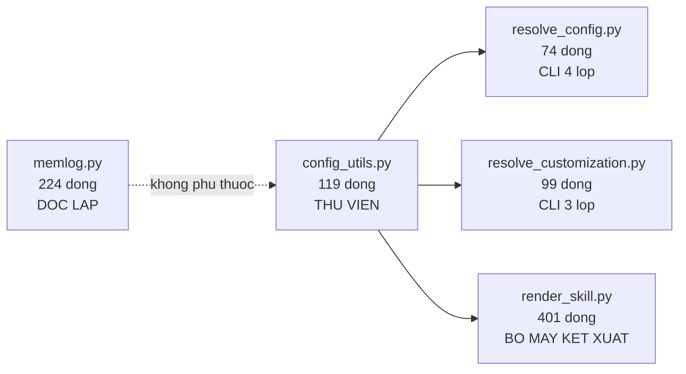
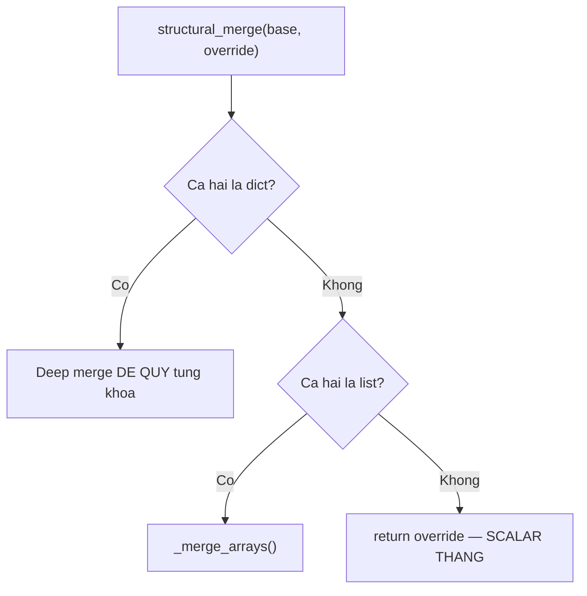
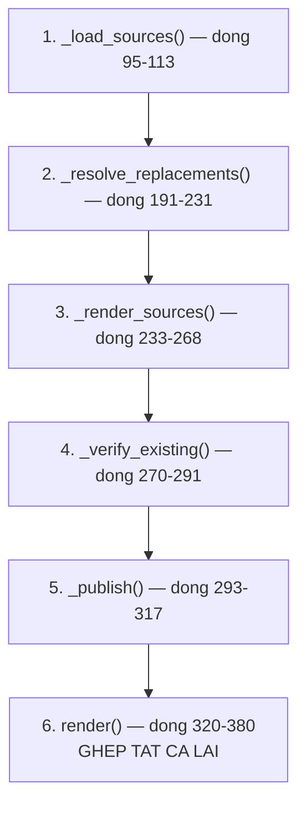

# 03 — Tầng runtime (Script Python)

> [← Mục lục](./index.md) · Trước: [02](./02-tang-phan-phoi.md) · Tiếp: [04 — Tầng nội dung](./04-tang-noi-dung.md)

**~1.220 dòng.** Nhỏ nhất về số dòng, **quan trọng nhất về mặt thiết kế**. Đây là nơi tính tất định được đảm bảo.

---

## 1. Thứ tự đọc



| Thứ tự | File | Vì sao đọc lúc này |
| --- | --- | --- |
| 1 | `config_utils.py` | Mọi file khác phụ thuộc nó |
| 2 | `resolve_config.py` | Ví dụ dùng đơn giản nhất |
| 3 | `resolve_customization.py` | Thêm một chi tiết: tự tìm project root |
| 4 | `render_skill.py` | Phức tạp nhất; hiểu 1–3 rồi mới đọc |
| 5 | `memlog.py` | Độc lập, đọc lúc nào cũng được |

---

## 2. Header chuẩn — đọc một lần, hiểu cả năm file

```python
#!/usr/bin/env python3
# /// script
# requires-python = ">=3.11"
# ///
"""Mô tả một dòng."""

import sys

# Installed scripts are consumer files, not a location for interpreter caches.
sys.dont_write_bytecode = True

try:
    from config_utils import ConfigError, load_central_config
except ModuleNotFoundError as error:
    if error.name != "tomllib":
        raise
    sys.stderr.write("error: Python 3.11+ is required (stdlib `tomllib` not found).\n")
    raise SystemExit(3) from None
```

Bốn chi tiết:

| # | Chi tiết | ♻️ Vì sao đáng mượn |
| --- | --- | --- |
| 1 | `# /// script` + `requires-python` | Chuẩn **PEP 723** — `uv` đọc để biết yêu cầu, không cần `requirements.txt` |
| 2 | `sys.dont_write_bytecode = True` | Script cài vào dự án người dùng **không được** rải `__pycache__` |
| 3 | Bắt riêng `tomllib` | Thông báo lỗi rõ ràng thay vì `ModuleNotFoundError` khó hiểu |
| 4 | `SystemExit(3)` | Mã thoát **riêng** cho "thiếu Python 3.11", phân biệt với lỗi thường (1) |

⭐ Chi tiết 3 đáng học nhất:

```python
except ModuleNotFoundError as error:
    if error.name != "tomllib":   # ⭐ CHỈ bắt tomllib, lỗi khác vẫn raise
        raise
```

Không nuốt mọi `ModuleNotFoundError` — chỉ cái mình biết cách giải thích.

---

## 3. `config_utils.py` — 119 dòng, đọc từng dòng

📖 `src/scripts/config_utils.py`

### 3.1 Sáu hàm

| Hàm | Dòng | Vai trò |
| --- | --- | --- |
| `load_toml(path, *, required=False)` | 18–34 | Nạp một file TOML với kiểm tra nghiêm |
| `_detect_keyed_merge_field(items)` | 37–55 | Phát hiện mảng bảng có khóa |
| `_merge_arrays(base, override)` | 58–77 | Nối hoặc thay theo khóa |
| `structural_merge(base, override)` | 80–90 | ⭐⭐ Hợp nhất đệ quy |
| `merge_layers(layers)` | 93–97 | Hợp nhất tuần tự |
| `load_central_config` / `load_customization` | 100–119 | Hai điểm vào |

### 3.2 ⭐ `load_toml` — kiểm tra nghiêm

```python
def load_toml(path: Path, *, required: bool = False) -> dict[str, Any]:
    """Load a TOML table, allowing absence only for optional layers."""
    if not path.exists():
        if required:
            raise ConfigError(f"required TOML file not found: {path}")
        return {}                                    # ⭐ vắng = rỗng, không lỗi
    if not path.is_file():
        raise ConfigError(f"TOML layer is not a file: {path}")
    try:
        with path.open("rb") as stream:
            parsed = tomllib.load(stream)
    except tomllib.TOMLDecodeError as error:
        raise ConfigError(f"failed to parse {path}: {error}") from error
    except OSError as error:
        raise ConfigError(f"failed to read {path}: {error}") from error
    if not isinstance(parsed, dict):
        raise ConfigError(f"TOML layer did not parse to a table: {path}")
    return parsed
```

⭐ **Năm trường hợp lỗi được phân biệt rõ:**

| Trường hợp | Xử lý |
| --- | --- |
| Không tồn tại + `required=False` | Trả `{}` — lớp tùy chọn vắng là bình thường |
| Không tồn tại + `required=True` | `ConfigError` |
| Là thư mục | `ConfigError` riêng |
| Parse lỗi | `ConfigError` **kèm chi tiết vị trí** từ `tomllib` |
| Không phải bảng ở gốc | `ConfigError` riêng |

♻️ `raise ... from error` giữ nguyên chuỗi nguyên nhân cho traceback.

### 3.3 ⭐⭐ `structural_merge` — trái tim của hệ thống cấu hình

```python
def structural_merge(base: Any, override: Any) -> Any:
    """Merge tables recursively, keyed table arrays by identity, and append other arrays."""
    if isinstance(base, dict) and isinstance(override, dict):
        result = dict(base)
        for key, value in override.items():
            result[key] = structural_merge(result[key], value) if key in result else value
        return result
    if isinstance(base, list) and isinstance(override, list):
        return _merge_arrays(base, override)
    return override        # ⭐ scalar: override thắng
```

**11 dòng.** Toàn bộ ngữ nghĩa override của hệ thống nằm ở đây.



⭐ **Dòng cuối `return override` xử lý mọi trường hợp còn lại:** scalar, kiểu khác nhau, `None`. Không có `elif` dài dòng.

### 3.4 ⭐ `_detect_keyed_merge_field` — quy ước làm hợp đồng

```python
_KEYED_MERGE_FIELDS = ("code", "id")

def _detect_keyed_merge_field(items: list[Any]) -> str | None:
    if not items or not all(isinstance(item, dict) for item in items):
        return None                              # ⭐ không phải mảng bảng
    for candidate in _KEYED_MERGE_FIELDS:        # ⭐ thử "code" TRƯỚC, rồi "id"
        if all(candidate in item for item in items):
            for item in items:
                value = item[candidate]
                if not isinstance(value, str):
                    raise ConfigError(
                        f"keyed array identifier `{candidate}` must be a string, "
                        f"got {type(value).__name__}"
                    )
                if not value:
                    raise ConfigError(
                        f"keyed array identifier `{candidate}` must not be empty"
                    )
            return candidate
    return None
```

⭐ **Ba quyết định:**

| Quyết định | Hệ quả |
| --- | --- |
| `all(candidate in item ...)` — **MỌI** phần tử phải có khóa | Thiếu ở **một** phần tử ⇒ toàn mảng thành mảng thường ⇒ nối thay vì thay |
| Validate kiểu và rỗng **ngay khi phát hiện** | Lỗi lộ ra ở đúng chỗ, không âm thầm |
| Thứ tự `("code", "id")` | `code` ưu tiên hơn `id` khi cả hai đều có |

⚠️ Quyết định 1 là **cạm bẫy hay gặp nhất** khi viết override — quên `code` ở một mục là toàn bộ hành vi đổi.

### 3.5 `_merge_arrays` — giữ thứ tự

```python
def _merge_arrays(base: list[Any], override: list[Any]) -> list[Any]:
    keyed_field = _detect_keyed_merge_field(base + override)   # ⭐ xét CẢ HAI
    if keyed_field is None:
        return list(base) + list(override)                     # nối thường

    result: list[Any] = []
    index_by_key: dict[str, int] = {}
    for item in base:
        copied = dict(item)
        index_by_key[copied[keyed_field]] = len(result)
        result.append(copied)
    for item in override:
        copied = dict(item)
        key = copied[keyed_field]
        if key in index_by_key:
            result[index_by_key[key]] = copied      # ⭐ THAY TẠI CHỖ, giữ vị trí
        else:
            index_by_key[key] = len(result)
            result.append(copied)                   # nối vào cuối
    return result
```

⭐ **Thay tại chỗ** (`result[index] = copied`) chứ không xóa-rồi-thêm. Nên override một lens **không đổi thứ tự** các lens khác.

♻️ `dict(item)` sao chép nông ⇒ không sửa đối tượng gốc của caller.

### 3.6 Hai điểm vào

```python
def load_central_config(project_root: Path) -> dict[str, Any]:
    bmad_dir = project_root / "_bmad"
    return merge_layers((
        load_toml(bmad_dir / "config.toml", required=True),      # BẮT BUỘC
        load_toml(bmad_dir / "config.user.toml"),
        load_toml(bmad_dir / "custom" / "config.toml"),
        load_toml(bmad_dir / "custom" / "config.user.toml"),
    ))


def load_customization(project_root: Path | None, skill_dir: Path) -> dict[str, Any]:
    skill_name = skill_dir.name                    # ⭐ TÊN THƯ MỤC là định danh
    custom_dir = project_root / "_bmad" / "custom" if project_root else None
    return merge_layers((
        load_toml(skill_dir / "customize.toml", required=True),
        load_toml(custom_dir / f"{skill_name}.toml") if custom_dir else {},
        load_toml(custom_dir / f"{skill_name}.user.toml") if custom_dir else {},
    ))
```

⭐ **Chỉ lớp đầu là `required=True`.** Ba lớp còn lại vắng là hợp lệ.

⭐ `skill_dir.name` — đây là lý do file override **phải** đặt tên đúng theo tên thư mục skill.

---

## 4. `resolve_config.py` — 74 dòng

📖 `src/scripts/resolve_config.py`

### 4.1 ♻️ Sentinel cho "không tìm thấy"

```python
_MISSING = object()          # ⭐ sentinel riêng, không dùng None

def extract_key(data, dotted_key: str):
    current = data
    for part in dotted_key.split("."):
        if isinstance(current, dict) and part in current:
            current = current[part]
        else:
            return _MISSING
    return current
```

⭐ Dùng `object()` làm sentinel thay vì `None` — vì `None` **có thể là giá trị hợp lệ** trong TOML.

```python
for key in args.key:
    value = extract_key(merged, key)
    if value is not _MISSING:       # ⭐ so sánh IDENTITY
        output[key] = value
```

### 4.2 ⭐ Khóa không tồn tại bị bỏ qua im lặng

Đây là **quyết định thiết kế có chủ ý**. Nhờ nó mà mọi `SKILL.md` viết được:

> *On failure or missing values → neutral defaults; **never block**.*

### 4.3 Mã thoát phân biệt

```python
try:
    merged = load_central_config(Path(args.project_root).resolve())
except ConfigError as error:
    sys.stderr.write(f"error: {error}\n")
    return 1                       # lỗi cấu hình
# ... SystemExit(3) ở header cho thiếu Python
```

| Mã | Nghĩa |
| --- | --- |
| 0 | Thành công |
| 1 | `ConfigError` |
| 3 | Thiếu Python 3.11 |

---

## 5. `resolve_customization.py` — 99 dòng

📖 `src/scripts/resolve_customization.py`

### 5.1 ⚠️ Tự tìm project root — tiện nhưng có bẫy

```python
def find_project_root(start: Path) -> Path | None:
    current = start.resolve()
    while True:
        if (current / "_bmad").exists() or (current / ".git").exists():
            return current
        if current.parent == current:      # ⭐ chạm gốc filesystem
            return None
        current = current.parent
```

Thứ tự thử:

```python
project_root = (
    Path(args.project_root).resolve()
    if args.project_root
    else find_project_root(skill_dir) or find_project_root(Path.cwd())
)
```

⚠️ **Bẫy:** điều kiện `or (current / ".git").exists()` có thể nhận nhầm một repo con làm project root. Đó là lý do mọi `SKILL.md` **luôn truyền `--project-root` tường minh**.

♻️ Mẫu `while True` + `if current.parent == current` là cách chuẩn để đi ngược cây thư mục mà không lặp vô hạn.

### 5.2 ⭐ Xử lý encoding cho Windows

```python
def write_json_stdout(output) -> None:
    reconfigure = getattr(sys.stdout, "reconfigure", None)
    if reconfigure is not None:                    # ⭐ getattr — an toàn nếu không có
        reconfigure(encoding="utf-8")
    sys.stdout.write(json.dumps(output, indent=2, ensure_ascii=False) + "\n")
```

Hai chi tiết:

| Chi tiết | Vì sao |
| --- | --- |
| `getattr(..., None)` | `sys.stdout` bị thay thế (test, pipe) có thể không có `reconfigure` |
| `ensure_ascii=False` | Giữ nguyên emoji và tiếng Việt thay vì escape `\uXXXX` |

⚠️ Không có hai dòng này, output trên Windows console sẽ hỏng — đúng lỗi tôi gặp khi viết tài liệu này (`UnicodeEncodeError: 'charmap' codec`).

---

## 6. `render_skill.py` — 401 dòng ⭐⭐

📖 `src/scripts/render_skill.py`

**File quan trọng nhất repo.** Đọc theo thứ tự này, không đọc tuần tự từ đầu:



### 6.1 `_load_sources` — kiểm tra thoát thư mục

```python
def _load_sources(skill_dir: Path) -> dict[str, str]:
    sources: dict[str, str] = {}
    for candidate in sorted(skill_dir.rglob("*.md")):     # ⭐ sorted → tất định
        if candidate.name == "SKILL.md":
            continue
        name = candidate.relative_to(skill_dir).as_posix()  # ⭐ as_posix → tất định
        path = candidate.resolve(strict=True)               # ⭐ theo symlink
        if not path.is_relative_to(skill_dir):
            raise RenderError(f"render source escapes skill directory: {name}")
        # ...
    if "workflow.md" not in sources:
        raise RenderError(f"render entry is missing: {skill_dir / 'workflow.md'}")
    return sources
```

⭐ **Ba chi tiết đảm bảo tất định:**

| Chi tiết | Vì sao |
| --- | --- |
| `sorted(...)` | `rglob` không đảm bảo thứ tự; sorted làm hash ổn định |
| `.as_posix()` | Windows dùng `\`, POSIX dùng `/` — chuẩn hóa để hash giống nhau |
| `resolve(strict=True)` + `is_relative_to` | ⚠️ **Chặn symlink trỏ ra ngoài skill** |

### 6.2 Bốn loại token

```python
_CONFIG_TOKEN       = re.compile(r"\{\{config\.([A-Za-z0-9_.-]+)\}\}")
_SHORT_CONFIG_TOKEN = re.compile(r"\{\{\.([A-Za-z0-9_]+)\}\}")
_CUSTOM_TOKEN       = re.compile(r"\{workflow\.([A-Za-z0-9_.-]+)\}")
_SNAPSHOT_TOKEN     = re.compile(r"\[\[bmad-snapshot:([A-Za-z0-9_./-]+\.md)\]\]")
```

### 6.3 ⭐ Chống mơ hồ — tra cứu ngắn

```python
def _resolve_short_config(central, key, project_root) -> tuple[str, str]:
    matches = _find_config_values(central, key)
    if not matches:
        raise RenderError(f"missing config value `{key}`")
    if len(matches) > 1:
        paths = ", ".join(path for path, _ in matches)
        raise RenderError(f"ambiguous config value `{key}` found at: {paths}")
    # ...
```

⭐ **Tìm thấy nhiều ⇒ LỖI, không đoán.** Và thông báo lỗi liệt kê **chính xác** các vị trí trùng.

♻️ Mẫu chung: khi tiện lợi (tra cứu ngắn) đụng độ với chính xác, **chọn chính xác và báo lỗi có ích**.

### 6.4 ⭐⭐ `_render_sources` — thay thế MỘT lượt

```python
def _render_sources(sources, replacements, destination) -> dict[str, str]:
    """Resolve only tokens authored in installed sources in one opaque pass."""
    replacements = {
        token: value.replace("{skill-root}", str(destination))
        if token.startswith("{workflow.")
        else value
        for token, value in replacements.items()
    }
    source_names = set(sources)
    patterns = [
        *(re.escape(token) for token in sorted(replacements, key=len, reverse=True)),
        _SNAPSHOT_TOKEN.pattern,
    ]
    token_pattern = re.compile("|".join(patterns))

    def replace(match: re.Match[str]) -> str:
        token = match.group(0)
        if token in replacements:
            return replacements[token]
        snapshot = _SNAPSHOT_TOKEN.fullmatch(token)
        if snapshot is None:
            raise RenderError(f"unsupported render token: {token}")
        target = snapshot.group(1)
        if target not in source_names:
            raise RenderError(f"snapshot reference targets undeclared source: {target}")
        return str(destination / target)

    rendered: dict[str, str] = {}
    for name, content in sources.items():
        # Inserted paths and customization prose are never scanned as source tokens.
        rendered[name] = token_pattern.sub(replace, content)
    return rendered
```

⭐⭐ **Ba kỹ thuật quan trọng:**

| # | Kỹ thuật | Giải quyết |
| --- | --- | --- |
| 1 | `sorted(replacements, key=len, reverse=True)` | Token dài khớp trước token ngắn — tránh `{{.user}}` ăn mất `{{.user_name}}` |
| 2 | Gộp **mọi** pattern thành **một** regex, thay trong **một** lượt `sub()` | ⭐ **Văn bản chèn vào không bao giờ bị quét lại** |
| 3 | `raise` trong hàm `replace` | Token lạ không bị bỏ qua im lặng |

⭐ Kỹ thuật 2 là điểm mấu chốt: nếu `persistent_facts` của người dùng chứa chuỗi `{{.user_name}}`, nó **không** bị thay thế — vì nó được chèn vào *trong lúc* sub, và `sub()` không quét lại phần đã thay.

### 6.5 ⭐ Định danh generation

```python
identity = {
    "project_root": str(project_root),
    "renderer_sha256": renderer_hash,       # ⭐ hash CỦA CHÍNH FILE NÀY
    "resolved_values": input_values,
    "source_sha256": source_hashes,
}
generation_hash = _hash_bytes(_canonical_json(identity))[:20]
```

```python
def _canonical_json(value: Any) -> bytes:
    return json.dumps(
        value, ensure_ascii=False, sort_keys=True, separators=(",", ":")
    ).encode("utf-8")
```

⭐ **`sort_keys=True` + `separators=(",",":")`** làm JSON **chuẩn hóa** — cùng dữ liệu luôn ra cùng chuỗi byte, bất kể thứ tự chèn vào dict.

⭐ **`renderer_sha256`** là chi tiết tinh tế nhất: nâng cấp BMad làm đổi logic renderer ⇒ hash đổi ⇒ **tự động kết xuất lại**. Không cần cơ chế versioning riêng.

Bốn thành phần bao phủ mọi nguyên nhân đầu ra có thể khác:

| Thành phần | Bắt được |
| --- | --- |
| `project_root` | Cùng skill ở dự án khác |
| `renderer_sha256` | Nâng cấp làm đổi renderer |
| `resolved_values` | Đổi override hoặc cấu hình |
| `source_sha256` | Nâng cấp làm đổi nội dung bước |

### 6.6 ⭐⭐ `_publish` — nguyên tử

```python
def _publish(destination: Path, outputs: dict[str, bytes], manifest: dict[str, Any]) -> None:
    destination.parent.mkdir(parents=True, exist_ok=True)
    if destination.exists():
        _verify_existing(destination, manifest)    # ⭐ đã có → verify rồi return
        return
    staging = Path(tempfile.mkdtemp(prefix=".staging-", dir=destination.parent))
    try:
        for name, content in outputs.items():
            path = staging / name
            path.parent.mkdir(parents=True, exist_ok=True)
            path.write_bytes(content)
        (staging / "manifest.json").write_bytes(...)
        try:
            os.rename(staging, destination)        # ⭐⭐ NGUYÊN TỬ
        except OSError:
            if destination.exists():               # ⭐ tiến trình khác đã tạo
                _verify_existing(destination, manifest)
            else:
                raise
    finally:
        if staging.exists():
            shutil.rmtree(staging, ignore_errors=True)   # ⭐ luôn dọn
```

⭐⭐ **Bốn tính chất:**

| # | Tính chất | Cách đạt |
| --- | --- | --- |
| 1 | Nguyên tử | Ghi staging → `os.rename` |
| 2 | Staging **cùng thư mục cha** | `dir=destination.parent` — `rename` chỉ nguyên tử **trong cùng filesystem** |
| 3 | Chịu được đua tiến trình | `rename` fail + `destination.exists()` ⇒ verify thay vì lỗi |
| 4 | Không rác | `finally: rmtree(ignore_errors=True)` |

♻️ Tính chất 2 là chi tiết dễ bỏ sót nhất — nếu staging ở `/tmp` mà đích ở `/home`, `rename` sẽ ném `EXDEV`.

### 6.7 `_verify_existing` — ba tầng kiểm tra

```python
def _verify_existing(destination: Path, manifest: dict[str, Any]) -> None:
    manifest_path = destination / "manifest.json"
    try:
        existing = json.loads(manifest_path.read_text(encoding="utf-8"))
    except (OSError, UnicodeError, json.JSONDecodeError) as error:
        raise RenderError(f"corrupt existing generation {destination}: {error}") from error
    if existing != manifest:                                    # ⭐ tầng 1
        raise RenderError(f"generation collision or corruption at {destination}")
    expected_files = set(manifest["outputs"]) | {"manifest.json"}
    actual_files = {
        path.relative_to(destination).as_posix()
        for path in destination.rglob("*") if path.is_file()
    }
    if actual_files != expected_files:                          # ⭐ tầng 2
        raise RenderError(f"generation contains unexpected or missing files: {destination}")
    for name, expected_hash in manifest["outputs"].items():
        actual_hash = _hash_bytes((destination / name).read_bytes())
        if actual_hash != expected_hash:                        # ⭐ tầng 3
            raise RenderError(f"generation output hash mismatch: {destination / name}")
```

| Tầng | Kiểm | Bắt được |
| --- | --- | --- |
| 1 | `manifest.json` khớp tuyệt đối | Xung đột hash |
| 2 | Tập file **bằng nhau** (không thừa, không thiếu) | File lạ được thêm vào |
| 3 | Hash **từng** file | Nội dung bị sửa tay |

⭐ Tầng 2 dùng so sánh **tập hợp bằng nhau**, không phải "tập con" — nên file thừa cũng bị bắt.

---

## 7. `memlog.py` — 224 dòng

📖 `src/scripts/memlog.py`

### 7.1 ⭐ Docstring là đặc tả thiết kế

Docstring 50 dòng đầu file nêu **ba bất biến**:

```
  1. Append-only, chronological. Entries land at the end, in the order they happen.
     Nothing is ever inserted backward, reordered, edited, or removed. There is no
     edit or delete subcommand by design; history is never rewritten.
  2. Write-only / blind. Every command is an atomic, context-free write and echoes the
     new state as one line of JSON, so the caller never re-reads the file mid-session.
  3. No lifecycle status. A memory log has no "complete" flag...
```

♻️ **Mẫu:** viết bất biến vào docstring, không phải README riêng. Người sửa mã đọc được ngay.

### 7.2 ⭐⭐ Ghi nguyên tử

```python
def write_atomic(path: Path, text: str) -> None:
    """Temp + flush + fsync + atomic rename, so a crash never half-writes an entry."""
    tmp = path.with_suffix(path.suffix + ".tmp")
    with open(tmp, "w", encoding="utf-8") as f:
        f.write(text)
        f.flush()              # ⭐ đẩy buffer Python → OS
        os.fsync(f.fileno())   # ⭐ ép OS đẩy xuống ĐĨA
    os.replace(tmp, path)      # ⭐ nguyên tử, ghi đè được
```

⭐ **Ba bước, thiếu bước nào cũng hỏng:**

| Bước | Không có nó |
| --- | --- |
| `flush()` | Dữ liệu còn trong buffer Python |
| `fsync()` | Dữ liệu còn trong page cache OS — mất điện là mất |
| `os.replace()` | `rename()` thường không ghi đè trên Windows; `os.replace` thì có |

### 7.3 Parse frontmatter chịu được nội dung người dùng

```python
def split(text: str) -> tuple[dict, str]:
    """Return (frontmatter dict in source order, body str).

    The closing fence is the first line that is *exactly* `---`, so a `---` inside a
    field value (topic/goal are free user text) never truncates the frontmatter.
    """
    lines = text.splitlines()
    if not lines or lines[0] != "---":
        raise ValueError(".memlog.md has no frontmatter")
    end = next((i for i in range(1, len(lines)) if lines[i] == "---"), None)
    if end is None:
        raise ValueError(".memlog.md frontmatter is not terminated")
```

⭐ `lines[i] == "---"` — so sánh **chính xác**, không phải `startswith`. Nên `--- ghi chú` trong giá trị không cắt cụt frontmatter.

### 7.4 Render vô hiệu hóa xuống dòng

```python
def render(meta: dict, body: str) -> str:
    # Neutralize newlines in values so a multi-line field can't break the fence on re-read.
    fm = "\n".join(f"{k}: {' '.join(str(v).splitlines())}" for k, v in meta.items())
    return "---\n" + fm + "\n---\n\n" + body.rstrip("\n") + "\n"
```

⭐ Ghi và đọc là **cặp đối xứng**: `split` chịu được `---` trong giá trị, `render` chịu được xuống dòng trong giá trị.

### 7.5 ⭐ Echo trạng thái thay vì đọc lại

```python
def ack(path: Path, body: str) -> None:
    """Echo new state so the caller never re-reads the file to know where it stands."""
    print(json.dumps({
        "ok": True,
        "memlog": str(path),
        "entries": entry_count(body),
    }))
```

♻️ **Mẫu quan trọng cho công cụ LLM gọi:** trả trạng thái mới ngay, để bên gọi không phải đọc lại file (tốn ngữ cảnh).

### 7.6 Chuẩn hóa text về một dòng

```python
text = " ".join(args.text.split())  # collapse newlines/runs → one-line entry, no prose bloat
```

⭐ `str.split()` không đối số tách theo **mọi** khoảng trắng (space, tab, newline) và bỏ chuỗi rỗng. `" ".join(...)` ghép lại bằng một space.

### 7.7 Địa chỉ hóa loại trừ lẫn nhau

```python
def add_target(sp) -> None:
    """Every command addresses the memlog the same way: a run folder or an explicit path."""
    g = sp.add_mutually_exclusive_group(required=True)
    g.add_argument("--workspace", help="run folder; the memlog is {workspace}/.memlog.md")
    g.add_argument("--path", help="explicit memlog file path (alternative to --workspace)")
```

♻️ `add_mutually_exclusive_group(required=True)` — argparse tự lo việc "phải có đúng một trong hai".

---

## 8. Bảng: kỹ thuật → vị trí

| Kỹ thuật | File | Dòng |
| --- | --- | --- |
| PEP 723 inline metadata | mọi script | 2–4 |
| Không ghi bytecode | mọi script | ~20 |
| Bắt riêng `tomllib` | mọi script trừ memlog | ~22 |
| Hợp nhất cấu trúc đệ quy | `config_utils.py` | 80–90 |
| Mảng bảng có khóa | `config_utils.py` | 37–77 |
| Sentinel `_MISSING` | `resolve_config.py` | 23, 27–33 |
| Đi ngược cây thư mục | `resolve_customization.py` | 26–34 |
| Encoding stdout an toàn | `resolve_customization.py` | 46–50 |
| Chặn symlink thoát thư mục | `render_skill.py` | 95–113 |
| Chống mơ hồ tra cứu ngắn | `render_skill.py` | 145–156 |
| Thay thế một lượt | `render_skill.py` | 233–268 |
| JSON chuẩn hóa để hash | `render_skill.py` | 39–42 |
| Publish nguyên tử | `render_skill.py` | 293–317 |
| Xác minh ba tầng | `render_skill.py` | 270–291 |
| Ghi nguyên tử flush+fsync | `memlog.py` | 118–125 |
| Frontmatter chịu nội dung tự do | `memlog.py` | 88–107 |
| Echo trạng thái | `memlog.py` | 132–139 |

---

**Tiếp:** [04 — Tầng nội dung](./04-tang-noi-dung.md) · [← Mục lục](./index.md)
