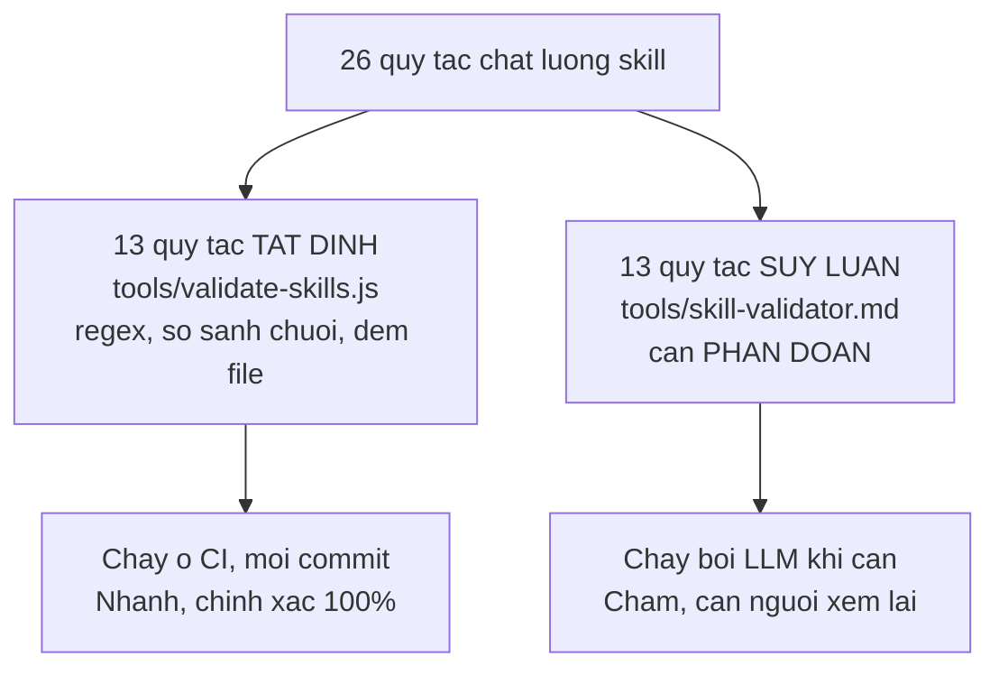
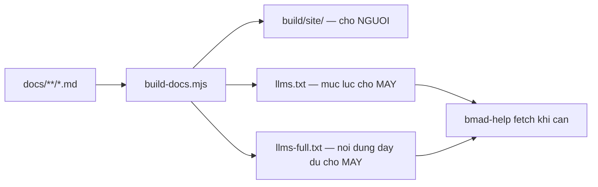
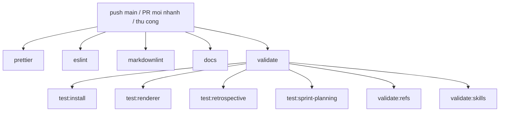

# 05 — Tầng chất lượng (Validator và công cụ build)

> [← Mục lục](./index.md) · Trước: [04](./04-tang-noi-dung.md) · Tiếp: [06 — Mẫu hình tái sử dụng](./06-mau-hinh-tai-su-dung.md)

**~2.500 dòng.** Vấn đề khó: **làm sao kiểm tra chất lượng của nội dung Markdown?**

---

## 1. Bài toán

Khi logic nghiệp vụ nằm trong văn xuôi, compiler không giúp gì. Không có type checker cho "câu này có rõ ràng không". Nhưng nhiều thứ **vẫn kiểm tra được tất định**.

⭐ BMAD chia đôi bài toán:



Trích `tools/skill-validator.md`:

> *Before running inference-based validation, run the deterministic validator... Review its JSON output. **For any rule that produced zero findings in the first pass, skip it** during inference-based validation below — it has already been verified. **Focus your inference effort on the remaining rules that require judgment.**

♻️ **Mẫu quan trọng:** đừng dùng LLM cho việc regex làm được. Dùng nó cho phần còn lại, và **nói rõ cho nó biết phần nào đã được kiểm rồi**.

---

## 2. `validate-skills.js` — registry rule-based

📖 `tools/validate-skills.js` (735 dòng)

### 2.1 ⭐ Docstring liệt kê mọi quy tắc

```javascript
/**
 * Deterministic Skill Validator
 *
 * What it checks:
 * - SKILL-01: SKILL.md exists
 * - SKILL-02: SKILL.md frontmatter has name
 * - SKILL-03: SKILL.md frontmatter has description
 * - SKILL-04: name format (lowercase, hyphens, no forbidden substrings)
 * - SKILL-05: name matches directory basename
 * - SKILL-06: description quality (length, "Use when"/"Use if")
 * - SKILL-07: SKILL.md has body content after frontmatter
 * - PATH-02: no installed_path variable
 * - STEP-01: step filename format
 * - STEP-06: step frontmatter has no name/description
 * - STEP-07: step count 2-10
 * - SEQ-02: no time estimates
 * - TPL-01: template files must not contain compile-time {{.var}} substitutions
 *
 * Usage:
 *   node tools/validate-skills.js                    # All skills, human-readable
 *   node tools/validate-skills.js path/to/skill-dir  # Single skill
 *   node tools/validate-skills.js --strict           # Exit 1 on HIGH+ findings
 *   node tools/validate-skills.js --json             # JSON output
 */
```

♻️ **Mẫu:** docstring vừa là tài liệu vừa là mục lục mã. Đọc 25 dòng này biết file làm gì.

### 2.2 ⭐ Hằng số ở một chỗ

```javascript
const NAME_REGEX = /^bmad-[a-z0-9]+(-[a-z0-9]+)*$/;
const STEP_FILENAME_REGEX = /^step-\d{2}[a-z]?-[a-z0-9-]+\.md$/;
const TIME_ESTIMATE_PATTERNS = [/takes?\s+\d+\s*min/i, /~\s*\d+\s*min/i, /estimated\s+time/i, /\bETA\b/];
const TEMPLATE_FILENAME_REGEX = /template/i;
const COMPILE_TIME_SUB_REGEX = /\{\{\.\w+\}\}/;

const SEVERITY_ORDER = { CRITICAL: 0, HIGH: 1, MEDIUM: 2, LOW: 3 };
```

⭐ `STEP_FILENAME_REGEX` cho phép hậu tố chữ cái (`step-03a-...`) — chi tiết chỉ lộ ra khi đọc regex, không có trong tài liệu.

### 2.3 ⭐ Hình dạng finding thống nhất

```javascript
findings.push({
  rule: 'SKILL-01',
  title: 'SKILL.md Must Exist',
  severity: 'CRITICAL',
  file: 'SKILL.md',
  detail: 'SKILL.md not found in skill directory.',
  fix: 'Create SKILL.md as the skill entrypoint.',      // ⭐ CÁCH SỬA
});
```

⭐ **Trường `fix` là bắt buộc.** Mọi finding phải nói **cách sửa**, không chỉ nói sai gì.

♻️ So sánh với `bmad-review` (trường `guard_snippet`) — cùng triết lý: **báo lỗi kèm giải pháp**.

### 2.4 ⭐ Fail-fast có kiểm soát

```javascript
if (!fs.existsSync(skillMdPath)) {
  findings.push({ rule: 'SKILL-01', /* ... */ });
  // Cannot check SKILL-02 through SKILL-07 without SKILL.md
  return findings;                       // ⭐ dừng SỚM
}

const skillContent = safeReadFile(skillMdPath, findings, 'SKILL.md');
if (skillContent === null) return findings;   // ⭐ đọc lỗi cũng dừng
```

♻️ **Mẫu:** khi một kiểm tra thất bại làm các kiểm tra sau vô nghĩa, dừng và **nói rõ trong chú thích vì sao**.

⚠️ Đánh đổi: người dùng phải sửa lỗi rồi chạy lại để thấy lỗi tiếp theo. Chấp nhận được vì SKILL-01 là CRITICAL.

### 2.5 ⭐ Tích hợp GitHub Actions

```javascript
function escapeAnnotation(str) {
  return str.replaceAll('%', '%25').replaceAll('\r', '%0D').replaceAll('\n', '%0A');
}

// ...

if (process.env.GITHUB_ACTIONS) {
  const absFile = path.join(skillDir, f.file);
  const ghFile = path.relative(PROJECT_ROOT, absFile);
  const line = f.line || 1;
  const level = f.severity === 'LOW' ? 'notice' : 'warning';
  console.log(`::${level} file=${ghFile},line=${line}::${escapeAnnotation(`${f.rule}: ${f.detail}`)}`);
}
```

⭐ **Hai chi tiết:**

| Chi tiết | Vì sao |
| --- | --- |
| `escapeAnnotation` | GitHub Actions annotation dùng `%`, `\r`, `\n` làm ký tự điều khiển — phải escape |
| `path.relative(PROJECT_ROOT, ...)` | GitHub cần đường dẫn tương đối repo để link đúng file |

Và ghi step summary:

```javascript
if (process.env.GITHUB_STEP_SUMMARY) {
  let summary = '## Skill Validation\n\n';
  summary += '| Skill | Rule | Severity | File | Detail |\n';
  // ...
}
```

♻️ **Mẫu:** cùng một validator chạy ở ba nơi (terminal, CI annotation, CI summary) với đầu ra phù hợp từng nơi, điều khiển bằng biến môi trường.

### 2.6 ⚠️ `--strict` phân biệt mức nghiêm trọng

```javascript
const hasHighPlus = severityCounts.CRITICAL > 0 || severityCounts.HIGH > 0;

if (totalFindings === 0) {
  output.push(`\n   All skills passed validation!`);
} else if (STRICT && hasHighPlus) {
  output.push(`\n   [STRICT MODE] HIGH+ findings found — exiting with failure.`);
} else if (STRICT) {
  output.push(`\n   [STRICT MODE] Only MEDIUM/LOW findings — pass.`);
} else {
  output.push(`\n   Run with --strict to treat HIGH+ findings as errors.`);
}
```

⭐ `--strict` **không** fail trên MEDIUM/LOW. Cho phép CI chặn lỗi nghiêm trọng mà không chặn vì góp ý nhỏ.

---

## 3. `validate-file-refs.js` — kiểm tra tham chiếu

📖 `tools/validate-file-refs.js` (563 dòng)

### 3.1 ⭐⭐ Docstring nói cả cái KHÔNG kiểm

```javascript
/**
 * What it checks:
 * - {project-root}/_bmad/ references in YAML and markdown resolve to real src/ files
 * - Relative path references (./file.md, ../data/file.csv) point to existing files
 * - exec="..." and <invoke-task> targets exist
 * - Step metadata (thisStepFile, nextStepFile) references are valid
 * - Load directives (Load: `./file.md`) target existing files
 * - No absolute paths (/Users/, /home/, C:\) leak into source files
 *
 * What it does NOT check (deferred):
 * - {installed_path} variable interpolation (self-referential, low risk)
 * - {{mustache}} template variables (runtime substitution)
 * - {config_source}:key dynamic YAML dereferences
 */
```

⭐⭐ **Liệt kê phạm vi bỏ qua kèm lý do** là kỹ thuật tài liệu rất tốt. Người đọc biết ngay:

- Đừng trông cậy validator này bắt lỗi `{{mustache}}`
- Việc bỏ qua là **có chủ ý**, không phải sót

♻️ Mượn ngay được: mọi validator nên có mục "What it does NOT check".

### 3.2 ⚠️ Mặc định warning, `--strict` mới fail

```javascript
/**
 * Default mode is warning-only (exit 0) so adoption is non-disruptive.
 * Use --strict when you want CI or pre-commit to enforce valid references.
 */
```

♻️ **Mẫu áp dụng dần:** validator mới ra mắt ở chế độ cảnh báo, để nhóm sửa dần; bật `--strict` khi đã sạch.

Trong `package.json`:

```json
"validate:refs": "node tools/validate-file-refs.js --strict",
"test:refs": "node test/test-file-refs-csv.js",
```

⭐ Giờ nó đã ở `--strict` trong cổng chất lượng — nghĩa là giai đoạn áp dụng dần đã xong.

### 3.3 Bắt rò rỉ đường dẫn tuyệt đối

```
- No absolute paths (/Users/, /home/, C:\) leak into source files
```

⚠️ Đây là lỗi kinh điển: dev viết `/Users/an/projects/...` vào file nguồn, chạy được trên máy mình, hỏng ở mọi máy khác.

---

## 4. `build-docs.mjs` — pipeline tài liệu

📖 `tools/build-docs.mjs` (471 dòng)

### 4.1 Ba đầu ra

```javascript
/**
 * Consolidates docs from multiple sources, generates LLM-friendly files,
 * and builds the Astro+Starlight site.
 *
 * Build outputs:
 *   build/artifacts/     - With llms.txt, llms-full.txt
 *   build/site/          - Final Astro output (deployable)
 */
```

### 4.2 ⭐⭐ Ràng buộc ngân sách token viết thẳng vào mã

```javascript
// DO NOT CHANGE THESE VALUES!
// llms-full.txt is consumed by AI agents as context. Most LLMs have ~200k token limits.
```

⭐⭐ **Đây là ví dụ mẫu mực về chú thích:** nó không mô tả mã làm gì (rõ rồi), mà nêu **ràng buộc bên ngoài** khiến giá trị đó không được đổi tùy tiện.

♻️ **Mẫu:** khi một hằng số có lý do tồn tại nằm ngoài mã, **viết lý do đó cạnh nó**. Không thì người sau sẽ "tối ưu" nó.

### 4.3 ⭐ `llms.txt` — tài liệu cho máy đọc

Nhớ lại `module-help.csv`:

```csv
Core,_meta,,,,,,,,,false,https://docs.bmad-method.org/llms.txt,
```

`bmad-help` fetch URL này để trả lời câu hỏi chung. Nên pipeline build tài liệu **cũng là một phần của runtime**, không chỉ để người đọc.



### 4.4 Kiểm tra chạy trong build

```javascript
import { validatePublishedImplementationModel } from './validate-published-implementation-model.mjs';
```

Và trong `package.json`:

```json
"docs:build": "node tools/build-docs.mjs",
```

Với chú thích trong `.github/workflows/quality.yaml`:

```yaml
- name: Build documentation
  # Note: build-docs.mjs runs link validation internally before building
  run: npm run docs:build
```

⭐ Build **fail** nếu có link hỏng. Không cần bước CI riêng.

---

## 5. Cổng chất lượng — `package.json`

📖 `package.json` `scripts`

```json
"quality": "npm run format:check && npm run lint && npm run lint:md && npm run docs:build && npm run test:site-url && npm run test:install && npm run test:urls && npm run test:renderer && npm run test:retrospective && npm run test:sprint-planning && npm run validate:refs && npm run validate:skills && npm run docs:validate-sidebar",
```

### 5.1 Mười ba bước

| # | Bước | Bắt gì |
| --- | --- | --- |
| 1 | `format:check` | Prettier lệch |
| 2 | `lint` | ESLint, **`--max-warnings=0`** |
| 3 | `lint:md` | markdownlint |
| 4 | `docs:build` | Link hỏng (validate bên trong) |
| 5 | `test:site-url` | URL site sai |
| 6 | `test:install` | Thành phần cài đặt hỏng |
| 7 | `test:urls` | Parse URL nguồn |
| 8 | `test:renderer` | Python + Node renderer |
| 9 | `test:retrospective` | Script Python retro |
| 10 | `test:sprint-planning` | Script Python sprint + template sync |
| 11 | `validate:refs --strict` | Tham chiếu file hỏng |
| 12 | `validate:skills --strict` | 13 quy tắc tất định |
| 13 | `docs:validate-sidebar` | Thứ tự sidebar |

### 5.2 ⭐ Ràng buộc trong `AGENTS.md`

```markdown
- Before pushing, run `npm ci && npm run quality` on `HEAD` in the exact checkout
  you are about to push. `quality` mirrors the checks in `.github/workflows/quality.yaml`.
```

⭐ **Ba chi tiết:**

| Chi tiết | Vì sao |
| --- | --- |
| `npm ci` không phải `npm install` | Dùng đúng lockfile |
| "on `HEAD` in the **exact checkout**" | Không chạy trên working tree bẩn |
| "**mirrors** the checks in quality.yaml" | Chạy local = chạy CI |

### 5.3 Test Python chạy qua `uv`

```json
"test:renderer": "uv run --python 3.11 python -m unittest src/scripts/tests/test_config_utils.py src/scripts/tests/test_resolve_config.py src/scripts/tests/test_resolve_customization.py && node test/test-build-auto-renderer.js",
"test:retrospective": "uv run --python 3.11 src/bmm-skills/ship/bmad-retrospective/scripts/tests/test_git_evidence.py && uv run --python 3.11 src/bmm-skills/ship/bmad-retrospective/scripts/tests/test_sprint_status.py",
```

⭐ `uv run --python 3.11` **ghim phiên bản** — không phụ thuộc Python mặc định của máy.

♻️ **Mẫu:** dự án đa ngôn ngữ điều phối mọi test qua `npm scripts`. Một lệnh `npm run quality` chạy cả Node lẫn Python.

### 5.4 Lint-staged

```json
"lint-staged": {
  "*.{js,cjs,mjs}": ["npm run lint:fix", "npm run format:fix:staged"],
  "*.yaml": ["eslint --fix", "npm run format:fix:staged"],
  "*.json": ["npm run format:fix:staged"],
  "*.md": ["markdownlint-cli2"]
}
```

⭐ `*.yaml` cũng qua ESLint — nhờ `eslint-plugin-yml` và `yaml-eslint-parser` trong devDependencies.

---

## 6. CI — `.github/workflows/quality.yaml`

📖 `.github/workflows/quality.yaml`

### 6.1 Năm job song song



♻️ **Tách job để chạy song song và biết ngay cái nào hỏng.** Bốn job đầu nhẹ, job `validate` nặng nhất gom mọi thứ cần `uv`.

### 6.2 ⭐ Ghim phiên bản Node bằng file

```yaml
- name: Setup Node
  uses: actions/setup-node@v4
  with:
    node-version-file: ".nvmrc"      # ⭐ một nguồn sự thật
    cache: "npm"
```

`.nvmrc` chứa `20`. Dev local (`nvm use`) và CI dùng **cùng** file.

### 6.3 Chú thích giữ CI và local đồng bộ

```yaml
# Runs comprehensive quality checks on all PRs and pushes to main:
# ...
# Keep this workflow aligned with `npm run quality` in `package.json`.
```

⚠️ Đây là ràng buộc **do con người giữ**, không tự động. Nếu ai đó thêm bước vào `quality` mà quên thêm vào CI, không có gì bắt được.

♻️ Cách làm chặt hơn: để CI chỉ chạy `npm run quality`. BMAD chọn tách job để song song hóa — đánh đổi có ý thức.

---

## 7. `publish.yaml` — phát hành

📖 `.github/workflows/publish.yaml`

### 7.1 ⭐ Lọc theo đường dẫn

```yaml
on:
  push:
    branches: [main]
    paths:
      - "src/**"
      - "tools/installer/**"
      - "package.json"
      - "removals.txt"
```

⭐ Sửa `docs/` hay `website/` **không** kích hoạt publish. Chỉ thay đổi thực sự ảnh hưởng gói npm mới publish.

### 7.2 Hai kênh, hai cơ chế

```yaml
  workflow_dispatch:
    inputs:
      channel:
        type: choice
        options: [latest, next]
      bump:
        description: "Version bump type (latest channel only)"
        type: choice
        options: [patch, minor, major]
```

| Kênh | Kích hoạt | Token |
| --- | --- | --- |
| `next` | **Tự động** mỗi push main | `GITHUB_TOKEN` thường |
| `latest` | **Thủ công** qua `workflow_dispatch` | GitHub App token (tạo release) |

```yaml
- name: Generate GitHub App token
  if: github.event_name == 'workflow_dispatch' && inputs.channel == 'latest'
  uses: actions/create-github-app-token@v2
```

⭐ Token mạnh hơn **chỉ được cấp khi thực sự cần** — publish stable.

### 7.3 ⭐ Bảo vệ chống fork

```yaml
jobs:
  publish:
    if: github.repository == 'bmad-code-org/BMAD-METHOD' && (github.event_name != 'workflow_dispatch' || github.ref == 'refs/heads/main')
```

⭐ **Hai điều kiện:**

| Điều kiện | Chặn |
| --- | --- |
| `github.repository == '...'` | Fork chạy workflow này |
| `github.ref == 'refs/heads/main'` | Publish từ nhánh khác |

```yaml
concurrency:
  group: publish
  cancel-in-progress: ${{ github.event_name == 'push' }}
```

⭐ `cancel-in-progress` **chỉ với push** — publish thủ công không bị hủy giữa chừng.

---

## 8. Bảng: công cụ → mục đích

| Công cụ | Dòng | Kiểm gì | Chế độ |
| --- | --- | --- | --- |
| `validate-skills.js` | 735 | 13 quy tắc tất định về skill | `--strict` fail trên HIGH+ |
| `validate-file-refs.js` | 563 | Tham chiếu file, đường dẫn tuyệt đối rò rỉ | `--strict` (đang bật) |
| `validate-doc-links.js` | 413 | Link trong tài liệu | Chạy trong `docs:build` |
| `validate-sidebar-order.js` | 388 | Thứ tự sidebar website | Trong `quality` |
| `validate-published-implementation-model.mjs` | 65 | Mô hình triển khai đã publish | Trong `build-docs.mjs` |
| `build-docs.mjs` | 471 | Dựng site + `llms.txt` | Fail nếu link hỏng |
| `skill-validator.md` | 23443B | **Đặc tả** 26 quy tắc | Cho LLM đọc |
| `format-workflow-md.js` | 263 | Định dạng workflow markdown | Thủ công |
| `fix-doc-links.js` | 285 | **Tự sửa** link | `docs:fix-links` |

⭐ Cặp `validate-doc-links.js` + `fix-doc-links.js` là mẫu hay: **một cái phát hiện, một cái sửa**.

---

## 9. Bốn bài học rút ra

### ♻️ 1. Chia đôi: tất định vs suy luận

Đừng dùng LLM cho việc regex làm được. Và **nói rõ cho LLM biết phần nào đã kiểm rồi** để nó tập trung vào phần còn lại.

### ♻️ 2. Mọi finding phải có `fix`

Validator nói "sai" là chưa đủ. Nói "sửa thế nào" mới dùng được.

### ♻️ 3. Liệt kê cả phạm vi KHÔNG kiểm

Người đọc cần biết validator **không** bắt gì, để không trông cậy nhầm.

### ♻️ 4. Cùng validator, nhiều đầu ra

Một mã, ba đích: terminal cho người, annotation cho GitHub, JSON cho công cụ khác. Điều khiển bằng biến môi trường và cờ, không phải ba bản sao.

```javascript
if (JSON_OUTPUT) { /* JSON */ }
else if (process.env.GITHUB_ACTIONS) { /* annotation */ }
else { /* human-readable */ }
```

---

**Tiếp:** [06 — Bảy mẫu hình tái sử dụng](./06-mau-hinh-tai-su-dung.md) · [← Mục lục](./index.md)
