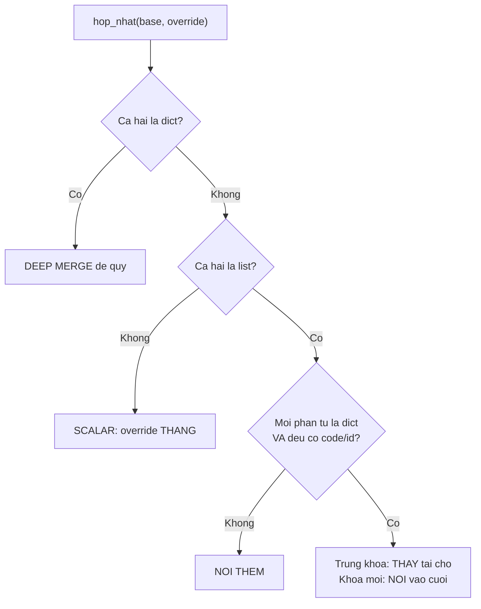
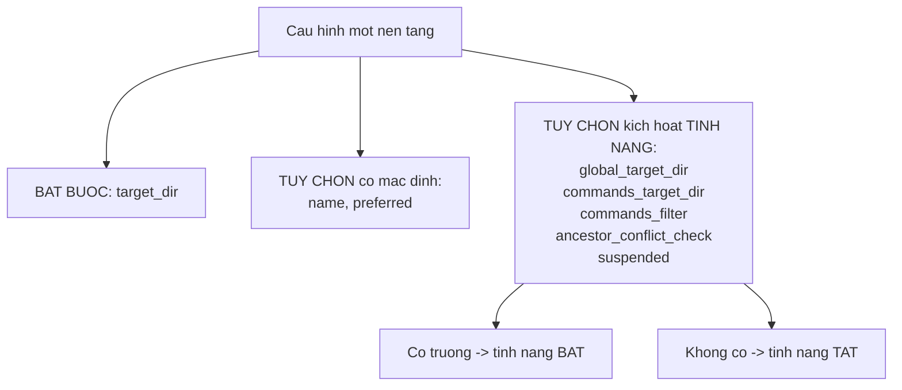
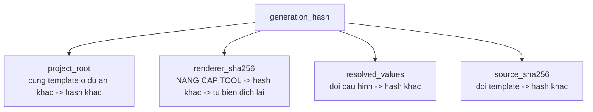
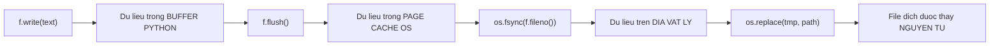
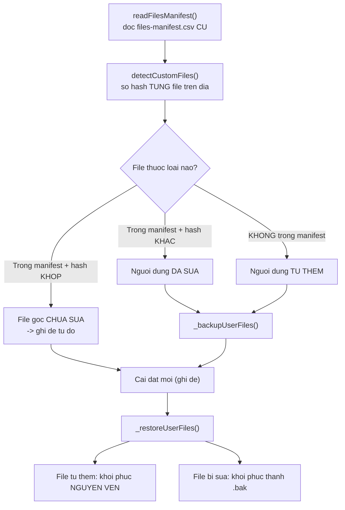

# 06 — Bảy mẫu hình tái sử dụng

> [← Mục lục](./index.md) · Trước: [05](./05-tang-chat-luong.md) · Tiếp: [07 — Áp dụng vào dự án của bạn](./07-ap-dung-vao-du-an-cua-ban.md)

★ **Phần quan trọng nhất của bộ tài liệu này.** Mỗi mẫu hình gồm: bài toán → mã thật của BMAD → cách áp dụng nơi khác → đánh đổi.

---

## Tổng quan

| # | Mẫu hình | Bài toán nó giải | Độ khó mượn |
| --- | --- | --- | --- |
| 1 | [Hợp nhất cấu hình nhiều lớp](#1-hợp-nhất-cấu-hình-nhiều-lớp) | Override team/user không fork | ⭐ Dễ |
| 2 | [Kiến trúc hướng cấu hình](#2-kiến-trúc-hướng-cấu-hình) | Hỗ trợ N nền tảng không phình mã | ⭐⭐ Trung bình |
| 3 | [Snapshot bất biến định danh bằng hash](#3-snapshot-bất-biến-định-danh-bằng-hash) | Cache + kiểm chứng + tất định | ⭐⭐⭐ Khó |
| 4 | [Registry rule-based cho validator](#4-registry-rule-based-cho-validator) | Kiểm tra chất lượng mở rộng được | ⭐ Dễ |
| 5 | [Nhật ký chỉ-nối-thêm ghi nguyên tử](#5-nhật-ký-chỉ-nối-thêm-ghi-nguyên-tử) | Audit trail đáng tin | ⭐ Dễ |
| 6 | [Bọc thư viện với lazy-load](#6-bọc-thư-viện-với-lazy-load) | Khởi động nhanh + dễ thay thế | ⭐ Dễ |
| 7 | [Bảo toàn dữ liệu người dùng khi cập nhật](#7-bảo-toàn-dữ-liệu-người-dùng-khi-cập-nhật) | Cập nhật không phá tùy biến | ⭐⭐ Trung bình |

---

## 1. Hợp nhất cấu hình nhiều lớp

### 1.1 Bài toán

Công cụ của bạn có cấu hình mặc định. Nhóm muốn override một số thứ. Cá nhân muốn override tiếp. **Và bạn không muốn ai phải fork.**

Cách làm sai phổ biến:

```javascript
// ❌ Object.assign nông — mảng bị thay thế, table lồng nhau bị mất
const config = Object.assign({}, defaults, teamConfig, userConfig);

// ❌ Deep merge thư viện — mảng gộp theo index, vô nghĩa với mảng object
const config = _.merge({}, defaults, teamConfig, userConfig);
```

### 1.2 Mã của BMAD

📖 `src/scripts/config_utils.py:80-90`

```python
def structural_merge(base: Any, override: Any) -> Any:
    """Merge tables recursively, keyed table arrays by identity, and append other arrays."""
    if isinstance(base, dict) and isinstance(override, dict):
        result = dict(base)
        for key, value in override.items():
            result[key] = structural_merge(result[key], value) if key in result else value
        return result
    if isinstance(base, list) and isinstance(override, list):
        return _merge_arrays(base, override)
    return override
```

📖 `src/scripts/config_utils.py:37-77`

```python
_KEYED_MERGE_FIELDS = ("code", "id")

def _detect_keyed_merge_field(items):
    if not items or not all(isinstance(item, dict) for item in items):
        return None
    for candidate in _KEYED_MERGE_FIELDS:
        if all(candidate in item for item in items):
            for item in items:
                value = item[candidate]
                if not isinstance(value, str):
                    raise ConfigError(f"keyed array identifier `{candidate}` must be a string, got {type(value).__name__}")
                if not value:
                    raise ConfigError(f"keyed array identifier `{candidate}` must not be empty")
            return candidate
    return None


def _merge_arrays(base, override):
    keyed_field = _detect_keyed_merge_field(base + override)
    if keyed_field is None:
        return list(base) + list(override)

    result, index_by_key = [], {}
    for item in base:
        copied = dict(item)
        index_by_key[copied[keyed_field]] = len(result)
        result.append(copied)
    for item in override:
        copied = dict(item)
        key = copied[keyed_field]
        if key in index_by_key:
            result[index_by_key[key]] = copied     # thay TẠI CHỖ
        else:
            index_by_key[key] = len(result)
            result.append(copied)
    return result
```

### 1.3 ⭐ Quy tắc theo kiểu dữ liệu



| Kiểu | Hành vi | Ngữ nghĩa người dùng |
| --- | --- | --- |
| Scalar | Override thắng | "Đổi giá trị này" |
| Table | Deep merge | "Chỉ đổi trường tôi ghi" |
| Mảng thường | Nối thêm | "Bổ sung vào danh sách" |
| Mảng bảng có khóa | Thay theo khóa | "Sửa mục cụ thể này" |

⭐ **Điểm mấu chốt:** bốn hành vi khớp với **bốn ý định khác nhau** của người dùng. Không phải một quy tắc áp cho tất cả.

### 1.4 Bản port sang JavaScript

```javascript
const KEYED_MERGE_FIELDS = ['code', 'id'];

function detectKeyedMergeField(items) {
  if (items.length === 0) return null;
  if (!items.every((i) => i !== null && typeof i === 'object' && !Array.isArray(i))) return null;
  for (const candidate of KEYED_MERGE_FIELDS) {
    if (items.every((i) => candidate in i)) {
      for (const item of items) {
        const v = item[candidate];
        if (typeof v !== 'string') {
          throw new TypeError(`keyed array identifier \`${candidate}\` must be a string, got ${typeof v}`);
        }
        if (!v) {
          throw new TypeError(`keyed array identifier \`${candidate}\` must not be empty`);
        }
      }
      return candidate;
    }
  }
  return null;
}

function mergeArrays(base, override) {
  const keyedField = detectKeyedMergeField([...base, ...override]);
  if (keyedField === null) return [...base, ...override];

  const result = [];
  const indexByKey = new Map();
  for (const item of base) {
    const copied = { ...item };
    indexByKey.set(copied[keyedField], result.length);
    result.push(copied);
  }
  for (const item of override) {
    const copied = { ...item };
    const key = copied[keyedField];
    if (indexByKey.has(key)) result[indexByKey.get(key)] = copied;
    else {
      indexByKey.set(key, result.length);
      result.push(copied);
    }
  }
  return result;
}

export function structuralMerge(base, override) {
  const isPlainObject = (v) => v !== null && typeof v === 'object' && !Array.isArray(v);

  if (isPlainObject(base) && isPlainObject(override)) {
    const result = { ...base };
    for (const [key, value] of Object.entries(override)) {
      result[key] = key in result ? structuralMerge(result[key], value) : value;
    }
    return result;
  }
  if (Array.isArray(base) && Array.isArray(override)) return mergeArrays(base, override);
  return override;
}

export function mergeLayers(layers) {
  return layers.reduce((acc, layer) => structuralMerge(acc, layer), {});
}
```

### 1.5 Cách áp dụng

```javascript
// Ví dụ: công cụ lint có 3 lớp cấu hình
const config = mergeLayers([
  loadJson('./defaults.json'),                    // mặc định của tool
  loadJson('./.mytool.json'),                     // cấu hình dự án (commit)
  loadJson('./.mytool.local.json'),               // cá nhân (gitignore)
]);
```

Người dùng viết override **thưa**:

```json
{
  "rules": [
    { "id": "no-console", "severity": "off" }
  ]
}
```

Mặc định có 40 rule, người dùng chỉ ghi 1 — rule `no-console` bị thay, 39 rule kia giữ nguyên, **thứ tự không đổi**.

### 1.6 ⚠️ Đánh đổi

| Được | Mất |
| --- | --- |
| Người dùng viết override thưa | Phải học 4 quy tắc |
| Không ai fork | Mảng thường **không xóa được** mục base |
| Thứ tự ổn định | Thay mục là **thay toàn bộ**, không merge từng trường |
| Thêm lớp dễ | Thiếu `code` ở một mục làm đổi toàn bộ hành vi |

⚠️ **Cạm bẫy lớn nhất:** thiếu khóa ở **một** phần tử ⇒ toàn mảng thành mảng thường. Nên:

- Validate sớm và báo lỗi rõ (BMAD làm)
- Ghi vào tài liệu bằng **ví dụ**, không chỉ mô tả

---

## 2. Kiến trúc hướng cấu hình

### 2.1 Bài toán

Công cụ phải hỗ trợ N target khác nhau (IDE, nền tảng deploy, định dạng xuất). Cách làm sai:

```javascript
// ❌ Một class mỗi target — 50 class, 90% giống nhau
class ClaudeCodeSetup extends BaseSetup { /* ... */ }
class CursorSetup extends BaseSetup { /* ... */ }
class CodexSetup extends BaseSetup { /* ... */ }
// ... 47 class nữa
```

### 2.2 Mã của BMAD

📖 `tools/installer/ide/platform-codes.yaml`

```yaml
platforms:
  claude-code:
    name: "Claude Code"
    preferred: true
    installer:
      target_dir: .claude/skills
      global_target_dir: ~/.claude/skills

  cursor:
    name: "Cursor"
    preferred: true
    installer:
      target_dir: .agents/skills
      global_target_dir: ~/.agents/skills

  github-copilot:
    name: "GitHub Copilot"
    preferred: true
    installer:
      target_dir: .agents/skills
      global_target_dir: ~/.agents/skills
      commands_target_dir: .github/agents
      commands_extension: .agent.md
      commands_body_template: "LOAD the FULL {project-root}/{target_dir}/{canonicalId}/SKILL.md, ..."
      commands_filter: agents-only

  ona:
    name: "Ona"
    preferred: false
    installer:
      target_dir: .ona/skills
      # không có global_target_dir — nền tảng này chỉ hỗ trợ cấp dự án
```

**Một** class `ConfigDrivenIdeSetup` (972 dòng) xử lý **tất cả ~50 nền tảng**.

### 2.3 ⭐ Ba tầng cấu hình



⭐ **Sự hiện diện của trường là công tắc.** Không cần `supports_global: true` riêng.

```javascript
// Trong _config-driven.js — kiểm tra sự hiện diện, không phải giá trị boolean
if (platformConfig.installer.commands_target_dir) {
  await this.generateCommandFiles(/* ... */);
}
```

### 2.4 ⭐⭐ Tín hiệu cấu hình thắng quy ước đặt tên

Chú thích trong `platform-codes.yaml`:

```yaml
# The Custom Agents picker should only show persona agents (not
# workflows/tools). Detected by reading each skill's source
# `customize.toml` and checking for an `[agent]` section — that's
# the actual configuration source of truth... This signal is
# naming-independent, so personas like `bmad-tea` (which doesn't
# follow the `-agent-` convention) are still included, and
# meta-skills like `bmad-agent-builder` (which contains `-agent-`
# but is a skill-builder workflow, not a persona) are correctly
# excluded.
commands_filter: agents-only
```

| Cách phân loại | `bmad-tea` (là persona) | `bmad-agent-builder` (là workflow) |
| --- | --- | --- |
| Theo tên (chứa `-agent-`) | ❌ Bỏ sót | ❌ Thêm nhầm |
| Theo `[agent]` trong `customize.toml` | ✅ Đúng | ✅ Đúng |

⭐⭐ **Bài học tổng quát: đừng suy ra loại từ tên. Đọc cấu hình.**

### 2.5 Cách áp dụng

Ví dụ: công cụ deploy hỗ trợ nhiều nền tảng.

```yaml
# platforms.yaml
platforms:
  vercel:
    name: "Vercel"
    preferred: true
    deploy:
      config_file: vercel.json
      build_command: "npm run build"
      output_dir: .vercel/output

  netlify:
    name: "Netlify"
    preferred: true
    deploy:
      config_file: netlify.toml
      build_command: "npm run build"
      output_dir: dist
      redirects_file: _redirects        # ← chỉ Netlify có

  cloudflare-pages:
    name: "Cloudflare Pages"
    deploy:
      config_file: wrangler.toml
      build_command: "npm run build"
      output_dir: dist
      functions_dir: functions          # ← chỉ CF có
      compat_date_required: true        # ← chỉ CF có
```

```javascript
class ConfigDrivenDeploy {
  constructor(platformConfig) {
    this.cfg = platformConfig.deploy;
  }

  async deploy(projectDir) {
    await this.writeConfigFile(projectDir);
    await this.runBuild(projectDir);

    // Tính năng bật/tắt theo SỰ HIỆN DIỆN của trường
    if (this.cfg.redirects_file) await this.writeRedirects(projectDir);
    if (this.cfg.functions_dir) await this.copyFunctions(projectDir);
    if (this.cfg.compat_date_required) await this.injectCompatDate(projectDir);

    await this.upload(projectDir);
  }
}
```

Thêm nền tảng mới = thêm ~6 dòng YAML.

### 2.6 ⚠️ Đánh đổi

| Được | Mất |
| --- | --- |
| Thêm target = thêm dữ liệu, không sửa mã | Class trung tâm phình dần (972 dòng) |
| Mọi target hành xử nhất quán | Target quá đặc thù khó nhét vừa |
| Người ngoài đóng góp target dễ | Cần tài liệu tốt cho schema cấu hình |
| Test một class thay vì N class | Debug khó hơn — phải biết cấu hình nào đang active |

⚠️ **Khi nào KHÔNG dùng:** nếu các target khác nhau > 50% hành vi, hướng-cấu-hình biến thành một đống `if` khó đọc. Lúc đó strategy pattern tốt hơn.

---

## 3. Snapshot bất biến định danh bằng hash

### 3.1 Bài toán

Bạn có template cần "biên dịch" với dữ liệu runtime. Cần:

- Không biên dịch lại khi không có gì đổi (cache)
- Biết chắc phiên bản đã biên dịch **không bị sửa** (kiểm chứng)
- Cùng đầu vào ⇒ cùng đầu ra (tất định)
- Nhiều tiến trình chạy song song không đạp nhau (nguyên tử)

### 3.2 Mã của BMAD

📖 `src/scripts/render_skill.py:340-380`

```python
identity = {
    "project_root": str(project_root),
    "renderer_sha256": renderer_hash,      # hash CỦA CHÍNH FILE NÀY
    "resolved_values": input_values,
    "source_sha256": source_hashes,
}
generation_hash = _hash_bytes(_canonical_json(identity))[:20]

destination = (
    project_root / "_bmad" / "render" / skill_dir.name
    / f"{slug}-{root_hash}" / generation_hash
)
```

```python
def _canonical_json(value: Any) -> bytes:
    return json.dumps(
        value, ensure_ascii=False, sort_keys=True, separators=(",", ":")
    ).encode("utf-8")
```

📖 `src/scripts/render_skill.py:293-317`

```python
def _publish(destination, outputs, manifest) -> None:
    destination.parent.mkdir(parents=True, exist_ok=True)
    if destination.exists():
        _verify_existing(destination, manifest)
        return
    staging = Path(tempfile.mkdtemp(prefix=".staging-", dir=destination.parent))
    try:
        for name, content in outputs.items():
            path = staging / name
            path.parent.mkdir(parents=True, exist_ok=True)
            path.write_bytes(content)
        (staging / "manifest.json").write_bytes(...)
        try:
            os.rename(staging, destination)
        except OSError:
            if destination.exists():
                _verify_existing(destination, manifest)
            else:
                raise
    finally:
        if staging.exists():
            shutil.rmtree(staging, ignore_errors=True)
```

### 3.3 ⭐⭐ Bốn thành phần của identity



⭐⭐ **`renderer_sha256` là thành phần tinh tế nhất.** Nó làm cache **tự vô hiệu** khi logic biên dịch đổi — không cần cơ chế version riêng, không cần nhớ bump version.

### 3.4 ⭐ Ba kỹ thuật đảm bảo tất định

```python
# 1. sorted() — rglob không đảm bảo thứ tự
for candidate in sorted(skill_dir.rglob("*.md")):

# 2. as_posix() — Windows dùng \, POSIX dùng /
name = candidate.relative_to(skill_dir).as_posix()

# 3. JSON chuẩn hóa
json.dumps(value, sort_keys=True, separators=(",", ":"))
```

⚠️ Thiếu bất kỳ cái nào, hash sẽ khác giữa các lần chạy hoặc giữa các máy.

### 3.5 Bản port sang JavaScript

```javascript
import crypto from 'node:crypto';
import fs from 'node:fs/promises';
import path from 'node:path';
import os from 'node:os';

const hashBytes = (buf) => crypto.createHash('sha256').update(buf).digest('hex');

// JSON chuẩn hóa: sắp khóa đệ quy, không khoảng trắng
function canonicalJson(value) {
  const sortDeep = (v) => {
    if (Array.isArray(v)) return v.map(sortDeep);
    if (v !== null && typeof v === 'object') {
      return Object.fromEntries(Object.keys(v).sort().map((k) => [k, sortDeep(v[k])]));
    }
    return v;
  };
  return Buffer.from(JSON.stringify(sortDeep(value)), 'utf8');
}

async function publishAtomic(destination, outputs, manifest) {
  await fs.mkdir(path.dirname(destination), { recursive: true });

  try {
    await fs.access(destination);
    await verifyExisting(destination, manifest);   // đã có → verify rồi thôi
    return;
  } catch { /* chưa có → tiếp tục */ }

  // ⭐ staging PHẢI cùng thư mục cha — rename chỉ nguyên tử trong cùng filesystem
  const staging = await fs.mkdtemp(path.join(path.dirname(destination), '.staging-'));
  try {
    for (const [name, content] of Object.entries(outputs)) {
      const p = path.join(staging, name);
      await fs.mkdir(path.dirname(p), { recursive: true });
      await fs.writeFile(p, content);
    }
    await fs.writeFile(
      path.join(staging, 'manifest.json'),
      JSON.stringify(manifest, null, 2) + '\n',
    );
    try {
      await fs.rename(staging, destination);
    } catch (err) {
      // Tiến trình khác vừa tạo xong → verify thay vì lỗi
      try {
        await fs.access(destination);
        await verifyExisting(destination, manifest);
      } catch {
        throw err;
      }
    }
  } finally {
    await fs.rm(staging, { recursive: true, force: true });
  }
}

async function verifyExisting(destination, manifest) {
  const raw = await fs.readFile(path.join(destination, 'manifest.json'), 'utf8');
  const existing = JSON.parse(raw);

  // Tầng 1: manifest khớp tuyệt đối
  if (canonicalJson(existing).toString() !== canonicalJson(manifest).toString()) {
    throw new Error(`generation collision or corruption at ${destination}`);
  }

  // Tầng 2: tập file BẰNG NHAU
  const expected = new Set([...Object.keys(manifest.outputs), 'manifest.json']);
  const actual = new Set(await listFilesRecursive(destination));
  if (expected.size !== actual.size || [...expected].some((f) => !actual.has(f))) {
    throw new Error(`generation contains unexpected or missing files: ${destination}`);
  }

  // Tầng 3: hash từng file
  for (const [name, expectedHash] of Object.entries(manifest.outputs)) {
    const actualHash = hashBytes(await fs.readFile(path.join(destination, name)));
    if (actualHash !== expectedHash) {
      throw new Error(`generation output hash mismatch: ${path.join(destination, name)}`);
    }
  }
}
```

### 3.6 Cách áp dụng

Ví dụ: build cache cho một trình biên dịch template.

```javascript
const identity = {
  projectRoot: process.cwd(),
  compilerSha256: hashBytes(await fs.readFile(import.meta.filename)),  // ⭐
  resolvedConfig: config,
  sourceSha256: Object.fromEntries(
    Object.entries(sources).map(([k, v]) => [k, hashBytes(Buffer.from(v))]),
  ),
};
const generationHash = hashBytes(canonicalJson(identity)).slice(0, 20);
const dest = path.join('.cache', 'build', slug, generationHash);

await publishAtomic(dest, compiledOutputs, {
  schemaVersion: 1,
  inputs: identity,
  outputs: Object.fromEntries(
    Object.entries(compiledOutputs).map(([k, v]) => [k, hashBytes(v)]),
  ),
});
```

### 3.7 ⚠️ Đánh đổi

| Được | Mất |
| --- | --- |
| Cache miễn phí, không cần invalidation thủ công | Thư mục cache phình theo số generation |
| Phát hiện được sửa đổi ngoài ý muốn | Chi phí hash mọi lần chạy |
| Tự vô hiệu khi tool nâng cấp | Phải nhớ **mọi** đầu vào ảnh hưởng kết quả |
| Chịu được nhiều tiến trình | Phức tạp hơn cache thường đáng kể |

⚠️ **Rủi ro lớn nhất: quên một đầu vào.** Nếu kết quả phụ thuộc biến môi trường mà bạn không đưa vào identity, cache sẽ trả kết quả sai. BMAD giải bằng cách đưa cả `renderer_sha256` — nhưng biến môi trường vẫn là điểm mù.

**Cần dọn định kỳ:**

```bash
rm -rf .cache/build/*/    # snapshot là cache thuần, xóa không mất dữ liệu
```

---

## 4. Registry rule-based cho validator

### 4.1 Bài toán

Cần kiểm tra chất lượng với nhiều quy tắc, mỗi quy tắc có mức nghiêm trọng riêng, và cần chạy ở nhiều nơi (terminal, CI, JSON).

### 4.2 Mã của BMAD

📖 `tools/validate-skills.js`

```javascript
const SEVERITY_ORDER = { CRITICAL: 0, HIGH: 1, MEDIUM: 2, LOW: 3 };

function validateSkill(skillDir) {
  const findings = [];

  if (!fs.existsSync(skillMdPath)) {
    findings.push({
      rule: 'SKILL-01',
      title: 'SKILL.md Must Exist',
      severity: 'CRITICAL',
      file: 'SKILL.md',
      detail: 'SKILL.md not found in skill directory.',
      fix: 'Create SKILL.md as the skill entrypoint.',
    });
    // Cannot check SKILL-02 through SKILL-07 without SKILL.md
    return findings;
  }
  // ... các kiểm tra khác
  return findings;
}
```

### 4.3 ⭐ Sáu trường của một finding

| Trường | Bắt buộc | Vai trò |
| --- | --- | --- |
| `rule` | ✅ | Mã ổn định để tra cứu, grep, suppress |
| `title` | ✅ | Tên người đọc được |
| `severity` | ✅ | CRITICAL / HIGH / MEDIUM / LOW |
| `file` | ✅ | Đường dẫn **tương đối** |
| `detail` | ✅ | Sai gì, cụ thể |
| `fix` | ✅ | ⭐ **Sửa thế nào** |
| `line` | ❌ | Số dòng nếu có |

⭐ **`fix` là bắt buộc** — đây là điểm khác biệt lớn nhất so với validator thông thường.

### 4.4 Bản dùng registry tường minh (mở rộng hơn)

BMAD viết các check nội tuyến trong một hàm dài. Nếu bạn muốn dễ mở rộng hơn:

```javascript
const RULES = [
  {
    id: 'CFG-01',
    title: 'Config file must exist',
    severity: 'CRITICAL',
    blocksFurtherChecks: true,               // ⭐ fail-fast có kiểm soát
    check(ctx) {
      if (!ctx.fs.existsSync(ctx.configPath)) {
        return [{
          file: path.basename(ctx.configPath),
          detail: 'Config file not found.',
          fix: `Create ${path.basename(ctx.configPath)} at the project root.`,
        }];
      }
      return [];
    },
  },
  {
    id: 'CFG-02',
    title: 'Name must be kebab-case',
    severity: 'HIGH',
    check(ctx) {
      if (!/^[a-z0-9]+(-[a-z0-9]+)*$/.test(ctx.config.name ?? '')) {
        return [{
          file: path.basename(ctx.configPath),
          detail: `name "${ctx.config.name}" is not kebab-case.`,
          fix: 'Rename to lowercase with single hyphens, e.g. "my-project".',
        }];
      }
      return [];
    },
  },
];

function runRules(ctx) {
  const findings = [];
  for (const rule of RULES) {
    const results = rule.check(ctx);
    for (const r of results) {
      findings.push({ rule: rule.id, title: rule.title, severity: rule.severity, ...r });
    }
    if (results.length > 0 && rule.blocksFurtherChecks) break;   // ⭐
  }
  return findings;
}
```

### 4.5 ⭐ Ba đầu ra từ một mã

```javascript
const STRICT = process.argv.includes('--strict');
const JSON_OUTPUT = process.argv.includes('--json');

// ...

if (JSON_OUTPUT) {
  console.log(JSON.stringify({ findings, summary }, null, 2));
} else {
  if (process.env.GITHUB_ACTIONS) {
    for (const f of findings) {
      const level = f.severity === 'LOW' ? 'notice' : 'warning';
      console.log(`::${level} file=${f.file},line=${f.line || 1}::${escapeAnnotation(`${f.rule}: ${f.detail}`)}`);
    }
  }
  if (process.env.GITHUB_STEP_SUMMARY) {
    fs.appendFileSync(process.env.GITHUB_STEP_SUMMARY, buildMarkdownTable(findings));
  }
  console.log(humanReadable(findings, summary));
}

const hasHighPlus = findings.some((f) => f.severity === 'CRITICAL' || f.severity === 'HIGH');
process.exit(STRICT && hasHighPlus ? 1 : 0);
```

⭐ **`escapeAnnotation` là chi tiết dễ quên:**

```javascript
function escapeAnnotation(str) {
  return str.replaceAll('%', '%25').replaceAll('\r', '%0D').replaceAll('\n', '%0A');
}
```

GitHub Actions dùng `%`, `\r`, `\n` làm ký tự điều khiển. Không escape thì annotation vỡ.

### 4.6 ⭐ Chiến lược áp dụng dần

📖 `tools/validate-file-refs.js:24-26`

```javascript
/**
 * Default mode is warning-only (exit 0) so adoption is non-disruptive.
 * Use --strict when you want CI or pre-commit to enforce valid references.
 */
```


### 4.7 ⚠️ Đánh đổi

| Được | Mất |
| --- | --- |
| Thêm quy tắc = thêm một object | Mã dài dần nếu không tách file |
| Mỗi finding có `fix` ⇒ dùng được ngay | Viết `fix` tốn công hơn viết `detail` |
| Chạy được ở 3 nơi | Phải test cả 3 đầu ra |
| Áp dụng dần được | Giai đoạn warning có thể kéo dài mãi nếu không ai bật `--strict` |

---

## 5. Nhật ký chỉ-nối-thêm ghi nguyên tử

### 5.1 Bài toán

Cần ghi lại tiến trình một phiên làm việc dài, chịu được:

- Tiến trình bị kill giữa chừng
- Nhiều lần ghi liên tiếp
- Đọc lại ở phiên sau để tiếp tục

### 5.2 Mã của BMAD

📖 `src/scripts/memlog.py:118-125`

```python
def write_atomic(path: Path, text: str) -> None:
    """Temp + flush + fsync + atomic rename, so a crash never half-writes an entry."""
    tmp = path.with_suffix(path.suffix + ".tmp")
    with open(tmp, "w", encoding="utf-8") as f:
        f.write(text)
        f.flush()
        os.fsync(f.fileno())
    os.replace(tmp, path)
```

### 5.3 ⭐ Ba bước, thiếu một là hỏng



| Bỏ bước | Hậu quả |
| --- | --- |
| `flush()` | Mất dữ liệu khi tiến trình bị kill |
| `fsync()` | Mất dữ liệu khi mất điện |
| `os.replace()` | Trên Windows, `rename` không ghi đè được |

⭐ `os.replace` (không phải `os.rename`) — nó **ghi đè được** trên mọi nền tảng.

### 5.4 ⭐ Ba bất biến trong docstring

📖 `src/scripts/memlog.py:16-32`

```python
"""
Three invariants make it trustworthy:

  1. Append-only, chronological. Entries land at the end, in the order they happen.
     Nothing is ever inserted backward, reordered, edited, or removed. There is no
     edit or delete subcommand by design; history is never rewritten.
  2. Write-only / blind. Every command is an atomic, context-free write and echoes the
     new state as one line of JSON, so the caller never re-reads the file mid-session.
  3. No lifecycle status. A memory log has no "complete" flag. Whether the work is done,
     blocked, or paused is itself a fact that happened, so it is recorded as an entry
     ... never as frontmatter the log would have to mutate.
"""
```

⭐ **Bất biến 2 rất quan trọng cho công cụ LLM gọi:**

```python
def ack(path: Path, body: str) -> None:
    """Echo new state so the caller never re-reads the file to know where it stands."""
    print(json.dumps({"ok": True, "memlog": str(path), "entries": entry_count(body)}))
```

Nếu không echo, LLM phải đọc lại file sau mỗi lần ghi ⇒ tốn ngữ cảnh khủng khiếp.

### 5.5 Bản port sang JavaScript

```javascript
import fs from 'node:fs/promises';
import fsSync from 'node:fs';

export async function writeAtomic(filePath, text) {
  const tmp = `${filePath}.tmp`;
  const fh = await fs.open(tmp, 'w');
  try {
    await fh.writeFile(text, 'utf8');
    await fh.sync();                       // ⭐ tương đương fsync
  } finally {
    await fh.close();
  }
  await fs.rename(tmp, filePath);          // ⭐ Node rename ghi đè được
}

export async function appendEntry(filePath, { type, by, text }) {
  const raw = await fs.readFile(filePath, 'utf8');
  const { meta, body } = splitFrontmatter(raw);

  const oneLine = text.split(/\s+/).filter(Boolean).join(' ');   // ⭐ gộp về một dòng
  let label = type || '';
  if (by) label = `${label} by ${by}`.trim();
  const tag = label ? `(${label}) ` : '';
  const entry = `- ${tag}${oneLine}`;

  const newBody = body.trim() ? `${body.replace(/\n+$/, '')}\n${entry}` : entry;

  delete meta.updated;
  meta.updated = new Date().toISOString().slice(0, 16);   // ⭐ giữ 'updated' cuối cùng

  await writeAtomic(filePath, renderFrontmatter(meta, newBody));

  // ⭐ Echo trạng thái — caller không phải đọc lại
  return { ok: true, log: filePath, entries: countEntries(newBody) };
}
```

### 5.6 ⭐ Parse frontmatter chịu được nội dung tự do

```javascript
function splitFrontmatter(text) {
  const lines = text.split('\n');
  if (lines[0] !== '---') throw new Error('no frontmatter');

  // ⭐ So sánh CHÍNH XÁC — '--- ghi chú' KHÔNG cắt cụt frontmatter
  const end = lines.findIndex((l, i) => i > 0 && l === '---');
  if (end === -1) throw new Error('frontmatter is not terminated');

  const meta = {};
  for (const line of lines.slice(1, end)) {
    const idx = line.indexOf(':');
    if (idx > 0) meta[line.slice(0, idx).trim()] = line.slice(idx + 1).trim();
  }
  return { meta, body: lines.slice(end + 1).join('\n').replace(/^\n+/, '') };
}

function renderFrontmatter(meta, body) {
  // ⭐ Vô hiệu hóa xuống dòng trong giá trị — cặp đối xứng với splitFrontmatter
  const fm = Object.entries(meta)
    .map(([k, v]) => `${k}: ${String(v).split('\n').join(' ')}`)
    .join('\n');
  return `---\n${fm}\n---\n\n${body.replace(/\n+$/, '')}\n`;
}
```

⭐ **`split` và `render` là cặp đối xứng** — cái nào cũng phải chịu được nội dung người dùng nhập tự do.

### 5.7 ⚠️ Đánh đổi

| Được | Mất |
| --- | --- |
| Không mất dữ liệu khi crash | `fsync` chậm — không dùng cho ghi tần suất cao |
| Lịch sử không viết lại được | Không sửa được mục sai (phải nối mục mới thay thế) |
| Caller không đọc lại file | File lớn dần vô hạn |
| Resume được | Cần chiến lược dọn/xoay vòng cho phiên rất dài |

⚠️ **Không dùng cho:** log ứng dụng tần suất cao (dùng thư viện log chuyên dụng), dữ liệu cần truy vấn (dùng DB).

⭐ **Dùng tốt cho:** phiên làm việc có người tham gia, audit trail quyết định, tiến trình dài cần resume.

---

## 6. Bọc thư viện với lazy-load

### 6.1 Bài toán

- Thư viện bên thứ ba là ESM, dự án của bạn là CommonJS
- Khởi động CLI chậm vì nạp thư viện nặng ngay
- Muốn thay thư viện sau này mà không sửa hàng nghìn dòng

### 6.2 Mã của BMAD

📖 `tools/installer/prompts.js:10-46`

```javascript
let _clack = null;
let _clackCore = null;
let _picocolors = null;

async function getClack() {
  if (!_clack) {
    _clack = await import('@clack/prompts');
  }
  return _clack;
}

async function getPicocolors() {
  if (!_picocolors) {
    _picocolors = (await import('picocolors')).default;
  }
  return _picocolors;
}
```

### 6.3 ⭐ Ba lợi ích

| Lợi ích | Cơ chế |
| --- | --- |
| CommonJS gọi được ESM | `await import()` thay `require()` |
| Khởi động nhanh | Nạp khi dùng, không nạp lúc `require` file |
| Cache một lần | Biến module-level |

### 6.4 ⭐ Lớp bọc là điểm thay thế

Chú thích đầu file:

```javascript
/**
 * @clack/prompts wrapper for BMAD CLI
 *
 * This module provides a unified interface for CLI prompts using @clack/prompts.
 * It replaces Inquirer.js to fix Windows arrow key navigation issues (libuv #852).
 */
```

⭐ Họ **đã** đổi thư viện một lần (Inquirer → clack). Nhờ có lớp bọc, chỉ sửa file này chứ không sửa 2.167 dòng `ui.js`.

### 6.5 ⭐ Chuẩn hóa nhiều hình dạng đầu vào

```javascript
const clackOptions = choices.map((choice) => ({
  value: choice.value === undefined ? choice.name : choice.value,
  label: choice.name || choice.label || String(choice.value),
  hint:  choice.hint  || choice.description,
}));
```

Chấp nhận `{name}`, `{value, label}`, `{value, name, description}` — caller không phải nhớ đúng tên trường.

### 6.6 ⭐ Xử lý cắt ngang tập trung

```javascript
async function handleCancel(value, message = 'Operation cancelled') {
  const clack = await getClack();
  if (clack.isCancel(value)) {
    clack.cancel(message);
    process.exit(0);        // ⭐ 0 — hủy có chủ ý KHÔNG phải lỗi
  }
}
```

Mọi prompt gọi nó ⇒ **không nơi nào trong `ui.js` phải kiểm tra hủy**.

### 6.7 Cách áp dụng

```javascript
// wrappers/http.js — bọc thư viện HTTP
let _client = null;

async function getClient() {
  if (!_client) {
    const { default: got } = await import('got');
    _client = got.extend({
      timeout: { request: 10_000 },
      retry: { limit: 2 },
      headers: { 'user-agent': 'my-tool/1.0' },
    });
  }
  return _client;
}

export async function fetchJson(url, options = {}) {
  const client = await getClient();
  try {
    return await client.get(url, { ...options }).json();
  } catch (error) {
    // ⭐ Map lỗi thư viện → lỗi domain của bạn
    if (error.code === 'ETIMEDOUT') throw new NetworkTimeoutError(url);
    if (error.response?.statusCode === 404) throw new NotFoundError(url);
    throw error;
  }
}
```

⭐ **Map lỗi thư viện sang lỗi domain** là phần quan trọng nhất — nó là thứ giữ cho việc đổi thư viện không lan ra toàn bộ mã.

### 6.8 ⚠️ Đánh đổi

| Được | Mất |
| --- | --- |
| Đổi thư viện chỉ sửa một file | Thêm một tầng gián tiếp |
| Khởi động nhanh | Mọi hàm thành `async` |
| CommonJS dùng được ESM | Không dùng được ở top-level của CJS |
| Chuẩn hóa API | Che mất tính năng nâng cao của thư viện |

⚠️ **Cạm bẫy:** bọc quá mỏng (chỉ chuyển tiếp) thì vô ích; bọc quá dày thì thành viết lại thư viện. Điểm cân bằng: **bọc API bạn thực sự dùng, map lỗi, chuẩn hóa đầu vào**.

---

## 7. Bảo toàn dữ liệu người dùng khi cập nhật

### 7.1 Bài toán

Công cụ của bạn ghi file vào dự án người dùng. Khi cập nhật, bạn phải ghi đè file của mình — **nhưng không được đụng file người dùng đã sửa hoặc tự thêm**.

### 7.2 Mã của BMAD

📖 `tools/installer/core/installer.js:787-961`

Cơ chế dựa trên `files-manifest.csv` — bảng ghi **đường dẫn + hash** của mọi file installer đã ghi.



### 7.3 ⭐⭐ Bảo đảm cấu trúc, không phải quy ước

⭐⭐ **Điểm thiết kế hay nhất:** `_bmad/custom/**` **không bao giờ** nằm trong `files-manifest.csv`.

| Cách tiếp cận | Vấn đề |
| --- | --- |
| ❌ Danh sách loại trừ hardcode | Quên thêm thư mục mới ⇒ mất dữ liệu |
| ✅ **Không ghi vào manifest** | Installer **không có lý do** chạm vào nó |

Đây là **bảo đảm cấu trúc**: installer chỉ xóa/ghi đè thứ nó biết mình đã tạo.

### 7.4 ⭐ Ba trạng thái file, ba xử lý

| Trạng thái | Cách phát hiện | Xử lý khi cập nhật |
| --- | --- | --- |
| **Của tool, chưa sửa** | Có trong manifest, hash khớp | Ghi đè tự do |
| **Của tool, đã sửa** | Có trong manifest, hash khác | Backup → khôi phục thành `.bak` |
| **Của người dùng** | Không có trong manifest | Backup → khôi phục **nguyên vẹn** |

⭐ Khôi phục **khác nhau** cho hai loại cuối:

- File người dùng tự thêm ⇒ khôi phục đúng chỗ, đúng tên
- File của tool bị sửa ⇒ khôi phục thành `.bak` để người dùng tự hợp nhất

### 7.5 Bản port sang JavaScript

```javascript
import crypto from 'node:crypto';
import fs from 'node:fs/promises';
import path from 'node:path';

const hashFile = async (p) =>
  crypto.createHash('sha256').update(await fs.readFile(p)).digest('hex');

// --- Ghi manifest sau khi cài ---
export async function writeFilesManifest(manifestPath, installedFiles, rootDir) {
  const rows = ['path,hash'];
  for (const abs of installedFiles) {
    const rel = path.relative(rootDir, abs).split(path.sep).join('/');   // ⭐ chuẩn hóa
    rows.push(`"${rel}","${await hashFile(abs)}"`);
  }
  await fs.writeFile(manifestPath, rows.join('\n') + '\n');
}

// --- Phân loại file trước khi cập nhật ---
export async function classifyFiles(rootDir, oldManifest) {
  const onDisk = await listFilesRecursive(rootDir);
  const untouched = [];
  const modified = [];
  const userAdded = [];

  for (const rel of onDisk) {
    const abs = path.join(rootDir, rel);
    const recorded = oldManifest.get(rel);
    if (!recorded) {
      userAdded.push(rel);                          // người dùng tự thêm
    } else if ((await hashFile(abs)) === recorded) {
      untouched.push(rel);                          // của tool, chưa sửa
    } else {
      modified.push(rel);                           // của tool, đã sửa
    }
  }
  return { untouched, modified, userAdded };
}

// --- Backup rồi khôi phục ---
export async function backupAndRestore(rootDir, backupDir, { modified, userAdded }, installFn) {
  await fs.mkdir(backupDir, { recursive: true });

  for (const rel of [...modified, ...userAdded]) {
    const dst = path.join(backupDir, rel);
    await fs.mkdir(path.dirname(dst), { recursive: true });
    await fs.copyFile(path.join(rootDir, rel), dst);
  }

  await installFn();     // cài đặt mới — ghi đè thoải mái

  // ⭐ File người dùng tự thêm: khôi phục NGUYÊN VẸN
  for (const rel of userAdded) {
    const dst = path.join(rootDir, rel);
    await fs.mkdir(path.dirname(dst), { recursive: true });
    await fs.copyFile(path.join(backupDir, rel), dst);
  }

  // ⭐ File của tool bị sửa: khôi phục thành .bak để người dùng tự hợp nhất
  for (const rel of modified) {
    await fs.copyFile(path.join(backupDir, rel), path.join(rootDir, `${rel}.bak`));
  }

  await fs.rm(backupDir, { recursive: true, force: true });
  return { restoredIntact: userAdded.length, savedAsBak: modified.length };
}
```

### 7.6 ⭐ Vùng an toàn tường minh

Bên cạnh cơ chế manifest, tạo một thư mục **installer không bao giờ chạm**:

```javascript
// Tạo một lần, không bao giờ ghi lại
const customDir = path.join(rootDir, 'custom');
await fs.mkdir(customDir, { recursive: true });

const gitignore = path.join(customDir, '.gitignore');
try {
  await fs.access(gitignore);
} catch {
  await fs.writeFile(gitignore, '*.local.*\n');     // ⭐ chỉ tạo nếu CHƯA có
}
```

⭐ `try { access } catch { write }` — **chỉ tạo nếu chưa có**, không ghi đè nội dung người dùng đã sửa.

### 7.7 ⚠️ Đánh đổi

| Được | Mất |
| --- | --- |
| Cập nhật không phá tùy biến | Phải hash mọi file mỗi lần cập nhật |
| Người dùng tin tưởng cập nhật | Manifest phải chính xác 100% |
| Vùng `custom/` an toàn tuyệt đối | File `.bak` tích tụ nếu không dọn |
| Phát hiện được sửa đổi | Chậm với dự án nhiều file |

⚠️ **Cạm bẫy:** nếu manifest cũ bị mất hoặc hỏng, **mọi** file trở thành "người dùng tự thêm" ⇒ không file nào bị ghi đè ⇒ cập nhật không có tác dụng. Cần xử lý riêng trường hợp manifest thiếu.

---

## Bảng tổng kết

| # | Mẫu hình | File tham chiếu | Dòng |
| --- | --- | --- | --- |
| 1 | Hợp nhất nhiều lớp | `src/scripts/config_utils.py` | 37–119 |
| 2 | Hướng cấu hình | `tools/installer/ide/platform-codes.yaml` + `_config-driven.js` | toàn bộ |
| 3 | Snapshot hash | `src/scripts/render_skill.py` | 270–380 |
| 4 | Registry validator | `tools/validate-skills.js` | 43–52, 245–570 |
| 5 | Log nguyên tử | `src/scripts/memlog.py` | 88–139 |
| 6 | Bọc lazy-load | `tools/installer/prompts.js` | 10–68 |
| 7 | Bảo toàn dữ liệu | `tools/installer/core/installer.js` | 519–668, 787–961 |

---

## Ba mẫu hình nhỏ hơn nhưng đáng mượn

### ♻️ Sentinel cho "không tìm thấy"

```python
_MISSING = object()          # KHÔNG dùng None — None có thể là giá trị hợp lệ

def extract_key(data, dotted_key):
    # ...
    return _MISSING

if value is not _MISSING:    # so sánh IDENTITY
    output[key] = value
```

### ♻️ Đi ngược cây thư mục an toàn

```python
def find_project_root(start: Path) -> Path | None:
    current = start.resolve()
    while True:
        if (current / "_bmad").exists():
            return current
        if current.parent == current:      # ⭐ chạm gốc filesystem
            return None
        current = current.parent
```

### ♻️ Map mã lỗi hệ thống sang thông báo có ngữ cảnh

```javascript
async function ensureWritableDir(dirPath, label) {
  try {
    await fs.ensureDir(dirPath);
  } catch (error) {
    if (error.code === 'EACCES') throw new Error(`${label}: permission denied creating directory: ${dirPath}`);
    if (error.code === 'ENOSPC') throw new Error(`${label}: no space left on device: ${dirPath}`);
    throw new Error(`${label}: cannot create directory: ${dirPath} (${error.message})`);
  }
}
```

`label` mô tả **vai trò** ("config directory") chứ không lặp lại đường dẫn.

---

**Tiếp:** [07 — Áp dụng vào dự án của bạn](./07-ap-dung-vao-du-an-cua-ban.md) · [← Mục lục](./index.md)
