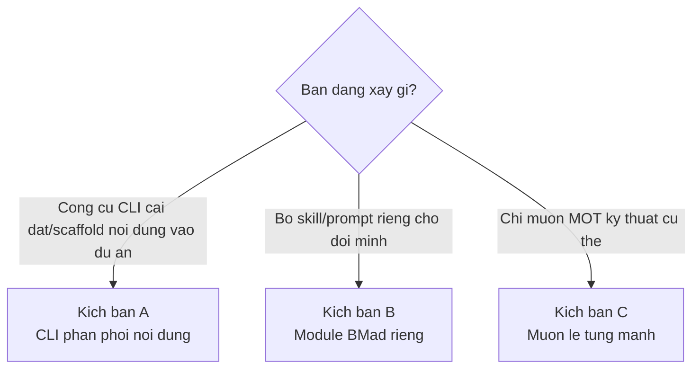
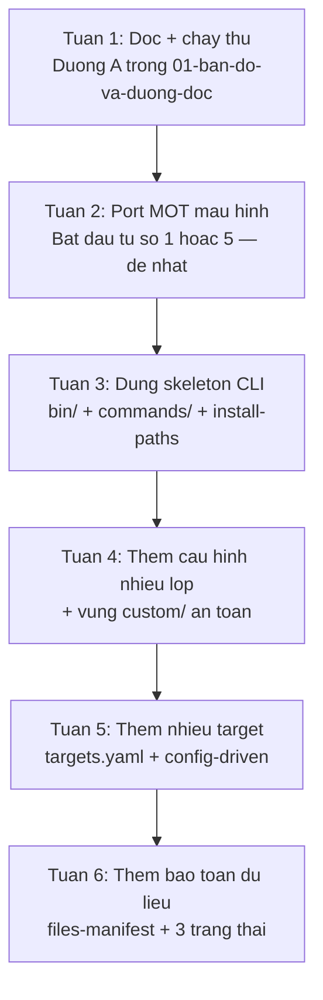

# 07 — Áp dụng vào dự án của bạn

> [← Mục lục](./index.md) · Trước: [06 — Mẫu hình tái sử dụng](./06-mau-hinh-tai-su-dung.md)

Ba kịch bản cụ thể, mỗi kịch bản kèm mã khởi đầu chạy được.

---

## Chọn kịch bản



---

# Kịch bản A — CLI phân phối nội dung

## A.1 Khi nào

Bạn xây một công cụ:

- Cài nội dung (template, cấu hình, skill, prompt) vào dự án người dùng
- Cần hỗ trợ nhiều target/nền tảng
- Người dùng muốn tùy biến mà không fork
- Cập nhật không được phá tùy biến của họ

Ví dụ thực tế: bộ scaffold nội bộ công ty, thư viện prompt cho nhóm, bộ template CI/CD.

## A.2 Mẫu hình dùng

| Mẫu | Dùng cho |
| --- | --- |
| [1 — Hợp nhất nhiều lớp](./06-mau-hinh-tai-su-dung.md#1-hợp-nhất-cấu-hình-nhiều-lớp) | Cấu hình team/user |
| [2 — Hướng cấu hình](./06-mau-hinh-tai-su-dung.md#2-kiến-trúc-hướng-cấu-hình) | Nhiều target |
| [6 — Bọc lazy-load](./06-mau-hinh-tai-su-dung.md#6-bọc-thư-viện-với-lazy-load) | Prompt CLI |
| [7 — Bảo toàn dữ liệu](./06-mau-hinh-tai-su-dung.md#7-bảo-toàn-dữ-liệu-người-dùng-khi-cập-nhật) | Cập nhật an toàn |

## A.3 Cấu trúc khởi đầu

```
my-tool/
├── package.json
├── bin/
│   └── cli.js                      ← điểm vào, nạp command động
├── src/
│   ├── commands/                   ← mỗi file một lệnh
│   │   ├── install.js
│   │   ├── status.js
│   │   └── uninstall.js
│   ├── core/
│   │   ├── config.js               ← đối tượng bất biến
│   │   ├── install-paths.js        ← MỌI đường dẫn ở đây
│   │   ├── installer.js            ← điều phối
│   │   └── manifest.js             ← ghi/đọc files-manifest
│   ├── targets/
│   │   ├── targets.yaml            ← ⭐ CHỈ DỮ LIỆU
│   │   └── config-driven.js        ← MỘT class cho MỌI target
│   ├── merge.js                    ← structural_merge
│   ├── prompts.js                  ← bọc thư viện prompt
│   └── fs-native.js                ← thay fs-extra
└── content/                        ← nội dung được phân phối
    └── ...
```

## A.4 Điểm vào — `bin/cli.js`

```javascript
#!/usr/bin/env node
const { program } = require('commander');
const path = require('node:path');
const fs = require('node:fs');
const pkg = require('../package.json');

// ⭐ Nạp command động — thêm lệnh = thêm file
const commandsDir = path.join(__dirname, '..', 'src', 'commands');
const commands = {};
for (const file of fs.readdirSync(commandsDir).filter((f) => f.endsWith('.js'))) {
  const cmd = require(path.join(commandsDir, file));
  commands[cmd.command] = cmd;
}

program.version(pkg.version).description(pkg.description);

for (const [name, cmd] of Object.entries(commands)) {
  const c = program.command(name).description(cmd.description);
  for (const opt of cmd.options || []) c.option(...opt);
  c.action(cmd.action);
}

program.parse(process.argv);

if (process.argv.slice(2).length === 0) program.outputHelp();
```

Hợp đồng mỗi file trong `commands/`:

```javascript
module.exports = {
  command: 'install',
  description: 'Install content into the current project',
  options: [
    ['-d, --directory <path>', 'Target directory (default: cwd)'],
    ['--targets <list>', 'Comma-separated target IDs'],
    ['-y, --yes', 'Accept defaults, skip prompts'],
  ],
  action: async (options) => { /* ... */ },
};
```

## A.5 Đường dẫn tập trung — `src/core/install-paths.js`

⭐ **Đây là file quan trọng nhất về mặt bảo trì.** Mọi đường dẫn ở một chỗ.

```javascript
const path = require('node:path');
const fs = require('../fs-native');

const TOOL_DIR_NAME = '.mytool';

class InstallPaths {
  static async create(config) {
    const projectRoot = path.resolve(config.directory);
    await ensureWritableDir(projectRoot, 'project root');

    const toolDir = path.join(projectRoot, TOOL_DIR_NAME);
    const isUpdate = await fs.pathExists(toolDir);

    const configDir = path.join(toolDir, '_config');
    const contentDir = path.join(toolDir, 'content');
    const customDir = path.join(toolDir, 'custom');     // ⭐ VÙNG AN TOÀN

    for (const [dir, label] of [
      [toolDir, 'tool directory'],
      [configDir, 'config directory'],
      [contentDir, 'content directory'],
      [customDir, 'customizations directory'],
    ]) {
      await ensureWritableDir(dir, label);
    }

    return new InstallPaths({ projectRoot, toolDir, configDir, contentDir, customDir, isUpdate });
  }

  constructor(props) {
    Object.assign(this, props);
    Object.freeze(this);
  }

  // ⭐ Đường dẫn dẫn xuất là PHƯƠNG THỨC, không hardcode rải rác
  manifestFile()   { return path.join(this.configDir, 'manifest.json'); }
  filesManifest()  { return path.join(this.configDir, 'files-manifest.csv'); }
  teamConfig()     { return path.join(this.toolDir, 'config.json'); }
  userConfig()     { return path.join(this.toolDir, 'config.user.json'); }
  customConfig()   { return path.join(this.customDir, 'config.json'); }
  customUserConfig() { return path.join(this.customDir, 'config.user.json'); }
}

async function ensureWritableDir(dirPath, label) {
  const stat = await fs.stat(dirPath).catch(() => null);
  if (stat && !stat.isDirectory()) throw new Error(`${label} exists but is not a directory: ${dirPath}`);
  try {
    await fs.ensureDir(dirPath);
  } catch (error) {
    if (error.code === 'EACCES') throw new Error(`${label}: permission denied creating directory: ${dirPath}`);
    if (error.code === 'ENOSPC') throw new Error(`${label}: no space left on device: ${dirPath}`);
    throw new Error(`${label}: cannot create directory: ${dirPath} (${error.message})`);
  }
  try {
    await fs.access(dirPath, fs.constants.R_OK | fs.constants.W_OK);
  } catch {
    throw new Error(`${label} is not writable: ${dirPath}`);
  }
}

module.exports = { InstallPaths, TOOL_DIR_NAME };
```

## A.6 Cấu hình 4 lớp — `src/merge.js` + loader

```javascript
// src/merge.js — bản port từ config_utils.py (xem mẫu hình 1)
const KEYED_MERGE_FIELDS = ['code', 'id'];

function detectKeyedMergeField(items) {
  if (items.length === 0) return null;
  const isPlain = (v) => v !== null && typeof v === 'object' && !Array.isArray(v);
  if (!items.every(isPlain)) return null;
  for (const candidate of KEYED_MERGE_FIELDS) {
    if (items.every((i) => candidate in i)) {
      for (const item of items) {
        const v = item[candidate];
        if (typeof v !== 'string') throw new TypeError(`keyed identifier \`${candidate}\` must be a string, got ${typeof v}`);
        if (!v) throw new TypeError(`keyed identifier \`${candidate}\` must not be empty`);
      }
      return candidate;
    }
  }
  return null;
}

function mergeArrays(base, override) {
  const key = detectKeyedMergeField([...base, ...override]);
  if (key === null) return [...base, ...override];
  const result = [];
  const idx = new Map();
  for (const item of base) {
    const c = { ...item };
    idx.set(c[key], result.length);
    result.push(c);
  }
  for (const item of override) {
    const c = { ...item };
    if (idx.has(c[key])) result[idx.get(c[key])] = c;
    else { idx.set(c[key], result.length); result.push(c); }
  }
  return result;
}

function structuralMerge(base, override) {
  const isPlain = (v) => v !== null && typeof v === 'object' && !Array.isArray(v);
  if (isPlain(base) && isPlain(override)) {
    const result = { ...base };
    for (const [k, v] of Object.entries(override)) {
      result[k] = k in result ? structuralMerge(result[k], v) : v;
    }
    return result;
  }
  if (Array.isArray(base) && Array.isArray(override)) return mergeArrays(base, override);
  return override;
}

const mergeLayers = (layers) => layers.reduce((acc, l) => structuralMerge(acc, l), {});

module.exports = { structuralMerge, mergeLayers };
```

```javascript
// src/core/load-config.js
const fs = require('../fs-native');
const { mergeLayers } = require('../merge');

async function loadJsonLayer(p, { required = false } = {}) {
  if (!(await fs.pathExists(p))) {
    if (required) throw new Error(`required config file not found: ${p}`);
    return {};
  }
  const stat = await fs.stat(p);
  if (!stat.isFile()) throw new Error(`config layer is not a file: ${p}`);
  try {
    return JSON.parse(await fs.readFile(p, 'utf8'));
  } catch (error) {
    throw new Error(`failed to parse ${p}: ${error.message}`);
  }
}

// ⭐ Bốn lớp: hai do tool sinh, hai do người dùng sở hữu
async function loadMergedConfig(paths) {
  return mergeLayers([
    await loadJsonLayer(paths.teamConfig(), { required: true }),
    await loadJsonLayer(paths.userConfig()),
    await loadJsonLayer(paths.customConfig()),
    await loadJsonLayer(paths.customUserConfig()),
  ]);
}

module.exports = { loadMergedConfig, loadJsonLayer };
```

⚠️ **Quy tắc bất di bất dịch:** `custom/` **không bao giờ** được tool ghi vào sau lần tạo thư mục đầu tiên.

## A.7 Nhiều target — `src/targets/targets.yaml`

```yaml
targets:
  vscode:
    name: "VS Code"
    preferred: true
    install:
      target_dir: .vscode
      file_extension: .json

  jetbrains:
    name: "JetBrains IDEs"
    preferred: true
    install:
      target_dir: .idea
      file_extension: .xml
      needs_xml_wrapper: true          # ⭐ chỉ JetBrains

  vim:
    name: "Vim / Neovim"
    install:
      target_dir: .vim
      file_extension: .lua
      global_target_dir: ~/.config/nvim    # ⭐ chỉ Vim hỗ trợ global
```

```javascript
// src/targets/config-driven.js — MỘT class cho MỌI target
class ConfigDrivenTarget {
  constructor(targetId, targetConfig) {
    this.id = targetId;
    this.name = targetConfig.name;
    this.cfg = targetConfig.install;
  }

  async install(projectRoot, contentDir, options = {}) {
    const dest = options.global && this.cfg.global_target_dir
      ? expandHome(this.cfg.global_target_dir)
      : path.join(projectRoot, this.cfg.target_dir);

    await fs.ensureDir(dest);

    // ⭐ Làm sạch đích TRƯỚC khi copy — chống file cũ tồn dư
    await this.cleanManagedFiles(dest);

    const written = [];
    for (const item of await this.collectContent(contentDir)) {
      let body = item.body;
      // ⭐ Tính năng bật/tắt theo SỰ HIỆN DIỆN của trường
      if (this.cfg.needs_xml_wrapper) body = wrapXml(body);

      const out = path.join(dest, item.name + this.cfg.file_extension);
      await fs.writeFile(out, body, 'utf8');
      written.push(out);
    }
    return written;
  }
}
```

```javascript
// Nạp target từ YAML
const yaml = require('js-yaml');

async function loadTargets() {
  const raw = await fs.readFile(path.join(__dirname, 'targets.yaml'), 'utf8');
  const { targets } = yaml.load(raw);
  return Object.fromEntries(
    Object.entries(targets).map(([id, cfg]) => [id, new ConfigDrivenTarget(id, cfg)]),
  );
}
```

⭐ Thêm target mới = thêm ~6 dòng YAML.

## A.8 Bảo toàn dữ liệu — `src/core/manifest.js`

Xem [mẫu hình 7](./06-mau-hinh-tai-su-dung.md#7-bảo-toàn-dữ-liệu-người-dùng-khi-cập-nhật) cho mã đầy đủ. Ba điểm phải nhớ:

| # | Điểm |
| --- | --- |
| 1 | `files-manifest.csv` ghi **đường dẫn + hash** của mọi file tool đã ghi |
| 2 | `custom/` **không bao giờ** vào manifest ⇒ tool không có lý do chạm |
| 3 | File tool bị sửa ⇒ `.bak`; file người dùng tự thêm ⇒ khôi phục nguyên vẹn |

## A.9 Checklist triển khai

- [ ] `bin/cli.js` nạp command động
- [ ] Mỗi lệnh một file trong `commands/`
- [ ] `Config` bất biến với `static build()`
- [ ] `InstallPaths` tập trung mọi đường dẫn
- [ ] `structuralMerge` cho cấu hình nhiều lớp
- [ ] Thư mục `custom/` **không bao giờ** bị tool ghi lại
- [ ] `custom/.gitignore` chỉ tạo nếu chưa có
- [ ] `targets.yaml` chứa mọi khác biệt giữa target
- [ ] **Một** class xử lý mọi target
- [ ] `files-manifest.csv` ghi đường dẫn + hash
- [ ] Cập nhật phân loại 3 trạng thái file
- [ ] `prompts.js` bọc thư viện với lazy-load
- [ ] `handleCancel` gọi `process.exit(0)` — hủy không phải lỗi
- [ ] Lỗi hệ thống map sang thông báo có `label`

---

# Kịch bản B — Module BMad riêng

## B.1 Khi nào

Bạn muốn đóng gói skill/prompt riêng cho nhóm, và **dùng chính hạ tầng BMad** để phân phối.

## B.2 Cấu trúc tối thiểu

```
my-module/
├── src/
│   ├── module.yaml                 ← hợp đồng cài đặt
│   ├── module-help.csv             ← catalog
│   └── bmad-my-skill/
│       ├── SKILL.md                ← BẮT BUỘC
│       ├── customize.toml          ← tùy chọn
│       ├── references/             ← tùy chọn
│       └── scripts/                ← tùy chọn
└── README.md
```

## B.3 `module.yaml`

```yaml
code: mymod
name: "My Team Module"
description: "Nội bộ: quy trình review và deploy của nhóm"
default_selected: false

# Biến từ Core Config tự có: user_name, project_name,
# communication_language, document_output_language, output_folder

team_name:
  prompt: "Tên nhóm của bạn?"
  default: "Platform"
  result: "{value}"

review_output:
  prompt: "Lưu báo cáo review ở đâu?"
  default: "{output_folder}/reviews"
  result: "{project-root}/{value}"

deploy_env:
  prompt: "Môi trường deploy mặc định?"
  scope: user
  default: "staging"
  result: "{value}"
  single-select:
    - value: "staging"
      label: "Staging"
    - value: "production"
      label: "Production"

# Chỉ tạo thư mục thực sự cần lúc cài
directories:
  - "{review_output}"
```

## B.4 `SKILL.md`

```markdown
---
name: bmad-my-skill
description: 'Chạy quy trình review nội bộ của nhóm Platform theo checklist đã chuẩn hoá. Use when the user says "review nội bộ", "team review", hoặc "chạy checklist review".'
---

# My Team Review

## Overview

Bạn chạy quy trình review nội bộ của nhóm Platform...

## Conventions

- Bare paths (e.g. `references/checklist.md`) resolve from `{skill-root}` (where `customize.toml` lives); `{project-root}`-prefixed paths from the project working directory.
- `{workflow.<name>}` resolves to fields in the merged `customize.toml` `[workflow]` table.

## On Activation

1. Resolve customization: `uv run {project-root}/_bmad/scripts/resolve_customization.py --skill {skill-root} --key workflow`. On failure, read `{skill-root}/customize.toml` directly and use defaults.
2. Run each `{workflow.activation_steps_prepend}` entry. Treat each `{workflow.persistent_facts}` entry as foundational context (`file:`-prefixed entries are paths/globs under `{project-root}` — load their contents; others are facts verbatim).
3. Resolve central config: `uv run {project-root}/_bmad/scripts/resolve_config.py --project-root {project-root}`. From the merged JSON read `{user_name}`, `{communication_language}`, and `modules.mymod.review_output`. On failure or missing values → neutral defaults; never block.
4. Greet `{user_name}` in `{communication_language}` and stay in it.
5. Run each `{workflow.activation_steps_append}` entry.

## Quy trình

...
```

⚠️ **Ba quy tắc bắt buộc** (validator kiểm):

| Quy tắc | Nội dung |
| --- | --- |
| SKILL-04 | `name` khớp `^bmad-[a-z0-9]+(-[a-z0-9]+)*$` |
| SKILL-05 | `name` **khớp chính xác tên thư mục** |
| SKILL-06 | `description` ≤ 1024 ký tự, nêu **cả** *làm gì* **và** *khi nào dùng* |

## B.5 `customize.toml`

```toml
# DO NOT EDIT -- overwritten on every update.
#
# Workflow customization surface for bmad-my-skill.
#
# Override files (not edited here):
#   {project-root}/_bmad/custom/bmad-my-skill.toml         (team)
#   {project-root}/_bmad/custom/bmad-my-skill.user.toml    (personal)

[workflow]

# --- Configurable below. Overrides merge per BMad structural rules: ---
#   scalars: override wins • plain arrays: append
#   arrays of tables keyed by `code`: matching key replaces, new keys append

activation_steps_prepend = []
activation_steps_append = []

# Sự thật giữ suốt phiên. Entry prefixed `file:` là path/glob dưới
# {project-root} — nội dung được nạp làm facts. Còn lại là câu nguyên văn.
persistent_facts = [
  "file:{project-root}/**/project-context.md",
]

# Chạy sau khi hoàn tất. Rỗng = không làm gì thêm.
on_complete = ""

# ---------------------------------------------------------------------------
# Các bước của checklist. Keyed by `code`: override cùng code THAY THẾ,
# code mới NỐI THÊM. `instruction` rỗng = TẮT bước đó.
# ---------------------------------------------------------------------------

[[workflow.steps]]
code = "security"
name = "Rà soát bảo mật"
applies_to = "any"
instruction = "Load `references/security.md` from the skill root and follow it."

[[workflow.steps]]
code = "performance"
name = "Rà soát hiệu năng"
applies_to = "code"
when = "Thay đổi chạm đường xử lý request hoặc truy vấn DB."
instruction = "Load `references/performance.md` from the skill root and follow it."
```

## B.6 `module-help.csv`

```csv
module,skill,display-name,menu-code,description,action,args,phase,preceded-by,followed-by,required,output-location,outputs
My Team Module,_meta,,,,,,,,,false,https://wiki.congty.vn/platform/llms.txt,
My Team Module,bmad-my-skill,Team Review,TR,"Chạy quy trình review nội bộ theo checklist chuẩn hoá của nhóm Platform.",,[path],anytime,,,false,{review_output},báo cáo review
```

## B.7 Đăng ký và cài

**Cách 1 — từ đường dẫn cục bộ:**

```bash
npx bmad-method install --custom-source /duong/dan/toi/my-module
```

**Cách 2 — từ Git:**

```bash
npx bmad-method install --custom-source https://git.congty.vn/platform/my-module
```

## B.8 Kiểm chứng

```bash
R="$(pwd)"

# Skill đã đăng ký?
grep "bmad-my-skill" _bmad/_config/skill-manifest.csv

# Đã vào catalog trợ giúp?
grep "bmad-my-skill" _bmad/_config/bmad-help.csv

# Cấu hình module có đúng?
uv run _bmad/scripts/resolve_config.py -p "$R" -k modules.mymod

# Tùy biến phân giải được?
uv run _bmad/scripts/resolve_customization.py \
  -s "$R/.claude/skills/bmad-my-skill" -p "$R" -k workflow

# Skill đã vào thư mục IDE?
ls .claude/skills/bmad-my-skill/
```

## B.9 Chạy validator trước khi phát hành

```bash
# Clone BMAD để mượn validator
git clone https://github.com/bmad-code-org/BMAD-METHOD.git /tmp/bmad
cd /tmp/bmad && npm ci

# Chạy trên skill của bạn
node tools/validate-skills.js --json /duong/dan/toi/my-module/src/bmad-my-skill
```

---

# Kịch bản C — Mượn lẻ từng mảnh

## C.1 Bảng tra cứu

| Bạn cần | Đọc mẫu hình | Mã tham chiếu |
| --- | --- | --- |
| Cấu hình team/user override | [1](./06-mau-hinh-tai-su-dung.md#1-hợp-nhất-cấu-hình-nhiều-lớp) | `src/scripts/config_utils.py:37-119` |
| Hỗ trợ nhiều target | [2](./06-mau-hinh-tai-su-dung.md#2-kiến-trúc-hướng-cấu-hình) | `ide/platform-codes.yaml` |
| Cache có kiểm chứng | [3](./06-mau-hinh-tai-su-dung.md#3-snapshot-bất-biến-định-danh-bằng-hash) | `src/scripts/render_skill.py:270-380` |
| Viết linter/validator | [4](./06-mau-hinh-tai-su-dung.md#4-registry-rule-based-cho-validator) | `tools/validate-skills.js` |
| Audit trail đáng tin | [5](./06-mau-hinh-tai-su-dung.md#5-nhật-ký-chỉ-nối-thêm-ghi-nguyên-tử) | `src/scripts/memlog.py:88-139` |
| CLI khởi động nhanh | [6](./06-mau-hinh-tai-su-dung.md#6-bọc-thư-viện-với-lazy-load) | `tools/installer/prompts.js:10-68` |
| Cập nhật không phá tùy biến | [7](./06-mau-hinh-tai-su-dung.md#7-bảo-toàn-dữ-liệu-người-dùng-khi-cập-nhật) | `core/installer.js:519-961` |

## C.2 Ba mảnh nhỏ, copy được ngay

### a) Ghi file nguyên tử

```javascript
import fs from 'node:fs/promises';

export async function writeAtomic(filePath, text) {
  const tmp = `${filePath}.tmp`;
  const fh = await fs.open(tmp, 'w');
  try {
    await fh.writeFile(text, 'utf8');
    await fh.sync();                 // ⭐ ép xuống đĩa
  } finally {
    await fh.close();
  }
  await fs.rename(tmp, filePath);    // ⭐ nguyên tử
}
```

### b) Đi ngược cây thư mục tìm project root

```javascript
import fs from 'node:fs';
import path from 'node:path';

export function findProjectRoot(start = process.cwd(), markers = ['package.json', '.git']) {
  let current = path.resolve(start);
  for (;;) {
    if (markers.some((m) => fs.existsSync(path.join(current, m)))) return current;
    const parent = path.dirname(current);
    if (parent === current) return null;      // ⭐ chạm gốc filesystem
    current = parent;
  }
}
```

### c) Lỗi hệ thống có ngữ cảnh

```javascript
export async function ensureWritableDir(dirPath, label) {
  try {
    await fs.mkdir(dirPath, { recursive: true });
  } catch (error) {
    if (error.code === 'EACCES') throw new Error(`${label}: permission denied creating directory: ${dirPath}`);
    if (error.code === 'ENOSPC') throw new Error(`${label}: no space left on device: ${dirPath}`);
    if (error.code === 'ENOTDIR') throw new Error(`${label}: a path component is not a directory: ${dirPath}`);
    throw new Error(`${label}: cannot create directory: ${dirPath} (${error.message})`);
  }
  try {
    await fs.access(dirPath, fs.constants.R_OK | fs.constants.W_OK);
  } catch {
    throw new Error(`${label} is not writable: ${dirPath}`);
  }
}
```

---

## Bốn điều KHÔNG nên mượn

⚠️ Không phải mọi thứ trong BMAD đều đáng học.

### 1. File 2.000+ dòng

`official-modules.js` (2.257 dòng), `ui.js` (2.167 dòng) quá lớn. Chúng lớn dần do lịch sử, không phải do thiết kế. **Tách sớm hơn.**

### 2. Chú thích đánh dấu quyết định gây tranh cãi

`set-overrides.js`:

```javascript
// Intentionally NOT integrated with the prompt/template/schema flow; see
// `tools/installer/set-overrides.js` for the rationale and tradeoffs.
```

Đây là **quyết định có ý thức** với đánh đổi: `--set` ghi giá trị nguyên văn, không validate, không render template. Nếu bạn cần validate, đừng copy cách này.

### 3. Đồng bộ CI ↔ local bằng chú thích

`.github/workflows/quality.yaml`:

```yaml
# Keep this workflow aligned with `npm run quality` in `package.json`.
```

⚠️ Ràng buộc **do con người giữ**, không có gì tự động bắt lệch. Cách chặt hơn: để CI chỉ chạy `npm run quality`.

### 4. `find_project_root` nhận `.git` làm marker

```python
if (current / "_bmad").exists() or (current / ".git").exists():
```

⚠️ Trong monorepo hoặc submodule, `.git` có thể nhận nhầm. Đó là lý do BMAD khuyên **luôn truyền `--project-root` tường minh** — chữa triệu chứng thay vì sửa gốc.

---

## Lộ trình thực hành



Mỗi bước **chạy được độc lập** — không cần hoàn thành hết mới dùng được.

---

## Tài liệu liên quan

| Muốn | Đọc |
| --- | --- |
| Bản đồ mã nguồn | [01](./01-ban-do-va-duong-doc.md) |
| Chi tiết installer | [02](./02-tang-phan-phoi.md) |
| Chi tiết script Python | [03](./03-tang-runtime-python.md) |
| Nội dung là mã | [04](./04-tang-noi-dung.md) |
| Validator | [05](./05-tang-chat-luong.md) |
| Mẫu hình đầy đủ | [06](./06-mau-hinh-tai-su-dung.md) |
| BMAD làm gì | [Đặc tả hệ thống](../tai-lieu-he-thong/01-dac-ta-he-thong.md) |
| Kiến trúc BMAD | [Thiết kế hệ thống](../tai-lieu-he-thong/02-thiet-ke-he-thong.md) |
| Module core chi tiết | [Tài liệu core](../tai-lieu-core/index.md) |

---

**[← Mục lục](./index.md)**
