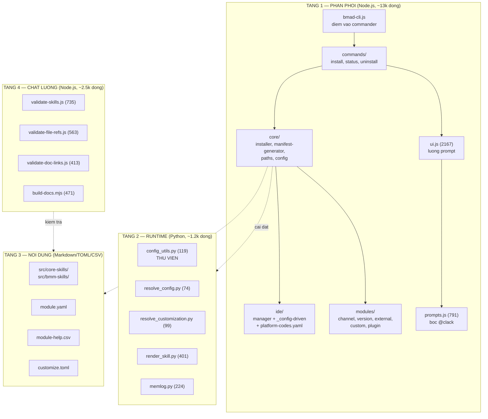
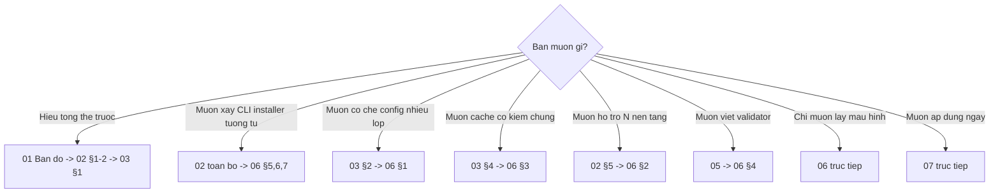
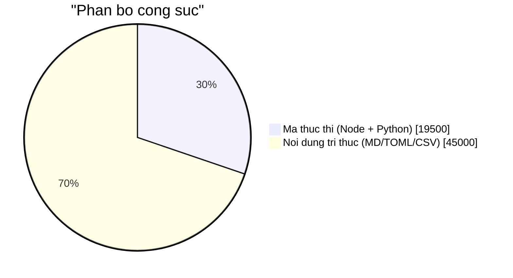

# Hướng dẫn đọc mã nguồn BMAD-METHOD

> Mục tiêu: **đọc hiểu mã nguồn của tool để tái sử dụng mẫu hình ở dự án khác.**
>
> Đây không phải tài liệu API. Nó là **bản đồ + đường đọc + mẫu hình rút ra**, viết cho người muốn xây một công cụ tương tự hoặc mượn kỹ thuật của nó.

---

## Vì sao đáng đọc mã nguồn này

BMAD-METHOD giải một bài toán khó và giải khá sạch: **phân phối nội dung tri thức có cấu trúc tới ~50 công cụ AI khác nhau, cho phép tùy biến nhiều tầng mà không fork, và giữ tính tất định ở những chỗ cần**.

Bảy kỹ thuật trong đó **tái sử dụng được ở dự án hoàn toàn khác**:

| # | Kỹ thuật | Dùng lại được cho |
| --- | --- | --- |
| 1 | Hợp nhất cấu hình nhiều lớp có quy tắc theo kiểu dữ liệu | Bất kỳ tool nào cần override team/user |
| 2 | Kiến trúc hướng-cấu-hình cho N nền tảng | Tool phải hỗ trợ nhiều target khác nhau |
| 3 | Kết xuất snapshot bất biến định danh bằng hash | Bất kỳ chỗ nào cần cache + kiểm chứng |
| 4 | Registry rule-based cho validator | Linter, kiểm tra chất lượng |
| 5 | Nhật ký chỉ-nối-thêm với ghi nguyên tử | Bất kỳ chỗ nào cần audit trail đáng tin |
| 6 | Bọc thư viện bên thứ ba với lazy-load | Giảm thời gian khởi động CLI |
| 7 | Thay thế `fs-extra` bằng `node:fs` thuần | Tránh monkey-patching gây lỗi khó lần |

---

## Bản đồ mã nguồn



---

## Mục lục

| # | Tài liệu | Nội dung |
| --- | --- | --- |
| 01 | **[Bản đồ và đường đọc](./01-ban-do-va-duong-doc.md)** | Đọc theo thứ tự nào tùy mục tiêu; 6 đường đọc có sẵn |
| 02 | **[Tầng phân phối — Installer Node.js](./02-tang-phan-phoi.md)** | `bmad-cli.js` → `ui.js` → `installer.js` → `manifest-generator.js`; quản lý module và IDE |
| 03 | **[Tầng runtime — Script Python](./03-tang-runtime-python.md)** | 5 file, đọc theo thứ tự phụ thuộc; thuật toán hợp nhất và kết xuất |
| 04 | **[Tầng nội dung — Markdown/TOML](./04-tang-noi-dung.md)** | Nội dung là mã: cách BMAD biểu diễn logic nghiệp vụ bằng văn xuôi có cấu trúc |
| 05 | **[Tầng chất lượng — Validator](./05-tang-chat-luong.md)** | Registry rule-based, tích hợp GitHub Actions, kiểm tra tham chiếu |
| 06 | **[Bảy mẫu hình tái sử dụng](./06-mau-hinh-tai-su-dung.md)** | ★ Phần quan trọng nhất — trích mã thật + cách áp dụng nơi khác |
| 07 | **[Áp dụng vào dự án của bạn](./07-ap-dung-vao-du-an-cua-ban.md)** | Ba kịch bản cụ thể kèm mã khởi đầu |

---

## Đọc từ đâu tùy mục tiêu



---

## Số liệu mã nguồn

| Tầng | Ngôn ngữ | Dòng | File lớn nhất |
| --- | --- | --- | --- |
| Phân phối | Node.js (CommonJS) | ~13.000 | `official-modules.js` (2.257) |
| Runtime | Python 3.11 | ~1.220 | `render_skill.py` (401) |
| Chất lượng | Node.js | ~2.500 | `validate-skills.js` (735) |
| Nội dung | Markdown/TOML/CSV | — | `bmad-deep-recon/customize.toml` (212) |

Tổng mã thực thi: **~19.500 dòng**. Đủ nhỏ để đọc hết trong vài ngày, đủ lớn để có mẫu hình đáng học.

---

## Ba quan sát trước khi đọc

### 1. Tỷ lệ mã / nội dung rất thấp



BMAD **không phải** một dự án phần mềm có tài liệu kèm theo. Nó là một **thư viện tri thức có công cụ phân phối kèm theo**. Đọc mã mà không đọc nội dung là hiểu nhầm bản chất.

### 2. Mọi thứ tất định đều bị đẩy xuống Python

| Việc | Ai làm | Vì sao |
| --- | --- | --- |
| Prompt, tải module, copy file | **Node** | Việc I/O và tương tác |
| Hợp nhất TOML, tính hash, kết xuất | **Python** | Cần tất định tuyệt đối |
| Phán đoán nghiệp vụ | **LLM** | Không mã hóa được |

Ranh giới này rất rõ trong mã và đáng học.

### 3. Chú thích trong mã là tài liệu thiết kế

Nhiều quyết định quan trọng nhất **chỉ tồn tại dưới dạng chú thích**. Ví dụ `tools/installer/fs-native.js:1-3`:

```js
// Drop-in replacement for fs-extra using native node:fs APIs.
// Eliminates graceful-fs monkey-patching that causes non-deterministic
// file loss during multi-module installs on macOS (issue #1779).
```

Ba dòng này giải thích một quyết định kiến trúc mà không tài liệu nào khác nhắc tới. **Đọc chú thích, đừng lướt qua.**

---

## Quy ước ký hiệu

| Ký hiệu | Nghĩa |
| --- | --- |
| `file.js:42` | Đường dẫn kèm số dòng — mở được trực tiếp |
| 📖 | Đọc file này |
| ⭐ | Điểm mấu chốt, đừng bỏ qua |
| ♻️ | Mẫu hình tái sử dụng được |
| ⚠️ | Cạm bẫy hoặc quyết định gây tranh cãi |

---

## Tài liệu liên quan

| Muốn hiểu | Đọc |
| --- | --- |
| Hệ thống làm cái gì | [Đặc tả](../tai-lieu-he-thong/01-dac-ta-he-thong.md) |
| Kiến trúc tổng thể | [Thiết kế](../tai-lieu-he-thong/02-thiet-ke-he-thong.md) |
| Vận hành | [Vận hành](../tai-lieu-he-thong/03-van-hanh-he-thong.md) |
| Nội dung module core | [Tài liệu core](../tai-lieu-core/index.md) |
| Ví dụ chạy thật | [Demo greenfield](../demo/index.md) · [Demo brownfield](../demo-brownfield/index.md) |

---

**Bắt đầu:** [01 — Bản đồ và đường đọc](./01-ban-do-va-duong-doc.md)
