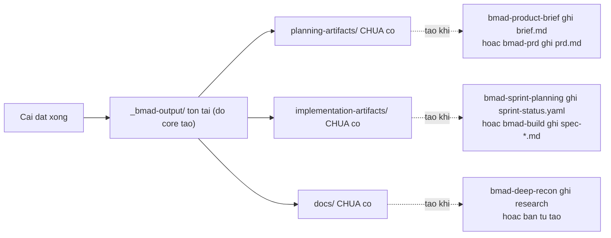
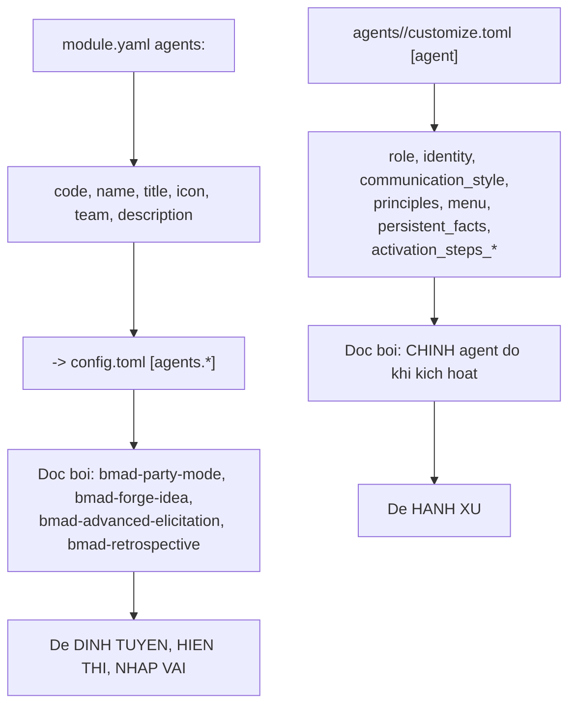
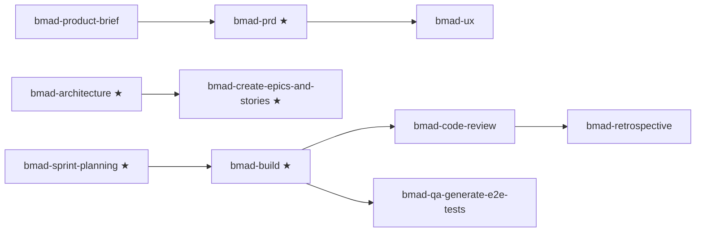
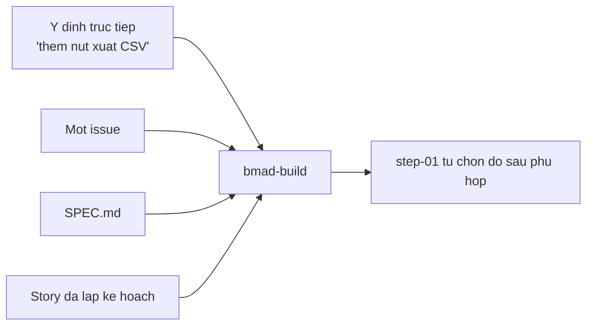
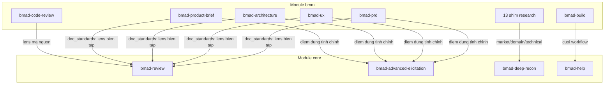

# 01 — Tổng quan module BMM

> [← Chỉ mục](./index.md) · Tiếp: [02 — Năm agent persona](./02-nam-agent-persona.md)

---

## 1. Cấu trúc thư mục

### 1.1 Trong repo mã nguồn

```
src/bmm-skills/
├── module.yaml                          ⭐ ĐỊNH NGHĨA MODULE + ROSTER AGENT
├── module-help.csv                      ⭐ CATALOG 17 mục menu
│
├── agents/                              ← 5 persona
│   ├── bmad-agent-analyst/     {SKILL.md, customize.toml}
│   ├── bmad-agent-pm/          {SKILL.md, customize.toml}
│   ├── bmad-agent-ux-designer/ {SKILL.md, customize.toml}
│   ├── bmad-agent-architect/   {SKILL.md, customize.toml}
│   └── bmad-agent-dev/         {SKILL.md, customize.toml}
│
├── plan/                                ← 10 skill pha 1–3
│   ├── bmad-product-brief/     + assets/brief-template.md
│   ├── bmad-prfaq/             + agents/, assets/, references/ (4), bmad-manifest.json
│   ├── bmad-prd/               + assets/ (4), references/ (2)
│   ├── bmad-ux/                + assets/ (10), references/ (4)
│   ├── bmad-spec/              + assets/ (3)
│   ├── bmad-architecture/      + assets/, references/ (2), scripts/lint_spine.py
│   ├── bmad-create-epics-and-stories/  + steps/ (4), templates/
│   ├── bmad-sprint-planning/   + references/ (5), scripts/sprint_plan.py, sprint-status-template.yaml
│   ├── bmad-project-context/   + references/ (2)
│   └── bmad-generate-project-context/  ← deprecated, chỉ SKILL.md
│
├── ship/                                ← 7 skill pha 4
│   ├── bmad-build/             ⭐ workflow kết xuất — 14 file
│   ├── bmad-build-auto/        ⭐ workflow kết xuất — 11 file
│   ├── bmad-code-review/       + steps/ (4), review-prompts/ (2), references/
│   ├── bmad-checkpoint-preview/ + 5 step + generate-trail.md
│   ├── bmad-qa-generate-e2e-tests/ + checklist.md
│   ├── bmad-correct-course/    + checklist.md
│   └── bmad-retrospective/     + references/ (5), scripts/ (2)
│
└── v6-shims/                            ← 13 forwarder
    ├── README.md
    ├── bmad-create-prd/  bmad-edit-prd/  bmad-validate-prd/
    ├── bmad-create-architecture/  bmad-create-story/
    ├── bmad-dev-story/  bmad-dev-auto/  bmad-quick-dev/
    ├── bmad-sprint-status/  bmad-document-project/
    └── bmad-market-research/  bmad-domain-research/  bmad-technical-research/
```

### 1.2 Sau khi cài

```
_bmad/bmm/
├── config.yaml                  ← giá trị cấu hình để nhớ lần cài sau
├── agents/  plan/  ship/  v6-shims/
```

Và **bản sao phẳng** trong thư mục skill của IDE:

```
.claude/skills/
├── bmad-agent-dev/          ← không có tầng agents/
├── bmad-prd/                ← không có tầng plan/
├── bmad-build/              ← không có tầng ship/
├── bmad-create-prd/         ← không có tầng v6-shims/
└── ...
```

> ⭐ Thư mục `agents/`, `plan/`, `ship/`, `v6-shims/` **chỉ để nhóm trong repo**. Installer quét đệ quy và cài mỗi skill theo `name` của chính nó.

---

## 2. `module.yaml`

📖 `src/bmm-skills/module.yaml`

```yaml
code: bmm
name: "BMad Method"
description: "Agile Ai Driven Development"
default_selected: true    # ⭐ mặc định chọn cho bản cài mới

# Variables from Core Config inserted:
## user_name
## project_name
## communication_language
## document_output_language
## output_folder

user_skill_level:
  prompt:
    - "What is your development experience level?"
    - "This affects how agents explain concepts in chat."
  scope: user
  default: "intermediate"
  result: "{value}"
  single-select:
    - value: "beginner"
      label: "Beginner - Explain things clearly"
    - value: "intermediate"
      label: "Intermediate - Balance detail with speed"
    - value: "expert"
      label: "Expert - Be direct and technical"

planning_artifacts:
  prompt: "Where should planning artifacts be stored? (Brainstorming, Briefs, PRDs, UX Designs, Architecture, Epics)"
  default: "{output_folder}/planning-artifacts"
  result: "{project-root}/{value}"

implementation_artifacts:
  prompt: "Where should implementation artifacts be stored? (Sprint status, stories, reviews, retrospectives, Build output)"
  default: "{output_folder}/implementation-artifacts"
  result: "{project-root}/{value}"

project_knowledge:
  prompt: "Where should long-term project knowledge be stored? (docs, research, references)"
  default: "docs"
  result: "{project-root}/{value}"

# No pre-created directories: planning_artifacts, implementation_artifacts, and
# project_knowledge are created lazily by whichever skill first writes to them.
```

### 2.1 Bốn khóa cấu hình

| Khóa | Scope | Mặc định | Ai đọc |
| --- | --- | --- | --- |
| `user_skill_level` | **user** | `intermediate` | Mọi agent — quyết định độ sâu giải thích |
| `planning_artifacts` | team | `{output_folder}/planning-artifacts` | Skill pha 1–3 |
| `implementation_artifacts` | team | `{output_folder}/implementation-artifacts` | Skill pha 4 |
| `project_knowledge` | team | `docs` | `bmad-help`, `bmad-architecture` |

### 2.2 ⭐ `single-select` — kiểu prompt riêng

```yaml
user_skill_level:
  single-select:
    - value: "beginner"
      label: "Beginner - Explain things clearly"
```

Đây là khóa **duy nhất** trong cả `core` lẫn `bmm` dùng `single-select`. Installer render nó thành radio button thay vì ô nhập text.

⚠️ **`--set` không validate giá trị này.** Từ tài liệu chính thức:

> *`single-select` values **aren't checked** against the allowed choices, and unknown keys aren't rejected — whatever you assert is written.*

Nên `--set bmm.user_skill_level=chuyen-gia` sẽ được ghi nguyên văn dù không hợp lệ.

### 2.3 ⭐ Không tạo thư mục nào lúc cài

Khác `core` (tạo `{output_folder}`), `bmm` **không có** khối `directories:`. Ba thư mục được tạo **lười** bởi skill nào ghi vào đó trước.



---

## 3. Roster agent trong `module.yaml`

```yaml
# Agent roster — essence only. External skills (party-mode, retrospective,
# advanced-elicitation, help catalog) read these descriptors to route, display,
# and embody agents. Full persona and behavior live in each agent's
# customize.toml. `team` defaults to the module code when omitted; users can
# add their own agents (real or fictional) via _bmad/custom/config.toml or
# _bmad/custom/config.user.toml.
agents:
  - code: bmad-agent-analyst
    name: Mary
    title: Business Analyst
    icon: "📊"
    team: software-development
    description: "Channels Porter's strategic rigor and Minto's Pyramid Principle..."
  # ... 4 agent nữa
```

### 3.1 ⭐ Tách "essence" khỏi "behavior"



⭐ Nhờ tách vậy, `bmad-party-mode` biết **có agent nào** mà không cần nạp `customize.toml` của từng agent — tiết kiệm ngữ cảnh đáng kể.

### 3.2 Trường `team`

Mọi agent bmm đều `team: software-development`. Chú thích nói: *"`team` defaults to the module code when omitted"*.

`bmad-party-mode` dùng trường này để nhóm agent khi hiển thị phòng.

### 3.3 Thêm agent riêng

```toml
# _bmad/custom/config.toml
[agents.bmad-agent-security]
module = "custom"
team = "software-development"
name = "Linh"
title = "Security Engineer"
icon = "🔐"
description = "Rà soát mọi thay đổi qua lăng kính OWASP Top 10 và STRIDE. Nói ngắn, luôn kèm CVE hoặc tiêu chuẩn tham chiếu."
```

⚠️ Đây chỉ thêm **descriptor** vào roster. Muốn có agent **chạy được** thì phải tạo skill thật (dùng `bmad-builder`).

---

## 4. `module-help.csv` — catalog 17 mục

📖 `src/bmm-skills/module-help.csv`

| skill | display | mã | action | args | phase | preceded-by | followed-by | required | output-location |
| --- | --- | --- | --- | --- | --- | --- | --- | :-: | --- |
| `_meta` | — | — | | | | | | false | `https://docs.bmad-method.org/llms.txt` |
| `bmad-project-context` | Project Context | `PC` | | | anytime | | | false | repo root |
| `bmad-build` | Build | `BD` | | | ship | `bmad-sprint-planning` | `bmad-code-review` | **true** | `implementation_artifacts` |
| `bmad-spec` | Spec | `SPC` | | `[path]` | anytime | | | false | `{output_folder}/specs/spec-{slug}` |
| `bmad-correct-course` | Correct Course | `CC` | | | anytime | | | false | `planning_artifacts` |
| `bmad-brainstorming` | Brainstorm Project | `BP` | | | plan | | | false | `{output_folder}/brainstorming` |
| `bmad-product-brief` | Create Brief | `CB` | | `-A` | plan | | | false | `planning_artifacts` |
| `bmad-prfaq` | PRFAQ Challenge | `WB` | | `-H` | plan | | | false | `planning_artifacts` |
| `bmad-prd` | Create Edit and Review PRD | `PRD` | | | 2-planning | `bmad-product-brief` | | **true** | `planning_artifacts` |
| `bmad-ux` | Create UX | `CU` | | | 2-planning | `bmad-prd` | | false | `planning_artifacts` |
| `bmad-architecture` | Architecture | `CA` | | | plan | | | **true** | `planning_artifacts` |
| `bmad-create-epics-and-stories` | Create Epics and Stories | `CE` | | | plan | `bmad-architecture` | | **true** | `planning_artifacts` |
| `bmad-sprint-planning` | Sprint Planning | `SP` | | | plan | | | **true** | `implementation_artifacts` |
| `bmad-sprint-planning` | Sprint Status | `SS` | **`status`** | | anytime | | | false | — |
| `bmad-code-review` | Code Review | `CR` | | | ship | `bmad-build` | | false | — |
| `bmad-checkpoint-preview` | Checkpoint | `CK` | | | ship | | | false | — |
| `bmad-qa-generate-e2e-tests` | QA Automation Test | `QA` | | | ship | `bmad-build` | | false | `implementation_artifacts` |
| `bmad-retrospective` | Retrospective | `ER` | | | ship | `bmad-code-review` | | false | `implementation_artifacts` |

### 4.1 ⭐ Ba quan sát về catalog

#### a) `bmad-sprint-planning` xuất hiện **hai lần**

```csv
BMad Method,bmad-sprint-planning,Sprint Planning,SP,...,,,plan,,,true,implementation_artifacts,sprint status
BMad Method,bmad-sprint-planning,Sprint Status,SS,...,status,,anytime,,,false,,status summary
```

Cùng skill, khác **`action`**. Cột `action` là cách một skill có nhiều điểm vào.

⭐ Đây là lý do `bmad-help` hiển thị chúng như hai mục menu riêng (`SP` và `SS`).

#### b) `bmad-brainstorming` là skill của **core** nhưng có trong catalog **bmm**

```csv
BMad Method,bmad-brainstorming,Brainstorm Project,BP,...,,,plan,,,false,...
```

Cùng skill, khác **ngữ cảnh trình bày**: ở core nó là `BSP` phase `anytime`; ở bmm nó là `BP` phase `plan`.

⭐ Catalog gộp giữ **cả hai dòng** — `bmad-help` hiển thị dòng phù hợp với ngữ cảnh người dùng đang ở.

#### c) `phase` không nhất quán

| Giá trị | Skill dùng nó |
| --- | --- |
| `anytime` | `bmad-project-context`, `bmad-spec`, `bmad-correct-course`, `SS` |
| `plan` | `bmad-brainstorming`, `bmad-product-brief`, `bmad-prfaq`, `bmad-architecture`, `bmad-create-epics-and-stories`, `bmad-sprint-planning` |
| **`2-planning`** | `bmad-prd`, `bmad-ux` |
| `ship` | `bmad-build`, `bmad-code-review`, `bmad-checkpoint-preview`, `bmad-qa-generate-e2e-tests`, `bmad-retrospective` |

⚠️ `2-planning` là **di sản đánh số pha cũ**. `bmad-help/SKILL.md` xử lý được:

> *Skills group into folders (`plan`, `ship`; **some modules use numbered phases**) and flow in order; **naming varies by module**.*

### 4.2 Chuỗi `preceded-by`



⚠️ **Đây là gợi ý mềm, không phải cổng.** Chỉ cột `required` mới chặn.

⚠️ Chú ý: `bmad-architecture` **không có** `preceded-by`, dù về logic nó cần PRD. Và `bmad-sprint-planning` cũng không. Nghĩa là bạn được phép chạy chúng bất cứ lúc nào — trách nhiệm phán đoán thuộc về người dùng và `bmad-help`.

---

## 5. Bốn pha

### 5.1 Bảng tổng hợp

| Pha | Tên | Bắt buộc | Skill | Đầu ra |
| --- | --- | :-: | --- | --- |
| **1** | Analysis | ❌ | `bmad-brainstorming`, `bmad-forge-idea`, `bmad-deep-recon` (core) · `bmad-product-brief`, `bmad-prfaq` (bmm) | brainstorm, forged idea, research, brief, PRFAQ |
| **2** | Planning | ✅ PRD | `bmad-prd`, `bmad-ux`, `bmad-spec` | `prd.md`, `DESIGN.md` + `EXPERIENCE.md`, `SPEC.md` |
| **3** | Solutioning | ✅ ×3 | `bmad-architecture`, `bmad-create-epics-and-stories`, `bmad-sprint-planning` | `ARCHITECTURE-SPINE.md`, epics, `sprint-status.yaml` |
| **4** | Implementation | ✅ Build | `bmad-build` + 6 skill hỗ trợ | `spec-*.md` + mã, findings, retro |

### 5.2 ⭐ Mọi đường thực thi đều hội tụ vào `bmad-build`

Từ `docs/reference/workflow-map.md`:

> *Every implementation path converges on `bmad-build`. It accepts **direct intent, an issue, a specification, or a planned story**, then chooses the clarification, planning, implementation, and review depth needed for that input.*



⭐ **Tạo phẩm planning thêm ngữ cảnh; chúng KHÔNG chọn workflow khác.**

---

## 6. Điểm giao với module `core`



| Skill bmm | Gọi skill core | Khi nào |
| --- | --- | --- |
| `bmad-prd`, `bmad-ux`, `bmad-architecture`, `bmad-product-brief` | `bmad-review` (lens `structure` + `prose`) | Bước finalize |
| Như trên | `bmad-advanced-elicitation` | Điểm dừng tự nhiên |
| `bmad-code-review` | `bmad-review` (lens mã nguồn) | Tự động |
| `bmad-market-research` và 2 shim khác | `bmad-deep-recon` | Chuyển tiếp |
| Mọi workflow | `bmad-help` | Cuối workflow, gợi ý bước kế |

⭐ Từ `customize.toml` của `bmad-deep-recon`:

```toml
doc_standards = ["skill:bmad-review lenses=structure,prose"]
```

Đây là ví dụ **core gọi core**. Tiền tố `skill:` là cách một skill khai báo phụ thuộc vào skill khác trong cấu hình.

---

## 7. Vận hành thủ công

```bash
R="$(pwd)"

# Cấu hình bmm đã hợp nhất
uv run "$R/_bmad/scripts/resolve_config.py" -p "$R" -k modules.bmm

# Roster agent
uv run "$R/_bmad/scripts/resolve_config.py" -p "$R" -k agents

# Catalog bmm (lọc từ file gộp)
grep "^BMad Method," "$R/_bmad/_config/bmad-help.csv" | column -s, -t | less -S

# Mục bắt buộc của bmm
awk -F',' '$1=="BMad Method" && $11=="true" { printf "[%s] %-32s -> %s\n", $4, $2, $12 }' \
  "$R/_bmad/_config/bmad-help.csv"

# Skill bmm đã cài
grep ',"bmm",' "$R/_bmad/_config/skill-manifest.csv" | cut -d'"' -f2 | sort

# Skill nào là workflow kết xuất?
ls "$R"/.claude/skills/*/workflow.md 2>/dev/null | xargs -n1 dirname | xargs -n1 basename

# Skill nào là agent persona?
grep -l "^\[agent\]" "$R"/.claude/skills/*/customize.toml | xargs -n1 dirname | xargs -n1 basename
```

Kết quả mong đợi cho hai lệnh cuối:

```
# workflow kết xuất
bmad-build
bmad-build-auto

# agent persona
bmad-agent-analyst
bmad-agent-architect
bmad-agent-dev
bmad-agent-pm
bmad-agent-ux-designer
```

---

## 8. Cạm bẫy

| Vấn đề | Nguyên nhân | Xử lý |
| --- | --- | --- |
| Thư mục `planning-artifacts/` không tồn tại sau cài | `bmm` không khai báo `directories:` — tạo lười | Bình thường; skill đầu tiên ghi sẽ tạo |
| `--set bmm.user_skill_level=xyz` không báo lỗi | `single-select` không được validate | Kiểm tra lại bằng `resolve_config.py -k modules.bmm.user_skill_level` |
| `bmad-help` hiện `bmad-brainstorming` hai lần | Có trong catalog cả core lẫn bmm | Đúng theo thiết kế — hai ngữ cảnh khác nhau |
| Chạy `bmad-architecture` trước `bmad-prd` không bị chặn | `preceded-by` là gợi ý mềm | Trách nhiệm phán đoán thuộc người dùng |
| `phase = 2-planning` trông lạ | Di sản đánh số pha cũ | `bmad-help` xử lý được |
| Thêm `[agents.*]` vào custom nhưng agent không chạy | Đó chỉ là descriptor | Cần skill thật — dùng `bmad-builder` |

---

**Tiếp:** [02 — Năm agent persona](./02-nam-agent-persona.md) · [← Chỉ mục](./index.md)
