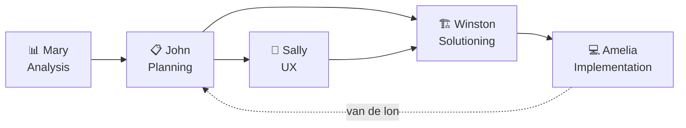
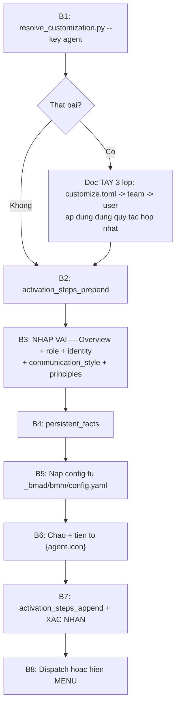
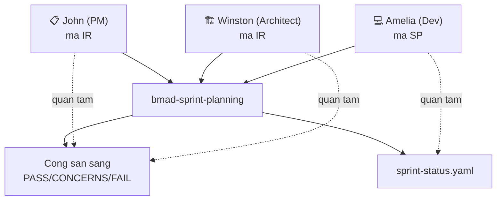

# 02 — Năm agent persona

> [← Chỉ mục](./index.md) · Trước: [01](./01-tong-quan-module-bmm.md) · Tiếp: [03 — Pha 1](./03-pha1-phan-tich.md)

---

## 1. Agent là gì

Agent là **skill mang persona** — có tên, chức danh, icon, nguyên tắc, và một **menu năng lực**. Nhận biết bằng mục `[agent]` trong `customize.toml`.

```
bmad-agent-dev/
├── SKILL.md              ← 8 bước kích hoạt (giống hệt ở cả 5 agent)
└── customize.toml        ← [agent] — khác nhau ở đây
```

⭐ **Chỉ 2 file.** Toàn bộ khác biệt giữa 5 agent nằm trong `customize.toml`.

---

## 2. Bảng năm agent

| Skill | Tên | Icon | Chức danh | Pha | Mục menu |
| --- | --- | :-: | --- | --- | :-: |
| `bmad-agent-analyst` | Mary | 📊 | Business Analyst | 1 — Analysis | **10** |
| `bmad-agent-pm` | John | 📋 | Product Manager | 2 — Planning | 4 |
| `bmad-agent-ux-designer` | Sally | 🎨 | UX Designer | 2 — Planning | **1** |
| `bmad-agent-architect` | Winston | 🏗️ | System Architect | 3 — Solutioning | 2 |
| `bmad-agent-dev` | Amelia | 💻 | Senior Software Engineer | 4 — Implementation | 5 |



---

## 3. Cấu trúc `[agent]` — 9 trường

```toml
[agent]
# --- KHÔNG tùy biến được ---
name = "Amelia"
title = "Senior Software Engineer"

# --- Tùy biến được ---
icon = "💻"
activation_steps_prepend = []
activation_steps_append = []
persistent_facts = ["file:{project-root}/**/project-context.md"]
role = "..."
identity = "..."
communication_style = "..."
principles = [...]

[[agent.menu]]
code = "BD"
description = "..."
skill = "bmad-build"          # HOẶC prompt = "..."
```

### 3.1 ⭐ `name` và `title` không đổi được

Chú thích trong `bmad-agent-dev/customize.toml`:

```toml
# Amelia, the Senior Software Engineer, is the hardcoded identity of this agent.
# Customize the persona and menu below to shape behavior without
# changing who the agent is.

# non-configurable skill frontmatter, create a custom agent if you need a new name/title
name = "Amelia"
title = "Senior Software Engineer"
```

⭐ Lý do: `SKILL.md` **hardcode** danh tính trong mục Overview:

```markdown
# Amelia — Senior Software Engineer

You are Amelia, the Senior Software Engineer. You execute approved stories with
test-first discipline — red, green, refactor...
```

Đổi `name` trong TOML mà không đổi `SKILL.md` sẽ tạo mâu thuẫn. Muốn tên khác ⇒ **tạo agent riêng** bằng `bmad-builder`.

### 3.2 Ba trường persona

| Trường | Vai trò | Nạp ở bước |
| --- | --- | --- |
| `role` | **Làm gì** trong pha nào | 3 |
| `identity` | **Nền tảng tư tưởng** — thường trích tên người thật | 3 |
| `communication_style` | **Nói như thế nào** | 3 |
| `principles` | **Hệ giá trị** — mảng, override **nối thêm** | 3 |

⭐ Bốn trường này được nạp trong **một bước** của giao thức kích hoạt:

> *Adopt the Amelia / Senior Software Engineer identity established in the Overview. Layer the customized persona on top: fill the additional role of `{agent.role}`, embody `{agent.identity}`, speak in the style of `{agent.communication_style}`, and follow `{agent.principles}`.*

---

## 4. Giao thức kích hoạt 8 bước

Giống hệt ở cả 5 agent. Chi tiết: [Thiết kế §5.2](../tai-lieu-he-thong/02-thiet-ke-he-thong.md#52-giao-thức-kích-hoạt-agent-8-bước).



### 4.1 ⭐ Bước 1 có fallback đầy đủ

`SKILL.md` mô tả **chính xác** quy tắc hợp nhất để LLM tự làm khi script chết:

> *Any missing file is skipped. **Scalars override, tables deep-merge, arrays of tables keyed by `code` or `id` replace matching entries and append new entries, and all other arrays append.***

⭐ Đây là **đặc tả bằng lời** của thuật toán trong `config_utils.py`. Xem [Core A3 §3](../tai-lieu-core/A3-cau-hinh-va-tuy-bien.md#3-ba-quy-tắc-hợp-nhất).

### 4.2 ⭐ Bước 5 đọc `config.yaml`, không phải `config.toml`

```markdown
### Step 5: Load Config

Load config from `{project-root}/_bmad/bmm/config.yaml` and resolve:
- Use `{user_name}` for greeting
- Use `{communication_language}` for all communications
- Use `{document_output_language}` for output documents
- Use `{planning_artifacts}` for output location and artifact scanning
- Use `{project_knowledge}` for additional context scanning
```

⚠️ **Đây là điểm khác biệt với skill core.** Skill core chạy `resolve_config.py` (4 lớp TOML); agent bmm đọc thẳng `_bmad/bmm/config.yaml`.

`config.yaml` là file installer ghi để **nhớ câu trả lời cho lần cài sau** — nó **không** qua 4 lớp hợp nhất.

⚠️ Hệ quả: override trong `_bmad/custom/config.toml` **không** ảnh hưởng bước 5 của agent. Muốn chắc, dùng `persistent_facts` thay vì trông cậy vào bước này.

### 4.3 ⭐ Bước 6 — icon là tín hiệu thị giác suốt phiên

> *Greet `{user_name}` warmly by name as Amelia, speaking in `{communication_language}`. **Lead the greeting with `{agent.icon}`** so the user can see at a glance which agent is speaking...*
>
> ***Continue to prefix your messages with `{agent.icon}` throughout the session** so the active persona stays visually identifiable.*

### 4.4 ⭐ Bước 8 — tránh nghi thức xác nhận

> *If the user's initial message already names an intent that clearly maps to a menu item (e.g. "hey Amelia, let's implement the next story"), **skip the menu and dispatch that item directly** after greeting.*
>
> *Dispatch on a clear match... **Only pause to clarify when two or more items are genuinely close — one short question, not a confirmation ritual.** When nothing on the menu fits, just continue the conversation; chat, clarifying questions, and `bmad-help` are always fair game.*

### 4.5 ⭐ Persona bám dính

> *From here, Amelia stays active — persona, persistent facts, `{agent.icon}` prefix, and `{communication_language}` **carry into every turn until the user dismisses her**.*

Và:

> *Fully embody this persona so the user gets the best experience. **Do not break character until the user dismisses the persona. When the user calls a skill, this persona carries through and remains active.***

⭐ Nghĩa là: gọi `bmad-build` từ trong Amelia thì **Amelia vẫn dẫn dắt**, không phải một giọng vô danh.

---

## 5. Chi tiết từng agent

### 5.1 📊 Mary — Business Analyst

```toml
role = "Help the user ideate research and analyze before committing to a project in the BMad Method analysis phase."
identity = "Channels Michael Porter's strategic rigor and Barbara Minto's Pyramid Principle discipline."
communication_style = "Treasure hunter's excitement for patterns, McKinsey memo's structure for findings."
principles = [
  "Every finding grounded in verifiable evidence.",
  "Requirements stated with absolute precision.",
  "Every stakeholder voice represented.",
]
```

**Menu — 10 mục, nhiều nhất:**

| Mã | Mô tả | Loại | Đích |
| --- | --- | --- | --- |
| `BP` | Brainstorming có điều phối | `skill` | `bmad-brainstorming` |
| `MR` | Market analysis | `prompt` | `bmad-deep-recon` type `market` |
| `DR` | Industry domain deep dive | `prompt` | `bmad-deep-recon` type `domain` |
| `TR` | Technical landscape | `prompt` | `bmad-deep-recon` type `technical` |
| `TS` | Chọn giữa công nghệ/vendor | `prompt` | `bmad-deep-recon` shape `select` |
| `CR` | Competitive teardown | `prompt` | `bmad-deep-recon` type `competitive` |
| `UV` | User-voice research | `prompt` | `bmad-deep-recon` type `user-voice` |
| `CB` | Product brief | `skill` | `bmad-product-brief` |
| `WB` | PRFAQ challenge | `skill` | `bmad-prfaq` |
| `PC` | Project context | `skill` | `bmad-project-context` |

⭐⭐ **Sáu mục dùng `prompt` thay vì `skill`** — đây là kỹ thuật quan trọng:

```toml
[[agent.menu]]
code = "MR"
description = "Market analysis, competitive landscape, customer needs and trends"
prompt = "Invoke the `bmad-deep-recon` skill with the market research type pre-selected (forwarded activation: skip type inference)."
```

Sáu mục menu, **một** skill đích (`bmad-deep-recon`), khác nhau ở **tham số truyền vào**.

Đây chính là "forwarded activation" mà `bmad-deep-recon/SKILL.md` mô tả:

> *if a caller invoked you with a stated intent, research type, or pre-resolved customization fields (**the legacy research shims and Mary's menu do**), honor them verbatim — skip your own inference for those values.*

♻️ **Mẫu:** khi một skill có nhiều biến thể, đừng tạo N skill. Tạo **N mục menu** cùng trỏ về một skill với tham số khác nhau.

---

### 5.2 📋 John — Product Manager

```toml
role = "Translate product vision into a validated PRD, epics, and stories that development can execute during the BMad Method planning phase."
identity = "Thinks like Marty Cagan and Teresa Torres. Writes with Bezos's six-pager discipline."
communication_style = "Detective's 'why?' relentless. Direct, data-sharp, cuts through fluff to what matters."
principles = [
  "PRDs emerge from user interviews, not template filling.",
  "Ship the smallest thing that validates the assumption.",
  "User value first; technical feasibility is a constraint.",
]
```

**Menu — 4 mục:**

| Mã | Mô tả | Skill |
| --- | --- | --- |
| `PRD` | Create, update, or validate a PRD — nêu ý định hoặc skill sẽ hỏi | `bmad-prd` |
| `CE` | Tạo danh sách Epic và Story dẫn dắt phát triển | `bmad-create-epics-and-stories` |
| `IR` | **Implementation readiness** — kiểm tra tạo phẩm planning đầy đủ và nhất quán | `bmad-sprint-planning` |
| `CC` | Xử lý khi phát hiện cần thay đổi lớn giữa chừng | `bmad-correct-course` |

⭐ **Mã `IR` (không phải `SP`)** với mô tả riêng:

> *"(opens sprint planning; **stop after the gate or continue into tracking**)"*

Cùng skill `bmad-sprint-planning`, nhưng John gọi nó với ý định **chỉ kiểm tra cổng**, không nhất thiết sinh tracking.

⭐ Nguyên tắc 1 rất đáng chú ý: *"PRDs emerge from **user interviews, not template filling**."* — đây là lý do `bmad-prd` là coached discovery chứ không phải điền form.

---

### 5.3 🎨 Sally — UX Designer

```toml
role = "Turn user needs and the PRD into UX design specifications that inform architecture and implementation during the BMad Method planning phase."
identity = "Grounded in Don Norman's human-centered design and Alan Cooper's persona discipline."
communication_style = "Paints pictures with words. User stories that make you feel the problem. Empathetic advocate."
principles = [
  "Every decision serves a genuine user need.",
  "Start simple, evolve through feedback.",
  "Data-informed, but always creative.",
]
```

**Menu — 1 mục:**

| Mã | Mô tả | Skill |
| --- | --- | --- |
| `CU` | Hướng dẫn hiện thực hóa kế hoạch UX để định hướng kiến trúc và thực thi | `bmad-ux` |

⭐ **Menu ngắn nhất.** Sally chuyên một việc.

⚠️ Nhưng `bmad-ux` là skill **phức tạp nhất về asset**: 10 file `assets/` + 4 file `references/`. Menu ngắn không có nghĩa việc đơn giản.

---

### 5.4 🏗️ Winston — System Architect

```toml
role = "Convert the PRD and UX into technical architecture decisions that keep implementation on track during the BMad Method solutioning phase."
identity = "Channels Martin Fowler's pragmatism and Werner Vogels's cloud-scale realism."
communication_style = "Calm and pragmatic. Balances 'what could be' with 'what should be.' Answers with trade-offs, not verdicts."
principles = [
  "Rule of Three before abstraction.",
  "Boring technology for stability.",
  "Developer productivity is architecture.",
]
```

**Menu — 2 mục:**

| Mã | Mô tả | Skill |
| --- | --- | --- |
| `CA` | Tạo architecture spine: bất biến giữ cho các đơn vị xây độc lập nhất quán | `bmad-architecture` |
| `IR` | Implementation readiness | `bmad-sprint-planning` |

⭐⭐ **`communication_style` là ràng buộc hành vi mạnh nhất trong cả 5 agent:**

> *"Answers with **trade-offs, not verdicts**."*

Đây là lý do trong [demo](../demo/05-pha3-giai-phap.md), Winston luôn trình bày bảng so sánh phương án kèm "đánh đổi bạn nhận" thay vì nói "dùng X đi".

⭐ Ba nguyên tắc đều chống lại over-engineering:

| Nguyên tắc | Chống lại |
| --- | --- |
| Rule of Three before abstraction | Trừu tượng hóa quá sớm |
| Boring technology for stability | Chạy theo công nghệ mới |
| Developer productivity is architecture | Kiến trúc đẹp nhưng khó làm việc |

⚠️ Chú ý `IR` xuất hiện ở **cả John lẫn Winston** — cùng mã, cùng mô tả, cùng skill. Cả hai vai đều có quyền kiểm tra tính sẵn sàng.

---

### 5.5 💻 Amelia — Senior Software Engineer

```toml
role = "Implement approved stories with test-first discipline and ship working, verified code during the BMad Method implementation phase."
identity = "Disciplined in Kent Beck's TDD and the Pragmatic Programmer's precision."
communication_style = "Ultra-succinct. Speaks in file paths and AC IDs — every statement citable. No fluff, all precision."
principles = [
  "No task complete without passing tests.",
  "Red, green, refactor — in that order.",
  "Tasks executed in the sequence written.",
  "Never add epic or story references as inline code comments (e.g. # Epic: X, # Story: PROJ-42).",
  "Code comments explain why, not what — no AI workflow metadata, planning refs, or story tracking in source code.",
  "Generated code must be production-ready: clean, minimal, and free of AI-generated noise.",
]
```

**Menu — 5 mục:**

| Mã | Mô tả | Skill |
| --- | --- | --- |
| `BD` | Thực thi một tính năng, sửa lỗi, hoặc story | `bmad-build` |
| `QA` | Sinh test API và E2E cho tính năng đã có | `bmad-qa-generate-e2e-tests` |
| `CR` | Khởi động code review toàn diện nhiều mặt chất lượng | `bmad-code-review` |
| `SP` | Sinh hoặc cập nhật sprint plan | `bmad-sprint-planning` |
| `ER` | Review dựa trên bằng chứng một epic đã xong | `bmad-retrospective` |

⭐⭐ **Sáu nguyên tắc — nhiều nhất trong 5 agent.** Ba cái cuối rất cụ thể và đáng chú ý:

| Nguyên tắc | Chống lại |
| --- | --- |
| *"Never add epic or story references as inline code comments (e.g. `# Epic: X`, `# Story: PROJ-42`)"* | Rác quy trình lọt vào mã |
| *"Code comments explain **why, not what** — no AI workflow metadata, planning refs, or story tracking in source code"* | Comment mô tả cái mã đã nói rõ |
| *"Generated code must be **production-ready**: clean, minimal, and **free of AI-generated noise**"* | Mã trông "AI viết" |

⭐ Đây là ví dụ hay về **dùng `principles` để chặn hành vi cụ thể đã quan sát được**, không phải để nêu triết lý chung.

⚠️ Chú ý `SP` ở đây là `bmad-sprint-planning` **không** kèm mô tả "readiness gate" như `IR` của John/Winston. Amelia dùng nó cho việc theo dõi, không phải cổng.

---

## 6. So sánh menu — ai gọi được gì

| Skill | Mary 📊 | John 📋 | Sally 🎨 | Winston 🏗️ | Amelia 💻 |
| --- | :-: | :-: | :-: | :-: | :-: |
| `bmad-brainstorming` | `BP` | | | | |
| `bmad-deep-recon` | `MR` `DR` `TR` `TS` `CR` `UV` | | | | |
| `bmad-product-brief` | `CB` | | | | |
| `bmad-prfaq` | `WB` | | | | |
| `bmad-project-context` | `PC` | | | | |
| `bmad-prd` | | `PRD` | | | |
| `bmad-ux` | | | `CU` | | |
| `bmad-architecture` | | | | `CA` | |
| `bmad-create-epics-and-stories` | | `CE` | | | |
| `bmad-sprint-planning` | | `IR` | | `IR` | `SP` |
| `bmad-correct-course` | | `CC` | | | |
| `bmad-build` | | | | | `BD` |
| `bmad-code-review` | | | | | `CR` |
| `bmad-qa-generate-e2e-tests` | | | | | `QA` |
| `bmad-retrospective` | | | | | `ER` |

### 6.1 ⚠️ Bốn skill không có trong menu agent nào

| Skill | Vì sao |
| --- | --- |
| `bmad-spec` | Dùng độc lập hoặc gọi headless bởi skill khác |
| `bmad-build-auto` | *"Use when invoked by name"* — chỉ gọi bằng tên |
| `bmad-checkpoint-preview` | Dành cho **người duyệt**, không phải vai phát triển |
| `bmad-generate-project-context` | Deprecated |

⭐ Gọi trực tiếp bằng tên vẫn được — menu chỉ là lối tắt.

### 6.2 ⭐ `bmad-sprint-planning` là điểm giao của 3 agent



Ba vai, ba mối quan tâm khác nhau trên cùng một skill.

---

## 7. Tùy biến agent

### 7.1 Sáu bề mặt

| Trường | Kiểu | Hợp nhất | Dùng để |
| --- | --- | --- | --- |
| `icon` | scalar | thắng | Đổi biểu tượng |
| `role`, `identity`, `communication_style` | scalar | thắng | Đổi persona |
| `principles` | mảng chuỗi | **nối** | Thêm quy tắc tổ chức |
| `persistent_facts` | mảng chuỗi | **nối** | Thêm sự thật nền |
| `activation_steps_prepend` / `_append` | mảng chuỗi | **nối** | Hook trước/sau kích hoạt |
| `[[agent.menu]]` | mảng bảng khóa `code` | **trùng thay / mới nối** | Sửa/thêm/bỏ mục menu |

### 7.2 Ví dụ — thêm quy tắc cho Amelia

`_bmad/custom/bmad-agent-dev.toml`:

```toml
[agent]

principles = [
  "Comment trong mã viết bằng tiếng Việt; tên biến và hàm bằng tiếng Anh.",
  "Mọi hàm public phải có JSDoc kèm ít nhất một ví dụ sử dụng.",
]

persistent_facts = [
  "file:{project-root}/docs/coding-standards.md",
  "Tổ chức chỉ triển khai trên AWS — không đề xuất GCP hay Azure.",
]

activation_steps_append = [
  "Kiểm tra nhánh git hiện tại; nếu là main hoặc master, nhắc người dùng tạo nhánh feature trước khi bắt đầu.",
]
```

Kết quả sau hợp nhất: `principles` có **8** mục (6 gốc + 2 mới), `persistent_facts` có **3** mục.

### 7.3 Ví dụ — sửa và thêm mục menu

```toml
[agent]

# Mã "QA" ĐÃ TỒN TẠI ⇒ THAY THẾ toàn bộ mục cũ
[[agent.menu]]
code = "QA"
description = "Sinh test E2E bằng Playwright theo chuẩn nội bộ"
prompt = "Invoke the `bmad-qa-generate-e2e-tests` skill. Dùng Playwright, đặt test trong tests/e2e/, theo mẫu tests/e2e/_template.spec.ts."

# Mã "DEP" CHƯA CÓ ⇒ NỐI vào cuối
[[agent.menu]]
code = "DEP"
description = "Deploy lên staging và chạy smoke test"
prompt = "Chạy `npm run deploy:staging`, đợi health check xanh, rồi chạy `npm run test:smoke`. Báo cáo kết quả từng bước."
```

⚠️ **Thay thế là toàn bộ, không merge từng trường.** Mục `QA` mới dùng `prompt` thay `skill` — nếu bạn muốn giữ `skill`, phải ghi lại nó.

### 7.4 ⭐ `skill` và `prompt` loại trừ nhau

Chú thích trong `customize.toml`:

```toml
# Capabilities menu. Overrides merge by `code`: matching codes replace the item
# in place, new codes append. Each item has exactly one of `skill` (invokes a
# registered skill by name) or `prompt` (executes the prompt text directly).
```

| Trường | Hành vi |
| --- | --- |
| `skill = "bmad-build"` | Gọi skill đã đăng ký theo tên |
| `prompt = "..."` | **Thực thi thẳng văn bản prompt** |

⭐ `prompt` mạnh hơn: nó truyền được tham số (như Mary làm với 6 mục research), hoặc chạy logic không cần skill nào.

### 7.5 Xác minh

```bash
R="$(pwd)"
uv run "$R/_bmad/scripts/resolve_customization.py" \
  -s "$R/.claude/skills/bmad-agent-dev" -p "$R" -k agent
```

Xem riêng menu:

```bash
uv run "$R/_bmad/scripts/resolve_customization.py" \
  -s "$R/.claude/skills/bmad-agent-dev" -p "$R" -k agent.menu \
  | python -c "
import json,sys
d = json.load(sys.stdin)
for m in d.get('agent.menu', []):
    kind = 'skill' if 'skill' in m else 'prompt'
    target = m.get('skill') or m.get('prompt','')[:50]
    print(f\"[{m['code']:5}] {kind:6} {target}\")
"
```

---

## 8. Vận hành thủ công

```bash
R="$(pwd)"
SK="$R/.claude/skills"

# Agent nào đã cài?
grep -l "^\[agent\]" "$SK"/*/customize.toml | xargs -n1 dirname | xargs -n1 basename

# Roster từ config trung tâm (4 lớp)
uv run "$R/_bmad/scripts/resolve_config.py" -p "$R" -k agents

# So sánh persona của 5 agent
for a in analyst pm ux-designer architect dev; do
  echo "=== $a ==="
  uv run "$R/_bmad/scripts/resolve_customization.py" \
    -s "$SK/bmad-agent-$a" -p "$R" -k agent.communication_style
done

# Đếm mục menu mỗi agent
for a in analyst pm ux-designer architect dev; do
  n=$(grep -c '^\[\[agent.menu\]\]' "$SK/bmad-agent-$a/customize.toml")
  printf "%-16s %s mục\n" "$a" "$n"
done
```

---

## 9. Cạm bẫy

| Vấn đề | Nguyên nhân | Xử lý |
| --- | --- | --- |
| Đổi `name` trong TOML nhưng agent vẫn xưng tên cũ | `SKILL.md` hardcode danh tính | Không đổi được — tạo agent riêng bằng `bmad-builder` |
| Override `config.toml` không ảnh hưởng agent | Bước 5 đọc `_bmad/bmm/config.yaml`, không qua 4 lớp | Dùng `persistent_facts` thay thế |
| Thay mục menu bị mất trường | Thay thế là **toàn bộ** | Chép lại đầy đủ trường muốn giữ |
| Thêm mục menu không có `code` | Toàn mảng thành mảng thường ⇒ nối thay vì thay | `code` là **bắt buộc** |
| Agent "vỡ vai" khi gọi skill khác | Vi phạm quy tắc bám dính | Persona phải carry through |
| Agent hiện menu dù ý định đã rõ | Vi phạm bước 8 | *"skip the menu and dispatch that item directly"* |
| Quên tiền tố icon sau vài lượt | Vi phạm bước 6 | Icon phải có ở **mọi** tin nhắn |
| Đặt cả `skill` và `prompt` trong một mục | Chúng loại trừ nhau | *"exactly one of"* |

---

**Tiếp:** [03 — Pha 1: Phân tích](./03-pha1-phan-tich.md) · [← Chỉ mục](./index.md)
