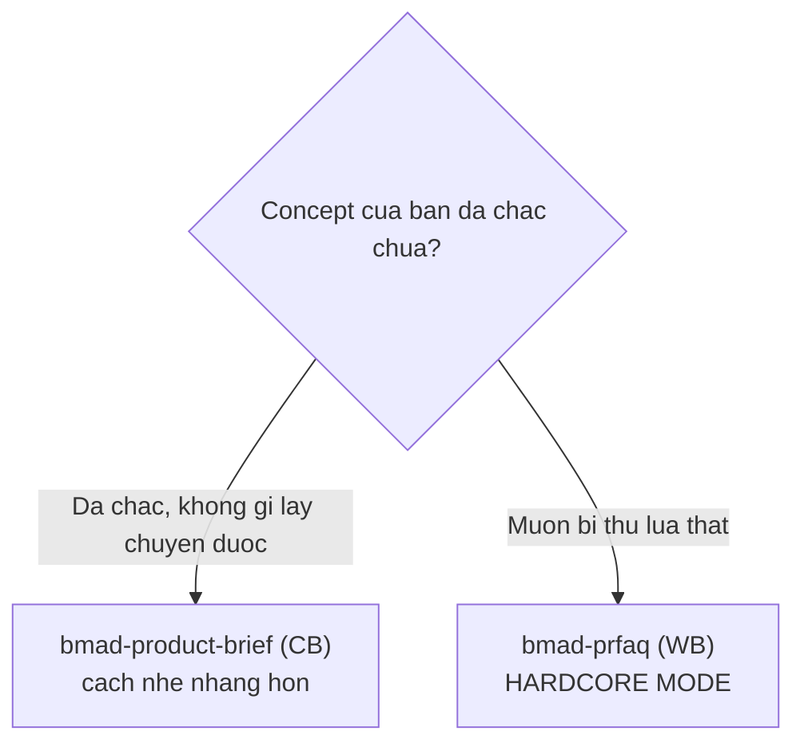
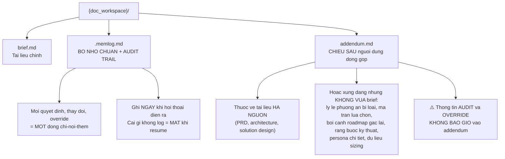
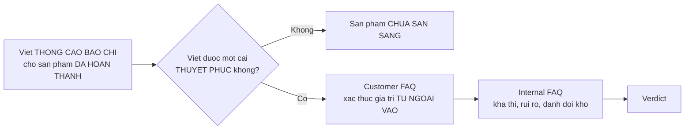
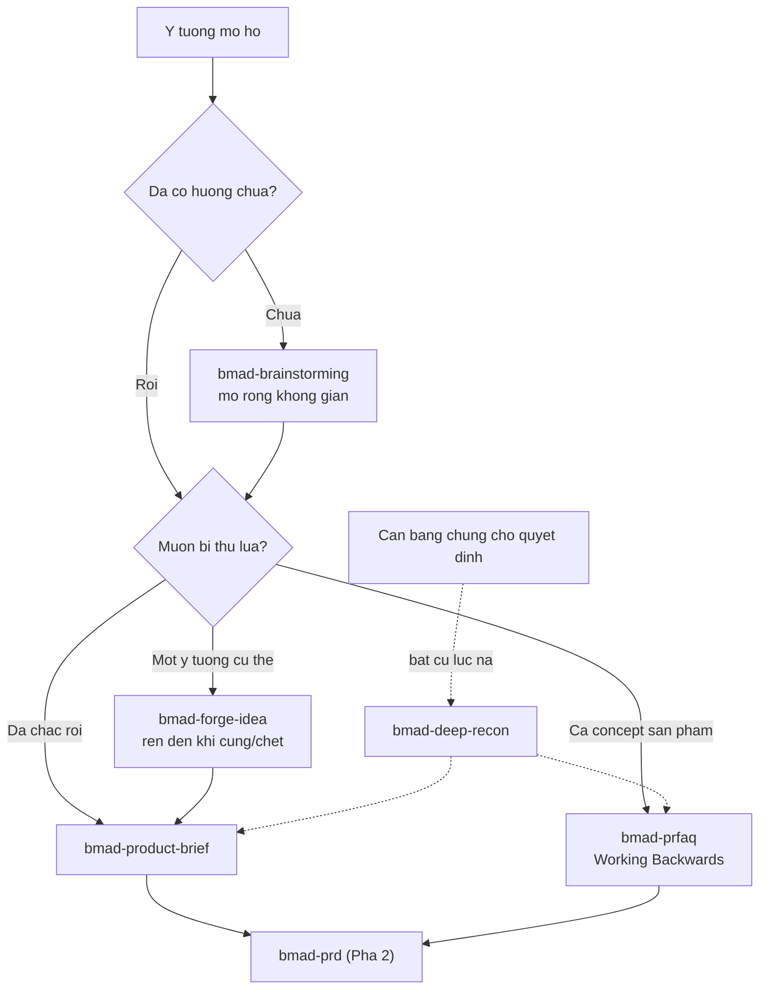

# 03 — Pha 1: Phân tích

> [← Chỉ mục](./index.md) · Trước: [02](./02-nam-agent-persona.md) · Tiếp: [04 — Pha 2](./04-pha2-lap-ke-hoach.md)

**Pha này hoàn toàn tùy chọn** — không mục nào `required = true`.

Hai skill của `bmm`: `bmad-product-brief`, `bmad-prfaq`. Ba skill khác thuộc `core` (`bmad-brainstorming`, `bmad-forge-idea`, `bmad-deep-recon`) — xem [tài liệu core](../tai-lieu-core/index.md).

---

## 1. Chọn giữa hai skill



Từ `module-help.csv`:

| Skill | Mô tả |
| --- | --- |
| `bmad-product-brief` | *"An expert guided experience to nail down your product idea in a brief. **a gentler approach than PRFAQ when you are already sure of your concept and nothing will sway you.**"* |
| `bmad-prfaq` | *"Working Backwards guided experience to **forge and stress-test** your product concept... through the PRFAQ gauntlet to determine feasibility and alignment with user needs. **alternative to product brief**."* |

⭐ Hai skill này **thay thế nhau**, không bổ sung nhau. Chọn một.

---

# Phần A — `bmad-product-brief`

## A.1 Nhận diện

| Thuộc tính | Giá trị |
| --- | --- |
| Mã menu | `CB` |
| Args | `-A` (autonomous) |
| Pha | `plan` |
| Bắt buộc | Không |
| Đường dẫn | `{planning_artifacts}/briefs/brief-{project_name}-{date}/` |
| Đầu ra | `brief.md`, `addendum.md`, `.memlog.md` |
| Agent | Mary 📊 (mã `CB`) |

## A.2 Ba ý định

| Ý định | Làm gì |
| --- | --- |
| **Create** | Brief mới qua hội thoại thật |
| **Update** | Hòa giải brief hiện có với tín hiệu thay đổi |
| **Validate** | Phê bình brief theo checklist |

## A.3 ⭐ Template là điểm khởi đầu, không phải hợp đồng

Trích SKILL.md:

> *Treat `{workflow.brief_template}` as a **starting structure, not a contract**: drop sections that do not earn their place, add sections the product needs, reorder freely — create sections for specialized domains or concerns also as needed. **The brief serves the product's story, not the template's shape.***

⭐ Đây là khác biệt lớn với nhiều công cụ tài liệu khác: template không ép cấu trúc.

## A.4 ⭐ Discovery trước, viết sau

> *Begin in `## Discovery` **before drafting**; the brief comes after the picture is on the table.*
>
> *do not assume: instead **converse and understand**, and then help craft the best product brief for their needs.*

## A.5 Ba file, ba vai trò



⭐ **Nắm bắt addendum *trong lúc* hội thoại:**

> *Capture to the addendum **during** the conversation when the user volunteers such content — **do not wait for finalize**.*

## A.6 ⭐ Bền vững thời gian thực

> *Once Create intent is confirmed, the workspace (run folder, `brief.md` skeleton with `status: draft`, `.memlog.md` seeded via `memlog.py init`) **exists on disk and the user knows the path**.*

```bash
uv run {project-root}/_bmad/scripts/memlog.py init \
  --workspace {doc_workspace} --field topic="<product>"
```

⭐ Người dùng biết đường dẫn **ngay** — phiên sống sót qua gián đoạn.

## A.7 Từ vựng memlog

```bash
uv run {project-root}/_bmad/scripts/memlog.py append \
  --workspace {doc_workspace} \
  --type <decision|change|override|assumption|event> \
  --text "<one-line gist, reason included>"
```

⭐ **`--text` phải kèm lý do** — không chỉ ghi *cái gì*, mà cả *vì sao*.

## A.8 `customize.toml` — 10 trường

```toml
[workflow]
activation_steps_prepend = []
activation_steps_append = []
persistent_facts = ["file:{project-root}/**/project-context.md"]
on_complete = ""

brief_template = "assets/brief-template.md"
brief_output_path = "{planning_artifacts}/briefs"
run_folder_pattern = "brief-{project_name}-{date}"

doc_standards = ["skill:bmad-review lenses=structure,prose"]
external_sources = []
external_handoffs = []
```

⭐ `doc_standards` mặc định gọi `bmad-review` với hai lens biên tập — đây là điểm giao `bmm` → `core`.

## A.9 Finalize

> *Polish: apply each entry in `{workflow.doc_standards}` (a `skill:`, `file:`, or plain-text directive) to `brief.md` (and `addendum.md` if it exists). **Run passes as parallel subagents** — apply all doc standards to `brief.md` **first**, then `addendum.md` so we present a high-quality draft for the user to review and finalize.*

## A.10 Chế độ headless

```json
{
  "status": "complete",
  "intent": "create",
  "brief": "{doc_workspace}/brief.md",
  "addendum": "{doc_workspace}/addendum.md",
  "memlog": "{doc_workspace}/.memlog.md"
}
```

Quy tắc:

| Quy tắc | Nội dung |
| --- | --- |
| Không hỏi | *"When invoked headless, **do not ask**"* |
| Tự khám phá | Dùng cái được cho, cái có trong `{doc_workspace}`, hoặc tự tìm |
| Ambiguous ⇒ halt | JSON `blocked` + trường `reason` — **không prompt** |
| `intent` phải khớp | `"create"` / `"update"` / `"validate"` |

## A.11 Ghi đè headless được log

> *Headless override: log the reversal via `memlog.py append --type override --text "<reversal + rationale>"`, **then** apply; halt `blocked` if intent is ambiguous.*

⭐ Quyết định tự động **luôn để lại dấu vết** — đây là lý do `--type override` tồn tại như một loại riêng.

## A.12 ⚠️ Update không phải patch

> *Before proposing changes, read the brief, addendum, `.memlog.md`, and original inputs — and **run the `## Discovery` posture against the change signal** (**a patch applied without context becomes drift**).*
>
> *Surface conflicts with prior decisions **before** changing.*
>
> *If the change is fundamental, **offer Create instead of patching**.*

---

# Phần B — `bmad-prfaq`

## B.1 Nhận diện

| Thuộc tính | Giá trị |
| --- | --- |
| Mã menu | `WB` (Working Backwards) |
| Args | `-H` / `--headless` |
| Pha | `plan` |
| Bắt buộc | Không |
| File | `SKILL.md`, `customize.toml`, `agents/` (2), `assets/`, `references/` (4), `bmad-manifest.json` |
| Đầu ra | `prfaq-{project}.md` + **PRD distillate** |
| Agent | Mary 📊 (mã `WB`) |

## B.2 Phương pháp Working Backwards



Trích SKILL.md:

> *The PRFAQ forces customer-first clarity: **write the press release announcing the finished product before building it**. **If you can't write a compelling press release, the product isn't ready.** The customer FAQ validates the value proposition from the outside in. The internal FAQ addresses feasibility, risks, and hard trade-offs.*

## B.3 ⭐⭐ "Hardcore mode" — nhưng có giới hạn

> ***This is hardcore mode.** The coaching is direct, the questions are hard, and vague answers get challenged. **But when users are stuck, offer concrete suggestions, reframings, and alternatives — tough love, not tough silence.** The goal is to **strengthen the concept, not to gatekeep it**.*

⭐ Hai vế của câu này quan trọng như nhau:

| Vế | Nghĩa |
| --- | --- |
| "hardcore, vague answers get challenged" | Không để câu trả lời mơ hồ trôi qua |
| "**tough love, not tough silence**" | Bí thì **giúp**, không im lặng nhìn |

## B.4 ⭐ Cả hai kết cục đều thắng

> *The user walks in with an idea. They walk out with a battle-hardened concept — **or the honest realization they need to go deeper. Both are wins.***

Giống `bmad-forge-idea` của core: **giết ý tưởng sớm là thành công**.

## B.5 ⭐⭐ Bắt buộc nghiên cứu thực tế

> ***Research-grounded.** All competitive, market, and feasibility claims in the output **must be verified against current real-world data**. **Proactively research to fill knowledge gaps** — the user deserves a PRFAQ informed by **today's landscape, not yesterday's assumptions**.*

⭐ Đây là ràng buộc mạnh: PRFAQ **không được** dựa vào kiến thức huấn luyện cho các khẳng định về thị trường và đối thủ.

⚠️ So sánh với `bmad-deep-recon` (core) — cùng tinh thần epistemics, nhưng `bmad-prfaq` áp nó cho *một phần* đầu ra chứ không phải toàn bộ.

## B.6 Bốn reference

| File | Nội dung |
| --- | --- |
| `references/press-release.md` | Cách viết thông cáo báo chí |
| `references/customer-faq.md` | Xác thực giá trị từ ngoài vào |
| `references/internal-faq.md` | Khả thi, rủi ro, đánh đổi |
| `references/verdict.md` | Kết luận |

## B.7 ⭐ Hai subagent chuyên biệt

```
agents/
├── artifact-analyzer.md    ← phân tích tạo phẩm đã có
└── web-researcher.md       ← nghiên cứu web
```

⭐ Đây là skill **duy nhất** trong `bmm` có thư mục `agents/` riêng chứa prompt subagent.

♻️ **Mẫu:** khi một skill cần subagent với vai trò cố định, đặt prompt của chúng thành file riêng thay vì nhúng inline.

## B.8 ⚠️ `bmad-manifest.json`

Skill này có file `bmad-manifest.json` — **duy nhất** trong toàn bộ `src/`. Nó phục vụ web bundle (`web-bundles/prfaq-coach/`).

## B.9 Hai đầu ra

| File | Vai trò |
| --- | --- |
| `prfaq-{project}.md` | Tài liệu PRFAQ đầy đủ |
| **PRD distillate** | Bản chưng cất cho pipeline hạ nguồn tiêu thụ |

⭐ *"A complete PRFAQ document + **PRD distillate for downstream pipeline consumption**"* — nghĩa là `bmad-prd` đọc được nó trực tiếp.

---

## 2. So sánh năm skill Pha 1

| | `bmad-brainstorming` (core) | `bmad-forge-idea` (core) | `bmad-deep-recon` (core) | `bmad-product-brief` | `bmad-prfaq` |
| --- | --- | --- | --- | --- | --- |
| **Hướng** | Phân kỳ — sinh nhiều | Hội tụ — nén một ý tưởng | Thu thập bằng chứng | Chốt tầm nhìn | Thử lửa concept |
| **Số ý tưởng** | > 100 | Một | — | Một | Một |
| **Lập trường** | Điều phối / đối tác / tự chạy | Chất vấn đối kháng | Giám đốc nghiên cứu | Hướng dẫn nhẹ nhàng | **Hardcore** |
| **Đồng ý** | Khuyến khích | **Bị cấm** | — | Được | **Bị thách thức** |
| **Kết cục** | Danh sách + tổng hợp | Hardened/Killed/Clearer | Báo cáo có trích dẫn | `brief.md` | PRFAQ + verdict |
| **Nghiên cứu web** | Không | Không | **Bắt buộc** | Không | **Bắt buộc cho claim thị trường** |
| **Có memlog** | ✅ | ✅ | ✅ | ✅ | — |

---

## 3. Luồng điển hình Pha 1



---

## 4. Vận hành thủ công

```bash
R="$(pwd)"
SK="$R/.claude/skills"

# Xem cấu hình product-brief
uv run "$R/_bmad/scripts/resolve_customization.py" -s "$SK/bmad-product-brief" -p "$R" -k workflow

# Đường dẫn đầu ra sẽ là gì?
uv run "$R/_bmad/scripts/resolve_customization.py" -s "$SK/bmad-product-brief" -p "$R" \
  -k workflow.brief_output_path -k workflow.run_folder_pattern

# Xem template
cat "$SK/bmad-product-brief/assets/brief-template.md"

# Xem 4 reference của prfaq
ls -1 "$SK/bmad-prfaq/references/"

# Xem 2 subagent prompt của prfaq
cat "$SK/bmad-prfaq/agents/web-researcher.md"

# Tìm phiên brief dở dang
find "$R/_bmad-output/planning-artifacts/briefs" -name ".memlog.md" 2>/dev/null | while read f; do
  echo "--- $f"; head -8 "$f"
done
```

---

## 5. Cạm bẫy

| Vấn đề | Nguyên nhân | Xử lý |
| --- | --- | --- |
| Brief bám cứng template | Hiểu sai template là hợp đồng | *"a starting structure, not a contract"* |
| Skill viết brief trước khi hiểu | Bỏ qua `## Discovery` | Discovery **trước**, draft **sau** |
| Nội dung sâu bị mất | Không capture vào addendum khi người dùng nói | Ghi **trong lúc** hội thoại, không đợi finalize |
| Thông tin audit lọt vào addendum | Nhầm vai trò file | Audit/override **chỉ** vào `.memlog.md` |
| Resume mất quyết định cũ | Không log vào memlog | *"whatever isn't logged is lost on resume"* |
| Update thành patch mù | Bỏ qua Discovery với change signal | *"a patch applied without context becomes drift"* |
| PRFAQ dùng số liệu cũ | Vi phạm ràng buộc research-grounded | Mọi claim thị trường phải verify với dữ liệu hiện tại |
| PRFAQ im lặng khi người dùng bí | Hiểu sai "hardcore mode" | *"tough love, **not tough silence**"* |
| Chạy cả brief lẫn prfaq | Chúng thay thế nhau | Chọn một |

---

**Tiếp:** [04 — Pha 2: Lập kế hoạch](./04-pha2-lap-ke-hoach.md) · [← Chỉ mục](./index.md)
