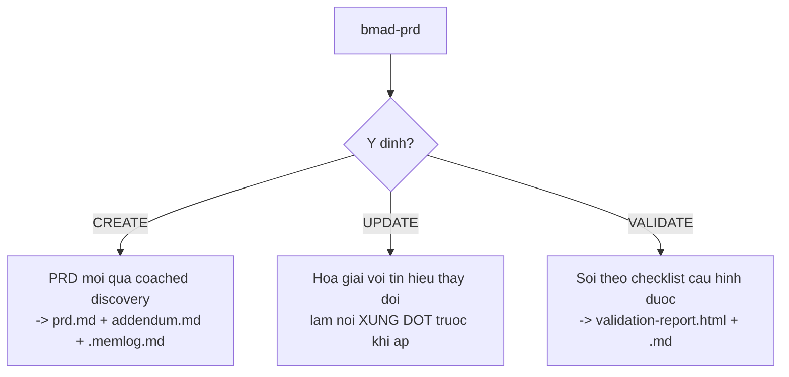
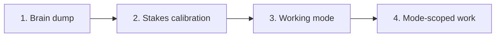
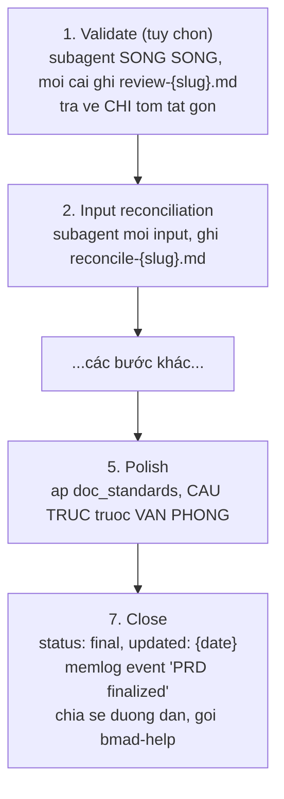
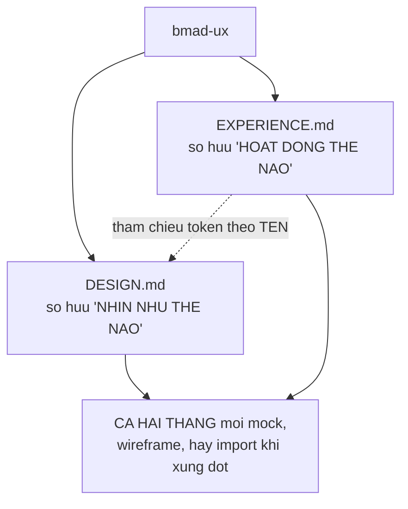
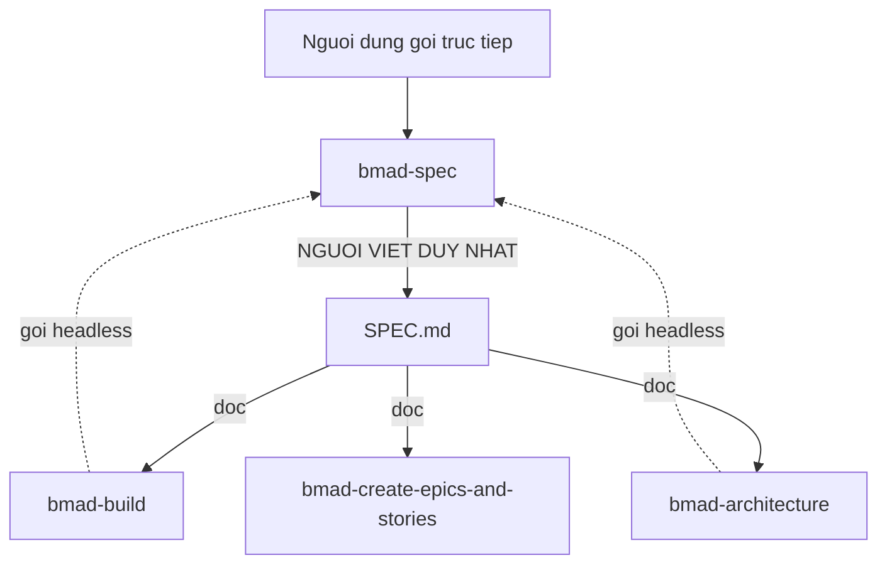

# 04 — Pha 2: Lập kế hoạch

> [← Chỉ mục](./index.md) · Trước: [03](./03-pha1-phan-tich.md) · Tiếp: [05 — Pha 3](./05-pha3-giai-phap.md)

**Cổng bắt buộc đầu tiên nằm ở đây:** `bmad-prd`.

Ba skill: `bmad-prd` (bắt buộc), `bmad-ux` (khi có UI), `bmad-spec` (thay thế nhẹ hơn).

---

# Phần A — `bmad-prd` ★ cổng bắt buộc

## A.1 Nhận diện

| Thuộc tính | Giá trị |
| --- | --- |
| Mã menu | `PRD` |
| Pha | `2-planning` |
| **Bắt buộc** | ✅ |
| `preceded-by` | `bmad-product-brief` (gợi ý mềm) |
| Đường dẫn | `{planning_artifacts}/prds/prd-{project_name}-{date}/` |
| Đầu ra | `prd.md`, `addendum.md`, `.memlog.md`, `validation-report.html` + `.md` |
| Asset | 4 file — template PRD, checklist validate, template báo cáo HTML, headless schema |
| Agent | John 📋 (mã `PRD`) |

## A.2 Ba ý định



⭐ **Create quét phiên dở trước khi tạo mới:**

> *For Create intent, **before binding a fresh workspace**, scan `{workflow.prd_output_path}` for prior in-progress runs (folders matching `{workflow.run_folder_pattern}` whose `prd.md` frontmatter `status` is **not `final`**); if any exist, **offer to resume rather than starting over**.*

## A.3 ⭐⭐ Thứ tự Discovery — bốn nước



> *Get to working mode **fast — two or three turns, not ten**. **Users in a hurry must not be held hostage by upstream probing.***

### Nước 1 — Brain dump

> *Always the first move, **even when the user opens with paragraphs of context** (that is intake, not the dump).*

Hỏi **cả** ngữ cảnh nói **và** input có sẵn: product brief, research, transcript khách hàng, phân tích cạnh tranh, bản nháp PRD cũ, tài liệu thiết kế.

> *Paths or paste; **big docs are fine, you will subagent-extract**. A simple **"anything else?"** surfaces what they almost forgot.*

### Nước 2 — Stakes calibration

> *One **short** probe before working mode: **hobby / internal / launch** — enough to calibrate rigor and section depth.*

⭐ Audience, Existing inputs, Downstream depth điền **bên trong** mode đã chọn, **không** ở trước lựa chọn.

### Nước 3 — Working mode

| Mode | Cách chạy |
| --- | --- |
| **Fast path** | Gom mọi khoảng trống còn lại thành 1–2 câu hỏi hợp nhất, rồi **soạn cả PRD** với tag `[ASSUMPTION]` ở chỗ suy đoán. Người dùng review và lặp |
| **Coaching path** | Đi cùng nhau qua các mục theo tư duy PM. Chọn xong hỏi tiếp **điểm vào** |

**Ba điểm vào của Coaching path:**

| Điểm vào | Dành cho | Đặc điểm |
| --- | --- | --- |
| **Vision + Features** | Enterprise, dev product, internal tool — ai tư duy theo tính năng | Capability-first |
| **Journey-led** | Consumer, UX-heavy, nhiều bên liên quan | User-first; journey có **nhân vật có tên** mang persona inline, **không** có mục persona riêng |
| *let me suggest* | Không chắc | Dựa trên cái đã nghe |

⭐ **Điểm vào đã chọn quyết định thứ tự các mục** của PRD.

## A.4 ⭐⭐ Elicitation, không phải authoring

> *Discovery **pulls the user's vision out; it does not insert yours**. Open-ended "tell me about X" beats multiple choice.*
>
> ***When you find yourself naming wedges, picking MVP cuts, or proposing phases, stop — you have crossed from elicitation into authoring. Hand the pen back.***
>
> *Infer-and-confirm ("I'm assuming X works like Y — right?") is fine; **quizzing the user through a tree of LLM-shaped choices is not**.*

⭐ Ranh giới rõ ràng:

| ✅ Được | ❌ Không được |
| --- | --- |
| "Kể tôi nghe về X" | Menu trắc nghiệm |
| "Tôi giả định X hoạt động như Y — đúng không?" | Tự đặt tên wedge |
| Hỏi mở | Tự chọn cắt MVP |
| | Tự đề xuất phase |

## A.5 ⭐ Concern scan — danh sách mở

> *As you read what the user gave you, **name the concerns this product actually carries** — compliance, integration density, operational SLAs, hardware constraints, public-API contracts, monetization, data governance, whatever applies. **The list is open; recognize what's there, do not classify into a fixed shape.***
>
> *These concerns drive **which template sections to pull in from the Adapt-In Menu** and **which to invent when no cluster names them**.*

⭐ Template có "Adapt-In Menu" — các mục được **kéo vào theo nhu cầu**, không phải mục cố định.

## A.6 Research subagent là mặc định

> ***Research subagents (default).** During Discovery, spawn web-research subagents to ground the picture: what exists in the space, how comparables position themselves, current landscape. **Subagent does the search; parent receives a digest.***

⭐ Cùng mẫu "extract, don't ingest" của `bmad-deep-recon`.

## A.7 Finalize — bảy bước



### ⭐ Subagent trả tóm tắt, không trả toàn văn

> *Each writes its full review to `{doc_workspace}/review-{slug}.md` and **returns ONLY a compact summary** (verdict, top 2-5 findings, file path) — **the parent never holds full review text**.*
>
> *If subagents are unavailable, run sequentially: **write the file *before* anything else**, then **flush the review from working context**.*

### ⭐ Input reconciliation bắt khoảng trống định tính

> *Surface gaps — **especially qualitative ideas (tone, voice, feel) the FR structure silently drops**. **Must happen before polish.***

⭐ Đây là phát hiện tinh tế: cấu trúc FR (yêu cầu chức năng) **âm thầm làm rơi** ý tưởng về giọng điệu, cảm giác, không khí — thứ không nhét vừa dạng "hệ thống phải…".

### ⭐ Polish theo thứ tự

> *Apply `{workflow.doc_standards}` to `prd.md` and `addendum.md` **in declared order** (**structural passes before prose — prose should not polish soon-to-be-cut text**). **Parallelize across documents, sequential within.***

## A.8 `customize.toml` — 12 trường

```toml
[workflow]
activation_steps_prepend = []
activation_steps_append = []
persistent_facts = ["file:{project-root}/**/project-context.md"]
on_complete = ""

prd_template = "assets/prd-template.md"
validation_checklist_template = "assets/prd-validation-checklist.md"
validation_report_template = "assets/validation-report-template.html"
prd_output_path = "{planning_artifacts}/prds"
run_folder_pattern = "prd-{project_name}-{date}"

doc_standards = ["skill:bmad-review lenses=structure,prose"]
external_sources = []
external_handoffs = []
finalize_reviewers = []          # ⭐ chỉ bmad-prd có trường này
```

⭐ `finalize_reviewers` — thêm reviewer tùy chỉnh vào bước finalize, chạy song song cùng `doc_standards`.

## A.9 Update dùng bootstrap subagent

> *If `.memlog.md` is missing, init it..., then spawn a **one-time bootstrap subagent to reverse-engineer a thin log from the PRD** (one `memlog.py append --type decision --text "<recovered decision>"` per recovered decision) **before continuing**.*

⭐ PRD cũ (trước chuẩn memlog) vẫn dùng được — subagent dựng lại log mỏng từ chính tài liệu.

---

# Phần B — `bmad-ux`

## B.1 Nhận diện

| Thuộc tính | Giá trị |
| --- | --- |
| Mã menu | `CU` |
| Pha | `2-planning` |
| Bắt buộc | Không |
| `preceded-by` | `bmad-prd` |
| Đường dẫn | `{planning_artifacts}/ux-designs/ux-{project_name}-{date}/` |
| Đầu ra | **`DESIGN.md`** + **`EXPERIENCE.md`** (hai contract ngang hàng) |
| Asset | **10 file** — nhiều nhất trong `bmm` |
| Agent | Sally 🎨 (mã `CU`) |

## B.2 ⭐⭐ Lập trường: gợi mở, không áp đặt

> *You are a master UX facilitator. **Elicit and capture the user's vision, never impose yours.** Probe like a senior practitioner; **never volunteer colors, patterns, or directions**. Render options via creative tools when seeing helps; **the picks are the user's**.*

⭐ Câu *"never volunteer colors, patterns, or directions"* là ràng buộc rất cụ thể — LLM có xu hướng mạnh đề xuất palette và layout.

## B.3 ⭐⭐ Hai spine ngang hàng



| | `DESIGN.md` | `EXPERIENCE.md` |
| --- | --- | --- |
| Sở hữu | **Nhìn như thế nào** | **Hoạt động như thế nào** |
| Chuẩn | [Google Labs design.md spec](https://github.com/google-labs-code/design.md) | Riêng của BMad |
| Nội dung | Token màu, typography, bo góc, spacing, component | IA, hành vi, trạng thái, tương tác, accessibility, journey |
| Tham chiếu chéo | — | Trỏ token của DESIGN.md bằng `{path.to.token}` |

> *Both spines **win on conflict** with any mock, wireframe, or import.*

## B.4 Cấu trúc `DESIGN.md`

**Frontmatter YAML — 5 nhóm token:**

`colors` · `typography` · `rounded` · `spacing` · `components`

**Thân markdown — thứ tự chuẩn:**

**Brand & Style** · **Colors** · **Typography** · **Layout & Spacing** · **Elevation & Depth** · **Shapes** · **Components** · **Do's and Don'ts**

> *Sections **omittable**; order **locked when present**.*

## B.5 Cấu trúc `EXPERIENCE.md`

**Luôn có:**

| Mục | Nội dung | Ranh giới với DESIGN.md |
| --- | --- | --- |
| **Foundation** | Form-factor, UI system | DESIGN.md là tham chiếu identity thị giác |
| **Information Architecture** | | |
| **Voice and Tone** | Microcopy | **Brand voice** ở `DESIGN.md.Brand & Style` |
| **Component Patterns** | **Hành vi** | **Spec thị giác** ở `DESIGN.md.Components` |
| **State Patterns** | | |
| **Interaction Primitives** | | |
| **Accessibility Floor** | **Hành vi** | **Contrast thị giác** ở DESIGN.md |
| **Key Flows** | Journey có **nhân vật có tên**, kèm **beat cao trào** | |

**Khi được kích hoạt:** *Inspiration & Anti-patterns* · *Responsive & Platform*

⭐ Ranh giới DESIGN/EXPERIENCE được vẽ **ba lần** trong ba mục — đây là chỗ dễ lẫn nhất.

## B.6 Mười asset

| Nhóm | File |
| --- | --- |
| Hướng thiết kế | `design-directions.md`, `color-themes.md`, `key-screens.md` |
| Ví dụ DESIGN.md | `design-example-editorial.md`, `design-example-mobile.md`, `design-example-shadcn.md` |
| Ví dụ EXPERIENCE.md | `experience-example-mobile.md`, `experience-example-shadcn.md` |
| Công cụ | `excalidraw-wireframe.md` |
| Khác | `headless-schemas.md`, `validation-report-template.html` |

⭐ *"Shape: **read every entry in `{workflow.design_md_examples}`**"* — ví dụ là cách skill học hình dạng, không phải đặc tả khô.

---

# Phần C — `bmad-spec`

## C.1 Nhận diện

| Thuộc tính | Giá trị |
| --- | --- |
| Mã menu | `SPC` |
| Args | `[path]` |
| Pha | `anytime` |
| Bắt buộc | Không |
| Đường dẫn | `{output_folder}/specs/spec-{slug}/` |
| Đầu ra | `SPEC.md` + companion, `stories.yaml` (tùy chọn) |
| Agent | *(không có trong menu agent nào)* |

## C.2 ⭐⭐ Người viết duy nhất của `SPEC.md`

> *Canonical transformer for the BMad spec-kernel ecosystem.*
>
> *It is the **only writer of `SPEC.md`**; other skills invoke it **headless** when they need to express or update intent.*
>
> ***Multiple skills may call to update the same spec over time.***



♻️ **Mẫu:** một tạo phẩm, **một** người viết. Skill khác muốn sửa thì **gọi** người viết đó, không tự ghi.

## C.3 Đầu vào — bất kỳ thứ gì mang ý định

> *Takes **any intent input** — vague idea, brain dump, PRD, GDD, RFC, brief, Slack thread, customer email, meeting transcript, mockups, **mixed multi-source**.*

## C.4 Kernel 5 trường

| Trường | Nội dung | Quy tắc |
| --- | --- | --- |
| **Why** | Lực đằng sau công việc | Bốn loại: pain / opportunity / vision / mandate. Nêu rõ loại nào |
| **Capabilities** | `intent` + `success` mỗi CAP | `success` phải **test được hoặc chứng minh được** |
| **Constraints** | Điều không thương lượng bẻ cong thiết kế | *"**If it doesn't rule anything out, it doesn't belong.**"* |
| **Non-goals** | Ngoài phạm vi tường minh | **Ít nhất một.** *"Stops downstream from filling the vacuum."* |
| **Success signal** | Khoảnh khắc thế giới đổi | *"**World-change moment, not dashboard.**"* |

**Hai mục tùy chọn:**

| Mục | Quy tắc |
| --- | --- |
| `Assumptions` | Suy đoán không có xác nhận trực tiếp. **Bỏ hẳn mục nếu rỗng** |
| `Open Questions` | Cần người quyết trước khi hạ nguồn tiêu thụ. **Bỏ hẳn mục nếu rỗng** |

## C.5 ⭐ Companion vs Sources

```yaml
---
id: SPEC-{slug}
companions: []     # files downstream MUST read alongside SPEC.md
sources: []        # files fully absorbed into the SPEC (audit only; downstream does NOT read these). Never the memlog.
---
```

| Trường | Hạ nguồn đọc? | Vai trò |
| --- | :-: | --- |
| `companions` | ✅ **Phải đọc** | Nội dung chịu lực không vừa kernel |
| `sources` | ❌ **Không đọc** | Chỉ để truy vết |

⚠️ *"**Never the memlog**"* trong `sources` — memlog là bộ nhớ quy trình, không phải nguồn nội dung.

## C.6 ⭐ Phát hiện headless

> *Detect mode. **Headless** when any of: **no TTY**, **programmatic caller** (another skill or non-interactive runner), or **the first message pre-supplies all inputs and asks for an artifact path back**. **Interactive** otherwise.*

⭐ Ba tín hiệu, chỉ cần **một** là headless.

## C.7 `stories.yaml` — cầu nối sang tự động

Từ `docs/reference/workflow-map.md`:

> *On request it can also break a spec into an **ordered `stories.yaml`** for **autonomous dispatch**.*

Dùng bởi `bmad-build-auto` — xem [06](./06-pha4-thuc-thi.md).

## C.8 `customize.toml` — 8 trường

```toml
[workflow]
activation_steps_prepend = []
activation_steps_append = []
persistent_facts = ["file:{project-root}/project-context.md"]   # ⚠️ KHÔNG glob **
on_complete = ""

spec_template = "assets/spec-template.md"
spec_filename = "SPEC.md"
spec_output_path = "{output_folder}/specs"
run_folder_pattern = "spec-{slug}"
```

⚠️ **`persistent_facts` của `bmad-spec` KHÔNG dùng glob `**`** — nó chỉ trỏ `{project-root}/project-context.md` ở gốc.

So sánh:

| Skill | `persistent_facts` mặc định |
| --- | --- |
| `bmad-prd`, `bmad-ux`, `bmad-architecture`, `bmad-product-brief` | `file:{project-root}/**/project-context.md` |
| **`bmad-spec`** | **`file:{project-root}/project-context.md`** |

⚠️ Nếu `project-context.md` của bạn nằm trong thư mục con, `bmad-spec` **sẽ không thấy**. Thêm override nếu cần.

---

## 2. So sánh ba skill Pha 2

| | `bmad-prd` | `bmad-ux` | `bmad-spec` |
| --- | --- | --- | --- |
| **Bắt buộc** | ✅ | ❌ | ❌ |
| **Người tiêu thụ** | Người đọc và tranh luận | Người + hạ nguồn | **Máy** |
| **Kích thước** | Nhiều trang | Hai contract | Súc tích |
| **Đầu vào** | Coached discovery | PRD + gợi mở | **Bất kỳ intent input nào** |
| **Gọi headless được** | ✅ | ✅ | ✅ **thường xuyên** |
| **Nhiều skill cùng ghi** | ❌ | ❌ | ✅ **theo thời gian** |
| **Có `stories.yaml`** | ❌ | ❌ | ✅ tùy chọn |
| **Trong menu agent** | John `PRD` | Sally `CU` | **không có** |

---

## 3. Vận hành thủ công

```bash
R="$(pwd)"; SK="$R/.claude/skills"

# So sánh persistent_facts của 3 skill
for s in bmad-prd bmad-ux bmad-spec; do
  echo "--- $s"
  uv run "$R/_bmad/scripts/resolve_customization.py" -s "$SK/$s" -p "$R" -k workflow.persistent_facts
done

# Xem template PRD
head -60 "$SK/bmad-prd/assets/prd-template.md"

# Xem checklist validate
head -40 "$SK/bmad-prd/assets/prd-validation-checklist.md"

# Xem kernel spec
sed -n '/## Why/,/## Assumptions/p' "$SK/bmad-spec/assets/spec-template.md"

# 10 asset của bmad-ux
ls -1 "$SK/bmad-ux/assets/"

# Tìm PRD dở dang (status != final)
find "$R/_bmad-output/planning-artifacts/prds" -name "prd.md" 2>/dev/null | while read f; do
  st=$(grep -m1 "^status:" "$f")
  echo "$f -> $st"
done
```

---

## 4. Cạm bẫy

| Vấn đề | Nguyên nhân | Xử lý |
| --- | --- | --- |
| PRD hỏi 10 lượt trước khi vào việc | Vi phạm *"two or three turns, not ten"* | Get to working mode **fast** |
| Skill tự đặt tên wedge, tự cắt MVP | **Vượt ranh giới elicitation → authoring** | *"Hand the pen back"* |
| Menu trắc nghiệm dạng cây | Vi phạm elicitation | Câu hỏi mở thay thế |
| Ý tưởng về giọng điệu bị mất | Cấu trúc FR âm thầm làm rơi | Input reconciliation **trước polish** |
| Prose polish text sắp bị cắt | Sai thứ tự doc_standards | **Structural trước prose** |
| Parent giữ toàn văn review | Vi phạm quy tắc subagent | Ghi file, trả **tóm tắt gọn** |
| Skill tự đề xuất màu, layout | Vi phạm lập trường `bmad-ux` | *"never volunteer colors, patterns, or directions"* |
| Lẫn DESIGN.md và EXPERIENCE.md | Ranh giới hành vi / thị giác | Ranh giới nêu rõ ở 3 mục |
| `bmad-spec` không thấy project-context | `persistent_facts` **không** dùng glob `**` | Thêm override |
| Skill khác tự ghi `SPEC.md` | Vi phạm "only writer" | Gọi `bmad-spec` headless |
| Đặt memlog vào `sources` | Vi phạm *"Never the memlog"* | memlog là bộ nhớ quy trình |

---

**Tiếp:** [05 — Pha 3: Giải pháp](./05-pha3-giai-phap.md) · [← Chỉ mục](./index.md)
