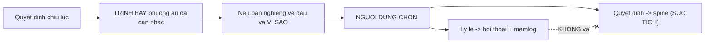
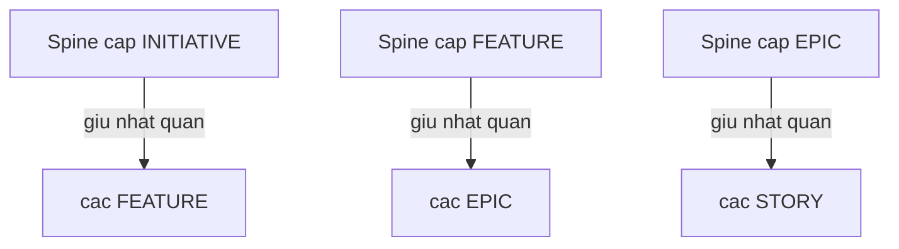
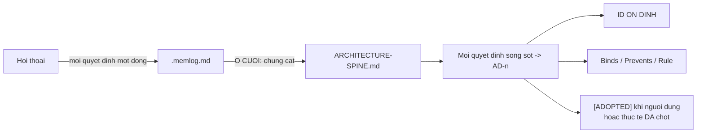
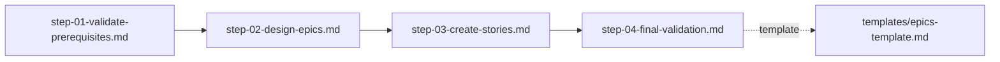
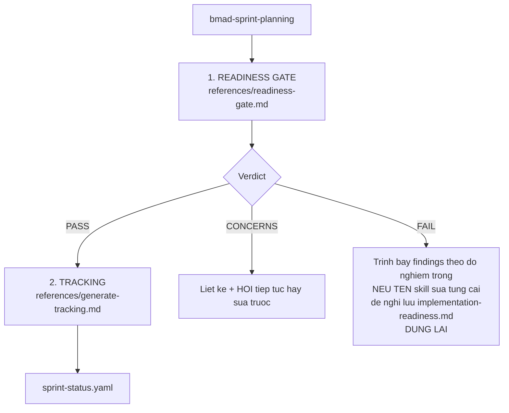
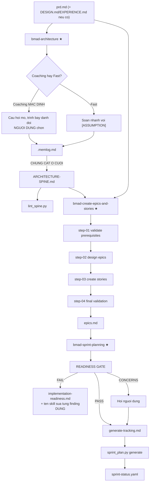

# 05 — Pha 3: Giải pháp

> [← Chỉ mục](./index.md) · Trước: [04](./04-pha2-lap-ke-hoach.md) · Tiếp: [06 — Pha 4](./06-pha4-thuc-thi.md)

**Ba cổng bắt buộc liên tiếp** — pha có nhiều ràng buộc nhất.

---

# Phần A — `bmad-architecture` ★

## A.1 Nhận diện

| Thuộc tính | Giá trị |
| --- | --- |
| Mã menu | `CA` |
| Pha | `plan` |
| **Bắt buộc** | ✅ |
| Đường dẫn | `{planning_artifacts}/architecture/architecture-{project_name}-{date}/` |
| Đầu ra | `ARCHITECTURE-SPINE.md` + `.memlog.md` |
| Script riêng | `lint_spine.py` |
| Agent | Winston 🏗️ (mã `CA`) |

## A.2 ⭐⭐ Coaching là mặc định — và phải giữ vững

> *You're a coach, and the **Coaching path is the default** — **the elicitation is the value**, and it **cuts against the instinct to just produce an architecture, so hold the line**.*
>
> *Unless the user clearly wants speed, **coach; don't silently draft**.*

| Path | Cách chạy |
| --- | --- |
| **Coaching** (mặc định) | Làm cùng nhau — câu hỏi mở, kéo quyết định ra từ người dùng, đẩy lùi chỗ nào mỏng |
| **Fast** | Soạn cả spine nhanh với tag `[ASSUMPTION]` để người dùng sửa khi review |

⭐ *"On the Fast path, **inferring and tagging *is* the job**"* — Fast path không phải làm ẩu, mà là suy đoán **có đánh dấu**.

## A.3 ⭐⭐ Quyết định chịu lực phải được TRÌNH BÀY

> *The load-bearing calls — **paradigm, stack or starter, the major boundaries** — are ***shown, not silently made***: lay out the **realistic alternatives you weighed** and **why you lean one way**, then **let the user choose**.*
>
> *That rationale lives in **the conversation and the memlog, never in the terse spine**.*



⭐ Đây là lý do `communication_style` của Winston là *"Answers with **trade-offs, not verdicts**"*.

## A.4 Elicit, đừng quiz

> *Elicit, don't quiz: open-ended **"how are you thinking about X?"** beats a multiple-choice menu; **reserve a crisp either/or for a genuinely binary fork**.*

## A.5 ⭐ Greenfield vs Brownfield

| | Greenfield / dự án nhỏ | Brownfield |
| --- | --- | --- |
| Cách làm | **Đề xuất starter nổi tiếng hiện hành** (verify trên web trước) | **Điều tra trước khi quyết** |
| Lý do | *"a good one **pre-decides a coherent slab of the architecture for free**"* | Đọc đủ mã thật để **phê chuẩn quy ước đã có** |
| Cấm | — | *"**don't re-tell the user what the scan already shows**"* |
| Cấm | — | *"**ratify** the conventions already there **rather than invent new ones**"* |

## A.6 ⭐⭐ Sáu loại đầu vào — đọc để biết loại việc

> *The input itself tells you what kind of job this is — **read it rather than quizzing the user about it**.*

| Đầu vào | Loại việc |
| --- | --- |
| **Spec package** (`SPEC.md` + memlog) | **Khởi đầu giàu nhất** và là **nhà của spine** — gấp spine trở lại vào nó |
| Ý tưởng thô | Dựng từ đầu |
| Tài liệu kiến trúc dàn trải | **Chưng cất xuống** |
| Codebase hiện có | **Rút spine RA TỪ nó** — phê chuẩn, không tài-liệu-hóa-lại |
| Lát cắt mà một feature mới chạm | Phạm vi hẹp |
| Spine hiện có | Mở rộng hoặc thử lửa |

⭐ *"**Prefer a `.memlog.md` over re-reading the source it came from**"* — memlog là bản chưng cất, rẻ hơn nguồn.

⭐ *"If the input is **too thin** to build on, **suggest `bmad-spec` first**"*.

## A.7 ⭐⭐ Altitude — độ cao của spine

> *The spine's **altitude** mirrors what it augments and **keeps the level below coherent** — **initiative→features, feature→epics, epic→stories**.*



### Kế thừa spine cha

> *load the parent `ARCHITECTURE-SPINE.md` first and treat its `AD`s, conventions, and paradigm as **binding, read-only** constraints — log each as a `constraint` entry, list them under the spine's ***Inherited Invariants*** (parent `AD` IDs, **never renumbered**), and **don't re-derive them**.*
>
> *Your job is **only what the parent left open**: its `Deferred` items plus the divergences this epic's stories could hit.*
>
> *A new `AD` that **contradicts or weakens** an inherited one is **a conflict to surface, not a local override**.*
>
> *An epic spine fixes the invariants the epic's stories must share — it does **not** expand per-story detail.*

⭐ Bốn ràng buộc mạnh: read-only, không đánh số lại, không tự override, không phình chi tiết.

## A.8 ⭐⭐ Spine được chưng cất từ memlog Ở CUỐI

> *The **memlog** is the run's working memory: every decision, constraint, version, assumption, and open question lands as one append-only line — for a decision, capture **what it binds** and **the divergence it prevents**.*
>
> *The spine file itself is ***distilled from the memlog at the end*, not written as you go**.*



⭐ *"a decision that **lives only in a diagram** still gets logged"*.

⭐ Memlog **không có trạng thái vòng đời** — khoảnh khắc kết thúc log thành `event`, không phải cờ frontmatter. Giống `memlog.py` chuẩn.

## A.9 ⭐ Quét đủ chiều rộng

> *Sweep the breadth the altitude owns — **every structural dimension is decided, deferred, or an open question**; **a whole dimension left silent** (e.g. the operational/environmental envelope: deployment & environments, infra/provider strategy, operations) **is the failure, not a clean spine**.*

⭐ Ba trạng thái hợp lệ cho mỗi chiều: **quyết định** / **hoãn** / **câu hỏi mở**. **Im lặng** không phải trạng thái hợp lệ.

## A.10 ⭐ Không placeholder, không bịa

> *No placeholders; **never invent to fill a gap**.*
>
> *The template's `<!-- -->` notes are guidance — **act on them, then strip them**; the finished spine **carries no template comment**, and only the diagrams that convey the structure (as many as the altitude needs, **valid mermaid**).*

## A.11 Cấu trúc `AD` (Architecture Decision)

| Trường | Nội dung |
| --- | --- |
| `AD-n` | ID ổn định |
| **Binds** | Cái nó ràng buộc |
| **Prevents** | Sự phân kỳ nó ngăn |
| **Rule** | Quy tắc cụ thể |
| `[ADOPTED]` | Khi người dùng hoặc thực tế đã chốt sẵn |

## A.12 Hai reference

| File | Nội dung |
| --- | --- |
| `references/headless.md` | Chế độ headless |
| `references/reviewer-gate.md` | Cổng reviewer |

---

# Phần B — `bmad-create-epics-and-stories` ★

## B.1 Nhận diện

| Thuộc tính | Giá trị |
| --- | --- |
| Mã menu | `CE` |
| Pha | `plan` |
| **Bắt buộc** | ✅ |
| `preceded-by` | `bmad-architecture` |
| Đường dẫn | `{planning_artifacts}` (**không** có run folder) |
| Đầu ra | `epics.md` |
| Kiến trúc | **File-bước** — 4 step |
| Agent | John 📋 (mã `CE`) |

## B.2 Bốn bước



⭐ Đây là skill **duy nhất** trong `plan/` dùng kiến trúc file-bước với thư mục `steps/`.

⚠️ Khác `bmad-build`: nó **không** kết xuất qua `render_skill.py` — `SKILL.md` chứa logic và trỏ tới `steps/` bằng đường dẫn tương đối thường.

## B.3 ⭐ Không có `customize.toml` output path

`bmad-create-epics-and-stories` **không** có `*_output_path` hay `run_folder_pattern` — nó ghi thẳng `epics.md` vào `{planning_artifacts}`.

Lý do: chỉ có **một** file epics cho cả dự án, không phải nhiều run song song.

---

# Phần C — `bmad-sprint-planning` ★

## C.1 Nhận diện

| Thuộc tính | Giá trị |
| --- | --- |
| Mã menu | `SP` (planning) / `SS` (status) |
| Pha | `plan` / `anytime` |
| **Bắt buộc** | ✅ (chỉ `SP`) |
| Đầu ra | `sprint-status.yaml` (+ `implementation-readiness.md` khi FAIL) |
| Reference | 5 file |
| Script riêng | `sprint_plan.py` |
| Agent | John `IR` · Winston `IR` · Amelia `SP` |

## C.2 Hai việc trong một skill



## C.3 ⭐⭐ Cổng sẵn sàng — một câu hỏi duy nhất

> *Assess the plan as a whole against **one question**: ***could a developer implement these epics without inventing decisions nothing records?***

⭐ Toàn bộ cổng quy về một câu hỏi. Bốn tiêu chí bên dưới đều phục vụ nó:

| # | Tiêu chí |
| --- | --- |
| 1 | Yêu cầu và quyết định trong tạo phẩm intent **truy vết xuôi** vào story; story **truy vết ngược** về intent đã ghi — **gắn cờ mồ côi ở CẢ HAI chiều** |
| 2 | Epic giao giá trị người dùng và **không mang phụ thuộc xuôi**; story **hoàn thành độc lập được** |
| 3 | Quyết định kiến trúc và UX mà story dựa vào **được ghi ở đâu đó, không phải giả định** |
| 4 | Xung đột giữa tạo phẩm (spec và epic bất đồng) **được nêu ra, không âm thầm giải quyết** |

## C.4 ⭐ Nhận dạng tài liệu bằng NỘI DUNG

> *Identify documents by **reading what they are, not by filename patterns**; projects arrive with **different artifact mixes and naming**.*

⭐ Không có regex tên file nào. Skill đọc và phán đoán.

## C.5 ⭐ Thiếu tài liệu không tự động là lỗi

> *A missing document type is **only a finding if stories depend on decisions nothing records** — **a project with no UX artifact and no UI stories is fine**.*

⭐ Đây là ràng buộc chống "checklist máy móc": không có `DESIGN.md` **không** phải lỗi nếu không có story UI nào.

## C.6 Ba verdict

| Verdict | Hành động |
| --- | --- |
| **PASS** | Nêu trong **một dòng**; nếu là ý định sprint-planning đầy đủ ⇒ tiếp tục `generate-tracking.md` |
| **CONCERNS** | Liệt kê **ngắn gọn** kèm **chỗ khoảng trống nằm**; hỏi `{user_name}` tiếp tục hay sửa trước |
| **FAIL** | Kế hoạch **không thực thi được như đã ghi**. Trình bày findings **theo độ nghiêm trọng**, **nêu tên skill sửa từng cái**, đề nghị lưu `{planning_artifacts}/implementation-readiness.md`, và **DỪNG** |

⭐ **FAIL nêu tên skill sửa:** skill plan liên quan, hoặc `bmad-correct-course` cho thay đổi xuyên cắt.

## C.7 ⭐ Chỉ kiểm tra readiness thì dừng ở đó

> *If the user **only asked to check readiness**, **this gate is the deliverable** — report the verdict and **stop**.*

⭐ Đây là lý do John và Winston dùng mã `IR` với mô tả *"(opens sprint planning; **stop after the gate or continue into tracking**)"*.

## C.8 Năm reference

| File | Vai trò |
| --- | --- |
| `readiness-gate.md` | Cổng sẵn sàng |
| `generate-tracking.md` | Sinh `sprint-status.yaml` |
| `status-view.md` | Xem trạng thái (`SS`) |
| `validate.md` | Kiểm tra file tracking |
| `fix-sprint-status.md` | Sửa chữa file tracking |

## C.9 `sprint_plan.py` — ba lệnh

```bash
SK=".claude/skills/bmad-sprint-planning"

# Sinh tracking
uv run "$SK/scripts/sprint_plan.py" generate \
  --epic-file <epics.md> --status-file <sprint-status.yaml> \
  --stories-dir <dir> --project <name> --date <MM-DD-YYYY> \
  [--project-key KEY] [--tracking-system file-system] [--story-location path] \
  [--dry-run] [--fresh] [--set KEY=STATUS]

# Xem trạng thái
uv run "$SK/scripts/sprint_plan.py" status \
  --status-file <sprint-status.yaml> [--date D] [--stale-days N]

# Kiểm tra file
uv run "$SK/scripts/sprint_plan.py" validate --status-file <sprint-status.yaml>
```

| Cờ | Tác dụng |
| --- | --- |
| `--dry-run` | Không ghi, chỉ hiện kết quả |
| `--fresh` | Tạo mới thay vì hòa nhập file cũ |
| `--set KEY=STATUS` | Đặt trạng thái một story, lặp lại được |
| `--stale-days N` | Ngưỡng đánh dấu story "ôi" |

---

## 2. So sánh ba skill Pha 3

| | `bmad-architecture` | `bmad-create-epics-and-stories` | `bmad-sprint-planning` |
| --- | --- | --- | --- |
| **Bắt buộc** | ✅ | ✅ | ✅ |
| **Run folder** | ✅ | ❌ | ❌ |
| **Kiến trúc** | Đơn + references | **File-bước (4 step)** | Đơn + 5 references |
| **Script riêng** | `lint_spine.py` | ❌ | `sprint_plan.py` |
| **Memlog** | ✅ chưng cất từ nó | ❌ | ❌ |
| **Có thể dừng giữa chừng** | Resume qua memlog | ❌ | ✅ dừng sau gate |
| **Agent** | Winston `CA` | John `CE` | John `IR`, Winston `IR`, Amelia `SP` |

---

## 3. Luồng Pha 3



---

## 4. Vận hành thủ công

```bash
R="$(pwd)"; SK="$R/.claude/skills"

# Cấu hình architecture
uv run "$R/_bmad/scripts/resolve_customization.py" -s "$SK/bmad-architecture" -p "$R" -k workflow

# Lint một spine
uv run "$SK/bmad-architecture/scripts/lint_spine.py" <duong-dan-spine.md>

# Đọc phương pháp cổng sẵn sàng
cat "$SK/bmad-sprint-planning/references/readiness-gate.md"

# Xem template epics
cat "$SK/bmad-create-epics-and-stories/templates/epics-template.md"

# Bốn bước của epics
ls -1 "$SK/bmad-create-epics-and-stories/steps/"

# Kiểm tra file sprint-status
uv run "$SK/bmad-sprint-planning/scripts/sprint_plan.py" validate \
  --status-file "$R/_bmad-output/implementation-artifacts/sprint-status.yaml"

# Xem trạng thái, đánh dấu story ôi quá 7 ngày
uv run "$SK/bmad-sprint-planning/scripts/sprint_plan.py" status \
  --status-file "$R/_bmad-output/implementation-artifacts/sprint-status.yaml" \
  --stale-days 7

# Đặt tay một story
uv run "$SK/bmad-sprint-planning/scripts/sprint_plan.py" generate \
  --epic-file "$R/_bmad-output/planning-artifacts/epics.md" \
  --status-file "$R/_bmad-output/implementation-artifacts/sprint-status.yaml" \
  --stories-dir "$R/_bmad-output/implementation-artifacts" \
  --project "my-project" --date "$(date +%m-%d-%Y)" \
  --set "1-1-mo-hinh-du-lieu=done" --dry-run
```

---

## 5. Cạm bẫy

| Vấn đề | Nguyên nhân | Xử lý |
| --- | --- | --- |
| Skill âm thầm soạn kiến trúc | Bỏ qua Coaching mặc định | *"coach; **don't silently draft**"* |
| Quyết định chịu lực bị quyết ngầm | Vi phạm *"shown, not silently made"* | Trình bày phương án, để người dùng chọn |
| Lý lẽ dài dòng lọt vào spine | Nhầm chỗ | Lý lẽ ở **hội thoại + memlog**, spine **súc tích** |
| Brownfield kể lại cấu trúc repo | Vi phạm *"don't re-tell what the scan shows"* | Phê chuẩn, không tài-liệu-hóa-lại |
| Spine cha bị đánh số lại | Vi phạm kế thừa | *"never renumbered"* |
| `AD` mới mâu thuẫn `AD` cha | Tự override | **Nêu ra như xung đột** |
| Một chiều cấu trúc bị bỏ im lặng | Vi phạm quét đủ chiều rộng | Quyết định / hoãn / câu hỏi mở — **không im lặng** |
| Spine còn comment template | Quên strip | *"carries no template comment"* |
| Spine viết dần trong lúc chạy | Sai quy trình | **Chưng cất từ memlog Ở CUỐI** |
| Cổng FAIL vì thiếu `DESIGN.md` | Checklist máy móc | Thiếu tài liệu chỉ là lỗi **nếu story phụ thuộc** |
| Nhận dạng tài liệu bằng tên file | Vi phạm | Đọc **nội dung**, không dựa mẫu tên |
| Gate PASS rồi vẫn hỏi tiếp | | PASS ⇒ nêu **một dòng** rồi tiếp tục |
| FAIL không nêu cách sửa | Thiếu | Phải **nêu tên skill** sửa từng finding |

---

**Tiếp:** [06 — Pha 4: Thực thi](./06-pha4-thuc-thi.md) · [← Chỉ mục](./index.md)
