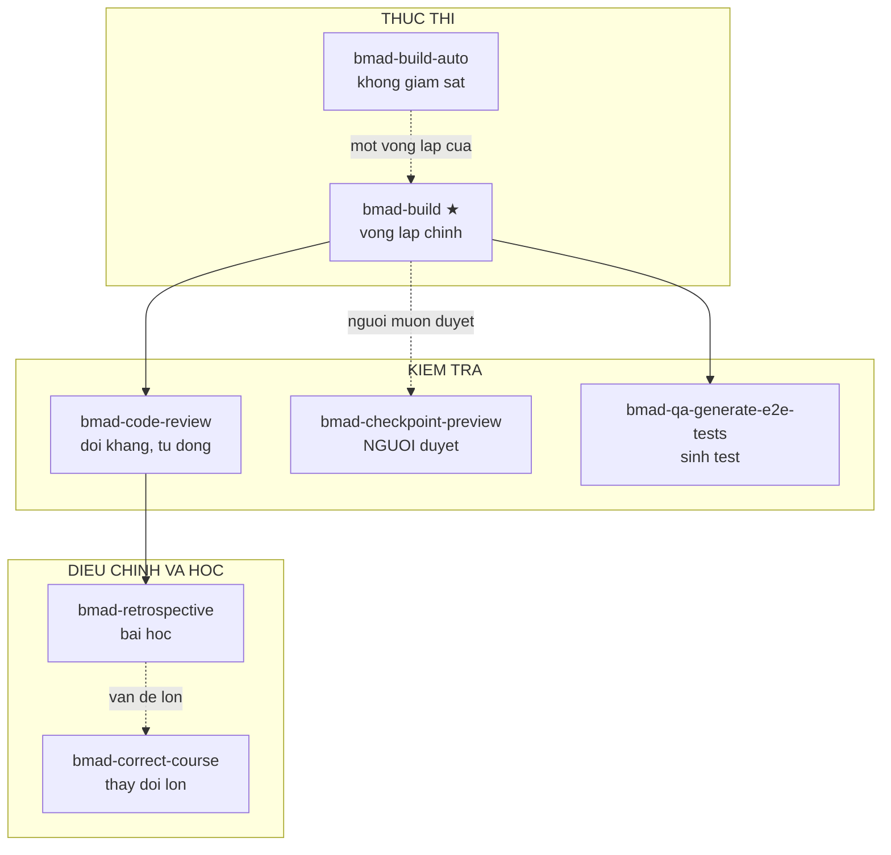
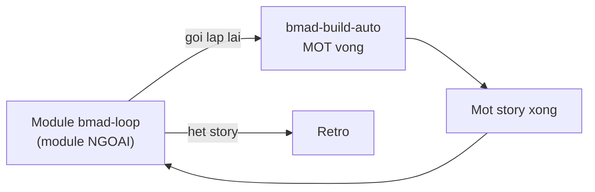
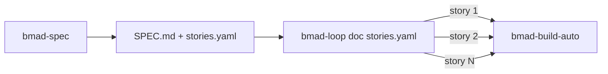
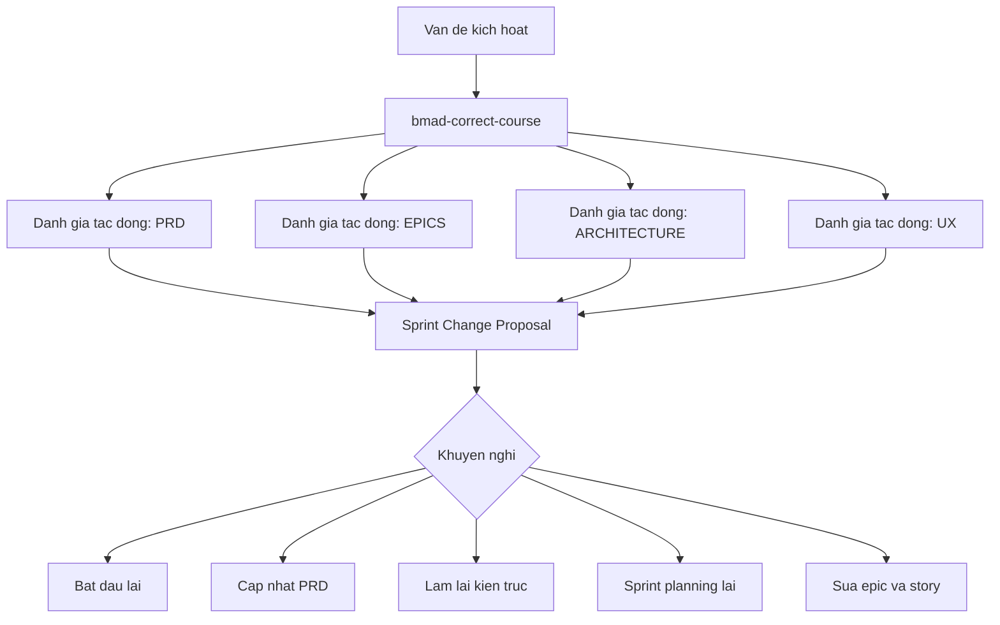
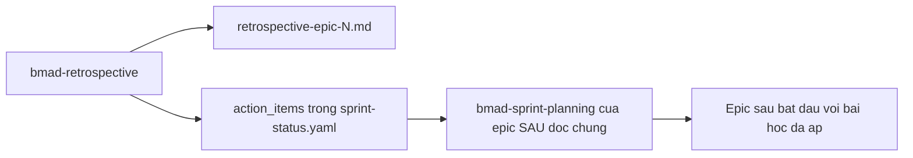

# 06 — Pha 4: Thực thi

> [← Chỉ mục](./index.md) · Trước: [05](./05-pha3-giai-phap.md) · Tiếp: [07 — Ngữ cảnh dự án](./07-project-context.md)

Bảy skill. Một cổng bắt buộc: `bmad-build`.

> `bmad-build` được mô tả **chi tiết từng bước** trong [demo greenfield 06](../demo/06-pha4-thuc-thi.md) và [demo brownfield 05](../demo-brownfield/05-thuc-thi.md). Tài liệu này bổ sung phần **6 skill còn lại** và tổng quan.

---

## 1. Bảy skill, ba nhóm



| Skill | Mã | Bắt buộc | Ai chạy | Đầu ra |
| --- | --- | :-: | --- | --- |
| `bmad-build` | `BD` | ✅ | Amelia 💻 | `spec-*.md` + mã |
| `bmad-build-auto` | — | | *(gọi bằng tên)* | Một vòng lặp |
| `bmad-code-review` | `CR` | | Amelia 💻 | Findings + patch |
| `bmad-checkpoint-preview` | `CK` | | *(người duyệt)* | Hướng dẫn duyệt |
| `bmad-qa-generate-e2e-tests` | `QA` | | Amelia 💻 | Bộ test |
| `bmad-correct-course` | `CC` | | John 📋 | Sprint Change Proposal |
| `bmad-retrospective` | `ER` | | Amelia 💻 | Retro + action items |

---

# Phần A — `bmad-build` ★ (tóm lược)

## A.1 Nhận diện

| Thuộc tính | Giá trị |
| --- | --- |
| Mã menu | `BD` |
| Pha | `ship` |
| **Bắt buộc** | ✅ |
| Kiến trúc | ⭐⭐ **Workflow kết xuất** — `SKILL.md` ~10 dòng gọi `render_skill.py` |
| File | 14 — `workflow.md` + 6 step + 4 phụ trợ + references + review-prompts |
| Đầu ra | `spec-*.md`, mã nguồn, `epic-N-context.md`, `deferred-work.md` |

## A.2 Sáu file bước

| File | Vai trò |
| --- | --- |
| `step-01-clarify-and-route.md` | **Bộ định tuyến trung tâm** của cả pha 4 |
| `step-02-plan.md` | Điều tra codebase → spec |
| `step-03-implement.md` | Thực thi qua subagent |
| `step-04-review.md` | 3 lớp review song song + triage |
| `step-05-present.md` | Đồng bộ sprint + mở spec |
| `step-oneshot.md` | Đường tắt khi blast radius = 0 |

**Bốn file phụ trợ:**

| File | Vai trò |
| --- | --- |
| `compile-epic-context.md` | Biên dịch `epic-N-context.md` |
| `sync-sprint-status.md` | Cập nhật `sprint-status.yaml` |
| `spec-template.md` | Khuôn spec |
| `references/deletion-check.md` | Lớp review kiểm mã bị xóa |

## A.3 Hai chuẩn chi phối

| Chuẩn | Nội dung |
| --- | --- |
| **READY FOR DEVELOPMENT** | 6 tiêu chí: Actionable, Logical, Testable, Complete, Sufficient, Coherent |
| **SCOPE STANDARD** | Một mục tiêu người dùng duy nhất, 900–1600 token. **Cả hai giới hạn đều không phải cổng chặn** |

Chi tiết: [Đặc tả §10.1–10.2](../tai-lieu-he-thong/01-dac-ta-he-thong.md#101-chuẩn-sẵn-sàng-phát-triển-ready-for-development).

## A.4 Năm loại triage

| Loại | Nghĩa | Hành động |
| --- | --- | --- |
| `intent_gap` | Do thay đổi gây ra; **không giải được từ spec** vì ý định thiếu | Revert mã, **quay lại người** → step-02 |
| `bad_spec` | Do thay đổi gây ra; spec **đáng lẽ phải rõ đủ để ngăn** | Trích KEEP, revert, ghi Change Log, sửa ngoài frozen → step-03 |
| `patch` | Do thay đổi gây ra; sửa được ngay | Tự sửa, chạy lại Verification |
| `defer` | **Vấn đề có sẵn**, không do story này | `deferred-work.md` |
| `reject` | Nhiễu | Bỏ im lặng |

⭐ Hai quy tắc phân vân:

> *When in doubt between `bad_spec` and `patch`, **prefer `bad_spec`** — a spec-level fix is more likely to produce coherent code.*
>
> *When unsure between `defer` and `reject`, **prefer `reject`** — only defer findings you are confident are real.*

⚠️ `review_loop_iteration` vượt **5** ⇒ HALT và leo thang lên người.

---

# Phần B — `bmad-build-auto`

## B.1 Nhận diện

| Thuộc tính | Giá trị |
| --- | --- |
| Mã menu | *(không có)* |
| Description | *"**One iteration** of an unattended development loop. **Use when invoked by name.**"* |
| Kiến trúc | ⭐ **Workflow kết xuất** (như `bmad-build`) |
| File | 11 |

## B.2 ⭐⭐ Nó là MỘT vòng lặp, không phải cả vòng lặp

⭐ Tên gây hiểu nhầm. `bmad-build-auto` **không** tự lặp — nó chạy **một** iteration. Việc lặp do **bên ngoài** điều phối:



Từ `bmad-modules.yaml`:

```yaml
bmad-loop:
  name: "BMad Loop"
  description: "Builds, verifies, and retros a whole epic unattended"
```

⭐ **`bmad-build-auto` là đơn vị; `bmad-loop` là bộ điều phối.**

## B.3 Khác `bmad-build` ở đâu

| | `bmad-build` | `bmad-build-auto` |
| --- | --- | --- |
| Số bước | **6** (có `step-05-present.md`) | **5** (không có step-05) |
| Có `sync-sprint-status.md` | ✅ | ❌ |
| Có `step-oneshot.md` | ✅ | ❌ |
| Checkpoint chờ người | ✅ | ❌ |
| Trong menu agent | Amelia `BD` | ❌ |

⭐ Không có `step-05-present.md` vì **không có người** để trình bày.

## B.4 Đầu vào từ `stories.yaml`

Từ `docs/reference/workflow-map.md`:

> *`bmad-spec` ... On request it can also break a spec into an **ordered `stories.yaml`** for **autonomous dispatch** — see [Autonomous Development Loops](https://docs.bmad-method.org/reference/build-auto/).*



Và `step-01` của `bmad-build` hỗ trợ đúng dạng đầu vào này:

> *If the user explicitly supplied a **spec folder and a story id**... Read `{spec_folder}/stories.yaml`; if it is missing or fails to parse, **HALT** rather than falling back... Find the one entry whose string `id` **exactly equals** `story_id`; if none exists, **HALT**.*

⭐ Hai lần HALT thay vì fallback — trong chế độ tự động, đoán mò nguy hiểm hơn dừng.

---

# Phần C — `bmad-code-review`

## C.1 Nhận diện

| Thuộc tính | Giá trị |
| --- | --- |
| Mã menu | `CR` |
| Pha | `ship` |
| `preceded-by` | `bmad-build` |
| Kiến trúc | File-bước — `steps/` (4 file) |
| Đầu ra | Findings + patch áp dụng |
| Agent | Amelia 💻 |

## C.2 ⭐ Mục tiêu một câu

> ***Goal:** Review code changes adversarially. **No noise, no filler.***

## C.3 Bốn bước

| File | Vai trò |
| --- | --- |
| `steps/step-01-gather-context.md` | Thu ngữ cảnh |
| `steps/step-02-review.md` | Chạy lớp review |
| `steps/step-03-triage.md` | Phân loại |
| `steps/step-04-present.md` | Trình bày |

## C.4 ⭐ Cùng review-prompts với `bmad-build`

```
bmad-code-review/
├── review-prompts/
│   ├── edge-case-hunter.md
│   └── verification-gap.md
└── references/
    └── deletion-check.md
```

Ba file **giống hệt** trong `bmad-build/` và `bmad-build-auto/`.

⚠️ **Đây là trùng lặp có chủ ý** — mỗi skill tự chứa (quy tắc PATH-05 cấm tham chiếu vào thư mục skill khác). Xem [Đặc tả FR-SKILL-06](../tai-lieu-he-thong/01-dac-ta-he-thong.md#54-nhóm-fr-skill--skill-và-agent).

## C.5 ⭐ Hỏi quyền subagent một lần cho cả run

> *Subagents, when the capability is available, are an important part of this workflow... **If you need an explicit user instruction to run them, ask once now for the whole workflow run.***

⭐ Câu này xuất hiện y hệt trong `bmad-build/workflow.md`. Tránh hỏi lại ở mỗi bước.

## C.6 Khi nào dùng thay vì review built-in của Build

| Tình huống | Vì sao |
| --- | --- |
| Muốn **LLM khác** soi lại | *"fresh context, different LLM recommended"* |
| Thay đổi **không đi qua** `bmad-build` | Hotfix, sửa tay |
| Muốn **lớp bổ sung** sau Build | Build đã review, đây là vòng hai |

---

# Phần D — `bmad-checkpoint-preview`

## D.1 Nhận diện

| Thuộc tính | Giá trị |
| --- | --- |
| Mã menu | `CK` |
| Pha | `ship` |
| Kiến trúc | File-bước — 5 step + `generate-trail.md` |
| Agent | *(không có trong menu nào)* |

## D.2 ⭐⭐ Đây là skill cho NGƯỜI, không phải cho máy

```yaml
description: 'LLM-assisted human-in-the-loop review. Make sense of a change, focus attention where it matters, test. Use when the user says "checkpoint", "human review", or "walk me through this change".'
```

> ***Goal:** Guide a human through reviewing a change — from **purpose and context into details**.*
>
> ***Your Role:** You are **assisting the user** in reviewing a change.*

⭐ Khác hẳn `bmad-code-review`:

| | `bmad-code-review` | `bmad-checkpoint-preview` |
| --- | --- | --- |
| Ai review | **LLM** đối kháng | **Người**, LLM hỗ trợ |
| Đầu ra | Findings + patch | **Sự hiểu** của người |
| Hướng | Chi tiết → vấn đề | **Mục đích → ngữ cảnh → chi tiết** |
| Vai LLM | Reviewer | **Hướng dẫn viên** |

## D.3 Năm bước

| File | Vai trò |
| --- | --- |
| `step-01-orientation.md` | Định hướng — thay đổi này để làm gì |
| `step-02-walkthrough.md` | Đi qua thay đổi |
| `step-03-detail-pass.md` | Vào chi tiết |
| `step-04-testing.md` | Kiểm thử |
| `step-05-wrapup.md` | Kết luận |
| `generate-trail.md` | Sinh "lối đi" cho người duyệt |

⭐ Thứ tự **mục đích trước, chi tiết sau** là ngược với review thông thường — vì người cần hiểu *tại sao* trước khi đánh giá *thế nào*.

## D.4 Dùng cho

Từ `module-help.csv`:

> *Guided walkthrough of a change from purpose and context into details. Use for **human review of commits branches or PRs**.*

---

# Phần E — `bmad-qa-generate-e2e-tests`

## E.1 Nhận diện

| Thuộc tính | Giá trị |
| --- | --- |
| Mã menu | `QA` |
| Pha | `ship` |
| `preceded-by` | `bmad-build` |
| Đầu ra | Bộ test API và E2E |
| Agent | Amelia 💻 |

## E.2 ⭐⭐ Ranh giới rất rõ

```yaml
description: 'Generate end to end automated tests for existing features. Use when the user says "create qa automated tests for [feature]"'
```

> ***Your Role:** You are a QA automation engineer. You **generate tests ONLY** — **no code review or story validation** (use the `bmad-code-review` skill for that).*

Và trong `module-help.csv`:

> *Generate automated API and E2E tests for implemented code. **NOT for code review or story validation — use CR for that.**

⭐ Ranh giới được nêu **hai lần** ở hai nơi. Đây là skill dễ bị dùng sai nhất.

## E.3 Cho mã **đã triển khai**

⚠️ *"for **existing features**"*, *"for **implemented** code"* — không phải sinh test trước khi viết mã (TDD). Amelia đã làm TDD trong `bmad-build`; skill này bổ sung tầng E2E **sau khi** tính năng chạy.

---

# Phần F — `bmad-correct-course`

## F.1 Nhận diện

| Thuộc tính | Giá trị |
| --- | --- |
| Mã menu | `CC` |
| Pha | `anytime` |
| Đường dẫn | `{planning_artifacts}` |
| Đầu ra | **Sprint Change Proposal** |
| Agent | John 📋 |

## F.2 Mục tiêu

```yaml
description: 'Manage significant changes during sprint execution. Use when the user says "correct course" or "propose sprint change"'
```

> ***Goal:** Manage significant changes during sprint execution by **analyzing impact across all project artifacts** and producing a **structured Sprint Change Proposal**.*
>
> ***Your Role:** You are a Developer navigating change management. Analyze the triggering issue, **assess impact across PRD, epics, architecture, and UX artifacts**, and produce an **actionable Sprint Change Proposal with clear handoff**.*

## F.3 ⭐ Phân tích tác động xuyên tạo phẩm



Từ `module-help.csv`:

> *Navigate significant changes. **May recommend start over, update PRD, redo architecture, sprint planning, or correct epics and stories.**

⭐ Nó **không tự sửa** — nó **đề xuất** và **bàn giao rõ ràng** cho skill phù hợp.

## F.4 ⭐ Là đích của FAIL từ cổng sẵn sàng

Từ `readiness-gate.md`:

> *name the skill that fixes each (the relevant plan skill, or **`bmad-correct-course` for cross-cutting changes**)*

⭐ Khi vấn đề **xuyên cắt** nhiều tạo phẩm, `bmad-correct-course` là nơi xử lý.

---

# Phần G — `bmad-retrospective`

## G.1 Nhận diện

| Thuộc tính | Giá trị |
| --- | --- |
| Mã menu | `ER` |
| Pha | `ship` |
| `preceded-by` | `bmad-code-review` |
| Đầu ra | Tài liệu retro, action items, **acceptance verdict** |
| Reference | 5 file |
| Script riêng | `git_evidence.py`, `sprint_status.py` |
| Agent | Amelia 💻 |

## G.2 ⭐⭐ Dựa trên BẰNG CHỨNG, không phải trí nhớ

Từ `module-help.csv`:

> ***Evidence-based** review of a completed epic **against its acceptance criteria***

Hai script cung cấp bằng chứng:

```bash
SK=".claude/skills/bmad-retrospective"

# Trạng thái epic từ sprint-status.yaml
uv run "$SK/scripts/sprint_status.py" --status-file <sprint-status.yaml> --epic N

# Bằng chứng từ git
uv run "$SK/scripts/git_evidence.py" --since <commit>
```

⭐ So sánh với retro thông thường: không hỏi "mọi người thấy sprint này thế nào?" mà **đếm commit, đo tỷ lệ test, đọc Spec Change Log**.

## G.3 Năm reference

| File | Vai trò |
| --- | --- |
| `evidence-gathering.md` | Thu thập bằng chứng |
| `aggregate-views.md` | Tổng hợp góc nhìn |
| `team-discussion.md` | Thảo luận đội (mời agent persona) |
| `acceptance-verdict.md` | **Verdict chấp nhận** |
| `retro-document.md` | Soạn tài liệu retro |

## G.4 ⭐ Action items quay lại vòng lặp



Từ `sprint-status-template.yaml`:

```yaml
# Retrospective appends its action items to action_items; the status view surfaces open ones
action_items:
  - epic: 1
    action: "Add error-handling review to the code review checklist"
    owner: "Charlie"
    status: open
```

⭐ Đây là cách bài học **thực sự** quay lại, không nằm trong file không ai đọc.

## G.5 Trạng thái retro trong tracking

```yaml
development_status:
  epic-1: done
  epic-1-retrospective: optional    # optional | done
```

⭐ `optional` là mặc định — retro **không bắt buộc**, nhưng được theo dõi.

---

## 2. Bảng so sánh bảy skill

| | Build | Build-auto | Code-review | Checkpoint | QA-e2e | Correct-course | Retro |
| --- | :-: | :-: | :-: | :-: | :-: | :-: | :-: |
| **Bắt buộc** | ✅ | | | | | | |
| **Kết xuất** | ✅ | ✅ | | | | | |
| **File-bước** | ✅ 6 | ✅ 5 | ✅ 4 | ✅ 5 | | | |
| **Script riêng** | | | | | | | ✅ 2 |
| **Chờ người** | ✅ | ❌ | ✅ | ✅✅ | ✅ | ✅ | ✅ |
| **Sinh mã** | ✅ | ✅ | patch | ❌ | ✅ test | ❌ | ❌ |
| **Sửa sprint-status** | ✅ | ❌ | ❌ | ❌ | ❌ | ❌ | ✅ |
| **Trong menu agent** | Amelia | ❌ | Amelia | ❌ | Amelia | John | Amelia |

---

## 3. Vận hành thủ công

```bash
R="$(pwd)"; SK="$R/.claude/skills"

# Skill nào là workflow kết xuất?
ls "$SK"/*/workflow.md 2>/dev/null | xargs -n1 dirname | xargs -n1 basename

# Kết xuất bmad-build thủ công
uv run --no-cache "$R/_bmad/scripts/render_skill.py" \
  --project-root "$R" --skill "$SK/bmad-build"

# So sánh bmad-build vs bmad-build-auto
diff <(ls "$SK/bmad-build") <(ls "$SK/bmad-build-auto")

# Ba file review dùng chung ở 3 skill
for s in bmad-build bmad-build-auto bmad-code-review; do
  echo "--- $s"; ls "$SK/$s/review-prompts/" 2>/dev/null
done

# Bằng chứng retro
uv run "$SK/bmad-retrospective/scripts/sprint_status.py" \
  --status-file "$R/_bmad-output/implementation-artifacts/sprint-status.yaml" --epic 1
uv run "$SK/bmad-retrospective/scripts/git_evidence.py" --since HEAD~20

# Action items còn mở
grep -A4 "^action_items:" "$R/_bmad-output/implementation-artifacts/sprint-status.yaml"

# Việc đã hoãn
cat "$R/_bmad-output/implementation-artifacts/deferred-work.md" 2>/dev/null
```

---

## 4. Cạm bẫy

| Vấn đề | Nguyên nhân | Xử lý |
| --- | --- | --- |
| Dùng `bmad-qa-generate-e2e-tests` để review | Vi phạm ranh giới nêu **hai lần** | Dùng `bmad-code-review` |
| Tưởng `bmad-build-auto` tự lặp | Tên gây hiểu nhầm | Nó là **một** vòng; `bmad-loop` điều phối |
| `bmad-build-auto` fallback khi thiếu `stories.yaml` | Sai — phải HALT | Chế độ tự động: **dừng hơn đoán** |
| Dùng `bmad-checkpoint-preview` như code review | Nhầm vai | Nó cho **người** duyệt, LLM hỗ trợ |
| Sửa trùng lặp review-prompts ở một skill | Chúng **cố ý** trùng | Quy tắc PATH-05 cấm tham chiếu chéo skill |
| Hỏi quyền subagent ở mỗi bước | | Hỏi **một lần** cho cả run |
| Retro dựa vào trí nhớ | Bỏ qua script bằng chứng | Chạy `git_evidence.py` + `sprint_status.py` |
| Action items không quay lại vòng lặp | Không ghi vào `sprint-status.yaml` | Sprint planning epic sau đọc chúng |
| `bmad-correct-course` tự sửa tạo phẩm | Sai vai | Nó **đề xuất** và **bàn giao** |
| Loop review quá 5 vòng | Vòng lặp không hội tụ | HALT và leo thang lên người |

---

**Tiếp:** [07 — Ngữ cảnh dự án](./07-project-context.md) · [← Chỉ mục](./index.md)
