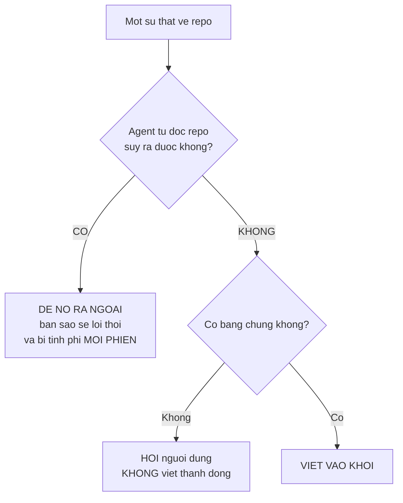
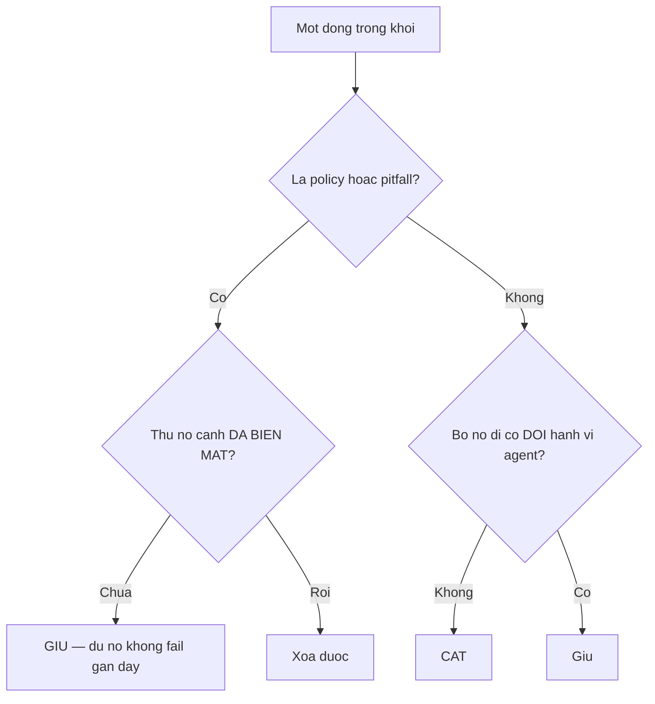
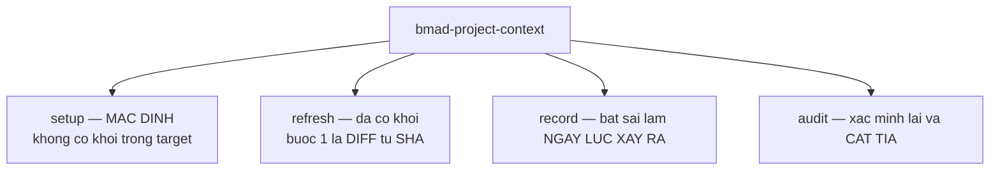
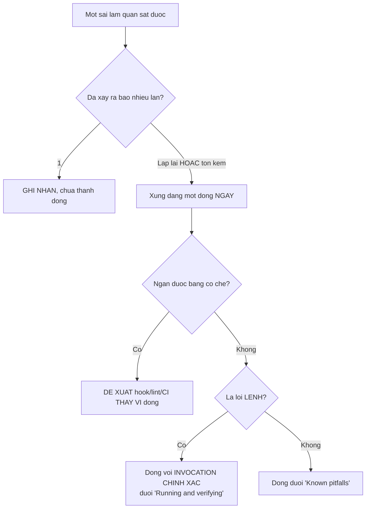
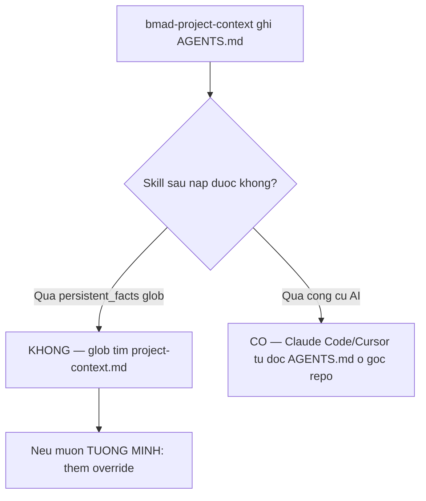

# 07 — Ngữ cảnh dự án (`bmad-project-context`)

> [← Chỉ mục](./index.md) · Trước: [06](./06-pha4-thuc-thi.md) · Tiếp: [08 — Shim v6](./08-v6-shims.md)

> Skill này được mô tả **chi tiết từng bước** trong [demo brownfield 02](../demo-brownfield/02-project-context.md) và [06](../demo-brownfield/06-ghi-nhan-va-bao-tri.md). Tài liệu này là **tham chiếu cô đọng**.

---

## 1. Nhận diện

| Thuộc tính | Giá trị |
| --- | --- |
| Mã menu | `PC` |
| Pha | `anytime` |
| Bắt buộc | ❌ Không |
| Đường dẫn | **repo root** — `AGENTS.md` |
| Đầu ra | Khối `<!-- bmad:context -->` được quản lý |
| Reference | `best-practices.md`, `template.md` |
| Agent | Mary 📊 (mã `PC`) |
| Đặc biệt | ⭐ **"Must be invoked by name"** — không tự kích hoạt |

## 1.1 ⭐ Thay thế hai skill cũ

Từ `module-help.csv`:

> *Setup, refresh, record, and audit — **replaces document-project and generate-project-context**.*

| Skill cũ | Trạng thái |
| --- | --- |
| `bmad-document-project` | Shim → `bmad-project-context` |
| `bmad-generate-project-context` | Deprecated, còn trong `plan/` |

---

## 2. ⭐⭐ Phép thử quyết định mọi thứ

Từ `references/best-practices.md`:

> ## The test
>
> *Can an agent **derive this by reading the repository**? If yes, **leave it out** — a stored copy is a **stale duplicate** of something the agent reads more accurately first-hand, and **it is charged on every session**. **Write down what the code cannot say.***



---

## 3. Sáu loại được admit

| Loại | Chi tiết |
| --- | --- |
| **Policy mã không diễn đạt được** | Quy tắc nhánh, đường đóng băng/bảo vệ, file sinh, secret, bảo mật, tuân thủ. **Do người nêu hoặc đọc từ config cưỡng chế, không bao giờ suy diễn** |
| **Cái config không nói được về việc chạy dự án** | Script test gốc vô dụng trong workspace này; test tích hợp cần service lên trước; suite mất 11 phút nên iterate trên file lẻ; `Makefile` mới là entry point thật; CI chạy typecheck mà test script không phủ. ⭐ **Bản thân lệnh đã có trong `package.json` — CAVEAT mới đáng một dòng** |
| **Quy ước khác mặc định hệ sinh thái** | Agent theo chuẩn trừ khi được bảo khác, nên **chỉ phần lệch** đáng ghi. ⭐ **Lệnh gọi cũng tính**: khi lệnh hiển nhiên bị sai ở đây, **lệnh đúng đáng một dòng, không cần sai lầm quan sát được** |
| **Pitfall CÓ BẰNG CHỨNG QUAN SÁT** | Bài học đã ghi, hồi tưởng của maintainer, cùng lỗi sửa lặp lại trong lịch sử, hoặc lỗi phiên này vừa mắc và bắt được |
| **Hành vi runtime vô hình từ repo** | Webhook replay, health endpoint nói dối, đặc thù môi trường — **sau khi người xác nhận** |
| **Entry point và pointer** | Nơi công việc rơi vào |

⭐ *"**Prefer prohibitions to advice**, and **name the permitted alternative in the same line**."*

---

## 4. ⭐⭐ Tám loại bị loại — kèm lý do

| Bị loại | Vì sao |
| --- | --- |
| Tổng quan repo, cây thư mục, danh sách stack | **Suy ra tươi, chính xác hơn; bản sao mục nát** |
| Bất cứ gì đưa vào vì **thú vị** | **Thú vị không phải nhu cầu** |
| Quy tắc style agent tự thực thi | Thuộc về formatter, linter, hook, CI — **đề xuất check thay thế** |
| Sáo ngữ | **Đã là mặc định** |
| Lệnh đã có trong `package.json`/`Makefile`/CI | Đọc từ nguồn sự thật; **bản sao trôi ngay khi script đổi tên** |
| Mã dán vào, nội dung changelog, sự kiện đổi nhanh | **Cũ ngay lập tức** |
| Trạng thái mơ ước | Mô tả **cái đang là**; ý định thuộc về spec |
| Lịch sử và tường thuật chỉnh sửa | **Git giữ nó**; nêu sự thật hiện tại |

⭐ *"**A repo yields hundreds of trap-looking facts and none of them predict real mistakes**; only observed behavior does. **A surprising scan finding is a question to ask, not a line to write.**"*

---

## 5. ⭐ Quy tắc nghỉ hưu — bất đối xứng

> *A **policy or pitfall** line goes **only when the thing it guards is gone**, or the user retires it. **Nothing failing lately is not evidence — a working rule erases its own evidence.***
>
> *Every **other** line faces one question at each write: **would removing it change agent behavior?** If no, cut it.*



⭐ **Bất đối xứng có chủ ý:** quy tắc đang hoạt động **xóa chính bằng chứng của nó** — không có sự cố nào để chứng minh nó cần thiết.

---

## 6. Ngân sách kích thước

> *Every line is **paid in every session**, and **instruction-following degrades as the loaded set grows**. **Count what other always-loaded files add.** **Over budget means cut the weakest lines or move them behind a trigger — never raise the budget.** **Ten lines of evidence means ten lines.***

---

## 7. ⭐ Trigger phải quan sát được

> *An index the agent **must choose to fetch gets skipped**; one **already in context** does not. Keep everything **load-bearing in the block**.*
>
> *A pointer out of it names a trigger the agent **can observe** — a path, a file type, a named task — **never one it must judge** ("when the task is complex") **or track about itself** ("before your first edit").*

| ✅ Trigger hợp lệ | ❌ Trigger không hợp lệ |
| --- | --- |
| Một đường dẫn | "khi nhiệm vụ phức tạp" |
| Một loại file | "trước lần sửa đầu tiên của bạn" |
| Một tên nhiệm vụ | "nếu bạn thấy cần" |

⭐ Quy tắc bám theo thư mục ⇒ `AGENTS.md` **lồng** ở đó, gắn theo vị trí. File liên kết chỉ dùng khi trigger **không phải** đường dẫn.

---

## 8. Bốn intent



| Intent | Bước 1 | Khối có thể lớn? | Khối có thể nhỏ? | Thời gian |
| --- | --- | :-: | :-: | --- |
| `setup` | Đánh giá đầy đủ | — | — | 60–90′ |
| `refresh` | **Diff từ SHA đã ghi** | Chỉ khi **bằng chứng mới** | ✅ | 20–30′ |
| `record` | Kiểm khối xem đã phủ chưa | Chỉ khi **lặp lại/tốn kém** | ❌ | 5–10′ |
| `audit` | Xác minh lại **mọi** dòng | ❌ **Không bao giờ** | ✅ **Đó là mục đích** | 25–40′ |

⭐ **`audit` kết thúc nhỏ hơn hoặc bằng** — đó là bất biến của nó.

---

## 9. Sáu bước của setup/refresh

> **Không ghi gì cho tới bước 5!**

| Bước | Nội dung |
| --- | --- |
| **1. Assess and report** | Đọc `AGENTS.md`, file quy tắc của harness, thư mục docs, ghi chú mang bài học. Báo cáo cái gì tồn tại và **đo được thế nào** theo `best-practices.md` |
| **2. Ask what they bring** | Quy tắc phải theo bất kể repo làm gì. ⭐ *"Greenfield: this is the whole content. **Brownfield: it is the half no scan reaches.**"* |
| **3. Discover and verify** | **Fan out subagent song song**. `package.json`, `Makefile`, `pyproject.toml`, CI được đọc để biết khối **không được lặp lại gì**. **Path-check mọi claim nêu tên file** |
| **4. Interview the gaps** | **Chỉ** cái không scan nào với tới |
| **5. Show the block, then write it** | **Hiện khối đầy đủ TRƯỚC khi ghi**. Splice giữa marker, **mọi thứ ngoài marker giữ NGUYÊN TỪNG BYTE**. ⭐ **Never commit** |
| **6. Close** | Cái gì vào, cái gì bị loại **và vì sao**, cách nó nạp, bảo trì |

### 9.1 ⭐⭐ Bốn quy tắc phỏng vấn (bước 4)

| Quy tắc | Nội dung |
| --- | --- |
| **Không hỏi cái scan trả lời được** | *"Asking the user to confirm a path-checked claim, or one a config file already states, **is a defect**."* |
| **Hỏi hồi tưởng, không đưa danh sách chọn** | *"**Never hand the user a selection problem a scan created.**"* |
| **Lỗi phiên này vừa mắc là bằng chứng quan sát** | Đề nghị nó |
| **Batch ≤ 8, ít hơn thì tốt hơn** | *"**A batch yielding nothing new means write.**"* |

### 9.2 ⭐ Khi repo mâu thuẫn người dùng

> *When the repo contradicts the user, **show the evidence and ask**. **Never write the claim as given, never drop it silently.**

### 9.3 ⭐ Ưu tiên check hơn prose (bước 5)

> *For each candidate, **ask first whether a hook, lint rule, or CI check enforces it better than prose**; if so **propose the check**, and **the line becomes the fallback if they decline**.*

Và trong `best-practices.md`:

> *Route anything mechanically preventable to a hook, lint rule, or CI check. **A check that lands deletes its line.**

### 9.4 ⭐ Mâu thuẫn với file khác là DEFECT

> *Where an instruction elsewhere contradicts the block in a way that changes behavior — a stale `CLAUDE.md` line, a retired command — **propose the fix to that file**. **Two live contradictory instructions is a defect.***

### 9.5 ⭐ Hỏi về đơn vị tách rời — chỉ khi có bằng chứng

> *If the target contains **separable units** — a workspace manifest listing members, or directories carrying their own build manifest — name them and ask... **Absent that evidence, do not ask.** **Sibling repositories are not children**; each is its own target, offered in turn.*

---

## 10. Hình dạng khối — `references/template.md`

**Sáu mục, đúng thứ tự. Bỏ mục nào không có gì qua được quy tắc — không bao giờ viết mục rỗng.**

| # | Mục | Nội dung |
| --- | --- | --- |
| 1 | **Orientation** | 3–4 câu: cái này là gì, stack, planning và docs sâu ở đâu |
| 2 | **Policy** | Cái tổ chức yêu cầu |
| 3 | **Where things are** | Entry point, pointer tới child và file liên kết |
| 4 | **Running and verifying** | **Chỉ cái `package.json`/`Makefile`/CI chưa nói** |
| 5 | **Conventions that differ from defaults** | |
| 6 | **Known pitfalls** | |

### 10.1 ⭐ Quy tắc văn phong

> *Terse imperative lines under plain headings. **No prose beyond Orientation**, no introduction, no summary.*
>
> *A **bare fact** appears **only as the justification clause of an instruction** — "Exclude `vendor/` from searches, **it is 60% of tracked files**", **never** "`vendor/` is 60% of tracked files".*
>
> *A prohibition **names the alternative**. **At most two emphasis markers in the whole block.***

### 10.2 Dòng provenance

```markdown
<!-- bmad:context -->
<!-- Verified 2026-08-08 against a1b2c3d. Managed by bmad-project-context; edits inside this block are replaced on refresh. Keep anything you want preserved outside the markers. -->
```

⭐ `refresh` **diff từ SHA này**:

```bash
git log --diff-filter=DR --name-only <SHA>..HEAD
```

---

## 11. `record` — nguồn duy nhất của pitfall

> *Capture **one observed agent mistake as it happens** — **the only admissible source** for a pitfall line.*



Bốn thứ cần thu thập: **nhiệm vụ**, **sai lầm**, **cách sửa**, **bằng chứng**.

---

## 12. `audit` — năm việc

| # | Việc |
| --- | --- |
| 1 | Kiểm lại **mọi** caveat |
| 2 | **Path-check mọi** file |
| 3 | Theo **mọi** pointer |
| 4 | Hỏi của **mọi** dòng: **bỏ nó đi có đổi hành vi agent không?** |
| 5 | Kiểm mâu thuẫn với file chỉ dẫn khác |

> *Failing lines **move behind an observable trigger, get fixed, or are deleted — confirm deletions first**.*
>
> ***A policy or pitfall line goes only when the thing it guards is gone or the user retires it; nothing failing lately is not grounds.** **Audit ends smaller or equal.***

---

## 13. Children — quy tắc phân tầng

> *A component, nested repository, or extracted rules file gets its own file under the same shape **when work keeps landing there and its truths do not belong at the parent level**.*
>
> *Rules **bounded to a directory** go in a **nested `AGENTS.md`** there, **attached by location**. Use a **linked file** only when the trigger is **not a path**.*
>
> *A chosen child that ends with **nothing its parent does not already say gets no file**. Say so and move on.*
>
> *List **every** child in the parent's **Where things are** with one line and its path. **Discovery never depends on the harness finding it.***

---

## 14. ⭐ Greenfield khác brownfield

| | Greenfield | Brownfield |
| --- | --- | --- |
| Nguồn | Gieo từ spec/planning doc, hoặc phỏng vấn thuần | Scan + xác minh + phỏng vấn |
| Lệnh chưa tồn tại | Viết thành **TODO tường minh nêu stack đã quyết**, **không bao giờ** đoán lệnh rồi nêu như sự thật | Verify bằng cách **chạy thật** |
| Quyết định thiết kế gây tranh cãi | → `bmad-architecture` | → `bmad-architecture` |
| Bước 2 (người mang gì tới) | **Toàn bộ nội dung** | **Nửa mà không scan nào với tới** |

---

## 15. Migration từ skill cũ

> *If the target has a `project-context.md` from the **retired skills**, commonly under `{output_folder}`, **read it in step 1 and offer to absorb its content**. **Do not delete it without agreement**, and **do not silently orphan it**.*

⚠️ **Điểm quan trọng cho `persistent_facts`:**

Mặc định của 4 skill (`bmad-prd`, `bmad-ux`, `bmad-architecture`, `bmad-product-brief`) là:

```toml
persistent_facts = ["file:{project-root}/**/project-context.md"]
```

Nhưng `bmad-project-context` ghi vào **`AGENTS.md`**, không phải `project-context.md`.



```toml
# _bmad/custom/bmad-architecture.toml
[workflow]
persistent_facts = ["file:{project-root}/AGENTS.md"]
```

⭐ Mảng **nối thêm**, nên cả hai mục đều có hiệu lực.

⚠️ Đổi `persistent_facts` **đổi `generation_hash`** của skill kết xuất ⇒ snapshot được kết xuất lại. Đó là hành vi đúng.

---

## 16. Vận hành thủ công

```bash
R="$(pwd)"; SK="$R/.claude/skills/bmad-project-context"

# Đọc hai reference TRƯỚC mọi thứ (skill cũng làm vậy)
cat "$SK/references/best-practices.md"
cat "$SK/references/template.md"

# Khối hiện tại
sed -n '/<!-- bmad:context -->/,/<!-- \/bmad:context -->/p' "$R/AGENTS.md"

# Đếm dòng nội dung của khối
sed -n '/bmad:context/,/\/bmad:context/p' "$R/AGENTS.md" | grep -c '^-'

# Dòng provenance
grep "Verified" "$R/AGENTS.md"

# Diff từ SHA đã ghi (đầu vào của refresh)
SHA=$(grep -oP 'against \K[0-9a-f]+' "$R/AGENTS.md")
git log --diff-filter=DR --name-only "$SHA"..HEAD

# Path-check mọi file được nêu trong khối
sed -n '/bmad:context/,/\/bmad:context/p' "$R/AGENTS.md" \
  | grep -oP '`\K[^`]+\.(js|ts|py|md|json|yaml|yml)(?=`)' \
  | sort -u | while read f; do
      [ -e "$R/$f" ] && echo "  ✓ $f" || echo "  ✗ $f  ← KHÔNG TỒN TẠI"
    done
```

---

## 17. Cạm bẫy

| Vấn đề | Nguyên nhân | Xử lý |
| --- | --- | --- |
| Khối chứa cây thư mục, danh sách model | Vi phạm phép thử | Agent tự đọc chính xác hơn |
| Pitfall suy đoán từ "trông nguy hiểm" | Không có bằng chứng quan sát | *"a question to ask, not a line to write"* |
| Hỏi cái `package.json` đã nói | **Là defect** | Không hỏi cái scan trả lời được |
| Đưa danh sách chọn do scan tạo ra | Vi phạm | Hỏi **hồi tưởng** |
| Xóa dòng vì "lâu rồi không fail" | Vi phạm quy tắc nghỉ hưu | *"a working rule erases its own evidence"* |
| Nâng ngân sách khi khối quá lớn | Vi phạm | **Cắt dòng yếu nhất hoặc chuyển sau trigger** |
| Pointer với trigger phải phán đoán | Vi phạm | Trigger phải **quan sát được** |
| Khối ghi đè nội dung ngoài marker | Vi phạm | Ngoài marker **giữ nguyên từng byte** |
| Skill tự commit | Vi phạm | **Never commit** |
| Mâu thuẫn với `CLAUDE.md` để nguyên | **Là defect** | Đề xuất sửa file kia |
| `persistent_facts` không bắt `AGENTS.md` | Glob tìm `project-context.md` | Thêm override, hoặc dựa vào công cụ AI |
| `audit` làm khối lớn thêm | Vi phạm bất biến | *"Audit ends smaller or equal"* |
| Hỏi về monorepo khi không có bằng chứng | Vi phạm | *"Absent that evidence, do not ask"* |

---

**Tiếp:** [08 — Mười ba shim v6](./08-v6-shims.md) · [← Chỉ mục](./index.md)
