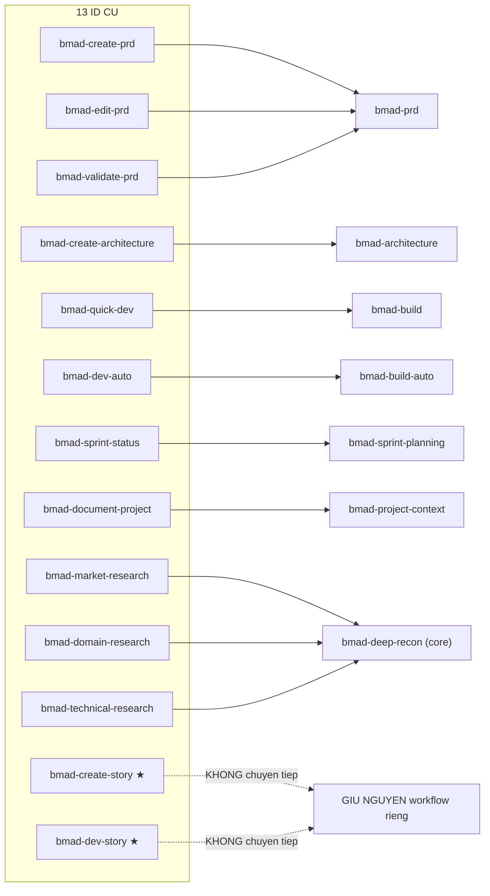
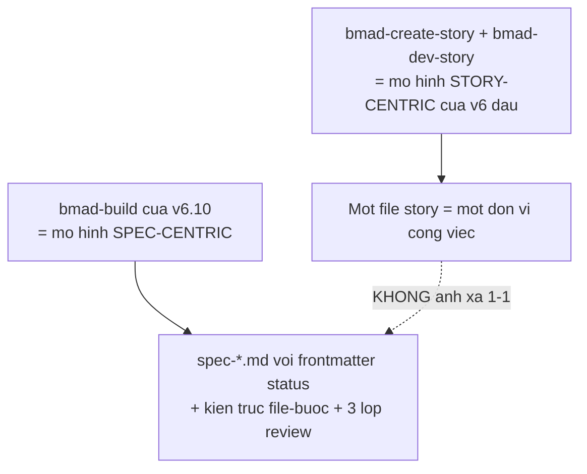
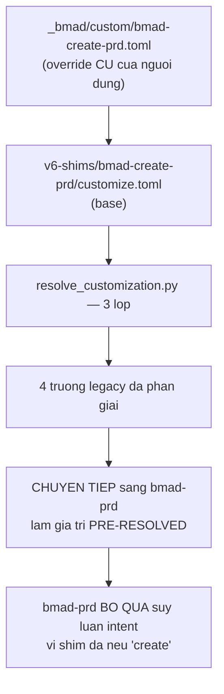
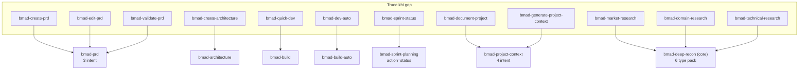

# 08 — Mười ba shim v6

> [← Chỉ mục](./index.md) · Trước: [07](./07-project-context.md)

---

## 1. Shim của `bmm` khác shim của `core`

| | `core/v6-shims/` (6 shim) | **`bmm/v6-shims/` (13 shim)** |
| --- | --- | --- |
| Số lượng | 6 | **13** |
| Loại | **Tất cả** đều forwarder mỏng | **Hai loại**: forwarder **và** giữ nguyên đầy đủ |
| Đích | Chỉ `bmad-review` | 5 skill khác nhau |

⭐ Trích `bmm/v6-shims/README.md`:

> *Skills in this folder are deprecated skills kept for backward compatibility with v6 skill IDs. **Some retain their full workflow, while others forward** to the skill that replaced them, passing a stated intent and pre-resolved customization fields so the target skips its own intent inference.*

Đây là khác biệt then chốt: `core` chỉ có forwarder; `bmm` có **hai** shim **giữ nguyên toàn bộ workflow**.

---

## 2. Bảng mười ba shim

| Shim | Chuyển tiếp tới | Loại | File |
| --- | --- | --- | --- |
| `bmad-quick-dev` | `bmad-build` | Forwarder | 1 |
| `bmad-dev-auto` | `bmad-build-auto` | Forwarder | 1 |
| **`bmad-create-story`** | — | ⭐ **Giữ nguyên đầy đủ** | **4** |
| **`bmad-dev-story`** | — | ⭐ **Giữ nguyên đầy đủ** | **3** |
| `bmad-create-prd` | `bmad-prd` (create intent) | Forwarder | 2 |
| `bmad-edit-prd` | `bmad-prd` (update intent) | Forwarder | 2 |
| `bmad-validate-prd` | `bmad-prd` (validate intent) | Forwarder | 2 |
| `bmad-create-architecture` | `bmad-architecture` (create intent) | Forwarder | 2 |
| `bmad-market-research` | `bmad-deep-recon` (market type) | Forwarder | 1 |
| `bmad-domain-research` | `bmad-deep-recon` (domain type) | Forwarder | 1 |
| `bmad-technical-research` | `bmad-deep-recon` (technical type) | Forwarder | 1 |
| `bmad-sprint-status` | `bmad-sprint-planning` (status view) | Forwarder | 2 |
| `bmad-document-project` | `bmad-project-context` | Forwarder | 1 |



⭐ Ba shim research trỏ sang **module `core`** — đây là ví dụ `bmm` chuyển tiếp sang `core`.

---

## 3. ⭐⭐ Hai shim giữ nguyên toàn bộ workflow

### 3.1 `bmad-create-story` — 4 file

```
bmad-create-story/
├── SKILL.md
├── customize.toml
├── checklist.md
├── discover-inputs.md
└── template.md
```

### 3.2 `bmad-dev-story` — 3 file

```
bmad-dev-story/
├── SKILL.md
├── customize.toml
└── checklist.md
```

Trích `bmad-dev-story/SKILL.md`:

```markdown
# Dev Story Workflow

**Goal:** Execute story implementation following a context filled story spec file.

**Your Role:** Developer implementing the story.
- Communicate all responses in {communication_language} and language MUST be tailored to {user_skill_level}
- Generate all documents in {document_output_language}
```

⭐ **Không có dòng "DEPRECATED — forwards to…"** — nó là workflow thật, đầy đủ.

### 3.3 Vì sao hai skill này không forward được



| | Mô hình cũ (`create-story` + `dev-story`) | Mô hình mới (`bmad-build`) |
| --- | --- | --- |
| Đơn vị | File story | `spec-*.md` |
| Tạo và thực thi | **Hai skill riêng** | **Một skill, nhiều bước** |
| Kiểm tra | `checklist.md` | 3 lớp review + triage 5 loại |
| Kết xuất | Không | ⭐ `render_skill.py` |
| Trạng thái | Trong file story | Frontmatter `status` định tuyến |

⭐ Chuyển tiếp sẽ **mất ngữ nghĩa**. Nên chúng được giữ nguyên.

⚠️ **Hệ quả cho người dùng:** nếu bạn đang dùng `bmad-create-story` + `bmad-dev-story`, bạn đang chạy **mô hình v6 đầu**, không phải mô hình hiện tại. Chúng vẫn hoạt động, nhưng không nhận được: review 3 lớp, epic context cache, sprint sync, spec change log.

---

## 4. Cấu trúc một forwarder

Ví dụ `bmad-create-prd/SKILL.md`:

```markdown
# DEPRECATED — forwards to bmad-prd (create intent)

This skill was consolidated into `bmad-prd`. It is retained as a thin compatibility
shim so existing invocations by name and `_bmad/custom/bmad-create-prd.toml` override
files keep working. New work should invoke `bmad-prd` directly — it detects
create / update / validate intent from the conversation.

## On Activation

1. Resolve customization: `uv run {project-root}/_bmad/scripts/resolve_customization.py
   --skill {skill-root} --key workflow`. This picks up any
   `{project-root}/_bmad/custom/bmad-create-prd.toml` and `bmad-create-prd.user.toml`
   overrides for the legacy fields (`activation_steps_prepend`, `activation_steps_append`,
   `persistent_facts`, `on_complete`).
```

### 4.1 ⭐⭐ Bốn trường legacy được chuyển tiếp

| Trường | Vì sao giữ |
| --- | --- |
| `activation_steps_prepend` | Hook tuân thủ của tổ chức |
| `activation_steps_append` | Như trên |
| `persistent_facts` | Sự thật nền của dự án |
| `on_complete` | Hành động sau khi xong |

⭐ **Đây là lý do 8/13 shim có `customize.toml` riêng** — để override cũ của người dùng vẫn phân giải.



### 4.2 Shim nào có `customize.toml`

| Có (8) | Không có (5) |
| --- | --- |
| `bmad-create-prd`, `bmad-edit-prd`, `bmad-validate-prd` | `bmad-quick-dev` |
| `bmad-create-architecture` | `bmad-dev-auto` |
| `bmad-sprint-status` | `bmad-market-research` |
| `bmad-create-story`, `bmad-dev-story` (giữ nguyên) | `bmad-domain-research` |
| | `bmad-technical-research` |
| | `bmad-document-project` |

⚠️ Năm shim không có `customize.toml` ⇒ override cũ cho chúng **sẽ không phân giải**. Chuyển thẳng sang skill đích.

---

## 5. ⭐ Bỏ qua suy luận intent

Điểm quan trọng nhất: shim **truyền intent đã nêu**, nên skill đích **không hỏi lại**.

| Shim | Intent truyền |
| --- | --- |
| `bmad-create-prd` | `create` |
| `bmad-edit-prd` | `update` |
| `bmad-validate-prd` | `validate` |
| `bmad-create-architecture` | `create` |
| `bmad-market-research` | type `market` |
| `bmad-domain-research` | type `domain` |
| `bmad-technical-research` | type `technical` |
| `bmad-sprint-status` | status view |

`bmad-deep-recon/SKILL.md` xử lý điều này:

> ***Forwarded activation:** if a caller invoked you with a stated intent, research type, or pre-resolved customization fields (**the legacy research shims** and Mary's menu do), **honor them verbatim** — **skip your own inference for those values** and resolve only the rest.*

⭐ **Cùng cơ chế mà Mary dùng** cho 6 mục menu research — xem [02 §5.1](./02-nam-agent-persona.md#51--mary--business-analyst).

---

## 6. Chính sách gỡ bỏ

> *Enterprise users may still depend on these IDs, so they **ship by default**. **Removal rides the v7 cut — never a 6.x minor.***

| | `core/v6-shims/README.md` | `bmm/v6-shims/README.md` |
| --- | --- | --- |
| Lý do giữ | *"External module repos (gds, loop, tea, bmb, os-utils) still invoke these IDs"* | *"**Enterprise users** may still depend on these IDs"* |
| Chính sách gỡ | *"Removal rides the v7 cut — never a 6.x minor"* | **Giống hệt** |

⭐ Hai lý do khác nhau, cùng một cam kết: **không gỡ trong bản minor**.

---

## 7. ⭐ Thư mục chỉ để nhóm

> *The folder is **grouping only**: the installer **discovers skills recursively** and installs each one under **its own `name`**, so nesting here **does not change any installed path or skill ID**.*
>
> *A future install option will let users **include or exclude this folder** before it is removed outright.*

```bash
# Kiểm chứng: shim nằm PHẲNG trong thư mục IDE
ls .claude/skills/ | grep -E "^bmad-(create-prd|dev-story|market-research)$"
```

Không có tầng `v6-shims/` nào.

---

## 8. Bảng gộp — lịch sử hợp nhất v6



| Nhóm | Skill cũ | Skill mới | Cơ chế gộp |
| --- | :-: | --- | --- |
| PRD | 3 | `bmad-prd` | **Ba intent** trong một skill |
| Architecture | 1 | `bmad-architecture` | Đổi tên |
| Build | 2 | `bmad-build` + `bmad-build-auto` | Tách theo có/không giám sát |
| Sprint | 1 | `bmad-sprint-planning` | Cột **`action`** trong catalog |
| Project context | 2 | `bmad-project-context` | **Bốn intent** |
| Research | 3 | `bmad-deep-recon` | **Type pack** |
| Story | 2 | — | ⭐ **Không gộp — giữ nguyên** |

⭐ **Bốn cơ chế gộp khác nhau:** intent, action, type pack, và tách theo chế độ. Mỗi cái phù hợp với một dạng biến thể.

---

## 9. Khi nào chuyển khỏi shim

| Tình huống | Khuyến nghị |
| --- | --- |
| Dự án mới | **Dùng thẳng skill mới** |
| Có override ở `_bmad/custom/bmad-create-prd.toml` | Vẫn chạy. Chuyển sang `bmad-prd.toml` khi thuận tiện |
| Đang dùng `create-story` + `dev-story` | ⚠️ Bạn đang chạy **mô hình v6 đầu**. Cân nhắc chuyển sang `bmad-build` để có review 3 lớp, epic cache, sprint sync |
| Script gọi ID cũ | Chạy được đến v7. **Lên lịch chuyển trước khi lên v7** |
| Module ngoài gọi ID cũ | Không kiểm soát được |

### 9.1 Chuyển override

```bash
R="$(pwd)"

# Giá trị hiện tại của shim
uv run "$R/_bmad/scripts/resolve_customization.py" \
  -s "$R/.claude/skills/bmad-create-prd" -p "$R" -k workflow

# Giá trị hiện tại của skill mới
uv run "$R/_bmad/scripts/resolve_customization.py" \
  -s "$R/.claude/skills/bmad-prd" -p "$R" -k workflow

# Chuyển 4 trường legacy sang _bmad/custom/bmad-prd.toml, rồi xác minh
```

⚠️ Chỉ 4 trường legacy chuyển được thẳng. `bmad-prd` có thêm 8 trường mà shim không có (`prd_template`, `validation_checklist_template`, `prd_output_path`, `run_folder_pattern`, `doc_standards`, `external_sources`, `external_handoffs`, `finalize_reviewers`).

---

## 10. Vận hành thủ công

```bash
R="$(pwd)"

# 13 shim bmm đã cài
for s in bmad-quick-dev bmad-dev-auto bmad-create-story bmad-dev-story \
         bmad-create-prd bmad-edit-prd bmad-validate-prd bmad-create-architecture \
         bmad-market-research bmad-domain-research bmad-technical-research \
         bmad-sprint-status bmad-document-project; do
  [ -d "$R/.claude/skills/$s" ] && echo "  ✓ $s" || echo "  ✗ $s"
done

# Shim nào GIỮ NGUYÊN workflow (nhiều hơn 2 file)?
for s in bmad-create-story bmad-dev-story bmad-create-prd; do
  n=$(ls -1 "$R/.claude/skills/$s" | wc -l)
  printf "%-28s %s file\n" "$s" "$n"
done

# Shim nào có customize.toml?
for d in "$R"/.claude/skills/bmad-*; do
  s=$(basename "$d")
  case "$s" in
    bmad-create-prd|bmad-edit-prd|bmad-validate-prd|bmad-create-architecture|\
    bmad-sprint-status|bmad-create-story|bmad-dev-story|bmad-quick-dev|\
    bmad-dev-auto|bmad-market-research|bmad-domain-research|\
    bmad-technical-research|bmad-document-project)
      [ -f "$d/customize.toml" ] && echo "  ✓ $s" || echo "  — $s (không tùy biến được)"
      ;;
  esac
done

# Override cũ nào đang tồn tại?
ls "$R"/_bmad/custom/*.toml 2>/dev/null | xargs -n1 basename
```

---

## 11. Cạm bẫy

| Vấn đề | Nguyên nhân | Xử lý |
| --- | --- | --- |
| Tưởng mọi shim đều là forwarder | **Hai** shim giữ nguyên workflow | `bmad-create-story`, `bmad-dev-story` |
| Dùng `create-story` + `dev-story` mà thiếu review 3 lớp | Đó là **mô hình v6 đầu** | Chuyển sang `bmad-build` |
| Override cũ cho 5 shim không phân giải | Chúng **không có** `customize.toml` | Chuyển thẳng sang skill đích |
| Skill đích hỏi lại intent | Không tôn trọng forwarded activation | *"honor them verbatim — skip your own inference"* |
| Tưởng `v6-shims/` đổi skill ID | Hiểu sai | *"grouping only"* |
| Chuyển 4 trường legacy rồi tưởng xong | Skill mới có nhiều trường hơn | Đọc `customize.toml` của skill đích |
| Chờ shim biến mất ở 6.x | Chính sách rõ | *"Removal rides the v7 cut — **never a 6.x minor**"* |

---

**[← Chỉ mục](./index.md)** · **[Tài liệu core](../tai-lieu-core/index.md)** · **[Demo greenfield](../demo/index.md)**
