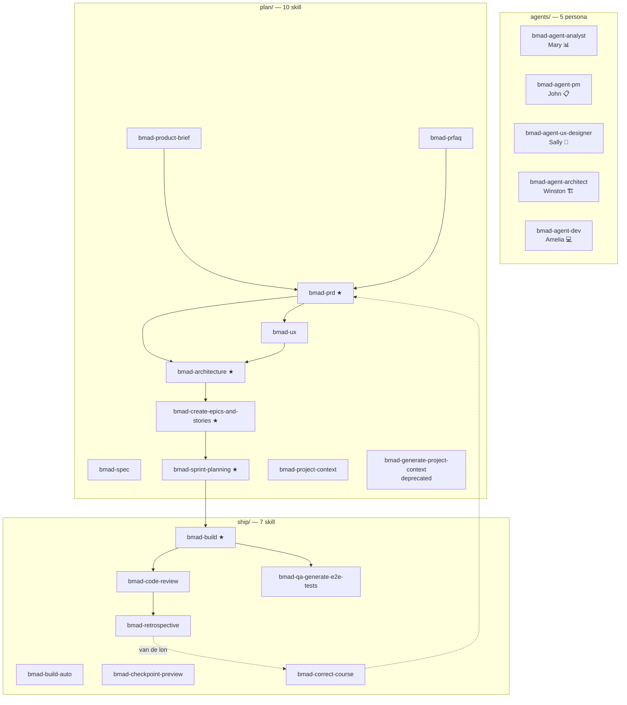
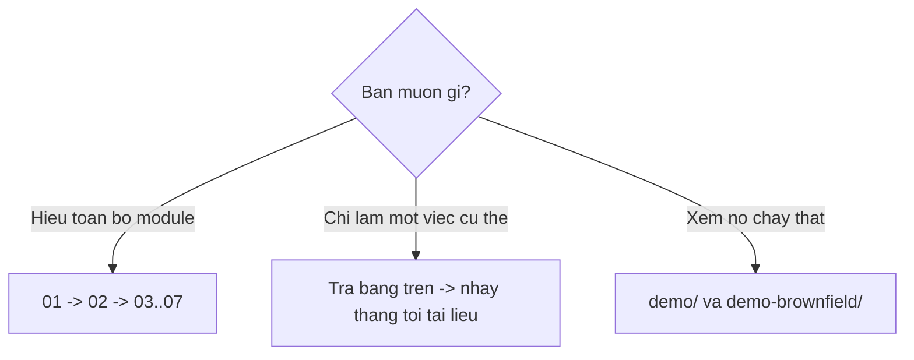
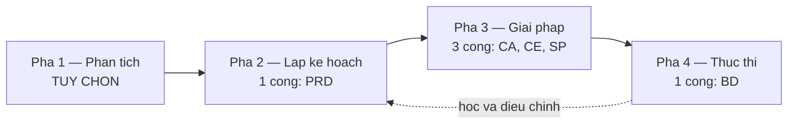

# Chỉ mục — Module BMM (BMad Method)

> Tài liệu chi tiết về **module `bmm`** — module chính của BMAD-METHOD v6.10.0.
>
> Song song với [tài liệu module core](../tai-lieu-core/index.md). Nếu `core` là **hộp công cụ dùng chung**, thì `bmm` là **phương pháp giao hàng phần mềm**.

---

## Module `bmm` là gì

| | |
| --- | --- |
| Mã | `bmm` |
| Tên | BMad Method |
| Mô tả | Agile Ai Driven Development |
| Mặc định chọn | ✅ `default_selected: true` |
| Nguồn | `src/bmm-skills/` → cài thành `_bmad/bmm/` |
| Số skill | **22** (5 agent + 10 plan + 7 ship) + **13 shim** = 35 file `SKILL.md` |
| Cổng bắt buộc | **5** (`bmad-prd`, `bmad-architecture`, `bmad-create-epics-and-stories`, `bmad-sprint-planning`, `bmad-build`) |

---

## Bản đồ tài liệu

| # | Tài liệu | Nội dung |
| --- | --- | --- |
| 01 | **[Tổng quan module BMM](./01-tong-quan-module-bmm.md)** | `module.yaml`, 4 pha, cấu hình, catalog, cấu trúc thư mục |
| 02 | **[Năm agent persona](./02-nam-agent-persona.md)** | Mary, John, Sally, Winston, Amelia — giao thức 8 bước, menu, tùy biến |
| 03 | **[Pha 1 — Phân tích](./03-pha1-phan-tich.md)** | `bmad-product-brief`, `bmad-prfaq` |
| 04 | **[Pha 2 — Lập kế hoạch](./04-pha2-lap-ke-hoach.md)** | `bmad-prd`, `bmad-ux`, `bmad-spec` |
| 05 | **[Pha 3 — Giải pháp](./05-pha3-giai-phap.md)** | `bmad-architecture`, `bmad-create-epics-and-stories`, `bmad-sprint-planning` |
| 06 | **[Pha 4 — Thực thi](./06-pha4-thuc-thi.md)** | `bmad-build`, `bmad-build-auto`, `bmad-code-review`, `bmad-checkpoint-preview`, `bmad-qa-generate-e2e-tests`, `bmad-correct-course`, `bmad-retrospective` |
| 07 | **[Ngữ cảnh dự án](./07-project-context.md)** | `bmad-project-context` — on-ramp cho brownfield |
| 08 | **[Mười ba shim v6](./08-v6-shims.md)** | Tương thích ngược |

---

## Toàn cảnh 22 skill



★ = cổng bắt buộc (`required = true`)

---

## Bảng tra cứu nhanh 22 skill

| Skill | Mã | Pha | Bắt buộc | Đầu ra | Tài liệu |
| --- | --- | --- | :-: | --- | --- |
| `bmad-agent-analyst` | — | — | | Persona Mary | [02](./02-nam-agent-persona.md) |
| `bmad-agent-pm` | — | — | | Persona John | [02](./02-nam-agent-persona.md) |
| `bmad-agent-ux-designer` | — | — | | Persona Sally | [02](./02-nam-agent-persona.md) |
| `bmad-agent-architect` | — | — | | Persona Winston | [02](./02-nam-agent-persona.md) |
| `bmad-agent-dev` | — | — | | Persona Amelia | [02](./02-nam-agent-persona.md) |
| `bmad-product-brief` | `CB` | plan | | `brief.md`, `addendum.md` | [03](./03-pha1-phan-tich.md) |
| `bmad-prfaq` | `WB` | plan | | `prfaq-{project}.md` | [03](./03-pha1-phan-tich.md) |
| `bmad-prd` | `PRD` | 2-planning | ✅ | `prd.md`, `.memlog.md`, báo cáo HTML | [04](./04-pha2-lap-ke-hoach.md) |
| `bmad-ux` | `CU` | 2-planning | | `DESIGN.md`, `EXPERIENCE.md` | [04](./04-pha2-lap-ke-hoach.md) |
| `bmad-spec` | `SPC` | anytime | | `SPEC.md` + companion | [04](./04-pha2-lap-ke-hoach.md) |
| `bmad-architecture` | `CA` | plan | ✅ | `ARCHITECTURE-SPINE.md` | [05](./05-pha3-giai-phap.md) |
| `bmad-create-epics-and-stories` | `CE` | plan | ✅ | File epic chứa story | [05](./05-pha3-giai-phap.md) |
| `bmad-sprint-planning` | `SP` / `SS` | plan / anytime | ✅ | `sprint-status.yaml` | [05](./05-pha3-giai-phap.md) |
| `bmad-build` | `BD` | ship | ✅ | `spec-*.md` + mã | [06](./06-pha4-thuc-thi.md) |
| `bmad-build-auto` | — | ship | | Vòng lặp không giám sát | [06](./06-pha4-thuc-thi.md) |
| `bmad-code-review` | `CR` | ship | | Findings + patch | [06](./06-pha4-thuc-thi.md) |
| `bmad-checkpoint-preview` | `CK` | ship | | Hướng dẫn duyệt | [06](./06-pha4-thuc-thi.md) |
| `bmad-qa-generate-e2e-tests` | `QA` | ship | | Bộ test API/E2E | [06](./06-pha4-thuc-thi.md) |
| `bmad-correct-course` | `CC` | anytime | | Sprint Change Proposal | [06](./06-pha4-thuc-thi.md) |
| `bmad-retrospective` | `ER` | ship | | Retro + action items | [06](./06-pha4-thuc-thi.md) |
| `bmad-project-context` | `PC` | anytime | | Khối `AGENTS.md` | [07](./07-project-context.md) |
| `bmad-generate-project-context` | — | — | | *(deprecated → `bmad-project-context`)* | [08](./08-v6-shims.md) |

---

## Ba đường đọc



| Vai trò | Đọc theo thứ tự |
| --- | --- |
| **Người dùng mới** | [Demo greenfield](../demo/index.md) → 01 → 02 |
| **Product Manager** | 01 → 03 → 04 |
| **Kiến trúc sư** | 01 → 05 |
| **Lập trình viên** | 01 → 06 → [Demo](../demo/06-pha4-thuc-thi.md) |
| **Người nhận dự án kế thừa** | 07 → [Demo brownfield](../demo-brownfield/index.md) |
| **Người tùy biến** | [Core A3](../tai-lieu-core/A3-cau-hinh-va-tuy-bien.md) → 01 §4 |

---

## Ba khái niệm chi phối toàn module

### 1. Bốn pha, năm cổng



⭐ **Chỉ 5 mục có `required = true`.** Mọi thứ khác là tùy chọn — kể cả toàn bộ Pha 1.

### 2. Tài liệu trước là ngữ cảnh cho bước sau

| Tạo phẩm | Ai đọc nó |
| --- | --- |
| `brief.md` | `bmad-prd` |
| `prd.md` | `bmad-architecture`, `bmad-create-epics-and-stories`, cache epic |
| `ARCHITECTURE-SPINE.md` | `bmad-create-epics-and-stories`, mọi spec |
| `epics.md` | `bmad-sprint-planning`, `bmad-build` |
| `sprint-status.yaml` | `bmad-build`, `bmad-retrospective` |
| `spec-*.md` | Story sau cùng epic, `bmad-retrospective` |
| `retrospective-*.md` | Sprint planning epic sau |

### 3. Mọi skill đều theo giao thức kích hoạt chung

Giống hệt core — xem [Core A5](../tai-lieu-core/A5-giao-thuc-kich-hoat.md).

```bash
uv run {project-root}/_bmad/scripts/resolve_customization.py --skill {skill-root} --key workflow
uv run {project-root}/_bmad/scripts/resolve_config.py --project-root {project-root}
```

---

## Khác biệt `core` vs `bmm`

| | `core` | `bmm` |
| --- | --- | --- |
| Vai trò | Hộp công cụ dùng chung | **Phương pháp giao hàng** |
| Luôn cài | ✅ Không bỏ chọn được | Mặc định chọn, bỏ được |
| Số skill | 8 + 6 shim | **22 + 13 shim** |
| Cổng bắt buộc | **0** | **5** |
| Pha | Mọi skill `anytime` | 4 pha có thứ tự |
| Agent persona | ❌ Không có | ✅ **5 persona** |
| Workflow kết xuất | ❌ Không có | ✅ `bmad-build`, `bmad-build-auto` |
| Khóa cấu hình | 5 | 4 |
| Gọi skill khác | Được gọi bởi bmm | Gọi `bmad-review`, `bmad-advanced-elicitation` của core |

---

## Tài liệu liên quan

| Muốn hiểu | Đọc |
| --- | --- |
| Module `core` chi tiết | [tai-lieu-core/](../tai-lieu-core/index.md) |
| Hệ thống làm gì | [Đặc tả](../tai-lieu-he-thong/01-dac-ta-he-thong.md) |
| Kiến trúc | [Thiết kế](../tai-lieu-he-thong/02-thiet-ke-he-thong.md) |
| Cài đặt, vận hành | [Vận hành](../tai-lieu-he-thong/03-van-hanh-he-thong.md) |
| Xem chạy thật — dự án mới | [Demo greenfield](../demo/index.md) |
| Xem chạy thật — dự án cũ | [Demo brownfield](../demo-brownfield/index.md) |
| Đọc mã nguồn | [doc-ma-nguon/](../doc-ma-nguon/index.md) |

---

**Bắt đầu:** [01 — Tổng quan module BMM](./01-tong-quan-module-bmm.md)
