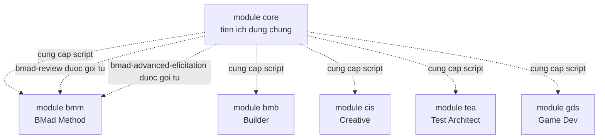
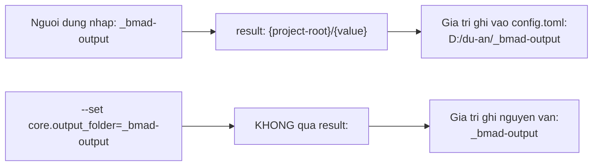
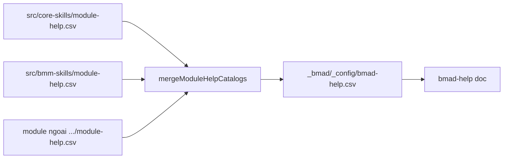
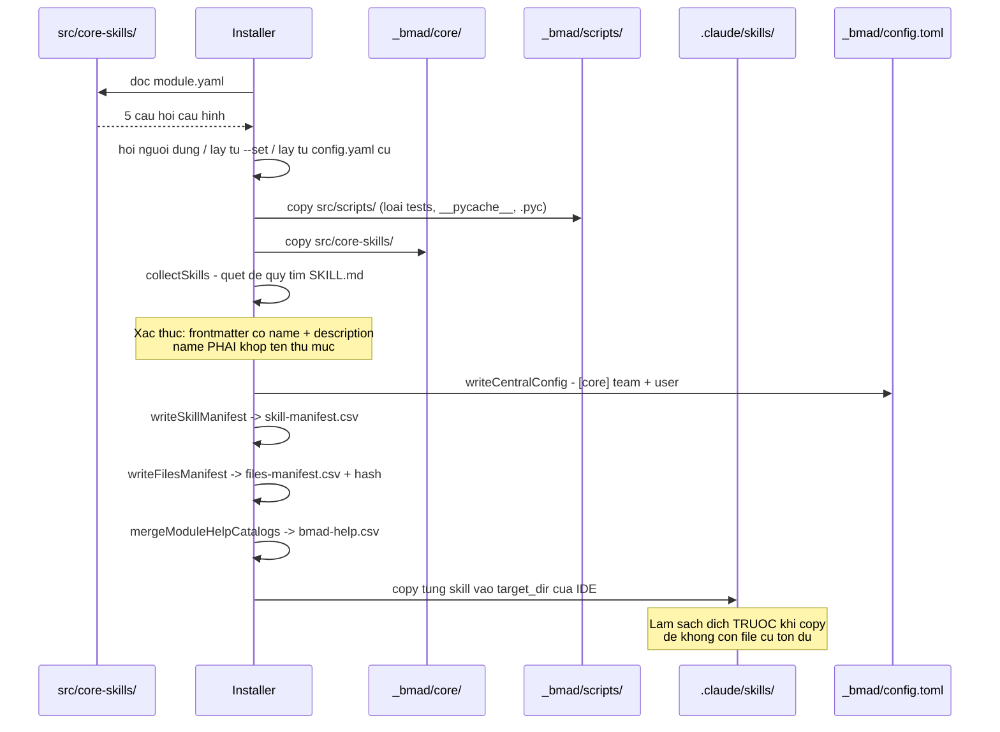

# A1 — Tổng quan module CORE

> [← Chỉ mục](./index.md) · Tiếp: [A2 — Giải phẫu một skill](./A2-giai-phau-mot-skill.md)

---

## 1. Core là gì

Module `core` là **tập kỹ năng dùng chung** cho mọi module, mọi dự án, mọi pha. Nó **luôn được cài** và không thể bỏ chọn — installer tự thêm `core` vào đầu danh sách module nếu bạn quên.

Trích `tools/installer/core/config.js`:

```js
const modules = [...(userInput.modules || [])];
if (userInput.installCore && !modules.includes('core')) {
  modules.unshift('core');
}
```

Vai trò của core trong hệ sinh thái:



Cụ thể, core cung cấp cho các module khác:

| Thứ core cung cấp | Ai dùng |
| --- | --- |
| `_bmad/scripts/*.py` | **Mọi** skill của **mọi** module |
| `bmad-review` | `bmad-code-review`, `bmad-prd`, `bmad-ux`, `bmad-architecture`, `bmad-product-brief` gọi tự động |
| `bmad-advanced-elicitation` | Mọi workflow tài liệu gọi ở các điểm dừng tự nhiên |
| `bmad-help` | Người dùng gọi bất cứ lúc nào |
| Cấu hình `[core]` | Mọi skill đọc `user_name`, ngôn ngữ, `output_folder` |
| Roster `[agents.*]` | `bmad-party-mode`, `bmad-forge-idea`, `bmad-advanced-elicitation` |

---

## 2. Cấu trúc thư mục

### 2.1 Trong repo mã nguồn

```
src/core-skills/
├── module.yaml                          # ĐỊNH NGHĨA MODULE
├── module-help.csv                      # CATALOG TRỢ GIÚP
│
├── bmad-advanced-elicitation/
│   ├── SKILL.md
│   ├── customize.toml
│   ├── assets/
│   │   └── methods.csv                  # catalog phương pháp
│   └── scripts/
│       ├── pick_methods.py              # 233 dòng
│       └── tests/test_pick_methods.py
│
├── bmad-brainstorming/
│   ├── SKILL.md
│   ├── customize.toml
│   ├── assets/
│   │   ├── brain-methods.csv            # thư viện kỹ thuật
│   │   ├── brain-icons.json
│   │   └── brain-selector.html          # trang chọn kỹ thuật
│   ├── references/                      # 8 file nạp just-in-time
│   │   ├── mode-facilitator.md
│   │   ├── mode-partner.md
│   │   ├── mode-autonomous.md
│   │   ├── in-chat-techniques.md
│   │   ├── converge.md
│   │   ├── finalize.md
│   │   ├── resume.md
│   │   └── headless.md
│   └── scripts/
│       ├── brain.py                     # 770 dòng — lớn nhất core
│       └── tests/test_brain.py
│
├── bmad-customize/
│   ├── SKILL.md                         # KHÔNG có customize.toml
│   └── scripts/
│       ├── list_customizable_skills.py  # 231 dòng
│       └── tests/
│
├── bmad-deep-recon/
│   ├── SKILL.md
│   ├── customize.toml                   # 212 dòng — lớn nhất core
│   ├── assets/research.template.md
│   ├── references/                      # 9 file
│   │   ├── draft.md         process.md       run.md
│   │   ├── selection.md     verification.md  synthesis.md
│   │   ├── finalize.md      lifecycle.md     html-briefing.md
│   ├── types/                           # 6 gói loại nghiên cứu
│   │   ├── market.md        domain.md        technical.md
│   │   ├── competitive.md   user-voice.md    academic-lit.md
│   └── scripts/
│       ├── recon_kit.py                 # 322 dòng
│       └── tests/
│
├── bmad-forge-idea/
│   ├── SKILL.md
│   ├── customize.toml
│   └── scripts/
│       ├── resolve_personas.py          # 275 dòng
│       └── tests/
│
├── bmad-help/
│   └── SKILL.md                         # DUY NHẤT 1 file
│
├── bmad-party-mode/
│   ├── SKILL.md
│   ├── customize.toml                   # 211 dòng — chứa 9 persona + 2 party
│   ├── references/                      # 5 file
│   │   ├── create-party.md   party-memory.md
│   │   ├── mode-auto.md      mode-subagent.md   mode-agent-team.md
│   └── scripts/
│       ├── resolve_party.py             # 282 dòng
│       └── tests/
│
├── bmad-review/
│   ├── SKILL.md
│   ├── customize.toml                   # 141 dòng — 5 lens
│   ├── references/                      # 7 file
│   │   ├── lens-adversarial.md          lens-edge-case-hunter.md
│   │   ├── lens-verification-gap.md     lens-structure.md
│   │   ├── lens-prose.md                editorial-common.md
│   │   └── structure-models.md
│   └── scripts/
│       ├── word_metrics.py              # 102 dòng
│       └── tests/
│
└── v6-shims/                            # 6 skill chuyển tiếp
    ├── README.md
    ├── bmad-editorial-review/{SKILL.md, customize.toml}
    ├── bmad-editorial-review-prose/SKILL.md
    ├── bmad-editorial-review-structure/SKILL.md
    ├── bmad-review-adversarial-general/SKILL.md
    ├── bmad-review-edge-case-hunter/SKILL.md
    └── bmad-review-verification-gap/SKILL.md
```

### 2.2 Sau khi cài vào dự án

```
<project-root>/
├── _bmad/
│   ├── core/                    ← nội dung src/core-skills/ được sao chép vào đây
│   │   ├── bmad-help/
│   │   ├── bmad-review/
│   │   └── ...
│   └── scripts/                 ← nội dung src/scripts/ (KHÔNG có thư mục tests/)
│       ├── config_utils.py
│       ├── resolve_config.py
│       ├── resolve_customization.py
│       ├── render_skill.py
│       └── memlog.py
└── .claude/skills/              ← BẢN SAO của từng skill, phẳng (không có tầng module)
    ├── bmad-help/
    ├── bmad-review/
    └── ...
```

> **Quan trọng khi vận hành thủ công:** `{skill-root}` mà SKILL.md nói tới là **thư mục skill trong IDE** (`.claude/skills/bmad-review`), không phải `_bmad/core/bmad-review`. Đó là bản mà công cụ AI thực sự đọc.

### 2.3 Lọc khi cài script

`installer.js:_installSharedScripts` loại bỏ các mục sau khi sao chép `src/scripts/` → `_bmad/scripts/`:

```js
const isInstallable = (srcPath) => {
  const base = path.basename(srcPath);
  return base !== 'tests' && base !== '__pycache__'
      && base !== '.pytest_cache' && !base.endsWith('.pyc');
};
```

Đồng thời tạo hai file `.gitignore`:

| File | Nội dung | Mục đích |
| --- | --- | --- |
| `_bmad/custom/.gitignore` | `*.user.toml` | Lớp cá nhân không lên git |
| `_bmad/render/.gitignore` | `*`\n`!.gitignore` | Snapshot không lên git |

---

## 3. File `module.yaml`

Đây là **hợp đồng cài đặt** của module: nó khai báo các câu hỏi installer sẽ hỏi và cách chuyển câu trả lời thành giá trị cấu hình.

```yaml
code: core
name: "BMad Core Module"
description: "Shared utilities across modules"

header: "BMad Core Configuration"
subheader: "Configure the core settings for your BMad installation.\nThese settings will be used across all installed bmad skills, workflows, and agents."

user_name:
  prompt: "What should agents call you? (Use your name or a team name)"
  scope: user
  default: "BMad"
  result: "{value}"

project_name:
  prompt: "What is your project called?"
  default: "{directory_name}"
  result: "{value}"

communication_language:
  prompt: "What language should agents use when chatting with you?"
  scope: user
  default: "English"
  result: "{value}"

document_output_language:
  prompt: "Preferred document output language?"
  default: "English"
  result: "{value}"

output_folder:
  prompt: "Where should output files be saved?"
  default: "_bmad-output"
  result: "{project-root}/{value}"

directories:
  - "{output_folder}"
```

### 3.1 Giải thích từng trường

| Trường | Ý nghĩa | Ví dụ |
| --- | --- | --- |
| `code` | Mã module, dùng làm khóa TOML `[modules.<code>]` | `core` |
| `name`, `description` | Hiển thị trong bộ chọn | |
| `header`, `subheader` | Tiêu đề màn hình cấu hình | |
| `<key>.prompt` | Câu hỏi. Có thể là chuỗi hoặc mảng nhiều dòng | |
| `<key>.scope` | `user` → vào `config.user.toml`; bỏ trống → `config.toml` | `user_name` là `user` |
| `<key>.default` | Giá trị mặc định. `{directory_name}` được thay bằng tên thư mục | |
| `<key>.result` | **Template render giá trị cuối** | `{project-root}/{value}` |
| `<key>.single-select` | Danh sách lựa chọn (xem `module.yaml` của bmm) | |
| `directories` | Thư mục tạo lúc cài | Chỉ `{output_folder}` |

### 3.2 Cơ chế `result:` — điểm dễ nhầm



> Muốn `--set` cho ra đường dẫn tuyệt đối, phải truyền đầy đủ:
> `--set core.output_folder='{project-root}/_bmad-output'`

### 3.3 Chỉ một thư mục được tạo lúc cài

Chú thích trong `module.yaml` nói rõ:

> *The one directory created at install time. Everything else (module artifact folders, project knowledge) is created lazily by the first skill that writes there.*

Nghĩa là: `_bmad-output/planning-artifacts/` và `implementation-artifacts/` **chưa tồn tại** ngay sau khi cài — skill nào ghi trước thì tạo trước.

---

## 4. File `module-help.csv`

Đây là **catalog trợ giúp** — nguồn dữ liệu duy nhất của `bmad-help`.

### 4.1 Lược đồ 13 cột

```
module,skill,display-name,menu-code,description,action,args,phase,preceded-by,followed-by,required,output-location,outputs
```

| Cột | Ý nghĩa | Ví dụ |
| --- | --- | --- |
| `module` | Tên hiển thị của module | `Core` |
| `skill` | Tên skill, hoặc `_meta` cho dòng metadata | `bmad-review` |
| `display-name` | Tên hiển thị | `Review` |
| `menu-code` | Mã 2–3 ký tự để chọn nhanh | `RV` |
| `description` | Mô tả — **mang cả ngữ cảnh định tuyến** | |
| `action` | Action con của skill đa hành động | `status` |
| `args` | Đối số | `[path]`, `[type]`, `-A`, `-H` |
| `phase` | `anytime` hoặc tên pha/nhóm | `anytime`, `plan`, `ship` |
| `preceded-by` | Nên chạy sau skill nào (gợi ý mềm) | `bmad-sprint-planning` |
| `followed-by` | Nên chạy trước skill nào (gợi ý mềm) | `bmad-code-review` |
| `required` | `true` = **cổng chặn thật** | `false` |
| `output-location` | Nơi lưu đầu ra, hoặc URL doc cho `_meta` | `{output_folder}/forge` |
| `outputs` | Mẫu tên file đầu ra (để phát hiện đã làm chưa) | `research report/summary` |

### 4.2 Toàn bộ nội dung của core

| skill | display | mã | phase | required | output-location | outputs |
| --- | --- | --- | --- | --- | --- | --- |
| `_meta` | — | — | — | false | `https://docs.bmad-method.org/llms.txt` | — |
| `bmad-brainstorming` | Brainstorming | BSP | anytime | false | `{output_folder}/brainstorming` | brainstorming session |
| `bmad-party-mode` | Party Mode | PM | anytime | false | — | — |
| `bmad-help` | BMad Help | BH | anytime | false | — | — |
| `bmad-customize` | BMad Customize | BC | anytime | false | `{project-root}/_bmad/custom` | TOML override files |
| `bmad-advanced-elicitation` | Advanced Elicitation | AE | anytime | false | — | — |
| `bmad-review` | Review | RV | anytime | false | — | findings JSON + markdown report |
| `bmad-forge-idea` | Forge Idea | FI | anytime | false | `{output_folder}/forge` | refined-idea brief (optional) |
| `bmad-deep-recon` | Deep Recon | RS | anytime | false | `{planning_artifacts}/research` | research report/summary + optional html briefing |

**Nhận xét quan trọng:** *mọi* skill của core đều có `phase = anytime` và `required = false`. Core **không bao giờ chặn** tiến độ — nó là công cụ hỗ trợ, không phải cổng quy trình.

### 4.3 Dòng `_meta`

```csv
Core,_meta,,,,,,,,,false,https://docs.bmad-method.org/llms.txt,
```

Dòng này không phải skill. Cột `output-location` chứa URL tài liệu của module — `bmad-help` fetch URL này để trả lời câu hỏi chung mà không skill nào khớp.

### 4.4 Gộp thành `bmad-help.csv`



Xem file gộp:

```bash
cat _bmad/_config/bmad-help.csv
```

---

## 5. Vòng đời: từ nguồn đến bản cài



### 5.1 Quy tắc phát hiện skill

`manifest-generator.js:collectSkills` duyệt đệ quy thư mục module và nhận diện một thư mục là skill khi:

1. Thư mục chứa file `SKILL.md`
2. `SKILL.md` có YAML frontmatter hợp lệ
3. Frontmatter có `name` **và** `description`
4. `name` **khớp chính xác** tên thư mục

Nếu điều kiện 4 sai ⇒ skill không được đăng ký ⇒ không xuất hiện trong công cụ AI. Đây là lỗi hay gặp nhất khi tự tạo skill.

### 5.2 Kiểm chứng thủ công

```bash
# Skill nào đã được đăng ký?
cat _bmad/_config/skill-manifest.csv | grep core

# Có bao nhiêu skill core?
grep -c ',"core",' _bmad/_config/skill-manifest.csv

# Skill nào đã vào thư mục IDE?
ls .claude/skills/ | grep bmad-

# Đối chiếu: skill trong manifest nhưng không có ở IDE?
comm -23 \
  <(cut -d, -f1 _bmad/_config/skill-manifest.csv | tr -d '"' | sort) \
  <(ls .claude/skills/ | sort)
```

---

## 6. Sự khác biệt với v4/v5 (`bmad_core`)

| Khía cạnh | v4/v5 (`bmad_core`) | v6 (`core-skills`) |
| --- | --- | --- |
| Tên thư mục nguồn | `bmad-core/` | `src/core-skills/` |
| Tên thư mục cài | `.bmad-core/` | `_bmad/core/` |
| Đơn vị năng lực | agent + task + template + checklist tách rời | **skill** — một thư mục có `SKILL.md` |
| Định dạng agent | file `.md` với khối YAML nhúng | `SKILL.md` + `customize.toml` |
| Cấu hình | `core-config.yaml` | 4 lớp TOML |
| Tùy biến | sửa trực tiếp file | lớp override trong `_bmad/custom/` |
| Kết xuất | không có | `render_skill.py` → snapshot bất biến |
| Bộ nhớ phiên | không có | `memlog.py` → `.memlog.md` |

Nếu bạn đang tìm tài liệu về `bmad_core`, xem `docs/how-to/upgrade-to-v6.md` trong repo.

---

**Tiếp:** [A2 — Giải phẫu một skill](./A2-giai-phau-mot-skill.md) · [← Chỉ mục](./index.md)
