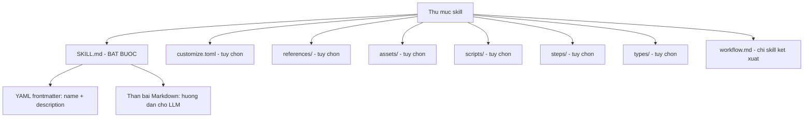
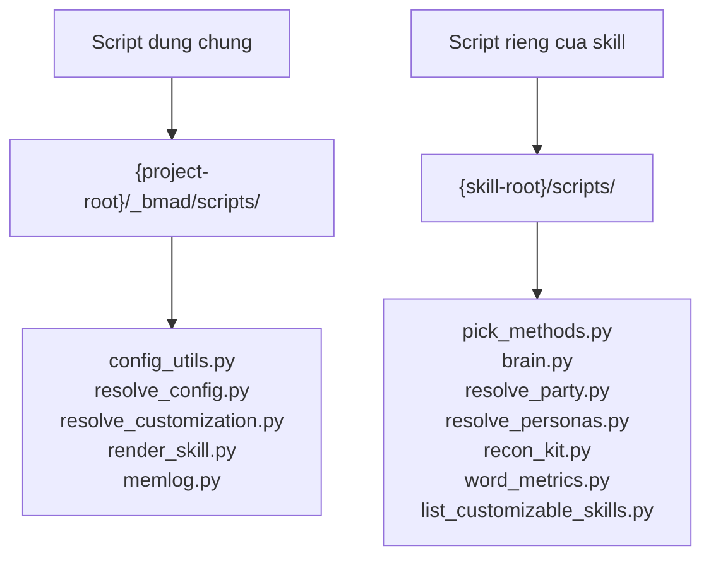
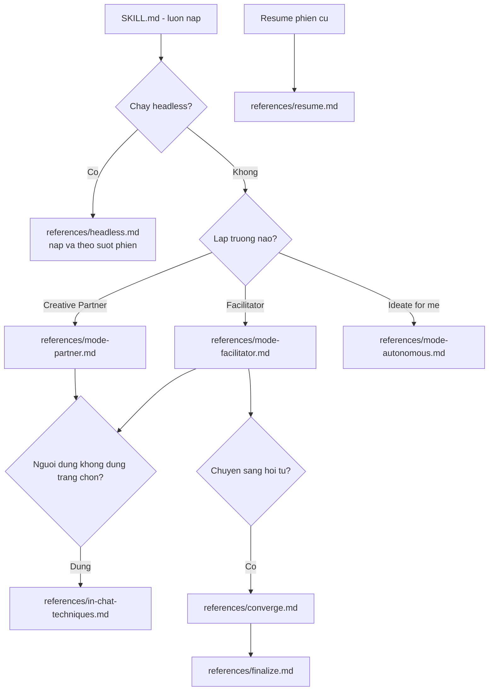
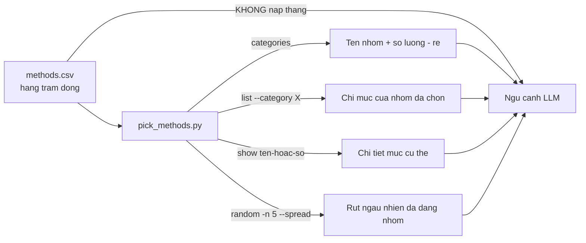
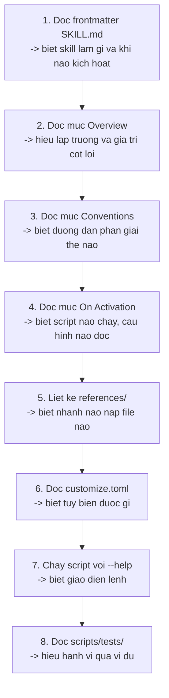

# A2 — Giải phẫu một skill

> [← Chỉ mục](./index.md) · Trước: [A1](./A1-tong-quan-module-core.md) · Tiếp: [A3 — Cấu hình và tùy biến](./A3-cau-hinh-va-tuy-bien.md)

---

## 1. Skill là gì

**Một skill = một thư mục chứa file `SKILL.md`.** Đó là toàn bộ định nghĩa. Công cụ AI quét thư mục skill, đọc frontmatter của mỗi `SKILL.md`, và dùng trường `description` để quyết định khi nào kích hoạt skill đó.



---

## 2. File `SKILL.md`

### 2.1 Cấu trúc tối thiểu

```markdown
---
name: bmad-help
description: 'Analyzes current state and user query to answer BMad questions or recommend the next skill(s) to use. Use when user asks for help, bmad help, what to do next, or what to start with in BMad.'
---

# BMad Help

## Purpose
...
```

### 2.2 Quy tắc frontmatter — 7 quy tắc bắt buộc

| Mã | Quy tắc | Mức | Kiểm tra |
| --- | --- | --- | --- |
| SKILL-01 | Thư mục **phải** có file tên đúng `SKILL.md` (phân biệt hoa/thường) | CRITICAL | tồn tại file |
| SKILL-02 | Frontmatter phải có `name` | CRITICAL | parse YAML |
| SKILL-03 | Frontmatter phải có `description` | CRITICAL | parse YAML |
| SKILL-04 | `name` khớp `^bmad-[a-z0-9]+(-[a-z0-9]+)*$` | HIGH | regex |
| SKILL-05 | `name` **khớp chính xác tên thư mục** | HIGH | so sánh chuỗi |
| SKILL-06 | `description` ≤ 1024 ký tự, nêu **cả** *làm gì* **và** *khi nào dùng* | MEDIUM | độ dài + tìm cụm "Use when"/"Use if" |
| SKILL-07 | Thân bài sau frontmatter không được rỗng | HIGH | trim |

Kiểm tra thủ công:

```bash
node tools/validate-skills.js --json src/core-skills/bmad-review
```

### 2.3 Vì sao `description` quan trọng nhất

`description` là **thứ duy nhất** công cụ AI dùng để quyết định có kích hoạt skill hay không. Nó phải trả lời hai câu:

1. **Skill này làm gì?** — để LLM biết nó phù hợp
2. **Khi nào người dùng muốn nó?** — kèm các cụm từ kích hoạt thật

Ví dụ tốt (`bmad-review`):

```
'Multi-lens review over any diff, doc, spec, or artifact — whichever installed
lenses fit the content, run singly or together. Shipped lenses include adversarial,
edge-case, verification-gap, structure, and prose. Use when the user says
"review this", "critical review", "editorial review", "hunt edge cases",
"review the structure", or "review the prose".'
```

Phần sau `Use when the user says` liệt kê **nguyên văn** các câu người dùng hay gõ. Đây là điều làm skill được kích hoạt đúng lúc.

---

## 3. Ba khuôn mẫu skill

### 3.1 Khuôn mẫu A — Skill đơn (thường gặp nhất trong core)

```
bmad-review/
├── SKILL.md              ← toàn bộ hướng dẫn nằm ở đây
├── customize.toml        ← bề mặt tùy biến
├── references/           ← nạp khi cần, không nạp sẵn
│   ├── lens-adversarial.md
│   └── ...
└── scripts/
    └── word_metrics.py
```

`SKILL.md` chứa: Overview → Conventions → On Activation → các mục quy trình → Output.

**Skill core theo khuôn mẫu này:** `bmad-help`, `bmad-review`, `bmad-customize`, `bmad-brainstorming`, `bmad-deep-recon`, `bmad-forge-idea`, `bmad-party-mode`, `bmad-advanced-elicitation`.

Nghĩa là: **toàn bộ core dùng khuôn mẫu A.**

### 3.2 Khuôn mẫu B — Agent persona (không có trong core, có trong bmm)

```
bmad-agent-dev/
├── SKILL.md              ← 8 bước kích hoạt chuẩn
└── customize.toml        ← có mục [agent]
```

### 3.3 Khuôn mẫu C — Workflow kết xuất (không có trong core, có trong bmm)

```
bmad-build/
├── SKILL.md              ← ~10 dòng, chỉ gọi render_skill.py
├── workflow.md           ← điểm vào thật
├── step-01-*.md ... step-05-*.md
└── customize.toml
```

`SKILL.md` của khuôn mẫu C:

```markdown
Run the following command exactly once without changing the current working directory.
Replace `{project-root}` with the absolute path to the project root and `{skill-root}`
with the absolute path to this skill's directory:

```bash
uv run --no-cache "{project-root}/_bmad/scripts/render_skill.py" --project-root "{project-root}" --skill "{skill-root}"
```

- On success, read and follow the one absolute `workflow.md` instruction printed to stdout.
- On failure (including `uv` being unavailable), report the command output and HALT.
  Do not run any workflow source directly.
```

> Câu cuối là ràng buộc an toàn: LLM **không được** đọc `workflow.md` gốc khi kết xuất thất bại, vì file gốc còn chứa token chưa thay thế.

---

## 4. Quy ước đường dẫn — 4 loại biến

Mọi `SKILL.md` trong core đều có mục `## Conventions` khai báo cách phân giải đường dẫn. Bốn loại:

| Biến | Phân giải thành | Ví dụ giá trị thực |
| --- | --- | --- |
| *(đường dẫn trần)* | Từ `{skill-root}` | `references/lens-prose.md` → `.claude/skills/bmad-review/references/lens-prose.md` |
| `{skill-root}` | Thư mục cài của skill (nơi có `customize.toml`) | `D:/du-an/.claude/skills/bmad-review` |
| `{project-root}` | Thư mục làm việc của dự án | `D:/du-an` |
| `{skill-name}` | Tên cơ sở của thư mục skill | `bmad-review` |

Ngoài ra:

| Biến | Nguồn |
| --- | --- |
| `{workflow.<tên>}` | Mục `[workflow]` trong `customize.toml` **đã hợp nhất** |
| `{agent.<tên>}` | Mục `[agent]` trong `customize.toml` đã hợp nhất |
| `{user_name}`, `{communication_language}`, … | Cấu hình trung tâm đã hợp nhất |
| `{date}` | Ngày hôm nay |

### 4.1 Ba quy tắc cấm (validator kiểm tra)

| Mã | Cấm gì | Vì sao |
| --- | --- | --- |
| PATH-01 | Tham chiếu nội bộ phải tương đối **từ file gốc**, không phải từ thư mục skill | File `references/a.md` trỏ sang `references/b.md` thì viết `b.md`, không viết `references/b.md` |
| PATH-04 | Cấm biến frontmatter trỏ vào file **trong chính skill** | Chống anti-pattern; dùng đường dẫn cứng nội tuyến |
| PATH-05 | Cấm tham chiếu vào thư mục của **skill khác** | Skill phải tự chứa; muốn dùng skill khác thì **gọi** nó, không đọc file của nó |

### 4.2 Cạm bẫy: script ở hai nơi khác nhau

Trích `bmad-forge-idea/SKILL.md`:

> *Scripts live in two places — run each from the exact path written, never assume co-location: the shared core scripts (`memlog.py`, `resolve_customization.py`, `resolve_config.py`) are installed by BMad core at `{project-root}/_bmad/scripts/` and are never bundled here; this skill's own `resolve_personas.py` is at `{skill-root}/scripts/`.*



Nhầm lẫn hai vị trí này là lỗi hay gặp khi chạy tay.

---

## 5. Thư mục `references/`

### 5.1 Mục đích: nạp just-in-time

`references/` chứa các file **chỉ nạp khi thực sự cần**. Điều này giữ ngân sách ngữ cảnh ổn định.

Ví dụ `bmad-brainstorming` có 8 file references nhưng một phiên chỉ nạp 2–3 file:



Chỉ dẫn nạp luôn viết dạng mệnh lệnh rõ ràng:

> *load `references/mode-facilitator.md` and follow it*

Và có cả chỉ dẫn **không** nạp:

> *never load it otherwise* (nói về `headless.md`)

### 5.2 Bảng references của core

| Skill | Số file | Danh sách |
| --- | --- | --- |
| `bmad-brainstorming` | 8 | `mode-facilitator`, `mode-partner`, `mode-autonomous`, `in-chat-techniques`, `converge`, `finalize`, `resume`, `headless` |
| `bmad-deep-recon` | 9 | `draft`, `process`, `run`, `selection`, `verification`, `synthesis`, `finalize`, `lifecycle`, `html-briefing` |
| `bmad-review` | 7 | `lens-adversarial`, `lens-edge-case-hunter`, `lens-verification-gap`, `lens-structure`, `lens-prose`, `editorial-common`, `structure-models` |
| `bmad-party-mode` | 5 | `create-party`, `party-memory`, `mode-auto`, `mode-subagent`, `mode-agent-team` |
| `bmad-help`, `bmad-customize`, `bmad-advanced-elicitation`, `bmad-forge-idea` | 0 | — |

---

## 6. Thư mục `assets/`

Chứa dữ liệu **không phải chỉ dẫn**: catalog CSV, template Markdown, trang HTML.

| Skill | Asset | Loại | Vai trò |
| --- | --- | --- | --- |
| `bmad-advanced-elicitation` | `methods.csv` | CSV | Catalog phương pháp elicitation (cột: `num,category,method_name,description,output_pattern`) |
| `bmad-brainstorming` | `brain-methods.csv` | CSV | Thư viện kỹ thuật ý tưởng (cột: `category,technique_name,description`) |
| `bmad-brainstorming` | `brain-icons.json` | JSON | Icon cho từng nhóm kỹ thuật |
| `bmad-brainstorming` | `brain-selector.html` | HTML | **Trang chọn phiên** — người dùng mở trong trình duyệt, soạn phiên, bấm "Copy prompt", dán lại vào chat |
| `bmad-deep-recon` | `research.template.md` | MD | Template báo cáo nghiên cứu |

### 6.1 Vì sao catalog phải qua script

Trích `bmad-advanced-elicitation/SKILL.md`:

> *`scripts/pick_methods.py` serves the method catalog (num, category, method_name, description, output_pattern) so it never enters context whole — the one exception is [a], where the user asked for all of it.*



---

## 7. Thư mục `scripts/`

### 7.1 Cấu trúc chuẩn

```
scripts/
├── ten_script.py          ← được cài vào dự án
└── tests/                 ← KHÔNG được cài (installer lọc bỏ)
    └── test_ten_script.py
```

### 7.2 Header chuẩn của script Python

```python
#!/usr/bin/env python3
# /// script
# requires-python = ">=3.11"
# ///
"""Mô tả một dòng."""

import sys

# Installed scripts are consumer files, not a location for interpreter caches.
sys.dont_write_bytecode = True

try:
    from config_utils import ConfigError, load_central_config
except ModuleNotFoundError as error:
    if error.name != "tomllib":
        raise
    sys.stderr.write("error: Python 3.11+ is required (stdlib `tomllib` not found).\n")
    raise SystemExit(3) from None
```

Bốn chi tiết đáng chú ý:

| Chi tiết | Vì sao |
| --- | --- |
| Khối `# /// script` | Chuẩn PEP 723 — `uv` đọc để biết yêu cầu Python |
| `sys.dont_write_bytecode = True` | Không rải `__pycache__` vào dự án người dùng |
| Bắt riêng `tomllib` | Thông báo lỗi rõ ràng thay vì `ModuleNotFoundError` khó hiểu |
| `SystemExit(3)` | Mã thoát riêng cho "thiếu Python 3.11" |

### 7.3 Bảng script của core

| Script | Skill | Dòng | Chức năng |
| --- | --- | --- | --- |
| `pick_methods.py` | advanced-elicitation | 233 | Phục vụ catalog: `categories`, `list`, `show`, `random` |
| `brain.py` | brainstorming | 770 | Phục vụ thư viện + sinh `brain-selector.html` |
| `list_customizable_skills.py` | customize | 231 | Quét skill có `customize.toml`, báo có override chưa |
| `recon_kit.py` | deep-recon | 322 | Bộ công cụ nghiên cứu, có `tally` đếm claim |
| `resolve_personas.py` | forge-idea | 275 | Trả về `agents`, `members`, `parties` |
| `resolve_party.py` | party-mode | 282 | Trả về roster, `party_mode`, `memory_enabled`, scene |
| `word_metrics.py` | review | 102 | Đo chỉ số văn bản cho lens biên tập |

---

## 8. File `customize.toml`

### 8.1 Header chuẩn

Mọi `customize.toml` mở đầu bằng cảnh báo:

```toml
# DO NOT EDIT -- overwritten on every update.
#
# Workflow customization surface for bmad-<tên>.
#
# Override files (not edited here):
#   {project-root}/_bmad/custom/bmad-<tên>.toml         (team)
#   {project-root}/_bmad/custom/bmad-<tên>.user.toml    (personal)

[workflow]

# --- Configurable below. Overrides merge per BMad structural rules: ---
#   scalars: override wins • plain arrays: append
#   arrays of tables keyed by `code`: matching key replaces, new keys append
```

### 8.2 Hai mục cấp cao — quyết định "loại" skill

| Mục | Nghĩa | Ai đọc |
| --- | --- | --- |
| `[agent]` | Skill này là **persona** | `resolve_customization.py --key agent`; GitHub Copilot lọc `agents-only` |
| `[workflow]` | Skill này là **quy trình** | `resolve_customization.py --key workflow` |
| *(không có file)* | Skill độc lập, không tùy biến được | — |

Trong core: 6 skill có `[workflow]`, 2 skill (`bmad-help`, `bmad-customize`) **không có** `customize.toml`.

### 8.3 Bảng trường tùy biến của toàn bộ core

| Trường | Có ở skill nào | Kiểu | Hợp nhất |
| --- | --- | --- | --- |
| `activation_steps_prepend` | brainstorming, forge-idea, party-mode, review, deep-recon | mảng chuỗi | nối |
| `activation_steps_append` | như trên | mảng chuỗi | nối |
| `persistent_facts` | brainstorming, forge-idea, party-mode, review | mảng chuỗi | nối |
| `on_complete` | tất cả (trừ elicitation) | chuỗi hoặc mảng | scalar: thắng |
| `preferences` | advanced-elicitation | mảng chuỗi | nối |
| `methods_file` | advanced-elicitation | chuỗi | thắng |
| `additional_methods` | advanced-elicitation | mảng bảng khóa `code` | trùng thay / mới nối |
| `brain_methods` | brainstorming | chuỗi | thắng |
| `favorite_techniques` | brainstorming | mảng chuỗi | nối |
| `additional_techniques` | brainstorming | mảng bảng | nối |
| `output_dir` | brainstorming, party-mode | chuỗi | thắng |
| `output_folder_name` | brainstorming | chuỗi | thắng |
| `external_handoffs` | brainstorming, deep-recon | mảng chuỗi | nối |
| `lenses` | review | mảng bảng khóa `code` | trùng thay / mới nối |
| `review_guidance` | review | mảng chuỗi | nối |
| `style_guide`, `reader_type` | review | chuỗi | thắng |
| `output_format`, `report_path`, `output_preferences` | review | chuỗi | thắng |
| `forge_output_path`, `run_folder_pattern` | forge-idea | chuỗi | thắng |
| `default_party`, `party_mode`, `party_memory`, `memory_dir` | party-mode | chuỗi/bool | thắng |
| `party_members` | party-mode | mảng bảng khóa `code` | trùng thay / mới nối |
| `party_groups` | party-mode | mảng bảng khóa `id` | trùng thay / mới nối |
| `research_types` | deep-recon | mảng bảng khóa `code` | trùng thay / mới nối |
| `research_output_path`, `research_template`, `preset`, … | deep-recon | chuỗi/số | thắng |

### 8.4 Ba tiền tố ngữ nghĩa trong giá trị chuỗi

| Tiền tố | Nghĩa | Ví dụ |
| --- | --- | --- |
| `file:` | Đường dẫn hoặc glob — **nạp nội dung file** làm sự thật/chỉ thị | `"file:{project-root}/**/project-context.md"` |
| `skill:` | Tên một skill cần tham vấn | `"skill:bmad-review lenses=structure,prose"` |
| *(không có)* | Câu chữ nguyên văn | `"Tổ chức chỉ dùng AWS."` |

---

## 9. Danh sách kiểm tra khi đọc một skill lạ



Lệnh nhanh cho bước 7:

```bash
uv run .claude/skills/bmad-advanced-elicitation/scripts/pick_methods.py --help
uv run .claude/skills/bmad-brainstorming/scripts/brain.py --help
uv run .claude/skills/bmad-party-mode/scripts/resolve_party.py --help
```

---

**Tiếp:** [A3 — Hệ thống cấu hình và tùy biến](./A3-cau-hinh-va-tuy-bien.md) · [← Chỉ mục](./index.md)
