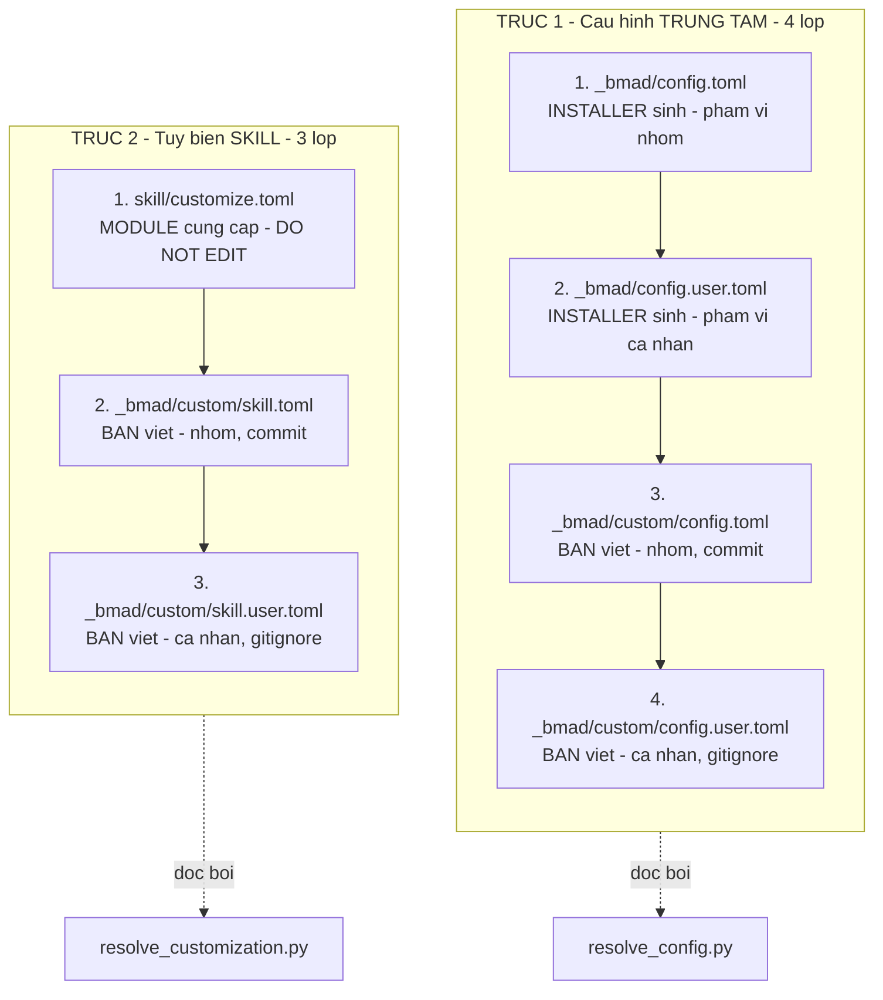
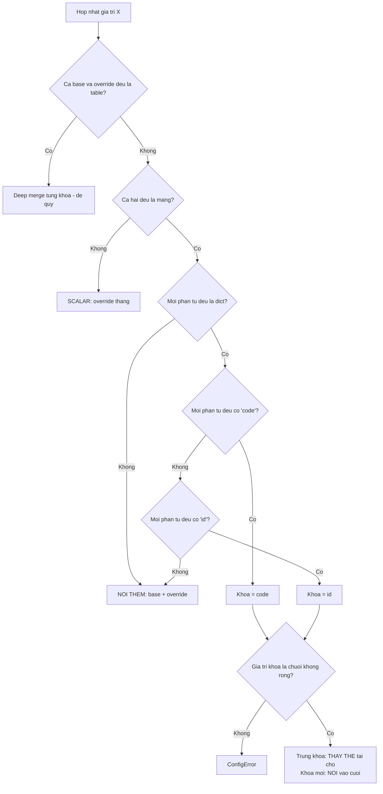
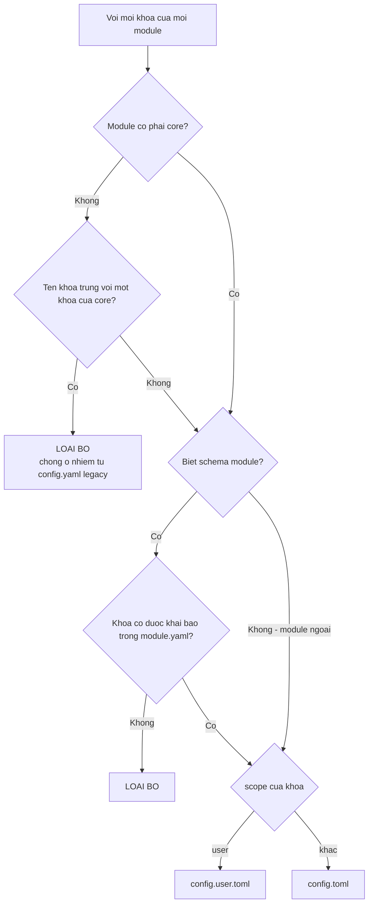
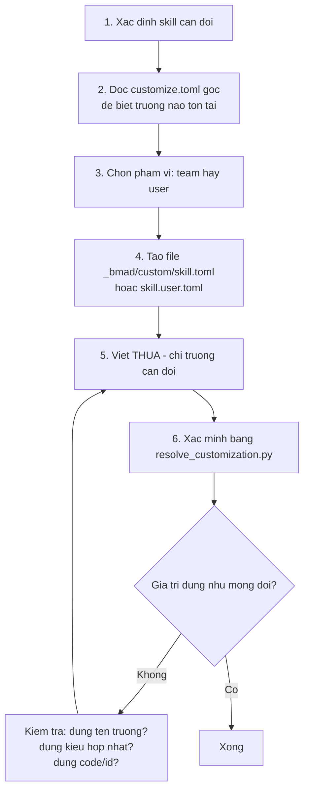

# A3 — Hệ thống cấu hình và tùy biến

> [← Chỉ mục](./index.md) · Trước: [A2](./A2-giai-phau-mot-skill.md) · Tiếp: [A4 — Script dùng chung](./A4-script-dung-chung.md)

---

## 1. Hai trục cấu hình

BMad có **hai hệ thống cấu hình độc lập**, khác nhau về số lớp và phạm vi:



Mũi tên = thứ tự hợp nhất. Lớp sau **ghi đè hoặc bổ sung** lớp trước theo quy tắc ở §3.

---

## 2. Ai sở hữu file nào

### 2.1 Bảng sở hữu

| File | Người sinh | Ghi đè khi cài? | Bạn được sửa? | Nên commit? |
| --- | --- | --- | --- | --- |
| `_bmad/config.toml` | Installer | ✅ Có | ❌ Không | ✅ Có |
| `_bmad/config.user.toml` | Installer | ✅ Có | ❌ Không | ❌ Không |
| `_bmad/custom/config.toml` | **Bạn** | ❌ Không bao giờ | ✅ Có | ✅ Có |
| `_bmad/custom/config.user.toml` | **Bạn** | ❌ Không bao giờ | ✅ Có | ❌ Gitignore |
| `<skill>/customize.toml` | Module | ✅ Có | ❌ Không | — (nằm trong `_bmad/core/`) |
| `_bmad/custom/<skill>.toml` | **Bạn** | ❌ Không bao giờ | ✅ Có | ✅ Có |
| `_bmad/custom/<skill>.user.toml` | **Bạn** | ❌ Không bao giờ | ✅ Có | ❌ Gitignore |

### 2.2 Header cảnh báo trong file installer sinh

`_bmad/config.toml` mở đầu bằng:

```toml
# ─────────────────────────────────────────────────────────────────
# Installer-managed. Regenerated on every install — treat as read-only.
#
# Direct edits to this file will be overwritten on the next install.
# To change an install answer durably, re-run the installer (your prior
# answers are remembered as defaults). To pin a value regardless of
# install answers, or to add custom agents / override descriptors, use:
#   _bmad/custom/config.toml       (team, committed)
#   _bmad/custom/config.user.toml  (personal, gitignored)
# Those files are never touched by the installer.
# ─────────────────────────────────────────────────────────────────
```

### 2.3 Bảo vệ bằng `.gitignore`

`_bmad/custom/.gitignore` được installer tạo với nội dung:

```gitignore
*.user.toml
```

Nghĩa là mọi file `.user.toml` trong `custom/` **tự động** không lên git. Không cần bạn nhớ.

---

## 3. Ba quy tắc hợp nhất

Đây là phần cốt lõi nhất cần nắm để tự viết override.

### 3.1 Bảng quy tắc

| Kiểu dữ liệu | Quy tắc | Ví dụ |
| --- | --- | --- |
| **Scalar** (chuỗi, số, bool) | Lớp sau **thắng hoàn toàn** | `style_guide = "..."` |
| **Table** (mục `[a.b]`) | **Deep merge** đệ quy theo từng khóa | `[workflow]` |
| **Mảng thường** | **Nối thêm** (base + override) | `persistent_facts` |
| **Mảng bảng có `code` hoặc `id`** | Khóa trùng ⇒ **thay thế tại chỗ**; khóa mới ⇒ **nối vào cuối** | `[[workflow.lenses]]` |

### 3.2 Mã nguồn thực tế

`src/scripts/config_utils.py`:

```python
def structural_merge(base, override):
    if isinstance(base, dict) and isinstance(override, dict):
        result = dict(base)
        for key, value in override.items():
            result[key] = structural_merge(result[key], value) if key in result else value
        return result
    if isinstance(base, list) and isinstance(override, list):
        return _merge_arrays(base, override)
    return override      # scalar: override thắng
```

Phát hiện khóa hợp nhất:

```python
_KEYED_MERGE_FIELDS = ("code", "id")

def _detect_keyed_merge_field(items):
    if not items or not all(isinstance(item, dict) for item in items):
        return None                       # không phải mảng bảng ⇒ nối thường
    for candidate in _KEYED_MERGE_FIELDS: # thử "code" trước, rồi "id"
        if all(candidate in item for item in items):
            # ... validate: phải là chuỗi không rỗng
            return candidate
    return None
```

### 3.3 Điều kiện để mảng được coi là "mảng bảng có khóa"

Cả **base lẫn override gộp lại** phải thỏa:

1. Mọi phần tử đều là bảng (dict)
2. **Mọi** phần tử đều có trường `code` (thử trước), hoặc **mọi** phần tử đều có `id`
3. Giá trị khóa phải là **chuỗi không rỗng** — nếu không sẽ ném `ConfigError`

Nếu chỉ **một** phần tử thiếu `code` ⇒ toàn bộ mảng bị coi là mảng thường ⇒ **nối** thay vì thay thế. Đây là lỗi hay gặp: quên `code` trong override và tưởng nó không hoạt động.

### 3.4 Sơ đồ quyết định



---

## 4. Ví dụ hợp nhất từng loại

### 4.1 Scalar — lớp sau thắng

**Base** (`bmad-review/customize.toml`):
```toml
[workflow]
style_guide = "Microsoft Writing Style Guide"
output_format = "both"
```

**Team** (`_bmad/custom/bmad-review.toml`):
```toml
[workflow]
style_guide = "file:{project-root}/docs/style-guide-vi.md"
```

**User** (`_bmad/custom/bmad-review.user.toml`):
```toml
[workflow]
output_format = "markdown"
```

**Kết quả:**
```json
{
  "workflow": {
    "style_guide": "file:{project-root}/docs/style-guide-vi.md",
    "output_format": "markdown"
  }
}
```

### 4.2 Mảng thường — nối thêm

**Base:**
```toml
persistent_facts = ["file:{project-root}/**/project-context.md"]
```

**Team:**
```toml
persistent_facts = ["Tổ chức chỉ dùng AWS."]
```

**User:**
```toml
persistent_facts = ["Tôi thích code Python type-hint đầy đủ."]
```

**Kết quả — cả ba đều còn, đúng thứ tự:**
```json
[
  "file:{project-root}/**/project-context.md",
  "Tổ chức chỉ dùng AWS.",
  "Tôi thích code Python type-hint đầy đủ."
]
```

> **Hệ quả:** mảng thường **không thể xóa** mục base. Muốn "tắt" mục base thì skill phải cung cấp cách khác (ví dụ `bmad-review` cho phép đặt `persistent_facts = []`… nhưng mảng rỗng nối vào vẫn giữ nguyên base — thực tế phải ghi đè bằng chính scalar nếu skill hỗ trợ, hoặc chấp nhận).

### 4.3 Mảng bảng có `code` — thay thế và nối

**Base** (`bmad-review/customize.toml`) — 5 lens:
```toml
[[workflow.lenses]]
code = "adversarial"
name = "Adversarial"
applies_to = "any"
when = "always"
instruction = "Load `references/lens-adversarial.md` from the skill root and follow it."

[[workflow.lenses]]
code = "prose"
name = "Editorial Prose"
applies_to = "docs"
after = "structure"
instruction = "Load `references/lens-prose.md` from the skill root and follow it."
```

**Team** (`_bmad/custom/bmad-review.toml`):
```toml
# code "prose" đã tồn tại ⇒ THAY THẾ mục cũ ⇒ tắt lens này
[[workflow.lenses]]
code = "prose"
name = "Editorial Prose"
applies_to = "docs"
instruction = ""

# code "accessibility" chưa có ⇒ NỐI vào cuối
[[workflow.lenses]]
code = "accessibility"
name = "Khả năng tiếp cận"
applies_to = "any"
when = "Mã UI hoặc tài liệu hướng tới người dùng cuối."
instruction = "Rà soát theo WCAG 2.2 AA. Xuất finding theo đúng các trường chuẩn."
```

**Kết quả:** vẫn 6 lens (5 base + 1 mới), trong đó `prose` bị thay bằng bản có `instruction = ""` ⇒ **bị tắt**.

> Lưu ý: mục thay thế là **thay toàn bộ**, không phải merge từng trường. Bản mới của `prose` mất `after = "structure"` vì bạn không viết lại. Muốn giữ thì phải chép lại đầy đủ.

### 4.4 Table — deep merge

**Base:**
```toml
[workflow]
output_format = "both"
report_path = ""
```

**Team:**
```toml
[workflow]
report_path = "{project-root}/_bmad-output/reviews"
```

**Kết quả:** `output_format` giữ `"both"`, `report_path` đổi. Đây là deep merge — bạn không cần chép lại `output_format`.

---

## 5. Cấu hình trung tâm — chi tiết

### 5.1 Cấu trúc `_bmad/config.toml` sau khi cài

```toml
[core]
project_name = "he-thong-quan-ly-kho"
document_output_language = "English"
output_folder = "D:/du-an/_bmad-output"

[modules.bmm]
planning_artifacts = "D:/du-an/_bmad-output/planning-artifacts"
implementation_artifacts = "D:/du-an/_bmad-output/implementation-artifacts"
project_knowledge = "D:/du-an/docs"

[agents.bmad-agent-analyst]
module = "bmm"
team = "software-development"
name = "Mary"
title = "Business Analyst"
icon = "📊"
description = "Channels Porter's strategic rigor..."

[agents.bmad-agent-dev]
module = "bmm"
team = "software-development"
name = "Amelia"
title = "Senior Software Engineer"
icon = "💻"
description = "Test-first discipline..."
```

### 5.2 Cấu trúc `_bmad/config.user.toml`

```toml
[core]
user_name = "Thảo"
communication_language = "Vietnamese"

[modules.bmm]
user_skill_level = "expert"
```

### 5.3 Ba quy tắc phân vùng team/user

`manifest-generator.js:writeCentralConfig` áp dụng theo thứ tự:



### 5.4 Bảo toàn khối `[agents.*]`

Vấn đề: khi `quickUpdate` chạy mà nguồn của một module không sẵn có, `module.yaml` của nó không được đọc ⇒ agent của nó không có trong danh sách mới ⇒ sẽ **biến mất** khỏi roster.

Giải pháp trong mã:

```js
const freshAgentCodes = new Set(this.agents.map((a) => a.code));
const contributingModules = new Set(this.agents.map((a) => a.module));
const preservedModules = this.updatedModules.filter((m) => !contributingModules.has(m));
// Đọc config.toml cũ, trích [agents.<code>] thuộc module bảo toàn, ghi lại nguyên văn
```

---

## 6. Tự tay viết override — quy trình 6 bước



### 6.1 Bước 2 — đọc `customize.toml` gốc

```bash
# Xem toàn bộ (kể cả chú thích — chú thích là tài liệu)
cat .claude/skills/bmad-review/customize.toml

# Chỉ xem cấu trúc, bỏ chú thích
grep -vE "^\s*#" .claude/skills/bmad-review/customize.toml | grep -vE "^\s*$"
```

### 6.2 Bước 3 — chọn phạm vi

| Đặc điểm thay đổi | Phạm vi | File |
| --- | --- | --- |
| Chính sách tổ chức, quy ước chung, tuân thủ | **team** | `<skill>.toml` |
| Giọng điệu cá nhân, sự thật riêng tư, phím tắt | **user** | `<skill>.user.toml` |

### 6.3 Bước 5 — viết thưa

**Sai** — chép cả file gốc:
```toml
[workflow]
activation_steps_prepend = []
activation_steps_append = []
persistent_facts = ["file:{project-root}/**/project-context.md"]   # ← nối thêm, thành trùng lặp!
on_complete = ""
output_format = "both"
report_path = "{project-root}/reviews"                              # ← chỉ dòng này là thật sự cần
```

**Đúng** — chỉ trường cần đổi:
```toml
[workflow]
report_path = "{project-root}/reviews"
```

### 6.4 Bước 6 — xác minh

```bash
uv run _bmad/scripts/resolve_customization.py \
  --skill "$(pwd)/.claude/skills/bmad-review" \
  --project-root "$(pwd)" \
  --key workflow
```

Chỉ lấy một trường:

```bash
uv run _bmad/scripts/resolve_customization.py \
  --skill "$(pwd)/.claude/skills/bmad-review" \
  --project-root "$(pwd)" \
  --key workflow.report_path
```

---

## 7. Ba lỗi override thường gặp

### 7.1 Mảng bảng thiếu khóa

```toml
# SAI — thiếu `code` ⇒ toàn bộ mảng thành mảng thường ⇒ NỐI thay vì THAY
[[workflow.lenses]]
name = "Accessibility"
instruction = "..."
```

```toml
# ĐÚNG
[[workflow.lenses]]
code = "accessibility"
name = "Accessibility"
applies_to = "any"
instruction = "..."
```

### 7.2 Tên file không khớp tên skill

```
_bmad/custom/review.toml           ❌ không được nạp
_bmad/custom/bmad-review.toml      ✅
```

`load_customization` dùng `skill_dir.name` làm tên file:

```python
def load_customization(project_root, skill_dir):
    skill_name = skill_dir.name          # ← "bmad-review"
    custom_dir = project_root / "_bmad" / "custom"
    return merge_layers((
        load_toml(skill_dir / "customize.toml", required=True),
        load_toml(custom_dir / f"{skill_name}.toml"),
        load_toml(custom_dir / f"{skill_name}.user.toml"),
    ))
```

### 7.3 Sai mục cấp cao

```toml
# SAI cho một workflow skill
[agent]
icon = "🔍"
```

```toml
# ĐÚNG
[workflow]
...
```

Cách kiểm tra: `head -20 .claude/skills/<skill>/customize.toml` xem mục đầu tiên là gì.

---

## 8. Ví dụ override hoàn chỉnh cho core

### 8.1 `bmad-review` — chuẩn hóa cho nhóm

`_bmad/custom/bmad-review.toml`:

```toml
[workflow]

persistent_facts = [
  "file:{project-root}/docs/coding-standards.md",
]

review_guidance = [
  "Mọi API công khai phải có ví dụ sử dụng trong docstring.",
  "Tên biến và hàm dùng tiếng Anh; comment dùng tiếng Việt.",
]

style_guide = "file:{project-root}/docs/style-guide-vi.md"
reader_type = "humans"
report_path = "{project-root}/_bmad-output/reviews"
output_format = "both"

[[workflow.lenses]]
code = "accessibility"
name = "Khả năng tiếp cận"
applies_to = "any"
when = "Mã UI hoặc tài liệu hướng tới người dùng cuối."
instruction = "Rà soát theo WCAG 2.2 AA. Xuất finding theo đúng các trường chuẩn."
```

### 8.2 `bmad-brainstorming` — thêm kỹ thuật riêng

`_bmad/custom/bmad-brainstorming.toml`:

```toml
[workflow]

favorite_techniques = ["SCAMPER", "Six Thinking Hats"]

output_dir = "{output_folder}/y-tuong"

[[workflow.additional_techniques]]
category = "domain-specific"
technique_name = "Đảo ngược quy định"
description = "Bắt đầu từ ràng buộc pháp lý và động não xem điều gì trở nên khả thi CHỈ NHỜ ràng buộc đó — biến quy tắc thành khung sáng tạo thay vì giới hạn."
```

### 8.3 `bmad-party-mode` — tạo phòng riêng

`_bmad/custom/bmad-party-mode.toml`:

```toml
[workflow]

default_party = "phong-kien-truc"
party_mode = "subagent"

[[workflow.party_members]]
code = "dba"
name = "Hải"
icon = "🗄️"
title = "Database Architect"
persona = "Nghĩ bằng query plan. Hỏi ngay về index, cardinality, và lock contention trước khi bàn về API. Ghét ORM sinh N+1. Nói bằng EXPLAIN ANALYZE."

[[workflow.party_groups]]
id = "phong-kien-truc"
name = "Phòng Kiến trúc"
scene = "Phòng họp cuối ngày, whiteboard đầy chữ. Ai cũng đã cãi nhau về chuyện này một lần rồi. Không ai nhường ai, nhưng ai cũng tôn trọng bằng chứng."
members = ["dba", "sec-hawk", "craftsman", "shipper"]
memory = true
```

### 8.4 `bmad-advanced-elicitation` — thêm phương pháp

`_bmad/custom/bmad-advanced-elicitation.toml`:

```toml
[workflow]

preferences = [
  "Ưu tiên phương pháp nhóm rủi ro cho bất cứ thứ gì chạm hệ thống production.",
  "Không đề xuất phương pháp nhập vai hay persona.",
]

[[workflow.additional_methods]]
code = "regulatory-inversion"
category = "domain-specific"
method_name = "Regulatory Inversion"
description = "Bắt đầu từ ràng buộc tuân thủ và hỏi điều gì trở nên khả thi chỉ nhờ nó."
output_pattern = "constraint → possibilities → design"
```

> Chú ý sự khác biệt giữa `code` và `method_name` (ghi rõ trong chú thích của file gốc):
> - `code` chỉ là **khóa hợp nhất TOML** giữa các lớp override
> - `method_name` là **định danh trong catalog** — trùng tên với method shipped thì thay thế nó và giữ nguyên `num`
> - Hai entry khác `code` nhưng cùng `method_name` đều sống sót qua merge TOML, nhưng chỉ entry sau vào được catalog

---

## 9. Cách dùng `bmad-customize` thay vì viết tay

```
bmad-customize
```

Skill này thực hiện đúng 6 bước ở §6, tự động:

| Bước | `bmad-customize` làm gì |
| --- | --- |
| Preflight | Kiểm tra `_bmad/` tồn tại; kiểm tra `resolve_customization.py` có sẵn |
| 1. Phân loại ý định | Directed / Exploratory / Audit / Cross-cutting |
| 2. Khám phá | Chạy `list_customizable_skills.py`, hiện skill nào tùy biến được và đã có override chưa |
| 3. Chọn bề mặt | Đọc `customize.toml` để biết là `[agent]` hay `[workflow]`; giải thích đánh đổi nếu mơ hồ |
| 4. Soạn TOML | Dịch tiếng Việt/Anh sang TOML đúng trường |
| 5. Chọn phạm vi | Đề xuất team/user theo tính chất, hỏi xác nhận |
| 6. Ghi và xác minh | Hiện diff, chờ **yes** rõ ràng, ghi file, chạy resolver, chỉ ra trường đã đổi |

Chi tiết: [B4 — bmad-customize](./B4-bmad-customize.md).

---

**Tiếp:** [A4 — Script dùng chung](./A4-script-dung-chung.md) · [← Chỉ mục](./index.md)
