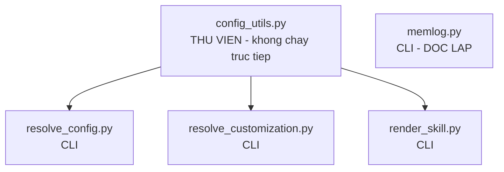
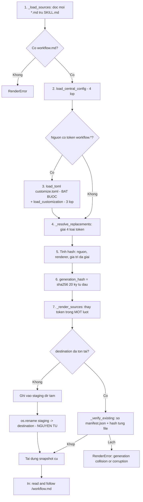

# A4 — Script dùng chung (`_bmad/scripts/`)

> [← Chỉ mục](./index.md) · Trước: [A3](./A3-cau-hinh-va-tuy-bien.md) · Tiếp: [A5 — Giao thức kích hoạt](./A5-giao-thuc-kich-hoat.md)

---

## 1. Tổng quan

Năm file Python trong `src/scripts/` được cài vào `_bmad/scripts/`. Chúng là **tầng tất định** của BMad: mọi việc LLM không đáng tin đều được đẩy xuống đây.



| Script | Dòng | Python tối thiểu | Phụ thuộc | Vai trò |
| --- | --- | --- | --- | --- |
| `config_utils.py` | 119 | 3.11 (`tomllib`) | — | Thư viện: nạp TOML + hợp nhất cấu trúc |
| `resolve_config.py` | 74 | 3.11 | `config_utils` | Hợp nhất **4 lớp** cấu hình trung tâm → JSON |
| `resolve_customization.py` | 99 | 3.11 | `config_utils` | Hợp nhất **3 lớp** tùy biến skill → JSON |
| `render_skill.py` | 401 | 3.11 | `config_utils` | Kết xuất workflow thành snapshot bất biến |
| `memlog.py` | 224 | **3.8** | *(không có)* | Nhật ký phiên chỉ-nối-thêm |

> `memlog.py` cố ý **không** phụ thuộc `config_utils` và chỉ cần Python 3.8 — để chạy được ở môi trường tối thiểu nhất.

Tất cả đều chạy qua `uv`:

```bash
uv run <đường/dẫn/script.py> <đối số>
```

---

## 2. `config_utils.py` — thư viện nền

Không chạy trực tiếp. Cung cấp 6 hàm:

| Hàm | Chức năng |
| --- | --- |
| `load_toml(path, required=False)` | Nạp một file TOML. Thiếu + `required=True` ⇒ `ConfigError`. Không phải file ⇒ lỗi. Parse lỗi ⇒ lỗi kèm vị trí |
| `_detect_keyed_merge_field(items)` | Phát hiện mảng bảng có khóa `code` hoặc `id` |
| `_merge_arrays(base, override)` | Nối hoặc thay theo khóa |
| `structural_merge(base, override)` | Hợp nhất đệ quy — xem [A3 §3](./A3-cau-hinh-va-tuy-bien.md#3-ba-quy-tắc-hợp-nhất) |
| `merge_layers(layers)` | Hợp nhất tuần tự nhiều lớp |
| `load_central_config(project_root)` | 4 lớp cấu hình trung tâm |
| `load_customization(project_root, skill_dir)` | 3 lớp tùy biến skill |

### 2.1 `load_central_config` — 4 lớp

```python
def load_central_config(project_root: Path) -> dict[str, Any]:
    bmad_dir = project_root / "_bmad"
    return merge_layers((
        load_toml(bmad_dir / "config.toml", required=True),      # BẮT BUỘC có
        load_toml(bmad_dir / "config.user.toml"),                # tùy chọn
        load_toml(bmad_dir / "custom" / "config.toml"),          # tùy chọn
        load_toml(bmad_dir / "custom" / "config.user.toml"),     # tùy chọn
    ))
```

> Chỉ lớp 1 là bắt buộc. Thiếu ⇒ `ConfigError: required TOML file not found` ⇒ nghĩa là BMad chưa được cài.

### 2.2 `load_customization` — 3 lớp

```python
def load_customization(project_root, skill_dir) -> dict[str, Any]:
    skill_name = skill_dir.name                      # "bmad-review"
    custom_dir = project_root / "_bmad" / "custom" if project_root else None
    return merge_layers((
        load_toml(skill_dir / "customize.toml", required=True),
        load_toml(custom_dir / f"{skill_name}.toml") if custom_dir else {},
        load_toml(custom_dir / f"{skill_name}.user.toml") if custom_dir else {},
    ))
```

> `skill_dir.name` là **tên thư mục** — đây là lý do file override phải đặt tên đúng theo tên skill.

### 2.3 Ba loại lỗi `ConfigError`

| Thông báo | Nguyên nhân |
| --- | --- |
| `required TOML file not found: <path>` | Thiếu file bắt buộc |
| `TOML layer is not a file: <path>` | Đường dẫn trỏ vào thư mục |
| `failed to parse <path>: <chi tiết>` | Cú pháp TOML sai (kèm dòng/cột) |
| `failed to read <path>: <chi tiết>` | Lỗi hệ thống file |
| `TOML layer did not parse to a table` | File TOML không phải bảng ở gốc |
| `keyed array identifier 'code' must be a string, got int` | Giá trị `code` sai kiểu |
| `keyed array identifier 'code' must not be empty` | `code = ""` |

---

## 3. `resolve_config.py`

### 3.1 Cú pháp

```
uv run _bmad/scripts/resolve_config.py --project-root <PATH> [--key <DOTTED> ...]
```

| Đối số | Bắt buộc | Ý nghĩa |
| --- | --- | --- |
| `--project-root`, `-p` | ✅ | Đường dẫn tuyệt đối tới thư mục chứa `_bmad/` |
| `--key`, `-k` | ❌ | Đường dẫn khóa dạng chấm, **lặp lại được**. Bỏ trống ⇒ đổ toàn bộ |

### 3.2 Ví dụ chạy

**Đổ toàn bộ:**

```bash
uv run _bmad/scripts/resolve_config.py --project-root "$(pwd)"
```

```json
{
  "core": {
    "project_name": "he-thong-quan-ly-kho",
    "document_output_language": "Vietnamese",
    "output_folder": "D:/du-an/_bmad-output",
    "user_name": "Thảo",
    "communication_language": "Vietnamese"
  },
  "modules": {
    "bmm": {
      "planning_artifacts": "D:/du-an/_bmad-output/planning-artifacts",
      "implementation_artifacts": "D:/du-an/_bmad-output/implementation-artifacts",
      "project_knowledge": "D:/du-an/docs",
      "user_skill_level": "expert"
    }
  },
  "agents": {
    "bmad-agent-analyst": { "module": "bmm", "name": "Mary", "title": "Business Analyst", "icon": "📊", "..." : "..." },
    "bmad-agent-dev":     { "module": "bmm", "name": "Amelia", "title": "Senior Software Engineer", "icon": "💻", "...": "..." }
  }
}
```

**Chỉ lấy mục `core`:**

```bash
uv run _bmad/scripts/resolve_config.py --project-root "$(pwd)" --key core
```

**Lấy nhiều mục cùng lúc:**

```bash
uv run _bmad/scripts/resolve_config.py --project-root "$(pwd)" --key core --key agents
```

**Lấy một giá trị cụ thể:**

```bash
uv run _bmad/scripts/resolve_config.py --project-root "$(pwd)" --key core.user_name
```

```json
{
  "core.user_name": "Thảo"
}
```

### 3.3 Hành vi khi khóa không tồn tại

Khóa không tồn tại **bị bỏ qua im lặng** — không lỗi, chỉ không xuất hiện trong JSON:

```bash
uv run _bmad/scripts/resolve_config.py --project-root "$(pwd)" --key core.khong_ton_tai
```

```json
{}
```

Đây là lý do các `SKILL.md` luôn viết *"missing keys take neutral defaults, never block"*.

### 3.4 Mã thoát

| Mã | Nghĩa |
| --- | --- |
| 0 | Thành công |
| 1 | `ConfigError` — in thông báo ra stderr |
| 3 | Thiếu Python 3.11 (`tomllib` không có) |

---

## 4. `resolve_customization.py`

### 4.1 Cú pháp

```
uv run _bmad/scripts/resolve_customization.py --skill <SKILL_DIR> [--project-root <PATH>] [--key <DOTTED> ...]
```

| Đối số | Bắt buộc | Ý nghĩa |
| --- | --- | --- |
| `--skill`, `-s` | ✅ | Đường dẫn tuyệt đối tới **thư mục skill** (nơi có `customize.toml`) |
| `--project-root`, `-p` | ❌ nhưng **nên có** | Thư mục chứa `_bmad/` |
| `--key`, `-k` | ❌ | Đường dẫn khóa dạng chấm, lặp lại được |

### 4.2 Tự tìm project root khi không truyền

```python
def find_project_root(start: Path) -> Path | None:
    current = start.resolve()
    while True:
        if (current / "_bmad").exists() or (current / ".git").exists():
            return current
        if current.parent == current:
            return None
        current = current.parent
```

Đi ngược lên cây thư mục cho tới khi gặp `_bmad/` **hoặc** `.git/`. Thứ tự thử: từ `skill_dir`, rồi từ `cwd`.

> **Cạm bẫy:** nếu skill nằm trong `.claude/skills/` của một repo con, `.git` của repo con có thể bị nhận nhầm làm project root. Vì vậy tài liệu khuyên **luôn truyền `--project-root` tường minh**.

### 4.3 Ví dụ chạy

```bash
SKILL="$(pwd)/.claude/skills/bmad-review"

# Toàn bộ (3 lớp đã hợp nhất)
uv run _bmad/scripts/resolve_customization.py --skill "$SKILL" --project-root "$(pwd)"

# Chỉ mục [workflow] — đây là cách mọi SKILL.md gọi
uv run _bmad/scripts/resolve_customization.py --skill "$SKILL" --project-root "$(pwd)" --key workflow

# Một trường cụ thể
uv run _bmad/scripts/resolve_customization.py --skill "$SKILL" --project-root "$(pwd)" --key workflow.style_guide

# Với agent persona (module bmm)
uv run _bmad/scripts/resolve_customization.py \
  --skill "$(pwd)/.claude/skills/bmad-agent-dev" --project-root "$(pwd)" --key agent
```

### 4.4 Đầu ra mẫu

```bash
uv run _bmad/scripts/resolve_customization.py --skill "$SKILL" --project-root "$(pwd)" --key workflow.lenses
```

```json
{
  "workflow.lenses": [
    {
      "code": "adversarial",
      "name": "Adversarial",
      "applies_to": "any",
      "when": "always",
      "instruction": "Load `references/lens-adversarial.md` from the skill root and follow it."
    },
    {
      "code": "edge-case-hunter",
      "name": "Edge-Case Hunter",
      "applies_to": "any",
      "when": "Content with behavior to trace: code, diffs, and the specs, requirements, plans, and stories that define behavior. Skip for prose documents with no behavioral surface.",
      "instruction": "Load `references/lens-edge-case-hunter.md` from the skill root and follow it."
    }
  ]
}
```

### 4.5 Xử lý encoding

Script gọi `sys.stdout.reconfigure(encoding="utf-8")` trước khi ghi, và dùng `ensure_ascii=False` — nên emoji và tiếng Việt hiển thị đúng, kể cả trên Windows console.

---

## 5. `render_skill.py`

### 5.1 Cú pháp

```
uv run --no-cache _bmad/scripts/render_skill.py --project-root <PATH> --skill <SKILL_DIR>
```

> `--no-cache` là cờ của **`uv`**, không phải của script. Nó bảo `uv` không cache môi trường — cần thiết vì hash của chính script tham gia vào `generation_hash`.

### 5.2 Chỉ áp dụng cho skill khuôn mẫu C

Skill phải có `workflow.md`. **Không skill core nào** dùng script này — nó dành cho `bmad-build` và `bmad-build-auto` của module bmm.

Nếu chạy với skill core:

```
HALT: render entry is missing: .../bmad-review/workflow.md
```

### 5.3 Luồng bên trong



### 5.4 Bốn loại token

| Token | Nguồn | Ví dụ |
| --- | --- | --- |
| `{{config.<đường.dẫn>}}` | Cấu hình trung tâm, đường dẫn đầy đủ | `{{config.modules.bmm.planning_artifacts}}` |
| `{{.<khóa>}}` | Tra cứu ngắn, tìm đệ quy — **phải duy nhất** | `{{.communication_language}}` |
| `{workflow.<trường>}` | Tùy biến đã hợp nhất | `{workflow.persistent_facts}` |
| `[[bmad-snapshot:<file>.md]]` | Đường dẫn tuyệt đối trong snapshot | `[[bmad-snapshot:step-02-plan.md]]` |

### 5.5 Định dạng giá trị khi chèn

Renderer chọn cách định dạng theo **kiểu của giá trị mặc định** trong `customize.toml`:

| Kiểu mặc định | Hàm | Kết quả |
| --- | --- | --- |
| `str` | — | Chuỗi nguyên văn |
| `list[str]` | `_format_markdown_list` | `- mục 1`\n`- mục 2`, hoặc `_None._` nếu rỗng |
| `list[dict]` có `id` | `_format_review_layers` | Khối `#### Tên (id)` + "Run only when: …" + instruction |

Ví dụ với `persistent_facts = []`:

```markdown
### Step 2: Load Persistent Facts

Treat every entry below as foundational context ... (`_None._` means none):

_None._
```

LLM đọc `_None._` và biết bỏ qua bước. Đây là cách renderer xử lý "danh sách rỗng" mà không cần logic điều kiện trong văn bản.

### 5.6 Chống thay thế đệ quy

`_render_sources` xây **một** regex gộp mọi token rồi thay thế trong **một lượt duy nhất**:

```python
patterns = [
    *(re.escape(token) for token in sorted(replacements, key=len, reverse=True)),
    _SNAPSHOT_TOKEN.pattern,
]
token_pattern = re.compile("|".join(patterns))
```

Sắp xếp theo độ dài giảm dần để token dài khớp trước token ngắn. Văn bản được chèn vào **không bao giờ** bị quét lại — nên một `persistent_facts` chứa chuỗi `{{.user_name}}` không gây thay thế ngoài ý muốn.

### 5.7 Đường dẫn kết quả

```
_bmad/render/<skill-name>/<project-slug>-<root-hash-12>/<generation-hash-20>/
├── manifest.json
├── workflow.md
├── step-01-clarify-and-route.md
└── ...
```

### 5.8 Nội dung `manifest.json`

```json
{
  "schema_version": 1,
  "skill": "bmad-build",
  "project_root": "D:/du-an",
  "project_slug": "du-an",
  "root_hash": "a1b2c3d4e5f6",
  "generation_hash": "0123456789abcdef0123",
  "inputs": {
    "project_root": "D:/du-an",
    "renderer_sha256": "…",
    "resolved_values": { "config.core.user_name": "Thảo", "…": "…" },
    "source_sha256": { "workflow.md": "…", "step-01-clarify-and-route.md": "…" }
  },
  "outputs": {
    "workflow.md": "<sha256 sau khi kết xuất>",
    "step-01-clarify-and-route.md": "<sha256>"
  }
}
```

### 5.9 Đầu ra và mã thoát

| Kết quả | stdout | Mã thoát |
| --- | --- | --- |
| Thành công | `read and follow D:/du-an/_bmad/render/.../workflow.md` | 0 |
| Thất bại | `HALT: <lý do>` | 1 |

Danh sách lỗi `HALT` xem [03 §11.3](../tai-lieu-he-thong/03-van-hanh-he-thong.md#113-lỗi-kết-xuất).

---

## 6. `memlog.py`

### 6.1 Memlog là gì

Trích chính docstring của script:

> *A memlog is the dense, chronological record of everything that mattered in a piece of work — every item the user generated or accepted — kept minimal like human memory: only what's important, never bloated. It persists ACROSS sessions... It is NOT a deliverable; downstream artifacts (a brief, a PRD, a deck, a report) are derived from it on demand.*

### 6.2 Ba bất biến

| # | Bất biến | Thực thi trong mã |
| --- | --- | --- |
| 1 | **Chỉ nối thêm, theo thời gian** | Không có subcommand `edit`/`delete`; `cmd_append` luôn ghi vào cuối `body` |
| 2 | **Chỉ ghi / mù** | Mỗi lệnh nguyên tử, echo trạng thái mới dạng JSON một dòng qua `ack()` |
| 3 | **Không có trạng thái vòng đời** | "Xong" là sự kiện ⇒ ghi thành mục `--type event`, không phải trường frontmatter |

> Ghi chú: `cmd_set` **cho phép** đặt trường frontmatter, và một số skill (ví dụ `bmad-brainstorming`, `bmad-forge-idea`) dùng nó để lật `status: complete`. Đó là lựa chọn của skill chủ, không phải yêu cầu của memlog.

### 6.3 Ba lệnh

#### `init` — tạo memlog

```
uv run _bmad/scripts/memlog.py init (--workspace DIR | --path FILE) [--field k=v ...]
```

```bash
uv run _bmad/scripts/memlog.py init \
  --workspace "_bmad-output/brainstorming/brainstorm-onboarding-2026-08-11" \
  --field topic="Luồng onboarding cho app ngân sách" \
  --field goal="Tăng giữ chân tuần đầu" \
  --field mode="partner"
```

Kết quả:

```json
{"ok": true, "memlog": "_bmad-output/.../.memlog.md", "entries": 0}
```

File tạo ra:

```markdown
---
topic: Luồng onboarding cho app ngân sách
goal: Tăng giữ chân tuần đầu
mode: partner
updated: 2026-08-11T14:22
---


```

> Chạy `init` khi file đã tồn tại ⇒ lỗi mã thoát **2**: `error: <path> already exists; use append/set to update it`.

#### `append` — thêm một mục

```
uv run _bmad/scripts/memlog.py append (--workspace DIR | --path FILE) --text STR [--type T] [--by W]
```

```bash
W="_bmad-output/brainstorming/brainstorm-onboarding-2026-08-11"

uv run _bmad/scripts/memlog.py append --workspace "$W" \
  --type technique --text "started SCAMPER"

uv run _bmad/scripts/memlog.py append --workspace "$W" \
  --type idea --by user \
  --text "bỏ tường đăng ký: cho người dùng thử với dữ liệu mẫu trước"

uv run _bmad/scripts/memlog.py append --workspace "$W" \
  --type decision \
  --text "dẫn đầu bằng một tài khoản đã phân loại sẵn; hoãn import nhiều tài khoản"
```

Kết quả file:

```markdown
---
topic: Luồng onboarding cho app ngân sách
goal: Tăng giữ chân tuần đầu
mode: partner
updated: 2026-08-11T14:31
---

- (technique) started SCAMPER
- (idea by user) bỏ tường đăng ký: cho người dùng thử với dữ liệu mẫu trước
- (decision) dẫn đầu bằng một tài khoản đã phân loại sẵn; hoãn import nhiều tài khoản
```

#### `set` — đặt trường frontmatter

```
uv run _bmad/scripts/memlog.py set (--workspace DIR | --path FILE) --key K --value V
```

```bash
uv run _bmad/scripts/memlog.py set --workspace "$W" --key status --value complete
```

### 6.4 Hai cách địa chỉ hóa

| Cờ | Ý nghĩa |
| --- | --- |
| `--workspace DIR` | Thư mục chạy; memlog **luôn** là `{DIR}/.memlog.md` |
| `--path FILE` | Trỏ thẳng vào file memlog |

Hai cờ **loại trừ lẫn nhau**, và **bắt buộc phải có một trong hai**.

### 6.5 Cách text được chuẩn hóa

```python
text = " ".join(args.text.split())   # gộp mọi xuống dòng và khoảng trắng thừa → một dòng
```

Bạn không thể tạo mục nhiều dòng — đó là **thiết kế**: memlog là log phẳng, một mục một dòng.

### 6.6 Cách nhãn được dựng

```python
label = args.type or ""
if args.by:
    label = f"{label} by {args.by}".strip()
tag = f"({label}) " if label else ""
entry = f"- {tag}{text}"
```

| `--type` | `--by` | Nhãn hiển thị |
| --- | --- | --- |
| `idea` | *(không)* | `(idea) ` |
| `idea` | `user` | `(idea by user) ` |
| *(không)* | `coach` | `(by coach) ` |
| *(không)* | *(không)* | *(không có nhãn)* |

### 6.7 Ghi nguyên tử

```python
def write_atomic(path: Path, text: str) -> None:
    tmp = path.with_suffix(path.suffix + ".tmp")
    with open(tmp, "w", encoding="utf-8") as f:
        f.write(text)
        f.flush()
        os.fsync(f.fileno())
    os.replace(tmp, path)
```

Mất điện giữa chừng ⇒ file gốc còn nguyên, chỉ dư một file `.tmp`.

### 6.8 Xử lý frontmatter an toàn

Hai chi tiết đáng chú ý:

1. **Fence đóng** là dòng **đúng bằng** `---` — nên `---` xuất hiện *bên trong* giá trị `topic`/`goal` (văn bản tự do của người dùng) không cắt cụt frontmatter.
2. **Giá trị nhiều dòng bị vô hiệu hóa xuống dòng** khi render: `' '.join(str(v).splitlines())` — nên một giá trị nhiều dòng không phá vỡ fence khi đọc lại.

### 6.9 Từ vựng `--type` các skill core dùng

| Skill | Các `--type` |
| --- | --- |
| `bmad-brainstorming` | `idea`, `insight`, `question`, `decision`, `direction`, `technique` |
| `bmad-forge-idea` | `decision`, `assumption`, `crack`, `kill`, `direction`, `lock`, `note` |
| `bmad-deep-recon` | `decision`, `source`, `claim`, `assumption`, `question`, `event` |
| `bmad-party-mode` | tự do (xem `references/party-memory.md`) |

Script **không** áp đặt từ vựng — mỗi skill tự định nghĩa.

---

## 7. Bảng lệnh tổng hợp

```bash
R="$(pwd)"

# ── Cấu hình trung tâm (4 lớp) ────────────────────────────────
uv run "$R/_bmad/scripts/resolve_config.py" -p "$R"
uv run "$R/_bmad/scripts/resolve_config.py" -p "$R" -k core
uv run "$R/_bmad/scripts/resolve_config.py" -p "$R" -k core -k agents
uv run "$R/_bmad/scripts/resolve_config.py" -p "$R" -k core.user_name

# ── Tùy biến skill (3 lớp) ────────────────────────────────────
S="$R/.claude/skills/bmad-review"
uv run "$R/_bmad/scripts/resolve_customization.py" -s "$S" -p "$R"
uv run "$R/_bmad/scripts/resolve_customization.py" -s "$S" -p "$R" -k workflow
uv run "$R/_bmad/scripts/resolve_customization.py" -s "$S" -p "$R" -k workflow.lenses

# ── Kết xuất workflow (chỉ skill có workflow.md) ──────────────
uv run --no-cache "$R/_bmad/scripts/render_skill.py" \
  --project-root "$R" --skill "$R/.claude/skills/bmad-build"

# ── Memlog ────────────────────────────────────────────────────
W="$R/_bmad-output/thu-nghiem"
uv run "$R/_bmad/scripts/memlog.py" init   --workspace "$W" --field topic="Thử" --field goal="Học"
uv run "$R/_bmad/scripts/memlog.py" append --workspace "$W" --type note --text "mục đầu tiên"
uv run "$R/_bmad/scripts/memlog.py" append --workspace "$W" --type idea --by user --text "ý tưởng của tôi"
uv run "$R/_bmad/scripts/memlog.py" set    --workspace "$W" --key status --value complete
cat "$W/.memlog.md"
```

---

## 8. Script riêng của từng skill core

Chạy từ `{skill-root}/scripts/`, **không** phải `_bmad/scripts/`.

```bash
SK="$(pwd)/.claude/skills"

# bmad-advanced-elicitation — phục vụ catalog phương pháp
uv run "$SK/bmad-advanced-elicitation/scripts/pick_methods.py" \
  --file "$SK/bmad-advanced-elicitation/assets/methods.csv" categories
uv run "$SK/bmad-advanced-elicitation/scripts/pick_methods.py" \
  --file "$SK/bmad-advanced-elicitation/assets/methods.csv" list --category risk
uv run "$SK/bmad-advanced-elicitation/scripts/pick_methods.py" \
  --file "$SK/bmad-advanced-elicitation/assets/methods.csv" random -n 5 --spread

# bmad-brainstorming — thư viện kỹ thuật + sinh trang chọn
uv run "$SK/bmad-brainstorming/scripts/brain.py" \
  --file "$SK/bmad-brainstorming/assets/brain-methods.csv" list --category "structured"
uv run "$SK/bmad-brainstorming/scripts/brain.py" \
  --file "$SK/bmad-brainstorming/assets/brain-methods.csv" html --out /tmp/selector.html

# bmad-customize — quét skill tùy biến được
uv run "$SK/bmad-customize/scripts/list_customizable_skills.py" --project-root "$(pwd)"

# bmad-party-mode — phân giải roster
uv run "$SK/bmad-party-mode/scripts/resolve_party.py" \
  --project-root "$(pwd)" --skill "$SK/bmad-party-mode"
uv run "$SK/bmad-party-mode/scripts/resolve_party.py" \
  --project-root "$(pwd)" --skill "$SK/bmad-party-mode" --list-groups

# bmad-forge-idea — phân giải persona
uv run "$SK/bmad-forge-idea/scripts/resolve_personas.py" \
  --project-root "$(pwd)" --skill "$SK/bmad-forge-idea"

# bmad-deep-recon — đếm claim từ memlog
uv run "$SK/bmad-deep-recon/scripts/recon_kit.py" tally <workspace>/.memlog.md

# bmad-review — đo chỉ số văn bản
uv run "$SK/bmad-review/scripts/word_metrics.py" <file.md>
```

> Mọi script đều hỗ trợ `--help`. Khi không chắc cú pháp, chạy `--help` trước.

---

**Tiếp:** [A5 — Giao thức kích hoạt chung](./A5-giao-thuc-kich-hoat.md) · [← Chỉ mục](./index.md)
