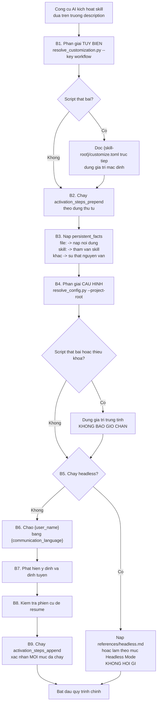

# A5 — Giao thức kích hoạt chung

> [← Chỉ mục](./index.md) · Trước: [A4](./A4-script-dung-chung.md) · Tiếp: [B1 — bmad-help](./B1-bmad-help.md)

---

## 1. Mọi skill core đều theo cùng một khung

Đọc 8 file `SKILL.md` của core, bạn sẽ thấy mục `## On Activation` gần như giống hệt nhau. Đây là **giao thức chung** — hiểu nó một lần là hiểu cả 8 skill.



---

## 2. Bảng đối chiếu 8 skill core

| Bước | help | elicit | review | customize | brainstorm | recon | forge | party |
| --- | :-: | :-: | :-: | :-: | :-: | :-: | :-: | :-: |
| B1. Phân giải tùy biến | — | ✅ | ✅ | — | ✅ | ✅ | ✅ | ✅ |
| B2. `activation_steps_prepend` | — | — | ✅ | — | ✅ | ✅ | ✅ | ✅ |
| B3. `persistent_facts` | — | — | ✅ | — | ✅ | ✅ | ✅ | ✅ |
| B4. Phân giải cấu hình | ✅ | ✅¹ | — | ✅² | ✅ | ✅ | ✅ | ✅ |
| B5. Chế độ headless | — | — | — | — | ✅ | ✅ | — | — |
| B6. Chào người dùng | — | — | — | ✅ | ✅ | ✅ | ✅ | ✅ |
| B7. Phát hiện ý định | ✅ | — | ✅ | ✅ | — | ✅ | ✅ | ✅ |
| B8. Resume phiên cũ | — | — | — | — | ✅ | ✅ | ✅ | — |
| B9. `activation_steps_append` | — | — | ✅³ | — | ✅ | ✅ | ✅ | ✅ |

¹ Chỉ khi cần casting persona — gọi `resolve_config.py --key agents`
² Đọc trực tiếp `config.toml` và `config.user.toml`, không qua resolver
³ Chạy sau khi công bố kế hoạch lens, trước khi lens chạy

---

## 3. Bước 1 — Phân giải tùy biến

### 3.1 Lệnh chuẩn

```
uv run {project-root}/_bmad/scripts/resolve_customization.py --skill {skill-root} --key workflow
```

### 3.2 Fallback bắt buộc

**Mọi** skill đều mô tả điều gì xảy ra khi script chết. Ba biến thể:

| Skill | Fallback |
| --- | --- |
| `bmad-review` | *"On failure, read `{skill-root}/customize.toml` directly and use defaults."* |
| `bmad-brainstorming` | *"On failure, use a subagent to read `{skill-root}/customize.toml` directly with defaults."* |
| `bmad-agent-dev` (bmm) | Mô tả **đầy đủ quy tắc hợp nhất** để LLM tự làm 3 lớp bằng tay |

Bản đầy đủ nhất (từ `bmad-agent-dev/SKILL.md`) — đáng đọc vì nó là **đặc tả bằng lời** của thuật toán trong `config_utils.py`:

> **If the script fails**, resolve the `agent` block yourself by reading these three files in base → team → user order and applying the same structural merge rules as the resolver:
>
> 1. `{skill-root}/customize.toml` — defaults
> 2. `{project-root}/_bmad/custom/{skill-name}.toml` — team overrides
> 3. `{project-root}/_bmad/custom/{skill-name}.user.toml` — personal overrides
>
> Any missing file is skipped. Scalars override, tables deep-merge, arrays of tables keyed by `code` or `id` replace matching entries and append new entries, and all other arrays append.

### 3.3 Kích hoạt được chuyển tiếp (forwarded activation)

Ba skill hỗ trợ nhận **giá trị đã phân giải sẵn** từ bên gọi:

| Skill | Ai chuyển tiếp | Hành vi |
| --- | --- | --- |
| `bmad-review` | Các shim `bmad-editorial-review*`, `bmad-review-*` | Tôn trọng **nguyên văn** các trường được nêu tên; chỉ tự phân giải phần còn lại |
| `bmad-deep-recon` | Shim nghiên cứu cũ, menu của Mary | Bỏ qua suy luận cho các giá trị đã cho |
| `bmad-advanced-elicitation` | Bất kỳ skill nào gọi nó ở điểm dừng | Nhận target chỉ định thay vì dùng output gần nhất |

Trích `bmad-review/SKILL.md`:

> *if a caller invoked you with pre-resolved customization fields (e.g. the `bmad-editorial-review` shim), honor them verbatim for those named fields — they already carry the user's overrides — and resolve only the remaining fields from your own `customize.toml`.*

---

## 4. Bước 3 — `persistent_facts`

### 4.1 Ba tiền tố

| Tiền tố | Xử lý |
| --- | --- |
| `file:` | Đường dẫn hoặc **glob** dưới `{project-root}` — nạp nội dung file, coi là sự thật |
| `skill:` | Tên một skill cần tham vấn |
| *(không có)* | Câu chữ nguyên văn |

### 4.2 Giá trị mặc định phổ biến

Bốn skill core (`brainstorming`, `forge-idea`, `party-mode`, `review`) đều mặc định:

```toml
persistent_facts = [
  "file:{project-root}/**/project-context.md",
]
```

Glob `**` quét **toàn dự án**. Nghĩa là nếu `bmad-project-context` đã sinh ra file `project-context.md` ở bất kỳ đâu, mọi skill này tự nạp nó — agent hiểu ngữ cảnh dự án mà không cần bạn nhắc lại.

Chú thích trong `bmad-review/customize.toml` cảnh báo về chi phí:

> *The shipped entry is a project-wide glob — set it to `[]` if you don't want every review scanning for it.*

### 4.3 Ví dụ nạp gì

Giả sử `persistent_facts` sau khi hợp nhất là:

```toml
persistent_facts = [
  "file:{project-root}/**/project-context.md",
  "file:{project-root}/docs/coding-standards.md",
  "Tổ chức chỉ dùng AWS — đừng đề xuất GCP hay Azure.",
  "skill:bmad-help",
]
```

LLM sẽ:

1. Glob `D:/du-an/**/project-context.md` → nạp nội dung mọi file khớp
2. Nạp `D:/du-an/docs/coding-standards.md`
3. Ghi nhớ nguyên văn câu về AWS
4. Biết rằng có thể tham vấn `bmad-help`

Tất cả giữ trong ngữ cảnh **suốt phiên**.

---

## 5. Bước 4 — Phân giải cấu hình

### 5.1 Lệnh chuẩn

```
uv run {project-root}/_bmad/scripts/resolve_config.py --project-root {project-root} [--key core]
```

### 5.2 Giá trị mỗi skill lấy

| Skill | Khóa cần | Dùng làm gì |
| --- | --- | --- |
| `bmad-help` | `core.communication_language`, `modules.bmm.project_knowledge` | Ngôn ngữ + ngữ cảnh nền |
| `bmad-brainstorming` | `user_name`, `communication_language`, `document_output_language`, `output_folder`, `project_name` | Chào, ngôn ngữ, nơi lưu |
| `bmad-deep-recon` | thêm `modules.bmm.planning_artifacts` | Nơi lưu nghiên cứu |
| `bmad-forge-idea` | `user_name`, `communication_language`, `output_folder` | Chào, ngôn ngữ, nơi lưu |
| `bmad-party-mode` | `user_name`, `communication_language`, `output_folder` | Chào, ngôn ngữ, nơi lưu keepsake |
| `bmad-advanced-elicitation` | `agents` (chỉ khi cần casting) | Roster nhân vật |
| `bmad-customize` | `user_name`, `communication_language` | Chào (đọc file trực tiếp, không qua resolver) |

### 5.3 Xử lý thiếu — quy tắc chung

Câu chuẩn xuất hiện trong nhiều SKILL.md:

> *On failure or missing values → neutral defaults; never block.*

`bmad-deep-recon` nói rõ hơn về trường hợp cài chỉ có core:

> *`{planning_artifacts}` (under `modules.bmm`; **absent on core-only installs** → `{output_folder}`)*

Nghĩa là core được thiết kế để chạy **độc lập**, không phụ thuộc bmm.

### 5.4 Cạm bẫy đường dẫn kép

Trích `bmad-deep-recon/SKILL.md`:

> *Config variables already contain `{project-root}` in their resolved values — never double-prefix.*

Vì `module.yaml` có `result: "{project-root}/{value}"`, giá trị trong `config.toml` **đã là đường dẫn tuyệt đối**. Ghép thêm `{project-root}` một lần nữa sẽ ra đường dẫn sai.

```
SAI:   {project-root}/{output_folder}/forge  →  D:/du-an/D:/du-an/_bmad-output/forge
ĐÚNG:  {output_folder}/forge                 →  D:/du-an/_bmad-output/forge
```

---

## 6. Bước 5 — Chế độ headless

### 6.1 Headless là gì

**Tín hiệu từ máy, không phải người hỏi.** Skill được gọi bởi một skill khác hoặc một quy trình tự động, không có ai để hỏi.

### 6.2 Hai skill core hỗ trợ

| Skill | Nơi mô tả | Đặc điểm |
| --- | --- | --- |
| `bmad-brainstorming` | `references/headless.md` — **chỉ nạp khi headless**, tuyệt đối không nạp lúc khác | Liệt kê tín hiệu nhận biết |
| `bmad-deep-recon` | Mục `## Headless Mode` ngay trong `SKILL.md` | Trả JSON có cấu trúc |

### 6.3 Quy tắc chung của headless

| Quy tắc | Nội dung |
| --- | --- |
| Không hỏi | *"When invoked headless, do not ask."* |
| Mặc định hợp lý | Recon: research trần ⇒ `run`; có tên báo cáo ⇒ `process`; xin prompt ⇒ `draft` |
| Bỏ checkpoint | Không dừng chờ người |
| Ghi mọi phán đoán | Log thành `assumption` trong memlog |
| Chỉ dừng khi không suy ra được | Recon: `blocked` chỉ khi không suy ra được chủ đề hoặc thư mục đích |
| Kết thúc bằng JSON | Để bên gọi phân tích được |

### 6.4 Lược đồ JSON kết thúc của deep-recon

```json
{
  "status": "complete",
  "intent": "run",
  "type": "market",
  "report": "{doc_workspace}/research.md",
  "memlog": "{doc_workspace}/.memlog.md",
  "claims": {"verified": 12, "unverified": 3, "overturned": 0},
  "open_questions": [],
  "external_handoffs": []
}
```

Ràng buộc quan trọng:

> *the `claims` counts come from `uv run scripts/recon_kit.py tally {doc_workspace}/.memlog.md`, **never hand-counted**.*

Đây là nguyên lý P1 (tất định hóa) áp dụng ở mức chi tiết nhất: ngay cả việc **đếm** cũng không giao cho LLM.

---

## 7. Bước 6 — Chào người dùng

### 7.1 Ba yêu cầu

| Yêu cầu | Nguồn |
| --- | --- |
| Dùng `{user_name}` | `core.user_name` |
| Nói bằng `{communication_language}` và **giữ suốt phiên** | `core.communication_language` |
| Nhắc `bmad-help` luôn sẵn sàng | Quy ước |

Trích `bmad-forge-idea/SKILL.md`:

> *Greet `{user_name}` in `{communication_language}` and **stay in it**.*

Trích `bmad-deep-recon/SKILL.md`:

> *greet `{user_name}` in `{communication_language}` — and **stay in it every turn**.*

Nhấn mạnh "stay in it" vì LLM có xu hướng trôi về tiếng Anh sau vài lượt.

### 7.2 Với agent persona (bmm)

Thêm hai yêu cầu:

- Mở đầu lời chào bằng `{agent.icon}`
- **Tiền tố mọi tin nhắn** bằng `{agent.icon}` suốt phiên, để nhìn là biết ai đang nói

### 7.3 Nhắc skill khả dụng

`bmad-brainstorming` có quy tắc tinh tế:

> *Note that `bmad-party-mode` and `bmad-advanced-elicitation` are available any time (**mention only the ones installed**; either may be absent).*

Nghĩa là phải kiểm tra thực tế trước khi nhắc — không quảng cáo thứ không có.

---

## 8. Bước 8 — Resume phiên cũ

### 8.1 Ba skill hỗ trợ

| Skill | Cách tìm | Điều kiện offer resume |
| --- | --- | --- |
| `bmad-brainstorming` | Glob `{workflow.output_dir}/*/.memlog.md` | `status` **không phải** `complete` |
| `bmad-forge-idea` | Glob `{workflow.forge_output_path}/**/.memlog.md` (đệ quy) | `status` không phải `complete` |
| `bmad-deep-recon` | Kiểm tra thư mục chạy đã tồn tại dưới `{workflow.research_output_path}` | Brief chờ báo cáo, hoặc báo cáo chờ refresh |

### 8.2 Quy tắc đọc frontmatter trước

Cả `brainstorming` và `forge-idea` đều nhấn mạnh: **chỉ đọc frontmatter** khi quét:

> *read only each match's frontmatter to find any whose `status` is not `complete`*

Chỉ khi người dùng chọn resume mới đọc **toàn bộ** memlog **một lần** để dựng lại trạng thái, rồi tiếp tục chỉ-nối-thêm.

Lý do: quét 20 phiên cũ mà đọc hết nội dung sẽ nổ ngữ cảnh.

### 8.3 Vì sao `forge-idea` dùng glob đệ quy

Chú thích trong SKILL.md nói rõ:

> *glob `{workflow.forge_output_path}/**/.memlog.md` (recursive, so it still finds sessions when `run_folder_pattern` is overridden to nest paths)*

Người dùng có thể override `run_folder_pattern` thành `{date}/{slug}` — glob một cấp sẽ không tìm thấy.

---

## 9. Bước 9 — `activation_steps_append` và xác nhận

Nhiều skill kết thúc kích hoạt bằng một câu **xác nhận bắt buộc**:

> *Run each `{workflow.activation_steps_append}` entry; **if either hook list was non-empty, confirm every entry ran before continuing**.*

Với agent persona:

> *Activation is complete. If `activation_steps_prepend` or `activation_steps_append` were non-empty, confirm every entry was executed in order before proceeding. **Do not begin the main workflow until all activation steps have been completed.***

Đây là bảo vệ chống việc LLM "quên" hook — hook thường mang yêu cầu tuân thủ của tổ chức nên bỏ sót là nghiêm trọng.

---

## 10. Sự khác biệt: skill core vs agent persona

| Khía cạnh | Skill core (khuôn mẫu A) | Agent persona (khuôn mẫu B) |
| --- | --- | --- |
| Mục TOML | `[workflow]` | `[agent]` |
| Số bước kích hoạt | Linh hoạt 3–9 | Cố định **8** |
| Nhập vai | Không | ✅ Bước 3 |
| Icon tiền tố | Không | ✅ Suốt phiên |
| Menu | Không | ✅ Bước 8, đánh số |
| Bám dính | Kết thúc khi xong việc | Giữ persona đến khi bị giải tán |
| Nguồn cấu hình | `resolve_config.py` | `_bmad/bmm/config.yaml` |

Chi tiết giao thức 8 bước của agent: [Tài liệu thiết kế §5.2](../tai-lieu-he-thong/02-thiet-ke-he-thong.md#52-giao-thức-kích-hoạt-agent-8-bước).

---

## 11. Tự mô phỏng kích hoạt bằng tay

Muốn hiểu chính xác skill "thấy" gì lúc kích hoạt, chạy đúng các lệnh mà `SKILL.md` yêu cầu:

```bash
R="$(pwd)"
S="$R/.claude/skills/bmad-review"

echo "=== B1. Tùy biến ==="
uv run "$R/_bmad/scripts/resolve_customization.py" --skill "$S" --project-root "$R" --key workflow

echo "=== B4. Cấu hình ==="
uv run "$R/_bmad/scripts/resolve_config.py" --project-root "$R" --key core

echo "=== B3. persistent_facts giải ra file nào? ==="
ls -1 $R/**/project-context.md 2>/dev/null || echo "(chưa có project-context.md)"
```

Đầu ra của ba lệnh này chính là **toàn bộ trạng thái** mà skill có sau khi kích hoạt. Mọi thứ sau đó là suy luận của LLM dựa trên `SKILL.md` + trạng thái này.

Xem thêm: [C1 — Sổ tay vận hành thủ công](./C1-so-tay-van-hanh-thu-cong.md).

---

**Tiếp:** [B1 — bmad-help](./B1-bmad-help.md) · [← Chỉ mục](./index.md)
