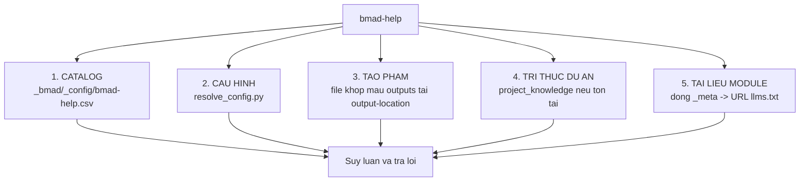
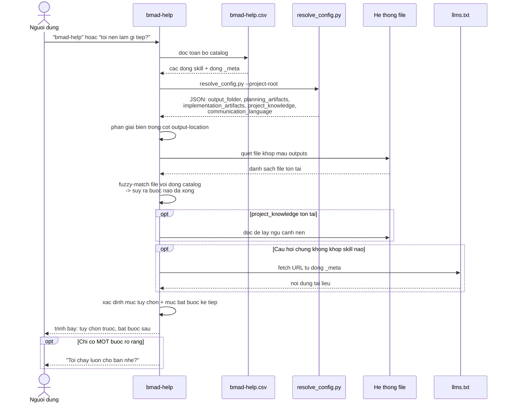

# B1 — `bmad-help`

> [← Chỉ mục](./index.md) · Trước: [A5](./A5-giao-thuc-kich-hoat.md) · Tiếp: [B2 — bmad-advanced-elicitation](./B2-bmad-advanced-elicitation.md)

---

## 1. Nhận diện nhanh

| Thuộc tính | Giá trị |
| --- | --- |
| Tên | `bmad-help` |
| Mã menu | `BH` |
| Pha | `anytime` |
| Bắt buộc | Không |
| Số file | **1** (`SKILL.md`) — skill đơn giản nhất của core |
| `customize.toml` | ❌ Không có ⇒ **không tùy biến được** |
| Script riêng | ❌ Không |
| Tạo phẩm | ❌ Không ghi file — chỉ trả lời trong chat |
| Vị trí | `src/core-skills/bmad-help/SKILL.md` |

**Frontmatter:**

```yaml
name: bmad-help
description: 'Analyzes current state and user query to answer BMad questions or recommend the next skill(s) to use. Use when user asks for help, bmad help, what to do next, or what to start with in BMad.'
```

---

## 2. Mục đích

Giúp người dùng biết **đang ở đâu** trong quy trình BMad và **làm gì tiếp**, đồng thời trả lời câu hỏi rộng hơn bằng cách bổ sung nguồn tài liệu từ xa của module.

### 2.1 Sáu kết quả mong muốn

Khi skill hoàn tất, người dùng phải:

| # | Kết quả | Nghĩa là |
| --- | --- | --- |
| 1 | **Biết đang ở đâu** | Module nào, pha nào, đã làm xong gì |
| 2 | **Biết làm gì tiếp** | Bước bắt buộc và/hoặc khuyến nghị kế tiếp, kèm lý do rõ ràng |
| 3 | **Biết gọi thế nào** | Tên skill, mã menu, ngữ cảnh action, và args để rút ngắn hội thoại |
| 4 | **Được mời chạy luôn** | Khi chỉ có một bước rõ ràng ⇒ **đề nghị chạy ngay**, không chỉ liệt kê |
| 5 | **Thấy định hướng, không ngợp** | Chỉ hiện phần liên quan tới vị trí hiện tại — **không đổ toàn bộ catalog** |
| 6 | **Được trả lời câu hỏi chung** | Khi câu hỏi không khớp skill nào ⇒ dùng tài liệu module đã đăng ký để trả lời có căn cứ |

---

## 3. Bốn nguồn dữ liệu



### 3.1 Catalog

```
{project-root}/_bmad/_config/bmad-help.csv
```

Đây là manifest gộp của **mọi** skill thuộc **mọi** module đã cài. Xem trực tiếp:

```bash
cat _bmad/_config/bmad-help.csv
```

### 3.2 Cấu hình

```bash
uv run {project-root}/_bmad/scripts/resolve_config.py --project-root {project-root}
```

Dùng JSON hợp nhất để:

- Phân giải biến trong cột `output-location` (ví dụ `{output_folder}`, `{planning_artifacts}`)
- Đọc `core.communication_language`
- Đọc `modules.bmm.project_knowledge`

> SKILL.md ghi rõ resolver hợp nhất 4 file theo thứ tự: `_bmad/config.toml`, `_bmad/config.user.toml`, `_bmad/custom/config.toml`, `_bmad/custom/config.user.toml`.

### 3.3 Tạo phẩm

File khớp mẫu ở cột `outputs`, tìm tại đường dẫn đã phân giải từ `output-location`. Sự tồn tại của chúng cho biết bước nào **có thể** đã xong; nội dung của chúng cũng cung cấp ngữ cảnh nền cho khuyến nghị.

### 3.4 Tri thức dự án

Nếu `project_knowledge` phân giải ra một đường dẫn tồn tại, đọc nó làm ngữ cảnh nền.

> Ràng buộc gắt: **"Never fabricate project-specific details."**

### 3.5 Tài liệu module

Dòng có `_meta` ở cột `skill` mang URL hoặc đường dẫn ở cột `output-location`, trỏ tới tài liệu của module (ví dụ `llms.txt`). Fetch và dùng để trả lời câu hỏi chung về module đó.

```csv
Core,_meta,,,,,,,,,false,https://docs.bmad-method.org/llms.txt,
BMad Method,_meta,,,,,,,,,false,https://docs.bmad-method.org/llms.txt,
```

---

## 4. Cách đọc catalog CSV

### 4.1 Lược đồ

```
module,skill,display-name,menu-code,description,action,args,phase,preceded-by,followed-by,required,output-location,outputs
```

### 4.2 Ngữ nghĩa cột `phase`

| Giá trị | Nghĩa |
| --- | --- |
| `anytime` | Dùng được bất kể trạng thái quy trình |
| Khác | Skill nhóm theo thư mục (`plan`, `ship`) hoặc pha đánh số (`2-planning`); chảy theo thứ tự; cách đặt tên tùy module |

### 4.3 Ngữ nghĩa cột sắp thứ tự

| Cột | Nghĩa | Định dạng |
| --- | --- | --- |
| `preceded-by` | Skill **nên** hoàn tất trước skill này | `tên-skill` hoặc `tên-skill:action` |
| `followed-by` | Skill **nên** chạy sau skill này | như trên |

> **Đây là gợi ý mềm, không phải cổng chặn.** Cột `required` mới là cổng thật.

### 4.4 Ngữ nghĩa cột `required`

| Giá trị | Nghĩa |
| --- | --- |
| `true` | **Phải hoàn tất** trước khi người dùng có thể tiến sang pha sau một cách có ý nghĩa |
| `false` | Tùy chọn |

Quy tắc quan trọng:

> *A phase with no required items is **entirely optional** — recommend it but be clear about what's actually required next.*

### 4.5 Phát hiện đã hoàn tất

Ba cách, dùng phối hợp:

1. Tìm file khớp mẫu `outputs` tại đường dẫn `output-location` đã phân giải
2. **Fuzzy-match** file tìm được với dòng catalog
3. Người dùng nói rõ đã xong, hoặc điều đó hiển nhiên từ hội thoại hiện tại

### 4.6 Mô tả mang ngữ cảnh định tuyến

> *Descriptions carry routing context — some contain cycle info and alternate paths (e.g., "back to DS if fixes needed"). Read them as navigation hints, not just display text.*

Ví dụ thực từ `bmm/module-help.csv`:

```
bmad-retrospective ... "Optional at epic end: Review completed work lessons learned
and next epic or if major issues consider CC."
```

Chuỗi `consider CC` là gợi ý điều hướng sang `bmad-correct-course` (mã `CC`), không phải chỉ là văn bản hiển thị.

---

## 5. Định dạng câu trả lời

### 5.1 Mỗi mục khuyến nghị gồm

| Thành phần | Định dạng | Ví dụ |
| --- | --- | --- |
| Mã menu | `[MÃ]` | `[PRD]` |
| Tên hiển thị | **đậm** | **PRD** |
| Tên skill | trong backtick | `` `bmad-prd` `` |
| Ngữ cảnh action (skill đa hành động) | câu gợi ý | *"dev lets run a code review!"* |
| Mô tả | từ CSV, hoặc từ kiến thức sẵn có nếu CSV trống | |
| Args | nếu có | `[path]`, `[type]`, `-A` |

### 5.2 Thứ tự trình bày

> *Show **optional items first, then the next required item**. Make it clear which is which.*

Đây là thứ tự ngược trực giác nhưng có lý do: mục tùy chọn dễ bị bỏ qua nếu đặt sau, trong khi mục bắt buộc thì người dùng chắc chắn sẽ thấy dù ở đâu.

### 5.3 Bốn ràng buộc

| Ràng buộc | Nội dung |
| --- | --- |
| Ngôn ngữ | Trình bày mọi thứ bằng `{communication_language}` |
| Cửa sổ ngữ cảnh | **Khuyến nghị chạy mỗi skill trong một cửa sổ ngữ cảnh mới** |
| Giọng điệu | Khớp giọng người dùng — thân mật khi họ thoải mái, có cấu trúc khi họ muốn cụ thể |
| Module mơ hồ | Nếu không rõ module nào đang hoạt động, lấy **mọi** dòng `_meta` để tìm thông tin liên quan |

---

## 6. Luồng chạy đầy đủ



---

## 7. Ví dụ sử dụng

### 7.1 Gọi trần

```
bmad-help
```

Trả về định hướng dựa trên trạng thái hiện tại của dự án.

### 7.2 Gọi kèm câu hỏi

```
bmad-help tôi có ý tưởng SaaS về quản lý kho, bắt đầu từ đâu?
```

```
bmad-help tôi đã có PRD rồi, giờ sao?
```

```
bmad-help sự khác nhau giữa bmad-spec và bmad-prd là gì?
```

Câu thứ ba không khớp trạng thái quy trình — skill sẽ dùng nguồn `_meta` để trả lời có căn cứ.

### 7.3 Đầu ra mẫu (dịch ý)

```
Bạn đang ở Pha 2 — Planning. Đã có: brief.md, prd.md.

TÙY CHỌN — có thể làm bây giờ:

  [CU] Create UX — `bmad-ux`
       Hướng dẫn hiện thực hóa kế hoạch UX. Khuyến nghị mạnh nếu UI là phần
       chính của dự án.

  [RV] Review — `bmad-review` [path]
       Chạy lens biên tập trên prd.md trước khi chuyển sang kiến trúc.

BẮT BUỘC — bước kế tiếp:

  [CA] Architecture — `bmad-architecture`
       Yêu cầu đã có (PRD). Đây là lúc chuyển từ "cái gì" sang "như thế nào".
       Tạo ra ARCHITECTURE-SPINE.md — tập bất biến giữ cho feature, epic,
       story không phân kỳ.

Chạy mỗi workflow trong một cửa sổ ngữ cảnh mới.

Tôi chạy `bmad-architecture` luôn cho bạn nhé?
```

---

## 8. Vận hành thủ công — tự làm việc của `bmad-help`

Bạn có thể **tự tay** làm điều `bmad-help` làm, không cần LLM:

### Bước 1 — Đọc catalog

```bash
column -s, -t < _bmad/_config/bmad-help.csv | less -S
```

### Bước 2 — Phân giải cấu hình

```bash
uv run _bmad/scripts/resolve_config.py --project-root "$(pwd)"
```

Ghi lại giá trị của `output_folder`, `planning_artifacts`, `implementation_artifacts`.

### Bước 3 — Quét tạo phẩm

```bash
ls -la _bmad-output/planning-artifacts/ 2>/dev/null
ls -la _bmad-output/implementation-artifacts/ 2>/dev/null
ls -la _bmad-output/brainstorming/ 2>/dev/null
```

### Bước 4 — Đối chiếu

```bash
# Mục bắt buộc nào chưa có tạo phẩm?
awk -F, 'NR>1 && $11=="true" { print $2 " -> " $12 " (" $13 ")" }' _bmad/_config/bmad-help.csv
```

### Bước 5 — Xác định bước kế tiếp

Mục `required=true` đầu tiên chưa có tạo phẩm ⇒ đó là bước bắt buộc kế tiếp.

### Script gộp

```bash
#!/usr/bin/env bash
# tu-lam-help.sh
R="$(pwd)"
CSV="$R/_bmad/_config/bmad-help.csv"

echo "═══ CẤU HÌNH ═══"
uv run "$R/_bmad/scripts/resolve_config.py" -p "$R" -k core -k modules

echo
echo "═══ MỤC BẮT BUỘC ═══"
awk -F',' 'NR>1 && $11=="true" { printf "  [%s] %-30s outputs=%s\n", $4, $2, $13 }' "$CSV"

echo
echo "═══ TẠO PHẨM HIỆN CÓ ═══"
find "$R/_bmad-output" -maxdepth 2 -type f 2>/dev/null | sed "s|$R/||"

echo
echo "═══ MỤC ANYTIME (luôn dùng được) ═══"
awk -F',' 'NR>1 && $8=="anytime" { printf "  [%s] %s\n", $4, $2 }' "$CSV"
```

> Lưu ý: `awk -F','` phân tách thô, sẽ sai với cột `description` chứa dấu phẩy trong ngoặc kép. Dùng để nắm nhanh, không dùng để tự động hóa nghiêm túc.

---

## 9. Vì sao `bmad-help` không có `customize.toml`

`bmad-help` **không** tùy biến được — có chủ đích:

| Lý do | Giải thích |
| --- | --- |
| Nó **đọc** cấu hình, không **mang** cấu hình | Mọi thứ nó cần đã nằm trong `bmad-help.csv` và cấu hình trung tâm |
| Muốn đổi khuyến nghị ⇒ sửa catalog | Tức là sửa `module-help.csv` của module — đúng nơi |
| Muốn thêm skill vào danh mục ⇒ cài module | Không phải override help |
| Giữ nó **luôn đáng tin** | Một `bmad-help` bị override có thể giấu bước bắt buộc — nguy hiểm |

---

## 10. Cạm bẫy và lưu ý

| Vấn đề | Nguyên nhân | Xử lý |
| --- | --- | --- |
| `bmad-help` không thấy skill mới cài | `bmad-help.csv` chưa được sinh lại | Chạy lại `npx bmad-method install` |
| Khuyến nghị sai vị trí pha | Tạo phẩm nằm ngoài `output-location` đã cấu hình | Kiểm tra `resolve_config.py` xem đường dẫn có đúng không |
| Trả lời bằng tiếng Anh dù đã cấu hình tiếng Việt | `communication_language` chưa được đặt hoặc bị ghi đè | `resolve_config.py -k core.communication_language` |
| Đổ cả catalog ra thay vì lọc | Ngữ cảnh quá tải | Bắt đầu cửa sổ ngữ cảnh mới |
| Bịa chi tiết dự án | Vi phạm ràng buộc | Báo lại — đây là lỗi hành vi rõ ràng |

---

**Tiếp:** [B2 — bmad-advanced-elicitation](./B2-bmad-advanced-elicitation.md) · [← Chỉ mục](./index.md)
