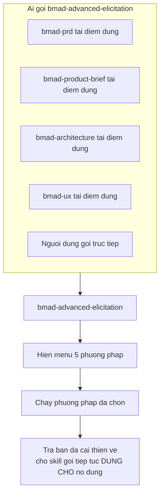
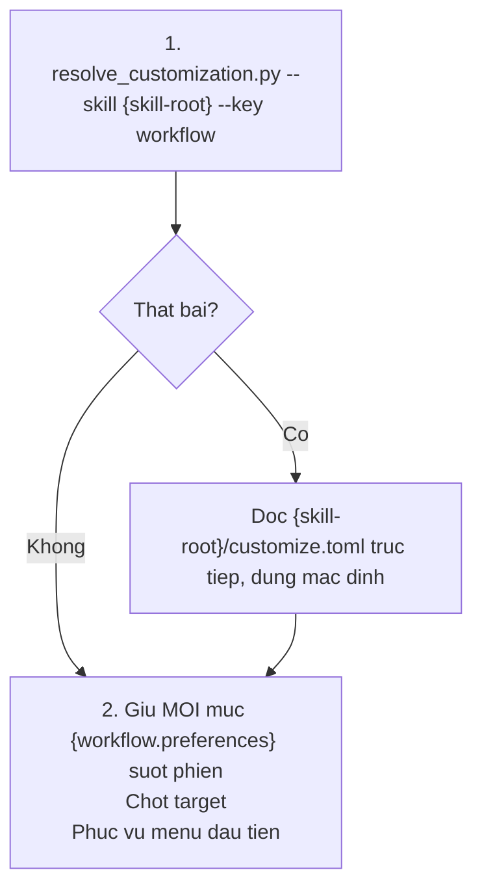
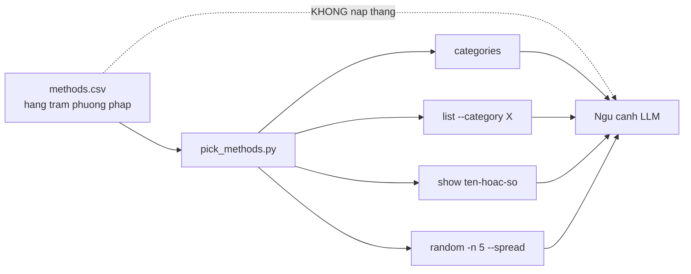
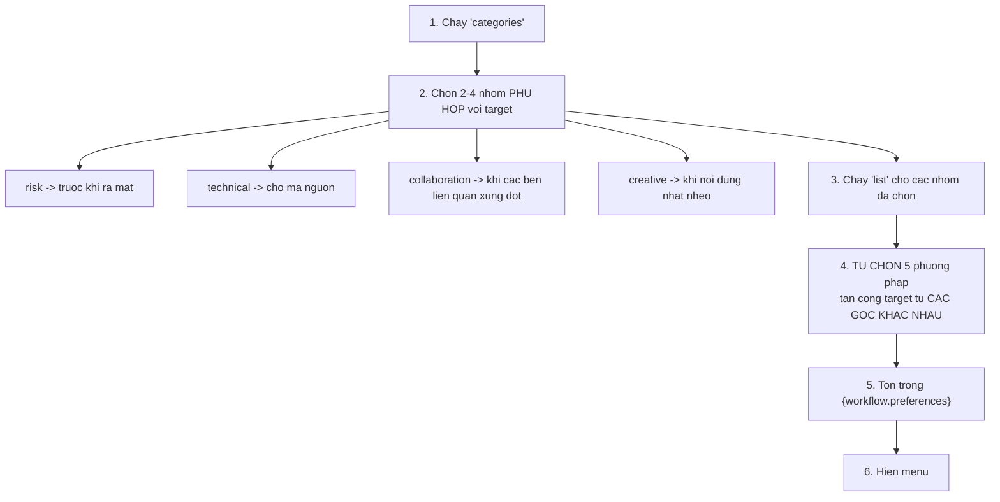
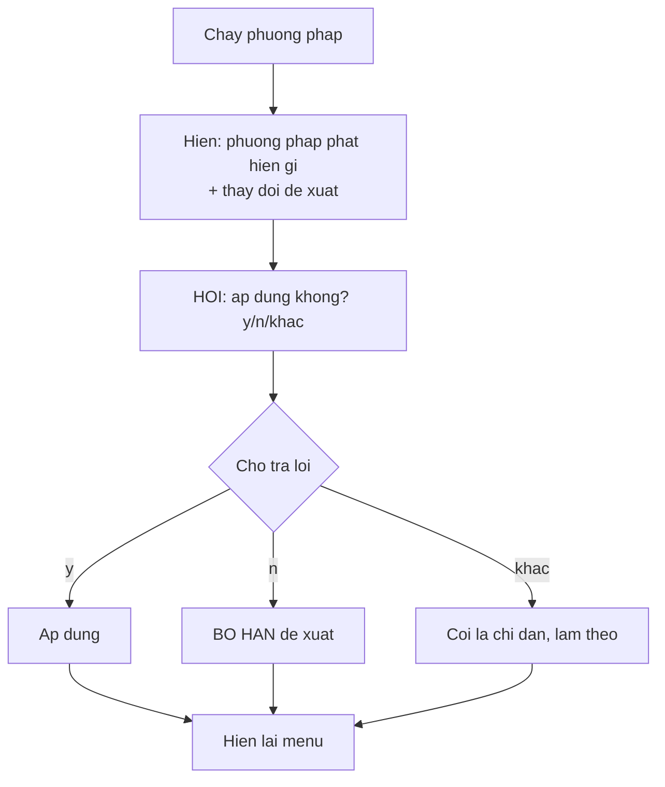
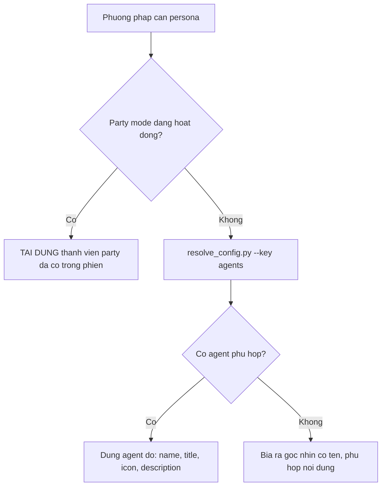
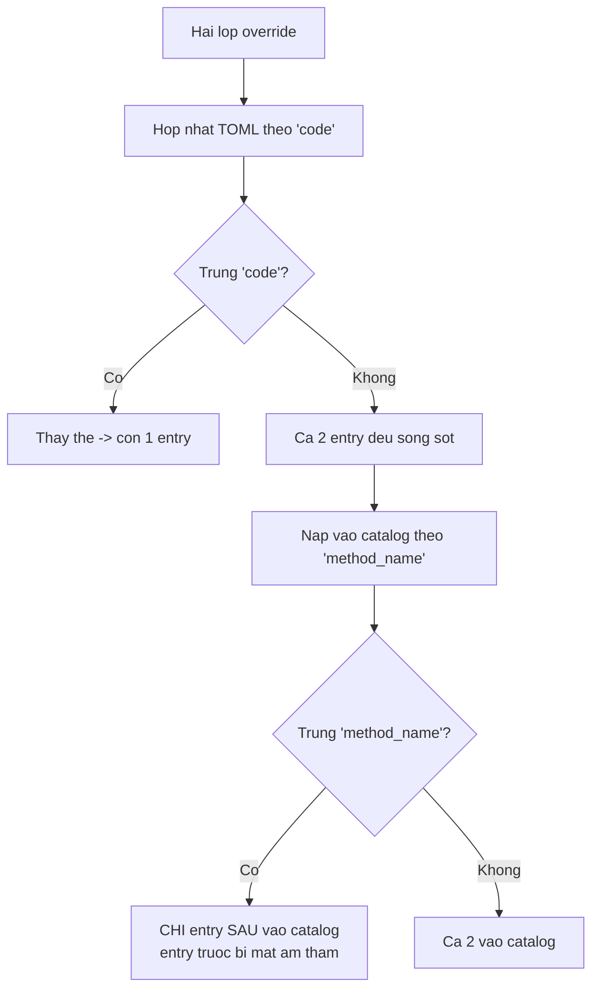
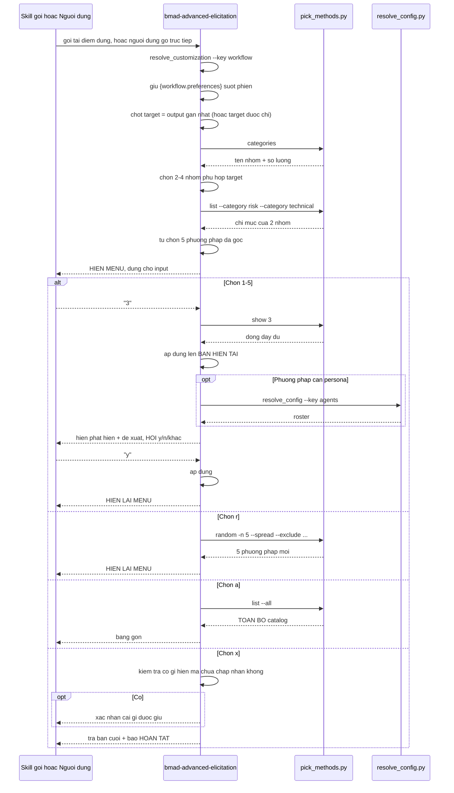

# B2 — `bmad-advanced-elicitation`

> [← Chỉ mục](./index.md) · Trước: [B1](./B1-bmad-help.md) · Tiếp: [B3 — bmad-review](./B3-bmad-review.md)

---

## 1. Nhận diện nhanh

| Thuộc tính | Giá trị |
| --- | --- |
| Tên | `bmad-advanced-elicitation` |
| Mã menu | `AE` |
| Pha | `anytime` |
| Bắt buộc | Không |
| File | `SKILL.md`, `customize.toml`, `assets/methods.csv`, `scripts/pick_methods.py` |
| Script riêng | ✅ `pick_methods.py` (233 dòng) |
| Tạo phẩm | ❌ Không ghi file — sửa nội dung tại chỗ rồi trả lại |
| Vị trí | `src/core-skills/bmad-advanced-elicitation/` |

**Frontmatter:**

```yaml
name: bmad-advanced-elicitation
description: 'Push the LLM to reconsider, refine, and improve its recent output. Use when user asks for deeper critique or mentions a known deeper critique method, e.g. socratic, first principles, pre-mortem, red team.'
```

---

## 2. Vai trò: điểm dừng tinh chỉnh dùng chung

Đây là skill **được các skill khác gọi**, nhiều hơn là người dùng gọi trực tiếp.



Trích SKILL.md:

> *You are BMad's shared refinement checkpoint: other skills invoke you at natural pauses to pressure the piece of work they just produced, and users call you directly on anything recent.*

### 2.1 Target mặc định

> *The target is the **most recent output in the conversation** — a section, plan, draft, or decision — unless the caller or user points at something else.*

### 2.2 Ràng buộc quan trọng về giao diện

> *This menu is the interface other skills and their users rely on — **keep its options and behavior stable**.*

Nghĩa là: menu `1-5 / r / a / x` là **hợp đồng công khai**. Đừng override nó theo cách phá vỡ hình dạng.

---

## 3. Kích hoạt



Chỉ **hai** bước — skill kích hoạt nhẹ nhất của core sau `bmad-help`.

> Nói ngôn ngữ của phiên đang chạy (*"Work in the surrounding session's communication language"*) — không tự phân giải `communication_language`.

---

## 4. `pick_methods.py` — phục vụ catalog

### 4.1 Vì sao cần script



> *serves the method catalog ... so it never enters context whole — **the one exception is [a]**, where the user asked for all of it.*

### 4.2 Cú pháp

```
uv run {skill-root}/scripts/pick_methods.py --file {workflow.methods_file} <lệnh>
```

| Lệnh | Chức năng | Chi phí ngữ cảnh |
| --- | --- | --- |
| `categories` | Tên nhóm + số lượng — **bản đồ rẻ** | Rất thấp |
| `list --category <cat> [--category <cat>]` | Chỉ mục của nhóm đã chọn | Thấp |
| `list --all` | **Toàn bộ catalog** — chỉ dùng cho `[a]` | Cao |
| `show <tên-hoặc-số> [...]` | Dòng đầy đủ theo tên hoặc số | Thấp |
| `random -n 5 --spread [--exclude <tên>]...` | Rút ngẫu nhiên đa dạng nhóm | Thấp |

### 4.3 Cột của `methods.csv`

```
num,category,method_name,description,output_pattern
```

| Cột | Vai trò |
| --- | --- |
| `num` | Số thứ tự — định danh ổn định |
| `category` | Nhóm (risk, technical, collaboration, creative, …) |
| `method_name` | **Định danh catalog** |
| `description` | **Ý định** của phương pháp |
| `output_pattern` | **Hướng dẫn luồng linh hoạt** |

### 4.4 Truyền phương pháp tùy biến

```
--extra '<mảng JSON>'
```

hoặc đường dẫn tới file JSON chứa mảng đó.

> *If `{workflow.additional_methods}` is non-empty, add `--extra ...` on **every** call, so custom methods are first-class in menus, reshuffles, and listings.*

Chữ "every call" quan trọng: quên truyền ở một lệnh nào đó thì phương pháp tùy biến biến mất khỏi lệnh đó.

---

## 5. Cách chọn 5 phương pháp cho menu đầu tiên



**Reshuffle** (`[r]`): `random -n 5 --spread`, loại trừ mọi phương pháp đã từng hiện.

---

## 6. Menu — hợp đồng giao diện

### 6.1 Hình dạng chuẩn

```
**Advanced Elicitation Options**
Choose a number (1-5), [r] to Reshuffle, [a] List All, or [x] to Proceed:

1. [Method Name]
2. [Method Name]
3. [Method Name]
4. [Method Name]
5. [Method Name]
r. Reshuffle the list with 5 new options
a. List all methods with descriptions
x. Proceed / No Further Actions
```

Khi party mode đang hoạt động trong phiên, thêm dòng dưới tiêu đề:

```
_Party mode is active — agents will join in._
```

### 6.2 Xử lý phản hồi

| Nhập | Hành động |
| --- | --- |
| `1`–`5` | Chạy phương pháp đó. Nhiều số ⇒ chạy **tuần tự**. Xong ⇒ **hiện lại menu** |
| `r` | Reshuffle như trên, hiện lại menu |
| `a` | Hiện toàn bộ catalog (`list --all`) dạng bảng gọn. Chọn theo tên hoặc số ⇒ chạy như chọn số |
| `x` | **Xong.** Bản cải thiện hiện tại là bản cuối. Trả về cho skill gọi, báo hoàn tất. **Nếu có thứ đã hiện mà chưa được chấp nhận ⇒ xác nhận cái gì được giữ trước khi trả** |
| Khác | Coi là **chỉ đạo** — áp dụng lên target rồi hiện lại menu |

Nhánh cuối quan trọng: người dùng gõ tự do không phải lỗi — đó là chỉ dẫn.

---

## 7. Chạy một phương pháp

### 7.1 Ba nguyên tắc

| Nguyên tắc | Nội dung |
| --- | --- |
| **Ý định** | Dùng `description` làm ý định |
| **Luồng** | Dùng `output_pattern` làm **hướng dẫn linh hoạt**, không phải khuôn cứng |
| **Độ sâu tương xứng** | Một đoạn văn ⇒ rà nhẹ. Một quyết định kiến trúc ⇒ xử lý đầy đủ |

### 7.2 Refinement cộng dồn

> *Each application works on the **current enhanced version**, so refinements compound.*

Chạy phương pháp 2 sau phương pháp 1 ⇒ nó làm việc trên kết quả của 1, không phải bản gốc.

### 7.3 Vòng chấp nhận bắt buộc



> *never change the work without a yes; on no, **drop the proposal entirely**; any other reply is instruction to follow.*

"Drop entirely" — không giữ lại một phần, không thương lượng.

---

## 8. Casting persona khi phương pháp cần

Một số phương pháp cần nhiều nhân vật (bàn tròn, hội đồng, tranh luận). Thứ tự ưu tiên:



Lệnh phân giải roster:

```bash
uv run {project-root}/_bmad/scripts/resolve_config.py --project-root {project-root} --key agents
```

Trả về roster đã hợp nhất 4 lớp; mỗi mục khóa theo mã agent, mang `name`, `title`, `icon`, `description`.

---

## 9. `customize.toml` — 3 trường

```toml
[workflow]

methods_file = "{skill-root}/assets/methods.csv"
preferences = []
additional_methods = []
```

### 9.1 `methods_file`

Đường dẫn catalog. Neo theo `{skill-root}` để phân giải đúng bất kể thư mục làm việc — vì `pick_methods.py` **luôn** được gọi với `--file {workflow.methods_file}`.

Đổi catalog:

```toml
[workflow]
methods_file = "{project-root}/docs/phuong-phap-cua-cong-ty.csv"
```

### 9.2 `preferences`

Sở thích bền vững, tôn trọng ở **mọi** phiên. Câu chữ nguyên văn, **nối thêm** — nên sở thích nhóm và cá nhân cùng có hiệu lực.

```toml
preferences = [
  "Ưu tiên phương pháp nhóm rủi ro cho bất cứ thứ gì chạm hệ thống production.",
  "Không bao giờ đề xuất phương pháp nhập vai hay persona.",
]
```

### 9.3 `additional_methods` — hai khóa, hai việc

Đây là phần **dễ nhầm nhất** trong toàn bộ hệ thống tùy biến. Chú thích gốc giải thích:

| Khóa | Vai trò | Phạm vi |
| --- | --- | --- |
| `code` | **Chỉ** là khóa hợp nhất TOML giữa các lớp override | Lớp cá nhân trùng `code` ⇒ thay lớp nhóm; `code` mới ⇒ nối |
| `method_name` | **Định danh trong catalog** | Trùng tên với method shipped ⇒ **thay thế** nó, **giữ nguyên `num`**; khác ⇒ nối với `num` mới |

Cạm bẫy được ghi rõ:

> *Two entries with different `code`s but the same `method_name` both survive the TOML merge, and **only the later one reaches the catalog**.*



**Quy tắc thực dụng:** muốn override entry của lớp khác ⇒ **dùng lại đúng `code` của nó**.

### 9.4 Ví dụ đầy đủ

```toml
# _bmad/custom/bmad-advanced-elicitation.toml

[workflow]

preferences = [
  "Ưu tiên phương pháp nhóm rủi ro cho bất cứ thứ gì chạm production.",
]

[[workflow.additional_methods]]
code = "regulatory-inversion"
category = "domain-specific"
method_name = "Regulatory Inversion"
description = "Bắt đầu từ ràng buộc tuân thủ và hỏi điều gì trở nên khả thi CHỈ NHỜ nó — biến quy tắc thành khung sáng tạo"
output_pattern = "constraint → possibilities → design"
```

Sau đó `pick_methods.py` phải được gọi kèm `--extra`:

```bash
uv run .claude/skills/bmad-advanced-elicitation/scripts/pick_methods.py \
  --file .claude/skills/bmad-advanced-elicitation/assets/methods.csv \
  --extra '[{"category":"domain-specific","method_name":"Regulatory Inversion","description":"...","output_pattern":"constraint → possibilities → design"}]' \
  categories
```

---

## 10. Luồng đầy đủ



---

## 11. Vận hành thủ công

```bash
SK="$(pwd)/.claude/skills/bmad-advanced-elicitation"
CSV="$SK/assets/methods.csv"

# Bản đồ nhóm — bắt đầu từ đây
uv run "$SK/scripts/pick_methods.py" --file "$CSV" categories

# Chỉ mục của một nhóm
uv run "$SK/scripts/pick_methods.py" --file "$CSV" list --category risk

# Nhiều nhóm cùng lúc
uv run "$SK/scripts/pick_methods.py" --file "$CSV" list --category risk --category technical

# Chi tiết một phương pháp
uv run "$SK/scripts/pick_methods.py" --file "$CSV" show "Pre-Mortem"
uv run "$SK/scripts/pick_methods.py" --file "$CSV" show 7

# Rút ngẫu nhiên đa dạng nhóm
uv run "$SK/scripts/pick_methods.py" --file "$CSV" random -n 5 --spread

# Rút ngẫu nhiên, loại trừ cái đã xem
uv run "$SK/scripts/pick_methods.py" --file "$CSV" random -n 5 --spread \
  --exclude "Pre-Mortem" --exclude "Red Team"

# Toàn bộ catalog (tốn ngữ cảnh — chỉ khi thực sự cần)
uv run "$SK/scripts/pick_methods.py" --file "$CSV" list --all

# Xem trực tiếp file CSV
head -20 "$CSV"
wc -l "$CSV"
```

### 11.1 Tự chạy một phương pháp bằng tay

1. Chọn phương pháp: `show "Pre-Mortem"`
2. Đọc `description` ⇒ đó là **ý định**
3. Đọc `output_pattern` ⇒ đó là **luồng**
4. Áp dụng lên nội dung của bạn theo ý định và luồng đó
5. So sánh trước/sau, quyết định giữ hay bỏ

Đây chính xác là điều LLM làm — chỉ khác là bạn tự suy nghĩ.

---

## 12. Cạm bẫy

| Vấn đề | Nguyên nhân | Xử lý |
| --- | --- | --- |
| Phương pháp tùy biến không xuất hiện | Quên `--extra` ở một lệnh nào đó | Truyền `--extra` ở **mọi** lệnh |
| Override `additional_methods` không thay được method shipped | Dùng `code` mới thay vì `method_name` trùng | Đặt `method_name` **trùng chính xác** với method muốn thay |
| Hai entry cùng `method_name` — một cái biến mất | Đúng theo thiết kế | Dùng lại `code` của entry kia để thay thế ở tầng TOML |
| Menu bị đổi hình dạng | Override phá hợp đồng giao diện | Giữ nguyên `1-5 / r / a / x` |
| Skill tự sửa nội dung không hỏi | Vi phạm vòng chấp nhận | Báo lỗi — quy tắc là "never change the work without a yes" |
| Catalog đổ hết vào ngữ cảnh | Gọi `list --all` khi không cần | Chỉ dùng cho `[a]` |

---

**Tiếp:** [B3 — bmad-review](./B3-bmad-review.md) · [← Chỉ mục](./index.md)
