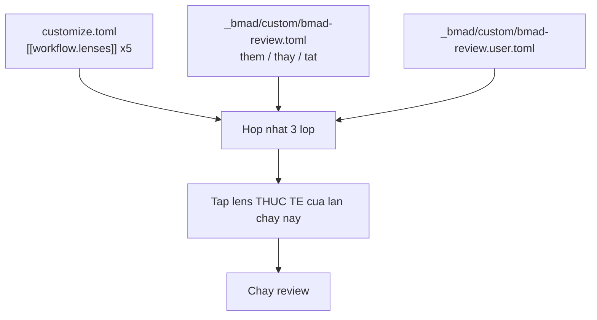
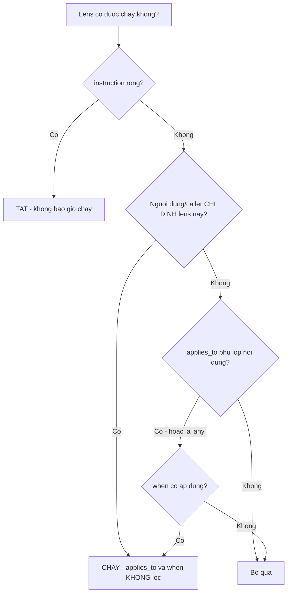
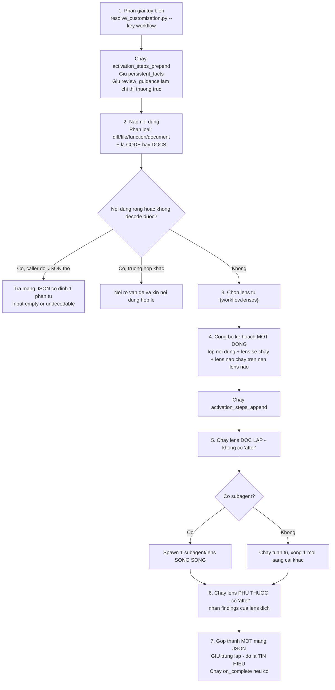
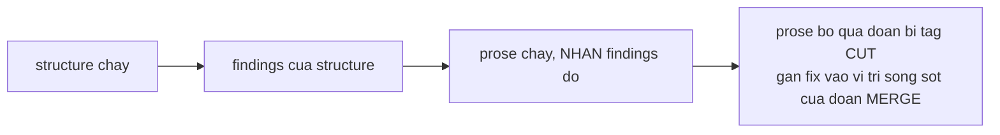
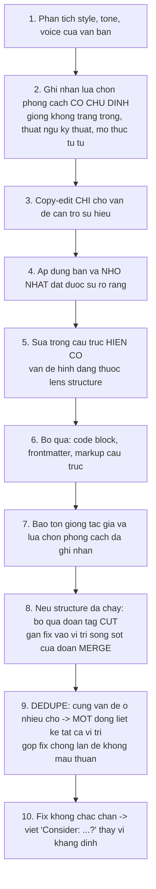
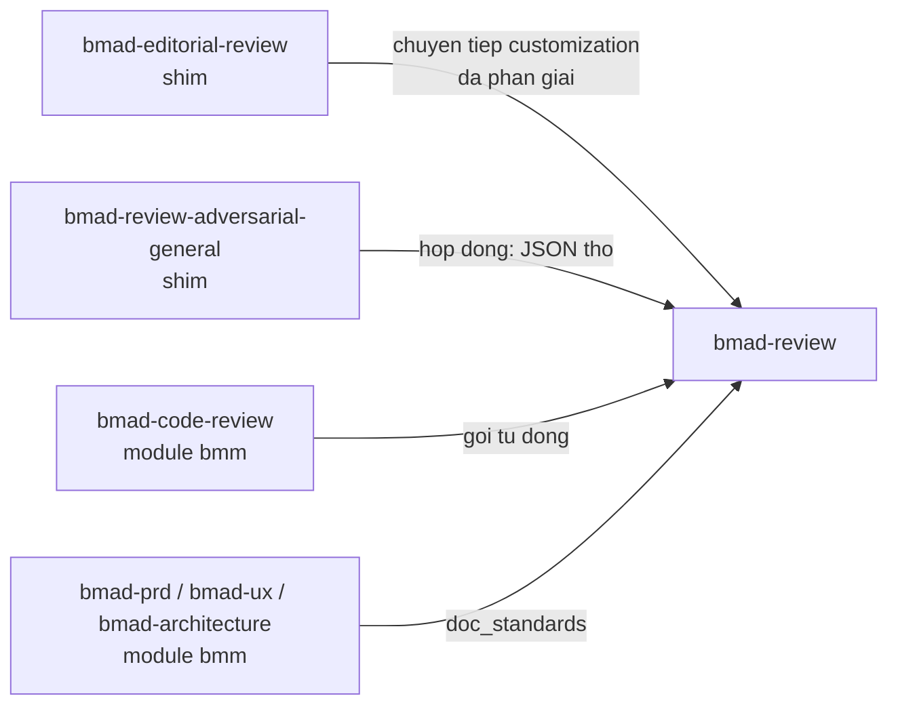

# B3 — `bmad-review`

> [← Chỉ mục](./index.md) · Trước: [B2](./B2-bmad-advanced-elicitation.md) · Tiếp: [B4 — bmad-customize](./B4-bmad-customize.md)

---

## 1. Nhận diện nhanh

| Thuộc tính | Giá trị |
| --- | --- |
| Tên | `bmad-review` |
| Mã menu | `RV` |
| Args | `[path]` |
| Pha | `anytime` |
| Bắt buộc | Không |
| File | `SKILL.md`, `customize.toml` (141 dòng), 7 file `references/`, `scripts/word_metrics.py` |
| Tạo phẩm | Mảng JSON findings + báo cáo markdown |
| Vị trí | `src/core-skills/bmad-review/` |

**Frontmatter:**

```yaml
name: bmad-review
description: 'Multi-lens review over any diff, doc, spec, or artifact — whichever installed lenses fit the content, run singly or together. Shipped lenses include adversarial, edge-case, verification-gap, structure, and prose. Use when the user says "review this", "critical review", "editorial review", "hunt edge cases", "review the structure", or "review the prose".'
```

---

## 2. Ý tưởng cốt lõi: lens là dữ liệu

`bmad-review` **không** có danh sách lens cứng trong mã. Nó chạy **bất cứ thứ gì** `{workflow.lenses}` phân giải ra.

> *The lens set is whatever `{workflow.lenses}` resolves to, **not a fixed list** — overrides add lenses and replace shipped ones. **Never claim a capability from this file**; read the resolved lenses and work from those.*



Hệ quả thiết kế:

| Muốn gì | Làm thế nào |
| --- | --- |
| Thêm lens mới | Thêm `[[workflow.lenses]]` với `code` chưa tồn tại |
| Sửa lens shipped | Thêm `[[workflow.lenses]]` với `code` **trùng** — thay toàn bộ |
| Tắt lens | `code` trùng + `instruction = ""` |

---

## 3. Năm lens mặc định

| `code` | `name` | `applies_to` | `when` | `after` | Đặc điểm |
| --- | --- | --- | --- | --- | --- |
| `adversarial` | Adversarial | `any` | `always` | — | **≥ 10 finding bắt buộc**; danh sách rỗng là tín hiệu phải rà lại |
| `edge-case-hunter` | Edge-Case Hunter | `any` | Nội dung có hành vi để lần theo: mã, diff, spec/yêu cầu/kế hoạch/story định nghĩa hành vi. Bỏ qua với văn xuôi không có bề mặt hành vi | — | Duyệt mọi nhánh và biên |
| `verification-gap` | Verification Gap | `code` | Review bên trong repo có thể tìm và đọc test | — | Tìm hành vi đổi mà test không bắt |
| `structure` | Editorial Structure | `docs` | Tài liệu mà hình dạng thuộc quyền tác giả sửa | — | Đề xuất cắt/gộp/di chuyển/cô đọng |
| `prose` | Editorial Prose | `docs` | Tài liệu đang được copy-edit | **`structure`** | Biên tập câu chữ; chạy **trên nền** findings của `structure` |

### 3.1 Ba trường điều khiển việc chọn lens



Quy tắc then chốt:

> *If the user or caller named lenses, run **exactly those only** — `applies_to` and `when` **do not filter** an explicit request.*

Nghĩa là bạn có thể ép chạy lens `verification-gap` trên một tài liệu Markdown nếu bạn muốn.

---

## 4. Bốn đầu vào

| Đầu vào | Bắt buộc | Mô tả |
| --- | --- | --- |
| `content` | ✅ | Diff, branch, thay đổi chưa commit, file, spec, story, hoặc bất kỳ tài liệu nào. Args: `[path]` |
| `lenses` | ❌ | Một hoặc nhiều mã/tên lens. Mặc định: **mọi lens phù hợp** (full review) |
| `also_consider` | ❌ | Vùng cần lưu ý thêm bên cạnh phân tích thường lệ của mỗi lens |
| Tùy biến đã phân giải sẵn | ❌ | Do caller chuyển tiếp (xem §8) |

### 4.1 Hai cách chỉ định lens

```
review this with the adversarial lens          ← nói tự nhiên
skill:bmad-review lenses=structure,prose       ← chỉ thị (dạng bmm's doc_standards dùng)
```

---

## 5. Bảy bước thực thi



### 5.1 Bước 2 — phân loại nội dung

Hai trục phân loại, **cả hai** đều ảnh hưởng:

| Trục | Giá trị | Ảnh hưởng |
| --- | --- | --- |
| Hình dạng | diff / source file / function / document | Quy tắc phạm vi |
| Lớp | **code** hoặc **docs** | Khả năng áp dụng của lens |

Trường hợp lai được xử lý rõ:

> *A document that defines behavior (spec, requirements, plan, story) is `docs` that a **behavioral lens may still apply to**; judge by `when`.*

### 5.2 Bước 4 — công bố kế hoạch, có ngoại lệ

Công bố một dòng trước khi chạy bất cứ thứ gì. **Trừ khi** caller ghim hợp đồng đầu ra chính xác:

> *Skip the announcement entirely when the caller pinned an exact output contract (the legacy forwarders that demand raw JSON or one exact line) — their contract covers **everything you emit**, not just the findings block.*

### 5.3 Bước 5 — song song hóa qua subagent

Khi có subagent, mỗi lens một subagent chạy song song. Mỗi subagent nhận:

| Thứ nhận | Ghi chú |
| --- | --- |
| `instruction` của lens | với `{skill-root}` và đường dẫn đã **phân giải tuyệt đối** |
| Nội dung, hoặc nơi đọc nó | |
| `also_consider` nếu có | |
| Chỉ thị review thường trực | từ `review_guidance` |
| Ràng buộc | *"Return ONLY your findings — no other output."* |

Điểm quan trọng: **mỗi lens không thấy findings của lens khác** (trừ lens phụ thuộc). Đó là điều làm sự trùng lặp trở thành tín hiệu chứ không phải nhiễu.

### 5.4 Bước 6 — lens phụ thuộc



Xử lý ngoại lệ:

> *A lens whose `after` target was **not selected or produced nothing** still runs, with no prior findings.*

> *Dependent lenses that name **different targets** are independent of each other and may run in parallel.*

### 5.5 Bước 7 — không dedupe

> *Keep every lens's findings — **overlap between lenses is signal, not duplication**; note it in the markdown report rather than deduping.*

Hai lens độc lập cùng chỉ ra một chỗ ⇒ chỗ đó đáng chú ý gấp đôi.

---

## 6. Lược đồ finding

### 6.1 Năm trường chuẩn

| Trường | Nội dung |
| --- | --- |
| `lens` | Mã lens sinh ra finding |
| `location` | `file:dòng-đầu-dòng-cuối` cho mã; tên mục/heading cho tài liệu; `"general"` khi trải cả tạo phẩm |
| `trigger_condition` | Vấn đề, hoặc điều kiện phơi bày nó — **một dòng** |
| `guard_snippet` | Bản vá, guard, hoặc kiểm tra còn thiếu — **cụ thể** |
| `potential_consequence` | Hậu quả nếu ship nguyên trạng |

### 6.2 Trường mở rộng theo lens

| Lens | Trường thêm |
| --- | --- |
| Deletion check | `kind`, `confidence` |
| Verification gap | `gap_shape`, `consumer`, `evidence` |

### 6.3 Ba quy tắc tuyệt đối

| Quy tắc | Nội dung |
| --- | --- |
| **Không xếp hạng** | *"No severity, priority, or ranking anywhere."* |
| **`[]` là hợp lệ** | Không tìm thấy gì thì báo không tìm thấy gì |
| **Không độn** | *"Report what is real — never pad to look thorough."* |

Ngoại lệ duy nhất: lens `adversarial` **bắt buộc ≥ 10 finding** và coi danh sách rỗng là tín hiệu phải rà lại.

### 6.4 Lens có thể tự khai báo hình dạng riêng

> *A lens file may instead declare its own findings shape and rendering — the **editorial lenses render a findings table** — and that shape wins for that lens's findings.*

---

## 7. Hai lens biên tập

### 7.1 Nền chung — `references/editorial-common.md`

Nạp **một lần**, phục vụ cả hai lens.

**Lập trường:**

> **Content is sacrosanct.** Never challenge ideas — only how they're organized and expressed. **Propose, don't execute:** the author decides what to accept.

Thứ tự ưu tiên khi xung đột:

```
Nội dung bất khả xâm phạm  >  style_guide đang hiệu lực  >  nguyên tắc chung của lens
```

Và: style guide nêu trong yêu cầu thắng style guide cấu hình, **cho lần chạy đó**.

**Ba bước setup:**

| # | Việc |
| --- | --- |
| 1 | Thu thập đầu vào: content (bắt buộc), purpose, audience, length target, reader type, style guide. Giá trị ở yêu cầu thắng; `{workflow.reader_type}` và `{workflow.style_guide}` lấp phần còn thiếu |
| 2 | Nếu content là file ⇒ đếm từ **chính xác** bằng `word_metrics.py` (tổng + theo từng heading). Nếu là text dán vào hoặc script chạy lỗi ⇒ ước lượng và **đánh dấu là ước lượng** |
| 3 | Suy ra purpose và audience nếu không được cho, và **mở đầu output bằng câu đọc hiểu một câu** — *"this document exists to help [audience] accomplish [goal]"* — để tác giả sửa tiền đề sai trước khi hành động theo findings |

### 7.2 Hiệu chỉnh theo loại độc giả

| `reader_type` | Tối ưu cho | Xử lý các yếu tố sau |
| --- | --- | --- |
| **`humans`** (mặc định) | Rõ ràng, mạch lạc, tiến triển tự nhiên | **Bảo tồn** trừ khi rõ ràng lãng phí, và **cảnh báo** mọi đề xuất cắt bỏ chúng |
| **`llm`** | Chính xác, không mơ hồ | Cắt phần cảm xúc; dài hơn ở chỗ cần tường minh |

**Với `humans` — 9 yếu tố phải bảo tồn:**

| Yếu tố | Vì sao |
| --- | --- |
| Hỗ trợ trực quan (sơ đồ, hình, flowchart) | Neo sự hiểu |
| Đặt kỳ vọng ("What You'll Learn") | Giúp độc giả xác nhận đúng chỗ |
| Hành trình độc giả | Tổ chức tuyến tính, không phải cơ sở dữ liệu |
| Mô hình tư duy | Tổng quan trước chi tiết, chống quá tải nhận thức |
| Sự ấm áp | Giọng khích lệ giảm lo lắng cho người mới |
| Khoảng trắng | Admonition, callout tạo chỗ thở |
| Tóm tắt | Củng cố trí nhớ — là **gia cố**, không phải thừa |
| Ví dụ | Làm khái niệm trừu tượng dễ tiếp cận |
| Kỹ thuật tạo mạch | Chuyển tiếp, đa dạng — **có chức năng**, không phải rườm rà |

**Với `llm` — 7 quy tắc:**

| Quy tắc | Nội dung |
| --- | --- |
| Phụ thuộc trước | Định nghĩa khái niệm trước khi dùng, giảm rủi ro ảo giác |
| Cắt cảm xúc | Bỏ ngôn ngữ cảm xúc, khích lệ, mục định hướng |
| Tham chiếu chuẩn | Nhắc "conventional commits", "REST APIs" thay vì dạy lại; tường minh khi khái niệm không phổ biến — và **luôn kèm ví dụ** |
| Thuật ngữ nhất quán | Cùng một từ cho cùng một khái niệm |
| Không rào đón | Bỏ "might", "could", "generally" |
| Ưu tiên cấu trúc | Bảng, danh sách, YAML thay vì văn xuôi |
| Tham chiếu rõ ràng | Không dùng "it", "this", "the above" mơ hồ |

### 7.3 Lens `structure`

Nạp `references/structure-models.md`, chọn model khớp mục đích tài liệu, đánh giá tài liệu theo model đó.

**Năm model cấu trúc:**

| Model | Áp dụng cho | Quy tắc |
| --- | --- | --- |
| **Tutorial/Guide (Linear)** | Tutorial, guide chi tiết, how-to, walkthrough | Điều kiện tiên quyết **phải** đứng trước hành động; bước theo thứ tự phụ thuộc chặt; có "Definition of Done" rõ ở cuối |
| **Reference/Database** | API docs, glossary, config reference, cheat sheet | Truy cập ngẫu nhiên, không cần mạch kể; **MECE**; lược đồ nhất quán (Signature → Params → Returns) |
| **Explanation (Conceptual)** | Deep dive, tổng quan kiến trúc, whitepaper, project context | Trừu tượng → cụ thể: Định nghĩa → Bối cảnh → Hiện thực/Ví dụ; xây trên nền đã lập |
| **Prompt/Task Definition (Functional)** | **Skill và workflow BMad**, prompt, system instruction, định nghĩa agent | Meta trước: đầu vào, ràng buộc, ngữ cảnh trước chỉ dẫn; tách bạch logic và dữ liệu; luồng thực thi **nói rõ**, không ngụ ý |
| **Strategic/Context (Pyramid)** | PRD, báo cáo nghiên cứu, đề xuất, decision record | Trên xuống: kết luận/khuyến nghị mở đầu; nhóm bối cảnh bên dưới; quan trọng nhất trước; MECE; **bằng chứng hỗ trợ luận điểm, không bao giờ dẫn dắt** |

> Tài liệu không khớp model nào sạch sẽ ⇒ xét theo model gần nhất, và **bản thân sự lệch đó là một finding** khi hình dạng chống lại mục đích.

**Sáu tag disposition:**

| Tag | Nghĩa |
| --- | --- |
| `CUT` | Cắt bỏ |
| `MERGE` | Gộp vào chỗ khác |
| `MOVE` | Di chuyển |
| `CONDENSE` | Cô đọng |
| `QUESTION` | Đặt câu hỏi |
| `PRESERVE` | **Giữ lại có chủ đích** thứ trông có vẻ cắt được nhưng phục vụ sự hiểu |

Mỗi finding phải nêu **tác động số từ** dựa trên số đếm của `word_metrics.py`.

**Săn tìm:**

- Mục không phục vụ mục đích đã nêu
- Trùng lặp thật (thông tin y hệt, không có giá trị gia cố)
- Vi phạm phạm vi (nội dung thuộc về tài liệu khác)
- Thông tin quan trọng bị chôn
- Chi tiết quá sớm
- Thiếu giàn giáo
- Anti-pattern kinh điển: FAQ đáng lẽ nên inline, phụ lục đáng lẽ nên cắt, overview lặp lại thân bài nguyên văn

Với `humans`, đánh giá thêm **nhịp**: đủ khoảng trắng và đa dạng thị giác để giữ chú ý chưa?

### 7.4 Lens `prose`

**Lập trường:** *"a clinical copy-editor: precise, professional, neither warm nor cynical."*

**Trình tự:**



> Chú ý: lens `prose` **có** dedupe (bước 9), khác với quy tắc "không dedupe" ở cấp tổng hợp. Đó là dedupe **trong** một lens, không phải giữa các lens.

### 7.5 Bảng findings của lens biên tập

Hai lens dùng **chung một bảng**:

| Pass | Original Text | Revised Text | Changes |
| --- | --- | --- | --- |
| `structure` | §Setup — full section (~180 words) | MERGE into §Installation | Duplicates the install steps; one source of truth (saves ~150 words) |
| `prose` | The system will processes data and it handles errors. | The system processes data and handles errors. | Fixed subject-verb agreement; removed redundant "it" |

| Loại dòng | **Original Text** chứa | **Revised Text** chứa |
| --- | --- | --- |
| `structure` | Tên mục hoặc đoạn | Disposition đã tag (kèm đích di chuyển hoặc bản viết lại cô đọng) |
| `prose` | Trích **nguyên văn** đoạn text | Bản sửa |

**Sắp xếp:** theo tác động tới sự hiểu.

**Khi tài liệu dài sinh quá nhiều dòng:** hiện dòng tác động cao nhất, gộp phần còn lại thành một dòng kết — *"N further minor fixes; ask to expand."*

**Trên bảng:** câu đọc hiểu purpose/audience, cộng thêm model cấu trúc đã chọn (khi lens `structure` chạy).

**Dưới bảng** (khi `structure` chạy): tổng số khuyến nghị, ước lượng giảm (số từ và % so với gốc, **tính từ** số đếm của `word_metrics.py`), có đạt length target không, và mọi đánh đổi về sự hiểu (cắt bỏ hy sinh tính hấp dẫn để lấy ngắn gọn).

---

## 8. Kích hoạt được chuyển tiếp



Ba hành vi:

| Tình huống | Hành vi |
| --- | --- |
| Caller truyền trường customization đã phân giải | Tôn trọng **nguyên văn** cho các trường được nêu tên; chỉ tự phân giải phần còn lại |
| Caller ghim hợp đồng đầu ra chính xác | Bỏ hoàn toàn phần công bố kế hoạch; hợp đồng bao trùm **mọi thứ** bạn xuất ra |
| Caller mong mảng JSON thô và nội dung rỗng | Trả **đúng** mảng cố định này rồi dừng: |

```json
[{
  "location": "N/A",
  "trigger_condition": "Input empty or undecodable",
  "guard_snippet": "Provide valid content to review",
  "potential_consequence": "Review skipped — no analysis performed"
}]
```

> Chú ý: mảng này **không có** trường `lens`.

---

## 9. `customize.toml` — toàn bộ trường

```toml
[workflow]

activation_steps_prepend = []
activation_steps_append = []

persistent_facts = ["file:{project-root}/**/project-context.md"]
review_guidance = []
on_complete = ""

output_format = "both"        # "json" | "markdown" | "both"
report_path = ""              # rỗng = chỉ hiện trong chat
output_preferences = ""

reader_type = "humans"        # "humans" | "llm"
style_guide = "Microsoft Writing Style Guide"

[[workflow.lenses]]
code = "..."
name = "..."
applies_to = "..."            # "code" | "docs" | "any"
when = "..."                  # tinh chỉnh bằng văn xuôi
after = "..."                 # tùy chọn — tên lens mà lens này xây trên nền
instruction = "..."           # công thức thực thi; RỖNG = TẮT
```

### 9.1 Bảng ý nghĩa

| Trường | Kiểu | Hợp nhất | Ghi chú |
| --- | --- | --- | --- |
| `persistent_facts` | mảng chuỗi | nối | Mặc định là glob toàn dự án — đặt `[]` nếu không muốn mọi review đều quét |
| `review_guidance` | mảng chuỗi | nối | Chỉ thị thường trực **áp cho mọi lens** bên cạnh method riêng của lens. Hỗ trợ `file:` |
| `on_complete` | chuỗi | thắng | Chạy sau khi findings đã giao |
| `output_format` | chuỗi | thắng | Lens tự khai báo rendering thì giữ rendering đó cho findings của nó |
| `report_path` | chuỗi | thắng | Chấp nhận đường dẫn có tiền tố `{project-root}` |
| `output_preferences` | chuỗi | thắng | **Định hình, không phải đích đến**. Ví dụ: *"Cap output at the 20 highest-impact findings."* |
| `reader_type` | chuỗi | thắng | Loại độc giả nêu trong yêu cầu thắng cho lần chạy đó |
| `style_guide` | chuỗi | thắng | Tên guide model biết rõ, đường dẫn `file:`, hoặc luật viết thẳng inline |
| `lenses` | mảng bảng khóa `code` | trùng thay / mới nối | |

### 9.2 Xử lý `file:` không đọc được

> *If a `file:` value cannot be read, **name the failed file in the output header and continue**: the shipped baseline for `style_guide`, the remaining entries otherwise.*

Không chết, không im lặng — báo rồi tiếp tục.

---

## 10. Ví dụ override

### 10.1 Thêm lens mới

```toml
# _bmad/custom/bmad-review.toml
[[workflow.lenses]]
code = "accessibility"
name = "Khả năng tiếp cận"
applies_to = "any"
when = "Mã UI hoặc tài liệu hướng tới người dùng cuối."
instruction = "Rà soát theo WCAG 2.2 AA. Xuất finding theo đúng các trường chuẩn."
```

### 10.2 Tắt lens shipped

```toml
[[workflow.lenses]]
code = "prose"
name = "Editorial Prose"
applies_to = "docs"
instruction = ""      # rỗng = tắt
```

### 10.3 Chuẩn hóa cho nhóm

```toml
[workflow]

persistent_facts = ["file:{project-root}/docs/coding-standards.md"]

review_guidance = [
  "Mọi API công khai phải có ví dụ sử dụng trong docstring.",
  "file:{project-root}/docs/thuat-ngu.md",
]

style_guide = "file:{project-root}/docs/style-guide-vi.md"
reader_type = "humans"
report_path = "{project-root}/_bmad-output/reviews"
output_format = "both"
output_preferences = "Giới hạn 20 finding tác động cao nhất."
on_complete = "Ghi một dòng tóm tắt review vào {project-root}/docs/review-log.md"
```

### 10.4 Lens có `after` tùy chỉnh

```toml
[[workflow.lenses]]
code = "consistency"
name = "Nhất quán thuật ngữ"
applies_to = "docs"
after = "prose"        # chạy sau prose, nhận findings của prose
when = "Tài liệu có thuật ngữ chuyên ngành."
instruction = "Đối chiếu mọi thuật ngữ với file:{project-root}/docs/thuat-ngu.md. Báo mọi chỗ dùng từ khác cho cùng khái niệm."
```

---

## 11. Vận hành thủ công

### 11.1 Xem lens hiện hành

```bash
R="$(pwd)"
S="$R/.claude/skills/bmad-review"

uv run "$R/_bmad/scripts/resolve_customization.py" -s "$S" -p "$R" -k workflow.lenses
```

### 11.2 Chạy `word_metrics.py`

```bash
uv run "$S/scripts/word_metrics.py" --help
uv run "$S/scripts/word_metrics.py" docs/tai-lieu-can-review.md
```

Trả về tổng số từ của tài liệu và số từ **theo từng mục heading** — đây là nền tảng cho mọi ước lượng "saves ~150 words".

### 11.3 Tự chạy một lens bằng tay

```bash
# 1. Xem lens định làm gì
cat "$S/references/lens-adversarial.md"

# 2. Với lens biên tập, đọc nền chung trước
cat "$S/references/editorial-common.md"
cat "$S/references/structure-models.md"
cat "$S/references/lens-structure.md"

# 3. Lấy số liệu
uv run "$S/scripts/word_metrics.py" tai-lieu.md

# 4. Áp dụng phương pháp trong reference lên tài liệu của bạn
```

### 11.4 Kiểm tra một lens có chạy hay không

```bash
uv run "$R/_bmad/scripts/resolve_customization.py" -s "$S" -p "$R" -k workflow.lenses \
  | python -c "
import json,sys
d = json.load(sys.stdin)
for lens in d.get('workflow.lenses', []):
    on = 'BẬT ' if lens.get('instruction','').strip() else 'TẮT '
    print(f\"{on} {lens['code']:22} applies_to={lens.get('applies_to','?'):6} after={lens.get('after','-')}\")
"
```

---

## 12. Cạm bẫy

| Vấn đề | Nguyên nhân | Xử lý |
| --- | --- | --- |
| Lens mới không chạy | Thiếu `code`, hoặc `applies_to` không phủ nội dung | Kiểm tra bằng lệnh ở §11.4 |
| Tắt lens không ăn | Đặt `instruction` rỗng nhưng `code` không trùng | `code` phải trùng **chính xác** |
| Lens thay thế mất trường | Thay thế là **toàn bộ**, không merge từng trường | Chép lại đầy đủ các trường muốn giữ (`after`, `when`, …) |
| Adversarial trả < 10 finding | Vi phạm ràng buộc lens | Báo lỗi — quy tắc là re-check, không dừng với danh sách rỗng |
| Ước lượng số từ sai | Nội dung dán vào thay vì file | Truyền đường dẫn file để `word_metrics.py` chạy được |
| Lens biên tập sửa nội dung | Vi phạm "content is sacrosanct" | Báo lỗi — lens chỉ được **đề xuất**, không thực thi |
| Review "sạch" mà thật ra không đọc gì | Nội dung rỗng/không decode được | Kiểm tra đường dẫn; skill phải nói rõ vấn đề |

---

**Tiếp:** [B4 — bmad-customize](./B4-bmad-customize.md) · [← Chỉ mục](./index.md)
