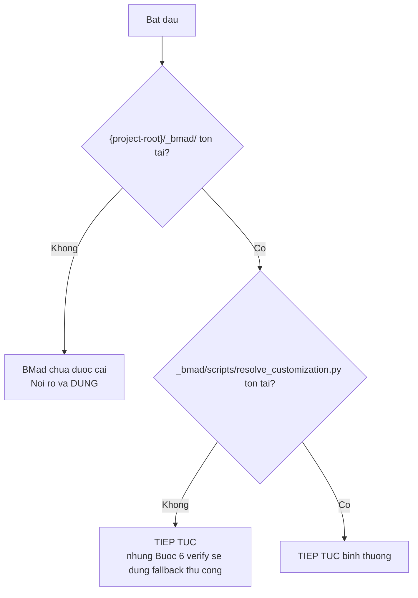
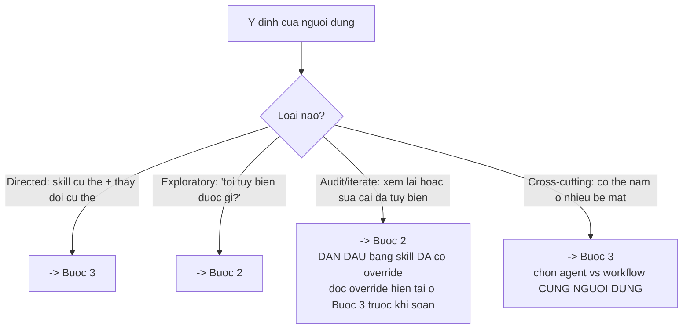
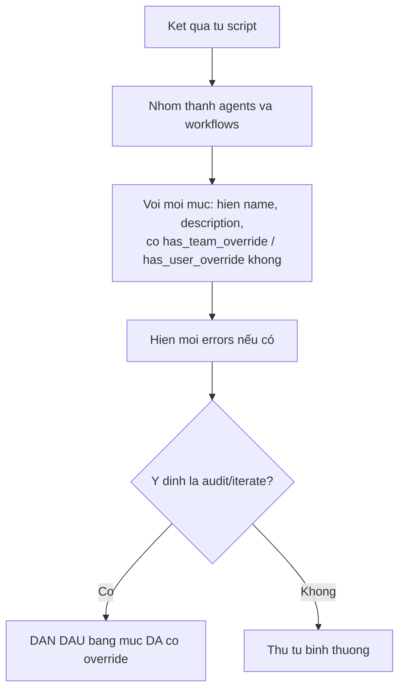
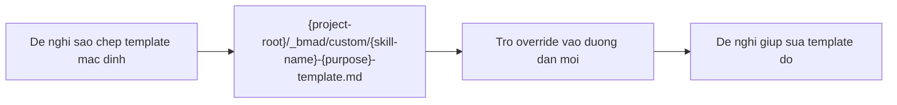
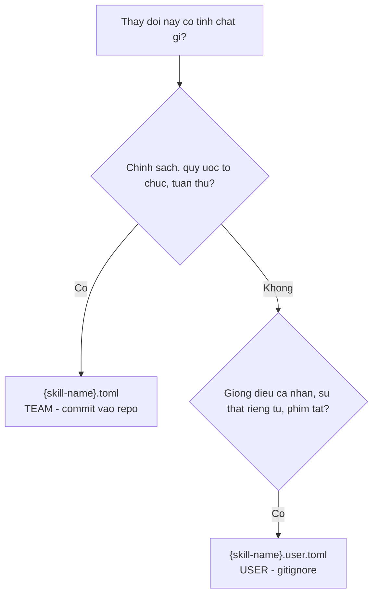
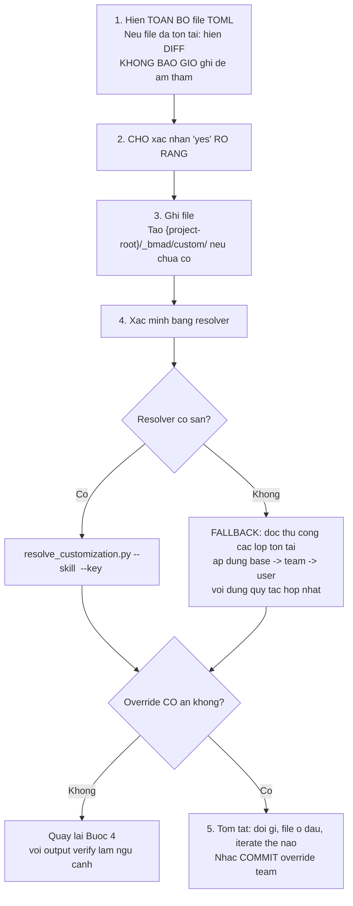
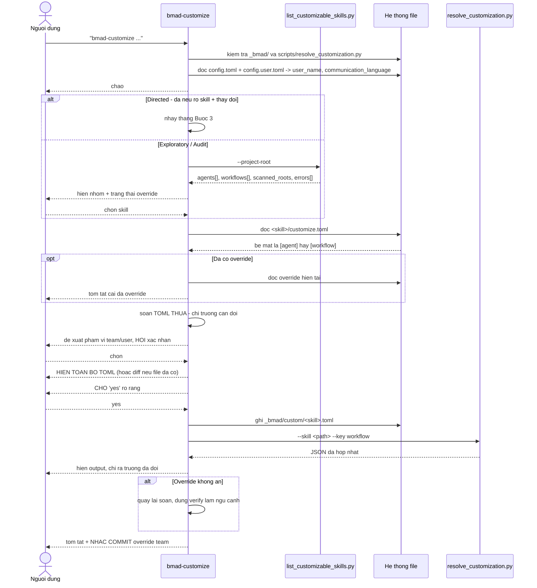

# B4 — `bmad-customize`

> [← Chỉ mục](./index.md) · Trước: [B3](./B3-bmad-review.md) · Tiếp: [B5 — bmad-brainstorming](./B5-bmad-brainstorming.md)

---

## 1. Nhận diện nhanh

| Thuộc tính | Giá trị |
| --- | --- |
| Tên | `bmad-customize` |
| Mã menu | `BC` |
| Pha | `anytime` |
| Bắt buộc | Không |
| File | `SKILL.md`, `scripts/list_customizable_skills.py` |
| `customize.toml` | ❌ **Không có** — skill này không tự tùy biến được |
| Tạo phẩm | File TOML trong `{project-root}/_bmad/custom/` |
| Vị trí | `src/core-skills/bmad-customize/` |

**Frontmatter:**

```yaml
name: bmad-customize
description: Authors and updates customization overrides for installed BMad skills. Use when the user says 'customize bmad', 'override a skill', 'change agent behavior', or 'customize a workflow'.
```

---

## 2. Mục đích và phạm vi

**Mục đích:** Dịch ý định của người dùng thành file TOML override **đặt đúng chỗ** dưới `{project-root}/_bmad/custom/`.

Sáu động từ mô tả toàn bộ skill: **Discover → Route → Author → Write → Verify** (và **Iterate** khi cần).

### 2.1 Trong phạm vi (v1)

| Loại | File tạo ra |
| --- | --- |
| Override `[agent]` theo skill | `bmad-agent-<vai-trò>.toml` / `.user.toml` |
| Override `[workflow]` theo skill | `bmad-<workflow>.toml` / `.user.toml` |

### 2.2 Ngoài phạm vi

| Ngoài phạm vi | Chuyển hướng tới |
| --- | --- |
| Cấu hình trung tâm (`_bmad/custom/config.toml`) | [How to Customize BMad guide](https://docs.bmad-method.org/how-to/customize-bmad/) |
| Logic bước, thứ tự, hành vi không có trong `customize.toml` | Mở feature request, hoặc dùng `bmad-builder` tạo skill riêng |
| Skill không có `customize.toml` | Không tùy biến được |

### 2.3 Ràng buộc trung thực

> *When the target's `customize.toml` doesn't expose what the user wants, **say so plainly. Don't invent fields.***

Đây là ràng buộc quan trọng: skill **không được** bịa ra trường không tồn tại để làm hài lòng người dùng.

---

## 3. Preflight



---

## 4. Kích hoạt

Khác với các skill core khác, `bmad-customize` **đọc trực tiếp** file cấu hình thay vì qua resolver:

```
Load `_bmad/config.toml` và `_bmad/config.user.toml` từ {project-root}
  → user_name (mặc định `BMad`)
  → communication_language (mặc định `English`)
Chào người dùng.
```

**Đường tắt:** nếu lời gọi đã nêu **cả** skill đích **và** thay đổi cụ thể ⇒ nhảy thẳng **Bước 3**.

```
bmad-customize làm cho Amelia luôn viết comment bằng tiếng Việt
       ↑ skill đích ngầm định (bmad-agent-dev)  ↑ thay đổi cụ thể
       ⇒ nhảy thẳng Bước 3
```

---

## 5. Bước 1 — Phân loại ý định



| Loại | Đặc điểm | Đích |
| --- | --- | --- |
| **Directed** | Nêu rõ skill + thay đổi | Bước 3 |
| **Exploratory** | "tôi tùy biến được gì?" | Bước 2 |
| **Audit/iterate** | Muốn xem lại hoặc sửa thứ đã tùy biến | Bước 2, ưu tiên hiện skill đã có override |
| **Cross-cutting** | Có thể đặt ở nhiều bề mặt | Bước 3, quyết định cùng người dùng |

---

## 6. Bước 2 — Khám phá

### 6.1 Lệnh

```bash
uv run {skill-root}/scripts/list_customizable_skills.py --project-root {project-root}
```

Với `--extra-root <path>` (lặp lại được) khi skill nằm ở vị trí khác.

### 6.2 Đầu ra

| Khóa | Nội dung |
| --- | --- |
| `agents` | Skill có mục `[agent]` |
| `workflows` | Skill có mục `[workflow]` |
| `scanned_roots` | Các thư mục đã quét |
| `errors[]` | Lỗi gặp phải |

Mỗi mục mang: `name`, `description`, `has_team_override`, `has_user_override`.

### 6.3 Cách trình bày



### 6.4 Khi danh sách rỗng

1. Hiện `scanned_roots`
2. Hỏi skill có nằm ở chỗ khác không, gợi ý `--extra-root`
3. Nếu không ⇒ dừng

---

## 7. Bước 3 — Xác định đúng bề mặt

### 7.1 Đọc `customize.toml` của skill đích

Mục cấp cao `[agent]` hay `[workflow]` **định nghĩa** bề mặt. Không đoán.

### 7.2 Nếu đã có override

> *If a team or user override already exists, **read it first and summarize what's already overridden before composing**.*

### 7.3 Ý định xuyên cắt — đi qua cả hai bề mặt cùng người dùng

| Ý định | Bề mặt đúng | Ví dụ |
| --- | --- | --- |
| Áp cho **mọi workflow** mà một agent chạy | **Agent** | `bmad-agent-pm.toml` với `persistent_facts`, `principles` |
| Chỉ **một workflow** | **Workflow** | `bmad-prd.toml` với `activation_steps_prepend` |
| Vài workflow cụ thể | **Nhiều override workflow tuần tự**, *không phải* một override agent | |

### 7.4 Heuristic một-bề-mặt

| Bề mặt | Dấu hiệu | Đặc tính |
| --- | --- | --- |
| **Workflow** | Đổi template, đổi đường dẫn đầu ra, hành vi riêng của bước, hoặc scalar đã lộ ra (`*_template`, `on_complete`) | **Phẫu thuật, đáng tin** |
| **Agent** | Persona, giọng điệu, sự thật cấp tổ chức, đổi menu, hành vi cần áp cho mọi workflow agent dispatch | Rộng |

Khi mơ hồ: **trình bày cả hai kèm đánh đổi, khuyến nghị một, để người dùng quyết**.

### 7.5 Khi ý định nằm ngoài bề mặt đã lộ

Nói rõ, rồi đề xuất:

1. `activation_steps_prepend` / `_append` như xấp xỉ
2. `persistent_facts` như xấp xỉ
3. Khuyến nghị `bmad-builder` để tạo skill riêng

---

## 8. Bước 4 — Soạn override

### 8.1 Nguyên tắc: thưa

> *Overrides are **sparse**: only the fields being changed. **Never copy the whole `customize.toml`.***

### 8.2 Ngữ nghĩa hợp nhất phải nắm

| Loại | Trường ví dụ | Hành vi |
| --- | --- | --- |
| **Scalar** | `icon`, `role`, `*_template`, `on_complete` | Override thắng |
| **Mảng nối** | `persistent_facts`, `activation_steps_prepend`/`append`, `principles` | Mục của team/user **nối theo thứ tự** |
| **Mảng bảng có khóa** | Mục menu có `code` hoặc `id` | Khóa trùng ⇒ thay; khóa mới ⇒ nối |

### 8.3 Trường hợp đặc biệt: đổi template

Khi trường là scalar `*_template`:



### 8.4 Khi đã có override sẵn

> *If an existing override was read, **frame the change as additive**.*

---

## 9. Bước 5 — Chọn phạm vi team hay user



| Phạm vi | File | Commit | Dùng cho |
| --- | --- | --- | --- |
| **Team** | `{skill-name}.toml` | ✅ | Chính sách, quy ước tổ chức, tuân thủ |
| **User** | `{skill-name}.user.toml` | ❌ gitignore | Giọng điệu cá nhân, sự thật riêng tư, phím tắt |

> *Default by character (policy → team, personal → user), **confirm before writing**.*

---

## 10. Bước 6 — Hiện, xác nhận, ghi, xác minh



### 10.1 Lệnh xác minh

```bash
uv run {project-root}/_bmad/scripts/resolve_customization.py \
  --skill <install-path> --key <agent-hoặc-workflow>
```

Hiện output đã hợp nhất và **chỉ ra các trường đã đổi**.

### 10.2 Fallback khi resolver thiếu hoặc lỗi

Đọc thủ công các lớp tồn tại:

1. `<install-path>/customize.toml` — base
2. `{project-root}/_bmad/custom/{skill-name}.toml` — team
3. `{project-root}/_bmad/custom/{skill-name}.user.toml` — user

Áp dụng base → team → user với đúng quy tắc: scalar override, table deep-merge, mảng có khóa `code`/`id` merge theo khóa, mọi mảng khác nối thêm.

### 10.3 Khi verify cho thấy override không ăn

Ba nguyên nhân thường gặp, theo đúng thứ tự ghi trong SKILL.md:

| # | Nguyên nhân |
| --- | --- |
| 1 | **Sai tên trường** |
| 2 | **Sai chế độ hợp nhất** (scalar vs mảng) |
| 3 | **Sai phạm vi** |

---

## 11. Điều kiện hoàn tất

Skill **chỉ** xong khi đủ **cả ba**:

| # | Điều kiện |
| --- | --- |
| 1 | File override đã ghi (**hoặc** người dùng chủ động hủy) |
| 2 | Người dùng **đã thấy** output của resolver (hoặc bản tóm tắt fallback) |
| 3 | Người dùng **đã xác nhận** bản tóm tắt |

> *Otherwise the skill isn't done — **finish or tell the user they're exiting incomplete**.*

---

## 12. Luồng đầy đủ



---

## 13. Ví dụ hội thoại

### 13.1 Directed

```
> bmad-customize thêm quy tắc "mọi API công khai phải có ví dụ trong docstring"
  vào review của nhóm
```

Skill sẽ:

1. Nhận diện đích: `bmad-review`, trường `review_guidance`
2. Đọc `customize.toml` ⇒ xác nhận là `[workflow]`, `review_guidance` là mảng chuỗi (nối thêm)
3. Đề xuất phạm vi **team** (là chính sách)
4. Hiện TOML:

```toml
[workflow]
review_guidance = [
  "Mọi API công khai phải có ví dụ sử dụng trong docstring.",
]
```

5. Chờ yes ⇒ ghi `_bmad/custom/bmad-review.toml`
6. Chạy resolver, chỉ ra `review_guidance` giờ có 1 mục
7. Nhắc commit

### 13.2 Exploratory

```
> bmad-customize tôi tùy biến được những gì?
```

Skill chạy `list_customizable_skills.py`, hiện bảng:

```
AGENTS (5)
  bmad-agent-analyst      Business Analyst        [chưa có override]
  bmad-agent-dev          Senior Software Eng.    [team ✓]
  ...

WORKFLOWS (16)
  bmad-review             Multi-lens review       [team ✓] [user ✓]
  bmad-brainstorming      Brainstorming session   [chưa có override]
  ...
```

### 13.3 Cross-cutting

```
> bmad-customize agent nào cũng phải biết chúng tôi chỉ dùng AWS
```

Skill sẽ nhận ra đây là ý định **xuyên cắt** và đi qua cả hai bề mặt:

| Phương án | File cần tạo | Đánh đổi |
| --- | --- | --- |
| Từng agent | `bmad-agent-dev.toml`, `bmad-agent-architect.toml`, … (5 file) | Chính xác, nhưng phải lặp |
| Từng workflow | `bmad-build.toml`, `bmad-architecture.toml`, … (nhiều file) | Nhiều hơn nữa |
| **Khuyến nghị** | Tạo `docs/project-context.md` chứa quy tắc đó | **Một file** — mọi skill đã mặc định glob `file:{project-root}/**/project-context.md` |

Phương án thứ ba tận dụng đúng giá trị mặc định của `persistent_facts` — đây là loại khuyến nghị mà skill nên đưa ra.

---

## 14. Vận hành thủ công

### 14.1 Tự chạy script khám phá

```bash
R="$(pwd)"
SK="$R/.claude/skills/bmad-customize"

uv run "$SK/scripts/list_customizable_skills.py" --project-root "$R"

# Với thư mục skill ở nơi khác
uv run "$SK/scripts/list_customizable_skills.py" --project-root "$R" \
  --extra-root "$R/.agents/skills"
```

### 14.2 Tự tìm skill tùy biến được

```bash
# Skill nào có customize.toml?
find .claude/skills -name customize.toml | sed 's|/customize.toml||' | sort

# Skill nào là agent persona?
grep -l "^\[agent\]" .claude/skills/*/customize.toml | sed 's|/customize.toml||'

# Skill nào là workflow?
grep -l "^\[workflow\]" .claude/skills/*/customize.toml | sed 's|/customize.toml||'

# Override nào đã tồn tại?
ls -la _bmad/custom/*.toml 2>/dev/null
```

### 14.3 Tự viết và xác minh override

```bash
R="$(pwd)"
SKILL="bmad-review"

# 1. Xem bề mặt
head -20 ".claude/skills/$SKILL/customize.toml"

# 2. Xem giá trị hiện tại
uv run "$R/_bmad/scripts/resolve_customization.py" \
  -s "$R/.claude/skills/$SKILL" -p "$R" -k workflow

# 3. Viết override
mkdir -p "$R/_bmad/custom"
cat > "$R/_bmad/custom/$SKILL.toml" <<'TOML'
[workflow]
report_path = "{project-root}/_bmad-output/reviews"
TOML

# 4. Xác minh
uv run "$R/_bmad/scripts/resolve_customization.py" \
  -s "$R/.claude/skills/$SKILL" -p "$R" -k workflow.report_path
```

Kết quả mong đợi:

```json
{
  "workflow.report_path": "{project-root}/_bmad-output/reviews"
}
```

---

## 15. Vì sao `bmad-customize` không có `customize.toml`

Cùng lý do với `bmad-help`:

| Lý do | Giải thích |
| --- | --- |
| Nó là **công cụ meta** | Tùy biến công cụ tùy biến dễ tạo vòng lặp khó hiểu |
| Nó cần **luôn đáng tin** | Một `bmad-customize` bị override có thể ghi sai chỗ |
| Nó **không mang chính sách** | Chính sách nằm ở file mà nó tạo ra, không nằm ở nó |

---

## 16. Cạm bẫy

| Vấn đề | Nguyên nhân | Xử lý |
| --- | --- | --- |
| Skill ghi đè file mà không hỏi | Vi phạm Bước 6.1 | Quy tắc là "never silently overwrite" — luôn hiện diff |
| Skill bịa ra trường không tồn tại | Vi phạm ràng buộc trung thực | Kiểm tra `customize.toml` gốc — nếu trường không có, skill sai |
| Override ghi vào `_bmad/config.toml` | Sai — đó là file installer sở hữu | Phải ghi vào `_bmad/custom/` |
| Tên file override sai | Không khớp tên skill | `load_customization` dùng `skill_dir.name` |
| Skill kết thúc mà chưa verify | Vi phạm điều kiện hoàn tất | Yêu cầu chạy resolver và hiện kết quả |
| Quên commit override team | Bước 6.5 phải nhắc | |

---

**Tiếp:** [B5 — bmad-brainstorming](./B5-bmad-brainstorming.md) · [← Chỉ mục](./index.md)
