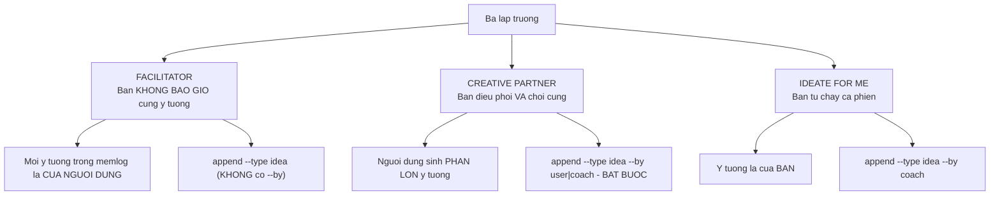
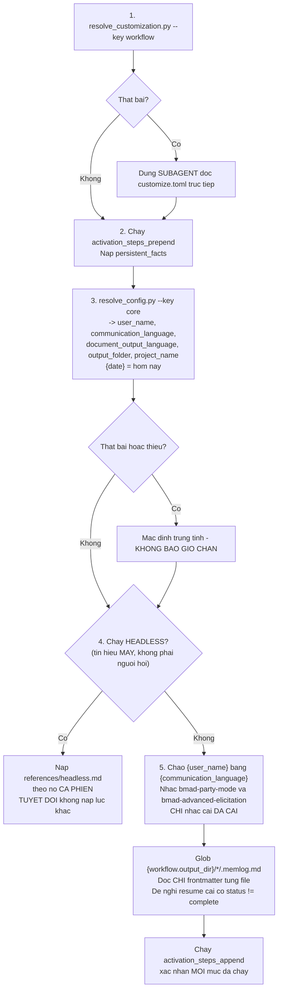
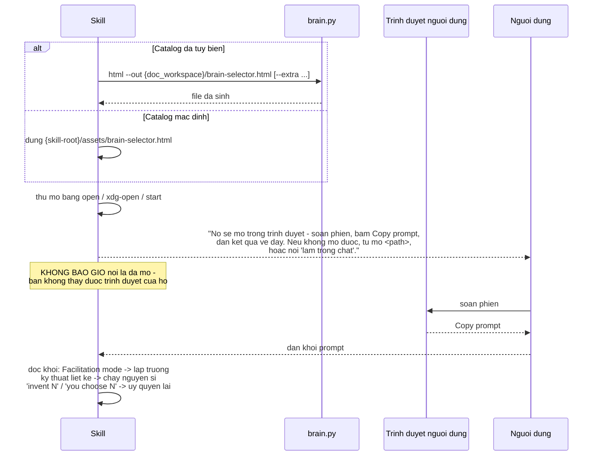
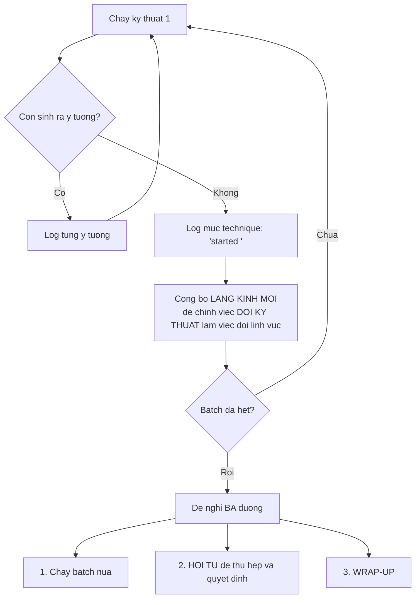
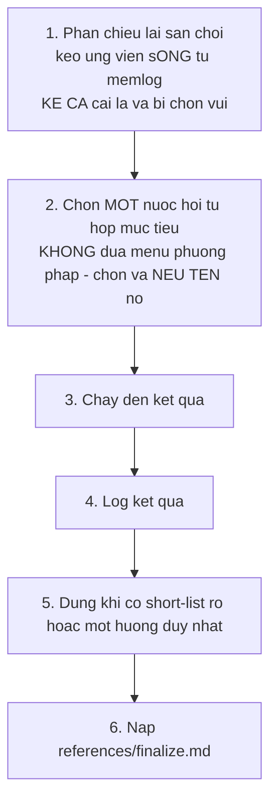
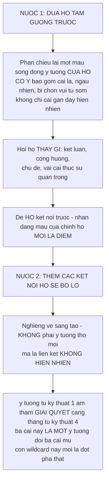
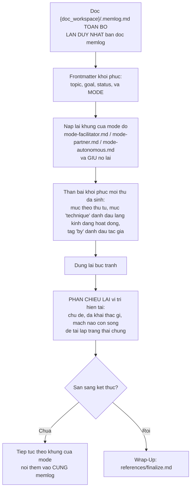

# B5 — `bmad-brainstorming`

> [← Chỉ mục](./index.md) · Trước: [B4](./B4-bmad-customize.md) · Tiếp: [B6 — bmad-deep-recon](./B6-bmad-deep-recon.md)

---

## 1. Nhận diện nhanh

| Thuộc tính | Giá trị |
| --- | --- |
| Tên | `bmad-brainstorming` |
| Mã menu | `BSP` (core) / `BP` (bmm, pha plan) |
| Pha | `anytime` (core) / `plan` (bmm) |
| Bắt buộc | Không |
| File | `SKILL.md`, `customize.toml`, 3 asset, **8 file `references/`**, `scripts/brain.py` (770 dòng — script lớn nhất core) |
| Tạo phẩm | `brainstorm.html`, `brainstorm-intent.md`, `.memlog.md` |
| Vị trí | `src/core-skills/bmad-brainstorming/` |

**Frontmatter:**

```yaml
name: bmad-brainstorming
description: Facilitate a brainstorming session using diverse creative techniques. Use when the user says 'help me brainstorm' or 'help me ideate'.
```

---

## 2. Ba lập trường (stance)

Đây là khái niệm trung tâm của skill. Người dùng chọn **một** lập trường, và nó **giữ nguyên suốt phiên**.



### 2.1 Facilitator — `references/mode-facilitator.md`

> *You are a **forcing function** for the user's creativity, never a source of ideas. The best version of this session ends with the user surprised by what **they** came up with.*

| Quy tắc | Nội dung |
| --- | --- |
| **Không cung ý tưởng** | Nước cờ của bạn là câu hỏi, khiêu khích, ràng buộc, phản chiếu — làm **người dùng** sinh ra |
| Khi giếng cạn | **Đừng đổ nước vào** — đổi kỹ thuật, đổi góc, đẩy mạnh hơn |
| **Ngoại lệ duy nhất** | Người dùng **hỏi thẳng** xin một ý tưởng ⇒ cho **đúng một** làm mồi, rồi trả bút lại |
| Tín hiệu | Người dùng liên tục xin ý tưởng ⇒ **đổi kỹ thuật**, không phải tiếp tục mớm |
| Ghi log | `--type idea` **không** có `--by` (mọi ý tưởng đều là của họ) |
| Nới lỏng | Chỉ trong lúc tổng hợp ở wrap-up |

### 2.2 Creative Partner — `references/mode-partner.md`

> *You **ride alongside** and throw in your own ideas as sparks and yes-and fuel, so the two of you build a chain neither would alone. The energy is **collaborative, not extractive**.*

**Thiết lập bắt buộc trước khi bắt đầu:** nói cho người dùng biết mode này chạy thế nào và họ vẫn giữ quyền kiểm soát — họ có thể **từ chối bất kỳ ý tưởng nào bạn đưa, yêu cầu bạn giúp nhiều hơn hoặc ít hơn, và bảo bạn cách brainstorm** (kỹ thuật, giọng điệu, hướng đi).

**Bốn quy tắc cân bằng:**

| Quy tắc | Nội dung |
| --- | --- |
| **Lửa của họ, củi của bạn** | Sau khi đưa một ý tưởng, **trả bút lại bằng một câu hỏi**. Không bao giờ chạy một chuỗi ý tưởng của mình trong khi họ im lặng |
| **"Yes, and" là nước cờ mặc định** | Lấy cái họ vừa nói, đẩy cao thêm một nấc, rồi **thách họ vượt bạn** |
| **Đưa lựa chọn thật** | Không phải câu hỏi dẫn dắt — một ý tưởng thật họ có thể biến đổi hoặc từ chối; là **mở đầu**, không phải kết luận |
| **Theo dõi tỷ lệ** | Nếu vài lượt gần đây bạn đóng góp nhiều hơn họ ⇒ bạn đã trượt sang làm **thay** họ ⇒ rút về câu hỏi và ràng buộc |

**Attribution là bắt buộc:** `--by user` cho ý tưởng của họ, `--by coach` cho của bạn. Điều này giữ bản ghi trung thực và cho phép wrap-up **đưa họ tấm gương** phản chiếu những gì **họ** đã tạo ra.

### 2.3 Ideate For Me — `references/mode-autonomous.md`

> *The user handed you the topic and wants to see what you come up with on your own.*

| Quy tắc | Nội dung |
| --- | --- |
| Chạy phiên phân kỳ thật | Nếu người dùng cung cấp kỹ thuật (prompt dán từ trang chọn) ⇒ tôn trọng trước; nếu không ⇒ **tự chọn và chạy**, không có menu cho người dùng |
| Ghi log | `--type idea --by coach`, đánh dấu mỗi lần đổi kỹ thuật bằng mục `technique` |
| Nhịp | Đổi lĩnh vực sáng tạo mỗi ~10 ý tưởng, nhắm **quá 100** |
| Không hỏi dồn | Một lần xác nhận nhanh chủ đề + mục tiêu ở đầu là đủ |
| Keepsake | **Tự sinh HTML — không hỏi trước**; nó là kết quả bạn đã hứa cho họ xem. Các tạo phẩm khác vẫn opt-in |
| Chuyển tiếp | Sau đó **đề nghị tiếp tục cùng nhau** — chuyển sang Facilitator hoặc Partner, **ghi việc chuyển vào memlog** để resume khôi phục đúng lập trường |

Lệnh ghi chuyển lập trường:

```bash
uv run {project-root}/_bmad/scripts/memlog.py set \
  --workspace {doc_workspace} --key mode --value <facilitator|partner>
```

> Đây là **anh em sinh đôi tương tác** của chế độ headless: cùng cơ chế tự sinh, nhưng có người ở đó nhận kết quả và có thể tiếp tục.

---

## 3. Ba khung giữ suốt phiên

Ba quy tắc này **chống lại mặc định của LLM** — SKILL.md nói rõ *"These fight your defaults, in every mode; hold them deliberately."*

| # | Khung | Nội dung |
| --- | --- | --- |
| 1 | **Nhắm quá 100 ý tưởng; kháng cự việc kết luận** | Thôi thúc muốn tổ chức hoặc gói lại là **kẻ thù của sự phân kỳ**. Khi phân vân, đẩy thêm một ý nữa. Chỉ dừng khi người dùng cạn hoặc chủ đề khai thác hết |
| 2 | **Liên tục đổi lĩnh vực sáng tạo** | Mỗi 5–10 lượt (hoặc ~10 ý tưởng khi bạn đang sinh), thường bằng cách chuyển sang kỹ thuật kế tiếp |
| 3 | **Một prompt mỗi tin nhắn; không menu trắc nghiệm** | Không dồn câu hỏi thành bức tường, không đưa menu mời chọn lười — cả hai kéo người dùng ra khỏi trạng thái sinh ý tưởng |

**Ngoại lệ duy nhất của quy tắc 3:** hai lựa chọn **quy trình** ở đầu (lập trường, và luồng kỹ thuật). *Cách chạy* là quyền của họ; *ý tưởng gì* thì không bao giờ.

---

## 4. Memlog — bộ nhớ của phiên

> *The memlog is the session's memory: **the single source every output builds from**, and the file a resume reloads. **Whatever isn't in it is gone.***

### 4.1 Ghi gì

| Ghi | Không ghi |
| --- | --- |
| Mọi ý tưởng | Prompt của bạn |
| Mọi quyết định | Tán gẫu |
| Mọi câu hỏi | |
| Mọi chỉ đạo của người dùng | |
| Bất cứ gì bạn sẽ tiếc nếu cửa sổ đóng | |

**Cách ghi:** mỗi thứ một dòng, đúng nghĩa của người dùng, theo thứ tự thời gian. **Không bao giờ sửa hay sắp xếp lại.**

### 4.2 Ba lệnh

```bash
W="{doc_workspace}"

# Tạo — một lần, khi đã biết topic, goal, stance
uv run {project-root}/_bmad/scripts/memlog.py init --workspace "$W" \
  --field topic="<chủ đề>" --field goal="<mục tiêu>" \
  --field mode="<facilitator|partner|autonomous>"

# Ghi một mục
uv run {project-root}/_bmad/scripts/memlog.py append --workspace "$W" \
  --type <idea|insight|question|decision|direction|technique> \
  --text "<gist một dòng>" [--by user|coach]

# Lật trạng thái ở wrap-up
uv run {project-root}/_bmad/scripts/memlog.py set --workspace "$W" \
  --key status --value complete
```

### 4.3 Từ vựng `--type`

| `--type` | Dùng khi |
| --- | --- |
| `idea` | Một ý tưởng |
| `insight` | Một nhận thức, mối liên hệ |
| `question` | Một câu hỏi mở |
| `decision` | Một quyết định |
| `direction` | Chỉ đạo của người dùng |
| `technique` | Chuyển kỹ thuật — `--text "started <tên>"` |
| *(bỏ trống)* | Ghi chú thường |

### 4.4 `--by` — khi nào bắt buộc

| Lập trường | `--by` |
| --- | --- |
| Facilitator | **Bỏ qua** (mọi ý tưởng đều của người dùng) |
| Creative Partner | **BẮT BUỘC** — `--by user` hoặc `--by coach` |
| Ideate for me | `--by coach` |

---

## 5. Kích hoạt — 5 bước



> Điểm khác biệt: bước 1 fallback dùng **subagent** đọc `customize.toml` — để không làm bẩn ngữ cảnh chính.

---

## 6. Chạy một phiên

### 6.1 Mở màn

Một câu hỏi ghép: **brainstorm cái gì**, và **mục tiêu/lý do đằng sau là gì** (kèm hỏi có input hay yêu cầu đặc biệt không).

> *The **why** shapes technique choice and synthesis (**kids' iPhone apps to build with your own kids** vs. **to win market share** point different ways).*

Nếu lời gọi đã làm rõ cả hai ⇒ bỏ câu hỏi, **xác nhận** và đọc thứ họ chỉ tới.

Sau đó: suy ra `{topic_slug}` dạng kebab-case, và ràng buộc:

```
{doc_workspace} = {workflow.output_dir}/{workflow.output_folder_name}/
```

### 6.2 Trang soạn phiên (đường chính)



**Đọc khối đã dán:**

| Phần trong khối | Nghĩa |
| --- | --- |
| Dòng `Facilitation mode:` | Lập trường |
| Kỹ thuật liệt kê (đầy đủ category/name/description, một số gắn `(random pick)`) | **Chạy nguyên si — không cần `list`/`show`** |
| `invent N` | Tự phát minh N kỹ thuật mới |
| `you choose N` | Tự chọn N kỹ thuật |

Lệnh sinh trang khi catalog đã tùy biến:

```bash
uv run {skill-root}/scripts/brain.py \
  --file {workflow.brain_methods} \
  [--extra {doc_workspace}/extra-techniques.json] \
  html --out {doc_workspace}/brain-selector.html
```

### 6.3 Hoặc làm trong chat

Nếu họ không mở được trang hoặc không muốn ⇒ chọn lập trường tại đây, chọn kỹ thuật theo `## Choosing Techniques`.

### 6.4 Sau khi biết lập trường

1. Tạo memlog (`init` với `--field mode=`)
2. **Nạp khung của lập trường đó** và giữ suốt phiên
3. **Nói cho người dùng biết đường dẫn memlog** — trạng thái đã ở trên đĩa, phiên sống sót qua gián đoạn

---

## 7. Chọn kỹ thuật

Áp dụng cho **Facilitator** và **Creative Partner**. (Ở **Ideate for me**, bạn tự chọn và chạy.)

### 7.1 Hai phần ủy quyền lại từ trang chọn

| Chỉ thị | Nghĩa | Hành động |
| --- | --- | --- |
| **`invent N`** (Inventive Flow) | Phát minh N kỹ thuật hoàn toàn mới tại chỗ | Một dòng có thể giới hạn phạm vi (`invent 1 new technique in the spirit of <category>`) ⇒ tôn trọng tinh thần nhóm đó. **Công bố thứ tự**, log tên + mô tả từng cái, đề nghị lưu cái hay vào `{workflow.additional_techniques}` ở wrap-up |
| **`you choose N`** (Facilitator Chosen) | Bạn chọn N kỹ thuật hợp mục tiêu | `{workflow.favorite_techniques}` trước; xác nhận tên chính xác bằng `list --category <cat>` có phạm vi. **Không bao giờ kéo cả thư viện vào ngữ cảnh** |

### 7.2 Chọn trong chat — `references/in-chat-techniques.md`

**3–4 kỹ thuật là điểm ngọt.** Đây là **menu duy nhất được phép**:

| Lựa chọn | Cách chạy |
| --- | --- |
| **Facilitator Chosen** (mặc định) | Từ mục tiêu + `favorite_techniques` + bản đồ `categories`, nêu batch 3–4. Xác nhận tên bằng `list --category` **chỉ trên nhóm đang rút** |
| **Browse** | Gửi họ sang trang soạn |
| **Category** | Người dùng nêu 1–n nhóm; `random --category` rút batch. **Không cần liệt kê** |
| **Inventive Flow** | Phát minh ít nhất 3 kỹ thuật, công bố thứ tự trước cái đầu tiên, **không chạm script** |

### 7.3 Vòng chạy



---

## 8. `brain.py` — phục vụ thư viện

### 8.1 Cú pháp

```
uv run {skill-root}/scripts/brain.py --file {workflow.brain_methods} [--extra <json>] <lệnh>
```

| Lệnh | Chức năng | Ghi chú |
| --- | --- | --- |
| `categories` | Tên nhóm + số lượng | Bản đồ khảo sát rẻ |
| `list --category X [--category Y]` | Chỉ mục (tên + tóm lược) của các nhóm | **`list` trần bị script từ chối** |
| `random --category X [...] -n 4` | Rút batch **mù**, không liệt kê gì | |
| `show "<tên>"` | Phương pháp đầy đủ của một kỹ thuật | Chỉ gọi **đúng lúc sắp chạy** nó |
| `html --out <path>` | Ghi trang soạn ra file | Cho lựa chọn Browse |

### 8.2 Nguyên tắc

> *The library is large — **never pull it whole into context**. The only way in is the helper, always passing `--file {workflow.brain_methods}`.*

Chú ý `list` trần **bị từ chối** — đây là chống-lỗi ở mức script: không thể vô tình đổ cả thư viện.

### 8.3 Kỹ thuật tùy biến

`{workflow.additional_techniques}` là **công dân hạng nhất** — kể cả nhóm mới. Truyền `--extra <json>` (danh sách JSON các object `{category, technique_name, description}`).

> *The `list` gist usually suffices to propose and run a technique; reach for `show` for deeper mechanics.*

---

## 9. Hội tụ — `references/converge.md`

### 9.1 Khi nào

Khi phân kỳ đã cạn và người dùng muốn thu hẹp — hoặc họ nói "quyết đi", "ưu tiên", "chọn", "làm thật".

> *The whole catalog is **divergent** by design (it generates); this is the deliberate opposite phase, and **keeping the two apart is the point**. **Never** run convergence while ideas are still flowing — **premature judgment is what kills good ideas**.*

### 9.2 Lập trường vẫn giữ

| Lập trường | Hội tụ chạy thế nào |
| --- | --- |
| Facilitator | Bạn chạy hội tụ **trên phán quyết của người dùng** — bạn cấu trúc và gợi, **họ** phán xét. **Không bao giờ xếp hạng thay họ** |
| Creative Partner | Bạn cũng có ý kiến, mỗi phán quyết được log kèm tác giả |
| Ideate for me | Bạn tự hội tụ và trình bày kết quả, rồi đề nghị tiếp tục |

### 9.3 Cách chạy



### 9.4 Sáu nước hội tụ

| Nước | Khi nào dùng | Cách làm |
| --- | --- | --- |
| **Affinity Clustering** | Nhiều ý tưởng rải rác | Nhóm thành chủ đề, đặt tên từng cụm, làm nổi mạch xuyên suốt. Thường là nước **đầu tiên** đúng — biến một đống thành một nắm |
| **Impact–Effort** | Mục tiêu là hành động | Đặt từng ứng viên lên trục tác động vs công sức; thu hoạch tác-động-cao/công-sức-thấp trước, gác phần còn lại |
| **NUF Test** | Tính mới quan trọng | Chấm mỗi cái theo New, Useful, Feasible (1–10 mỗi tiêu chí); tổng điểm lộ ra kẻ thắng thầm lặng và kẻ chói lóa nhưng vô vọng |
| **Forced Ranking / Dot Vote** | Chỉ cần top-N xếp hạng | Bắt các ý tưởng cạnh tranh, **không hòa** |
| **PMI (Plus/Minus/Interesting)** | Một ứng viên mạnh cần thử lửa trước khi cam kết | Liệt kê điểm cộng, điểm trừ, và cái chỉ-thú-vị, rồi phán xét |
| **MoSCoW** | Đang định phạm vi một bản build | Phân thành Must / Should / Could / Won't-this-time |

Log kết quả:

```bash
uv run {project-root}/_bmad/scripts/memlog.py append --workspace {doc_workspace} \
  --type decision --text "<gist một dòng>"    # thêm --by ở Creative Partner
```

> Xâu chuỗi hai–ba nước hội tụ là được (ví dụ cluster → chấm điểm các cụm); nhiều hơn thường là **xử lý quá đà**.

> **`status: complete` KHÔNG đặt ở đây** — nó thuộc về `finalize.md`.

---

## 10. Wrap-up — `references/finalize.md`

### 10.1 Tổng hợp — hai nước, đúng thứ tự



> Ở Facilitator, đây là **nơi duy nhất** đóng góp sáng tạo của bạn được hoan nghênh.

Sau đó:

```bash
uv run {project-root}/_bmad/scripts/memlog.py append --workspace {doc_workspace} \
  --type insight --text "<insights + hướng đã chọn>"

uv run {project-root}/_bmad/scripts/memlog.py set --workspace {doc_workspace} \
  --key status --value complete
```

> Lật `status` **kể cả khi người dùng từ chối mọi tạo phẩm** — phiên đã xong và phải ngừng được đề nghị resume.

### 10.2 Tạo phẩm

| Lập trường | HTML keepsake | Tạo phẩm khác |
| --- | --- | --- |
| Ideate for me / headless | **Tự sinh, không hỏi** | Opt-in |
| Facilitator / Creative Partner | Opt-in, **khuyến nghị làm mặc định** | Opt-in |

Mỗi tạo phẩm là một lần sinh **tốn token mới**, nên phải hỏi.

### 10.3 Ủy quyền cho subagent — và vì sao

> *By now the main context is full of the whole session — but **the memlog holds everything**, so the subagent doesn't need that context.*

Spawn một subagent cho **mỗi** tạo phẩm được yêu cầu, chỉ cho nó:

1. Spec của tạo phẩm
2. Đường dẫn memlog `{doc_workspace}/.memlog.md` — **nguồn duy nhất của nó**, đọc toàn bộ
3. Đường dẫn đầu ra
4. `{document_output_language}`
5. Ràng buộc: *"return ONLY the written file path"*

> *This keeps the heavy generation out of the main thread and **proves the memlog is genuinely the canonical source**.*

Lưu ý: subagent **không** spawn được subagent — chạy chúng từ thread chính.

### 10.4 Ba tạo phẩm

| Tạo phẩm | Đặc điểm |
| --- | --- |
| **`brainstorm.html`** (khuyến nghị mặc định) | Một file tự chứa. **Không có template — có chủ đích**: để chủ đề, năng lượng, và sự tinh nghịch của **phiên này** dẫn dắt ngôn ngữ thị giác (một phiên về game trẻ em và một phiên về chuỗi cung ứng **không được** trông giống nhau). Mỗi kỹ thuật có cách thể hiện riêng; phát minh cách trực quan hóa hợp với ý tưởng; render phần tổng hợp như **cao trào**. Inline toàn bộ CSS/JS, không phụ thuộc ngoài. Mở nó khi xong |
| **`brainstorm-intent.md`** | Ngắn gọn — **chỉ** những khám phá đã chọn và quan trọng, cấu trúc để thả thẳng vào skill hạ nguồn (`bmad-product-brief`, `bmad-prd`) làm input sạch. **Token quan trọng — phải thật đúng trọng tâm.** Xác nhận với người dùng cái gì được coi là intent (có thể có nhiều khám phá phân kỳ) |
| **Tùy chọn khác** | Pitch, one-pager, danh sách việc, slide deck, HTML, markdown — sáng tạo và đưa ra lựa chọn chất lượng dựa trên nhu cầu cảm nhận được, đồng thời **mời họ đề xuất ý tưởng khác** |

### 10.5 Kết thúc

1. Nếu phiên dùng kỹ thuật tự phát minh ⇒ đề nghị lưu cái hay vào `{workflow.additional_techniques}` qua `bmad-customize`
2. Đề nghị ý tưởng cho phiên brainstorm sâu mới
3. Đề nghị mở rộng bất kỳ ý tưởng nào thành báo cáo HTML (tự động brainstorm thay họ)
4. **Thực thi từng chỉ thị `{workflow.external_handoffs}`**
5. Chia sẻ đường dẫn tạo phẩm (và đích handoff)
6. **Gọi `bmad-help`** để gợi ý bước tiếp theo trong hệ sinh thái BMad
7. Cho họ biết nếu intent đủ chi tiết thì có thể chuyển thẳng sang `bmad-spec`
8. Chạy `{workflow.on_complete}` nếu không rỗng

---

## 11. Resume — `references/resume.md`



---

## 12. `customize.toml` — 8 trường

```toml
[workflow]

activation_steps_prepend = []
activation_steps_append = []
persistent_facts = ["file:{project-root}/**/project-context.md"]

brain_methods = "{skill-root}/assets/brain-methods.csv"
favorite_techniques = []
additional_techniques = []

output_dir = "{output_folder}/brainstorming"
output_folder_name = "brainstorm-{topic_slug}-{date}"

on_complete = ""
external_handoffs = []
```

| Trường | Ý nghĩa |
| --- | --- |
| `brain_methods` | Đường dẫn thư viện kỹ thuật. Neo `{skill-root}` để phân giải đúng bất kể cwd |
| `favorite_techniques` | Kỹ thuật ưu tiên khi **bạn** đề xuất. Tên phải khớp mục trong thư viện hoặc `additional_techniques`. **Nối thêm** |
| `additional_techniques` | Kỹ thuật (và nhóm) bổ sung, **không cần sửa CSV shipped**. Mục mirror hình dạng thư viện (`category`, `technique_name`, `description`); nhóm mới chỉ là giá trị `category` mà CSV chưa có |
| `output_dir` | Thư mục cha của mọi phiên |
| `output_folder_name` | Mẫu thư mục con — `{topic_slug}` điền từ chủ đề, nên mỗi chủ đề có thư mục riêng, không va chạm |
| `on_complete` | Chuỗi (một chỉ thị) hoặc mảng (nhiều chỉ thị chạy theo thứ tự) |
| `external_handoffs` | **Định tuyến ra ngoài.** Chỉ thị bằng ngôn ngữ tự nhiên, áp dụng sau khi tạo phẩm được sinh, để đưa chúng ra Confluence, Notion, Drive… Mỗi mục nêu tên tool MCP, đích đến, và trường cần |

### 12.1 `external_handoffs` — hành vi khi tool không có

> *If a named tool is unavailable at runtime, the handoff is **skipped and flagged**; **local files always exist**.*

Ví dụ:

```toml
external_handoffs = [
  "After artifacts are produced, upload brainstorm.html to Confluence via corp:confluence_upload (space_key='IDEAS', parent_page='Brainstorms', author={user_name}).",
]
```

---

## 13. Vận hành thủ công

```bash
R="$(pwd)"
SK="$R/.claude/skills/bmad-brainstorming"
CSV="$SK/assets/brain-methods.csv"

# ── Khám phá thư viện ──────────────────────────────────────────
uv run "$SK/scripts/brain.py" --file "$CSV" categories
uv run "$SK/scripts/brain.py" --file "$CSV" list --category "structured"
uv run "$SK/scripts/brain.py" --file "$CSV" list --category "creative" --category "analytical"
uv run "$SK/scripts/brain.py" --file "$CSV" show "SCAMPER"
uv run "$SK/scripts/brain.py" --file "$CSV" random --category "creative" -n 4

# `list` trần sẽ bị TỪ CHỐI — đó là chống-lỗi cố ý
uv run "$SK/scripts/brain.py" --file "$CSV" list

# ── Sinh trang soạn phiên ──────────────────────────────────────
uv run "$SK/scripts/brain.py" --file "$CSV" html --out /tmp/brain-selector.html
start /tmp/brain-selector.html     # Windows
# open /tmp/brain-selector.html    # macOS
# xdg-open /tmp/brain-selector.html # Linux

# ── Mô phỏng một phiên bằng tay ────────────────────────────────
W="$R/_bmad-output/brainstorming/brainstorm-thu-nghiem-2026-08-11"

uv run "$R/_bmad/scripts/memlog.py" init --workspace "$W" \
  --field topic="Tính năng mới cho app kho" \
  --field goal="Giảm thời gian kiểm kê" \
  --field mode="facilitator"

uv run "$R/_bmad/scripts/memlog.py" append --workspace "$W" \
  --type technique --text "started SCAMPER"

uv run "$R/_bmad/scripts/memlog.py" append --workspace "$W" \
  --type idea --text "quét mã vạch hàng loạt bằng camera thay vì từng cái"

uv run "$R/_bmad/scripts/memlog.py" append --workspace "$W" \
  --type question --text "kho có wifi ổn định không?"

uv run "$R/_bmad/scripts/memlog.py" append --workspace "$W" \
  --type decision --text "ưu tiên chế độ offline-first"

uv run "$R/_bmad/scripts/memlog.py" set --workspace "$W" --key status --value complete

cat "$W/.memlog.md"
```

Kết quả `.memlog.md`:

```markdown
---
topic: Tính năng mới cho app kho
goal: Giảm thời gian kiểm kê
mode: facilitator
status: complete
updated: 2026-08-11T15:04
---

- (technique) started SCAMPER
- (idea) quét mã vạch hàng loạt bằng camera thay vì từng cái
- (question) kho có wifi ổn định không?
- (decision) ưu tiên chế độ offline-first
```

---

## 14. Cạm bẫy

| Vấn đề | Nguyên nhân | Xử lý |
| --- | --- | --- |
| Skill đưa ý tưởng ở Facilitator mode | Vi phạm quy tắc lập trường | Đây là lỗi rõ ràng — nhắc lại lập trường |
| Phiên kết thúc quá sớm | LLM muốn "gói lại" | Khung 1 chống điều này — đẩy thêm |
| Đưa menu trắc nghiệm giữa phiên | Vi phạm khung 3 | Chỉ hai lựa chọn quy trình ở đầu là được phép |
| Ý tưởng bị mất khi resume | Không log vào memlog | *"Whatever isn't in it is gone"* |
| Thiếu `--by` ở Creative Partner | Bắt buộc ở mode này | Wrap-up sẽ không phân biệt được ai nghĩ ra gì |
| `status` không lật thành `complete` | Bỏ bước ở finalize | Phiên sẽ mãi được đề nghị resume |
| Nói "trang đã mở trong trình duyệt" | Bạn không thấy được trình duyệt của họ | Chỉ được nói *"nó sẽ mở"* |
| Kéo cả thư viện vào ngữ cảnh | Gọi sai lệnh | `list` trần đã bị script từ chối |

---

**Tiếp:** [B6 — bmad-deep-recon](./B6-bmad-deep-recon.md) · [← Chỉ mục](./index.md)
