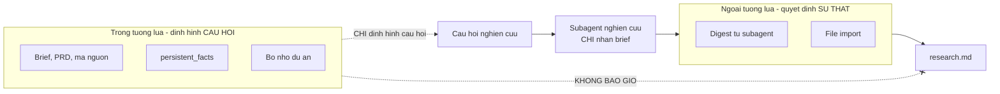
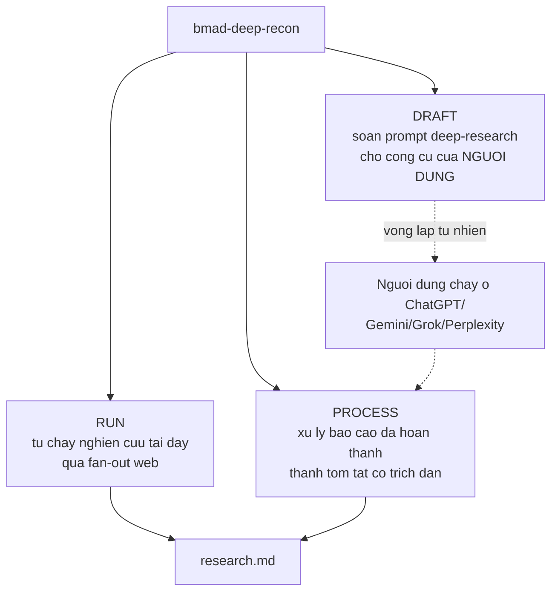
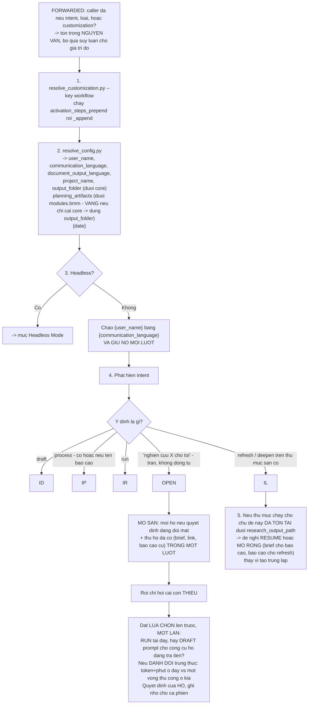
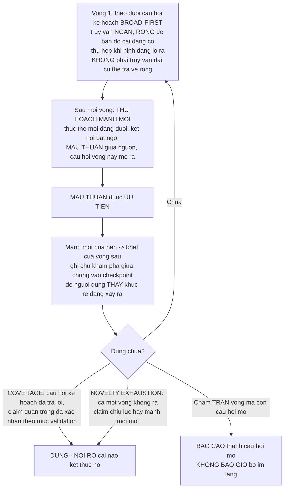
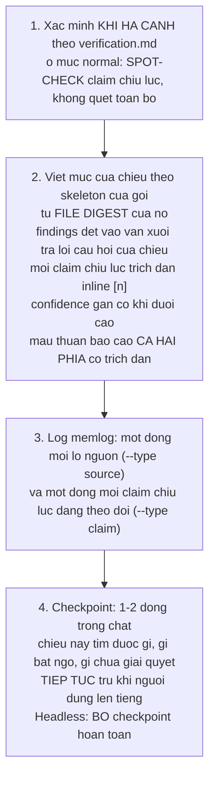
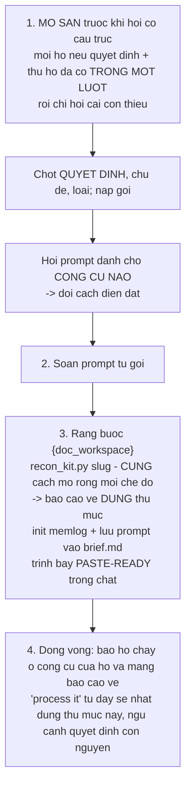
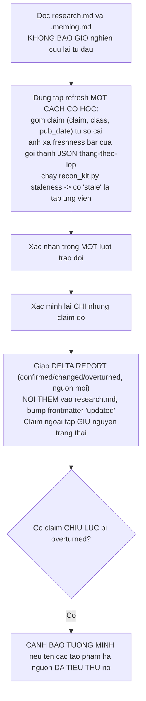

# B6 — `bmad-deep-recon`

> [← Chỉ mục](./index.md) · Trước: [B5](./B5-bmad-brainstorming.md) · Tiếp: [B7 — bmad-forge-idea](./B7-bmad-forge-idea.md)

---

## 1. Nhận diện nhanh

| Thuộc tính | Giá trị |
| --- | --- |
| Tên | `bmad-deep-recon` |
| Mã menu | `RS` |
| Args | `[type]` |
| Pha | `anytime` |
| Bắt buộc | Không |
| File | `SKILL.md`, `customize.toml` (**212 dòng — lớn nhất core**), 1 asset, **9 `references/`**, **6 `types/`**, `scripts/recon_kit.py` |
| Tạo phẩm | `research.md`, `research-briefing.html`, `brief.md`, `imports/`, `digests/`, `.memlog.md` |
| Vị trí | `src/core-skills/bmad-deep-recon/` |

**Lập trường:** *"You are **Deep Recon** — a research director, **not a search engine**."*

---

## 2. Hai quy tắc epistemics — nền tảng của toàn bộ skill

Hai quy tắc này được **kế thừa nguyên văn bởi mọi subagent** được sinh ra.

### 2.1 Không bao giờ kết luận chỉ từ dữ liệu huấn luyện

> *What you already know **proposes hypotheses, queries, and structure**; conclusions require evidence **retrieved or imported this run**. A claim you cannot evidence is stated as an unverified belief **or not at all**.*

### 2.2 Bức tường lửa nghiên cứu (research firewall)

> *Project context — briefs, PRDs, code, memory, `{workflow.persistent_facts}` — shapes **what to ask**, never **what is true**. It is **inadmissible as evidence**: every claim in a research artifact traces to a digest or import file with a source. Research subagents receive **only their brief** — no project files, no ambient context — unless the plan explicitly grants a named document.*



---

## 3. Sáu nguyên tắc làm việc

| # | Nguyên tắc | Nội dung |
| --- | --- | --- |
| 1 | **Không gì tồn tại cho đến khi thành file** | Mọi digest, trích xuất, mục báo cáo được ghi vào thư mục chạy **ngay khi nó ra đời**. Hội thoại là **kênh điều khiển**, không bao giờ là kho lưu. Một lần chạy chết giữa chừng **resume từ đĩa mà không mất gì** |
| 2 | **Trích xuất, đừng nuốt** | Báo cáo thô và kết quả tìm kiếm **không bao giờ** vào ngữ cảnh cha nguyên khối; subagent trả về digest đã lọc theo độ liên quan, cha đọc file digest **just-in-time** |
| 3 | **Một khẳng định là một câu có nguồn** | Publisher, ngày xuất bản, ngày truy cập. **Không có con số trần** |
| 4 | **Báo cáo cái có thật** | Dữ liệu công khai mỏng thì báo là mỏng; **thiếu bằng chứng là một phát hiện**; độ tươi là một phần của sự thật — số liệu thị trường 3 năm trước là **lịch sử, không phải sự kiện** |
| 5 | **Nhanh theo mặc định** | Sự nghiêm ngặt được **mua có ý thức** qua các knob, không tích tụ qua các lượt phụ. Một cổng, checkpoint nhẹ, không nghi lễ |
| 6 | **Memlog là bộ nhớ quy trình** | Mọi quyết định, lô nguồn, khẳng định chịu lực, thay đổi kế hoạch, giả định — một dòng chỉ-nối-thêm, **luôn qua script** |

> Web access là **bắt buộc** cho chế độ Run. Nếu không có ⇒ nói rõ và đề nghị Draft/Process — **không bao giờ bịa nghiên cứu**.

---

## 4. Ba dịch vụ



| Dịch vụ | Làm gì | Reference |
| --- | --- | --- |
| **Draft** | Soạn prompt deep-research mang theo craft của gói loại | `references/draft.md` |
| **Process** | Lưu báo cáo, trích claim, chưng cất tóm tắt hạ nguồn | `references/process.md` |
| **Run** | Nghiên cứu bản địa: giải effort, giữ cổng kế hoạch (**điểm dừng cứng duy nhất**), chạy vòng lặp | `references/run.md` → `verification.md` + `synthesis.md` |
| **Refresh / Deepen** | Cập nhật hoặc mở rộng thư mục chạy đã có | `references/lifecycle.md` |

**Draft → chạy ngoài → Process** là vòng lặp tự nhiên; **Run** hoàn toàn tự đứng được.

---

## 5. Kích hoạt — 5 bước



---

## 6. Sáu loại nghiên cứu (`types/`)

Tập loại là **bất cứ thứ gì** `{workflow.research_types}` phân giải ra.

| `code` | `name` | `when` | `pack` |
| --- | --- | --- | --- |
| `market` | Market Research | Cơ hội thị trường, khách hàng, cạnh tranh, quy mô, go-to-market | `types/market.md` |
| `domain` | Domain Research | Hiểu một ngành/lĩnh vực: cấu trúc, người chơi, luật, từ vựng, động lực | `types/domain.md` |
| `technical` | Technical Research | Bức tranh một mảng công nghệ, mẫu hình, cách tích hợp, thực tế triển khai | `types/technical.md` |
| `competitive` | Competitive Research | Mổ xẻ đối thủ **có tên**: chào hàng, giá, định vị, quỹ đạo, cảm nhận khách hàng của họ | `types/competitive.md` |
| `user-voice` | User-Voice Research | Người dùng thực sự trải nghiệm và muốn gì: review, cộng đồng, jobs-to-be-done | `types/user-voice.md` |
| `academic-lit` | Academic Literature | Nghiên cứu đã xuất bản: literature review, state of the art, đặt nền cho một cách tiếp cận | `types/academic-lit.md` |

### 6.1 Gói loại chứa gì

> *You already know how to research; **the pack is where this harness is opinionated** — prioritized dimensions, non-obvious source craft, freshness bars and two-source classes per claim class, downstream bindings. **Apply it in every mode; don't re-derive it.***

| Thành phần gói | Vai trò |
| --- | --- |
| **Dimensions** (chiều) | Câu hỏi nghiên cứu, đã ưu tiên |
| **Source craft** | Kỹ năng tìm nguồn không hiển nhiên |
| **Freshness bars** | Ngưỡng độ tươi cho từng lớp claim |
| **Two-source classes** | Lớp claim **bắt buộc** hai nguồn |
| **Feeds** | Ràng buộc hạ nguồn (mục brief, input PRD, ràng buộc kiến trúc) |

> **Không bao giờ tuyên bố một danh sách loại cố định — đọc tập đã phân giải.**

### 6.2 Hình dạng quyết định — trực giao với loại

| Shape | Khi nào | Thêm gì |
| --- | --- | --- |
| **explore** (mặc định) | Hiểu, đánh giá, xác thực | — |
| **select** | Chọn giữa các ứng viên | Nạp `references/selection.md`, phủ phương pháp của nó lên gói loại |

---

## 7. Chế độ Run — chi tiết

### 7.1 Effort: preset và ba knob

| Preset | `subagents` | `max_sources_per_round` | `max_depth` |
| --- | --- | --- | --- |
| `quick` | low (2) | 5 | 1 |
| **`standard`** (mặc định) | normal (3) | 8 | 2 |
| `deep` | high (6) | 12 | 3 |

**Thứ tự ưu tiên:** *yêu cầu của người dùng* > *knob ghim riêng* > *preset*.

| Knob | Giá trị | Ghi chú |
| --- | --- | --- |
| `subagents` | `none` (0 — nội tuyến tuần tự; cũng là fallback khi harness không có subagent), `low` (2), `normal` (3), `high` (6, trần 10) | Điểm ngọt là 3–5; vượt chỉ cho việc thực sự rộng |
| `max_sources_per_round` | Số nguồn **khác nhau thực sự đọc** mỗi chiều mỗi vòng (trần 25) | |
| `max_depth` | Số vòng mỗi chiều (trần 5) | **Là trần, không phải hạn ngạch** — chiều dừng sớm khi đủ phủ hoặc cạn cái mới |
| `validation` | `normal` < `high` < `max` | **Trực giao** với preset |

`{workflow.subagent_models}` là thứ tự ưu tiên model cho trợ lý — cái đầu tiên khả dụng thắng; rỗng = mặc định harness.

> Giữ **lead** ở model mạnh nhất; researcher tối đa thấp hơn một bậc; **việc phán đoán không bao giờ ở bậc nhỏ nhất**.

### 7.2 Cổng kế hoạch — điểm dừng cứng duy nhất

Trình bày dạng **checklist gọn**, lấy phê duyệt. Nội dung:

| Mục | Nội dung |
| --- | --- |
| Quyết định | Quyết định cần phục vụ |
| Loại + chiều | Loại và các chiều từ gói, **đã tỉa cho khớp quyết định** |
| Shape | explore hay select |
| **Topology phân rã** | Xem bảng dưới |
| Knob | Knob đang hiệu lực và **mỗi cái đến từ đâu** |
| Bề mặt tìm kiếm | Web search của harness; MCP tool dạng search đã cài; `{workflow.external_sources}` — **kiểm tra, đừng giả định** |
| Workflow orchestration | Có chạy fan-out dạng workflow không (khi harness có và `{workflow.use_workflows}` cho phép) |
| Ước lượng thời gian **trung thực** | Run `standard` là **vài phút**; run `deep` là **hàng chục phút và gấp nhiều lần token** |

**Ba topology:**

| Topology | Khi nào | Chia việc thế nào |
| --- | --- | --- |
| **breadth-first** | Các câu hỏi con độc lập | Trợ lý chia theo **chiều** |
| **depth-first** | Một câu hỏi cần nhiều góc nhìn | Trợ lý chia theo **góc nhìn hoặc phương pháp luận**, không theo chiều |
| **straightforward** | Một câu hỏi tập trung | **Một** trợ lý, vài lệnh gọi, **không fan-out** — không bao giờ đầu tư quá mức cho truy vấn đơn giản |

Sau khi được duyệt:

```bash
# Ràng buộc thư mục chạy — TẤT ĐỊNH, cùng chủ đề luôn ra cùng thư mục
uv run scripts/recon_kit.py slug "<topic>" --type <type> --pattern "{workflow.run_folder_pattern}"

# Gieo research.md từ template
# Khởi tạo memlog
uv run {project-root}/_bmad/scripts/memlog.py init --workspace {doc_workspace} \
  --field topic="<topic>" --field type="<type>" \
  --field decision="<decision>" --field preset="<preset>"

# Log kế hoạch đã duyệt
uv run {project-root}/_bmad/scripts/memlog.py append --workspace {doc_workspace} \
  --type decision --text "<kế hoạch đã duyệt>"
```

Rồi **nói cho người dùng đường dẫn**.

### 7.3 Cấu trúc thư mục chạy

```
{doc_workspace}/
├── brief.md              # prompt đã soạn (chế độ Draft)
├── imports/              # báo cáo gốc, NGUYÊN VẸN (chế độ Process)
├── digests/              # <dimension>-r<round>-<n>.md — một file/trợ lý/vòng
├── research.md           # báo cáo, LỚN DẦN khi vật liệu về
├── research-briefing.html # trang trình bày (tùy chọn)
└── .memlog.md            # sổ cái
```

> *the report grows as material lands: **the user watches the document build, not a spinner**.*

### 7.4 Vòng và lần theo manh mối



### 7.5 Van dừng-và-viết

> *If the run is dragging well past the plan gate's estimate — rounds queuing, budgets mostly spent — **stop spawning**, synthesize from the digests already on disk, and report the remainder as open questions with a route. **A shorter honest report beats a longer stale one.***

### 7.6 Brief của trợ lý nghiên cứu

Mỗi trợ lý chạy **sau tường lửa** — chỉ nhận brief, không có gì khác. Brief chứa:

| Thành phần | Nội dung |
| --- | --- |
| Câu hỏi | Câu hỏi nó sở hữu, quyết định chúng phục vụ, và chủ đề |
| Bề mặt tìm kiếm | **Tool chuyên biệt trước** (MCP dạng search, `{workflow.external_sources}` khớp directive) rồi mới search chung; `{workflow.preferred_sources}` trước / `{workflow.banned_sources}` **không bao giờ** |
| Craft | Source craft và freshness bar của gói + thẻ chất lượng nguồn |
| Ngân sách | Nguồn (phần chia của `max_sources_per_round`) và tool call, **tỉ lệ theo việc**: < 5 cho tra cứu đơn giản, ~5 trung bình, ~10 khó, 15 cho việc thật sự nhiều phần, **20 không bao giờ vượt**. Hết ngân sách nào ⇒ tổng hợp từ cái đang có |
| Query craft | Truy vấn **ngắn (≤ ~5 từ)** thắng truy vấn siêu cụ thể trả về rỗng; nới rộng khi kết quả thưa, thu hẹp khi dồi dào; **không lặp truy vấn y hệt trên cùng tool**; sau **mỗi** kết quả tool, **dừng và đánh giá** — cái này thêm được gì, còn khoảng trống nào, truy vấn tốt nhất kế tiếp là gì — trước khi bắn tiếp |
| Epistemics | **Nguyên văn** hai quy tắc |
| Hợp đồng trả về | **Digest, không phải kết quả thô** — findings dạng claim, mỗi cái có `{claim, source, publisher, pub_date, accessed, confidence, class}`, cộng manh mối đáng đuổi và **cái nó đã tìm mà không thấy** |

> **Khi mỗi trợ lý trả về, ghi digest vào `{doc_workspace}/digests/` TRƯỚC KHI làm bất cứ gì khác với nó.**

### 7.7 Thẻ chất lượng nguồn

**Ưu tiên nguồn sơ cấp** — hồ sơ nộp, văn bản cơ quan quản lý, tài liệu chính thức, bài báo gốc, số liệu tự công bố của công ty — hơn nguồn tổng hợp và tường thuật thứ cấp.

**Cờ đỏ hạ độ tin cậy ngay:**

| Cờ đỏ | Ví dụ |
| --- | --- |
| Ngôn ngữ suy đoán | "could", "may", dự báo ở thì tương lai trình bày như phát hiện |
| Giọng marketing | |
| Bị động với nguồn không tên | |
| Số liệu cherry-pick hoặc không nguồn | |
| Aggregator tái chế một báo cáo thượng nguồn | **Đó là một publisher**, dù bao nhiêu domain lặp lại |

> Answer engine (Perplexity Sonar, Grok, và đồng loại) **cũng là aggregator**, dù tổng hợp có tốt đến đâu: **đuổi theo trích dẫn của chúng và trích dẫn cái đó**, không bao giờ trích dẫn engine.

**Giải quyết xung đột:** theo độ mới, tính nhất quán với sự kiện đã lập kề bên, và chất lượng publisher — **không bao giờ bằng cách lấy trung bình**.

### 7.8 Tổng hợp một chiều



**Định dạng dòng claim — máy đọc được:**

```
ref=[n] status=<verified|unverified|disputed|overturned> class=<class> pub=<YYYY-MM> — <claim>
```

Nhờ định dạng này mà `recon_kit.py tally` và `staleness` đọc được sổ cái. Thay đổi trạng thái sau này là **một dòng claim mới cùng `ref=`** — **trạng thái cuối thắng**.

---

## 8. Xác minh — `references/verification.md`

### 8.1 Nguyên tắc thời điểm

> *Verification happens **as material lands**, per dimension, in **fresh-context verifier subagents** reading digest files — **never as an end-of-run rewrite pass** over an hour of accumulated context. **Late-pass rewrites degrade reports; landing-time checks improve them.***

### 8.2 Ba mức validation

| Mức | Làm gì |
| --- | --- |
| **`normal`** (mặc định) | Spot-check **chỉ claim chịu lực** — số ít mỗi chiều mà khuyến nghị thực sự dựa vào. **Một** lần kiểm tra nguồn độc lập mỗi cái, khi hạ cánh. Mọi thứ khác ship với nguồn đơn được trích dẫn và confidence đánh dấu trung thực. **Nhanh theo thiết kế** |
| **`high`** | Kiểm chéo **mọi claim thuộc lớp two-source** của gói, và chạy red-team pass trên các kết luận lớn **bất kể** `{workflow.red_team}` |
| **`max`** | Kiểm chéo **mọi** claim trong sổ cái, red-team ở **độ rộng đầy đủ**, và **ưu tiên nguồn sơ cấp**: nơi có nguồn sơ cấp, tường thuật thứ cấp một mình **không** xác minh được |

### 8.3 "Độc lập" nghĩa là gì

> *A different **publisher** with **different underlying data or reporting** — not a syndication, quote, or republication of the first source, and **not the same vendor's marketing in two places**.*

> *An imported report counts as **one publisher** regardless of how many sources it cites internally; **two imports from different tools agreeing is genuine confirmation**, and their **disagreement is a finding**.*

### 8.4 Bốn kết cục mỗi claim

| Kết cục | Nghĩa |
| --- | --- |
| **verified** | Nguồn độc lập đồng ý trong dung sai — với claim định lượng: **cùng bậc độ lớn và cùng chiều** |
| **disputed** | Nguồn độc lập bất đồng về bản chất — **báo cáo cả hai con số, cả hai đều trích dẫn; không bao giờ lấy trung bình** |
| **unverified** | Không kiểm tra độc lập được trong ngân sách — claim **vẫn ở lại**, có cờ, và vào bản đồ staleness |
| **overturned** | Trọng lượng bằng chứng bác bỏ nó — sửa trong văn bản, ghi chú bản gốc |

> *A verification outcome adjusts status and flags — it **never licenses rewriting a finding's substance** beyond what the new evidence says.*

### 8.5 Confidence trong báo cáo

| Mức | Điều kiện |
| --- | --- |
| **high** | verified, tươi, publisher đáng tin |
| **medium** | nguồn đơn đáng tin, tươi |
| **low** | cũ, publisher yếu, hoặc disputed |
| **`unverified`** | Cờ tường minh |

> **Confidence là per-claim, không bao giờ per-section.**

### 8.6 Red-team pass

**Cơ chế đối kháng duy nhất** — không verifier nào khác lặp lại nó.

| `{workflow.red_team}` | Hành vi |
| --- | --- |
| `"off"` (mặc định) | Không chạy |
| `"offer"` | Đề xuất tại cổng kế hoạch |
| `"on"` | Luôn chạy |

Ngoài ra: `validation = high` bao gồm nó cho kết luận lớn; `max` chạy nó ở độ rộng đầy đủ.

**Cách chạy:** với mỗi kết luận lớn, một subagent hoài nghi **ngữ cảnh mới** — chỉ nhận kết luận và ngân sách tìm kiếm, **không có bằng chứng hỗ trợ, không có ngữ cảnh lần chạy** — đi săn bằng chứng phản bác: luận điểm gấu, các nỗ lực thất bại, dữ liệu trái chiều, lập luận thiện chí mạnh nhất rằng kết luận sai.

**Xử lý kết quả:** cân nhắc, **không phải nối vào**:

| Tình huống | Xử lý |
| --- | --- |
| Kết luận sống sót | **Thừa nhận** phản luận mạnh nhất của nó trong phần tổng hợp |
| Kết luận không sống sót | **Sửa lại trước khi** báo cáo nêu nó |
| Phát hiện có trọng lượng | Vào mục **Contrary Evidence** với đầy đủ kỷ luật trích dẫn |
| **Không có phát hiện** sau tìm kiếm thật | **Cũng đáng báo cáo** — nói đã tìm cái gì và không thấy |

---

## 9. Tổng hợp — `references/synthesis.md`

> **Ngắn gọn là hợp đồng**: findings và verdict, **không phải tiểu luận**; lý lẽ nằm ở memlog; người đọc có được sự thật liên quan tới quyết định **trong vài phút**.

### 9.1 Tám phần của `research.md`

| # | Phần | Nội dung |
| --- | --- | --- |
| 1 | **Executive summary** | **Quyết định trước**: bằng chứng nói nên làm gì, hai–ba phát hiện dẫn tới câu trả lời đó, và cảnh báo lớn nhất. **Tối đa một trang**, đọc độc lập được. **Viết cuối cùng, đặt đầu tiên** |
| 2 | **Dimension sections** | Đã viết trong vòng lặp; giờ hòa giải: thuật ngữ nhất quán, không lặp đất, trạng thái xác minh và mọi sửa chữa đã áp vào văn bản |
| 3 | **Cross-dimension insights** | Cái **chỉ sự kết hợp** mới cho thấy (ví dụ: thị trường đang lớn nhưng chiều pháp lý chặn phân khúc tiếp cận được; lựa chọn ưu việt kỹ thuật lại thua về sức khỏe hệ sinh thái). **Đây là chỗ bộ khung chứng minh giá trị** — nếu không có insight xuyên chiều, **nói vậy chứ đừng chế ra** |
| 4 | **Contrary evidence** | Khi red-team đã chạy và tìm được vật liệu; phản luận sống sót mạnh nhất, có trích dẫn |
| 5 | **Recommendations** | Mỗi cái buộc vào quyết định và, nơi dự án có, vào tạo phẩm hạ nguồn tiêu thụ nó (theo mục `Feeds` của gói). **Mỗi khuyến nghị nêu cơ sở confidence của nó**; khuyến nghị dựa trên claim confidence thấp hoặc disputed **phải nói vậy trong cùng câu** |
| 6 | **Open questions** | Nghiên cứu không trả lời được gì, và cần gì để trả lời từng cái |
| 7 | **Source appendix** | Bảng nguồn đánh số: `[n] \| claim/finding nó hỗ trợ \| publisher \| pub date \| accessed \| confidence`, ô publisher là **link markdown** tới URL. **Mọi `[n]` inline phải phân giải được về đây** |
| 8 | **Staleness map** | Claim già nhanh nhất — **tính toán, không suy tay**: dựng danh sách claim từ sổ cái, ánh xạ freshness bar của gói thành số tháng theo lớp, chạy `recon_kit.py staleness` — render ngày kiểm lại và kết bằng ghi chú cái sớm nhất. **Đây là lệnh việc cho Refresh** |

### 9.2 Cập nhật cuối

```bash
# Đếm — KHÔNG BAO GIỜ đếm tay
uv run scripts/recon_kit.py tally {doc_workspace}/.memlog.md
```

Cập nhật frontmatter (`status: complete`, `updated`, số verified/unverified từ `tally`), log `event` cuối, rồi sang `references/finalize.md`.

---

## 10. Chế độ Draft — `references/draft.md`



**Prompt phải chứa:**

| Thành phần | Nội dung |
| --- | --- |
| Các chiều | Dưới dạng câu hỏi nghiên cứu tường minh, **đã tỉa cho khớp quyết định** |
| Freshness bar | Dưới dạng yêu cầu độ mới |
| Two-source | Kỳ vọng hai nguồn cho các lớp claim quan trọng |
| Audience | |
| Chính sách nguồn | `preferred_sources` nêu tên là nguồn nên ưu tiên; `banned_sources` là nguồn **không bao giờ** trích dẫn |
| **Yêu cầu trích dẫn không thương lượng** | Mọi claim kèm URL nguồn và ngày xuất bản; **báo cáo bằng chứng trái chiều; thừa nhận khoảng trống thay vì độn** |
| Cấu trúc đầu ra | Sao cho Process **trích xuất sạch được** (findings theo chiều, một danh sách nguồn) |

**Điều chỉnh theo công cụ:**

| Công cụ | Điều chỉnh |
| --- | --- |
| Deep-research agent hosted | Xử lý được phạm vi rộng và danh sách nguồn dài |
| Công cụ social-native (Grok) | **Xứng đáng** với chiều user-voice và sentiment |
| Không biết | Viết **trung tính công cụ** |

---

## 11. Chế độ Process — `references/process.md`

```mermaid
graph TB
  A["1. FILE IT<br/>Neu da co brief da soan cho chu de nay -> DO la thu muc dich<br/>Neu khong -> suy loai + chu de tu bao cao (xac nhan MOT DONG)<br/>rang buoc doc_workspace (recon_kit.py slug), init memlog<br/>Chuyen/chep BAN GOC vao imports/ NGUYEN VEN"]
  A --> A1["Do trung thuc day du duoc bao ton O DAY va KHONG DAU KHAC"]
  A1 --> B["2. GHI PROVENANCE vao memlog<br/>cai gi sinh ra no (cong cu/hang nao)<br/>khi nao (HOI neu khong ro - ngay san xuat quyet dinh staleness)<br/>nguoi dung muon quyet dinh gi tu no"]
  B --> C["3. TRICH XUAT<br/>Subagent (ngu canh moi, quy tac tuong lua) doc import<br/>keo MOI claim lien quan quyet dinh vao digests/<br/>hinh dang chuan {claim, source, publisher, pub_date, accessed, confidence, class}<br/>GIU trich dan cua ban goc: nguon duoc trich la publisher, import la 'via'"]
  C --> C1["Nhieu import -> moi cai mot digest rieng<br/>MAU THUAN giua chung la PHAT HIEN, khong phai nhieu"]
  C1 --> D["4. DOI CHIEU VOI GOI<br/>chieu nao duoc phu, chieu nao con mo,<br/>cho nao claim thuoc lop two-source ma chi dua tren MOT publisher<br/>Xac minh theo muc validation"]
  D --> E["5. CHUNG CAT vao research.md theo synthesis.md<br/>tom tat ngan gon, co trich dan, quyet-dinh-truoc<br/>frontmatter day du metadata (topic, type, decision, source:, dates, status)"]
  E --> E1["DAY la tao pham skill ha nguon doc<br/>KHONG AI BAO GIO xu ly lai import<br/>Chieu con mo liet ke TRUNG THUC kem MOT DONG lo trinh"]
  E1 --> F["6. Finalize"]
```



---

## 12. Hình dạng Select — `references/selection.md`

Áp dụng khi quyết định là **chọn giữa các ứng viên**. Gói loại vẫn chi phối nguồn, craft, độ tươi; hình dạng này chi phối **luồng và phán quyết**.

| Bước | Nội dung |
| --- | --- |
| **1. Khung yêu cầu** | Người thắng phải làm được gì, dưới ràng buộc nào — quy mô, tuân thủ, ngân sách, kỹ năng đội, stack hiện có, mức chịu đựng chi phí thoát? **Tách cổng cứng khỏi ưu tiên có trọng số** và đặt trọng số. Nguồn: **chính dự án** (brief, PRD, spine, `persistent_facts`, codebase) và người dùng — **web research không đặt yêu cầu**. **Thống nhất khung TRƯỚC khi nghiên cứu ứng viên nào chạy** |
| **2. Sàng lọc ứng viên** | Lập trường có uy tín — leader, challenger mạnh, **một wildcard** — và cắt cái nào trượt cổng cứng. Sàng còn **3–5** chung kết; ghi lại đã cắt gì và vì sao. **Nguồn sàng lọc ≤ 6 tháng** — lĩnh vực này chuyển động |
| **3. Bằng chứng theo tiêu chí** | Chấm điểm chung kết theo khung, dùng chiều và craft của gói loại, xác minh với **phiên bản/chào hàng hiện tại**. Trích dẫn mọi ô gây tranh cãi; nơi tuyên bố của vendor và trải nghiệm độc lập phân kỳ, **sự phân kỳ đó là một phát hiện** |
| **4. Chi phí & khóa chân** | Tổng chi phí trên chân trời sản phẩm — license/subscription, hosting, tải vận hành, đường cong học — và **chi phí rời đi**. Đọc thẳng trang giá hiện tại (≤ 3 tháng, **luôn luôn**); lịch sử đổi giá — **vendor đã đổi giá một lần sẽ đổi nữa**; migration-away tính chi phí thoát thật |
| **5. Phán quyết** | **Ma trận quyết định có trọng số — hiện phần chấm điểm, không chỉ tổng**: *"a matrix the user can re-weight is worth more than a verdict they must trust"*. Rồi: lựa chọn; á quân **có tên** và điều kiện nó thắng thay; luận điểm mạnh nhất **chống** lựa chọn; **hàng rào đảo ngược rẻ nhất** (đường nối trừu tượng, phạm vi thí điểm, phép thử thoát) |

**Two-source classes bổ sung:** con số giá; con số hiệu năng/quy mô; **bất kỳ ô nào quyết định giữa hai chung kết đứng đầu**.

**Staleness:** báo cáo select cũ hơn **hai quý** nên refresh trước khi ai đó hành động — **nói điều đó trong báo cáo**.

---

## 13. Refresh và Deepen — `references/lifecycle.md`

### 13.1 Refresh



### 13.2 Deepen

Khoan sâu vào **một** chiều hoặc thêm chiều mới **mà không chạm phần còn lại**: cổng kế hoạch mini, acquire → verify **chỉ cho lát đó** (hoặc prompt follow-up khi công cụ của người dùng phù hợp hơn), gộp vào `research.md`, **chỉ** cập nhật các mục tổng hợp mà vật liệu mới ảnh hưởng.

> *a deepening that changes no conclusion **says so**.*

---

## 14. Finalize — `references/finalize.md`

| # | Bước |
| --- | --- |
| 1 | `research.md` hoàn chỉnh theo `synthesis.md`. Frontmatter metadata (`type`, `topic`, `decision`, `source`, `status`, dates) là **thứ cho phép mọi người tiêu thụ hạ nguồn tin nó mà không xử lý lại** |
| 2 | **Kiểm tra trích dẫn — cơ học trước, ngữ nghĩa sau** (xem dưới) |
| 3 | Render theo `{workflow.output_format}` |
| 4 | **Polish:** áp từng mục `{workflow.doc_standards}` (chỉ thị `skill:`, `file:`, hoặc text thuần) lên `research.md` |
| 5 | Thực thi từng `{workflow.external_handoffs}` — gọi tool, đưa URL trả về ra; **bỏ qua và gắn cờ** tool không có |
| 6 | Nói cho người dùng **cái gì tồn tại và ở đâu** — report, briefing, imports, memlog — cộng bản đồ staleness nói kiểm lại gì và khi nào, và Refresh/Deepen lo việc đó. **Gọi `bmad-help`** để gợi ý bước kế |
| 7 | Chạy `{workflow.on_complete}` nếu không rỗng |

### 14.1 Kiểm tra trích dẫn hai tầng

```bash
# Tầng CƠ HỌC — script làm, tất định
uv run scripts/recon_kit.py citations {doc_workspace}/research.md
```

Script diff các marker `[n]` inline với appendix và liệt kê **chính xác** marker treo lơ lửng và dòng mồ côi. **Sửa cái nó báo.**

**Tầng NGỮ NGHĨA** — subagent ngữ cảnh mới làm **chỉ nửa phán đoán**: nguồn được trích **có thực sự nói** cái văn bản khẳng định không? Nó **không bao giờ viết lại findings** — claim mà nguồn không chống lưng thì bị **hạ confidence** và ghi log `event` về sự lệch đó.

### 14.2 `{workflow.output_format}`

| Giá trị | Hành vi |
| --- | --- |
| `"auto"` (mặc định) | Render briefing ở lần chạy **tương tác**; **bỏ qua** ở headless/skill-invoked |
| `"html"` / `"both"` | **Luôn** render |
| `"md"` | **Không bao giờ** render |

> `research.md` **luôn tồn tại** — briefing là **bộ mặt tái sinh được** của nó.

---

## 15. HTML briefing — `references/html-briefing.md`

> *The page is a **full-fidelity presentation** of the report, **never a second source of truth** — same claims, same numbers, same citations; nothing is lost by reading it instead of the markdown.*

| Yêu cầu | Nội dung |
| --- | --- |
| **Tự chứa một file** | Inline CSS và JS, **không request ngoài dưới bất kỳ hình thức nào** (không CDN, không font, không ảnh remote). Phải render được từ `file://`, offline, **mãi mãi** |
| **Cấu trúc** | header (topic, type, decision, date, depth, verification level) → executive summary là card mở đầu → mục lục dính → các mục chiều → contrary evidence (khi có) → recommendations → source appendix gấp mở được → staleness map |
| **Confidence là thị giác** | Mỗi claim mang badge — verified / medium / low / `unverified` / disputed — **mã màu với text trạng thái LUÔN hiện diện (không bao giờ chỉ dùng màu)**. **Unverified và disputed phải NỔI BẬT HƠN verified, không phải kém hơn** |
| **Nguồn sống** | `[n]` inline link tới dòng appendix; dòng appendix link ra URL nguồn |
| **Charts tiết chế** | Chỉ nơi dữ liệu **thực sự hưởng lợi** (quỹ đạo quy mô thị trường, điểm ma trận quyết định) — SVG inline đơn giản, trục có nhãn, **không thư viện** |
| **Responsive + theme-aware** | Đọc được trên điện thoại; tôn trọng `prefers-color-scheme` |

### 15.1 Bảo mật: URL nguồn là nội dung không tin cậy

> **Never hand-escape them:**

```bash
uv run scripts/recon_kit.py escape-sources {doc_workspace}/research.md
```

Script escape **mọi ô**, gắn neo mỗi dòng (`id="src-n"`), và **chỉ link URL `http(s)` đã validate** (thứ khác render thành text thuần; script liệt kê chúng trong `invalid_urls`).

**Áp cùng kỷ luật escape** cho mọi text khác lấy từ nguồn mà bạn đặt vào attribute.

### 15.2 Theme

`{workflow.html_theme}`: đường dẫn `file:` nạp spec theme/brand; text inline áp làm chỉ thị; rỗng = mặc định shipped (trung tính, chuyên nghiệp, khoảng trắng rộng rãi, system font stack, một màu nhấn tiết chế).

> **Dù theme nào, ngữ nghĩa confidence-badge ở trên là KHÔNG THƯƠNG LƯỢNG.**

---

## 16. Chế độ Headless

| Quy tắc | Nội dung |
| --- | --- |
| **Không hỏi** | |
| Mặc định | Research trần ⇒ **run**; báo cáo có tên ⇒ **process**; xin prompt ⇒ **draft** (file brief là deliverable) |
| Plan-and-proceed | Suy loại, dựng từ gói, giữ knob đã cấu hình + bất cứ gì trong lời gọi (**red team và workflow orchestration chỉ khi đặt `"on"`**), bỏ checkpoint |
| Ghi log | Mọi phán đoán log thành `assumption` |
| Halt | `blocked` **chỉ khi** không suy ra được chủ đề hoặc thư mục đích |
| Kết thúc | Bằng JSON (xem dưới) |

```json
{
  "status": "complete",
  "intent": "run",
  "type": "market",
  "report": "{doc_workspace}/research.md",
  "memlog": "{doc_workspace}/.memlog.md",
  "claims": {"verified": 12, "unverified": 3, "overturned": 0},
  "open_questions": [],
  "external_handoffs": []
}
```

| Biến thể | Thêm/đổi |
| --- | --- |
| Draft | Thêm `"brief"` |
| Process | Thêm `"imports"` |
| Refresh | Thay phạm vi `claims` bằng tập refresh + mảng `deltas` |
| `output_format = "auto"` | Headless **không** sinh briefing; thêm `"briefing"` khi có render |

> **`claims` đến từ `recon_kit.py tally`, KHÔNG BAO GIỜ đếm tay.** Bỏ key cho tạo phẩm không được sinh ra.

---

## 17. `customize.toml` — 24 trường

```toml
[workflow]

activation_steps_prepend = []
activation_steps_append = []
persistent_facts = []

research_output_path = "{planning_artifacts}/research"
run_folder_pattern  = "{research_type}-{topic_slug}-{date}"
research_template   = "assets/research.template.md"

preset                = "standard"    # quick | standard | deep
subagents             = ""            # none | low | normal | high — rỗng = theo preset
max_sources_per_round = 0             # 0 = theo preset, trần 25
max_depth             = 0             # 0 = theo preset, trần 5
validation            = "normal"      # normal | high | max
red_team              = "off"         # off | offer | on
use_workflows         = "offer"

subagent_models   = []
preferred_sources = []
banned_sources    = []
external_sources  = []

output_format = "auto"                # auto | md | html | both
html_theme    = ""
audience      = ""

doc_standards     = ["skill:bmad-review lenses=structure,prose"]
external_handoffs = []
on_complete       = ""

[[workflow.research_types]]
code = "market"
name = "Market Research"
when = "..."
pack = "types/market.md"
# ... 5 loại nữa
```

### 17.1 Trường đáng chú ý

| Trường | Ghi chú |
| --- | --- |
| `research_output_path` | Mặc định `{planning_artifacts}/research` — **vắng khi chỉ cài core** ⇒ dùng `{output_folder}` |
| `run_folder_pattern` | Mở rộng **tất định** qua `recon_kit.py slug` ⇒ cùng chủ đề luôn ra cùng thư mục ở **mọi chế độ** |
| `doc_standards` | Mặc định gọi `skill:bmad-review lenses=structure,prose` — đây là ví dụ điển hình của **skill core gọi skill core** |
| `research_types` | Mảng bảng khóa `code` — override thay loại trùng, nối loại mới |

---

## 18. `recon_kit.py` — 5 lệnh

```bash
SK=".claude/skills/bmad-deep-recon"

# Mở rộng tên thư mục chạy — TẤT ĐỊNH
uv run "$SK/scripts/recon_kit.py" slug "thị trường SaaS quản lý kho" \
  --type market --pattern "{research_type}-{topic_slug}-{date}"

# Đếm claim theo trạng thái từ sổ cái
uv run "$SK/scripts/recon_kit.py" tally <workspace>/.memlog.md

# Tính claim nào đã cũ
uv run "$SK/scripts/recon_kit.py" staleness <claims.json> --windows '<map>'

# Kiểm tra trích dẫn cơ học
uv run "$SK/scripts/recon_kit.py" citations <workspace>/research.md

# Sinh bảng nguồn HTML đã escape an toàn
uv run "$SK/scripts/recon_kit.py" escape-sources <workspace>/research.md
```

| Lệnh | Vai trò | Vì sao là script chứ không phải LLM |
| --- | --- | --- |
| `slug` | Mở rộng tên thư mục | Phải **tất định** để cùng chủ đề ra cùng thư mục |
| `tally` | Đếm claim theo trạng thái | **Đếm không giao cho LLM** |
| `staleness` | Tính claim cũ | Phép tính ngày tháng — tất định |
| `citations` | Diff `[n]` với appendix | So khớp cơ học — chính xác 100% |
| `escape-sources` | Escape HTML cho URL nguồn | **Bảo mật** — hand-escape là lỗ hổng |

---

## 19. Vận hành thủ công

```bash
R="$(pwd)"
SK="$R/.claude/skills/bmad-deep-recon"

# ── Xem cấu hình hiện hành ─────────────────────────────────────
uv run "$R/_bmad/scripts/resolve_customization.py" -s "$SK" -p "$R" -k workflow

# Xem các loại nghiên cứu
uv run "$R/_bmad/scripts/resolve_customization.py" -s "$SK" -p "$R" -k workflow.research_types

# ── Đọc gói loại ───────────────────────────────────────────────
cat "$SK/types/market.md"
cat "$SK/types/technical.md"

# ── Đọc phương pháp từng chế độ ────────────────────────────────
cat "$SK/references/run.md"
cat "$SK/references/verification.md"
cat "$SK/references/selection.md"

# ── Mở rộng tên thư mục chạy ───────────────────────────────────
uv run "$SK/scripts/recon_kit.py" slug "quản lý kho SaaS" \
  --type market --pattern "{research_type}-{topic_slug}-{date}"

# ── Tự dựng một thư mục chạy ───────────────────────────────────
W="$R/_bmad-output/planning-artifacts/research/market-quan-ly-kho-saas-2026-08-11"
mkdir -p "$W/digests" "$W/imports"

uv run "$R/_bmad/scripts/memlog.py" init --workspace "$W" \
  --field topic="Thị trường SaaS quản lý kho VN" \
  --field type="market" \
  --field decision="Có nên vào thị trường này không" \
  --field preset="standard"

uv run "$R/_bmad/scripts/memlog.py" append --workspace "$W" \
  --type decision --text "kế hoạch đã duyệt: 4 chiều, breadth-first, standard preset"

uv run "$R/_bmad/scripts/memlog.py" append --workspace "$W" \
  --type source --text "lô 1: 6 nguồn về quy mô thị trường"

uv run "$R/_bmad/scripts/memlog.py" append --workspace "$W" \
  --type claim \
  --text "ref=[3] status=verified class=market-size pub=2026-03 — thị trường WMS VN đạt 45 triệu USD 2025"

# ── Đếm claim ──────────────────────────────────────────────────
uv run "$SK/scripts/recon_kit.py" tally "$W/.memlog.md"
```

---

## 20. Cạm bẫy

| Vấn đề | Nguyên nhân | Xử lý |
| --- | --- | --- |
| Kết luận không có nguồn | Vi phạm epistemics quy tắc 1 | Đây là lỗi nghiêm trọng nhất — mọi claim phải truy được về digest/import |
| Subagent thấy file dự án | Vi phạm tường lửa | Subagent **chỉ** nhận brief |
| Trích dẫn answer engine | Vi phạm thẻ chất lượng nguồn | Đuổi theo citation của engine, trích dẫn cái đó |
| Lấy trung bình khi nguồn bất đồng | Vi phạm quy tắc `disputed` | **Báo cáo cả hai con số** |
| Digest vào ngữ cảnh cha nguyên khối | Vi phạm nguyên tắc 2 | Ghi file trước, đọc JIT sau |
| Xác minh dồn cuối lần chạy | Vi phạm nguyên tắc thời điểm | *"Late-pass rewrites degrade reports"* |
| Đếm claim bằng tay | Vi phạm ràng buộc `tally` | Luôn dùng `recon_kit.py tally` |
| Hand-escape URL trong HTML | Lỗ hổng bảo mật | Dùng `escape-sources` |
| Bịa insight xuyên chiều | Vi phạm §9.1 mục 3 | *"say so rather than manufacture them"* |
| Chạy quá lâu | Không dùng van dừng-và-viết | Tổng hợp từ digest đã có, báo phần còn lại là câu hỏi mở |

---

**Tiếp:** [B7 — bmad-forge-idea](./B7-bmad-forge-idea.md) · [← Chỉ mục](./index.md)
