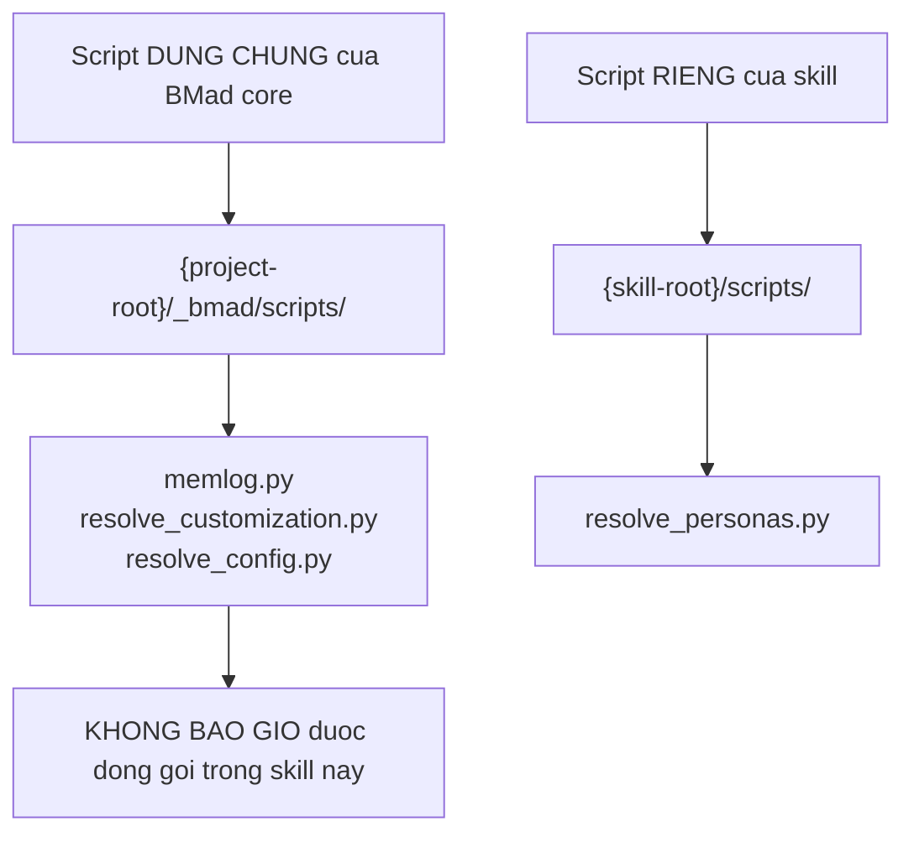
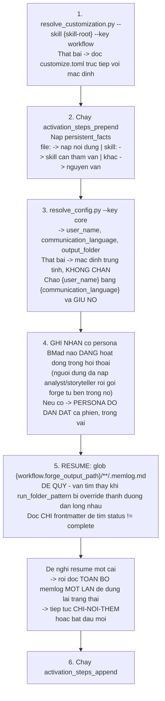
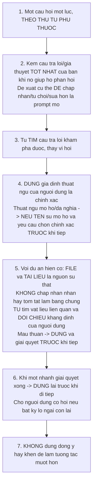
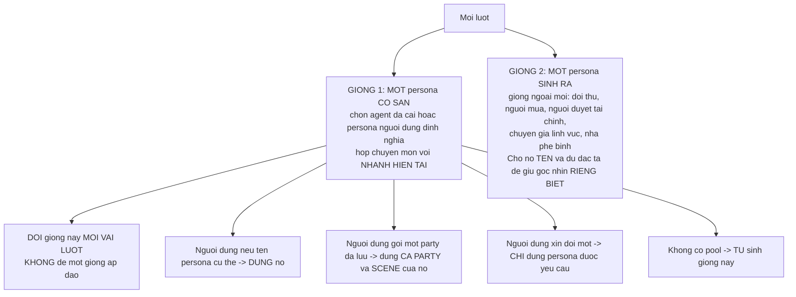
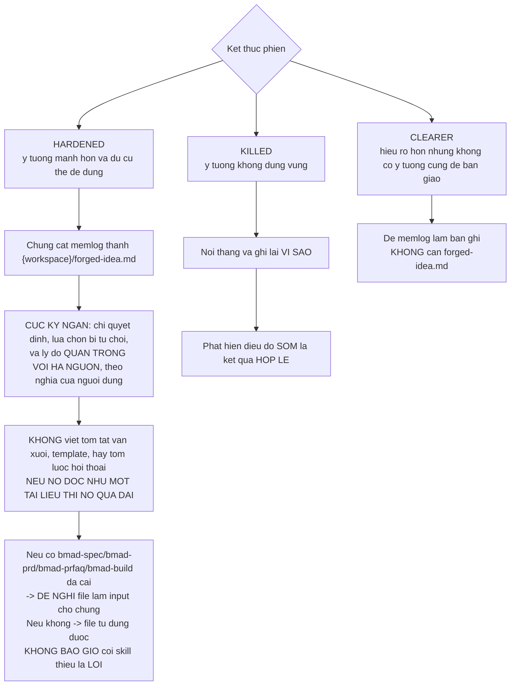
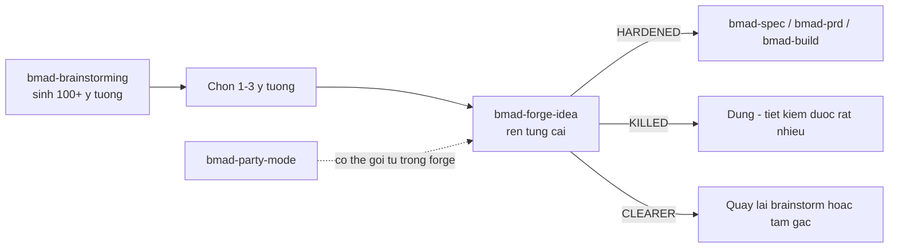

# B7 — `bmad-forge-idea`

> [← Chỉ mục](./index.md) · Trước: [B6](./B6-bmad-deep-recon.md) · Tiếp: [B8 — bmad-party-mode](./B8-bmad-party-mode.md)

---

## 1. Nhận diện nhanh

| Thuộc tính | Giá trị |
| --- | --- |
| Tên | `bmad-forge-idea` |
| Mã menu | `FI` |
| Pha | `anytime` |
| Bắt buộc | Không |
| File | `SKILL.md`, `customize.toml`, `scripts/resolve_personas.py` (275 dòng) |
| `references/` | ❌ Không có — toàn bộ logic nằm trong `SKILL.md` |
| Tạo phẩm | `forge-report.html` (**mọi lần chạy**), `forged-idea.md` (tùy chọn), `.memlog.md` |
| Vị trí | `src/core-skills/bmad-forge-idea/` |

**Frontmatter:**

```yaml
name: bmad-forge-idea
description: Pressure-test an idea through persona-driven interrogation until it hardens, proves out, or dies cheaply. Use when the user says 'forge an idea', 'pressure-test this idea', 'stress-test my thinking', or 'harden this idea'.
```

---

## 2. Mục đích — điều dễ hiểu sai nhất

> *The main goal is **better thinking, not producing an artifact**. Strengthening an idea, rejecting it, or thinking it through more clearly are **all complete outcomes**. Writing `forged-idea.md` to hand off to another workflow is **optional**. **Do not steer the conversation toward "shall we build it?"***

Đây là ràng buộc quan trọng nhất của skill: nó **không** phải phễu dẫn tới việc xây dựng. Giết một ý tưởng sớm là **thành công**, không phải thất bại.

### 2.1 Rủi ro chính mà skill nhắm tới

> *The main risk is **what the user has not examined yet**: unchecked assumptions and unresolved decisions usually become **more expensive problems later**.*

### 2.2 Phạm vi áp dụng

Skill dùng được cho **nhiều loại ý tưởng**: sản phẩm, tính năng, mô hình kinh doanh, giả thuyết nghiên cứu, quyết định cuộc sống. Khi ý tưởng về sản phẩm/tính năng, thứ sống sót **có thể** được ghi vào `forged-idea.md` cho việc lập kế hoạch sau.

### 2.3 Lập trường

> *Lead by **questioning, not lecturing**. Ask **one question at a time**, press on weak points, and **do not let vague claims pass without examination**.*

---

## 3. Quy ước hai vị trí script

Đây là cạm bẫy được ghi rõ ngay trong `SKILL.md`:



> *run each from the **exact path written**, **never assume co-location**.*

---

## 4. Kích hoạt — 6 bước



### 4.1 Vì sao glob đệ quy

> *(recursive, so it still finds sessions when `run_folder_pattern` is overridden to nest paths)*

Mặc định `run_folder_pattern = "{slug}"` cho ra một cấp. Nhưng người dùng có thể override thành `"{date}/{slug}"` — glob một cấp sẽ **không tìm thấy**.

### 4.2 Persona đang hoạt động dẫn dắt

Nếu người dùng đã nạp một agent (ví dụ Mary — Business Analyst) rồi gọi `bmad-forge-idea` từ bên trong, thì **Mary dẫn dắt phiên forge, trong vai, suốt phiên**. Skill không "cướp" quyền dẫn dắt.

---

## 5. Mở phiên

> *Start by **scrutinizing** the idea, **not endorsing** it.*

### 5.1 Khám phá ý định — ba thứ cần xác định

| # | Cần biết |
| --- | --- |
| 1 | **Ý tưởng chủ thể** là gì |
| 2 | **Mục tiêu của người dùng cho phiên này** |
| 3 | Ý tưởng **mới** hay là **thay đổi cho dự án hiện có** |

Nếu đã rõ từ prompt gọi skill hoặc ngữ cảnh trước ⇒ **xin xác nhận và tiếp tục**.

Nếu chưa, hỏi phần còn thiếu, **theo thứ tự**:

```
1. ý tưởng là gì?
2. bạn muốn LÀM RÕ và hiểu nó, KIỂM TRA xem nó có đứng vững, hay LÀM NÓ TỐT HƠN?
3. đây là ý tưởng mới hay thay đổi cho dự án đang có?
   Nếu là thay đổi: dự án nào, và tìm file/tài liệu của nó ở đâu?
```

Ba lựa chọn ở câu 2 chính là **ba mục tiêu phiên**, và chúng quyết định nước đi đầu tiên (xem §6.1).

### 5.2 Ba lệnh lái hội thoại

Nói cho người dùng biết họ có thể gõ bất cứ lúc nào:

| Lệnh | Hiệu lực |
| --- | --- |
| **"attack this"** | **Không đồng ý** với ý tưởng; tìm mâu thuẫn, giả định yếu, ca thất bại |
| **"defend this"** | Lập luận cho **phiên bản mạnh nhất** của ý tưởng |
| **"switch roles"** | Đảo vai |

Ngoài ra họ có thể **nêu tên một persona hoặc một party** bất cứ lúc nào để đổi ai tham gia phiên.

> Trong attack mode: **không bao giờ đồng ý** với ý tưởng cho đến khi người dùng kết thúc mode.

### 5.3 Thiết lập workspace

```
{slug}      = kebab-case suy từ ý tưởng
{workspace} = {workflow.forge_output_path}/{workflow.run_folder_pattern}
```

```bash
uv run {project-root}/_bmad/scripts/memlog.py init --workspace {workspace} \
  --field idea="<ý tưởng>" --field goal="<mục tiêu>"
```

Rồi **nói cho người dùng đường dẫn** — trạng thái đã ở trên đĩa, phiên sống sót qua gián đoạn.

**Nếu `init` thất bại:**

> *don't abort — run the forge **in-conversation** and **tell the user state won't persist** this session.*

---

## 6. Vòng rèn (the forge)

### 6.1 Nước đi đầu tiên theo mục tiêu

| Mục tiêu phiên | Nước đi đầu |
| --- | --- |
| **Làm rõ** (clarifying) | Ghim chặt **thuật ngữ, ranh giới, và giả định** |
| **Kiểm tra** (testing) | Đánh vào **khẳng định trung tâm trước** |
| **Làm tốt hơn** (making it better) | Đẩy **từng nhánh chưa giải quyết** tới một **quyết định cụ thể** |

### 6.2 Bảy quy tắc trong vòng rèn



### 6.3 Ví dụ về thuật ngữ mơ hồ (quy tắc 4)

> *do not let `user`, `buyer`, and `payer` collapse into one entity **unless the idea actually requires that**.*

Trong nhiều mô hình kinh doanh, ba vai này là **ba người khác nhau** — gộp chúng lại là cách giấu một giả định lớn.

### 6.4 Quy tắc 7 — chi tiết

| Điều cấm | Lý do |
| --- | --- |
| Dùng đồng ý/khen để làm mượt | **Hạ áp lực ⇒ tư duy nông hơn** |
| Khen | **Là nhiễu** |
| Coi việc kéo dài tương tác là mục tiêu | **Không phải mục tiêu** |
| Vuốt ve cái tôi | **Không phải mục tiêu** |

**Đồng ý chỉ được phép khi nó giúp người dùng tư duy tốt hơn.**

Với mỗi câu trả lời: **hoặc** thách thức điểm yếu, **hoặc** xây trên điểm mạnh — cái nào giúp họ tư duy tốt hơn.

### 6.5 Ghi log liên tục

```bash
uv run {project-root}/_bmad/scripts/memlog.py append --workspace {workspace} \
  --type <decision|assumption|crack|kill|direction|lock|note> \
  --text "<gist>"
```

| `--type` | Nghĩa |
| --- | --- |
| `decision` | Một quyết định |
| `assumption` | Một giả định được phơi ra |
| `crack` | Một **vết nứt** — điểm yếu tìm thấy |
| `kill` | Một phần bị **giết** |
| `direction` | Chỉ đạo của người dùng |
| **`lock`** | **Ý tưởng người dùng đã làm cứng — đã chốt, không mở lại** |
| `note` | Ghi chú |

> **`lock` là thứ `forged-idea.md` được chưng cất từ đó.**

Hai quy tắc:

| Quy tắc | Nội dung |
| --- | --- |
| **Không đọc memlog ngược lại** | Trừ khi resume |
| **Nhánh lạc không làm mất mạch** | Nếu người dùng nêu một nhánh khác, **ghi lại và ở nguyên chỗ** — cả vòng lặp lẫn nhận thức tình cờ đều sống sót |

---

## 7. Personas — hai giọng mỗi lượt

### 7.1 Phân giải pool một lần

```bash
uv run {skill-root}/scripts/resolve_personas.py --project-root {project-root} --skill {skill-root}
```

Trả về:

| Khóa | Nội dung |
| --- | --- |
| `agents` | Agent BMad đã cài |
| `members` | Persona do người dùng định nghĩa |
| `parties` | Party đã lưu — có thể có `scene`; một số là **open-cast** |

> *This gives you the **same roster information as `bmad-party-mode` without invoking it**.*

### 7.2 Hai giọng mỗi lượt



### 7.3 Cách dùng hai giọng

> *Use these voices **in character** to pressure-test the current branch: find **sharper objections, missing assumptions, and stronger defenses**. **Cross-examine** them for what matters, then **synthesize their input into your next question**.*

> *Do **not** let the session turn into a **panel debate or persona performance**.*

Nghĩa là: persona phục vụ **câu hỏi kế tiếp**, không phải là màn trình diễn.

### 7.4 Khi nào spawn agent thật

> *Voice the personas **yourself by default**. Spawn separate agents **only when a branch needs independent reasoning that should not be influenced by one shared voice**.*

---

## 8. Ba lối thoát



### 8.1 `forge-report.html` — luôn luôn

**Mọi lần chạy** đều render `{workspace}/forge-report.html`:

| Yêu cầu | Nội dung |
| --- | --- |
| Tự chứa | File HTML một mình, **CSS inline** |
| Có con dấu | **Inline SVG** dạng seal hoặc stamp |
| Nội dung | Kết cục, các quyết định đã `lock`, cái gì bị từ chối và vì sao, và **các điểm yếu sống sót qua sự soi xét** — theo nghĩa của người dùng |
| Ghi công | **Nêu tên, icon, giọng** của các persona và party đã thử lửa ý tưởng |
| Dấu kết cục nổi bật | Xem bảng dưới |

| Kết cục | Dấu |
| --- | --- |
| Hardened | `HARDENED` |
| Killed | **`Idea Death Certificate`** đóng dấu **`KILLED`** kèm **nguyên nhân tử vong** |
| Clearer | `CLARIFIED` |

Rồi **nói cho người dùng đường dẫn**.

### 8.2 Đóng phiên

```bash
uv run {project-root}/_bmad/scripts/memlog.py set --workspace {workspace} \
  --key status --value complete
```

Nếu `{workflow.on_complete}` không rỗng ⇒ chạy **mọi** chỉ thị theo thứ tự.

---

## 9. `customize.toml` — 7 trường

```toml
[workflow]

activation_steps_prepend = []
activation_steps_append  = []

persistent_facts = ["file:{project-root}/**/project-context.md"]

on_complete = []

forge_output_path  = "{output_folder}/forge"
run_folder_pattern = "{slug}"
```

| Trường | Ghi chú |
| --- | --- |
| `persistent_facts` | Mặc định nạp `project-context.md` khi có ⇒ forge **đặt nền trong tech/domain/ràng buộc của dự án mà không cần hỏi lại** |
| `on_complete` | Scalar **hoặc mảng** chỉ thị |
| `forge_output_path` | Thư mục cha của mọi phiên forge. Nằm **thẳng dưới `{output_folder}`** để forge hoạt động cả khi **chỉ cài core** |
| `run_folder_pattern` | Mẫu thư mục con. Phân giải theo slug suy từ ý tưởng lúc kích hoạt. **Cùng slug = cùng thư mục**, nên resume một ý tưởng dùng lại memlog của nó. Override để thêm `{date}` nếu muốn lịch sử theo ngày |

### 9.1 Ví dụ override

```toml
# _bmad/custom/bmad-forge-idea.toml
[workflow]

persistent_facts = [
  "Tổ chức chỉ triển khai trên AWS — đừng đề xuất GCP hay Azure.",
  "file:{project-root}/docs/rang-buoc-phap-ly.md",
]

# Lịch sử theo ngày thay vì gộp theo slug
run_folder_pattern = "{date}/{slug}"

on_complete = [
  "Ghi một dòng vào {project-root}/docs/nhat-ky-y-tuong.md: ngày, ý tưởng, kết cục.",
]
```

---

## 10. So sánh với các skill tư duy khác

| | `bmad-brainstorming` | `bmad-forge-idea` | `bmad-party-mode` |
| --- | --- | --- | --- |
| **Hướng** | **Phân kỳ** — sinh nhiều | **Hội tụ** — nén một ý tưởng đến khi cứng | **Va chạm** — nhiều góc nhìn |
| **Số ý tưởng** | Nhắm > 100 | **Một** ý tưởng |Tùy chủ đề |
| **Lập trường** | Điều phối / đối tác / tự chạy | **Chất vấn đối kháng** | Điều phối bàn tròn |
| **Đồng ý** | Khuyến khích ("yes, and") | **Bị cấm** trừ khi giúp tư duy | Xung đột được khuyến khích |
| **Kết cục** | Danh sách ý tưởng + tổng hợp | **Hardened / Killed / Clearer** | Takeaway + keepsake |
| **Tạo phẩm bắt buộc** | Không (opt-in, trừ autonomous mode) | **`forge-report.html` luôn có** | Keepsake opt-in |
| **Persona** | Không dùng | **Hai giọng mỗi lượt** | **Cả phòng** |

### 10.1 Vị trí trong luồng



---

## 11. Vận hành thủ công

```bash
R="$(pwd)"
SK="$R/.claude/skills/bmad-forge-idea"

# ── Xem cấu hình ───────────────────────────────────────────────
uv run "$R/_bmad/scripts/resolve_customization.py" -s "$SK" -p "$R" -k workflow

# ── Xem pool persona khả dụng ──────────────────────────────────
uv run "$SK/scripts/resolve_personas.py" --project-root "$R" --skill "$SK"
```

Đầu ra mẫu:

```json
{
  "agents": [
    {"code": "bmad-agent-analyst", "name": "Mary", "title": "Business Analyst", "icon": "📊", "description": "..."},
    {"code": "bmad-agent-architect", "name": "Winston", "title": "System Architect", "icon": "🏗️", "description": "..."}
  ],
  "members": [
    {"code": "sec-hawk", "name": "Vex", "icon": "🔒", "title": "Security Engineer", "persona": "..."}
  ],
  "parties": [
    {"id": "code-review-crew", "name": "Code Review Crew", "scene": "...", "members": ["sec-hawk", "adversary", "..."]}
  ]
}
```

### 11.1 Mô phỏng một phiên forge bằng tay

```bash
R="$(pwd)"
W="$R/_bmad-output/forge/tinh-nang-quet-ma-vach-hang-loat"

# 1. Khởi tạo
uv run "$R/_bmad/scripts/memlog.py" init --workspace "$W" \
  --field idea="Quét mã vạch hàng loạt bằng camera thay vì từng mã" \
  --field goal="kiểm tra xem có đứng vững không"

# 2. Ghi từng bước rèn
uv run "$R/_bmad/scripts/memlog.py" append --workspace "$W" \
  --type assumption --text "giả định: camera điện thoại đọc được 10+ mã trong một khung hình"

uv run "$R/_bmad/scripts/memlog.py" append --workspace "$W" \
  --type crack --text "vết nứt: mã vạch trên thùng xếp chồng bị che một phần — tỷ lệ đọc sai chưa đo"

uv run "$R/_bmad/scripts/memlog.py" append --workspace "$W" \
  --type decision --text "phải đo tỷ lệ đọc sai trên 100 thùng thật trước khi cam kết"

uv run "$R/_bmad/scripts/memlog.py" append --workspace "$W" \
  --type kill --text "giết: phương án nhận diện tự động không cần người xác nhận"

uv run "$R/_bmad/scripts/memlog.py" append --workspace "$W" \
  --type lock --text "chốt: quét hàng loạt + màn hình xác nhận danh sách trước khi ghi sổ"

uv run "$R/_bmad/scripts/memlog.py" append --workspace "$W" \
  --type lock --text "chốt: fallback quét từng mã khi tỷ lệ đọc < 90%"

# 3. Đóng
uv run "$R/_bmad/scripts/memlog.py" set --workspace "$W" --key status --value complete

cat "$W/.memlog.md"
```

Kết quả:

```markdown
---
idea: Quét mã vạch hàng loạt bằng camera thay vì từng mã
goal: kiểm tra xem có đứng vững không
status: complete
updated: 2026-08-11T16:20
---

- (assumption) giả định: camera điện thoại đọc được 10+ mã trong một khung hình
- (crack) vết nứt: mã vạch trên thùng xếp chồng bị che một phần — tỷ lệ đọc sai chưa đo
- (decision) phải đo tỷ lệ đọc sai trên 100 thùng thật trước khi cam kết
- (kill) giết: phương án nhận diện tự động không cần người xác nhận
- (lock) chốt: quét hàng loạt + màn hình xác nhận danh sách trước khi ghi sổ
- (lock) chốt: fallback quét từng mã khi tỷ lệ đọc < 90%
```

### 11.2 Tự chưng cất `forged-idea.md` từ memlog

Lấy **chỉ** các dòng `lock` + `kill` (kèm lý do) + `decision` quan trọng:

```bash
grep -E "^\- \((lock|kill|decision)\)" "$W/.memlog.md"
```

Rồi viết thành file cực ngắn:

```markdown
# Quét mã vạch hàng loạt

## Đã chốt
- Quét hàng loạt + màn hình xác nhận danh sách trước khi ghi sổ
- Fallback quét từng mã khi tỷ lệ đọc < 90%

## Đã loại
- Nhận diện tự động không cần người xác nhận — tỷ lệ đọc sai trên thùng xếp chồng chưa đo được, rủi ro ghi sai sổ kho

## Điều kiện trước khi làm
- Đo tỷ lệ đọc sai trên 100 thùng thật
```

> **Nếu nó đọc như một tài liệu thì nó quá dài.**

---

## 12. Cạm bẫy

| Vấn đề | Nguyên nhân | Xử lý |
| --- | --- | --- |
| Skill lái về "vậy ta xây nhé?" | Vi phạm mục đích cốt lõi | Đây là lỗi rõ ràng — *"Do not steer the conversation toward 'shall we build it?'"* |
| Khen ngợi, đồng ý dễ dãi | Vi phạm quy tắc 7 | Hạ áp lực ⇒ tư duy nông |
| Chấp nhận nhãn thay vì bằng chứng | Vi phạm quy tắc 5 | Với dự án hiện có, **tự đi tìm file** |
| Để thuật ngữ mơ hồ trôi qua | Vi phạm quy tắc 4 | Nêu tên sự mơ hồ, yêu cầu chọn chính xác |
| Hỏi dồn nhiều câu | Vi phạm quy tắc 1 | Một câu hỏi một lúc, theo thứ tự phụ thuộc |
| Biến thành màn diễn persona | Vi phạm §7.3 | Persona phục vụ câu hỏi kế tiếp |
| `forged-idea.md` dài như tài liệu | Vi phạm §8 | *"If it reads like a document, it is too long"* |
| Coi thiếu `bmad-spec` là lỗi | Vi phạm §8 | *"never treat a missing skill as an error"* |
| Phiên không resume được | `init` thất bại mà không báo | Skill phải nói rõ "state won't persist this session" |
| Không tìm thấy phiên cũ để resume | Glob không đệ quy | Skill dùng `**` — nếu vẫn không thấy, kiểm tra `run_folder_pattern` |

---

**Tiếp:** [B8 — bmad-party-mode](./B8-bmad-party-mode.md) · [← Chỉ mục](./index.md)
