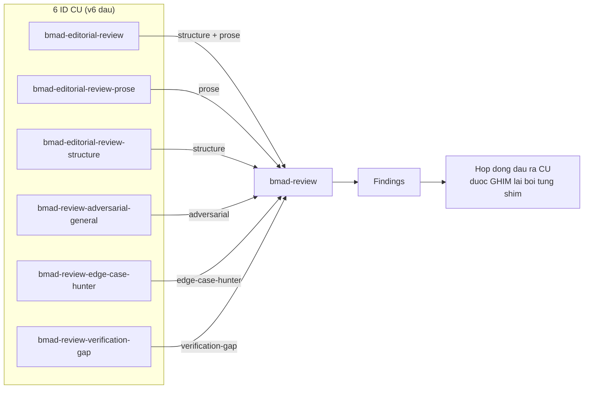
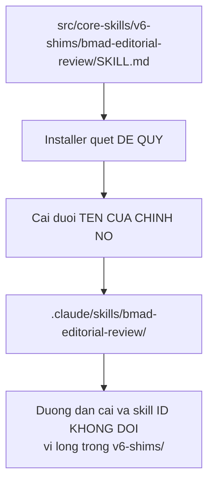
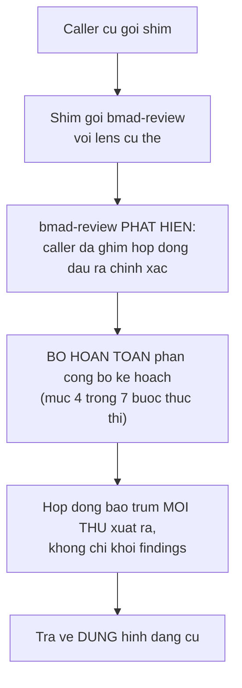
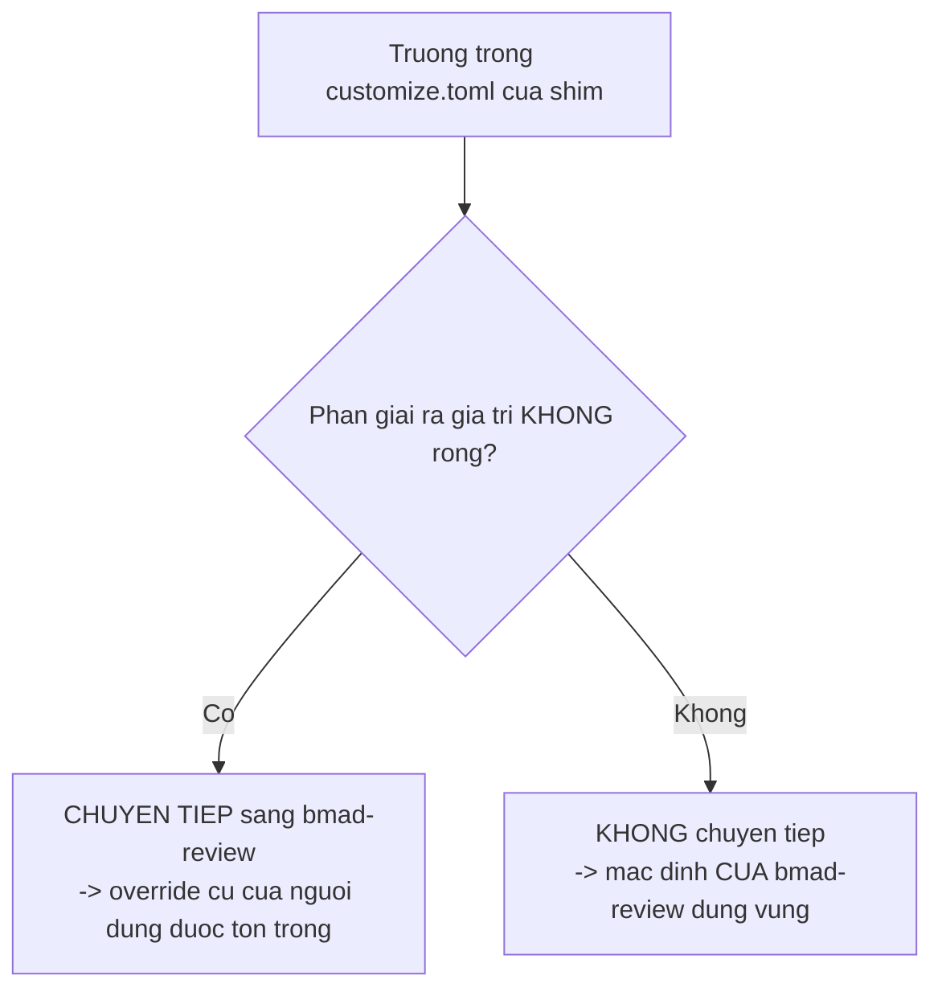
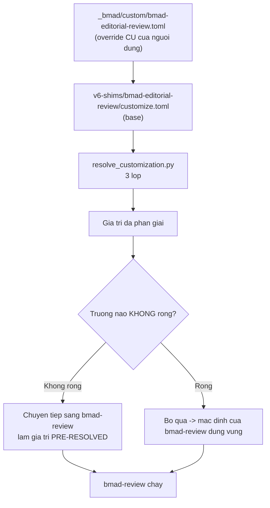
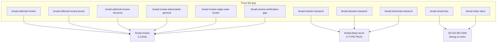

# B9 — `v6-shims` (6 skill chuyển tiếp)

> [← Chỉ mục](./index.md) · Trước: [B8](./B8-bmad-party-mode.md) · Tiếp: [C1 — Sổ tay vận hành thủ công](./C1-so-tay-van-hanh-thu-cong.md)

---

## 1. Shim là gì

Skill trong `src/core-skills/v6-shims/` là **forwarder** (bộ chuyển tiếp) giữ tương thích ngược với ID skill của v6.

> *Each one **holds no logic of its own** — it forwards to the skill that replaced it, **pinning the legacy output contract** so existing callers keep working.*



---

## 2. Bảng ánh xạ

| Shim | Chuyển tiếp tới | Lens |
| --- | --- | --- |
| `bmad-editorial-review` | `bmad-review` | `structure` **+** `prose` |
| `bmad-editorial-review-prose` | `bmad-review` | `prose` |
| `bmad-editorial-review-structure` | `bmad-review` | `structure` |
| `bmad-review-adversarial-general` | `bmad-review` | `adversarial` |
| `bmad-review-edge-case-hunter` | `bmad-review` | `edge-case-hunter` |
| `bmad-review-verification-gap` | `bmad-review` | `verification-gap` |

---

## 3. Vì sao chúng vẫn tồn tại

| Lý do | Chi tiết |
| --- | --- |
| **Module ngoài vẫn gọi các ID này** | `gds`, `bmad-loop`, `tea`, `bmb`, `os-utils` |
| Nên chúng **ship mặc định** | Không thể bỏ mà không phá module ngoài |
| **Việc gỡ bỏ đi cùng bản cắt v7** | *"never a 6.x minor"* |
| Tùy chọn cài trong tương lai | Sẽ cho phép người dùng bao gồm hoặc loại trừ thư mục này trước khi nó bị gỡ hẳn |

---

## 4. Thư mục `v6-shims/` chỉ để nhóm

> *The folder is **grouping only**: the installer **discovers skills recursively** and installs each one under **its own `name`**, so **nesting here does not change any installed path or skill ID**.*



Kiểm chứng:

```bash
ls .claude/skills/ | grep -E "editorial|adversarial|edge-case|verification"
```

Kết quả cho thấy chúng nằm **phẳng** cạnh các skill khác, không có tầng `v6-shims`.

---

## 5. Cơ chế "ghim hợp đồng đầu ra"

Đây là điểm thiết kế quan trọng nhất. Mỗi shim **không chỉ** chọn lens — nó còn **ràng buộc chính xác hình dạng đầu ra** mà caller cũ mong đợi.



Trích `bmad-review/SKILL.md`:

> *Skip the announcement entirely when the caller **pinned an exact output contract** (the legacy forwarders that demand raw JSON or one exact line) — **their contract covers everything you emit, not just the findings block**.*

Và:

> *Present per `{workflow.output_format}` ... **unless the caller requested a specific shape; a legacy forwarder's output contract always wins**.*

---

## 6. Sáu hợp đồng đầu ra — chi tiết từng cái

### 6.1 `bmad-editorial-review`

**Skill duy nhất trong nhóm shim có `customize.toml` riêng.**

| Khía cạnh | Nội dung |
| --- | --- |
| Lens | `structure` **và** `prose` — **cả hai, structure trước**, để prose chạy **trên nền** findings của structure |
| Ngoại lệ | Trừ khi caller yêu cầu review chỉ-structure hoặc chỉ-prose ⇒ chỉ truyền lens đó |
| Truyền qua | Mọi vùng `also_consider` |

**Chuyển tiếp customization đã phân giải:**

Shim chuyển 9 trường sang `bmad-review` **dưới dạng giá trị đã phân giải sẵn**:

```
reader_type, style_guide, review_guidance, output_preferences,
persistent_facts, activation_steps_prepend, activation_steps_append,
on_complete, review_output_path (làm report path)
```

**Quy tắc then chốt:**

> *but **only those that resolved to something**, since **an empty value here means no legacy override exists** and **bmad-review's own default should stand**.*



Đây là cách shim giữ được override cũ của người dùng **mà không đè lên** mặc định mới.

**Hình dạng đầu ra cũ:**

```
[Câu đọc hiểu purpose/audience]

| Pass | Original Text | Revised Text | Changes |
| ---- | ------------- | ------------- | ------- |
| ...  | ...           | ...           | ...     |

[Bản tóm tắt reduction — khi lens structure đã chạy]
```

> **và KHÔNG có đầu ra của lens nào khác.**

---

### 6.2 `bmad-editorial-review-prose`

| Khía cạnh | Nội dung |
| --- | --- |
| Lens | **Chỉ** `prose` |
| Truyền qua | Cùng đầu vào và mọi `also_consider` |

**Hình dạng đầu ra cũ:**

```
| Original Text | Revised Text | Changes |
| ------------- | ------------- | ------- |
| ...           | ...           | ...     |
```

| Ràng buộc | Nội dung |
| --- | --- |
| **Ba cột**, không phải bốn | **Không có cột `Pass`** |
| **Không có phần mở đầu** phía trên bảng | |
| Khi không tìm thấy vấn đề | **Xuất chính xác:** `No editorial issues identified` |

---

### 6.3 `bmad-editorial-review-structure`

| Khía cạnh | Nội dung |
| --- | --- |
| Lens | **Chỉ** `structure` |

**Hình dạng đầu ra cũ — KHÔNG phải bảng findings, mà là báo cáo ba khối:**

```markdown
## Document Summary
- purpose
- audience
- reader type
- structure model
- current length

## Recommendations
1. [CUT] ... — lý do, tác động số từ
2. [MERGE] ... — lý do, tác động số từ
3. [MOVE] ... — lý do, tác động số từ
...

## Summary
- Tổng số khuyến nghị: N
- Ước lượng giảm: X từ (Y%)
```

| Ràng buộc | Nội dung |
| --- | --- |
| Khối 1 | `## Document Summary` — purpose, audience, reader type, structure model, current length |
| Khối 2 | `## Recommendations` — danh sách **đánh số**, mỗi mục có tag `[CUT/MERGE/MOVE/CONDENSE/QUESTION/PRESERVE]`, kèm **lý do** và **tác động số từ** |
| Khối 3 | `## Summary` — tổng khuyến nghị, ước lượng giảm |
| **Không** dùng bảng findings | |
| Khi không tìm thấy vấn đề cấu trúc | **Xuất chính xác:** `No substantive changes recommended` |

---

### 6.4 `bmad-review-adversarial-general`

| Khía cạnh | Nội dung |
| --- | --- |
| Lens | **Chỉ** `adversarial` |
| Truyền qua | Mọi `also_consider` |

**Hình dạng đầu ra cũ:**

| Ràng buộc | Nội dung |
| --- | --- |
| Định dạng | **Danh sách Markdown** |
| Nội dung | **Chỉ mô tả** |
| **Cấm** | severity, priority, ranking |
| **Cấm** | khối JSON |

---

### 6.5 `bmad-review-edge-case-hunter`

| Khía cạnh | Nội dung |
| --- | --- |
| Lens | **Chỉ** `edge-case-hunter` |
| Truyền qua | Mọi `also_consider` |

**Hình dạng đầu ra cũ — nghiêm ngặt nhất:**

> *Output **ONLY the raw findings JSON array** in the legacy shape: the four standard fields (plus `kind`/`confidence` on deletion findings), **no `lens` field, no markdown wrapping, no extra text**. `[]` is valid when nothing is found.*

```json
[
  {
    "location": "src/auth.js:45-52",
    "trigger_condition": "Token hết hạn đúng lúc request đang bay",
    "guard_snippet": "Kiểm tra exp trước khi gửi, không phải sau khi nhận 401",
    "potential_consequence": "Người dùng bị đăng xuất giữa thao tác, mất dữ liệu form"
  }
]
```

| Ràng buộc | Nội dung |
| --- | --- |
| **4 trường chuẩn** | `location`, `trigger_condition`, `guard_snippet`, `potential_consequence` |
| Thêm cho finding xóa mã | `kind`, `confidence` |
| **KHÔNG có** trường `lens` | |
| **KHÔNG bọc markdown** | Không có ` ```json ` |
| **KHÔNG có text thừa** | |
| `[]` hợp lệ | Khi không tìm thấy gì |

**Đây cũng là shim duy nhất mà `bmad-review` có xử lý đặc biệt cho nội dung rỗng:**

Trích `bmad-review/SKILL.md` bước 2:

> *when the caller expects the raw findings JSON array (e.g. **the legacy edge-case forwarder**), return `[{"location":"N/A","trigger_condition":"Input empty or undecodable","guard_snippet":"Provide valid content to review","potential_consequence":"Review skipped — no analysis performed"}]` (**no `lens` field**) and stop.*

---

### 6.6 `bmad-review-verification-gap`

| Khía cạnh | Nội dung |
| --- | --- |
| Lens | **Chỉ** `verification-gap` |

**Hình dạng đầu ra cũ:**

| Ràng buộc | Nội dung |
| --- | --- |
| Chỉ **markdown rendering** | **Không** khối JSON |
| Finding có `gap_shape: "other"` | Liệt kê dưới heading `## Other findings` |
| Khi **hoàn toàn không có** finding | **Xuất chính xác một dòng này:** `No verification gaps found.` |

---

## 7. Bảng đối chiếu hợp đồng đầu ra

| Shim | Định dạng | Trường `lens`? | Wrapper? | Câu khi rỗng |
| --- | --- | --- | --- | --- |
| `bmad-editorial-review` | Bảng 4 cột + đọc hiểu + reduction | — | Markdown | *(không quy định)* |
| `bmad-editorial-review-prose` | Bảng **3 cột**, không preamble | — | Markdown | `No editorial issues identified` |
| `bmad-editorial-review-structure` | **3 khối `##`**, không bảng | — | Markdown | `No substantive changes recommended` |
| `bmad-review-adversarial-general` | **Danh sách** markdown | — | Markdown | *(không quy định)* |
| `bmad-review-edge-case-hunter` | **JSON thô** | ❌ **Bỏ** | ❌ **Không** | `[]` |
| `bmad-review-verification-gap` | Markdown, `## Other findings` | — | Markdown | `No verification gaps found.` |

---

## 8. `customize.toml` của `bmad-editorial-review`

Đây là shim **duy nhất** giữ `customize.toml`:

> *`bmad-editorial-review` **keeps its `customize.toml`** so existing team and user overrides still resolve; the shim **forwards those resolved values** to `bmad-review`.*



**Ý nghĩa thực tế:** nếu bạn đã có `_bmad/custom/bmad-editorial-review.toml` từ thời v6, nó **vẫn hoạt động** — không cần chuyển sang `bmad-review.toml`.

---

## 9. Ba shim khác trong module `bmm`

Ngoài 6 shim của core, module `bmm` có **13 shim** trong `src/bmm-skills/v6-shims/`:

| Shim | Chuyển tiếp tới |
| --- | --- |
| `bmad-create-prd` | `bmad-prd` |
| `bmad-edit-prd` | `bmad-prd` |
| `bmad-validate-prd` | `bmad-prd` |
| `bmad-create-architecture` | `bmad-architecture` |
| `bmad-create-story` | `bmad-create-epics-and-stories` |
| `bmad-dev-story` | `bmad-build` |
| `bmad-dev-auto` | `bmad-build-auto` |
| `bmad-quick-dev` | `bmad-build` |
| `bmad-sprint-status` | `bmad-sprint-planning` (action `status`) |
| `bmad-document-project` | `bmad-project-context` |
| `bmad-market-research` | `bmad-deep-recon` (type `market`) |
| `bmad-domain-research` | `bmad-deep-recon` (type `domain`) |
| `bmad-technical-research` | `bmad-deep-recon` (type `technical`) |

Ba shim cuối chuyển tiếp sang **`bmad-deep-recon` của core** — đây là ví dụ module `bmm` chuyển tiếp sang skill của module `core`.

Cơ chế "kích hoạt được chuyển tiếp" của `bmad-deep-recon` xử lý điều này:

> *if a caller invoked you with a stated intent, research type, or pre-resolved customization fields (**the legacy research shims** and Mary's menu do), **honor them verbatim** — skip your own inference for those values and resolve only the rest.*

---

## 10. Tổng hợp lịch sử gộp v6



| Nhóm | Số skill cũ | Skill mới | Số shim | Ghi chú |
| --- | --- | --- | --- | --- |
| Review | 6 | `bmad-review` | **6** | Mọi ID cũ vẫn phân giải |
| Research | 3 | `bmad-deep-recon` | **3** (ở bmm) | Trở thành `research_types` |
| Docs utility | 2 | — | **0** | `bmad-shard-doc` và `bmad-index-docs` **bị gỡ bỏ hẳn** |

> Trích `docs/reference/core-tools.md`: *"The `bmad-shard-doc` and `bmad-index-docs` utilities **have been removed**."* — không có shim cho hai cái này.

---

## 11. Vận hành thủ công

### 11.1 Xem shim nào đã cài

```bash
R="$(pwd)"

# Shim của core
ls .claude/skills/ | grep -E "^bmad-(editorial-review|review-(adversarial|edge-case|verification))"

# Shim của bmm
ls .claude/skills/ | grep -E "^bmad-(create-prd|edit-prd|validate-prd|create-architecture|create-story|dev-story|dev-auto|quick-dev|sprint-status|document-project|market-research|domain-research|technical-research)$"
```

### 11.2 Đọc hợp đồng của một shim

```bash
cat .claude/skills/bmad-review-edge-case-hunter/SKILL.md
```

File chỉ **6 dòng** — 3 dòng frontmatter + 1 dòng trống + 1 đoạn văn. Toàn bộ "logic" là đoạn văn đó.

### 11.3 Xem override cũ có còn phân giải không

```bash
uv run "$R/_bmad/scripts/resolve_customization.py" \
  -s "$R/.claude/skills/bmad-editorial-review" -p "$R" -k workflow
```

Nếu bạn có `_bmad/custom/bmad-editorial-review.toml`, giá trị của nó sẽ xuất hiện ở đây.

### 11.4 Kiểm tra shim nào trong manifest

```bash
grep -E "editorial|adversarial|edge-case|verification|market-research|domain-research|technical-research" \
  _bmad/_config/skill-manifest.csv
```

---

## 12. Khi nào nên chuyển khỏi shim

| Tình huống | Khuyến nghị |
| --- | --- |
| Dự án mới | **Dùng thẳng `bmad-review` / `bmad-deep-recon`** — đừng gọi shim |
| Dự án cũ, có override ở `bmad-editorial-review.toml` | Vẫn chạy được. Chuyển sang `bmad-review.toml` khi thuận tiện |
| Script/automation gọi ID cũ | Vẫn chạy được đến v7. **Lên lịch chuyển trước khi lên v7** |
| Module ngoài gọi ID cũ | Không kiểm soát được — chờ module cập nhật |

### 12.1 Cách chuyển override từ shim sang skill mới

```bash
R="$(pwd)"

# 1. Xem giá trị hiện tại của shim
uv run "$R/_bmad/scripts/resolve_customization.py" \
  -s "$R/.claude/skills/bmad-editorial-review" -p "$R" -k workflow

# 2. Xem giá trị hiện tại của bmad-review
uv run "$R/_bmad/scripts/resolve_customization.py" \
  -s "$R/.claude/skills/bmad-review" -p "$R" -k workflow

# 3. Chuyển các trường tương ứng sang _bmad/custom/bmad-review.toml
#    (reader_type, style_guide, review_guidance, output_preferences,
#     persistent_facts, activation_steps_*, on_complete,
#     review_output_path -> report_path)

# 4. Xác minh
uv run "$R/_bmad/scripts/resolve_customization.py" \
  -s "$R/.claude/skills/bmad-review" -p "$R" -k workflow
```

> Chú ý ánh xạ tên: shim dùng `review_output_path`, `bmad-review` dùng `report_path`.

---

## 13. Cạm bẫy

| Vấn đề | Nguyên nhân | Xử lý |
| --- | --- | --- |
| Shim trả về đầu ra sai hình dạng | Không tôn trọng hợp đồng đã ghim | Hợp đồng của forwarder **luôn thắng** `output_format` |
| Shim in thêm phần "công bố kế hoạch" | Vi phạm bước 4 của `bmad-review` | Hợp đồng bao trùm **mọi thứ** xuất ra |
| `edge-case-hunter` shim trả về có trường `lens` | Vi phạm §6.5 | **Bỏ trường `lens`** |
| `edge-case-hunter` shim bọc markdown | Vi phạm §6.5 | **JSON thô, không wrapper** |
| Override cũ ở shim "mất tác dụng" | Trường phân giải ra **rỗng** ⇒ không được chuyển tiếp | Đúng theo thiết kế — mặc định mới đứng vững |
| Câu "khi rỗng" sai chính tả | Ba shim yêu cầu **chuỗi chính xác** | `No editorial issues identified` / `No substantive changes recommended` / `No verification gaps found.` (**có dấu chấm**) |
| Tưởng thư mục `v6-shims/` đổi skill ID | Hiểu sai | *"grouping only"* — installer quét đệ quy, cài theo `name` riêng |

---

**Tiếp:** [C1 — Sổ tay vận hành thủ công](./C1-so-tay-van-hanh-thu-cong.md) · [← Chỉ mục](./index.md)
