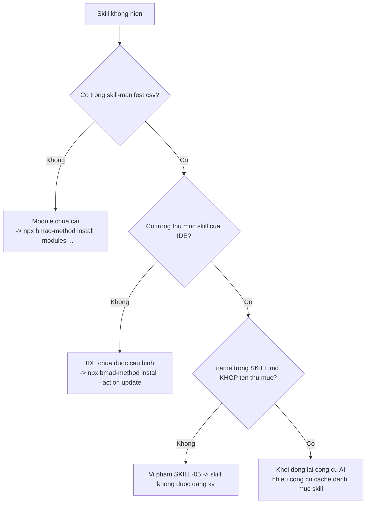
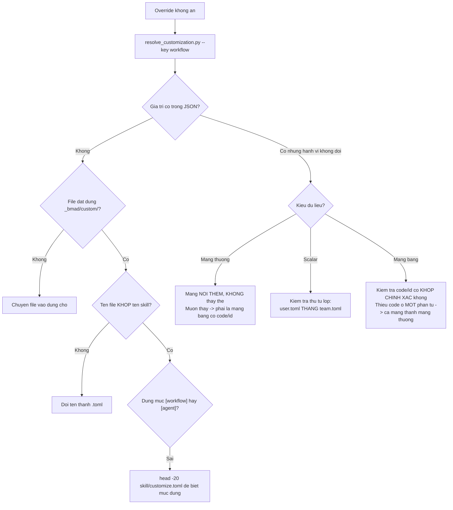
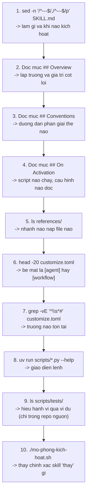

# C1 — Sổ tay vận hành thủ công

> [← Chỉ mục](./index.md) · Trước: [B9](./B9-v6-shims.md)
>
> Mục tiêu: **tự tay chạy mọi thứ mà LLM chạy**, để hiểu chính xác cơ chế — và để gỡ lỗi khi có gì đó sai.

---

## 1. Chuẩn bị

### 1.1 Biến môi trường dùng chung

Đặt một lần ở đầu mỗi phiên terminal:

```bash
# Bash / Git Bash
export R="$(pwd)"                    # project root
export SC="$R/_bmad/scripts"         # script dùng chung
export SK="$R/.claude/skills"        # thư mục skill của IDE
```

```powershell
# PowerShell
$R  = (Get-Location).Path
$SC = "$R\_bmad\scripts"
$SK = "$R\.claude\skills"
```

> Thay `.claude/skills` bằng `.agents/skills` nếu bạn dùng Cursor/Codex/Copilot.

### 1.2 Kiểm tra tiền điều kiện

```bash
node --version    # cần >= 20.12.0
uv --version      # cần có
git --version     # cần cho module ngoài
python --version  # cần >= 3.11 cho tomllib
```

### 1.3 Kiểm tra bản cài

```bash
ls -la "$R/_bmad"
ls -la "$R/_bmad/_config"
ls -la "$SC"
ls -1 "$SK" | grep bmad- | head -20
```

Đủ điều kiện làm việc khi thấy:

- [ ] `_bmad/config.toml`
- [ ] `_bmad/_config/manifest.yaml`, `skill-manifest.csv`, `files-manifest.csv`, `bmad-help.csv`
- [ ] `_bmad/scripts/` có 5 file `.py`
- [ ] `_bmad/custom/` tồn tại (có thể rỗng)
- [ ] Thư mục skill của IDE có các thư mục `bmad-*`

---

## 2. Bài tập 1 — Đọc trạng thái hệ thống

### 2.1 Module nào đã cài, phiên bản nào

```bash
cat "$R/_bmad/_config/manifest.yaml"
```

### 2.2 Skill nào đã đăng ký

```bash
# Đếm tổng
echo "Tổng skill: $(( $(wc -l < "$R/_bmad/_config/skill-manifest.csv") - 1 ))"

# Theo module
awk -F'","' 'NR>1 { gsub(/"/,"",$4); print $4 }' "$R/_bmad/_config/skill-manifest.csv" | sort | uniq -c

# Danh sách skill core
grep ',"core",' "$R/_bmad/_config/skill-manifest.csv" | cut -d'"' -f2
```

### 2.3 Cấu hình hợp nhất 4 lớp

```bash
uv run "$SC/resolve_config.py" --project-root "$R"
```

Xem từng lớp riêng để hiểu cái gì đến từ đâu:

```bash
echo "───── LỚP 1: installer, team ─────"
cat "$R/_bmad/config.toml"

echo "───── LỚP 2: installer, user ─────"
cat "$R/_bmad/config.user.toml"

echo "───── LỚP 3: bạn, team ─────"
cat "$R/_bmad/custom/config.toml" 2>/dev/null || echo "(chưa có)"

echo "───── LỚP 4: bạn, user ─────"
cat "$R/_bmad/custom/config.user.toml" 2>/dev/null || echo "(chưa có)"

echo "───── KẾT QUẢ HỢP NHẤT ─────"
uv run "$SC/resolve_config.py" --project-root "$R"
```

### 2.4 Catalog trợ giúp

```bash
# Xem dạng bảng
column -s, -t < "$R/_bmad/_config/bmad-help.csv" | less -S

# Chỉ mục bắt buộc
awk -F',' 'NR>1 && $11=="true" { printf "[%s] %-32s %s\n", $4, $2, $12 }' \
  "$R/_bmad/_config/bmad-help.csv"

# Chỉ mục anytime
awk -F',' 'NR>1 && $8=="anytime" { printf "[%s] %s\n", $4, $2 }' \
  "$R/_bmad/_config/bmad-help.csv"
```

---

## 3. Bài tập 2 — Chứng minh cơ chế hợp nhất 3 lớp

Bài tập này cho thấy **chính xác** cách override hoạt động.

### 3.1 Xem trạng thái ban đầu

```bash
S="$SK/bmad-review"

echo "───── BASE (customize.toml) ─────"
grep -vE "^\s*#" "$S/customize.toml" | grep -vE "^\s*$" | head -30

echo "───── ĐÃ HỢP NHẤT ─────"
uv run "$SC/resolve_customization.py" -s "$S" -p "$R" -k workflow.style_guide
uv run "$SC/resolve_customization.py" -s "$S" -p "$R" -k workflow.report_path
uv run "$SC/resolve_customization.py" -s "$S" -p "$R" -k workflow.persistent_facts
```

### 3.2 Thêm lớp team và quan sát

```bash
mkdir -p "$R/_bmad/custom"

cat > "$R/_bmad/custom/bmad-review.toml" <<'TOML'
[workflow]
style_guide = "file:{project-root}/docs/style-guide-vi.md"
persistent_facts = ["Tổ chức chỉ dùng AWS."]
TOML

echo "───── SAU KHI THÊM LỚP TEAM ─────"
uv run "$SC/resolve_customization.py" -s "$S" -p "$R" -k workflow.style_guide
uv run "$SC/resolve_customization.py" -s "$S" -p "$R" -k workflow.persistent_facts
```

**Quan sát:**

| Trường | Kiểu | Trước | Sau | Kết luận |
| --- | --- | --- | --- | --- |
| `style_guide` | scalar | `"Microsoft Writing Style Guide"` | `"file:{project-root}/docs/style-guide-vi.md"` | **Override thắng** |
| `persistent_facts` | mảng | `["file:.../project-context.md"]` | `["file:.../project-context.md", "Tổ chức chỉ dùng AWS."]` | **Nối thêm** |

### 3.3 Thêm lớp user và quan sát

```bash
cat > "$R/_bmad/custom/bmad-review.user.toml" <<'TOML'
[workflow]
style_guide = "Tôi thích Google Developer Style Guide."
persistent_facts = ["Tôi thích Python có type hint đầy đủ."]
TOML

echo "───── SAU KHI THÊM LỚP USER ─────"
uv run "$SC/resolve_customization.py" -s "$S" -p "$R" -k workflow.style_guide
uv run "$SC/resolve_customization.py" -s "$S" -p "$R" -k workflow.persistent_facts
```

**Quan sát:**

```json
{"workflow.style_guide": "Tôi thích Google Developer Style Guide."}
```

```json
{"workflow.persistent_facts": [
  "file:{project-root}/**/project-context.md",
  "Tổ chức chỉ dùng AWS.",
  "Tôi thích Python có type hint đầy đủ."
]}
```

> **Scalar: lớp user thắng cả base lẫn team. Mảng: cả ba đều còn, đúng thứ tự.**

### 3.4 Chứng minh mảng bảng khóa `code`

```bash
cat > "$R/_bmad/custom/bmad-review.toml" <<'TOML'
[workflow]

# code "prose" ĐÃ TỒN TẠI ⇒ THAY THẾ toàn bộ mục cũ
[[workflow.lenses]]
code = "prose"
name = "Editorial Prose"
applies_to = "docs"
instruction = ""

# code "accessibility" CHƯA CÓ ⇒ NỐI vào cuối
[[workflow.lenses]]
code = "accessibility"
name = "Khả năng tiếp cận"
applies_to = "any"
when = "Mã UI hoặc tài liệu hướng tới người dùng cuối."
instruction = "Rà soát theo WCAG 2.2 AA."
TOML

uv run "$SC/resolve_customization.py" -s "$S" -p "$R" -k workflow.lenses \
  | python -c "
import json,sys
d = json.load(sys.stdin)
print(f\"{'STT':<4} {'CODE':<20} {'TRẠNG THÁI':<8} {'APPLIES_TO':<8} AFTER\")
print('─' * 60)
for i, l in enumerate(d.get('workflow.lenses', []), 1):
    st = 'BẬT' if l.get('instruction','').strip() else 'TẮT'
    print(f\"{i:<4} {l['code']:<20} {st:<8} {l.get('applies_to','?'):<8} {l.get('after','-')}\")
"
```

Kết quả mong đợi:

```
STT  CODE                 TRẠNG THÁI APPLIES_TO AFTER
────────────────────────────────────────────────────────────
1    adversarial          BẬT      any      -
2    edge-case-hunter     BẬT      any      -
3    verification-gap     BẬT      code     -
4    structure            BẬT      docs     -
5    prose                TẮT      docs     -
6    accessibility        BẬT      any      -
```

**Ba điều rút ra:**

1. `prose` bị **thay thế tại chỗ** (vẫn ở vị trí 5), **mất `after = "structure"`** vì bạn không viết lại
2. `accessibility` **nối vào cuối** (vị trí 6)
3. `instruction = ""` ⇒ lens **bị tắt** nhưng vẫn có trong danh sách

### 3.5 Chứng minh lỗi thiếu khóa

```bash
cat > "$R/_bmad/custom/bmad-review.toml" <<'TOML'
[workflow]

# THIẾU `code` — quan sát chuyện gì xảy ra
[[workflow.lenses]]
name = "Không có code"
applies_to = "any"
instruction = "..."
TOML

uv run "$SC/resolve_customization.py" -s "$S" -p "$R" -k workflow.lenses \
  | python -c "import json,sys; print('Số lens:', len(json.load(sys.stdin)['workflow.lenses']))"
```

Kết quả: **6 lens** (5 base + 1 mới nối vào), **không phải 5**. Vì một phần tử thiếu `code` ⇒ toàn mảng bị coi là mảng thường ⇒ **nối thay vì thay thế**.

### 3.6 Dọn dẹp

```bash
rm -f "$R/_bmad/custom/bmad-review.toml" "$R/_bmad/custom/bmad-review.user.toml"
uv run "$SC/resolve_customization.py" -s "$S" -p "$R" -k workflow.style_guide
```

---

## 4. Bài tập 3 — Mô phỏng kích hoạt một skill

Chạy **đúng** các lệnh mà `SKILL.md` yêu cầu, xem skill "thấy" gì.

### 4.1 Script mô phỏng

```bash
#!/usr/bin/env bash
# mo-phong-kich-hoat.sh <tên-skill>
set -u
R="$(pwd)"
SC="$R/_bmad/scripts"
SKILL="${1:?Cần tên skill, ví dụ: bmad-review}"
S="$R/.claude/skills/$SKILL"

[ -d "$S" ] || { echo "Không tìm thấy $S"; exit 1; }

echo "══════════════════════════════════════════════════"
echo "  MÔ PHỎNG KÍCH HOẠT: $SKILL"
echo "══════════════════════════════════════════════════"

echo
echo "── BƯỚC 0: Frontmatter (thứ quyết định khi nào skill kích hoạt) ──"
sed -n '/^---$/,/^---$/p' "$S/SKILL.md"

echo
echo "── BƯỚC 1: Phân giải tùy biến ──"
if [ -f "$S/customize.toml" ]; then
  SURFACE=$(grep -m1 -E "^\[(agent|workflow)\]" "$S/customize.toml" | tr -d '[]')
  echo "Bề mặt: [$SURFACE]"
  uv run "$SC/resolve_customization.py" -s "$S" -p "$R" -k "$SURFACE" 2>&1 | head -60
else
  echo "(skill này không có customize.toml — không tùy biến được)"
fi

echo
echo "── BƯỚC 2/3: Hook và persistent_facts ──"
if [ -f "$S/customize.toml" ]; then
  for KEY in activation_steps_prepend persistent_facts activation_steps_append; do
    echo -n "  $KEY = "
    uv run "$SC/resolve_customization.py" -s "$S" -p "$R" -k "workflow.$KEY" 2>/dev/null \
      | python -c "import json,sys; d=json.load(sys.stdin); print(d.get(list(d)[0]) if d else '(không có)')" 2>/dev/null \
      || echo "(không có)"
  done
fi

echo
echo "── BƯỚC 3b: persistent_facts glob ra file nào? ──"
find "$R" -name "project-context.md" -not -path "*/node_modules/*" 2>/dev/null | head -5 \
  || echo "  (chưa có project-context.md)"

echo
echo "── BƯỚC 4: Cấu hình trung tâm ──"
uv run "$SC/resolve_config.py" -p "$R" -k core

echo
echo "── BƯỚC 5: File references sẵn có (nạp just-in-time) ──"
[ -d "$S/references" ] && ls -1 "$S/references" | sed 's/^/  /' || echo "  (không có references/)"

echo
echo "── BƯỚC 6: Asset ──"
[ -d "$S/assets" ] && ls -1 "$S/assets" | sed 's/^/  /' || echo "  (không có assets/)"

echo
echo "── BƯỚC 7: Script riêng ──"
[ -d "$S/scripts" ] && ls -1 "$S/scripts"/*.py 2>/dev/null | xargs -n1 basename | sed 's/^/  /' \
  || echo "  (không có scripts/)"

echo
echo "══════════════════════════════════════════════════"
echo "  Đó là TOÀN BỘ trạng thái skill có sau kích hoạt."
echo "  Mọi thứ sau đó là suy luận của LLM dựa trên SKILL.md."
echo "══════════════════════════════════════════════════"
```

### 4.2 Chạy

```bash
chmod +x mo-phong-kich-hoat.sh
./mo-phong-kich-hoat.sh bmad-review
./mo-phong-kich-hoat.sh bmad-brainstorming
./mo-phong-kich-hoat.sh bmad-party-mode
./mo-phong-kich-hoat.sh bmad-help          # skill không có customize.toml
```

---

## 5. Bài tập 4 — Chạy tay từng script riêng của skill

### 5.1 `pick_methods.py` (advanced-elicitation)

```bash
S="$SK/bmad-advanced-elicitation"
CSV="$S/assets/methods.csv"

uv run "$S/scripts/pick_methods.py" --help
uv run "$S/scripts/pick_methods.py" --file "$CSV" categories
uv run "$S/scripts/pick_methods.py" --file "$CSV" list --category risk
uv run "$S/scripts/pick_methods.py" --file "$CSV" show "Pre-Mortem"
uv run "$S/scripts/pick_methods.py" --file "$CSV" random -n 5 --spread
```

### 5.2 `brain.py` (brainstorming)

```bash
S="$SK/bmad-brainstorming"
CSV="$S/assets/brain-methods.csv"

uv run "$S/scripts/brain.py" --help
uv run "$S/scripts/brain.py" --file "$CSV" categories
uv run "$S/scripts/brain.py" --file "$CSV" list --category "structured"
uv run "$S/scripts/brain.py" --file "$CSV" show "SCAMPER"
uv run "$S/scripts/brain.py" --file "$CSV" random --category "creative" -n 4

# Sinh trang chọn phiên
uv run "$S/scripts/brain.py" --file "$CSV" html --out /tmp/selector.html
```

**Thử điều bị cấm:**

```bash
uv run "$S/scripts/brain.py" --file "$CSV" list
# → script TỪ CHỐI. Đây là chống-lỗi cố ý: không thể vô tình đổ cả thư viện.
```

### 5.3 `list_customizable_skills.py` (customize)

```bash
uv run "$SK/bmad-customize/scripts/list_customizable_skills.py" --project-root "$R"
```

### 5.4 `resolve_party.py` (party-mode)

```bash
S="$SK/bmad-party-mode"

uv run "$S/scripts/resolve_party.py" --project-root "$R" --skill "$S"
uv run "$S/scripts/resolve_party.py" --project-root "$R" --skill "$S" --list-groups
uv run "$S/scripts/resolve_party.py" --project-root "$R" --skill "$S" --party code-review-crew
```

### 5.5 `resolve_personas.py` (forge-idea)

```bash
S="$SK/bmad-forge-idea"
uv run "$S/scripts/resolve_personas.py" --project-root "$R" --skill "$S"
```

### 5.6 `recon_kit.py` (deep-recon)

```bash
S="$SK/bmad-deep-recon"

uv run "$S/scripts/recon_kit.py" --help
uv run "$S/scripts/recon_kit.py" slug "thị trường SaaS quản lý kho" \
  --type market --pattern "{research_type}-{topic_slug}-{date}"
```

### 5.7 `word_metrics.py` (review)

```bash
S="$SK/bmad-review"
uv run "$S/scripts/word_metrics.py" --help
uv run "$S/scripts/word_metrics.py" tai-lieu-core/index.md
```

---

## 6. Bài tập 5 — Chạy tay memlog trọn vòng đời

```bash
W="$R/_bmad-output/thu-nghiem-memlog"

# ── init ──────────────────────────────────────────────────────
uv run "$SC/memlog.py" init --workspace "$W" \
  --field topic="Học cách memlog hoạt động" \
  --field goal="hiểu ba bất biến"

cat "$W/.memlog.md"
```

```markdown
---
topic: Học cách memlog hoạt động
goal: hiểu ba bất biến
updated: 2026-08-11T17:02
---


```

```bash
# ── append với nhiều biến thể ─────────────────────────────────
uv run "$SC/memlog.py" append --workspace "$W" --type note --text "mục thường"
uv run "$SC/memlog.py" append --workspace "$W" --type idea --text "có type"
uv run "$SC/memlog.py" append --workspace "$W" --type idea --by user --text "có type và by"
uv run "$SC/memlog.py" append --workspace "$W" --by coach --text "chỉ có by"
uv run "$SC/memlog.py" append --workspace "$W" --text "không type không by"

cat "$W/.memlog.md"
```

```markdown
---
topic: Học cách memlog hoạt động
goal: hiểu ba bất biến
updated: 2026-08-11T17:03
---

- (note) mục thường
- (idea) có type
- (idea by user) có type và by
- (by coach) chỉ có by
- không type không by
```

```bash
# ── Chứng minh text bị gộp thành một dòng ─────────────────────
uv run "$SC/memlog.py" append --workspace "$W" --type note --text "dòng một
dòng hai      nhiều      khoảng trắng"

tail -1 "$W/.memlog.md"
# → "- (note) dòng một dòng hai nhiều khoảng trắng"
```

```bash
# ── set frontmatter ───────────────────────────────────────────
uv run "$SC/memlog.py" set --workspace "$W" --key status --value complete
head -8 "$W/.memlog.md"
```

```bash
# ── Chứng minh init không gọi mù được ─────────────────────────
uv run "$SC/memlog.py" init --workspace "$W" --field topic="x"
echo "Mã thoát: $?"
# → error: ... already exists; use append/set to update it
# → Mã thoát: 2
```

```bash
# ── Chứng minh --workspace và --path loại trừ nhau ────────────
uv run "$SC/memlog.py" append --workspace "$W" --path "$W/.memlog.md" --text "x"
# → lỗi: not allowed with argument

# Dùng --path thay thế
uv run "$SC/memlog.py" append --path "$W/.memlog.md" --type note --text "địa chỉ bằng --path"
```

```bash
# ── Dọn ───────────────────────────────────────────────────────
rm -rf "$W"
```

---

## 7. Bài tập 6 — Tự làm việc của `bmad-help`

```bash
#!/usr/bin/env bash
# tu-lam-help.sh
set -u
R="$(pwd)"
CSV="$R/_bmad/_config/bmad-help.csv"

echo "═══ CẤU HÌNH ĐƯỜNG DẪN ═══"
uv run "$R/_bmad/scripts/resolve_config.py" -p "$R" -k core -k modules

echo
echo "═══ TẠO PHẨM HIỆN CÓ ═══"
find "$R/_bmad-output" -maxdepth 2 -type f 2>/dev/null | sed "s|$R/|  |" | head -30
[ -f "$R/AGENTS.md" ] && echo "  AGENTS.md"
find "$R" -maxdepth 3 -name "project-context.md" -not -path "*/node_modules/*" 2>/dev/null | sed "s|$R/|  |"

echo
echo "═══ MỤC BẮT BUỘC (cổng chặn thật) ═══"
awk -F'","' 'NR>1 {
  gsub(/^"|"$/,"");
  split($0, f, "\",\"");
  if (f[11]=="true") printf "  [%s] %-32s → %s\n", f[4], f[2], f[12]
}' "$CSV" 2>/dev/null

echo
echo "═══ MỤC ANYTIME (luôn dùng được) ═══"
awk -F'","' 'NR>1 {
  split($0, f, "\",\"");
  if (f[8]=="anytime") printf "  [%s] %s\n", f[4], f[2]
}' "$CSV" 2>/dev/null
```

> Lưu ý: `awk` phân tách CSV thô sẽ sai với ô chứa dấu phẩy trong ngoặc kép. Dùng để nắm nhanh, không dùng cho tự động hóa nghiêm túc. Muốn chính xác thì dùng Python với module `csv`.

**Phiên bản Python chính xác hơn:**

```python
#!/usr/bin/env python3
# tu-lam-help.py
import csv, os, sys
from pathlib import Path

R = Path.cwd()
csv_path = R / "_bmad" / "_config" / "bmad-help.csv"

rows = list(csv.DictReader(csv_path.open(encoding="utf-8")))

print("═══ MỤC BẮT BUỘC ═══")
for r in rows:
    if r.get("required") == "true":
        print(f"  [{r['menu-code']}] {r['skill']:<32} → {r['output-location']}")

print("\n═══ MỤC ANYTIME ═══")
for r in rows:
    if r.get("phase") == "anytime" and r.get("skill") != "_meta":
        print(f"  [{r['menu-code']}] {r['skill']}")

print("\n═══ NGUỒN TÀI LIỆU (_meta) ═══")
for r in rows:
    if r.get("skill") == "_meta":
        print(f"  {r['module']}: {r['output-location']}")
```

```bash
uv run --python 3.11 tu-lam-help.py
```

---

## 8. Bài tập 7 — Kiểm tra toàn vẹn bản cài

```bash
#!/usr/bin/env bash
# kiem-tra-toan-ven.sh
set -u
R="$(pwd)"
FAIL=0

ok()   { echo "  ✓ $1"; }
bad()  { echo "  ✗ $1"; FAIL=1; }
warn() { echo "  ! $1"; }

echo "═══ 1. CẤU TRÚC THƯ MỤC ═══"
for d in _bmad _bmad/_config _bmad/scripts _bmad/custom _bmad/core; do
  [ -d "$R/$d" ] && ok "$d" || bad "$d"
done
[ -d "$R/_bmad/render" ] && ok "_bmad/render" || warn "_bmad/render (tạo lười, chưa có là bình thường)"

echo
echo "═══ 2. FILE MANIFEST ═══"
for f in _bmad/config.toml _bmad/config.user.toml \
         _bmad/_config/manifest.yaml _bmad/_config/skill-manifest.csv \
         _bmad/_config/files-manifest.csv _bmad/_config/bmad-help.csv; do
  [ -f "$R/$f" ] && ok "$f" || bad "$f"
done

echo
echo "═══ 3. SCRIPT RUNTIME ═══"
for s in config_utils.py resolve_config.py resolve_customization.py render_skill.py memlog.py; do
  [ -f "$R/_bmad/scripts/$s" ] && ok "$s" || bad "$s"
done
[ -d "$R/_bmad/scripts/tests" ] && bad "scripts/tests/ KHÔNG được cài vào dự án" || ok "không có scripts/tests/"
find "$R/_bmad/scripts" -name "__pycache__" -o -name "*.pyc" | grep -q . \
  && bad "có __pycache__ hoặc .pyc trong scripts/" || ok "không có cache Python"

echo
echo "═══ 4. GITIGNORE BẢO VỆ ═══"
grep -q '\*\.user\.toml' "$R/_bmad/custom/.gitignore" 2>/dev/null \
  && ok "custom/.gitignore chặn *.user.toml" || bad "custom/.gitignore thiếu *.user.toml"
grep -q '^\*$' "$R/_bmad/render/.gitignore" 2>/dev/null \
  && ok "render/.gitignore chặn snapshot" || warn "render/.gitignore chưa có"

echo
echo "═══ 5. SCRIPT CHẠY ĐƯỢC ═══"
uv run "$R/_bmad/scripts/resolve_config.py" -p "$R" >/dev/null 2>&1 \
  && ok "resolve_config.py" || bad "resolve_config.py lỗi"

FIRST_SKILL=$(ls -1 "$R/.claude/skills" 2>/dev/null | grep -m1 bmad-)
if [ -n "${FIRST_SKILL:-}" ] && [ -f "$R/.claude/skills/$FIRST_SKILL/customize.toml" ]; then
  uv run "$R/_bmad/scripts/resolve_customization.py" \
    -s "$R/.claude/skills/$FIRST_SKILL" -p "$R" >/dev/null 2>&1 \
    && ok "resolve_customization.py" || bad "resolve_customization.py lỗi"
fi

echo
echo "═══ 6. ĐỐI CHIẾU MANIFEST ↔ THƯ MỤC IDE ═══"
MAN=$(mktemp); IDE=$(mktemp)
tail -n +2 "$R/_bmad/_config/skill-manifest.csv" | cut -d'"' -f2 | sort > "$MAN"
ls -1 "$R/.claude/skills" 2>/dev/null | sort > "$IDE"
MISSING=$(comm -23 "$MAN" "$IDE")
EXTRA=$(comm -13 "$MAN" "$IDE")
[ -z "$MISSING" ] && ok "mọi skill trong manifest đều có ở IDE" \
  || { bad "thiếu ở IDE:"; echo "$MISSING" | sed 's/^/      /'; }
[ -z "$EXTRA" ] && ok "không có skill lạ ở IDE" \
  || { warn "có ở IDE nhưng không trong manifest:"; echo "$EXTRA" | sed 's/^/      /'; }
rm -f "$MAN" "$IDE"

echo
echo "═══ 7. TIỀN ĐIỀU KIỆN ═══"
node --version >/dev/null 2>&1 && ok "node $(node --version)" || bad "node"
uv --version >/dev/null 2>&1 && ok "$(uv --version)" || bad "uv"
git --version >/dev/null 2>&1 && ok "$(git --version)" || warn "git"

echo
[ $FAIL -eq 0 ] && echo "═══ KẾT QUẢ: ĐẠT ═══" || echo "═══ KẾT QUẢ: CÓ LỖI ═══"
exit $FAIL
```

---

## 9. Bài tập 8 — Chạy tay `render_skill.py`

Chỉ áp dụng cho skill có `workflow.md` (module `bmm`, không có trong core).

```bash
S="$SK/bmad-build"

# Kiểm tra skill có phải khuôn mẫu C không
[ -f "$S/workflow.md" ] && echo "Là workflow kết xuất" || echo "Không phải"

# Xem SKILL.md tối giản
cat "$S/SKILL.md"

# Chạy kết xuất
uv run --no-cache "$SC/render_skill.py" --project-root "$R" --skill "$S"
```

Đầu ra thành công:

```
read and follow D:/du-an/_bmad/render/bmad-build/du-an-a1b2c3d4e5f6/0123456789abcdef0123/workflow.md
```

### 9.1 Kiểm tra snapshot

```bash
GEN=$(uv run --no-cache "$SC/render_skill.py" --project-root "$R" --skill "$S" \
      | sed 's/^read and follow //' | xargs dirname)

echo "Thư mục generation: $GEN"
ls -la "$GEN"

# Manifest
cat "$GEN/manifest.json" | python -m json.tool | head -30

# So sánh nguồn vs kết xuất — xem token đã được thay
echo "───── NGUỒN ─────"
grep -n "{{\.\|{workflow\.\|bmad-snapshot" "$S/workflow.md" | head -10

echo "───── ĐÃ KẾT XUẤT ─────"
grep -n "communication_language\|_None_\|/render/" "$GEN/workflow.md" | head -10
```

### 9.2 Chứng minh tính tất định

```bash
# Chạy lần 2 — phải ra CÙNG đường dẫn
A=$(uv run --no-cache "$SC/render_skill.py" --project-root "$R" --skill "$S")
B=$(uv run --no-cache "$SC/render_skill.py" --project-root "$R" --skill "$S")
[ "$A" = "$B" ] && echo "✓ TẤT ĐỊNH — cùng generation" || echo "✗ khác nhau"
```

### 9.3 Chứng minh hash đổi khi override đổi

```bash
GEN1=$(uv run --no-cache "$SC/render_skill.py" -p "$R" --skill "$S" | xargs dirname)

# Thêm một override
mkdir -p "$R/_bmad/custom"
echo '[workflow]' > "$R/_bmad/custom/bmad-build.toml"
echo 'persistent_facts = ["Sự thật mới"]' >> "$R/_bmad/custom/bmad-build.toml"

GEN2=$(uv run --no-cache "$SC/render_skill.py" -p "$R" --skill "$S" | xargs dirname)

[ "$GEN1" != "$GEN2" ] && echo "✓ Override đổi ⇒ generation đổi" || echo "✗ không đổi"
echo "  cũ: $(basename "$GEN1")"
echo "  mới: $(basename "$GEN2")"

rm -f "$R/_bmad/custom/bmad-build.toml"
```

### 9.4 Chứng minh phát hiện hỏng

```bash
GEN=$(uv run --no-cache "$SC/render_skill.py" -p "$R" --skill "$S" | xargs dirname)

# Sửa tay một file trong snapshot
echo "DÒNG THÊM VÀO" >> "$GEN/workflow.md"

# Chạy lại — phải phát hiện
uv run --no-cache "$SC/render_skill.py" -p "$R" --skill "$S"
# → HALT: generation output hash mismatch: .../workflow.md

# Sửa: xóa generation hỏng
rm -rf "$GEN"
uv run --no-cache "$SC/render_skill.py" -p "$R" --skill "$S"
# → OK
```

---

## 10. Bảng tra cứu lệnh — toàn bộ core

```bash
R="$(pwd)"; SC="$R/_bmad/scripts"; SK="$R/.claude/skills"
```

### 10.1 Script dùng chung

| Việc | Lệnh |
| --- | --- |
| Cấu hình đầy đủ | `uv run "$SC/resolve_config.py" -p "$R"` |
| Chỉ mục core | `uv run "$SC/resolve_config.py" -p "$R" -k core` |
| Roster agent | `uv run "$SC/resolve_config.py" -p "$R" -k agents` |
| Một giá trị | `uv run "$SC/resolve_config.py" -p "$R" -k core.user_name` |
| Tùy biến skill | `uv run "$SC/resolve_customization.py" -s "$SK/<skill>" -p "$R" -k workflow` |
| Một trường | `uv run "$SC/resolve_customization.py" -s "$SK/<skill>" -p "$R" -k workflow.<field>` |
| Kết xuất workflow | `uv run --no-cache "$SC/render_skill.py" -p "$R" --skill "$SK/<skill>"` |
| Tạo memlog | `uv run "$SC/memlog.py" init --workspace <dir> --field k=v` |
| Ghi memlog | `uv run "$SC/memlog.py" append --workspace <dir> --type <t> --text "<s>" [--by <w>]` |
| Sửa frontmatter | `uv run "$SC/memlog.py" set --workspace <dir> --key <k> --value <v>` |

### 10.2 Script riêng của skill core

| Skill | Lệnh |
| --- | --- |
| advanced-elicitation | `uv run "$SK/bmad-advanced-elicitation/scripts/pick_methods.py" --file <csv> categories\|list\|show\|random` |
| brainstorming | `uv run "$SK/bmad-brainstorming/scripts/brain.py" --file <csv> categories\|list\|show\|random\|html` |
| customize | `uv run "$SK/bmad-customize/scripts/list_customizable_skills.py" --project-root "$R"` |
| deep-recon | `uv run "$SK/bmad-deep-recon/scripts/recon_kit.py" slug\|tally\|staleness\|citations\|escape-sources` |
| forge-idea | `uv run "$SK/bmad-forge-idea/scripts/resolve_personas.py" --project-root "$R" --skill "$SK/bmad-forge-idea"` |
| party-mode | `uv run "$SK/bmad-party-mode/scripts/resolve_party.py" --project-root "$R" --skill "$SK/bmad-party-mode" [--party <id>\|--list-groups]` |
| review | `uv run "$SK/bmad-review/scripts/word_metrics.py" <file>` |

### 10.3 Đọc file

| Việc | Lệnh |
| --- | --- |
| Frontmatter một skill | `sed -n '/^---$/,/^---$/p' "$SK/<skill>/SKILL.md"` |
| Bề mặt tùy biến | `head -20 "$SK/<skill>/customize.toml"` |
| Cấu trúc TOML không chú thích | `grep -vE "^\s*#" "$SK/<skill>/customize.toml" \| grep -vE "^\s*$"` |
| Liệt kê references | `ls -1 "$SK/<skill>/references/"` |
| Skill nào là agent | `grep -l "^\[agent\]" "$SK"/*/customize.toml` |
| Skill nào là workflow | `grep -l "^\[workflow\]" "$SK"/*/customize.toml` |
| Skill nào không tùy biến được | `for d in "$SK"/bmad-*/; do [ -f "$d/customize.toml" ] \|\| basename "$d"; done` |
| Skill nào là workflow kết xuất | `ls "$SK"/*/workflow.md 2>/dev/null \| xargs -n1 dirname \| xargs -n1 basename` |

---

## 11. Bảng ánh xạ lỗi

### 11.1 Lỗi `resolve_config.py` / `resolve_customization.py`

| Thông báo | Nguyên nhân | Xử lý |
| --- | --- | --- |
| `error: Python 3.11+ is required` (thoát 3) | Thiếu `tomllib` | `uv run --python 3.11 <script>` |
| `required TOML file not found: .../config.toml` | Chưa cài BMad, hoặc `--project-root` sai | Kiểm tra `ls _bmad/config.toml` |
| `TOML layer is not a file` | Đường dẫn trỏ vào thư mục | Kiểm tra đường dẫn |
| `failed to parse <path>: ...` | Cú pháp TOML sai | Thông báo có dòng/cột — sửa file |
| `keyed array identifier 'code' must be a string` | `code` sai kiểu | Đặt `code = "chuỗi"` |
| `keyed array identifier 'code' must not be empty` | `code = ""` | Đặt giá trị thật |
| JSON trả về `{}` | Khóa không tồn tại | **Bình thường** — script bỏ qua im lặng |

### 11.2 Lỗi `render_skill.py`

| Thông báo `HALT:` | Nguyên nhân | Xử lý |
| --- | --- | --- |
| `render entry is missing: .../workflow.md` | Skill không phải khuôn mẫu C | Chỉ chạy với skill có `workflow.md` |
| `ambiguous config value 'x' found at: a.b, c.d` | Token `{{.x}}` khớp nhiều nhánh | Đổi sang `{{config.a.b}}` đầy đủ |
| `missing config value 'x'` | Khóa không có sau hợp nhất | Bổ sung vào `_bmad/custom/config.toml` |
| `generation collision or corruption at ...` | Snapshot bị sửa tay | `rm -rf` thư mục generation đó |
| `generation output hash mismatch: .../file.md` | File trong snapshot bị sửa | Như trên |
| `generation contains unexpected or missing files` | Có file lạ trong snapshot | Như trên |
| `customization tokens require customize.toml` | Nguồn dùng `{workflow.*}` nhưng skill không có `customize.toml` | Lỗi đóng gói skill |
| `render source escapes skill directory` | Symlink trỏ ra ngoài | Gỡ symlink |
| `<label> must resolve to an absolute path` | Giá trị config có `{project-root}` nhưng không ra đường dẫn tuyệt đối | Kiểm tra giá trị trong `config.toml` |

### 11.3 Lỗi `memlog.py`

| Thông báo | Mã thoát | Xử lý |
| --- | --- | --- |
| `error: <path> already exists; use append/set to update it` | 2 | Dùng `append` thay vì `init` |
| `error: --field expects key=value, got 'x'` | 2 | Định dạng `--field key=value` |
| `.memlog.md has no frontmatter` | — | File hỏng — kiểm tra dòng đầu có phải `---` |
| `.memlog.md frontmatter is not terminated` | — | Thiếu `---` đóng |
| `not allowed with argument --workspace` | 2 | `--workspace` và `--path` loại trừ nhau |

### 11.4 Skill không xuất hiện trong công cụ AI



Lệnh kiểm tra bước cuối:

```bash
for d in "$SK"/bmad-*/; do
  NAME=$(sed -n 's/^name: *//p' "$d/SKILL.md" | head -1 | tr -d '"'"'"'')
  DIR=$(basename "$d")
  [ "$NAME" = "$DIR" ] || echo "✗ LỆCH: thư mục=$DIR name=$NAME"
done
```

### 11.5 Override không có tác dụng



---

## 12. Danh sách kiểm tra khi tự đọc một skill lạ



---

## 13. Bảng tổng hợp: 8 skill core

| Skill | Kích hoạt gọi script gì | Đọc cấu hình gì | Ghi ra đâu | Có `customize.toml` |
| --- | --- | --- | --- | :-: |
| `bmad-help` | `resolve_config.py` | `communication_language`, `project_knowledge` | *(không ghi)* | ❌ |
| `bmad-advanced-elicitation` | `resolve_customization.py`, `pick_methods.py`, *(tùy chọn)* `resolve_config.py --key agents` | `agents` | *(không ghi)* | ✅ |
| `bmad-review` | `resolve_customization.py`, `word_metrics.py` | *(không đọc trực tiếp)* | `report_path` hoặc chat | ✅ |
| `bmad-customize` | `list_customizable_skills.py`, `resolve_customization.py` | `user_name`, `communication_language` (đọc file trực tiếp) | `_bmad/custom/*.toml` | ❌ |
| `bmad-brainstorming` | `resolve_customization.py`, `resolve_config.py`, `brain.py`, `memlog.py` | `core.*` đầy đủ | `{output_dir}/{output_folder_name}/` | ✅ |
| `bmad-deep-recon` | `resolve_customization.py`, `resolve_config.py`, `recon_kit.py`, `memlog.py` | `core.*` + `modules.bmm.planning_artifacts` | `{research_output_path}/...` | ✅ |
| `bmad-forge-idea` | `resolve_customization.py`, `resolve_config.py`, `resolve_personas.py`, `memlog.py` | `user_name`, `communication_language`, `output_folder` | `{forge_output_path}/{slug}/` | ✅ |
| `bmad-party-mode` | `resolve_customization.py`, `resolve_config.py`, `resolve_party.py`, `memlog.py` | `user_name`, `communication_language`, `output_folder` | `{output_dir}/`, `{memory_dir}/<party>/` | ✅ |

---

## 14. Ba điều rút ra sau khi chạy tay

### 14.1 LLM không có "phép màu"

Toàn bộ trạng thái một skill có sau kích hoạt là:

1. Nội dung `SKILL.md`
2. JSON từ `resolve_customization.py`
3. JSON từ `resolve_config.py`
4. Nội dung các file `persistent_facts` trỏ tới

Bạn chạy được cả bốn thứ đó bằng tay. Mọi thứ sau đó là **suy luận** dựa trên chúng.

### 14.2 Mọi thứ tất định đều đã ở trong script

| Việc | Ai làm | Vì sao |
| --- | --- | --- |
| Hợp nhất TOML | Script | LLM không đáng tin với merge có quy tắc |
| Tính hash | Script | Phải chính xác tuyệt đối |
| Đếm claim | Script | *"never hand-counted"* |
| Escape HTML | Script | Bảo mật |
| Mở rộng tên thư mục | Script | Phải tất định |
| Kiểm tra trích dẫn cơ học | Script | So khớp chính xác |
| Đo số từ | Script | Nền tảng cho ước lượng |
| **Phán đoán** (phạm vi này đa mục tiêu chưa? kiến trúc này phân kỳ chưa?) | **LLM** | Script không mã hóa được |

### 14.3 Bạn có thể dùng BMad hoàn toàn thủ công

Nếu không có công cụ AI, bạn vẫn dùng được:

| Thứ | Cách dùng thủ công |
| --- | --- |
| Catalog phương pháp elicitation | `pick_methods.py show "<tên>"` rồi tự áp dụng |
| Thư viện kỹ thuật brainstorm | `brain.py html --out` rồi mở trang, tự chạy kỹ thuật |
| Phương pháp review | `cat references/lens-*.md` rồi tự soi tài liệu |
| Model cấu trúc tài liệu | `cat references/structure-models.md` |
| Gói loại nghiên cứu | `cat types/market.md` — dùng làm checklist nghiên cứu |
| Ghi tiến độ phiên | `memlog.py append` |
| Chín persona review | `grep -A5 "party_members" customize.toml` — dùng làm checklist góc nhìn |

---

## 15. Kết

Bộ tài liệu core kết thúc ở đây. Quay lại [Chỉ mục](./index.md) để xem toàn bộ bản đồ, hoặc sang [bộ tài liệu hệ thống](../tai-lieu-he-thong/README.md) để xem bức tranh toàn cảnh BMAD-METHOD.

| Muốn | Đọc |
| --- | --- |
| Hiểu cấu trúc module core | [A1](./A1-tong-quan-module-core.md) |
| Hiểu một skill được cấu thành thế nào | [A2](./A2-giai-phau-mot-skill.md) |
| Hiểu và viết override | [A3](./A3-cau-hinh-va-tuy-bien.md) |
| Tra cú pháp script | [A4](./A4-script-dung-chung.md) |
| Hiểu trình tự kích hoạt | [A5](./A5-giao-thuc-kich-hoat.md) |
| Chi tiết một skill cụ thể | [B1](./B1-bmad-help.md)–[B8](./B8-bmad-party-mode.md) |
| Tương thích ngược | [B9](./B9-v6-shims.md) |
| Bức tranh toàn hệ thống | [Tài liệu hệ thống](../tai-lieu-he-thong/README.md) |

---

**[← Chỉ mục](./index.md)**
